import Admonition from '@theme/Admonition';
import Tabs from '@theme/Tabs';
import TabItem from '@theme/TabItem';
import CodeBlock from '@theme/CodeBlock';
import LanguageSwitcher from "@site/src/components/LanguageSwitcher";
import LanguageContent from "@site/src/components/LanguageContent";
import Panel from "@site/src/components/Panel";
import ContentFrame from "@site/src/components/ContentFrame";

<Admonition type="note" title="">
 
* Revisions configuration settings can be managed from the **Document Revisions** view.  

* Learn more about revisions [here](../../../document-extensions/revisions/overview.mdx).

* In this article:
  * [Document revisions view](#document-revisions-view)  
  * [Revisions configuration](#revisions-configuration)  
  * [Define default configuration](#define-default-configuration)  
  * [Define collection-specific configuration](#define-collection-specific-configuration)  
  * [Edit conflicting document defaults](#edit-conflicting-document-defaults)  
     * [Conflicting documents example](#conflicting-documents-example)  
  * [Enforce configuration](#enforce-configuration)  

</Admonition>

<Panel heading="Document revisions view">

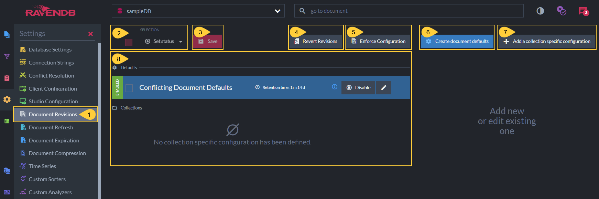

1. **Document Revisions View**  
   Click to open the **Document Revisions** view.  

2. **Set Status**  
   Check the selection box to select all configurations.  
   Click the _Set Status_ dropdown list to Enable or Disable selected configurations.  
   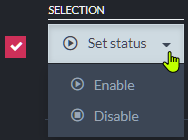  

3. **Save**  
   Click after modifying the configuration to apply your changes.  

4. **Revert Revisions**  
   Click to [revert the database](../../../document-extensions/revisions/revert-documents-to-revisions/revert-documents-to-specific-time.mdx) to its state at a specified point in time.  
   You can select whether to revert specific collections or revert all collections.  
   Only documents are reverted. Other entities (such as ongoing tasks) are not modified by this process.  

5. **Enforce Configuration**  
   Click to [enforce the revisions configuration](#enforce-configuration).  
   <Admonition type="warning" title="">
   This operation may delete many revisions irrevocably and require substantial 
   server resources.  
   Please read carefully the dedicated section.  
   </Admonition>  

6. **Create document defaults**  
   Click to define [default configuration](#define-default-configuration) 
   that will apply to documents in all collections that don't have a  
   collection-specific configuration defined.   

7. **Add a collection-specific configuration**  
   Click to create a [configuration for a specific collection](#define-collection-specific-configuration).  
   If default settings were defined, the collection-specific configuration will override them for this collection.  

8. **The defined Revisions configuration**  
   Read more [below](#revisions-configuration).  

</Panel>    
<Panel heading="Revisions configuration">    

* The Revisions configuration can include:  
  * **Default configuration** - applies to all document collections.  
  * **Collection-specific configurations** - override the default settings for these collections.  

* When no default configuration or collection-specific configurations are defined and enabled,  
  no revisions will be created for any document.

* When a revision configuration is defined,  
  its rules are applied to the revisions of a document upon any modification of the document. 

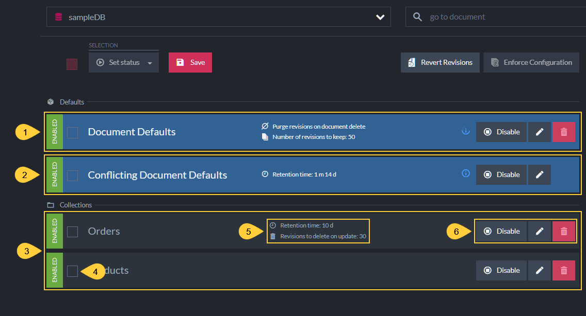

1. **Document Defaults**  
   This is the [default revisions configuration](#define-default-configuration) that applies to all non-conflicting documents in all collections  
   that don't have a collection-specific configuration defined.   
   These settings are optional and can be removed.  

2. **Conflicting Document Defaults**  
   This pre-defined revisions configuration is for conflicting documents only.  
   When enabled, a revision is created for each conflicting item.  
   A revision is also created for the conflict resolution document.      
    * The Conflicting Document Defaults configuration cannot be removed.  
    * You can [modify](#edit-conflicting-document-defaults) this configuration,  
      or disable it if not interested in tracking document conflicts using revisions.  
    * When "Document Defaults configuration" is defined, it **overrides** these conflict defaults.  
    * When a "Collection-specific configuration" is defined,  
      it also **overrides** these conflict defaults for the collection defined.  

3. **Collections**  
   These are optional collection-specific configurations whose settings override the Document Defaults  
   and the Conflicting Document Defaults for the collections they are defined for.  

4. **Selection Box**  
   Click to select this configuration.  
   Selected configurations can be enabled or disabled using the **Set status** button.  

5. **Configuration Settings**  
   Read more about the available settings in the sections dedicated to defining them below.  

6. **Controls**  
    * **Disable/Enable** - Click to Enable or Disable the configuration.  
    * **Edit** - Click to modify the configuration.  
    * **Remove** - Click to remove the configuration.  

</Panel>    
<Panel heading="Define default configuration">     

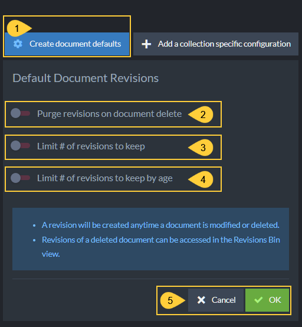

1. **Create document defaults**  
   Click to define default configuration that will apply to non-conflicting documents in all collections  
   that don't have a collection-specific configuration defined.  

2. **Purge revisions on document delete**  
   Enable if you want document revisions to be deleted when their parent document is deleted.

3. **Limit # of revisions to keep** <a id="limit-revisions"/>  
   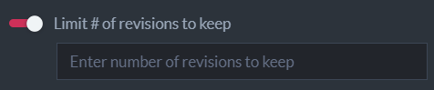  
   Enable to limit the number of revisions that will be kept in the revisions storage per document.  
   Upon revision creation (when the parent document is modified), if the number of revisions exceeds this limit  
   then older revisions will be purged (starting from the oldest revision).  

     * Enabling the # of revisions to keep will display the following setting as well:  
        
       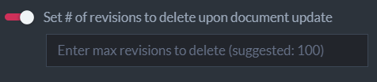   
       Enable to limit the number of revisions that RavenDB is allowed to purge per document modification.  

       <Admonition type="info" title="">
       This will be the maximum number of revisions that RavenDB will purge per document modification,  
       even if the number of revisions that pend purging is greater.  
       Setting this limit can reserve server resources if many revisions pend purging,  
       by dividing the purging between multiple document modifications.  
       </Admonition>

4. **Limit # of revisions to keep By Age**  
   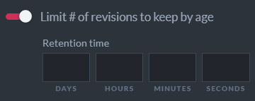  
   Enable to set a revisions age limit.  
   Revisions older than the defined retention time will be purged when their parent document is modified.  

   * Enabling the age limit setting will also display the **Set # of revisions to delete upon document update**   
     (see above).  
   
5. Click **OK** to keep these default settings, or **Cancel**.  
   Confirming will add the new settings to the revisions configuration **Defaults** section:  
   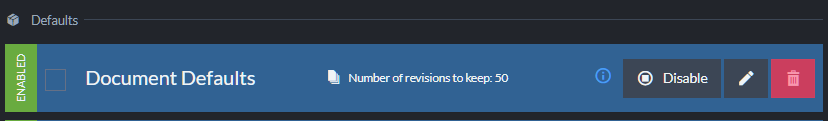

   <Admonition type="info" title="">       
   Click **Save** when done.       
   </Admonition>

</Panel>    
<Panel heading="Define collection-specific configuration">   

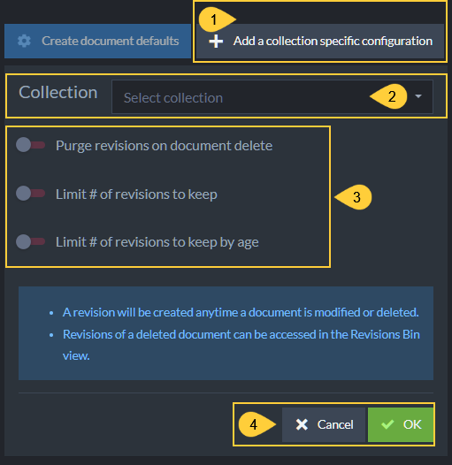

1. **Add a collection-specific configuration**  
   Click to define a configuration that applies to a specific collection.  
   This configuration will override _Document Defaults_ and _Conflicting Document Defaults_ configurations.  

2. **Collection**  
   Select or enter a collection to define a configuration for.  
   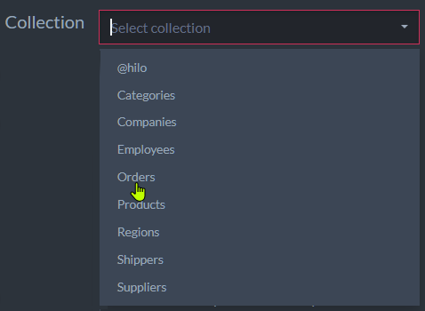  

3. **Configuration options**  
   These options are similar to those explained above for the [default configuration](#define-default-configuration),  
   the only difference is the configuration scope.  

4. Click **OK** to keep the configuration, or **Cancel**.  
   Confirming will add the new configuration to the **Collections** section:  
   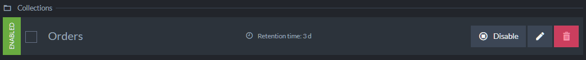  
   <Admonition type="info" title="">
   Click **Save** when done.
   </Admonition>

<a id="editing-the-conflicting-document-defaults"/>
## Edit conflicting document defaults

* Click the **Edit** button to edit the default configuration for conflicting documents.  

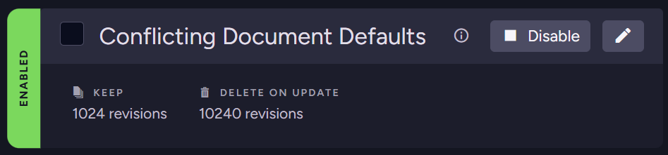

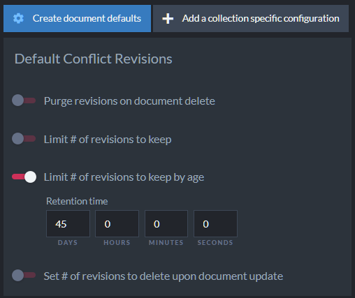

* The settings options are similar to those explained above for the [default configuration](#define-default-configuration).   
  
* Note: the **Limit # of revisions to keep by age** value is set to `45 Days` by default.  
  This means that revisions created for conflicting documents will start to be purged after 45 days,  
  whenever their parent documents are modified.  

<Admonition type="note" title="">

#### Conflicting documents example:

* For this example, we created a conflict by replicating into the database a document with an ID similar to that of a local document.  

* Revisions will be created when the documents **enter a conflict** and when the conflict is **resolved**.  
  So in this case, **three** revisions were created:  
    1. when the replicated document arrived and entered a conflict state.   
    2. when the local document entered a conflict state on the arrival of the replicated document.  
    3. when the conflict was resolved by replacing the local document with the replicated one.  
       <Admonition type="info" title="">
       In this example, the conflict was resolved by placing the replicated version as the current document. 
       Learn more about conflict resolution [here](./conflict-resolution.mdx#conflict-resolution).  
       </Admonition>

* To see these revisions, open the document's [Revisions tab](../../../document-extensions/revisions/overview.mdx#how-it-works).  
  The revision state is indicated by:  
    * A red **title** at the top (i.e. "Conflict revision" or "Resolved revision").  
    * An **icon** next to the revision's creation time in the right Properties pane.  
    * A **flag** in the revision's `@flags` metadata property (i.e. "Conflicted" or "Resolved").  

</Admonition>

</Panel>    
<Panel heading="Enforce configuration">   

The revision configuration rules are usually applied to a document's revisions only when the document is modified.   
Use **Enforce configuration** to apply the current revision configuration rules to existing revisions, without waiting for each document to be modified.  

---

### Opening the dialog:  
In the **Document Revisions** settings view, click **Enforce configuration** (top-right, next to **Revert revisions**).

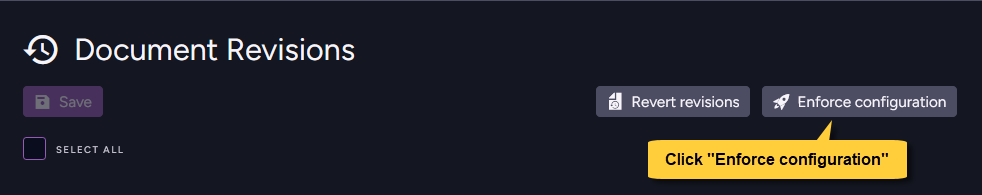

---

### The Enforce Configuration dialog:

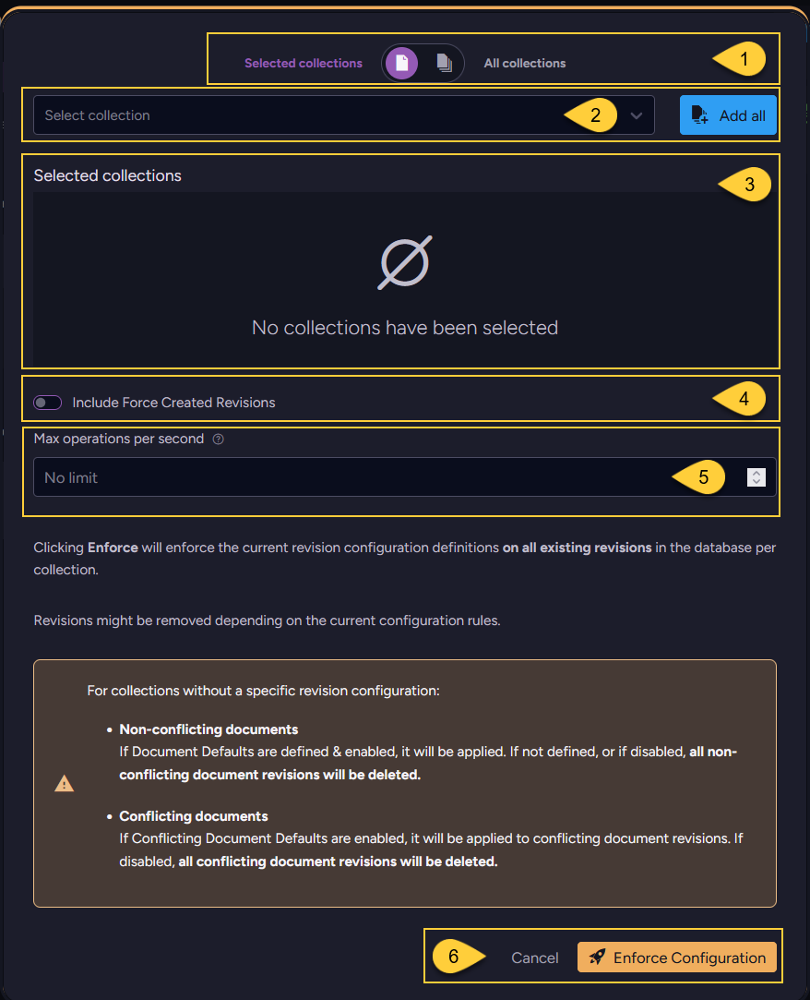

1. **Collections scope**  
   Toggle between **All collections** (enforce on the revisions of all collections)  
   and **Selected collections** (enforce only on the collections you choose).

2. **Select collection** / **Add all**  
   When **Selected collections** is active, choose collections from the **Select collection** dropdown,  
   or click **Add all** to include them all. 
    
3. **Selected collections**  
   The selected collections will be displayed here. 

4. **Include Force Created Revisions**  
     * ON - [Force-created revisions](../../../document-extensions/revisions/overview.mdx#force-revision-creation) may also be removed by the operation.
     * OFF (default) - force-created revisions are preserved.    

5. **Max operations per second**  
   Limit the number of documents processed per second to throttle the operation and reduce its resource consumption on large datasets.
   Leave the field empty (**No limit**, the default) to apply no throttling.

6. Click **Enforce Configuration** to run the operation, or **Cancel** to close the dialog without enforcing.

    Clicking **Enforce Configuration** applies the current revision configuration definitions to existing revisions in the database, per collection.
    Revisions might be removed depending on the current configuration rules.

    <Admonition type="note" title="">
    
    **For collections that HAVE a specific revision configuration**:
    
      * The collection-specific configuration is applied per collection.  
      * Revisions that should be purged according to the configuration are **deleted**.
    
    </Admonition>
    
    <Admonition type="note" title="">
    
    **For collections that DON'T have a specific revision configuration**:
    
      * Non-conflicting documents:  
          * If Document Defaults are defined & enabled, they are applied.  
          * If NOT defined, or if disabled, ALL non-conflicting document revisions are **deleted**.  
      * Conflicting documents:  
          * If Conflicting Document Defaults are enabled, they are applied to the conflicting document revisions.  
          * If disabled, ALL conflicting document revisions are **deleted**.
    
    </Admonition>
    
    <Admonition type="warning" title="">
        
    * Large databases may contain many revisions that will be deleted when the current configuration is enforced.  
      Running the operation can delete them all in a single enforcement run and may require substantial server resources.
      Schedule it accordingly.
        
    * On large datasets, use the **Max operations per second** field to throttle the operation and reduce its resource consumption.  
      The same throttling is available programmatically via the `MaxOpsPerSecond` parameter.   
      See [Enforce revisions configuration operation](../../../document-extensions/revisions/client-api/operations/enforce-revisions-configuration.mdx).
        
    * Revisions in collections that no current configuration applies to may be deleted.  
      Make sure your configuration includes the default settings and collection-specific configurations needed to keep the revisions you want to preserve.        
    
    </Admonition>
    
</Panel>