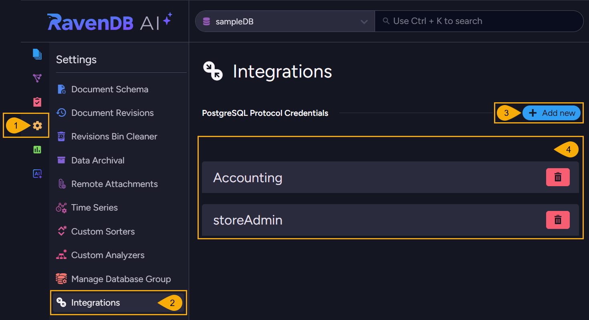
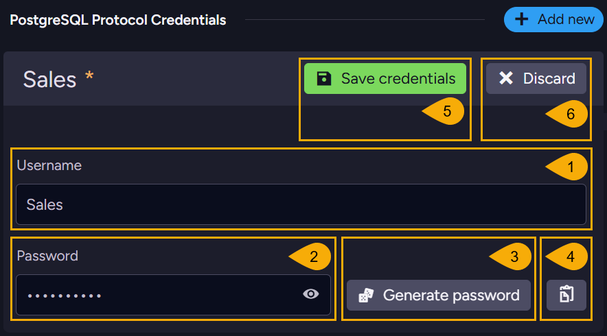

import Admonition from '@theme/Admonition';
import Panel from "@site/src/components/Panel";
import ContentFrame from "@site/src/components/ContentFrame";

# Integrations View
<Admonition type="note" title="">

* Use the **Integrations view** to define the credentials that clients connecting over the 
  [PostgreSQL protocol](../../../integrations/postgresql-protocol/overview.mdx), like 
  [Power BI](../../../integrations/postgresql-protocol/power-bi.mdx), must provide to access 
  a RavenDB database.  

* Providing these credentials is required only when RavenDB runs as a 
  [secure server](../../../integrations/postgresql-protocol/overview.mdx#security).  

* In this article:  
   * [PostgreSQL Protocol Credentials](../../../studio/database/settings/integrations.mdx#postgresql-protocol-credentials)  
      * [Open the Integrations view](../../../studio/database/settings/integrations.mdx#open-the-integrations-view)  
      * [Add a credential](../../../studio/database/settings/integrations.mdx#add-a-credential)  

</Admonition>

<Panel heading="PostgreSQL Protocol Credentials">

<ContentFrame>

### Open the Integrations view

To open the Integrations view: **Settings** `>` **Integrations**  

1. **Settings**  
   Open the **Settings** menu.  
2. **Integrations**  
   Open the Integrations view.  
3. **Add new**  
   Click to add a credential.  
   The **New credential** pane opens (see [Add a credential](../../../studio/database/settings/integrations.mdx#add-a-credential)).  
4. **PostgreSQL Protocol Credentials**  
   The credentials defined so far are listed here, each with a button to delete it.  

</ContentFrame>

<ContentFrame>

### Add a credential

Clicking **Add new** opens the **New credential** pane.  

1. **Username**  
   Enter the credential's user name.  
2. **Password**  
   Enter a password, or generate one (see callout 3).  
   Click the eye icon to reveal the typed password.  
3. **Generate password**  
   Fill the password field with a randomly generated password.  
4. **Copy to clipboard**  
   Copy the password to the clipboard.  

      <Admonition type="warning" title="">
      A saved credential cannot be edited, and its password cannot be viewed again: a listed 
      credential shows only its user name and a button to delete it.  
      Copy the password before saving if the client will need it later.  
      To change a password, delete the credential and create a new one.  
      </Admonition>

5. **Save credentials**  
   Save the credential.  
6. **Discard**  
   Discard the credential without saving.  

</ContentFrame>

</Panel>
