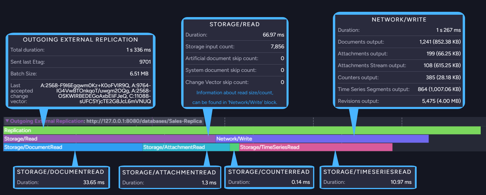
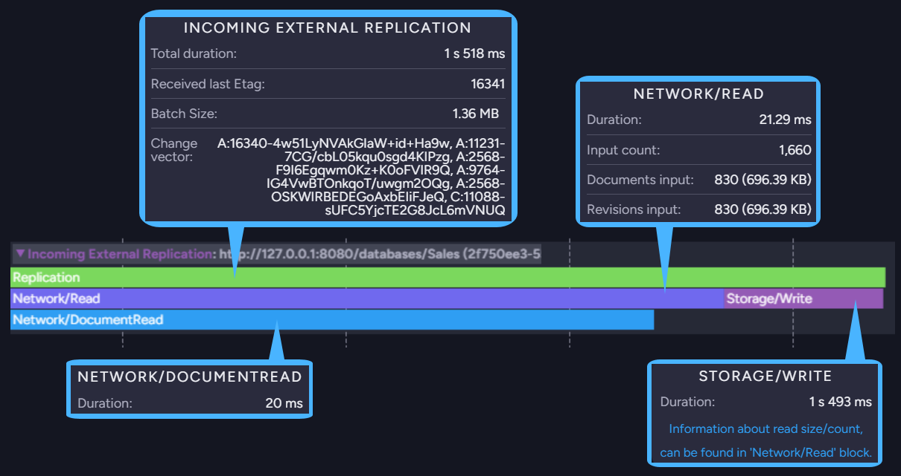

import Admonition from '@theme/Admonition';
import Panel from "@site/src/components/Panel";
import ContentFrame from "@site/src/components/ContentFrame";

# Ongoing Task Stats: External Replication Stats

<Admonition type="note" title="">

* Studio's Ongoing Task Stats view draws an **activity track** for each active 
  [ongoing task](../../../../studio/database/tasks/ongoing-tasks/general-info.mdx) of the currently 
  selected database, and populates the track with **operation bars** that report individual task 
  operations.  
  Learn more about this view in the 
  [Ongoing Task Stats](../../../../monitoring/performance-views/ongoing-task-stats.mdx) article.  

* See below how to read the activity track drawn for an 
  [external replication task](../../../../studio/database/tasks/ongoing-tasks/external-replication-task.mdx).  

* An external replication task replicates data from one RavenDB database to another.  
  On this view, replication tracks are labeled `Outgoing External Replication` when the source 
  database is selected and `Incoming External Replication` when the destination database is 
  selected.  

* In this article:  
   * [The collapsed track](../../../../studio/database/stats/ongoing-tasks-stats/external-replication-stats.mdx#the-collapsed-track)  
   * [The expanded track](../../../../studio/database/stats/ongoing-tasks-stats/external-replication-stats.mdx#the-expanded-track)  
      * [Outgoing replication](../../../../studio/database/stats/ongoing-tasks-stats/external-replication-stats.mdx#outgoing-replication)  
      * [Incoming replication](../../../../studio/database/stats/ongoing-tasks-stats/external-replication-stats.mdx#incoming-replication)  

</Admonition>

<Panel heading="The collapsed track">

1. **Task Type**  
   Click the track label or bar to expand the track and display additional operation bars.  
   When expanded, collapse the track by clicking its label or arrow indicator.  

2. **Replication URL**  
    * On a source database: the server URL and database name to which documents are replicated.  
    * On a target database: the server URL and database name of the source database.  

3. **Task Bar**  
    * Hovering over the bar displays the details of the replication batch.  
    * Dragging the bar slides the graph along the time axis.  
    * Rolling the mouse wheel zooms in or out.  

</Panel>

<Panel heading="The expanded track">

Expanding an external replication track reveals the operations included in each batch.  
On a **source** database, the view depicts an [outgoing track](../../../../studio/database/stats/ongoing-tasks-stats/external-replication-stats.mdx#outgoing-replication).  
On a **destination** database, the view depicts an [incoming track](../../../../studio/database/stats/ongoing-tasks-stats/external-replication-stats.mdx#incoming-replication).  

Hover above an operation bar of an expanded track to see the bar's properties as depicted below.  

<ContentFrame>

### Outgoing replication

* **Outgoing External Replication** bar.  
  The topmost bar, reporting properties measured over the whole batch:  
     * **Total duration**  
       The duration of the whole batch.  
     * **Sent last Etag**  
       The etag of the last item sent in the batch.  
     * **Batch Size**  
       The size of the data sent in the batch.  
     * **Last accepted change vector**  
       The change vector the destination database last acknowledged.  

* **Storage/Read** bar.  
  Properties measured while reading the items to be replicated from the source database's storage:  
     * **Duration**  
       The time it took to read the items.  
     * **Storage input count**  
       The number of items read from storage.  
     * **Artificial document skip count**  
       The number of skipped artificial items, such as the documents a map-reduce index outputs,
       which are not replicated.  
     * **System document skip count**  
       The number of skipped system documents.  
     * **Change Vector skip count**  
       The number of items skipped because the destination database already has them.  

  The counts and sizes of the read items are reported under the **Network/Write** bar.  

* **Network/Write** bar.  
  Properties measured while transmitting the read items to the destination database:  
     * **Duration**  
       The time it took to transmit the items.  
     * A count and a size for each item type the batch carried, so the number of lines varies from
       batch to batch. The image above shows six of them.  
       The possible lines are **Documents output**, **Documents Tombstone output**, **Attachments
       output**, **Attachments Stream output**, **Attachments Tombstone output**, **Counters
       output**, **Time Series Segments output**, **Time Series Deleted Ranges output**, **Revisions
       output**, and **Revisions Tombstone output**.  

* **Storage/DocumentRead**, **Storage/AttachmentRead**, **Storage/CounterRead**, 
  **Storage/TimeSeriesRead**, and **Storage/TombstoneRead** bars.  
  Properties measured while reading each item type included in the **Storage/Read** operation:  
     * **Duration**  
       The time it took to read the items of the bar's type.  

</ContentFrame>

<ContentFrame>

### Incoming replication

* **Incoming External Replication** bar.  
  The topmost bar, reporting properties measured over the whole batch:  
     * **Total duration**  
       The duration of the whole batch.  
     * **Received last Etag**  
       The etag of the last item received in the batch.  
     * **Batch Size**  
       The size of the data received in the batch.  
     * **Change vector**  
       The change vector of the receiving database.  

* **Network/Read** bar.  
  Properties measured while receiving the replicated items over the network:  
     * **Duration**  
       The time it took to receive the items.  
     * **Input count**  
       The overall number of items received.  
     * A count and a size for each item type the batch carried, so the number of lines varies from
       batch to batch. The image above shows **Documents input** and **Revisions input**.  
       The possible lines are **Documents input**, **Documents Tombstone input**, **Attachments
       input**, **Attachments Stream input**, **Attachments Tombstone input**, **Counters input**,
       **Time Series Segments input**, **Time Series Deleted Ranges input**, **Revisions input**,
       and **Revisions Tombstone input**.  

* **Storage/Write** bar.  
  Properties measured while writing the received items to the destination database's storage:  
     * **Duration**  
       The time it took to write the items.  

  The counts and sizes of the written items are reported under the **Network/Read** bar.  

* **Network/DocumentRead**, **Network/AttachmentRead**, **Network/CounterRead**, 
  **Network/TimeSeriesRead**, **Network/TimeSeriesDeletedRangeRead**, and **Network/TombstoneRead** 
  bars.  
  Properties measured while receiving each item type included in the **Network/Read** operation:  
     * **Duration**  
       The time it took to receive the items of the bar's type.  

</ContentFrame>

</Panel>
