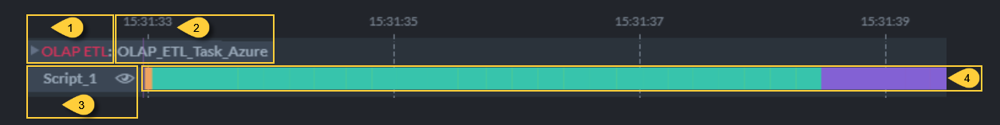
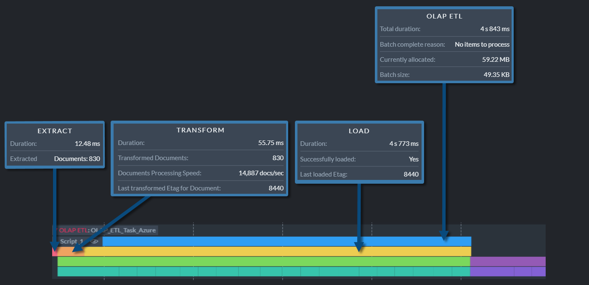
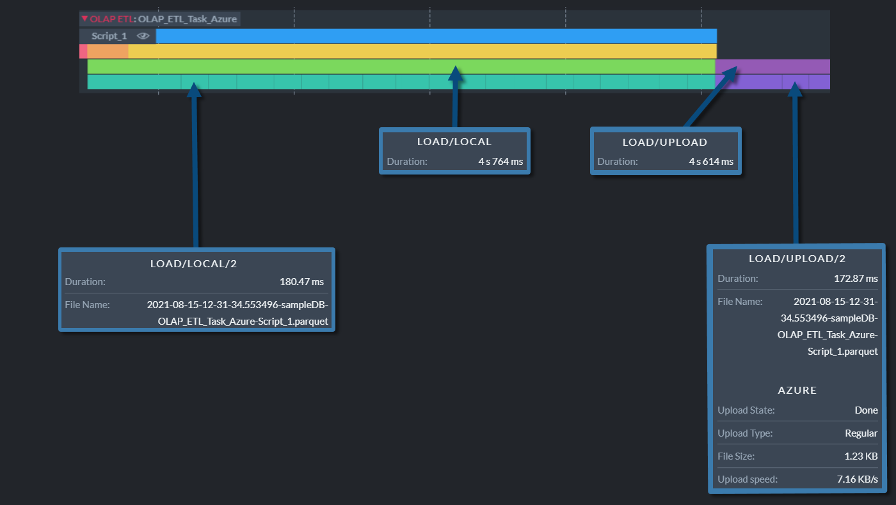

import Admonition from '@theme/Admonition';
import Panel from "@site/src/components/Panel";
import ContentFrame from "@site/src/components/ContentFrame";

# Ongoing Task Stats: OLAP ETL Stats

<Admonition type="note" title="">

* Studio's Ongoing Task Stats view draws an **activity track** for each active 
  [ongoing task](../../../../studio/database/tasks/ongoing-tasks/general-info.mdx) of the currently 
  selected database, and populates the track with **operation bars** that report individual task 
  operations.  
  Learn more about this view in the 
  [Ongoing Task Stats](../../../../monitoring/performance-views/ongoing-task-stats.mdx) article.  

* See below how to read the activity track drawn for an 
  [OLAP ETL task](../../../../studio/database/tasks/ongoing-tasks/olap-etl-task.mdx).  

* **OLAP ETL** (OnLine Analytical Processing) is a process that reads data from a RavenDB database, 
  transforms it, and stores it in the Parquet format.  

* In this article:  
   * [The collapsed track](../../../../studio/database/stats/ongoing-tasks-stats/olap-etl-stats.mdx#the-collapsed-track)  
   * [The expanded track](../../../../studio/database/stats/ongoing-tasks-stats/olap-etl-stats.mdx#the-expanded-track)  
      * [The batch operations](../../../../studio/database/stats/ongoing-tasks-stats/olap-etl-stats.mdx#the-batch-operations)  
      * [The file operations](../../../../studio/database/stats/ongoing-tasks-stats/olap-etl-stats.mdx#the-file-operations)  

</Admonition>

<Panel heading="The collapsed track">

1. **Task Type**  
   Click the track label or bar to expand the track and display additional operation bars.  
   When expanded, collapse the track by clicking its label or arrow indicator.  

2. **Task Name**  
   The name given to the ETL task.  

3. **Transform Script**  
   The name of the transformation script.  
   Click the eye icon to display the script.  

4. **Task Bar**  
    * Hovering over the bar displays the details of the ETL batch.  
    * Dragging the bar slides the graph along the time axis.  
    * Rolling the mouse wheel zooms in or out.  

</Panel>

<Panel heading="The expanded track">

Expanding an OLAP ETL track reveals the operations included in each batch, and the files each batch 
produced.  

Hover above an operation bar of an expanded track to see the bar's properties as depicted below.  

<ContentFrame>

### The batch operations

* **OLAP ETL** bar.  
  The topmost bar, reporting properties measured over the whole batch:  
     * **Total duration**  
       The duration of the whole batch, covering the extract, transform, and load operations.  
     * **Batch complete reason**  
       The reason the batch ended, e.g., "No items to process" or "Stopping the batch because 
       maximum batch size limit was reached".  
     * **Currently allocated**  
       The amount of memory the server allocated to handle the task.  
     * **Batch size**  
       The size of the data the batch carried.  
     * **ETL task has Transform errors** or **ETL task has Load errors**  
       Potential error notices, reported only when the transformation script failed on at least one 
       item or when the batch's load did not succeed, pointing to the notification center for 
       further details.  

* **Extract** bar.  
  Properties measured while extracting the items from the source database:  
     * **Duration**  
       The time it took to extract the items.  
     * A count for each item type the batch carried, so the number of lines varies from batch to 
       batch. The image above shows **Extracted Documents**.  
       The item types are documents and counter groups.  
     * **Last filtered out Etag for Document**  
       The etag of the last item the transformation script filtered out, reported per item type.  

* **Transform** bar.  
  Properties measured while running the transformation script over the extracted items:  
     * **Duration**  
       The time it took to run the script.  
     * **Transformed Documents**  
       The number of items the script processed, reported per item type.  
     * **Documents Processing Speed**  
       The average number of items the script processed per second, reported per item type.  
     * **Transformed Documents tombstones**  
       The number of tombstones the script processed, reported per item type.  
     * **Transformation error count**  
       The number of items the script failed on.  
     * **Last transformed Etag for Document**  
       The etag of the last item the script processed, reported per item type.  

* **Load** bar.  
  Properties measured while writing the transformed items to the Parquet files and sending the 
  files to their destinations:  
     * **Duration**  
       The time it took to write and send the files.  
     * **Successfully loaded**  
       `Yes` when the files reached their destination, `No` when the load failed.  
     * **Last loaded Etag**  
       The etag of the last item loaded.  

</ContentFrame>

<ContentFrame>

### The file operations

The **Load** operation includes two further operations, depicted as two bars on the row beneath the 
**Load** bar, one after the other in time: the first measures the time it took to write all files 
to local storage, and the second measures the time it took to upload them to their destinations.  
The next row holds one bar per file, measuring the time it took to write each file to local storage 
and to upload each file to its destination.  

* **Load/Local** bar.  
  Properties measured while writing all the batch's files to local storage, which always precedes 
  their upload to a remote destination:  
     * **Duration**  
       The time it took to write the files.  

* **Load/Local/`<file number>`** bars.  
  One bar per file, numbered by the file's order within the batch.  
  Properties measured while writing a single file to local storage:  
     * **Duration**  
       The time it took to write the file.  
     * **File Name**  
       The name of the Parquet file, built from the upload date and time, the database name, the 
       OLAP ETL task name, and the script name.  

* **Load/Upload** bar.  
  Properties measured while uploading all the batch's files to their remote destinations:  
     * **Duration**  
       The time it took to upload the files.  

  The upload bars are absent when the task writes to local storage only.  

* **Load/Upload/`<file number>`** bars.  
  One bar per file, numbered by the file's order within the batch.  
  Properties measured while uploading a single file:  
     * **Duration**  
       The time it took to upload the file.  
     * **File Name**  
       The name of the Parquet file.  
     * A block per destination the task uploads to, headed **S3**, **Azure**, **Google Cloud**, 
       **Glacier**, or **FTP**.  
       Each block reports the **Upload State** and the **Upload Type**, then either the **File 
       Size** and the **Upload speed** once the upload is done, or the **Progress** so far and the 
       current **Upload speed** while it runs.  

</ContentFrame>

</Panel>
