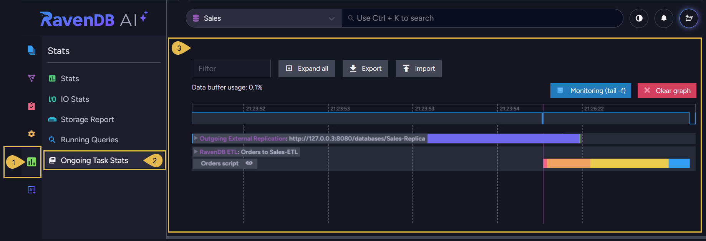

import Admonition from '@theme/Admonition';
import Panel from "@site/src/components/Panel";

# Opening the view

<Admonition type="note" title="">

* Studio's **Ongoing Task Stats** view draws a graph of the work a database's
  [ongoing tasks](../../../../studio/database/tasks/ongoing-tasks/general-info.mdx) perform over
  time, tracking each task's activity.  

* The full introduction to this view is in the
  [Ongoing Task Stats](../../../../monitoring/performance-views/ongoing-task-stats.mdx) article,
  under the Monitoring documentation folder.  

* In this article:
   * [The Ongoing Task Stats view](../../../../studio/database/stats/ongoing-tasks-stats/overview.mdx#the-ongoing-task-stats-view)

</Admonition>

<Panel heading="The Ongoing Task Stats view">

**`Stats` > `Ongoing Task Stats`**

1. **Stats**  
   Open the **Stats** menu.

2. **Ongoing Task Stats**  
   Open the **Ongoing Task Stats** view.

3. **The graph**  
   The graph area, where each task's track is drawn over a shared time axis.

   <Admonition type="note" title="">

   Learn to read the graph and operate this view in the
   [Ongoing Task Stats](../../../../monitoring/performance-views/ongoing-task-stats.mdx) article.

   </Admonition>

   <Admonition type="note" title="">

   Each of the following articles describes the statistics the view reports for a specific task type:

   * [External Replication Stats](../../../../studio/database/stats/ongoing-tasks-stats/external-replication-stats.mdx)
   * [Subscription Stats](../../../../studio/database/stats/ongoing-tasks-stats/subscription-stats.mdx)
   * [RavenDB ETL Stats](../../../../studio/database/stats/ongoing-tasks-stats/ravendb-etl-stats.mdx)
   * [SQL ETL Stats](../../../../studio/database/stats/ongoing-tasks-stats/sql-etl-stats.mdx)
   * [OLAP ETL Stats](../../../../studio/database/stats/ongoing-tasks-stats/olap-etl-stats.mdx)

   </Admonition>

</Panel>
