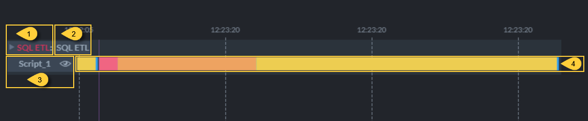
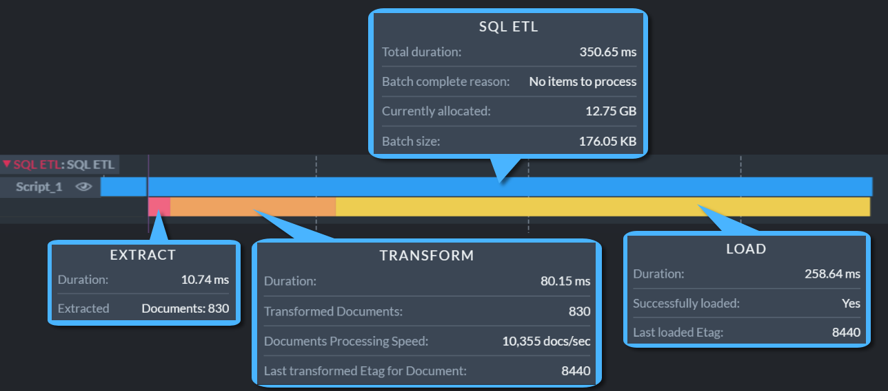

import Admonition from '@theme/Admonition';
import Panel from "@site/src/components/Panel";

# Ongoing Task Stats: SQL ETL Stats

<Admonition type="note" title="">

* Studio's Ongoing Task Stats view draws an **activity track** for each active 
  [ongoing task](../../../../studio/database/tasks/ongoing-tasks/general-info.mdx) of the currently 
  selected database, and populates the track with **operation bars** that report individual task 
  operations.  
  Learn more about this view in the 
  [Ongoing Task Stats](../../../../monitoring/performance-views/ongoing-task-stats.mdx) article.  

* See below how to read the activity track drawn for an 
  [SQL ETL task](../../../../server/ongoing-tasks/etl/sql.mdx).  

* **SQL ETL** is a process that reads data from a RavenDB database, transforms it, and stores it in 
  an SQL database.  

* In this article:  
   * [The collapsed track](../../../../studio/database/stats/ongoing-tasks-stats/sql-etl-stats.mdx#the-collapsed-track)  
   * [The expanded track](../../../../studio/database/stats/ongoing-tasks-stats/sql-etl-stats.mdx#the-expanded-track)  

</Admonition>

<Panel heading="The collapsed track">

1. **Task Type**  
   Click the track label or bar to expand the track and display additional operation bars.  
   When expanded, collapse the track by clicking its label or arrow indicator.  

2. **Task Name**  
   The name given to the ETL task.  

3. **Transform Script**  
   The name of the transformation script.  
   Click the eye icon to display the script.  

4. **Task Bar**  
    * Hovering over the bar displays the details of the ETL batch.  
    * Dragging the bar slides the graph along the time axis.  
    * Rolling the mouse wheel zooms in or out.  

</Panel>

<Panel heading="The expanded track">

Expanding an SQL ETL track reveals the operations included in each batch.  

Hover above an operation bar of an expanded track to see the bar's properties as depicted below.  

* **SQL ETL** bar.  
  The topmost bar, reporting properties measured over the whole batch:  
     * **Total duration**  
       The duration of the whole batch, covering the extract, transform, and load operations.  
     * **Batch complete reason**  
       The reason the batch ended, e.g., "No items to process" or "Stopping the batch because 
       maximum batch size limit was reached".  
     * **Currently allocated**  
       The amount of memory the server allocated to handle the task.  
     * **Batch size**  
       The size of the data the batch carried.  
     * **ETL task has Transform errors** or **ETL task has Load errors**  
       Potential error notices, reported only when the transformation script failed on at least one 
       item or when the batch's load did not succeed, pointing to the notification center for 
       further details.  

* **Extract** bar.  
  Properties measured while extracting the items from the source database:  
     * **Duration**  
       The time it took to extract the items.  
     * A count for each item type the batch carried, so the number of lines varies from batch to 
       batch. The image above shows **Extracted Documents**.  
       The item types are documents and counter groups.  
     * **Last filtered out Etag for Document**  
       The etag of the last item the transformation script filtered out, reported per item type.  

* **Transform** bar.  
  Properties measured while running the transformation script over the extracted items:  
     * **Duration**  
       The time it took to run the script.  
     * **Transformed Documents**  
       The number of items the script processed, reported per item type.  
     * **Documents Processing Speed**  
       The average number of items the script processed per second, reported per item type.  
     * **Transformed Documents tombstones**  
       The number of tombstones the script processed, reported per item type.  
     * **Transformation error count**  
       The number of items the script failed on.  
     * **Last transformed Etag for Document**  
       The etag of the last item the script processed, reported per item type.  

* **Load** bar.  
  Properties measured while loading the transformed items into the destination SQL tables:  
     * **Duration**  
       The time it took to load the items.  
     * **Successfully loaded**  
       `Yes` when the items reached the destination, `No` when the load failed.  
     * **Last loaded Etag**  
       The etag of the last item loaded.  

</Panel>
