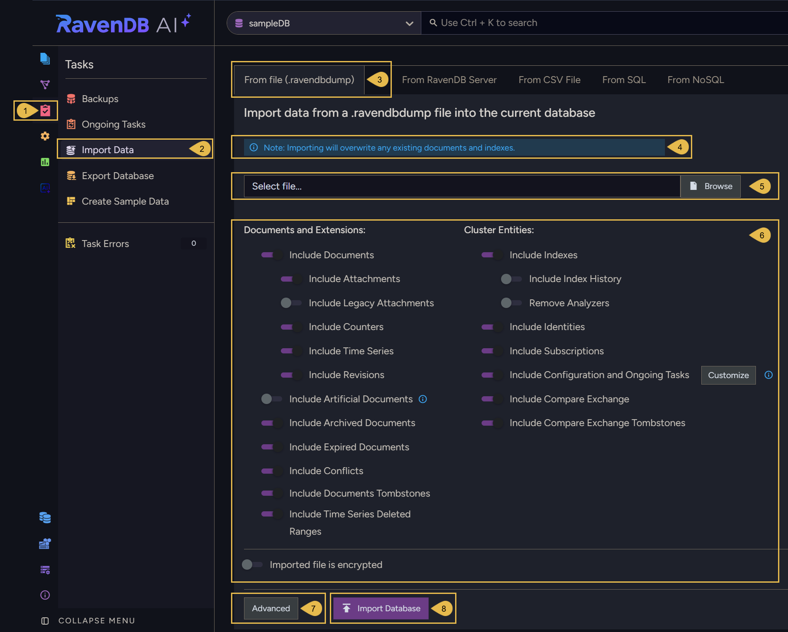
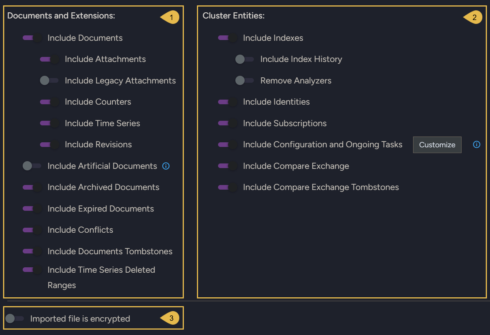
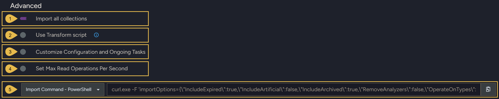
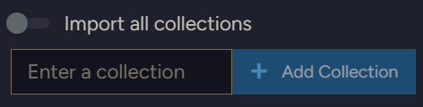
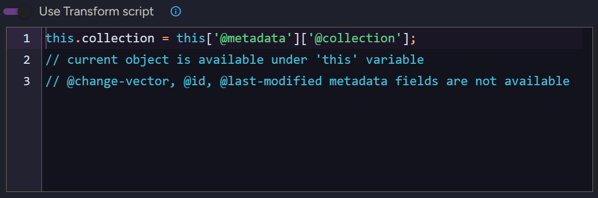
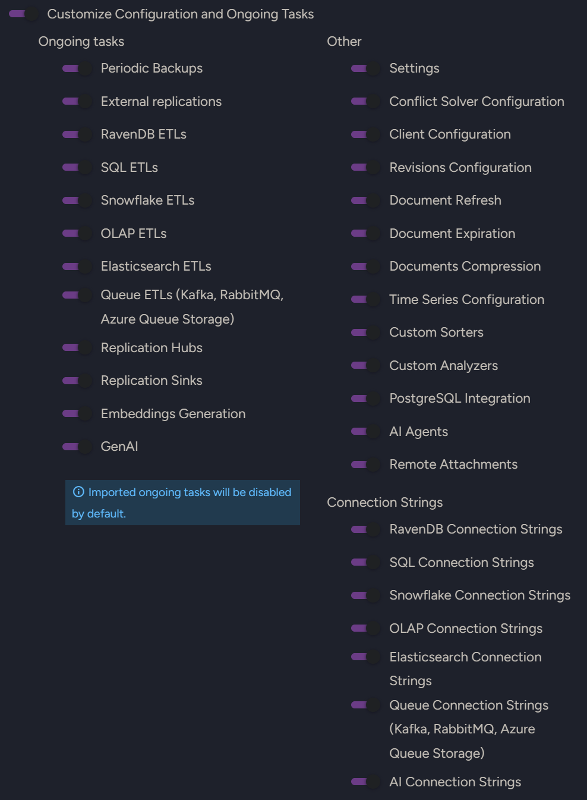
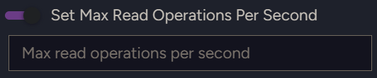
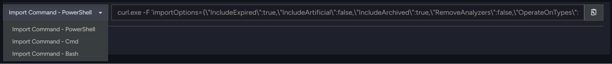

import Admonition from '@theme/Admonition';
import Panel from "@site/src/components/Panel";
import ContentFrame from "@site/src/components/ContentFrame";

# Import data from .ravendbdump file
<Admonition type="note" title="">

* `.ravendbdump` is RavenDB's format for [exporting data](../export-database.mdx) into and out of files.  

* A `.ravendbdump` file can be used to migrate data from one database to another.  
  It is commonly used when a database is upgraded.  

* An exported `.ravendbdump` file can also migrate data from a non-sharded database into a sharded database.  
  Learn more in the [section dedicated to this operation](../../../../sharding/import-and-export.mdx#import).  

* In this article:
   * [Import data from a file](../../../../studio/database/tasks/import-data/import-data-file.mdx#import-data-from-a-file)  
   * [Import options](../../../../studio/database/tasks/import-data/import-data-file.mdx#import-options)  
   * [Advanced import options](../../../../studio/database/tasks/import-data/import-data-file.mdx#advanced-import-options)  
      * [Import all collections](../../../../studio/database/tasks/import-data/import-data-file.mdx#1-import-all-collections)  
      * [Use Transform script](../../../../studio/database/tasks/import-data/import-data-file.mdx#2-use-transform-script)  
      * [Customize Configuration and Ongoing Tasks](../../../../studio/database/tasks/import-data/import-data-file.mdx#3-customize-configuration-and-ongoing-tasks)  
      * [Set Max Read Operations Per Second](../../../../studio/database/tasks/import-data/import-data-file.mdx#4-set-max-read-operations-per-second)  
      * [Import Command](../../../../studio/database/tasks/import-data/import-data-file.mdx#5-import-command)  

</Admonition>

<Panel heading="Import data from a file">

If you have already [exported a database](../export-database.mdx), follow these steps in Studio when you are ready to import from the file.  



1. Select the **Tasks menu**.  

2. Open the **Import data** view.  

3. **From file** tab.  
   Select the **From file (.ravendbdump)** tab to import from a database that was previously [exported](../export-database.mdx) to a file.  

4. **Overwrite warning**.  
   Be aware that importing from a file will overwrite any existing documents and indexes that share the same IDs.  
   To avoid rewriting your data, you can [create a new database](../../create-new-database/general-flow.mdx) and import into it.  

5. **Select file**.  
   Choose the exported `.ravendbdump` file that you want to import data from, by entering the file name or browsing your file system.  

6. **Import options**  
   Select the data to import from the file. See [Import options](../../../../studio/database/tasks/import-data/import-data-file.mdx#import-options) below.  
   If you exported an encrypted file, enable **Imported file is encrypted** and provide the encryption key.  

7. **Advanced**  
   Present [advanced import options](../../../../studio/database/tasks/import-data/import-data-file.mdx#advanced-import-options).  

8. **Import Database**  
   Click to import the selected data.  

</Panel>

<Panel heading="Import options">



Select the entities that you want to import:

| 1. Documents and Extensions | 2. Cluster Entities |
|-----------------------------|---------------------|
| [Documents](../../../../studio/database/documents/document-view.mdx) | [Indexes](../../../../indexes/what-are-indexes.mdx) |
| &nbsp;&nbsp;&nbsp;[Attachments](../../../../document-extensions/attachments/overview.mdx) | &nbsp;&nbsp;&nbsp;[Index history](../../../../studio/database/indexes/index-history.mdx) |
| &nbsp;&nbsp;&nbsp;[Legacy attachments](../../../../studio/database/create-new-database/from-legacy-files.mdx) | &nbsp;&nbsp;&nbsp;[Remove analyzers](../../../../indexes/using-analyzers.mdx) |
| &nbsp;&nbsp;&nbsp;[Counters](../../../../document-extensions/counters/overview.mdx) | [Identities](../../../../client-api/document-identifiers/working-with-document-identifiers.mdx) |
| &nbsp;&nbsp;&nbsp;[Time series](../../../../document-extensions/timeseries/overview.mdx) | [Subscriptions](../../../../client-api/data-subscriptions/what-are-data-subscriptions.mdx) |
| &nbsp;&nbsp;&nbsp;[Revisions](../../../../document-extensions/revisions/overview.mdx) | [Configuration and Ongoing Tasks](../../../../studio/database/tasks/import-data/import-data-file.mdx#3-customize-configuration-and-ongoing-tasks) |
| [Artificial documents](../../../../studio/database/indexes/create-map-reduce-index.mdx#artificial-documents--vs--regular-documents) | [Compare exchange items](../../../../compare-exchange/overview.mdx) |
| [Archived documents](../../../../data-archival/overview.mdx) | Compare exchange tombstones |
| [Expired documents](../../../../server/extensions/expiration.mdx) | |
| [Conflicts](../../../../client-api/cluster/document-conflicts-in-client-side.mdx) | |
| Document tombstones | |
| Time-series deleted ranges | |

Options that are selected but have no matching items in the imported file are skipped during import.  

**3. Imported file is encrypted**  
Enable this option when importing from an encrypted file, and provide the decryption key.  
Make sure that **Encrypt exported file** was enabled when exporting from the source database.  

</Panel>

<Panel heading="Advanced import options">

Click **Advanced** to reveal the following options.  



<ContentFrame>

#### 1. Import all collections



By default, **all** exported collections are imported.  
To import only specific collections, disable **Import all collections**, enter the name of each collection that you want to import, and click **Add collection**.  
Enter collection names exactly as they appear in the source database.  

</ContentFrame>

<ContentFrame>

#### 2. Use Transform script



Enable this option to provide a JavaScript transform script that runs on each document imported from the file.  

The current document is available under the `this` variable.  
The `@change-vector`, `@id`, and `@last-modified` metadata fields are not available to the script.  

For example, use the following script to skip discontinued products and stamp every imported document with the time it was imported:

```javascript
// Skip documents you don't want to import
// (throwing 'skip' filters the document out)
if (this.Discontinued === true) {
    throw 'skip';
}

// Add or modify regular fields on the imported document
this.ImportedAt = new Date().toISOString();
```

</ContentFrame>

<ContentFrame>

#### 3. Customize Configuration and Ongoing Tasks



Use this option to select ongoing tasks, configurations, and connection strings to import.  
Selected options with no matching items in the imported file will be skipped during import.  

| Ongoing tasks | Other | Connection Strings |
|---------------|-------|--------------------|
| [Periodic backups](../../../../backup/create/periodic-tasks/database-backup.mdx) | [Settings](../../../../studio/database/settings/database-settings.mdx) | RavenDB connection strings |
| [External replications](../../../../studio/database/tasks/ongoing-tasks/external-replication-task.mdx) | [Conflict solver configuration](../../../../client-api/operations/server-wide/modify-conflict-solver.mdx) | SQL connection strings |
| [RavenDB ETLs](../../../../server/ongoing-tasks/etl/raven.mdx) | [Client configuration](../../../../studio/server/client-configuration.mdx) | Snowflake connection strings |
| [SQL ETLs](../../../../server/ongoing-tasks/etl/sql.mdx) | [Revisions configuration](../../../../document-extensions/revisions/client-api/operations/configure-revisions.mdx) | OLAP connection strings |
| [Snowflake ETLs](../../../../server/ongoing-tasks/etl/snowflake.mdx) | [Document refresh](../../../../server/extensions/refresh.mdx) | Elasticsearch connection strings |
| [OLAP ETLs](../../../../server/ongoing-tasks/etl/olap.mdx) | [Document expiration](../../../../server/extensions/expiration.mdx) | Queue connection strings (Kafka, RabbitMQ, Azure queue storage) |
| [Elasticsearch ETLs](../../../../server/ongoing-tasks/etl/elasticsearch.mdx) | [Documents compression](../../../../server/storage/documents-compression.mdx) | [AI connection strings](../../../../ai-integration/connection-strings/overview.mdx) |
| [Queue ETLs](../../../../server/ongoing-tasks/etl/queue-etl/overview.mdx) (Kafka, RabbitMQ, Azure queue storage) | [Time series configuration](../../../../studio/database/settings/time-series-settings.mdx) | |
| [Replication hubs](../../../../studio/database/tasks/ongoing-tasks/hub-sink-replication/overview.mdx) | [Custom sorters](../../../../querying/sorting-query-results/custom-sorters/overview.mdx) | |
| [Replication sinks](../../../../studio/database/tasks/ongoing-tasks/hub-sink-replication/overview.mdx) | [Custom analyzers](../../../../studio/database/settings/custom-analyzers.mdx) | |
| [Embeddings Generation](../../../../ai-integration/generating-embeddings/overview.mdx) | [PostgreSQL integration](../../../../integrations/postgresql-protocol/overview.mdx) | |
| [GenAI](../../../../ai-integration/gen-ai-integration/overview.mdx) | [AI agents](../../../../ai-integration/ai-agents/overview.mdx) | |
| | [Remote attachments](../../../../document-extensions/attachments/configure-remote-attachments.mdx) | |

<Admonition type="note" title="">
Imported ongoing tasks are **disabled** by default.
</Admonition>

</ContentFrame>

<ContentFrame>

#### 4. Set Max Read Operations Per Second



Enable this option to set a maximum number of read operations per second for the import.  
Capping this rate makes the import lighter on the server, leaving more capacity for other work running on the database while the import is in progress, at the cost of a slower import.  

</ContentFrame>

<ContentFrame>

#### 5. Import Command



Studio can generate a ready-to-run command that performs this same import from a command line, using the options you configured above.  
This is useful for repeating the import later or running it from a script.  

Select the format you need, **PowerShell**, **Cmd**, or **Bash**, then click the copy icon to copy the generated command to the clipboard.  

The command uses `curl` to send your `.ravendbdump` file and the selected options to the database's import endpoint.  
For example, the generated PowerShell command looks similar to this:  

```powershell
curl.exe -F 'importOptions={\"OperateOnTypes\":\"Documents,Indexes\",\"IncludeExpired\":true}' -F 'file=@.\Northwind.ravendbdump' http://127.0.0.1:8080/databases/Northwind/smuggler/import
```

</ContentFrame>

</Panel>
