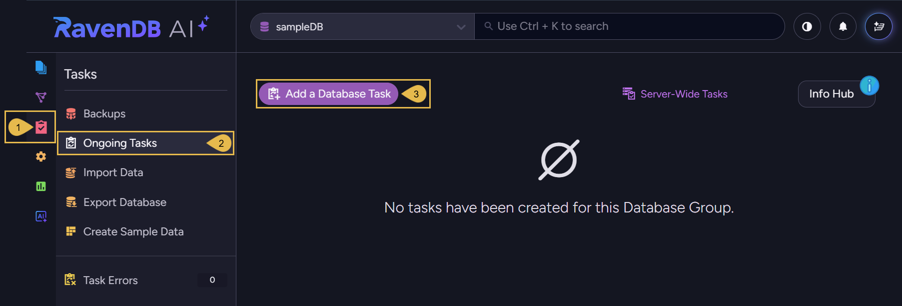
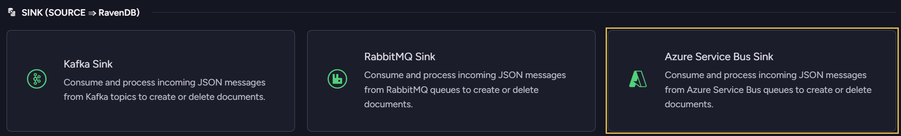
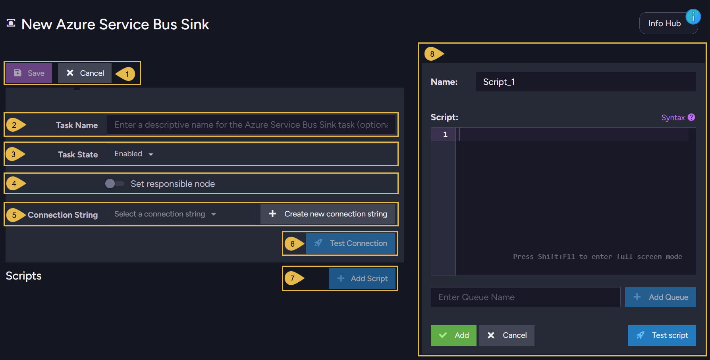
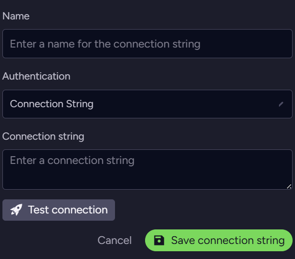
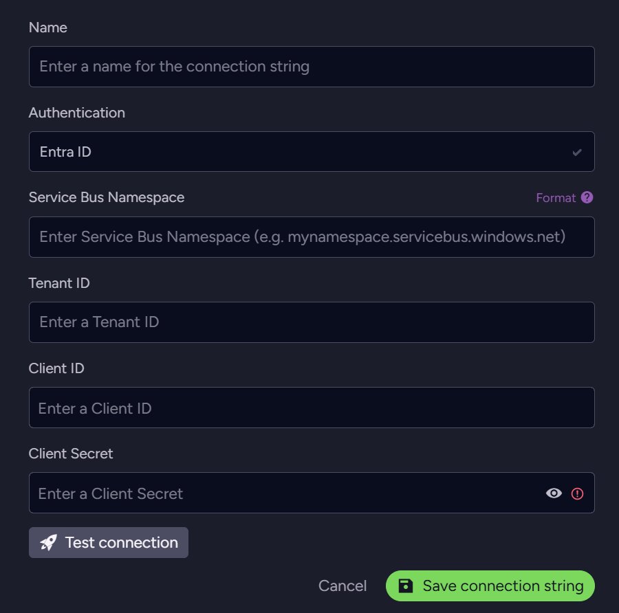
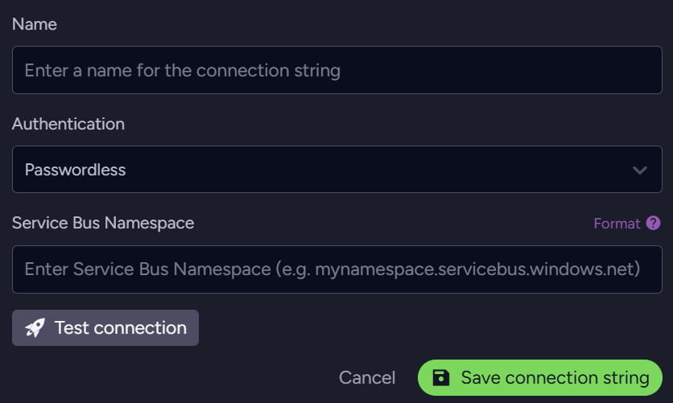

import Admonition from '@theme/Admonition';

# Azure Service Bus Queue Sink Task

<Admonition type="note" title="">

* **Azure Service Bus** is Microsoft Azure's fully managed message broker.  
  The broker carries messages between applications (like microservices, or a web app
  and its background workers) through queues or topics with subscriptions.

* RavenDB can consume messages from Azure Service Bus by running an ongoing **sink task**.  
  The task reads JSON-formatted messages from a queue or a topic subscription, runs a
  user-defined script over each message, and stores the documents the script produces
  in RavenDB collections.

* This page explains how to create an Azure Service Bus sink task using Studio.  
  Learn more about RavenDB queue sinks [here](../../../../server/ongoing-tasks/queue-sink/overview.mdx).  
  Learn how to define an Azure Service Bus sink task using the client API [here](../../../../server/ongoing-tasks/queue-sink/azure-service-bus-queue-sink.mdx).  

* In this article:  
  * [Add a Database Task](../../../../studio/database/tasks/ongoing-tasks/azure-service-bus-queue-sink.mdx#add-a-database-task)  
  * [Define an Azure Service Bus Sink Task](../../../../studio/database/tasks/ongoing-tasks/azure-service-bus-queue-sink.mdx#define-an-azure-service-bus-sink-task)  
  * [Authentication methods](../../../../studio/database/tasks/ongoing-tasks/azure-service-bus-queue-sink.mdx#authentication-methods)  

</Admonition>

## Add a Database Task

To open the ongoing tasks view:

1. **Tasks**  
   Click to open the Tasks menu.  
2. **Ongoing Tasks**  
   Click to open the ongoing tasks view.  
3. **Add a Database Task**  
   Click to create a new ongoing task.  

* Click **Azure Service Bus Sink** to create the task.

## Define an Azure Service Bus Sink Task

1. **Save** to store the configuration and exit. If the task is enabled it will start running.  
   **Cancel** to revoke the creation of a new task or the changes made to an existing task.  

2. **Task Name** (Optional)  
   * Enter a name for your task, e.g., *Orders sink*.  
   * If no name is provided, RavenDB will create a name based on the connection string,  
     e.g., *Queue Sink to AzureServiceBusConStr*.  

3. **Task State**  
   Select the task state:  
   Enabled - The task runs in the background, reading messages, running the scripts, and storing documents as defined in this view.  
   Disabled - No messages are read or stored, and the task's scripts are inactive.  

4. **Set responsible node** (Optional)  
   * Select a node from the [Database Group](../../../../studio/database/settings/manage-database-group.mdx) to be responsible for this task, e.g., node `A`.  
   * If no node is selected, the cluster will assign a responsible node (see [Members Duties](../../../../studio/database/settings/manage-database-group.mdx#database-group-topology---members-duties)).  

5. **Connection String**  
   The connection string holds the details RavenDB needs to reach your Azure Service Bus namespace.  
   Select an existing connection string from the list, or click **Create new connection string** to define a new one.  
   A new connection string requires a **Name**, e.g., *AzureServiceBusConStr*, and an **Authentication** method.  
   Learn about the three authentication methods [below](../../../../studio/database/tasks/ongoing-tasks/azure-service-bus-queue-sink.mdx#authentication-methods).  

6. **Test Connection**  
   After defining the connection string, click to test the connection to the Azure Service Bus namespace.  

7. **Add Script**  
   Click to add a script to the task and open the script editor.  
   Edit or delete an existing script from the list.  

8. **Script editor**  
   Define a script that turns the consumed messages into RavenDB documents, and the sources it reads from.  
   * **Name** - Name the script, or leave it for the task to generate a name, e.g., *Script_1*.  
   * **Syntax** - Click for scripting assistance and sample scripts.  
   * **Script** - Write the script that processes each message, e.g., `put(this.Id.toString(), this)`.  
     See [Running user-defined scripts](../../../../server/ongoing-tasks/queue-sink/azure-service-bus-queue-sink.mdx#running-user-defined-scripts) on the API page.  
   * **Enter Queue Name** / **Add Queue** - Enter a source and click **Add Queue** to add it to the list.  
     A source is either a queue name, e.g., `orders`, or a topic subscription written as `topic;subscription`, e.g., `orders-topic;ravendb-sub`.  
   * **Add** / **Cancel** - Add the script to the task, or update an existing one.  
     **Cancel** discards your changes.  
   * **Test script** - Test the script against a sample message, without reading from Azure Service Bus or storing documents.  

## Authentication methods

An Azure Service Bus connection authenticates in one of three ways.  
Select the method from the **Authentication** dropdown in the connection string dialog.

* **Connection String**  
  A SAS (Shared Access Signature) connection string for the namespace, copied from the Azure portal.  
  It includes the namespace endpoint, a shared access key name, and the key itself.  
  e.g., `Endpoint=sb://<namespace>.servicebus.windows.net/;SharedAccessKeyName=<key-name>;SharedAccessKey=<key>`

  

* **Entra ID**  
  Authenticate with a Microsoft Entra ID application registration instead of a shared access key.  
  Provide the **Service Bus Namespace**, **Tenant ID**, **Client ID**, and **Client Secret**.  
  This keeps a shared key out of the configuration and allows granular control through [Role-Based Access Control](https://learn.microsoft.com/en-us/azure/role-based-access-control/).  
  e.g., the **Service Bus Namespace** `mynamespace.servicebus.windows.net`

  

* **Passwordless**  
  Authenticate with the managed identity of the machine hosting RavenDB, so no secret is stored in the configuration.  
  Provide only the **Service Bus Namespace**.  
  In Azure, grant this identity the **Azure Service Bus Data Receiver** role so it can read messages.  
  Assign the role on the whole namespace, or on the specific queue or topic the sink consumes from.  
  e.g., the **Service Bus Namespace** `mynamespace.servicebus.windows.net`

  
