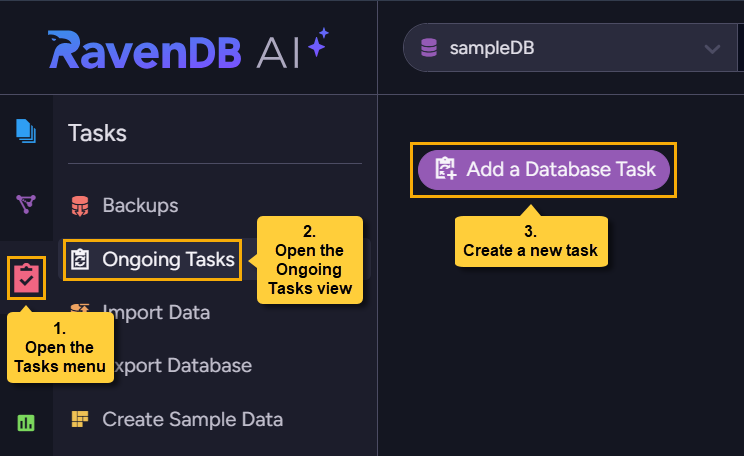
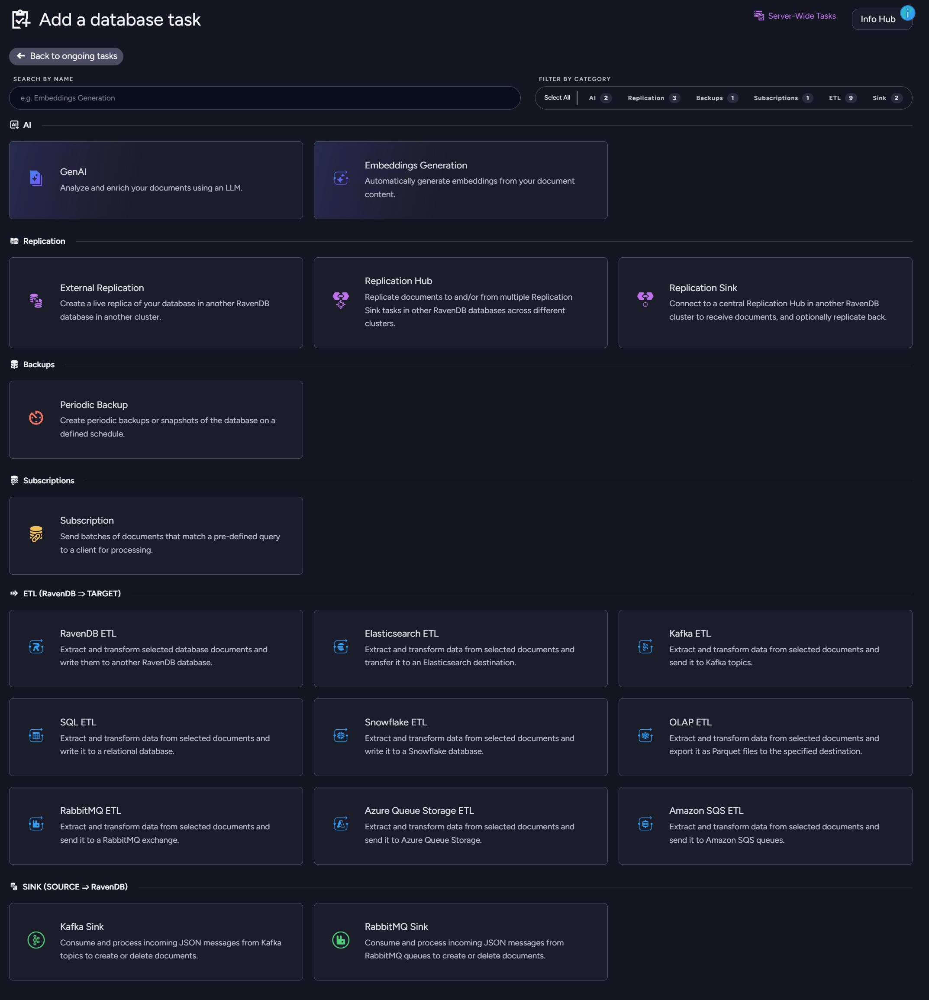
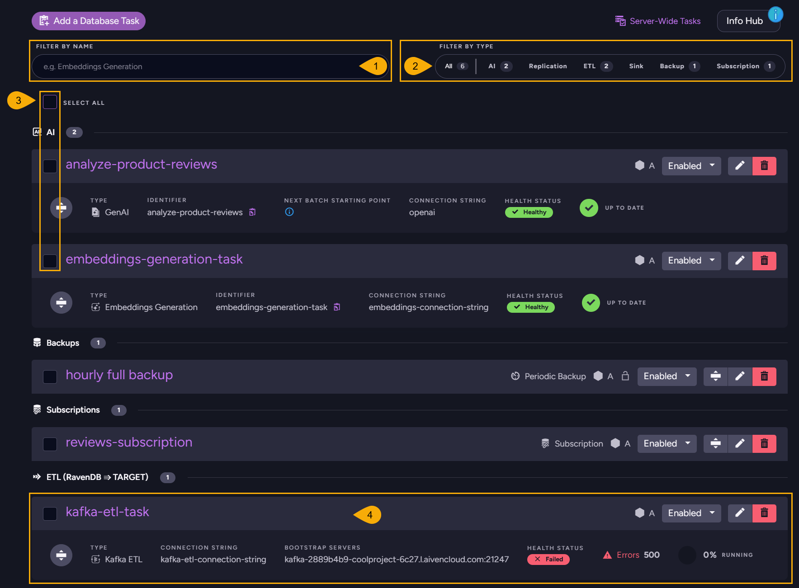
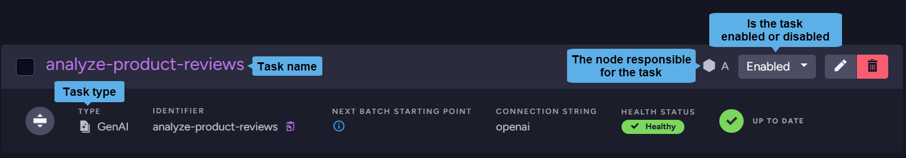
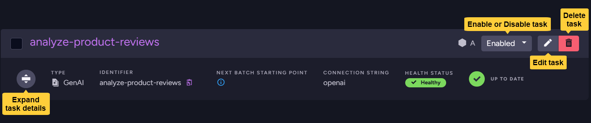
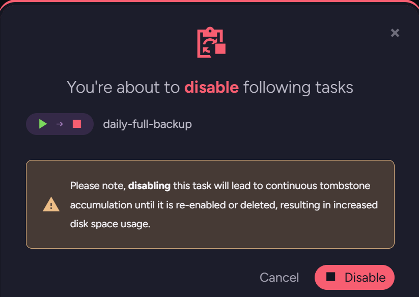

import Admonition from '@theme/Admonition';
import Tabs from '@theme/Tabs';
import TabItem from '@theme/TabItem';
import CodeBlock from '@theme/CodeBlock';
import LanguageSwitcher from "@site/src/components/LanguageSwitcher";
import LanguageContent from "@site/src/components/LanguageContent";
import Panel from "@site/src/components/Panel";
import ContentFrame from "@site/src/components/ContentFrame";

# Ongoing Tasks - Overview
<Admonition type="note" title="">

* Ongoing tasks are **work tasks** defined for the database.
 
* Each task is assigned a responsible node from the [Database Group nodes](../../settings/manage-database-group.mdx) to handle the work.  
    * If not specified by the user, the cluster decides which node will be responsible for the task. See [Members Duties](../../settings/manage-database-group.mdx#database-group-topology---members-duties).  
    * If a node is down, the cluster will reassign the work to another node.  

* Once enabled, an **ongoing task** runs in the background and executes its defined 
  work whenever relevant data changes occur.

* Ongoing tasks can also be managed via the Client API.  
  See [Ongoing tasks operations](../../../../client-api/operations/maintenance/ongoing-tasks/ongoing-task-operations.mdx).

* In this article:
    * [The ongoing tasks](#the-ongoing-tasks)
       * [Creating a new task](#creating-a-new-task)
       * [Available task types](#available-task-types)
    * [The ongoing tasks list](#the-ongoing-tasks-list)
       * [Disabling tasks and tombstone cleanup](#disabling-tasks-and-tombstone-cleanup)

</Admonition>
<Panel heading="The ongoing tasks">

<ContentFrame>

### Creating a new task

To create a new database task open the **Ongoing Tasks** view, click the **Add a Database Task** button,
and select a task type.

</ContentFrame>

---

<ContentFrame>

### Available task types

The following task types are available:

**AI:**

* **[GenAI](../../../../ai-integration/gen-ai-integration/overview.mdx)**  
    Analyze and enrich your documents using an LLM.  
* **[Embeddings Generation](../../../../ai-integration/generating-embeddings/overview.mdx)**  
    Automatically generate embeddings from your document content.  

**Replication:**

* **[External Replication](./external-replication-task.mdx)**  
    Create a live replica of your database in another RavenDB database in another cluster.  
    This replication is initiated by the source database.  
* **[Replication Hub](./hub-sink-replication/replication-hub-task.mdx)**  
    Replicate documents to and/or from one or more `Replication Sink` tasks in other RavenDB
    databases across different clusters.  
* **[Replication Sink](./hub-sink-replication/replication-sink-task.mdx)**  
    Connect to a central `Replication Hub` in another RavenDB cluster to receive documents,
    and optionally replicate back.  
    The replication can be *bidirectional* or limited to a *single direction*,
    and can be *filtered* to allow the delivery of selected documents.  

**Backups:**

* **[Backup](../../../../backup/create/periodic-tasks/database-backup.mdx)**  
    Schedule a backup or a snapshot of the database at a specified point in time.  

**Subscriptions:**

* **[Subscription](../../../../client-api/data-subscriptions/what-are-data-subscriptions.mdx)**  
    Send batches of documents that match a pre-defined query for processing on a client.  

**ETL (RavenDB =&gt; Target):**

* **[RavenDB ETL](./ravendb-etl-task.mdx)**  
    Write all or chosen database documents to another RavenDB database.  
    Data can be filtered and modified with transformation scripts.  
* **[SQL ETL](../../../../server/ongoing-tasks/etl/sql.mdx)**  
    Write the database data to a relational database.  
    Data can be filtered and modified with transformation scripts.  
* **[Snowflake ETL](./snowflake-etl-task.mdx)**  
    Write all or chosen database documents to a Snowflake database.  
    Data can be filtered and modified with transformation scripts.  
* **[OLAP ETL](./olap-etl-task.mdx)**  
    Convert database data to the _Parquet_ file format for OLAP purposes.  
    Data can be filtered and modified with transformation scripts.  
* **[Elasticsearch ETL](./elasticsearch-etl-task.mdx)**  
    Write all or chosen database documents to an Elasticsearch destination.  
    Data can be filtered and modified with transformation scripts.  
* **[Kafka ETL](./kafka-etl-task.mdx)**  
    Write all or chosen database documents to topics of a Kafka broker.  
    Data can be filtered and modified with transformation scripts.  
* **[RabbitMQ ETL](./rabbitmq-etl-task.mdx)**  
    Write all or chosen database documents to a RabbitMQ exchange.  
    Data can be filtered and modified with transformation scripts.  
* **[Azure Queue Storage ETL](./azure-queue-storage-etl.mdx)**  
    Write all or chosen database documents to Azure Queue Storage.  
    Data can be filtered and modified with transformation scripts.  
* **[Amazon SQS ETL](./amazon-sqs-etl.mdx)**  
    Write all or chosen database documents to Amazon SQS queues.  
    Data can be filtered and modified with transformation scripts.  

**Sink (Source =&gt; RavenDB):**

* **[Kafka Sink](./kafka-queue-sink.mdx)**  
    Consume and process incoming messages from Kafka topics.  
    Add scripts to Load, Put, or Delete documents in RavenDB based on the incoming messages.  
* **[RabbitMQ Sink](./rabbitmq-queue-sink.mdx)**  
    Consume and process incoming messages from RabbitMQ queues.  
    Add scripts to Load, Put, or Delete documents in RavenDB based on the incoming messages.  

</ContentFrame>

</Panel>

<Panel heading="The ongoing tasks list">

The tasks you create are listed in the Ongoing Tasks view, where you can see their status at a glance,
expand task bars for further details, perform basic actions like disabling or deleting tasks, and open
any task for editing.

1. **Filter by name**  
   Enter a string to list only tasks whose name includes this string.  

2. **Filter by type**  
   Click **All** to see tasks of all types.  
   Click a specific task type, e.g. `ETL`, to add tasks of this type to the view.  

3. **Selection boxes**  
   Select all tasks using the "select all" checkbox at the top.  
   Select individual tasks using task-specific checkboxes.  
   Selecting tasks opens an action bar. Use **Set state** to enable or disable the selected tasks,
   or **Delete** to remove them.  
   

4. **Task bar**  
    * Each defined task is represented by a task bar.  
    * A task bar always shows the task's name and type, whether it is enabled, and which cluster node is responsible for running it.  
      
    * You can enable, disable, edit, or delete the task.  
      You can also expand each task bar for additional details and options related to the task.  
      
    * Other details and available actions vary by task type.

---

<ContentFrame>

#### Disabling tasks and tombstone cleanup

Disabling a task that processes tombstones (replication, ETL, or periodic backup) prevents
[tombstone cleanup](../../../../monitoring/tombstones/overview.mdx#tombstone-cleanup) from removing 
the tombstones the task would have processed, causing the accumulation of the unprocessed 
tombstones until the task is re-enabled or deleted.

Studio will warn you before disabling such a task:  

<Admonition type="note" title="">

Subscriptions **do not process tombstones**, so disabling a subscription will show no warning.

</Admonition>

</ContentFrame>

</Panel>
