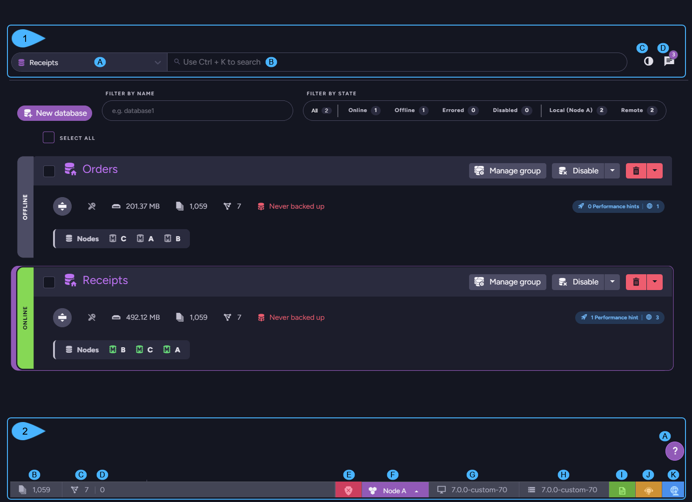

import Admonition from '@theme/Admonition';
import Tabs from '@theme/Tabs';
import TabItem from '@theme/TabItem';
import CodeBlock from '@theme/CodeBlock';
import LanguageSwitcher from "@site/src/components/LanguageSwitcher";
import LanguageContent from "@site/src/components/LanguageContent";

# Studio Overview
<Admonition type="note" title="Note">

* RavenDB's **Management Studio** is installed along with the server and can 
  be accessed via any modern browser.  
  Access Studio using the server's URL, including its port number. E.g.: `http://localhost:8080` 

* Use Studio to manage your RavenDB 
  [cluster](../studio/cluster/cluster-dashboard/cluster-dashboard-overview), 
  [servers](../studio/server/manage-server), 
  and [databases](../studio/database/databases-list-view). 
  You can observe, modify, and create [indexes](../studio/database/indexes/indexes-overview), 
  issue [queries](../studio/database/queries/query-view), 
  adjust [settings](../studio/database/settings/database-settings), 
  view [statistics](../studio/database/stats/ongoing-tasks-stats/overview) 
  and [logs](../studio/server/debug/admin-logs), 
  define [ongoing tasks](../studio/database/tasks/ongoing-tasks/general-info), 
  [import](../studio/database/tasks/import-data/import-data-file) 
  and [export](../studio/database/tasks/export-database) data, 
  and much more.

* In this page:  
   * [Accessing Studio After Setup](../studio/overview#accessing-studio-after-setup)  
      * [Connecting to an Unsecure server](../studio/overview#connecting-to-an-unsecure-server)  
      * [Connecting to a Secure server](../studio/overview#connecting-to-a-secure-server)  
         * [Where should the certificate be located](../studio/overview#where-should-the-certificate-be-located)  
   * [The Cluster Dashboard](../studio/overview#the-cluster-dashboard)  
   * [Manage Your Server](../studio/overview#manage-your-server)  
   * [Manage Your Databases](../studio/overview#manage-your-databases)  
   * [Header and Footer Areas](../studio/overview#header-and-footer-areas)  
</Admonition>
## Accessing Studio After Setup

Studio, the server's GUI, is installed along with the server. You can connect to it 
using your browser to access and manage the server.  

<Admonition type="info" title="Secure and Unsecure servers" id="secure-and-unsecure-servers" href="#secure-and-unsecure-servers">
When a RavenDB server runs for the first time, it presents its user with 
a [setup wizard](../start/installation/setup-wizard#select-setup-mode).  
You can use this wizard to select whether to install a **Secure** server 
(with a [Let's Encrypt](../start/installation/setup-wizard#secure-setup-with-a-free-let) 
or a [self-obtained](../start/installation/setup-wizard#secure-setup-with-your-own-certificate) 
certificate) or an [Unsecure](../start/installation/setup-wizard#unsecure-setup) server.  
</Admonition>

Connecting your browser to Studio is **different** when the server you attempt to access 
is secure and when it isn't.  

## Connecting to an Unsecure server:

When connecting to an [unsecure](../start/installation/setup-wizard#unsecure-setup) 
server, **no certificate** is required and Studio can be directly connected using 
the server's URL.  
<Admonition type="warning" title="Warning">
Please be aware that using an unsecure server is **not** recommended except for 
experiments in a development environment.  
</Admonition>

## Connecting to a Secure server:

To connect to a **secure server**, the browser is required to own a **client certificate** 
with [admin privileges](../server/security/authentication/client-certificate-usage).  
Trying to connect to a secure server without a certificate 
[will fail](../server/security/common-errors-and-faq#authentication-error-occurred-using-edge).  

#### Where should the certificate be located?

Certificates must be installed where the browser can find them.  

* If you generate a [Let's Encrypt](../start/installation/setup-wizard#secure-setup-with-a-free-let) 
  certificate during setup, the certificate will be automatically registered in the browser's default 
  location. This location is browser-specific:  
  **Edge** looks for certificates in the OS root store.  
  **Firefox** looks for certificates in the browser's root store.  
  **Chrome** version 105 and up also looks for certificates in the [browser's root store](https://blog.chromium.org/2022/09/announcing-launch-of-chrome-root-program.html).  

* If you obtain the certificate [elsewhere](../start/installation/setup-wizard#secure-setup-with-your-own-certificate), 
  you need to ensure that it is properly registered where your browser can find it.  
  <Admonition type="note" title="Note">
  To register a certificate for Firefox or Chrome, you may need to 
  [explicitly import the certificate](../server/security/common-errors-and-faq#authentication-error-occurred-using-chrome) 
  into the browser's root store.  
  </Admonition>

## The Cluster Dashboard

* Open the **Cluster Dashboard** from Studio's main menu.  
* A [Let's get started](../studio/cluster/cluster-dashboard/cluster-dashboard-widgets#let) 
  widget makes for a great starting point If you are new to RavenDB or this is a fresh setup.  
  You can use it to set your cluster, create a first database, or learn about basic database features.  
* The dashboard is [fully customizable](../studio/cluster/cluster-dashboard/cluster-dashboard-customize), 
  allowing you to easily add, remove, and rearrange your diagnostics widgets so any visit 
  to this view would reveal precisely the information you're interested in.  

<Admonition type="info" title="Info">
[Learn more about the cluster dashboard](../studio/cluster/cluster-dashboard/cluster-dashboard-overview)  
</Admonition>

## Manage your Server

To access your server's configuration and debugging options, open the **Manage Server** 
menu from Studio's main menu.  

The menu's **Cluster** option, for example, will allow you, among other options, 
to add your server to a cluster, see and change its role as a cluster node, and 
assign it CPU cores.  

<Admonition type="info" title="Info">
[Learn more about the Cluster view](../studio/cluster/cluster-view)
</Admonition>

## Manage your Databases

Access the **Databases View** from Studio's main menu.  

This is where databases can be easily created or deleted, and where you can 
view a concise summary of database metrics and perform operations like disabling 
or enabling a database or modifying its database group.  

## Header and Footer Areas

1. **Header area**
    * **A**. **Database selector**  
      Click from different Studio views to select a database.  
    * **B**. **Search bar**  
      Search for an entity in the selected database.  
    * **C**. **UI theme selector**  
      Select the UI theme that suits you.  
    * **D**. **Notification center**  
      See and dismiss notifications.  
2. **Footer area**
    * **A**. **Help and resources**  
      Click to consult with the community, to contact support, or for documentation.  
    * **B**. **Number of Documents in the selected database**
    * **C**. **Number of Indexes**
    * **D**. **Number of Stale indexes**
    * **E**. **Database Authentication status**
    * **F**. **Local Node tag**  
      Click to observe and configure another cluster node.  
    * **G**. **Studio version**
    * **H**. **Server version**
    * **I**. **License information**
    * **J**. **Support information**
    * **K**. [RavenDB Community](https://ravendb.net/community)

