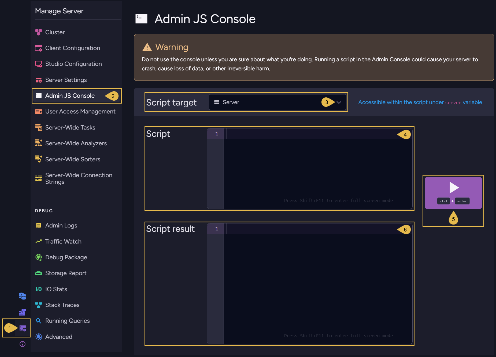

import Admonition from '@theme/Admonition';
import Panel from '@site/src/components/Panel';

<Admonition type="note" title="">

* The Admin JS Console lets you run JavaScript code on the server or on a specific database,  
  with low-level access and context objects.

* This page contains a partial list of available methods that can be executed using the console.
    
* <Admonition type="danger" title="">
  Do not use the JS console unless you are sure of what you are doing.  
  Incorrect usage may crash the server, corrupt data, or cause irreversible changes.
  </Admonition>

---
    
* In this article:
    * [Admin JS Console view](../../studio/server/admin-js-console.mdx#admin-js-console-view)
    * [Context objects in scripts](../../studio/server/admin-js-console.mdx#context-objects-in-scripts)
    * [Console methods](../../studio/server/admin-js-console.mdx#console-methods)

</Admonition>

<Panel heading="Admin JS Console view">

**`Manage Server` > `Admin JS Console`**

  

1. **Manage Server**  
   Open the **Manage Server** menu.
    
2. **Admin JS Console**  
   Select **Admin JS Console**.
    
3. **Script target**  
   Select the target for the script:  
   Select _Server_ to run a script against the server,  
   or select a _database_ from the dropdown list to run the script in the context of the selected database.
    
4. **Script**  
   Write your JavaScript code in the editor:  
   * If you selected the _server_ as the target, use the `server` variable.  
     This object in your script is a direct reference to the live C# `RavenServer` instance in the RavenDB backend.  
     Any method you call on it will be executed on the actual server object.
   * If you selected a _database_ as the target, use the `database` variable.  
     This object in your script is a direct reference to the live C# `DocumentDatabase` instance in the RavenDB backend.
     Any method you call on it will be executed on the actual database object.
    
5. **Run**  
   Run the script.
    
6. **Script result**  
   The script's output is displayed in this panel.

</Panel>

<Panel heading="Context objects in scripts">
    
* In addition to the _server_ and _database_ objects, the Admin JS Console provides access to three **context variables**: `serverCtx`, `databaseCtx`, and `clusterCtx`.

* **If your script calls a method that requires one of these contexts**, you can use the corresponding variable.  
  They are created for you and disposed automatically after the script runs.   

* Before using a context,  
  you must open a transaction on the context using `OpenReadTransaction()` or `OpenWriteTransaction()`.

---

#### Context Variables

| Variable        | Type                          | Scope                |
|-----------------|-------------------------------|----------------------|
| **databaseCtx** | `DocumentsOperationContext`   | Specific database    |
| **serverCtx**   | `TransactionOperationContext` | Single RavenDB node  |
| **clusterCtx**  | `ClusterOperationContext`     | Entire cluster       |

---

#### Script example

```javascript
// Get number of documents in the selected database
databaseCtx.OpenReadTransaction();
return database.DocumentsStorage.GetNumberOfDocuments(databaseCtx);

// Get the current server node tag
clusterCtx.OpenReadTransaction();
return server.ServerStore.Engine.ReadNodeTag(clusterCtx);

// Get the name of a server-wide backup task by ID
serverCtx.OpenReadTransaction();
return server.ServerStore.Cluster.GetServerWideTaskNameByTaskId(serverCtx,
    'server-wide/backup/configurations', 1);
```
    
</Panel>

<Panel heading="Console methods">

This is a **partial** list of methods that can be invoked on the `server` object from the Admin JS Console.      

---
    
### Methods under&nbsp;`server.ServerStore.Engine`

```javascript
server.ServerStore.Engine.*
```
<br />

#### Methods

| Method                   | Parameters          | Description |
|--------------------------|---------------------|-------------|
| `HardResetToPassive()`   | Cluster Topology ID | Force this server to leave its cluster and change state to `passive`. The server will not be able to perform [ongoing tasks](../database/tasks/ongoing-tasks/general-info.mdx) while it is in passive state. <br /><br /> This method takes a [cluster topology](../../server/clustering/rachis/cluster-topology.mdx) ID. If `null` is passed, the node will retain its current cluster topology ID. If you want to later add this server to an existing cluster, its cluster topology ID needs to match that cluster's ID. |
| `HardResetToNewCluster()`| Cluster node tag    | Force this server to leave its cluster and bootstrap a new cluster (in which it is the only node and is in state `leader`). A new cluster topology ID is generated, and the method returns this ID. <br /><br /> This method takes a [node tag](../../glossary/node-tag.mdx), but the parameter is currently not applied: the server keeps its current node tag. |
| `FoundAboutHigherTerm()` | `long`; `string`    | Set the term number of this server to the first parameter, a number of type `long`. A cluster's term number is incremented each time an election occurs. <br /><br /> If you pass a number greater than the current term, the server updates its term number and propagates the new term to the rest of the cluster. This can be used to break an election that does not end on its own, i.e. when the cluster is stuck in "voting in progress": a candidate that encounters the higher term aborts the stuck election round. <br /><br /> **Note:** This does *not* trigger an election, the leader node remains leader. <br /><br /> If you pass a number smaller than or equal to the current term, the method does nothing: the server and cluster retain their current term number. <br /><br /> The second parameter is a `string` that will be printed to the log of the term update: it records the reason for the change in the term. It can be set to `null`. |

#### Variables

| Variable          | Type    | Description |
|-------------------|---------|-------------|
| `RequestSnapshot` | boolean | Indicates whether this server has a pending request for a snapshot of the cluster state from the leader node of its cluster. While the request is pending, the server does not run for leadership, and it resynchronizes from the received snapshot. This value can be read from the console but cannot currently be set by a script. |

</Panel>
