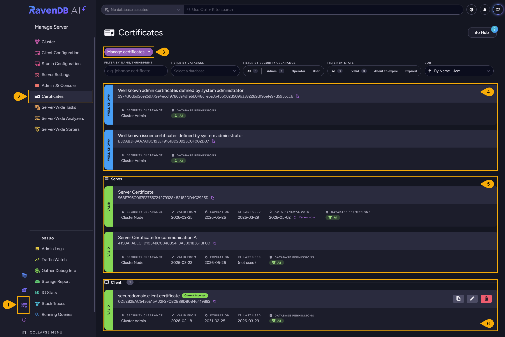
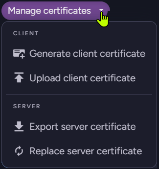
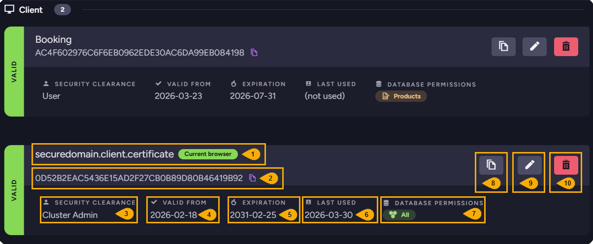
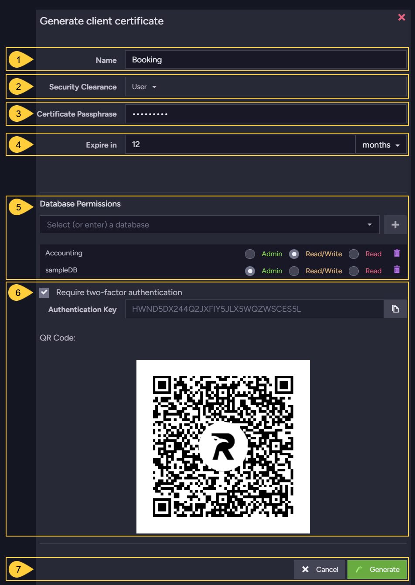
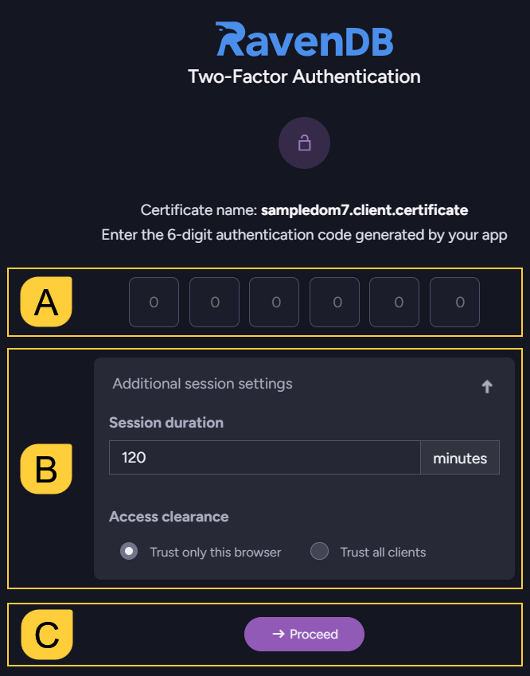
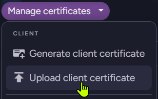
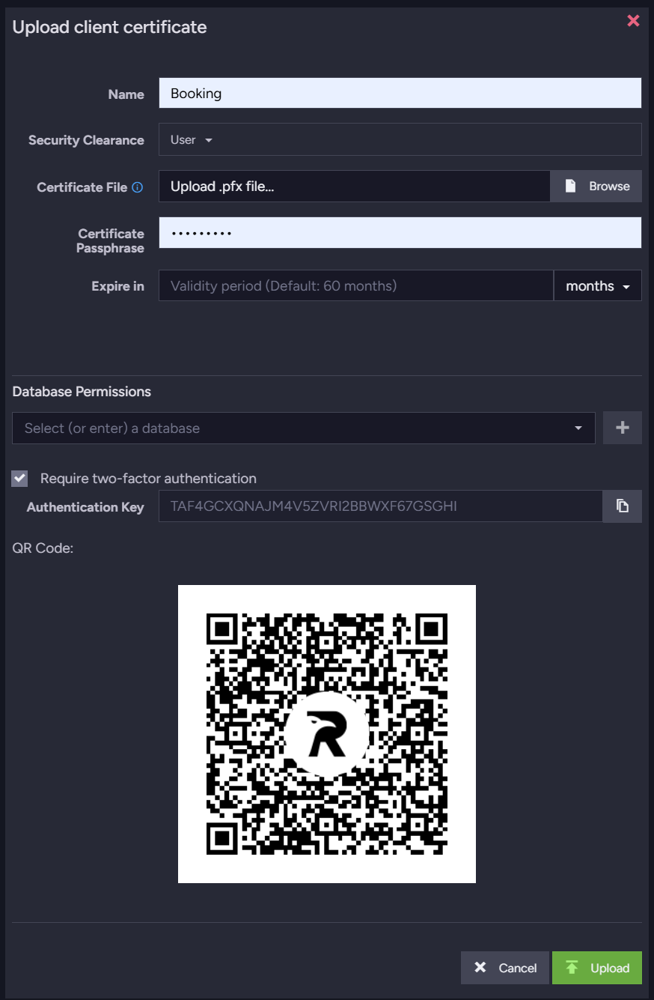
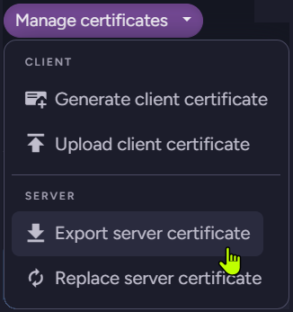

import Admonition from '@theme/Admonition';
import Tabs from '@theme/Tabs';
import TabItem from '@theme/TabItem';
import CodeBlock from '@theme/CodeBlock';
import LanguageSwitcher from "@site/src/components/LanguageSwitcher";
import LanguageContent from "@site/src/components/LanguageContent";

# Certificates View
<Admonition type="note" title="">

* Use the **Certificates** view to create, customize, import and export certificates.  

* In this article:
   * [The certificates view](../../../studio/server/certificates/server-management-certificates-view.mdx#the-certificates-view)
   * [View and edit certificates](../../../studio/server/certificates/server-management-certificates-view.mdx#view-and-edit-certificates)
   * [Generate a client certificate](../../../studio/server/certificates/server-management-certificates-view.mdx#generate-a-client-certificate)
   * [Enable communication between secure servers](../../../studio/server/certificates/server-management-certificates-view.mdx#enable-communication-between-secure-servers)
      * [Upload an existing client certificate](../../../studio/server/certificates/server-management-certificates-view.mdx#upload-an-existing-client-certificate)
      * [Export server certificates](../../../studio/server/certificates/server-management-certificates-view.mdx#export-server-certificates)
   * [Certificate collections](../../../studio/server/certificates/server-management-certificates-view.mdx#certificate-collections)

</Admonition>

## The Certificates view

To open the certificates view: **Manage Server** `>` **Certificates**

1. **Manage server**  
   Server management options. 

2. **Certificates**  
   Open the certificates management view.

3. **Manage certificates**  
   
   

   Manage client and server certificates.  
    * [Generate client certificate](../../../server/security/authentication/certificate-management.mdx#generate-client-certificate)  
      Create a new client certificate for secure access to RavenDB.  
      Assign permissions and security clearance as needed.  
    * [Upload client certificate](../../../server/security/authentication/certificate-management.mdx#upload-an-existing-certificate)  
      Register an existing client certificate to grant access to a user, application, or service.  
      This allows external clients to authenticate and interact with the server according to assigned permissions.
    * [Export server certificate](../../../server/security/authentication/certificate-management.mdx#export-server-certificates)  
      Export the server certificate so it can be imported into other cluster nodes.  
      This is required for establishing secure, trusted communication between servers in a cluster.
    * [Replace server certificate](../../../server/security/authentication/certificate-renewal-and-rotation.mdx)  
      Upload a new server certificate to replace the current one, updating the server’s identity for secure connections.
4. **Well-known certificates**  
    * [Well-known admin certificate](../../../server/configuration/security-configuration#securitywellknowncertificatesadmin)  
      A client certificate defined by an administrator explicitly using its thumbprint, and given admin permissions.  
    * [Well-known issuer certificate](../../../server/configuration/security-configuration#securitywellknownissuersadmin)  
      A CA (certificate authority) public certificate. Clients with certificates issued by this CA are trusted by the server and granted admin permissions.
5. **Server certificates**  
    * **Server certificate**  
      This is the main server certificate, used by RavenDB to secure HTTPS connections for the server’s public endpoints.  
      It is used for:
       * Encrypting traffic between clients and the server.
       * Authenticating the server’s identity to clients and other servers.
    * **Server certificate for communication A**  
      This certificate is used for secure communication between cluster nodes.  
      The `A` refers to the node's tag.  
6. **Client certificate**  
   Client certificates registered with this server are used to authenticate users and applications connecting to the database.  
   Each client certificate can be assigned specific permissions and security clearance levels, such as Cluster Administrator (ClusterAdmin), Operator, or User.

## View and edit certificates

In the image below, the client certificates have different 
**security clearance** and **database permissions** configurations.  
This allows admins to protect database contents by **customizing permissions**.  

For example, an application user can be given read/write access to the HR database, while project managers 
receive operator permissions on all databases.  

You can grant different [access levels](../../../server/security/authorization/security-clearance-and-permissions.mdx#authorization-security-clearance-and-permissions) 
by using different client certificates, each with its own set of permissions.  

1. **Name**  
   Client certificate name.  
2. **Thumbprint**  
   Unique key for each certificate.  
3. **Security Clearance**  
   [Authorization level](../../../server/security/authorization/security-clearance-and-permissions.mdx#authorization-security-clearance-and-permissions) 
   that determines the types of actions that can be performed with this certificate.  
4. **Valid From**  
   Indicates when the certificate became valid. 
5. **Expiration**  
   Client certificates are given 5 year expiration period by default.  
6. **Last Used**  
   Time of the certificate's last usage (or "not used" to indicate it hasn't been used yet).  
7. **Database Permissions**  
   The databases in this cluster that this client certificate has access to.  
8. **Clone certificate**  
   You can create a new certificate with the same settings as an existing one by cloning it.
9. **Edit Certificate**  
   You can edit the certificate's security clearance and database permissions.
10. **Delete Certificate**  
    Deleting a certificate will revoke access for all clients using this certificate.

## Generate a client certificate 

Use this view to generate a client certificate directly via RavenDB.  
Newly generated certificates will be added to the list of registered certificates.  

1. **Certificate Name**
2. **Security Clearance Level**  
   Read more [here](../../../server/security/authorization/security-clearance-and-permissions.mdx#authorization-security-clearance-and-permissions) 
   about available clearance levels.  
3. **Certificate Passphrase**  
4. **Expiration Period**  
   Client certificate expiration is set to 5 years by default.  
5. **Database Permissions**  
   Select the **databases** that this certificate gives access to,  
   and the allowed **access level** for each database.  
6. **Require two-factor authentication**  
   Use this setting to add a two-factor authentication security layer to your certificate.  
    - Enabling two-factor authentication will display the certificate's **authentication key** 
      and **QR code**.  
    - You can then scan the QR code or copy the key by an external authentication application of your choice, e.g. Google Authenticator or 2FAS.  
    - A client that connects Studio with a certificate that requires two-factor authentication, will be granted access only after providing a code generated by the external authentication 
      service.  
    - This is what Studio's clearance screen looks like when 2-factor authentication is used:
      
         
     
         * **A. Authentication Code**  
           Provide a code generated by your 2-Factor authentication service.  
         * **B. Additional Settings**  
           You can limit the session duration here.  
           You can also grant access only to this browser, or use this clearance screen to open Studio for other clients as well.  
7. **Generate** the certificate or **Cancel**.  
   
<Admonition type="note" title="">
The information collected in this view is used by RavenDB internally, and will not be stored in the certificate itself.
</Admonition>

## Enable communication between secure servers 

To enable communication between two secure servers, you need to:

1. **Export** ([download](../../../server/security/authentication/certificate-management.mdx#export-server-certificates)) the `.pfx` certificate from the destination server.  
2. **Upload** (import) the downloaded certificate into the source server.  

### Upload an existing client certificate

Use this option to upload an existing client certificate.  
Uploaded certificates will be added to the list of registered certificates.  

While uploading the client certificate you can modify its settings.  

See the [Generate a client certificate](../../../studio/server/certificates/server-management-certificates-view.mdx#generate-a-client-certificate) section to learn about the available settings.  

## Export server certificates

This option allows you to export the server certificate as a `.pfx` file.  
In the case of a cluster that contains several different server certificates, a `.pfx` [collection](../../../server/security/authentication/certificate-management.mdx#certificate-collections) will be exported.

## Certificate collections 

`.pfx` files may contain a single certificate or a collection of certificates.

When uploading a `.pfx` file with multiple certificates, RavenDB will add all certificates to the list of registered certificates as a single entry, and explicitly allow access to all certificates by their thumbprint.

