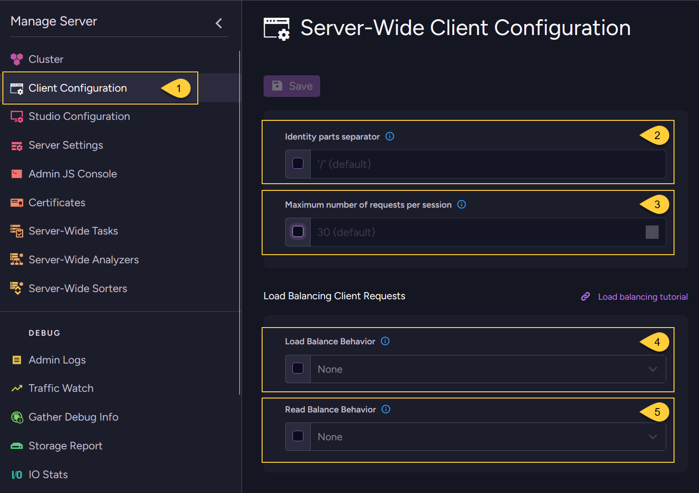

import Admonition from '@theme/Admonition';
import Tabs from '@theme/Tabs';
import TabItem from '@theme/TabItem';
import CodeBlock from '@theme/CodeBlock';
import LanguageSwitcher from "@site/src/components/LanguageSwitcher";
import LanguageContent from "@site/src/components/LanguageContent";
import ContentFrame from '@site/src/components/ContentFrame';
import Panel from '@site/src/components/Panel';

<Admonition type="note" title="">

* The client configuration can be set for **ALL** databases in the cluster.  
  You can do this using:  
  * The Studio - as described in this article  
  * The Client API - see [Put client configuration operation](../../client-api/operations/server-wide/configuration/put-serverwide-client-configuration.mdx)  
    
* When set from the Studio, the client configuration is stored directly on the RavenDB server  
  and applies to any client that connects to any database in the cluster.
   
* These settings override the client's own configuration,  
  which was initially set in your application code when initializing the _DocumentStore_.  
  This enables administrators to dynamically control client behavior, even after the client has started running.  
  For example, adjusting load balancing behavior on the fly in response to changing system demands.
    
* To override these global values and define a separate client configuration for a specific database,  
  see: [Client configuration (for database)](../../studio/database/settings/client-configuration-per-database.mdx)    

* In this article:
  * [Set the client configuration (server-wide)](../../studio/server/client-configuration.mdx#set-the-client-configuration-server-wide)

</Admonition>

<Panel heading="Set the client configuration (server-wide)">

1. Go to **Manage Server > Client Configuration**
    
2. **Identity parts separator**  
   Set the **separator character** for automatically generated document IDs of type **identity**.  
   You can use any single character except `|` (pipe).  
   Default value: `/`  
   This setting affects only IDs for identity documents created by the server.  
   Learn more about identities in [Document identifier generation: Identity](../../server/kb/document-identifier-generation.mdx#strategy-identity). 

3. **Maximum number of requests per session**  
   Set this number to restrict the number of requests (***Reads*** & ***Writes***) allowed per session when using the Client API.  
   Default value: `30`  

4. **Load balance behavior**  
    Set the Load balance method for ***Read*** & ***Write*** requests.  
    For a detailed explanation see: [Load balance behavior](../../client-api/configuration/load-balance/load-balance-behavior.mdx).  
    
    Available options:  
    * [None](../../client-api/configuration/load-balance/load-balance-behavior.mdx#none-default-option):  
      Read requests - the node the client will target will be based on the "Read balance behavior" configuration.  
      Write requests - will be sent to the [preferred node](../../client-api/configuration/load-balance/overview.mdx#the-preferred-node).  
    * [Use session context](../../client-api/configuration/load-balance/load-balance-behavior.mdx#usesessioncontext):  
      Sessions that are assigned the same context will have all their _Read_ & _Write_ requests routed to the same node.  
      The session context is hashed from a context string (given by the client) and an optional `seed`.  
      

5. **Read balance behavior**  
   Set the "Read_ balance method" the client will use when accessing a node with ***Read*** requests.
   The method selected will also affect the client's decision of which node to failover to in case of issues with the ***Read*** request.  
   For a detailed explanation see: [Read balance behavior](../../client-api/configuration/load-balance/read-balance-behavior.mdx).  
   
    Available options:  
     * [None](../../client-api/configuration/load-balance/read-balance-behavior.mdx#none-default-option)  
     * [Round Robin](../../client-api/configuration/load-balance/read-balance-behavior.mdx#roundrobin)  
     * [Fastest Node](../../client-api/configuration/load-balance/read-balance-behavior.mdx#fastestnode)  

</Panel>