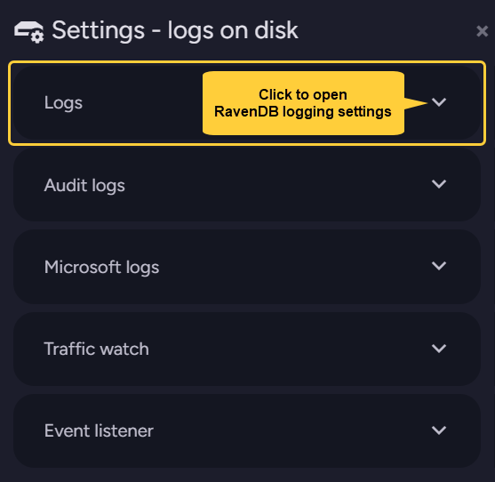
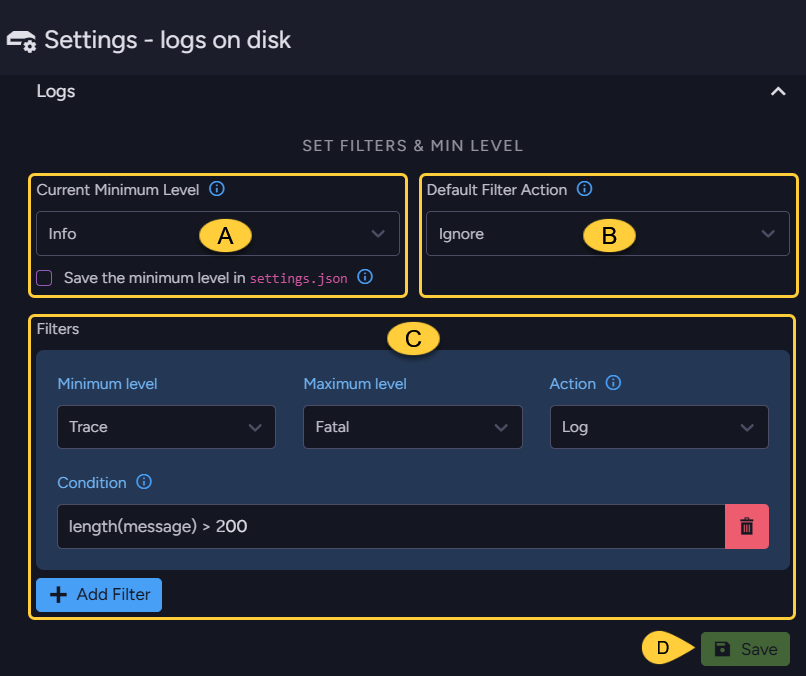
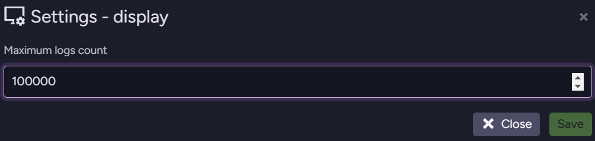
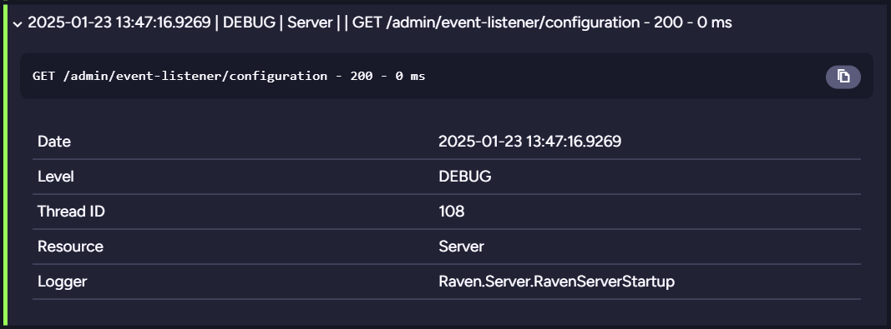

import Admonition from '@theme/Admonition';
import Tabs from '@theme/Tabs';
import TabItem from '@theme/TabItem';
import CodeBlock from '@theme/CodeBlock';
import LanguageSwitcher from "@site/src/components/LanguageSwitcher";
import LanguageContent from "@site/src/components/LanguageContent";

# Admin Logs
<Admonition type="note" title="Note">

* The Admin Logs view in the Studio provides two main functionalities:  
  * **Live log stream** 
      * Displays a continuous stream of RavenDB log entries in real time.
      * Log entries can be displayed in a raw format or expanded into a structured view.
      * Entries can be exported to a file for further analysis.
  * **Logs on disk settings** 
      * Define settings that determine which log entries are written to disk. 
      * Log files located on a server can be downloaded by date range.
  
* **Powerful filters** can be applied both to the live log stream and to the stored log files,  
  allowing you to refine the displayed or logged entries based on criteria such as the entry content,  
  originating resource, logger, or any other criteria.
* In this article:  
  * [Admin Logs view](../../../studio/server/debug/admin-logs.mdx#admin-logs-view)  
  * [Logs on this view](../../../studio/server/debug/admin-logs.mdx#logs-on-this-view)  
  * [Logs on disk](../../../studio/server/debug/admin-logs.mdx#logs-on-disk)  
  * [Log stream](../../../studio/server/debug/admin-logs.mdx#log-stream)  
  * [Syntax for filter conditions](../../../studio/server/debug/admin-logs.mdx#syntax-for-filter-conditions)  

</Admonition>
## Admin Logs view

From the Studio's main menu, click **Manage Server**.  

From the debug menu, click **Admin Logs**.  

1. [Logs on this view](../../../studio/server/debug/admin-logs.mdx#logs-on-this-view)  
   Use this section to adjust how the live log stream is displayed.  
   You can filter the streamed data and export it in JSON format.  
2. [Logs on disk](../../../studio/server/debug/admin-logs.mdx#logs-on-disk)  
   Use this section to customize RavenDB's logging to your local storage.  
   Filters can be applied here too, and you can download selected portions of your logs.  
3. [Log stream](../../../studio/server/debug/admin-logs.mdx#log-stream)  
   This section shows the live stream of RavenDB's logs as they are generated.  
   You can search within the stream and expand individual log entries for more detail.

## Logs on this view

**Use these controls to**:  

* Adjust [monitor controls](../../../studio/server/debug/admin-logs.mdx#monitor-controls).  
* Set the [minimum logging level](../../../studio/server/debug/admin-logs.mdx#set-displayed-logs-minimum-level) 
  from which log entries are displayed.  
* Create [additional filters](../../../studio/server/debug/admin-logs.mdx#set-displayed-logs-filters) 
  to select the precise data that you want to view.  
* [Export the displayed log data](../../../studio/server/debug/admin-logs.mdx#export-displayed-logs-data) 
  to files.  

1. **Active filters**  
   A lit funnel symbol indicates that filters were created and are now active.  
   See **Settings** below to learn what filters do and how to create and remove them.  
2. <a id="set-displayed-logs-minimum-level"/>**Min level**  
   The minimum [logging level](../../../server/troubleshooting/logging.mdx#logging-levels) from which log entries are displayed on this view.  
   For example, selecting `Warn` (warning) will display log entries from this level and up,  
   including `Warn`, `Error`, and `Fatal`.  
3. <a id="monitor-controls"/>**Monitor controls**  
    * **Pause** - Pause log entries from streaming to the display.
    * **Clear** - Clear the displayed log entries.
    * **Monitor (tail -f)** - When enabled, the display automatically scrolls to the latest log entry as new ones appear.  
      Clicking an entry and expanding its details automatically disables this option.  
4. <a id="export-displayed-logs-data"/>**Export**  
   Export all log entries in expanded form to a JSON file.
5. **Settings**  
   Click to create and apply filters that control which new log entries will be displayed.  
   Only entries that match both the selected min level (see no. 2 above) and the filter's conditions will be displayed. Existing entries remain unaffected.

      
      
      * **A.** **Default Filter Action**  
        Once at least one filter has been defined, a **default filter** can also be created.  
        The default filter determines how log entries are handled when they either **match no filter**,  
        or when all the filters they match apply a **Neutral** action.
      * <a id="set-displayed-logs-filters"/>**B.** **Filters**  
        Use this section to define new filters and manage existing ones.  
        Only entries that match all filter criteria will be displayed.  
         * **Minimum level** - The filter condition will apply to log entries with this level and above.
         * **Maximum level** - The filter condition will apply to log entries up to this level.
         * **Action** - How to handle entries that match the filter rule.
         
              | Action        | Meaning                                                                                                                                                                                                              |
              |---------------|----------------------------------------------------------------------------------------------------------------------------------------------------------------------------------------------------------------------|
              | `Ignore`      | The log entry will Not be logged.                                                                                                                                                                                    |
              | `IgnoreFinal` | The log entry will Not be logged. Any subsequent filters with the same logging-rules as this filter will be ignored.                                                                                              |
              | `Log`         | The log entry will be logged.                                                                                                                                                                                        |
              | `LogFinal`    | The log entry will be logged. Any subsequent filters with the same logging-rules as this filter will be ignored.                                                                                                  |
              | `Neutral`     | Take no immediate action (do not Ignore matching entries nor Log them). If no subsequent filters match the entry or all matching filters are Neutral, the entries will be handled by the _default filter action_. |

         * **Condition**  
           Enter an expression that will be evaluated against log entries.  
           Hover over the info `ⓘ` symbol for a few examples.  
           Find more information about NLog filter conditions [here](https://github.com/NLog/NLog/wiki/When-filter#conditions).  

         * **Delete filter**  
           Click to remove this filter.  

         * **Add filter**  
           Click to add a new filter.  
           Filters are evaluated successively, from the top down.  

      * **C.** **Close**/**Save**  
        Click _Close_ to exit without applying changes,  
        or _Save_ to apply changes and exit.

## Logs on disk

**Use these controls to**:  

* Set the [minimum logging level](../../../studio/server/debug/admin-logs.mdx#define-logs-on-disk-minimum-level) 
  from which log entries are stored in log files on the server disk.  
* Create [additional filters](../../../studio/server/debug/admin-logs.mdx#define-logs-on-disk-filters) 
  to select the precise data that you want to log.  
* [Download existing log files](../../../studio/server/debug/admin-logs.mdx#download-log-files) 
  from the server disk by a date range of your choice.  

1. **Active filters**  
   A lit funnel symbol indicates that filters were created and are now active.  
   Use **Settings** (see below) to create, apply and remove filters.  

2. **Min level**  
   The minimum logging level from which log entries are stored in log files.  
   Use **Settings** (see below) to set the minimum logging level.  

3. <a id="download-log-files"/>**Download**  
   Download log entries from the server in a single compressed file of plain text *.log files.  
   

    * **A.** **Select start date**  
      Select a date for the start of the period for which you want to download RavenDB logs.  
      Alternatively, toggle **Use minimum start date** ON to load logs starting from the earliest log stored on your disk.  
    * **B.** **Select end date**  
      Select a date for the end of the period for which you want to download RavenDB logs.  
      Alternatively, toggle **Use maximum end date** ON to load logs up to the latest log stored on your disk.  
    * **C.** **Close**/**Download**  
      Click _Close_ to exit without downloading logs,  
      or _Download_ to retrieve logs from the selected period.
   
5. **Settings**  
   Use this section to set the minimum logging level you require and to create and apply logging **filters**.  
   Only entries that match both the selected min level (see no. 2 above) and the filter's conditions will be written to the logs. Existing entries remain unaffected.  

      

      * Select the logging target you want to customize.  
        Below, we go through the **Logs** section - RavenDB logging settings.  

      
      
      * <a id="define-logs-on-disk-minimum-level"/>**Current Minimum Level**  
        The minimum [logging level](../../../server/troubleshooting/logging.mdx#logging-levels) from which log entries will be stored in log files.  
        For example, selecting `Warn` (warning) will store log entries from this level and up, including `Warn`, `Error`, and `Fatal`.  
         * **Save the minimum level in `settings.json`**  
           Check this box to save the minimum log level in the `settings.json` file.  
           If you don't save your configuration in `settings.json`, it will be overridden by the current configuration on the next server restart. 
      * **B.** **Default Filter Action**  
        Once at least one filter has been defined, a **default filter** can also be applied.  
        The default filter determines how log entries are handled when they either match no filter,  
        or when all the filters they match apply a **Neutral** action. 
      * <a id="define-logs-on-disk-filters"/>**C.** **Filters**  
        Use this section to define new filters and manage existing ones.
         * **Minimum level** - The filter condition will apply to log entries with this level and above.
         * **Maximum level** - The filter condition will apply to log entries up to this level.  
         * **Action** - How to handle selected log entries.  

           | Action        | Meaning                                                                                                                                                                                                              |
           |---------------|----------------------------------------------------------------------------------------------------------------------------------------------------------------------------------------------------------------------|
           | `Ignore`      | The log entry will Not be logged.                                                                                                                                                                                    |
           | `IgnoreFinal` | The log entry will Not be logged. Any subsequent filters with the same logging-rules as this filter will be ignored.                                                                                              |
           | `Log`         | The log entry will be logged.                                                                                                                                                                                        |
           | `LogFinal`    | The log entry will be logged. Any subsequent filters with the same logging-rules as this filter will be ignored.                                                                                                  |
           | `Neutral`     | Take no immediate action (do not Ignore matching entries nor Log them). If no subsequent filters match the entry or all matching filters are Neutral, the entries will be handled by the _default filter action_. |

         * **Condition**  
           Enter an expression that will be evaluated against log entries.  
           Hover over the info `ⓘ` symbol for a few examples.  
           Find more information about NLog filter conditions [here](https://github.com/NLog/NLog/wiki/When-filter#conditions).  

         * **Delete filter**  
           Click to remove this filter.  

         * **Add filter**  
           Click to Add a new filter.  
           Filters are evaluated successively, from the top down.  

      * **D.** **Save**  
        Apply your changes and close the settings window.  

## Log stream

* This area displays live log entries as they are generated by the server, filtered by the [Logs on this view](../../../studio/server/debug/admin-logs.mdx#logs-on-this-view) settings.
  You can search and expand individual entries for more details.

     

  1. **Search**  
     Only log entries containing the text you enter here will be displayed.  
     Leave empty to display all entries.  
  2. **Expand all**/**Collapse all**  
     Toggle to expand or collapse a structured, easy to read layout of all log entries content.  
  3. **Display settings**  
     Set the maximum number of log entries displayed in this view.  
          
  4. **Log entry**  
        * Each log entry follows this pipe-separated (|) pattern:  
          `<Timestamp>|<Level>|<ThreadId>|<Resource>|<Component>|<Logger>|<Message>|<Data>`  
          All fields are always present (empty if not applicable).   
            * **Timestamp** - UTC timestamp of the event.
            * **Level** - The entry's [logging level](../../../server/troubleshooting/logging.mdx#logging-levels).
            * **ThreadId** - ID of the thread that generated the log entry.
            * **Resource** - Affected resource, e.g., the server or the database name.
            * **Component** - The subsystem where the entry was generated, e.g., an index name.
            * **Logger** - The full class name of the originating [logger](../../../server/troubleshooting/logging.mdx#your-own-loggers).
            * **Message** - Event description + exception details (if any).
            * **Data** - Additional JSON context.
        * Click a log entry to expand or collapse its details:     
                 

## Syntax for filter conditions

* The structure of each log entry is defined **internally** by the following default layout string:
  `"${longdate:universalTime=true}|${level:uppercase=true}|${threadid}|${event-properties:item=Resource}|${event-properties:item=Component}|${logger}|${message:withexception=true}|${event-properties:item=Data}"`

* You can apply filter conditions to one or more of these fields to determine whether a log entry should be included or excluded from the logs.

* Conditions can be simple or complex. For example:
  * `contains('${event-properties:item=Resource}', 'DB1') and exception != null`  
    Matches entries where the _Resource_ contains _DB1_ and an exception is present.  
  * `length(message) > 200`  
    Matches entries where the length of the message exceeds 200 characters.  
  * `contains('${event-properties:item=Component}', 'MyIndex')`  
    Matches entries associated with index _MyIndex_.  
  * `logger == 'Voron.Impl.Journal.WriteAheadJournal'`  
    Matches entries from a specific logger.  

* Learn more in [NLog conditions](https://github.com/NLog/NLog/wiki/When-filter#conditions).

