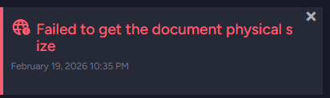
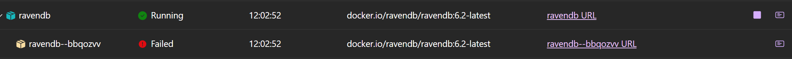
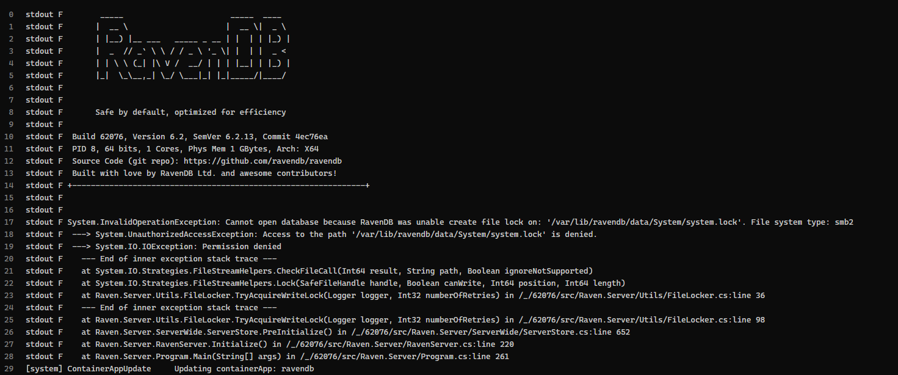
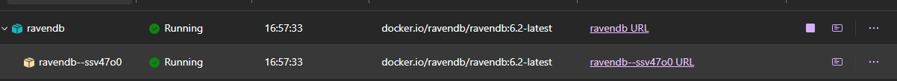
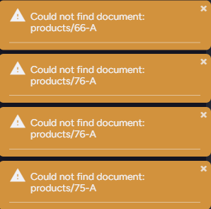
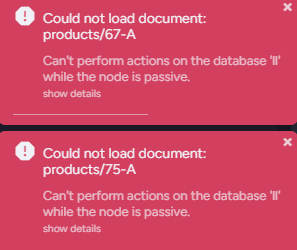

# Aspire ACA plugin file system incompatibility

We've been receiving questions about running RavenDB on Aspire with Azure Container Apps plugin. 
While it is possible to run RavenDB on Azure Container Apps, we **strongly discourage** it for production workloads.

- Azure Container Apps is not a good fit for RavenDB, as it supports only network file systems (e.g. `smb2`, `nfs`), which are not supported by RavenDB, as they are not durable enough to guarantee the durability of the writes required by RavenDB.
- We've been testing different scenarios, and sometimes data was lost, sometimes the database was not able to start at all, not being able to acquire a lock on file
- We've been encountering random exceptions, like the one below:



### Port and protocol issues

Let's consider a simple `AppHost.cs` file, that runs an unsecured instance of RavenDB inside Aspire:
```csharp
var builder = DistributedApplication.CreateBuilder(args);

var unsecuredSettings = RavenDBServerSettings.Unsecured();
unsecuredSettings.ServerUrl = $"http://0.0.0.0:8080";
unsecuredSettings.Port = 8080;

var unsecuredRavenDb = builder.AddRavenDB("RavenDB", unsecuredSettings);
unsecuredRavenDb.WithEnvironment("RAVEN_Security_UnsecuredAccessAllowed", "PublicNetwork");

builder.Build().Run();
```

Let's install the Azure Container Apps plugin for Aspire:

```
dotnet add package Aspire.Hosting.Azure.AppContainers
```

Use `AddAzureContainerAppEnvironment` method to initialize the Azure Container Apps environment.

```
builder.AddAzureContainerAppEnvironment("aspire-env-new");
```

Then we'll use `PublishAsAzureContainerApp` method, which accepts a callback that allows you to configure the container app. We'll use it to make the app accessible from the outside world by manually setting the ingress properties:
```csharp

unsecuredRavenDb.PublishAsAzureContainerApp((infra, app) =>
{
    app.Configuration.Ingress.External = true;
    app.Configuration.Ingress.Transport = ContainerAppIngressTransportMethod.Http;
    app.Configuration.Ingress.TargetPort = targetPort;
    app.Configuration.Ingress.AllowInsecure = true;
});
```


We'll use the [azd up](https://learn.microsoft.com/en-us/dotnet/aspire/deployment/azd/aca-deployment-azd-in-depth?tabs=windows#how-azure-developer-cli-integration-works) command to deploy the application. The command will:
- Use `azd infra gen` to generate the infrastructure **bicep** files.
- Use `azd provision` to provision the infrastructure on Azure, basing on the generated bicep files.
- Use `azd deploy` to deploy the application to the Azure infractructure

Let's try to execute first step manually to see the generated bicep files:
```
PS C:\AspireRavenTestACA> azd infra gen
...
failed: exit code: 3762504530, stdout: Using launch settings from Properties\launchSettings.json...                                  
Building...                                                                                                                                                                                                                                                                                                                                                 
, stderr: Unhandled exception. System.AggregateException: One or more errors occurred. (The endpoint 'http' is an http endpoint and must use port 80)                                                                                                                                                                                                       
 ---> System.NotSupportedException: The endpoint 'http' is an http endpoint and must use port 80                                                                                                                                                                                                                                                            
   at Aspire.Hosting.Azure.ContainerAppContext.ProcessEndpoints() in /_/src/Aspire.Hosting.Azure.AppContainers/ContainerAppContext.cs:line 301                                                                                                                                                                                                              
   at Aspire.Hosting.Azure.BaseContainerAppContext.ProcessResourceAsync(CancellationToken cancellationToken) in /_/src/Aspire.Hosting.Azure.AppContainers/BaseContainerAppContext.cs:line 104                                                                                                                                                               
   at Aspire.Hosting.Azure.ContainerAppEnvironmentContext.CreateContainerAppAsync(IResource resource, AzureProvisioningOptions provisioningOptions, CancellationToken cancellationToken) in /_/src/Aspire.Hosting.Azure.AppContainers/ContainerAppEnvironmentContext.cs:line 43                                                                             
   at Aspire.Hosting.Azure.AzureContainerAppsInfrastructure.OnBeforeStartAsync(BeforeStartEvent event, CancellationToken cancellationToken) in /_/src/Aspire.Hosting.Azure.AppContainers/AzureContainerAppsInfrastructure.cs:line 41                                                                                                                        
   at Aspire.Hosting.Eventing.DistributedApplicationEventing.<>c__DisplayClass4_0`1.<<Subscribe>b__0>d.MoveNext() in /_/src/Aspire.Hosting/Eventing/DistributedApplicationEventing.cs:line 82                                                                                                                                                               
--- End of stack trace from previous location 
```

This means we're constrainted to port 80 if we want to use http protocol. If we'd change the port to 80, we'd get another error from the container, as it runs without a root user:

```
fail:

stdout F        _____                       _____  ____ 
stdout F       |  __ \                     |  __ \|  _ \ 
stdout F       | |__) |__ ___   _____ _ __ | |  | | |_) |
stdout F       |  _  // _` \ \ / / _ \ '_ \| |  | |  _ < 
stdout F       | | \ \ (_| |\ V /  __/ | | | |__| | |_) |
stdout F       |_|  \_\__,_| \_/ \___|_| |_|_____/|____/ 
stdout F 
stdout F 
stdout F       Safe by default, optimized for efficiency
stdout F 
stdout F  Build 62076, Version 6.2, SemVer 6.2.13, Commit 4ec76ea
stdout F  PID 8, 64 bits, 1 Cores, Phys Mem 1 GBytes, Arch: X64
stdout F  Source Code (git repo): https://github.com/ravendb/ravendb
stdout F  Built with love by RavenDB Ltd. and awesome contributors!
stdout F +---------------------------------------------------------------+
stdout F 
stdout F In Linux low-level port (below 1024) will need a special permission, if this is your case please run
stdout F sudo setcap CAP_NET_BIND_SERVICE=+eip /usr/lib/ravendb/server/Raven.Server
stdout F Urls: [http://0.0.0.0:80, tcp://0.0.0.0:38888]
stdout F 
```

So let's use advanced flag - ForceTcpSchema:
```
unsecuredSettings.ForceTcpSchema = true;
```

With this flag, RavenDB will use "tcp" schema in the endpoint definition. This way we can avoid the permission issue and ACA plugin constraint. But that doesn't solve the storage issue.


### Storage problems

As said, Azure Container Apps provides only unsupported network file systems.

Adding a data volume doesn't solve the issue:
```
unsecuredRavenDb.WithDataVolume("ravendb-data");
``` 

But, it will add few extra components to your app definition upon `azd infra gen` usage. 
If any new capabilities will be added to the Azure Container Apps, you may customize the bicep files to take advantage of them in the future.   
Let's inspect a large storage section inside generated `aspire-env.module.bicep`. It includes the storage account, file service, share, and mounting of the share to the container app:
```
resource aspire_env_new_storageVolume 'Microsoft.Storage/storageAccounts@2024-01-01' = {
  name: take('aspireenvnewstoragevolume${uniqueString(resourceGroup().id)}', 24)
  kind: 'StorageV2'
  location: location
  sku: {
    name: 'Standard_LRS'
  }
  properties: {
    largeFileSharesState: 'Enabled'
    minimumTlsVersion: 'TLS1_2'
  }
  tags: tags
}

resource storageVolumeFileService 'Microsoft.Storage/storageAccounts/fileServices@2024-01-01' = {
  name: 'default'
  parent: aspire_env_new_storageVolume
}

resource shares_volumes_RavenDB_0 'Microsoft.Storage/storageAccounts/fileServices/shares@2024-01-01' = {
  name: take('sharesvolumesravendb0-${uniqueString(resourceGroup().id)}', 63)
  properties: {
    enabledProtocols: 'SMB'
    shareQuota: 1024
  }
  parent: storageVolumeFileService
}

resource managedStorage_volumes_RavenDB_0 'Microsoft.App/managedEnvironments/storages@2025-01-01' = {
  name: take('managedstoragevolumesravendb${uniqueString(resourceGroup().id)}', 24)
  properties: {
    azureFile: {
      accountName: aspire_env_new_storageVolume.name
      accountKey: aspire_env_new_storageVolume.listKeys().keys[0].value
      accessMode: 'ReadWrite'
      shareName: shares_volumes_RavenDB_0.name
    }
  }
  parent: aspire_env_new
}

output volumes_RavenDB_0 string = managedStorage_volumes_RavenDB_0.name
```

As you can see in this particular definition, Azure Container Apps will use SMB file system:
```
resource shares_volumes_RavenDB_0 'Microsoft.Storage/storageAccounts/fileServices/shares@2024-01-01' = {
  name: take('sharesvolumesravendb0-${uniqueString(resourceGroup().id)}', 63)
  properties: {
    enabledProtocols: 'SMB'
    shareQuota: 1024
  }
  parent: storageVolumeFileService
}
```

We could manually change it, but the [only other option](https://learn.microsoft.com/en-us/rest/api/storagerp/file-shares/create?view=rest-storagerp-2025-06-01&tabs=HTTP#enabledprotocols) we have now is NFS, which is also a network file system that can't provide the durability required by RavenDB.
After running `azd up`, it tells that it deployed successfully:

```
PS C:\AspireRavenTestACA> azd up

Packaging services (azd package)


Provisioning Azure resources (azd provision)
Provisioning Azure resources can take some time.

Subscription: Azure Test Sub (xyz-xyx-xyz-xyx)
Location: Poland Central

  (-) Skipped: Didn't find new changes.

Deploying services (azd deploy)

  (✓) Done: Deploying service RavenDB
  - Endpoint: https://ravendb.xyz.xyz.azurecontainerapps.io/ 

  Aspire Dashboard: https://aspire-dashboard.ext.xyz.xyz.azurecontainerapps.io

SUCCESS: Your up workflow to provision and deploy to Azure completed in 41 seconds.
```

But in reality, sometimes it starts, and sometimes the container hangs, unable to start, as it's unable to acquire a lock on the database files:






Even if the container starts:


RavenDB still has random troubles with finding the documents, indexes, settings, and other critical components on a mounted network file system:





### Resolution
Use a free [RavenDB Cloud](https://ravendb.net/cloud) instance, and connect to it from your application. This way you can host any application on Aspire with Azure Container Apps, and connect to the database running in the cloud.


