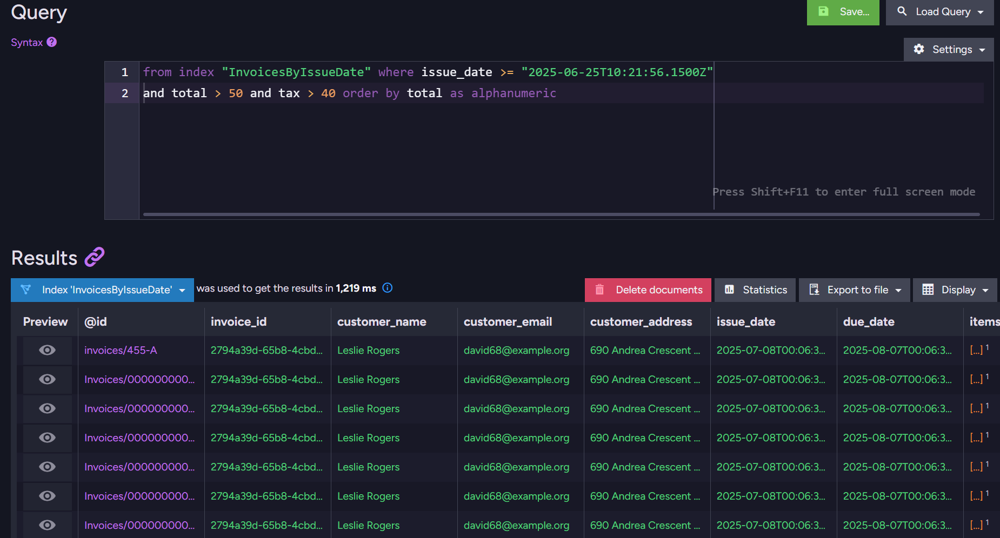
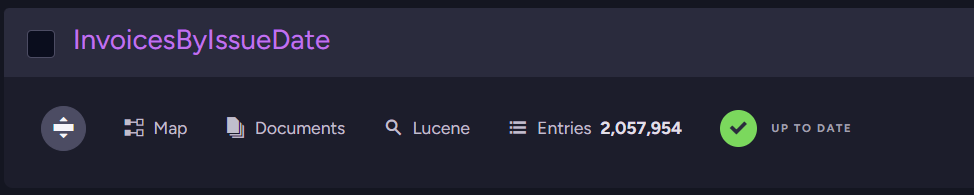
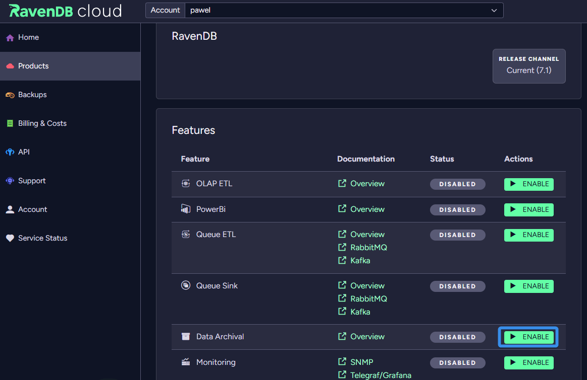
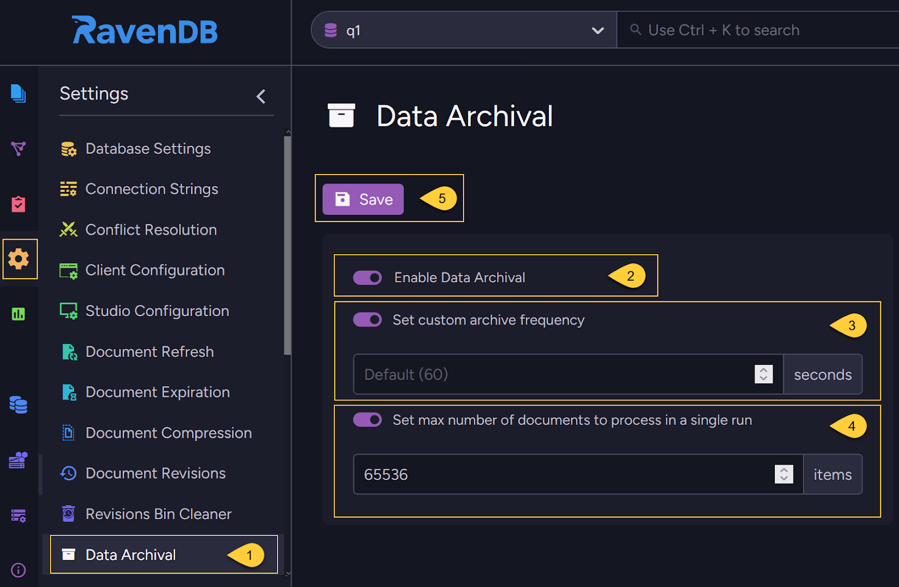
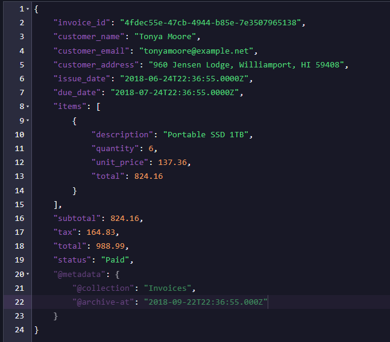
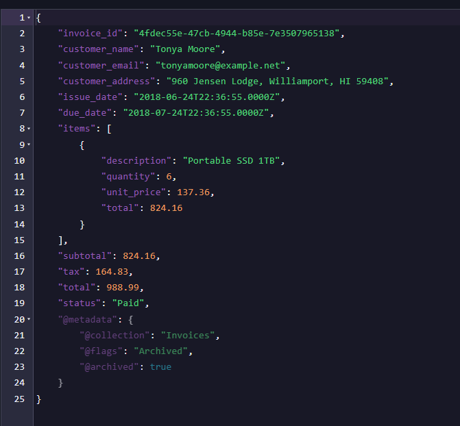
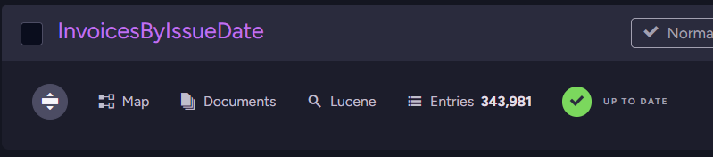
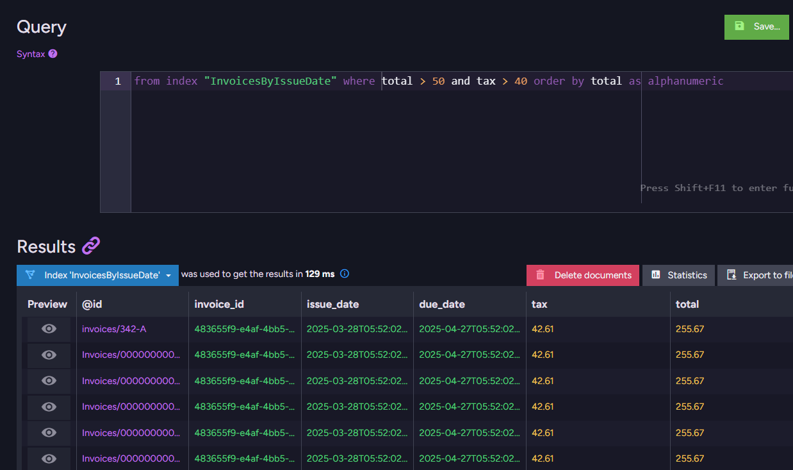
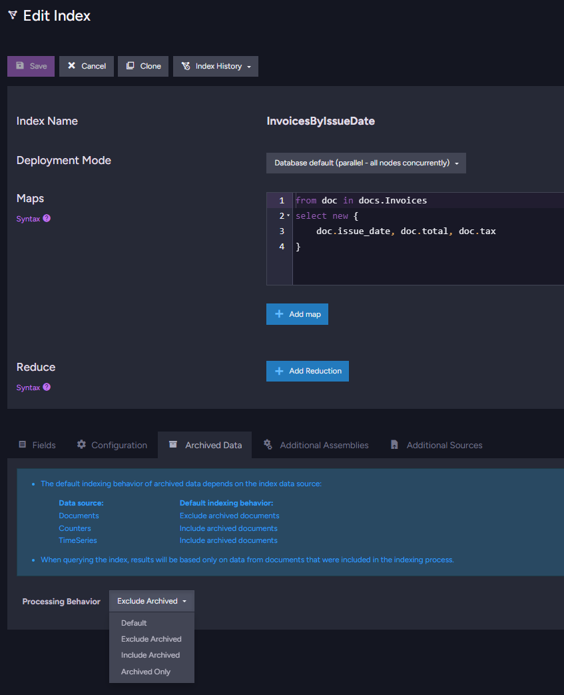
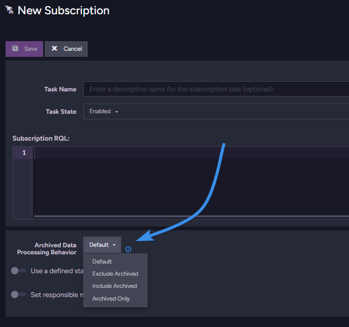

import Admonition from '@theme/Admonition';
import Tabs from '@theme/Tabs';
import TabItem from '@theme/TabItem';
import CodeBlock from '@theme/CodeBlock';
import LanguageSwitcher from "@site/src/components/LanguageSwitcher";
import LanguageContent from "@site/src/components/LanguageContent";

# Employing Data Archival

Let’s say you’re building an invoice processing system. When you first set up your database during development, everything feels great. Routines start storing invoices as documents, and indexes work flawlessly, allowing queries to be processed quickly. The entire system feels smooth and responsive.

As time passes, an increasing number of historical invoices is added to the database due to high usage or as a result of migration. That’s precisely what you wanted; legal restrictions force you to keep them for a couple of years. 

Queries providing different financial analytics (e.g., previous month summaries) still work, but as the indexes become heavier, they need more resources. Over time, performance starts to become low to the point where speed becomes an issue.

You start to investigate and realise it’s not just a spike caused by traffic or a software bug slowing you down. It’s the sheer volume of data that you need to index. 

You can’t just delete older data  with [expiration](https://docs.ravendb.net/7.1/studio/database/settings/document-expiration/) to free space. It’s prohibited by the legal restrictions. Being forced to keep large amounts of required but rarely used documents, only to suffer through slower queries as a result, feels like a torture for your business.

## What is the problem?

The queries that used to return in milliseconds now feel like trying to find one specific receipt in a warehouse stacked to the ceiling. The invoices collection, once neat and small, has now grown into a mountain.

We can even measure this slowdown. A quick example \- let’s run a query to inspect some particular invoices, and order them by total amount in dollars. The user doesn’t want to get ancient results. They just need the data from the last three months.

```
from index "InvoicesByIssueDate" where issue_date >= "2025-06-25T10:21:56.1500Z" and total > 50 and tax > 40 order by total as alphanumeric
```

A query (not so complex) alone took over 1200ms. Exploring the data by the user takes a lot of time, reducing the quality of service and making interacting with your application frustrating.

 
 

Not mentioning overhead of the rest of the system. Forget about instant filtering \- you’re indexing all of the data, even though your users don’t care about the old stuff.

This creates a huge problem as all those files from seven years ago are still being viewed and filtered during the query.

## Getting back on top

To solve this, we can use Data Archival. Archiving preserves the data while excluding it from the indexing process. This makes it possible to keep what’s necessary for legal, historical, or business reasons, without forcing every query and index to shoulder the entire historical data.

Archived documents are (by default) excluded from queries and indexes, making your indexes lighter again. Data is not deleted; it is simply flagged as archived. You can still access archived documents if needed.

Let's see how to leverage Data Archival to make our queries fast again when we operate at scale.

## Help Wanted: Archivist

Now that we know what can help, let's use data archival to solve this problem.

We need to have our digital archivist periodically review and relocate files that should be moved to the archives. This script looks for documents with specific metadata entries to move them aside. How to properly mark those documents we will handle later in this article, but first let’s look at how to spin it up.

To trigger this feature, you can take one of two approaches: from code or the studio. 

**If you’re using RavenDB Cloud,** make sure to enable Data Archival in the Product Features section before continuing.

 

To enable and trigger data archival from your application, we need to define which collection should be archived and set up the archival configuration. That’s how we do that:

```csharp showLineNumbers
using Raven.Client.Documents;
using Raven.Client.Documents.Operations.DataArchival;

// Create the store
using var store = new DocumentStore
{
    Urls = new[] { "http://localhost:8080" },
    Database = "YourDatabaseName"
}.Initialize();

// Define archival configuration
var archivalConfig = new DataArchivalConfiguration
{
    Disabled = false,               // Turn on data archival
    ArchiveFrequencyInSec = 3600,   // How often the archival process should run (optional)
    MaxItemsToProcess = 500         // Max documents per run (optional)
};

// Apply the configuration
await store.Maintenance.SendAsync(new ConfigureDataArchivalOperation(archivalConfig));
```

This code triggers archival in the Invoices database. We set it to check every hour if some documents should be archived.

Note: You can make a synchronous version by deleting await in the apply configuration and changing store.Maintenance.SendAsync to just store.Maintenance.Send.

Or we can trigger it from the studio easily, we just need to:

1. Go to Settings \=\> Data Archival.  
2. Toggle on to enable data archival.  
3. If needed, toggle on customization of the frequency at which the server scans for documents scheduled for archiving. The default is 60 seconds.  
4. Optionally, toggle to customize the maximum number of documents the archiving task will process in a single run.  
5. Click Save to apply your settings.

 

But this is only the beginning. We have only triggered our archival, but now we need to tell RavenDB which files we want to archive.

## Sorting Through the Piles: Choosing What to Archive

Now that our archivist is working, they need to know what we want to archive, and we have numerous invoices for them to review. Now we just need to tell them to archive what we need. For our invoices, we want to archive those older than 90 days. 

We can take different approaches to achieving that. We will start with the simplest. First, let's do it in the studio, and later we will make it from code. 

Let’s enter the studio, select our database, and then the Documents tab. In there, we want to enter the Patch menu. In there, we will use a patch on files to archive files older than 90 days. This patch would look like this:

```javascript showLineNumbers
from "Invoices"
update {
    var archiveDate = new Date(this.issue_date);
    archiveDate.setDate(archiveDate.getDate() + 90);

    archived.archiveAt(this, archiveDateString);
}
```

This code calculates our gap 90 days from the `issue_date` of each file. Then it converts it to an ISO string, allowing us to use and archive it using this calculated value. RavenDB will process all documents in the Invoices collection.

 

Alternatively, we can do it with patchByQuery from code:

```csharp showLineNumbers
string patchByQuery = @"
from Invoices
update {
    // Take the invoice issue_date
    var archiveDate = new Date(this.issue_date);

    // Add 90 days
    archiveDate.setDate(archiveDate.getDate() + 90);

    var archiveDateString = archiveDate.toISOString();

    // Archive the document
    archived.archiveAt(this, archiveDateString);
}";

var patchByQueryOp = new PatchByQueryOperation(patchByQuery);

store.Operations.Send(patchByQueryOp);
```

With this update, we take the `issue_date` of our invoices, add 90 days to it, and convert it to an ISO string. The data archivist that we set up before will see these entries and schedule them for archiving. 

If you want to add an archiving flag to the document when it arrives at the database, you can do that with this additional code after adding this document. For example, it would look like this.

```csharp showLineNumbers
// Assuming 'store' is your initialized IDocumentStore
using (var session = store.OpenSession())
{
    // Create your new document object
    var newInvoice = new Invoice
    {
        InvoiceId = "357b377b-760e-4984-b8c9-05c658309722",
        // ... other properties
    };

    session.Store(newCompany);

    var metadata = session.Advanced.GetMetadataFor(newCompany);

    // Set the archival date to 90 days in the future (in UTC)
    var archiveDate = SystemTime.UtcNow.AddDays(90);
    metadata["@archive-at"] = archiveDate;

    session.SaveChanges();
}
```

## Busy library, quiet archive

How does archival affect this problem? After setting up the archival, documents only 90 days old or newer will be made available by default for all indexes. Because indexes are interconnected with other parts of the system, this affects your whole system. After archiving our files, changes are made to the metadata.

 

And the index becomes smaller, containing fewer files.

 

This will affect queries by reducing the time they need to search through data. After all, a big part of the documents isn’t in the indexes.

 

Query performance improved, but the data is still in the database. Perfect of two worlds.

## Archive behaviour

With added archival to documents, they will be ignored by default during specific actions \- such as index-related tasks and subscriptions. This should make your basic operations faster, and also, as we mentioned, allows us to do a few things differently.

When you have archival enabled during index creation, you can choose the behavior the index should take with archived files. This allows you to choose if you want to exclude those documents, include them, or query only on archived ones.

In indexes, you do that at the bottom of the index in the configuration.

 

Or if you are using subscriptions, you can change this setting directly under subscription RQL. 

 

More information about behaviour can be found in our documentation under this [link](https://docs.ravendb.net/7.1/data-archival/archived-documents-and-other-features).

## Taking documents out

If you need to unarchive a document, it can be done in one of two simple ways. This can be done either in the studio using a patch:

```
from Invoices as o
where o.customer_name == "John Doe"
update {
    archived.unarchive(this)
}
```

Or in code using this auto-index patchByQuery function:

```
string patchByQuery = @"
  // This filtering query creates an auto-index:
  // ===========================================
  from Invoices as o
  where o.customer_name == "John Doe" 
  update 
  {
      archived.unarchive(this)
  }";

var patchByQueryOp = new PatchByQueryOperation(patchByQuery);
store.Operations.Send(patchByQueryOp);
```

Note: Don’t try to just remove `@archived: true` manually in the document. This will not clear the internal flag and just add the metadata back.

## Summary

Data archival gives you more control over your database. By excluding unnecessary documents from queries, it makes them run smoother. But there’s so much more to RavenDB, like GenAI support, which you can read about [here](https://ravendb.net/articles/survive-the-ai-tidal-wave-with-ravendb-genai) and so many other features.

Interested in testing this feature before taking a production licence? Grab the developer license dedicated to testing under this link [here](https://ravendb.net/dev). Any questions about this feature or just want to hang out and talk with the RavenDB team? Join our Discord Community Server \- invitation link is [here](https://discord.com/invite/ravendb).
