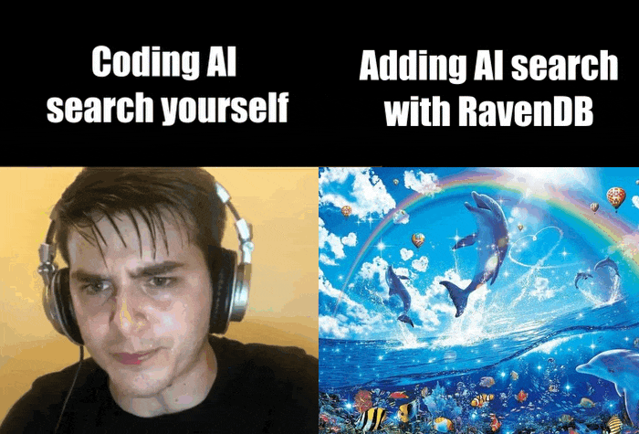

import Admonition from '@theme/Admonition';
import Tabs from '@theme/Tabs';
import TabItem from '@theme/TabItem';
import CodeBlock from '@theme/CodeBlock';
import LanguageSwitcher from "@site/src/components/LanguageSwitcher";
import LanguageContent from "@site/src/components/LanguageContent";
import Image from "@theme/IdealImage";

## Introduction

As AI becomes increasingly intelligent, why not use it to enhance your apps? One of the use cases is improving your app’s search functionality with AI-driven search, also known as semantic search or vector search. This nifty feature utilizes AI-generated embeddings to find the items that are closest in meaning to your input, instead of the ones that happen to share the same characters.

You might be encouraged to implement an AI search for your web app right here and now. Then you start to look deeper and deeper, and it begins to seem like it’s creating challenge after challenge, and you become discouraged. You need to create embeddings somehow, then store them somewhere, and then load or query them efficiently, strategize it out, write tests, then maintain, fix bugs - the list of required tasks goes on and on.

But do not surrender just now. With RavenDB, **it's almost like using a regular search API**. It takes just connecting your AI integration with a simple process and then creating nearly the same query as when you are making a normal query. Awesome right?

Especially since it’s not that hard to implement, let’s look at this simple app created with Next.js. You just enter what you need in the field, and you get matching products you are looking for. If you would like to examine this app yourself, a [GitHub link is available](https://github.com/poissoncorp/ravendb-ai-search-app). Are you curious what is happening underneath this UI? Then let’s go further and look inside.

## Prerequisites

- RavenDB 7.0.1 or later, running locally or in the cloud. If you don’t have a license yet, grab a [free developer license](https://ravendb.net/dev).
- The [sample dataset](/7.2/studio/database/tasks/create-sample-data) loaded into your database, since we query its `Products` collection.
- An [OpenAI API key](https://platform.openai.com/api-keys). Generating embeddings is a billed API call, so keep an eye on your usage while you experiment.
- Node.js 18 or later, plus the [RavenDB Node.js client](https://github.com/ravendb/ravendb-nodejs-client) that we install below.

With those in hand, the Studio configuration takes a couple of minutes and the app code is a single query.

## How it works

Let's see how our example app works and learn how to implement AI search. Let’s start by quickly describing how our app works.

<Image img={require("./assets/ai-search1.webp")} alt="Overview of how the example AI search app works" />

**Search Bar**
Whenever we type something in the search bar, the URL parameter (`q`) changes. On that change, we’re querying RavenDB and re-rendering the products list with new results.

```ts
export function SearchInput() {
    const router = useRouter();
    const searchParams = useSearchParams();
    // create a new state variable within this component, to hold the search term, with default value from the URL
    const [queryState, setQueryState] = useState(searchParams.get("q") || "");

    // on queryState change, update the URL in the browser without refreshing the page
    useEffect(() => {
        const params = new URLSearchParams(searchParams.toString());

        if (queryState) {
            params.set("q", queryState);
        } else {
            params.delete("q");
        }

        router.replace(`?${params.toString()}`);
    }, [queryState]);

    // function to bind to the onChange input field - this will update the state variable
    function handleSearch(term: string) {
        setQueryState(term);
    }

    return (
        <input
            type="text"
            placeholder="Search products..."
            defaultValue={queryState}
            onChange={(e) => handleSearch(e.target.value)}
        />
    );
}
```

### Semantic search with RavenDB vs. building it yourself

As mentioned earlier, creating an AI search bar for your app is more complicated than it may seem at first glance. Let’s compare the approaches:

<Image img={require("./assets/ai-search2.webp")} alt="Comparison of AI search implementation approaches with and without RavenDB" />

Here is the same comparison written out:

| Coding AI search yourself | AI search with RavenDB |
| --- | --- |
| Write an embeddings generation coroutine | Create an AI Task |
| Figure out how and where to store the embeddings | Query for products |
| Work out how to load and query embeddings (vector search) | |
| Write automatic embedding generation for the query terms | |
| Figure out how to cache these, and when to erase the cache | |
| Write cache expiration | |
| Get the performance to an acceptable level | |
| Make sure there are no bugs | |
| Maintain the code and ship new commits when something changes | |

Nine steps become two, and neither of them is code you have to maintain.

### Or in short



As you can see, using RavenDB for AI search makes your life much easier. If you are interested in seeing how this works, grab your RavenDB developer license, collect OpenAI API key, and **test it yourself**. On GitHub, you can read instructions on how to launch it. It is easy to set up and might help you grasp the concept. In case you missed it - [the link to the app repo](https://github.com/poissoncorp/ravendb-ai-search-app).

## How to build the app

### Preparing the database - AI Task

Starting with our data - to query our products by meaning, we needed embeddings, so we set up an AI Task that handles everything for us, making it much more manageable, quicker, and skipping headaches related to AI connection. Here’s how to do it…

If you need more details, connecting your RavenDB database to AI is described in [Embeddings Generation with RavenDB](./embeddings-generation-with-ravendb), but let’s quickly cover how to spin it up:

1. Connecting OpenAI to RavenDB requires you to use RavenDB 7.0.1+. Enter the new ‘AI hub’ section in your database. Go to the AI connection string option and create a new connection string.

<Image img={require("./assets/ai-search4.webp")} alt="Creating a new AI connection string in the RavenDB AI Hub" />

2. Name it, paste the API key, and then select OpenAI.
3. Select ‘text-embedding-3-large’, optionally test the connection, and then save it.
4. Then you need to go into an ‘AI task’ section and create an AI task. Name it ‘openai-large’ and select your created connection string.

<Image img={require("./assets/ai-search5.webp")} alt="Creating an AI task and selecting the connection string in RavenDB Studio" />

5. Select ‘Products’ collection (generated with sample data) and in Path configuration type Name. Then you save your task, and you are ready to go.

<Image img={require("./assets/ai-search6.webp")} alt="Configuring the embeddings task with the Products collection and Name path" />

**Now, we will be able to query RavenDB, like we’d use a regular search feature.**
Let’s dive into the application code.

### Creating a new Next.js app

To create a new application with Next.js, navigate to your directory and open the console. Then you can use the following command to create a new app:

```
npx create-next-app@latest yet-another-one --typescript
```

Now, you can either write your own application or simply copy it from our repository. As we mentioned earlier, we will need the parameter q. It is created in the `search-input.tsx` file, and that’s also the location of our search bar that is connected to this parameter as state. As mentioned before, it changes the URL and allows for search in other parts of the app. That is the `SearchInput` component we walked through in [How it works](#how-it-works), so drop it in as it stands.

### Connecting RavenDB and your app

Remember to install the Node.js [RavenDB SDK](https://github.com/ravendb/ravendb-nodejs-client) in your project using:

```
 npm install --save ravendb
```

We made a separate file where we set up [DocumentStore](/7.2/client-api/what-is-a-document-store), connecting us to the database:

```ts
import {
    DocumentStore,
    GetDatabaseNamesOperation,
    CreateDatabaseOperation
} from "ravendb";

const databaseName = "my-product-search-app";
const store = new DocumentStore("http://127.0.0.1:8080", databaseName);
store.conventions.disableTopologyUpdates = true;
store.initialize();

export { store };
```

Remember to adjust the database name to your needs.

### The search page component

Let’s move to the `page.tsx` file, the heart of your app, which defines your UI and parts of your app's logic. Here, we’re running a vector search query. Here’s the part of the code responsible for that:

```ts
export default async function Home({searchParams}: {searchParams: { [key: string]: string | string[] | undefined }})
{
    const searchTerm = typeof searchParams.q === "string" ? searchParams.q : "";

    const session = store.openSession();

    let products: Product[];

    if (searchTerm) {
        const rawQuery = `
            from Products
            where vector.search(embedding.text(Name, ai.task('openai-large')), $searchTerm, 0.60)
        `;

        products = await session.advanced
            .rawQuery<Product>(rawQuery)
            .addParameter("searchTerm", searchTerm)
            .waitForNonStaleResults()
            .all();
    } else {
        products = await session
            .query<Product>({ collection: "Products" })
            .all();
    }

    return (
        <main>
            <SearchInput />
            <ProductList products={products} />
        </main>
    );
}
```

The ‘Home’ method will render the main page. Inside, we read our `q` state from the URL parameters (using ‘*searchParams’* argument).

After extracting the text from the search bar by accessing the URL parameter, we would like to query for that - we open a RavenDB session and query using vector search, using a ‘rawQuery’ feature that allows sending our query language, RQL, to the server.

### The vector search query

This piece of code is on the `page.tsx` file and will be rerendered every time the parameter q changes. The semantic search itself is a single RQL clause:

```sql
from Products
where vector.search(embedding.text(Name, ai.task('openai-large')), $searchTerm, 0.60)
```

`embedding.text` points at the `Name` field and the `openai-large` AI Task you configured earlier, `$searchTerm` is whatever the user typed, and `0.60` is the [minimum similarity score](/7.2/ai-integration/vector-search/vector-search-using-dynamic-query) a product needs to make the cut. That’s it, easy right?

### Results

Let’s see what we can do with that. First, let’s check if our q changes and appears where it should. Put anything you want in the search bar; we will look for ‘coffee’.

<Image img={require("./assets/ai-search7.webp")} alt="Search results for 'coffee' showing related products in the app" />

As you can see on the URL bar, our parameter is present and responding to changes in our search bar. It even found things similar to coffee, such as tea that you may prefer, and chocolate that you can enjoy during a coffee break with your friends.

Now let's try to do it in a different language. Let’s try looking for chocolate, but in Italian. We get the following results:

<Image img={require("./assets/ai-search8.webp")} alt="Search results for chocolate queried in Italian" />

We can also search for less obvious items. Let’s say we want to eat ‘Something soft for dinner’. What weird results will AI come up with?

<Image img={require("./assets/ai-search9.webp")} alt="Search results for the query 'Something soft for dinner'" />

What is best is that they make sense in different ways, and if we are unsatisfied with the results, we can go back to the query and tune it a bit until it works perfectly for us.

## Summary

- An embeddings generation AI Task handles the whole embeddings lifecycle for you, so adding semantic search to a Next.js app comes down to configuring a connection string and a task in Studio.
- The search itself is one RQL clause, `vector.search(embedding.text(...), $searchTerm, 0.60)`, sent through `rawQuery`, so it slots into your app the same way a regular search API would.
- Vector search matches on meaning rather than characters, which is why ‘coffee’ surfaces tea and chocolate, an Italian query finds English product names, and ‘something soft for dinner’ returns sensible food.
- The similarity threshold is your main tuning knob: raise it for stricter matches, lower it for a wider net, and re-run the query until the results feel right.

Want to go deeper? [Embeddings Generation with RavenDB](./embeddings-generation-with-ravendb) covers the AI connection setup in full, [New in 7.0: RavenDB's Vector Search](./new-in-7-0-ravendbs-vector-search) explains the `vector.search` options and quantization trade-offs, and [Semantic Search with RavenDB, Python and FastAPI](./semantic-search-with-ravendb-python-and-fastapi) builds the same idea on a different stack. If you would rather search pictures than product names, try [AI Image Search with RavenDB](./ai-image-search-with-ravendb).

Check out our [Discord server](https://discord.gg/ravendb) to discuss it with us on **#ravendb** and meet other devs, including the RavenDB Core Team. See you there! 🍻
