import Admonition from '@theme/Admonition';
import Tabs from '@theme/Tabs';
import TabItem from '@theme/TabItem';
import CodeBlock from '@theme/CodeBlock';
import LanguageSwitcher from "@site/src/components/LanguageSwitcher";
import LanguageContent from "@site/src/components/LanguageContent";

# From Zero to a Fully Secured Cluster \- The RavenDB Kubernetes Operator Way

# Prologue

The RavenDB Kubernetes Operator is designed to take the day-to-day operational noise out of running RavenDB on Kubernetes: cluster bootstrapping, TLS wiring, external access, storage layout, rolling upgrades, and health reporting all converge on a single declarative object \- `RavenDBCluster`.

We’re about to embark on a focused, practical series on the **RavenDB Kubernetes Operator** \- not as a black box you “just install”, but as an engineered system you actually understand.   
We’ll start from the ground up: standing up a local lab, preparing a certificates setup package and license, then layering on the operator, TLS modes, external access, storage, observability, and finally rolling upgrades.   
By the time we’re done, you won’t just have a working cluster; you’ll know exactly *why* it works, what the operator is doing behind the scenes, and how to keep it behaving in production.

## 📚Table of Contents

<h3>Prologue</h3>
*Why this series exists, what problems it’s trying to solve, and what “operating RavenDB on Kubernetes” really means beyond YAML.*

<h3>[Part 1: Setup & Operator Installation](#part-1-setup--operator-installation)</h3> 

*Preparing the environment from scratch: setup a K8s cluster, prerequisites, cert-manager, and installing the RavenDB Kubernetes Operator.*

<h3>[Part 2: RavenDBCluster CRD](#part-2-ravendbcluster-crd)</h3> 

*Understanding the RavenDBCluster resource as the single source of truth \- its structure, intent-based design, and how the operator interprets it.*

<h3>[Part 3: External Access \- How Clients Reach the Cluster](#part-3-external-access---how-traffic-reaches-your-cluster)</h3>  

*Configuring external access using ingress controllers, load balancers and node-specific URLs, and mapping RavenDB’s networking model onto Kubernetes primitives.*

<h3>[Part 4: TLS](#part-4-tls)</h3> 

*Securing the cluster with Let’s Encrypt and self-signed certificates, DNS considerations, trust chains, and what “secure by default” really means.*

<h3>[Part 5: Storage](#part-5-storage)</h3>  

*Defining persistent storage for data and logs, understanding StorageClasses and how RavenDB state survives Pod restarts and rescheduling.*

<h3>[Part 6: Bringing the Cluster to Life](#part-6-bringing-the-cluster-to-life)</h3> 

*Assembling the full manifest, creating prerequisites explicitly, applying the cluster, watching bootstrap and reconciliation in action, and accessing RavenDB Studio.*

<h3>[Part 7: Events and Logging](#part-7-events-and-logging)</h3> 

*Learning how to observe the cluster through status, conditions, Kubernetes Events, and logs  \- and how to debug behavior by seeing what the operator sees.*

<h3>[Part 8: Rolling Upgrades](#part-8-rolling-upgrades)</h3>

*Safely upgrading RavenDB versions node by node, understanding upgrade gates, failure scenarios, recovery, and how the operator protects your data during change.*

<h3>Operator Architecture Overview</h3>

The RavenDB Kubernetes Operator is not a collection of manifests. It is a disciplined control system that ensures your RavenDB cluster is deployed securely, consistently, and without guesswork, by embedding RavenDB domain knowledge as code.

Opposed to “assembling a car from parts” (traditional YAMLs), the RavenDB Operator “takes the specification and returns a car that works.”  
You provide the specification, and the operator builds the car.  
And more importantly, unlike Helm charts, it keeps the car functioning exactly as you declared by executing complex workflows to respond to changes.

This series assumes that you want not just a running cluster, but a **reproducible, upgradeable, and secure** one. So before anything else, let’s establish what the operator is, what it controls, and why nearly everything in this series flows from that mental model.

<h3> What the Operator Actually Does</h3> 

User entrypoint is a single document: `RavenDBCluster` \-  the Custom Resource. You describe your cluster → You write it once →  You apply it once.

Kubernetes and the operator take it from there. The operator then assembles everything needed to bring your RavenDB topology to life  \- and keep it alive.

<h3> The Contract and the Enforcer</h3> 

A useful way to think about the model: The `RavenDBCluster` is the **contract**. The operator is the **enforcer**. If your contract says:

- Node A uses certificate A  
- Nodes exposed through HAProxy  
- TLS mode is Let’s Encrypt  
- Storage is 10Gi, ReadWriteOnce  
- Domain is `domain.development.run`


…then the operator ensures this becomes and remains true.  
If something is invalid? The operator blocks it before damage is done via admission webhooks.  
If something needs to be created, updated, reconciled, or rolled out safely?  
The operator oversees that entire lifecycle.

And before we dive into the details, here’s the architecture we’ll gradually build throughout the series. We won’t start with everything at once \- we’ll assemble it piece by piece, explain each component as it enters the picture, and by the end, you’ll understand exactly how the full system fits together:

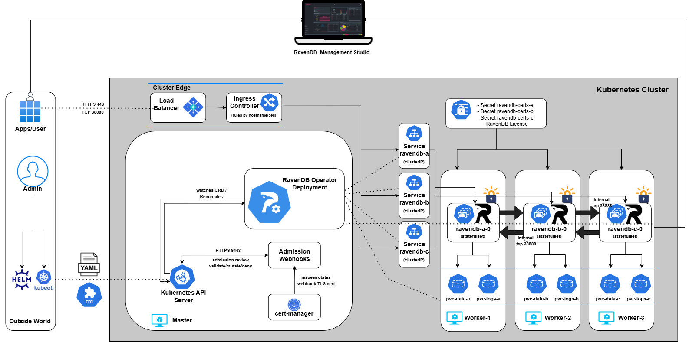

## Part 1: Setup & Operator Installation

This series begins by establishing the full baseline **before** we even think about CRDs. We’re building the foundation the rest of the series depends on.

By the end of Part 1, you will have:

- A working Kubernetes lab \- Kind, EKS, or AKS  
- cert-manager installed, providing TLS for the operator’s admission webhooks  
- The RavenDB Operator deployed using Helm, Make, or OLM

Once this groundwork is in place, everything else becomes “just” CRD design and incremental refinement.

<h3> Lab Setup </h3>

Before we talk about certificates, Secrets, or the Operator, we need a live Kubernetes cluster. This series supports three environments:

\- Kind (local development \- fast, disposable, recommended for following along)

\- EKS (AWS)

\- AKS (Azure)

Each path gives you a working cluster suitable for the Operator, admission webhooks, ingress routing, and later a real LoadBalancer IP for certificate issuance. Pick the environment that matches your workflow.

Throughout this series, we’ll demonstrate a **three-node RavenDB cluster**, with each RavenDB pod scheduled onto its own worker node.   
This gives us a clear, production-like topology and makes networking, storage, and failure behavior easy to reason about.

If you want to run more than three nodes, the model stays the same: provision additional worker nodes with the same placement characteristics, and later declare the desired number of RavenDB nodes in the cluster specification.  
We’ll cover how node count, scheduling, and affinity are expressed declaratively when we get to the `RavenDBCluster` resource itself.

For now, focus on bringing up a healthy cluster with the topology you intend to support. Everything else in the series builds on that foundation.

<Tabs>
<TabItem value="kind" label="Kind">

For this series, Kind is the fastest way to experiment.    
It’s fast, disposable, predictable, and gives us something that behaves like a real Kubernetes cluster without the overhead of a cloud provider. 

Instead of the usual one-node toy cluster, we’re going to shape it to match the architecture we’ll build later: one control-plane node for infrastructure, and three worker nodes that will eventually host RavenDB nodes A, B, and C.

This mirrors the architecture we’ll build throughout the series and gives the Operator room to express real scheduling logic.

Kind makes this trivial. All we need is a small configuration file describing the topology. Save the following as `ravendb-kind.yaml`:

```
# ravendb-kind.yaml
kind: Cluster
apiVersion: kind.x-k8s.io/v1alpha4
nodes:
  - role: control-plane
  - role: worker
  - role: worker
  - role: worker
```

This gives us a clean four-node lab: a place for the operator, cert-manager, and the ingress controller to sit, and three dedicated machines for the database layer.

Now create the cluster:

```bash showLineNumbers
$ kind create cluster --name ravendb --config ravendb-kind.yaml

Creating cluster "ravendb" ...
 ✓ Ensuring node image (kindest/node:v1.29.2) 🖼
 ✓ Preparing nodes 📦 📦 📦 📦
 ✓ Writing configuration 📜
 ✓ Starting control-plane 🕹️
 ✓ Installing CNI 🔌
 ✓ Installing StorageClass 💾
 ✓ Joining worker nodes 🚜
Set kubectl context to "kind-ravendb"
```

You should now see a single control-plane node and three workers, all in a Ready state. This layout matters: it mirrors the structure of a real multi-node RavenDB deployment, and it ensures that everything we build later lands exactly where it should.

```bash showLineNumbers
$ kubectl config use-context kind-ravendb
$ kubectl get nodes

NAME                    STATUS   ROLES           AGE   VERSION
ravendb-control-plane   Ready    control-plane   39s   v1.29.2
ravendb-worker          Ready    <none>          18s   v1.29.2
ravendb-worker2         Ready    <none>          23s   v1.29.2
ravendb-worker3         Ready    <none>          19s   v1.29.2

```

</TabItem>
<TabItem value="aws" label="EKS(AWS)">

If you want to follow this series on real cloud infrastructure rather than a local lab, EKS is the straightforward option.   
It gives you a managed control-plane, predictable node behavior, and a cluster that feels exactly like the environments the Operator is ultimately designed for. Nothing here is simulated: scheduling, networking, and control-plane interactions all behave the way Kubernetes intends.

For our purposes, a small three-node worker pool that will eventually host our RavenDB nodes is more than enough. It provides room for scheduling, separation of concerns, and a topology that behaves the way a real multi-node deployment should.

Follow the [Getting Started Guide,](https://docs.aws.amazon.com/eks/latest/userguide/getting-started.html) up to the point where you have installed the aws cli and kubectl and you have a running 4-node Kubernetes cluster. 

You’ll also need to be mindful of the AWS internals that come with this setup \- the service role, VPC, subnets, and security group created by EKS are all part of the environment the Operator will eventually rely on, even if you don’t interact with them directly.

Furthermore, make sure your EKS cluster must run in a VPC that spans **at least 3 subnets across different 3 Availability Zones**.   
We’ll take advantage of this later when the platform provisions network components across those subnets \- particularly load-balancing infrastructure.   
AWS load balancers are zone-aware: they expect nodes or endpoints in multiple AZs so they can route traffic evenly and remain resilient during zone-level failures. Without this multi-AZ VPC foundation, many core networking features simply won’t function as intended.

Before moving on, it’s worth verifying that the cluster was created the way you expect \- both in terms of node count and network placement.

To check the node pool (master node won’t show here since it’s managed control plane):

```bash showLineNumbers
$ kubectl get nodes -o wide

NAME                         STATUS   ROLES    AGE   VERSION
ip-10-0-0-140.ec2.internal   Ready    <none>   13m   v1.34.2-eks-ecaa3a6
ip-10-0-1-104.ec2.internal   Ready    <none>   13m   v1.34.2-eks-ecaa3a6
ip-10-0-2-188.ec2.internal   Ready    <none>   13m   v1.34.2-eks-ecaa3a6
```

Next, confirm that each node resides in the same VPC but in different subnets / Availability Zones:

```bash showLineNumbers
$ $ for id in $(kubectl get nodes -o jsonpath='{.items[*].spec.providerID}' | tr ' ' '\n' | awk -F/ '{print $NF}'); do
  echo "Node $id:"
  aws ec2 describe-instances \
    --instance-ids "$id" \
    --query "Reservations[0].Instances[0].{AZ:Placement.AvailabilityZone, Subnet:SubnetId}" \
    --output table
done

Node i-025f94927c1927e9a:
|     AZ      |          Subnet            |
+-------------+----------------------------+
|  us-east-1a |  subnet-0a349ea200146cc61  |
+-------------+----------------------------+

Node i-054adaa3e00978f10:
|     AZ      |          Subnet            |
+-------------+----------------------------+
|  us-east-1b |  subnet-0b51a8fe3336db586  |
+-------------+----------------------------+

Node i-07fd51b112751f9e1:
|     AZ      |          Subnet            |
+-------------+----------------------------+
|  us-east-1c |  subnet-0fb4c5cb567cee82a  |
+-------------+----------------------------+

```
</TabItem>
<TabItem value="aks" label="AKS(Azure)">

If you prefer to follow this series on Azure, AKS provides a clean, fully managed Kubernetes control plane that behaves exactly the way the RavenDB Operator expects.   
Azure provisions and maintains the API server, handles node lifecycle behind the scenes, and provides a predictable, production-grade environment without local simulation.

For our needs, a **three-node worker pool** is more than sufficient. It mirrors the topology we will use throughout the series and gives us a true multi-node foundation without unnecessary complexity.

Follow the [Azure Kubernetes Service Quickstart](https://learn.microsoft.com/en-us/azure/aks/learn/quick-kubernetes-deploy-portal?tabs=azure-cli) until you have installed the az cli and kubectl, and created a running 4-node cluster (1 control-plane \+ 3 workers).

Your AKS cluster must run inside a single Virtual Network (VNet) across three Azure Availability Zones.

Why this matters:

* Azure’s Standard Load Balancer (which we will rely on later when exposing RavenDB nodes) is **zone-aware**.  
* It distributes traffic across nodes in different zones to ensure resiliency and even routing.

Azure creates most infrastructure automatically- VNet, subnets, route tables, and network security groups.   
Before moving on, it’s worth verifying that the cluster was created the way you expect \- both in terms of node count and network placement

To check the node pool:

```bash showLineNumbers
$ kubectl get nodes -L topology.kubernetes.io/zone

NAME                                STATUS   ROLES    AGE     VERSION   ZONE
aks-agentpool-98915199-vmss000003   Ready    <none>   4m21s   v1.33.5   eastus-1
aks-ravendbnp-98915199-vms4         Ready    <none>   4m23s   v1.33.5   eastus-2
aks-ravendbnp-98915199-vms5         Ready    <none>   4m21s   v1.33.5   eastus-3
aks-ravendbnp-98915199-vms6         Ready    <none>   4m26s   v1.33.5   eastus-1
```

If all three workers nodes show different zones \- AZ distribution is correct.

</TabItem>
</Tabs>

This is how our architecture looks like after successful setup:

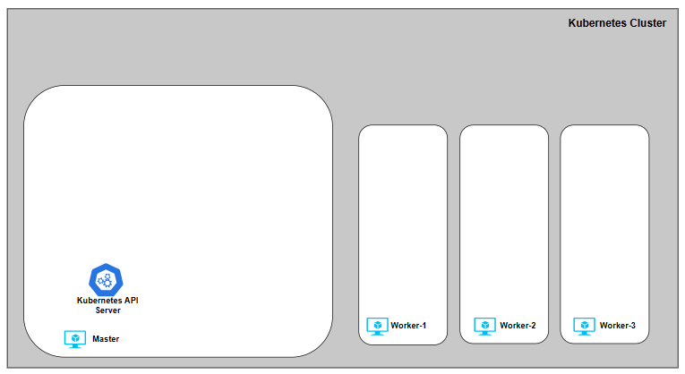

Now, let’s deploy dependencies and RavenDB Operator itself.

<h3> Cert-manager </h3>

The RavenDB Kubernetes Operator requires a cert-manager to be installed in the cluster.

In this setup, cert-manager is **not** used to issue or manage RavenDB server certificates.  
Its role is limited to providing TLS certificates for the operator’s admission webhooks, which Kubernetes requires to communicate securely with the operator.

For now, it’s enough to know that the cert-manager must be present and healthy before the operator is installed. We’ll revisit the webhook layer later in the series.

You can install cert-manager either via the official Helm chart or by applying the latest published manifests directly.

To install using the upstream manifests:

```bash showLineNumbers
$ kubectl apply -f https://github.com/cert-manager/cert-manager/releases/latest/download/cert-manager.yaml
```

For more details and alternative installation methods, see the official documentation:  
[https://cert-manager.io/](https://cert-manager.io/)

Before proceeding to install the RavenDB Operator, make sure cert-manager is fully deployed and healthy:

```bash showLineNumbers
$ kubectl get pods -n cert-manager

NAME                                      READY   STATUS    RESTARTS   AGE
cert-manager-79559475b4-wsf64             1/1     Running   0          12m
cert-manager-cainjector-966fc8fbc-lkqwg   1/1     Running   0          12m
cert-manager-webhook-854cf5f458-sk8kx     1/1     Running   0          12m
```

<h3> Deploy the RavenDB Operator </h3>

There are three supported ways to install the RavenDB Kubernetes Operator.  
 Each fits a different workflow:

1. **Helm (recommended)** \- the simplest, most repeatable installation method.

2. **make deploy** \-  intended for contributors or anyone working from source.

3. **OLM bundle installation** \- for clusters managed by Operator Lifecycle Manager.

Note: The following methods install only the operator. A RavenDB cluster will start **only after** we will create the necessary Secrets and apply a `RavenDBCluster` resource later.

Below are all three options, choose the workflow that fits your environment:
<Tabs>
<TabItem value="helm" label="Helm">

[Helm](https://helm.sh/docs/) is the recommended installation method for most users.  
Helm charts bundle Kubernetes manifests with sensible defaults, allowing configuration via values.  
It provides a versioned, declarative way to install the RavenDB Operator via our official chart published on Artifact Hub: [https://artifacthub.io/packages/helm/ravendb-operator/ravendb-operator](https://artifacthub.io/packages/helm/ravendb-operator/ravendb-operator)

```bash showLineNumbers
# add the repository
$ helm repo add ravendb-operator https://ravendb.github.io/ravendb-operator/helm
$ helm repo update

# install the operator
helm install ravendb-operator \
  ravendb-operator/ravendb-operator \
  -n ravendb-operator-system \
  --create-namespace

# verify 
$ kubectl get pods -n ravendb-operator-system

NAMESPACE                 NAME                                                   READY   STATUS      RESTARTS   AGE
ravendb-operator-system   ravendb-operator-controller-manager-5cc75fcdb7-2nq2k   1/1     Running     0          103s

```
</TabItem>
<TabItem value="deploy" label="Make deploy">

This method is intended for contributors and advanced users working directly from source.  
It builds the operator locally and deploys the raw Kubernetes manifests from the `config/` directory using `kubebuilder`, `Kustomize` and `controller-runtime` tooling.  
It deploys the manifests under `config/` and uses **your local code** rather than a released image.

Use this approach when developing, debugging, or testing changes to the operator itself.  
It is **not** recommended for production installations.

More about `kubebuilder`\-based operators:  
 [https://book.kubebuilder.io/](https://book.kubebuilder.io/)  
 [https://sdk.operatorframework.io/](https://sdk.operatorframework.io/)

```bash showLineNumbers
# clone and enter the repository
$ git clone https://github.com/ravendb/ravendb-operator.git
$ cd ravendb-operator

# build the controller locally
$ make build

# deploy the operator
$ make deploy

# verify 
$ kubectl get pods -n ravendb-operator-system

NAMESPACE                 NAME                                                   READY   STATUS      RESTARTS   AGE
ravendb-operator-system   ravendb-operator-controller-manager-6d9d9b57c9-qkqt2   1/1     Running     0          88s
```

</TabItem>
<TabItem value="olm" label="OLM">

Operator Lifecycle Manager (OLM) is commonly used in enterprise Kubernetes environments, including OpenShift, to standardize operator installation and lifecycle management.

The RavenDB Operator is published on OperatorHub and can be installed via its OLM bundle for a straightforward, catalog-based installation: [https://operatorhub.io/operator/ravendb-operator](https://operatorhub.io/operator/ravendb-operator)

More about OLM and OperatorHub:  
[https://olm.operatorframework.io/](https://olm.operatorframework.io/)  
[https://operatorhub.io/](https://operatorhub.io/)

```bash showLineNumbers
# install olm
$ curl -sL https://github.com/operator-framework/operator-lifecycle-manager/releases/download/v0.38.0/install.sh | bash showLineNumbers -s v0.38.0

# install the RavenDB Operator via its bundle
$ kubectl create -f https://operatorhub.io/install/ravendb-operator.yaml

# verify 
$ kubectl get pods -n ravendb-operator-system
NAMESPACE                 NAME                                                   READY   STATUS      RESTARTS   AGE
ravendb-operator-system   ravendb-operator-controller-manager-64d4ffc48d-9tlfb   1/1     Running     0          96s
```

</TabItem>
</Tabs>

Whatever installation path you choose, the end result is identical:

* Create the `ravendb-operator-system` namespace  
* Deploy the operator controller  
* Deploy the required admission webhooks  
* Register the `RavenDBCluster` CRD

Nothing cluster-specific happens yet \-  no Secrets, no RavenDB nodes.  
This is just the operator itself, waiting for a `RavenDBCluster` definition.

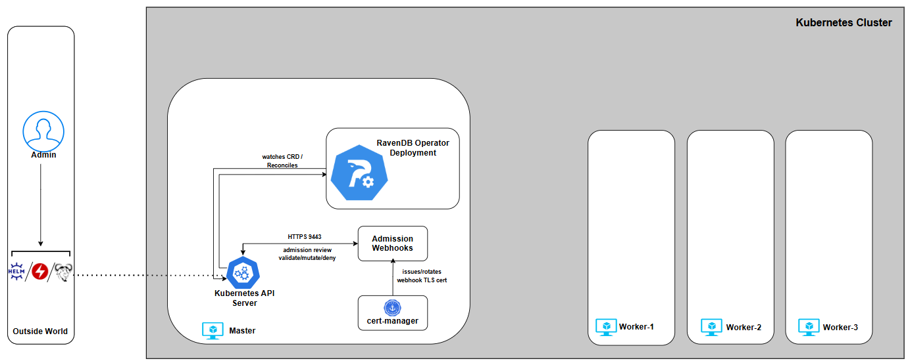

With the operator installed and the baseline environment ready, you can now continue to **Part 2**, where we introduce the `RavenDBCluster` CRD \- the contract that defines what the Operator builds, validates, and enforces, and the foundation we’ll extend step by step throughout the rest of the series.

## Part 2: RavenDBCluster CRD

In Part 1, we installed the Operator on a new Kubernetes cluster.  
But the Operator still isn’t doing anything \- by design. It waits for user input by watching for a **Custom Resource** that describes their intent, and then it makes Kubernetes match that desired state. For us, that resource is `RavenDBCluster`.

This CRD is the Operator’s contract: it’s the single place where you declare the cluster you want, and the Operator turns that declaration into real Kubernetes resources (StatefulSets, Services, Secrets wiring, bootstrap jobs, and more).

We’ll build the `RavenDBCluster` spec the same way the Operator reasons about it: **one capability at a time**, with each chapter adding a small, understandable piece.

So in Part 2 we’ll do three things:

1. Understand the CR file header (what Kubernetes needs vs what the Operator cares about)

2. Introduce the license as the first real dependency the Operator must reference

3. Start a minimal CR skeleton we’ll expand gradually in later parts

<h3>The CR File Header</h3> 

Every `RavenDBCluster` manifest starts with the same Kubernetes “header” fields:

* `apiVersion` and `kind` tell Kubernetes which CRD this YAML belongs to  
* `metadata.name` is the cluster’s identity inside Kubernetes  
* `metadata.namespace` decides where the Operator will create and manage the cluster resources  
* `metadata.labels` are optional but useful for consistency, tooling, and filtering

```bash showLineNumbers
apiVersion: ravendb.ravendb.io/v1
kind: RavenDBCluster
metadata:
  labels:
    app.kubernetes.io/name: ravendb-operator
  name: ravendbcluster-sample
  namespace: ravendb
spec:
  # we’ll build this gradually
```

At this stage, `spec` is intentionally empty. That’s the point: we’re building this in controlled increments.

<h3>Image and Pull Policy</h3>

```bash showLineNumbers
spec:
 image: ravendb/ravendb:7.1.3-ubuntu.22.04-x64
 imagePullPolicy: IfNotPresent
```

At first glance, the image fields look like standard Kubernetes configuration, but The RavenDB Kubernetes Operator treats `spec.image` as a strictly validated input. 

Only **official RavenDB images** are accepted, and they must be **explicitly versioned**. Floating references, implicit defaults, or ambiguous image formats are rejected. Using floating tags is considered a bad practice, as it leaves the door open to unexpected image upgrades.

Just as importantly, the Operator enforces **version direction**.  
Once a cluster exists, image changes are validated to prevent accidental downgrades.   
Upgrades and re-applying the same version are allowed; moving backwards is not.   
This protects the cluster from subtle data and compatibility issues that can arise when rolling back binaries against the existing state.

In short: image selection is not “just a container reference.” It’s a controlled, validated input that the RavenDB Operator uses to reason safely about cluster lifecycle.

The `imagePullPolicy` controls how Kubernetes retrieves the container image. In this series we use: `imagePullPolicy: IfNotPresent`

This keeps behavior predictable, avoids unnecessary image pulls, and still allows intentional version changes to take effect.   
Other policies are supported, but for stateful workloads, stability and repeatability matter more than chasing the latest image on every restart.

Together, `image` and `imagePullPolicy` define *what* runs and *when it changes* \- and the Operator makes sure both happen deliberately, not accidentally.

<h3>License Reference</h3>

RavenDB requires a valid license to run in any meaningful configuration. This is not something the Operator generates or manages for you \- it is an explicit dependency that must be provided by the user.

For local development and testing environments, you can obtain a **free developer license** from:  
[https://ravendb.net/dev](https://ravendb.net/dev)

The license is provided as a `license.json` file. For now, simply download it and keep it handy. 

The license is expected to be stored as a Kubernetes Secret and referenced by name. Before we define it, let’s declare the dependency in the `RavenDBCluster` spec. If the Secret does not exist, the Operator will refuse to proceed rather than attempting a partial or invalid deployment.

We express that intent by adding `licenseSecretRef` to the CR:

```bash showLineNumbers
spec:
  licenseSecretRef: ravendb-license
```

The CR now clearly states *what* it depends on, even though we haven’t satisfied that dependency yet.

In a later step, we’ll create the `ravendb-license` Secret from `license.json`. Once that Secret is present, the Operator will pick it up and inject the license during cluster provisioning.

<h3>Environment Variables</h3>

The Operator allows you to pass RavenDB server configuration through environment variables using `spec.env`.   
This is the most natural and declarative way to configure RavenDB in Kubernetes, without custom images or in-container file edits.

RavenDB exposes its configuration via environment variables using a simple convention: configuration keys are prefixed with `RAVEN_`, and dots (`.`) are replaced with underscores (`_`).   
For example:

```bash showLineNumbers
spec:
  env:
    RAVEN_Features_Availability: "Experimental"
```

Any supported RavenDB configuration option can be expressed this way and will be applied uniformly to all nodes managed by the Operator.   
Changes here are intentional, explicit, and version-controlled as part of the cluster spec.

The full list of available configuration options and naming rules is documented here:  
 [https://docs.ravendb.net/server/configuration/configuration-options/](https://docs.ravendb.net/server/configuration/configuration-options/?utm_source=chatgpt.com)

At this point, we’ve deliberately resisted the temptation to define a full cluster.  
We haven’t talked about nodes, storage, certificates, or networking yet \- and that’s intentional. What we *have* done is establish the first, non-negotiable pieces of the contract between you and the Operator:

* **What runs** (the RavenDB image, explicitly versioned)  
* **How it’s pulled** (predictable, repeatable behavior)  
* **What it depends on** (a license, declared but not yet satisfied)  
* **How it’s configured** (explicit, declarative environment variables)

Here is the complete `RavenDBCluster` Custom Resource as it stands at the end of Part 2:

```bash showLineNumbers
apiVersion: ravendb.ravendb.io/v1
kind: RavenDBCluster
metadata:
  labels:
    app.kubernetes.io/name: ravendb-operator
  name: ravendbcluster-sample
  namespace: ravendb
spec:
  image: ravendb/ravendb:7.1.3-ubuntu.22.04-x64
  imagePullPolicy: IfNotPresent
  licenseSecretRef: ravendb-license
  env:
    RAVEN_Features_Availability: "Experimental"
```

With the `RavenDBCluster` contract now in place, we can move on to **Part 3**, where we focus on external access \- how traffic reaches your cluster, howURLs map to Kubernetes networking, and how the Operator wires ingress controllers or cloud load balancers into a secure RavenDB deployment.

## Part 3: External Access \- How Traffic Reaches Your Cluster

Before touching CRDs or cluster logic, we made sure the ground was solid: a real Kubernetes cluster, cert-manager installed, and the RavenDB Operator deployed and ready.

This chapter answers a deceptively simple question:  
How does traffic reach a RavenDB node running inside Kubernetes?

For RavenDB, this question matters more than usual.  
A RavenDB cluster is not “just” an HTTP service. Each node exposes:

* HTTPS (443) for Studio, client traffic, and REST APIs  
* TCP (38888) for inter-node cluster communication

Both must be reachable, stable, and correctly mapped to each node’s identity.

<h3>The Operator’s Perspective on External Access</h3>

Operator won’t guess how your networking should look, especially it won’t auto-discover public IPs and “hope for the best.” It doesn’t hide networking decisions behind magic annotations.

The Operator supports two approaches to external access:

**1\. Ingress Controller-based access (IC)**

* [Traefik](https://doc.traefik.io/traefik/reference/install-configuration/providers/kubernetes/kubernetes-ingress/)  
* [HAProxy](https://www.haproxy.com/documentation/kubernetes-ingress/)  
* [NGINX](https://github.com/kubernetes/ingress-nginx)

**2\. Cloud Load Balancer-based access**

* [AWS Network Load Balancer (NLB](https://docs.aws.amazon.com/elasticloadbalancing/latest/network/introduction.html)) on EKS  
* [Azure Load Balancer](https://learn.microsoft.com/en-us/azure/load-balancer/load-balancer-overview) on AKS

Both consist of first-class, production-grade pathsm and are fully supported by the Operator, but they solve the problem differently. 

The important part is that this choice is explicit. You tell the Operator which model you want to use, and it validates and enforces that choice.

That decision lives directly in the `RavenDBCluster` spec under `externalAccessConfiguration`  
 At the highest level, you select **one** access type:

* `ingress-controller`  
* `aws-nlb`  
* `azure-lb`

For example, choosing an ingress controller looks like this:

```bash showLineNumbers
spec:   externalAccessConfiguration:	type: ingress-controller
```

At this stage, this is just a declaration of intent. The detailed configuration for each model is added incrementally later in this part.

<h3>Ingress Controllers: One Entry Point, Many Routes</h3>

Ingress-based setups are about **consolidation**.

You run a single ingress controller , expose it via one external IP, and route traffic internally based on **SNI hostnames**.

In this model:

* All traffic enters through the ingress controller  
* TLS is passed through (not terminated by the IC)  
* Routing is based on hostnames like:  
  * `a.domain.run` → RavenDB node A  
  * `a-tcp.domain.run` → RavenDB node A (TCP)  
* Ports are typically:  
  * **443** for HTTPS  
  * **38888** for TCP

This approach works consistently across: Kind, EKS, AKS, and On-prem clusters  
It is especially attractive for: Local development, Homogeneous environments  
And Teams already standardized on an ingress controller.

The Operator integrates with ingress controllers by **generating the Kubernetes resources**, while respecting the controller’s native routing model.

<h3>Load Balancers: One Entry Point per Node</h3>

Load-balancer-based setups are about explicitness and isolation.  
Each RavenDB node gets its own externally reachable IP and its own direct network path  
This model aligns well with cloud platforms.

<h4>On AWS (EKS)</h4>

* One **NLB per RavenDB node**  
* Each NLB:  
  * Is pinned to a specific subnet  
  * Lives in a specific Availability Zone  
  * Uses a pre-allocated Elastic IP

<h4>On Azure (AKS)</h4>

* A **single, zone-redundant Standard Load Balancer**  
* Multiple public IP frontends  
* Each RavenDB node maps to a specific frontend IP

In both cases, the Operator does not blindly create networking. You provide the mappings; the Operator enforces them.

<Admonition type="note" title="Choosing One Model and Sticking to It"> 

A key recommendation for this series: Pick one external access model and stay within its ecosystem.

If you are on AWS \- Prefer AWS NLBs and let AWS handle routing, zones, and resiliency  
If you are on Azure \- Prefer Azure Load Balancer, lean on AKS defaults and zone redundancy  
If you are running locally or want maximum portability \- Use an ingress controller consistently

</Admonition>

<h3>Walking Through External Access</h3> 

We’ll start on Kind by installing an ingress controller only. At this stage, there are no RavenDB pods, no cluster, and no traffic flowing yet. The goal is simply to put the external access layer in place so it’s ready when the Operator later creates RavenDB resources.

Throughout this series, we will use the default RavenDB ports:

* **443** \-  HTTPS  
* **38888** \- TCP

These ports are configurable, and advanced setups may change them. All examples, manifests, and CRs in this series assume these ports unless explicitly stated otherwise.

<h3>Ingress Controllers</h3> 
<Tabs>
<TabItem value="traefik" label="Traefik">

Traefik is a great fit for this series because it can route both HTTPS (443) and raw TCP (38888) traffic using SNI while remaining in TLS passthrough mode. That means Traefik doesn’t terminate certificates \- it simply forwards traffic based on the hostname, and RavenDB remains in full control of TLS.

**1\) Add the Traefik Helm repo**

```bash showLineNumbers
$ helm repo add traefik https://traefik.github.io/charts
$ helm repo update
```

**2\. Create a minimal `values.yaml`**   
This enables two entry points: `websecure` on :443 and `tcp` on :38888 Both are configured for TLS passthrough.

```bash showLineNumbers
# values.yaml
entryPoints:
  websecure:
    address: ":443"
    http:
      tls:
        passthrough: true

  tcp:
    address: ":38888"
    http:
      tls:
        passthrough: true

providers:
  kubernetesCRD: {}
```

**3\. Install Traefik**  


```bash showLineNumbers
$ helm install traefik traefik/traefik --namespace traefik --create-namespace \
  -f values.yaml --wait
```

**4\. Install Traefik CRDs (needed for TCP routes)**
We’ll later use `IngressRouteTCP` objects to express SNI routing rules.

```bash showLineNumbers
$ kubectl apply -f https://raw.githubusercontent.com/traefik/traefik/v3.0/docs/content/reference/dynamic-configuration/kubernetes-crd-definition-v1.yml
```

**5\. Sanity check (Traefik is up)**

```bash showLineNumbers
$ kubectl get pods -n traefik
NAME                       READY   STATUS    RESTARTS   AGE
traefik-5598654f8d-l6zpr   1/1     Running   0          8m55s
```

At this point Traefik is installed and listening on **443** and **38888**, but it has nothing to route yet \- no RavenDB services, no routes, no traffic. In the next steps (once we deploy a cluster), we’ll apply `IngressRouteTCP` definitions that map hostnames like `a.domain.run` and `a-tcp.domain.run` to the RavenDB node services.

Finally, this is how the ingress controller is referenced from the `RavenDBCluster` spec:

```bash showLineNumbers
externalAccessConfiguration:
  type: ingress-controller
  ingressControllerContext:
    ingressClassName: traefik
```

You can further fine-tune how the ingress controller behaves by passing controller-specific annotations through the `RavenDBCluster`  spec.   
These annotations are applied directly to the generated ingress resources:

```bash showLineNumbers
externalAccessConfiguration:
  type: ingress-controller
  ingressControllerContext:
    ingressClassName: traefik
    additionalAnnotations:
traefik.ingress.kubernetes.io/router.observability.metrics: "true"
```

</TabItem>

<TabItem value="haproxy" label="HAProxy">

HAProxy is a good fit when you want explicit, predictable routing with minimal abstraction.   
It exposes traffic directly through Kubernetes Services and relies on HAProxy’s mature TCP and HTTPS handling, while still allowing RavenDB to retain control over TLS.

In this setup, HAProxy listens on HTTPS (443) and forwards traffic based on SNI, operating as a transparent routing layer rather than a TLS terminator.

**1\) Add the Traefik Helm repo**

```bash showLineNumbers
$ helm repo add haproxytech https://haproxytech.github.io/helm-charts
$ helm repo update
```

**2\) Create a minimal `values.yaml`**

We deploy HAProxy as a `DaemonSet` so that it runs on every node, and expose it via a `LoadBalancer` service on port 443 and 38888\.  
HTTP (80) is enabled by default but will not be used for RavenDB.

```bash showLineNumbers
# values.yaml
controller:
  kind: DaemonSet

  service:
    type: LoadBalancer
    ports:
      http: 80
      https: 443
      tcp: 38888
```

**3\) Install the HAProxy ingress controller**

```bash showLineNumbers
$ helm install haproxy haproxytech/kubernetes-ingress --namespace haproxy-controller \
  --create-namespace -f values.yaml --wait
```

**4\) Sanity check (HAProxy is up)**

```bash showLineNumbers
$ kubectl get pods -n haproxy-controller

NAME                               READY   STATUS    RESTARTS   AGE
haproxy-kubernetes-ingress-g998x   1/1     Running   0          51s
```

Once the controller is running and the LoadBalancer service is provisioned, HAProxy is ready to accept external HTTPS traffic. At this stage, there are still no RavenDB services, no routes, and no traffic flowing \-we’ve only prepared the external access layer.

In the next steps, once we deploy a RavenDB cluster, the Operator will generate the appropriate routing resources so that HAProxy can forward traffic to the correct RavenDB node based on hostname.

Finally, this is how the ingress controller is referenced from the `RavenDBCluster` spec:

```bash showLineNumbers
externalAccessConfiguration:
  type: ingress-controller
  ingressControllerContext:
    ingressClassName: haproxy
```

You can further fine-tune how the ingress controller behaves by passing controller-specific annotations through the `RavenDBCluster`  spec.   
These annotations are applied directly to the generated ingress resources:

```bash showLineNumbers
externalAccessConfiguration:
  type: ingress-controller
  ingressControllerContext:
    ingressClassName: haproxy    
    additionalAnnotations:
      haproxy.ingress.kubernetes.io/maxconn-server: "100"

```

</TabItem>

<TabItem value="nginx" label="NGINX">

NGINX is the “classic” ingress option and is still widely deployed, which makes it a familiar baseline for many users.

In this setup, NGINX acts as a simple ingress layer that exposes standard HTTP and HTTPS entry points. Just like with the other ingress controllers, at this stage **there are no RavenDB pods, no routes, and no traffic** \- we are only preparing the external access layer so the Operator can integrate with it later.

<Admonition type="note" title="Choosing One Model \- and Sticking to It"> 

The community ingress-nginx project is on a deprecation path.   
Best-effort maintenance is expected to continue until **March 2026**, after which no new releases or security fixes are planned.  
This doesn’t mean existing clusters will immediately break, but it does mean this option should be treated as increasingly legacy, especially for long-lived or production environments.

If you are starting fresh today, Traefik or HAProxy are generally better long-term choices. NGINX remains useful for existing platforms or environments that already rely on it.

</Admonition>

**1\) Apply the ingress controller**

```bash showLineNumbers
$ kubectl apply -f https://raw.githubusercontent.com/ravendb/helm-charts/refs/heads/master/charts/ravendb-cluster/misc/nginx-ingress-ravendb.yaml
```

**2\) Sanity check (NGINX is up)**

```bash showLineNumbers
$ kubectl get pods -n ingress-nginx

NAME                                        READY   STATUS      RESTARTS   AGE
ingress-nginx-admission-create-rqqhf        0/1     Completed   0          39s
ingress-nginx-admission-patch-mlzbz         0/1     Completed   0          39s
ingress-nginx-controller-64d4ffc48d-jtcg6   1/1     Running     0          39s

```

The provided manifest exposes the common defaults (80 and 443). If you need to adjust ports \- for example, you can do so by editing the Service and controller configuration in the manifest.   
An example can be found here: [https://github.com/ravendb/ravendb-operator/tree/main/examples/networking/external\_access/nginx/custom\_port](https://github.com/ravendb/ravendb-operator/tree/main/examples/networking/external_access/nginx/custom_port)

Finally, this is how the ingress controller is referenced from the `RavenDBCluster` spec:

```bash showLineNumbers
externalAccessConfiguration:
  type: ingress-controller
  ingressControllerContext:
    ingressClassName: nginx
```

You can further fine-tune how the ingress controller behaves by passing controller-specific annotations through the `RavenDBCluster`  spec.   
These annotations are applied directly to the generated ingress resources:

```bash showLineNumbers
externalAccessConfiguration:
  type: ingress-controller
  ingressControllerContext:
    ingressClassName: haproxy
    additionalAnnotations:
      nginx.ingress.kubernetes.io/limit-connections: "10"
      nginx.ingress.kubernetes.io/limit-rps: "5"
```

</TabItem>
</Tabs>

<h3>MetalLB for Kind: Giving Your Ingress a Real External IP</h3>

On cloud Kubernetes, `Service type=LoadBalancer` usually “just works” because the cloud provider provisions a real load balancer and assigns a public IP.

On real bare-metal clusters  there is no cloud provider (or in our case mock cluster via Kind) \-  so a `LoadBalancer` Service will sit there forever with `<pending>` EXTERNAL-IP unless you provide a load balancer implementation yourself:

```bash showLineNumbers
$ kubectl get service -n traefik
NAME      TYPE           CLUSTER-IP      EXTERNAL-IP   PORT(S)                      AGE
traefik   LoadBalancer   10.96.226.105   <pending>     80:31721/TCP,443:32123/TCP   21h
```

That’s what [MetalLB](https://metallb.io/) is:

a lightweight load balancer for bare-metal/local clusters that can hand out IPs from a pool you control. In this series, we use it to give our ingress controller a stable external IP that we’ll reuse later for TLS and routing.

**1\) Install MetalLB and wait for it to roll out**

```bash showLineNumbers
$ kubectl apply -f https://raw.githubusercontent.com/metallb/metallb/v0.13.12/config/manifests/metallb-native.yaml


$ kubectl get pods -n metallb-system

NAME                          READY   STATUS    RESTARTS   AGE
controller-786f9df989-mnfrk   1/1     Running   0          3m48s
speaker-8q7k5                 1/1     Running   0          3m48s
speaker-jhzp5                 1/1     Running   0          3m48s
speaker-scqk5                 1/1     Running   0          3m48s
speaker-vnsk2                 1/1     Running   0          3m48s
```
**2\) Configure an IP pool**

Create a small config file (for example `metallb-ravendb-pool.yaml`) and apply it:

```bash showLineNumbers
apiVersion: metallb.io/v1beta1
kind: IPAddressPool
metadata:
  name: ravendb-pool
  namespace: metallb-system
spec:
  addresses:
    - 172.19.255.200-172.19.255.250 # kind default pool
---
apiVersion: metallb.io/v1beta1
kind: L2Advertisement
metadata:
  name: ravendb-adv
  namespace: metallb-system
```

```bash showLineNumbers
$ kubectl apply -f metallb-ravendb-pool.yaml
```

**3\) Watch your ingress controller get an External IP**

You should see an `EXTERNAL-IP` assigned (instead of `<pending>`).

```bash showLineNumbers
$  kubectl get service -n traefik
NAME      TYPE           CLUSTER-IP      EXTERNAL-IP      PORT(S)                      AGE
traefik   LoadBalancer   10.96.226.105   172.19.255.200   80:31721/TCP,443:32123/TCP   21h
```

Copy the external IP you got and keep it nearby.  
We’ll use the same IP in the next chapter when we introduce TLS and start binding certificates \+ hostnames to a real, reachable entry point.

<h3>Load Balancers</h3>

<Tabs>
<TabItem value="nginx" label="NGINX">

AWS NLB mode is the “cloud-native explicit” path: **one external entry point per RavenDB node**, each with a stable IP and a clear failure domain.

The Operator does **not** try to discover subnets, infer zones, or auto-assign public IPs. You provide an explicit mapping (node → subnet/AZ → EIP), and the Operator enforces it by configuring the per-node Services in a way that the AWS Load Balancer Controller can turn into real NLBs.

<h3>Prerequisites</h3>

* A running EKS cluster with worker nodes spread across multiple AZs  
* A VPC that spans **at least x subnets** in different AZs (x \= number of ravendb nodes)  
* AWS Load Balancer Controller installed and configured (IAM \+ OIDC \+ service account)

**1\) Follow the [official docs](https://docs.aws.amazon.com/eks/latest/userguide/lbc-helm.html) up to point where the aws load balancer controller is up and running**

```bash showLineNumbers
$ kubectl get pods -A | grep aws-load-balancer-controller

kube-system               aws-load-balancer-controller-76874bd966-dd6hv          1/1     Running   0          3m18s
kube-system               aws-load-balancer-controller-76874bd966-qp8wc          1/1     Running   0          3m5s

```

 **2\) Allocate Elastic IPs (one per RavenDB node)**

Allocate 3 EIPs up front. These will become the static public IPs for nodes `a`, `b`, and `c`.  
You can do that by navigating to: [**Elastic IPs**](https://us-east-1.console.aws.amazon.com/ec2/home?region=us-east-1#Addresses:) **EC2** console 

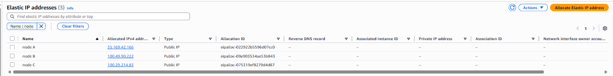

[eips.png](https://drive.google.com/open?id=12KMnVZMxU8x5O-wEHJWqQcwYBomaqKSK)

These will be pre-assigned to NLBs for node-level external access:

| Name | IP | 	Allocation ID |
| :---- | :---- | :---- |
| node A | 35.169.42.166 | eipalloc-022922b5596d07cc0 |
| node B | 100.49.90.222 | eipalloc-09e903534ae53b843 |
| node C | 100.29.214.83 | eipalloc-075319ef8279d4d87 |

**3\) Configure the `RavenDBCluster` for AWS NLB**

This is the key idea: the Operator will provision one NLB per node, and each node mapping pins that NLB to:

* a specific **subnet**  
* a specific **availability zone**  
* a specific **Elastic IP allocation**

Navigate to the ‘Networking’ Tab of your EKS cluster and extend the mapping from previous step:

| Name | EIP | 	Allocation ID | Subnet ID | Availability Zone |
| :---- | :---- | :---- | :---- | :---- |
| node A | 35.169.42.166 | eipalloc-022922b5596d07cc0 | subnet-0b5a8fe3336db5 | us-east-1a |
| node B | 100.49.90.222 | eipalloc-09e903534ae53b843 | subnet-0a49ea200146cc | us-east-1b |
| node C | 100.29.214.83 | eipalloc-075319ef8279d4d87 | subnet-0f4c5cb567cee8 | us-east-1c |

This table is the contract between your infrastructure and the Operator.

It makes the routing model explicit:

* which RavenDB node owns which public IP  
* which subnet and Availability Zone that IP lives in  
* and therefore which failure domain that node belongs to

Once this mapping is expressed in the `RavenDBCluster` spec, the networking layer becomes deterministic:

```bash showLineNumbers
spec:
 externalAccessConfiguration:
    type: aws-nlb
    awsExternalAccessContext:
      nodeMappings:
        - tag: a
          eipAllocationId: eipalloc-022922b5596d07cc0
          subnetId: subnet-0b5a8fe3336db5
          availabilityZone: us-east-1a
        - tag: b
          eipAllocationId: eipalloc-09e903534ae53b843
          subnetId: subnet-0a49ea200146cc
          availabilityZone: us-east-1b
        - tag: c
          eipAllocationId: eipalloc-075319ef8279d4d87
          subnetId: subnet-0f4c5cb567cee8
          availabilityZone: us-east-1c
```

At this stage, we are still only declaring intent. No NLBs are created yet, because no RavenDB nodes exist.

In the next steps- once the cluster spec includes nodes and is applied \- the Operator will:

*  create per-node Services  
* the AWS Load Balancer Controller will react  
* and AWS will provision the corresponding Network Load Balancers automatically

</TabItem>

<TabItem value="aks" label="Azure Load Balancer (AKS)">

Azure Load Balancer mode uses a **single, platform-managed entry point** with multiple public IP frontends.

On AKS, external access is handled by a Standard Load Balancer that is automatically created and managed by Azure.   
Instead of provisioning separate load balancers, Azure exposes multiple public IPs as frontend configurations on the same load balancer and routes traffic to the correct backend services.

Because the Azure Standard Load Balancer is **zone-redundant**, it can route traffic to nodes in any availability zone without requiring manual subnet or zone assignments \- ensuring high availability by default.

The Operator is designed to work *with* this model, not around it.

**Prerequisites**

* A running **AKS** cluster with at least *x* worker nodes (x \= number of ravendb nodes)  
* A node pool distributed across multiple Azure zones  
* Public IP addresses created in advance, in the same resource group as the AKS cluster

**1\) Allocate Public IPs (one per RavenDB node)**

Allocate 3 EIPs up front. These will become the static public IPs for nodes `a`, `b`, and `c`.  
You can do that by navigating to: Network foundation | Public IP addresses view

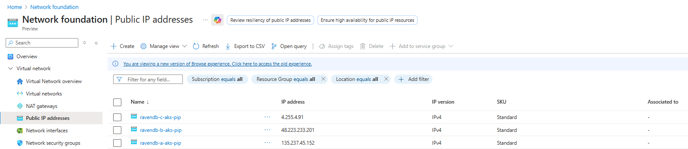

[pips.png](https://drive.google.com/open?id=11PA7wN4uy6zE7H5LsYSGeI_XLxPtTUJs)

These will be pre-assigned to NLBs for node-level external access:

| Name | IP |
| :---- | :---- |
| ravendb-a-aks-pip | 135.237.45.152 |
| ravendb-b-aks-pip | 48.223.233.201 |
| ravendb-c-aks-pip | 4.255.4.91 |

**2\) Configure the `RavenDBCluster` for Azure LB**

In this setup:

* There is **one** Standard Load Balancer  
* It is **zone-redundant**  
* Each public IP acts as a **distinct frontend**  
* Each frontend routes traffic to the corresponding Kubernetes Service

There is no need to manually assign subnets or availability zones. Azure handles traffic distribution and zone resiliency automatically

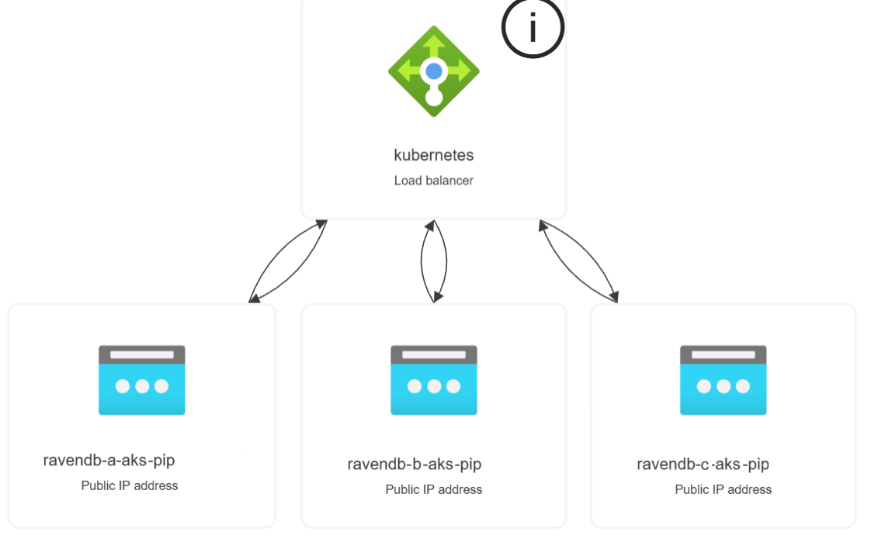

The external access contract is intentionally simple. You only map RavenDB node tags to public IPs:

```bash showLineNumbers
spec:
  externalAccessConfiguration:
    type: azure-lb
    azureExternalAccessContext:
      nodeMappings:
        - tag: a
          ip: 35.169.42.166
        - tag: b
          ip: 100.49.90.222
        - tag: c
          ip: 100.29.214.83

```

</TabItem>
</Tabs>

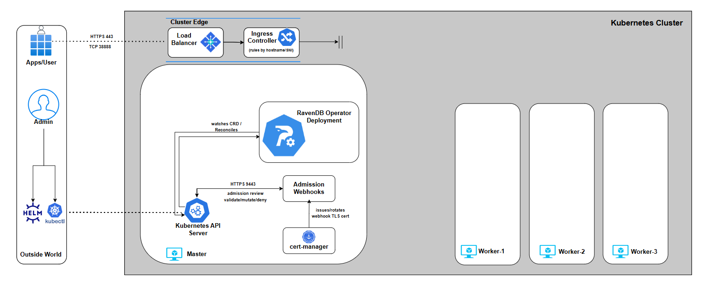


With external access now clearly defined, the networking layer is no longer a black box.

Ingress controllers, cloud load balancers, and MetalLB all serve the same purpose here: they give the Operator a concrete, stable entry point it can reason about.  At this stage, nothing is secured yet  and that’s intentional.   
We now have **reachable endpoints**, but no certificates, no trust, and no guarantees about who is allowed to talk to whom.

In **Part 4**, we’ll move up the stack and focus on **TLS**:   
how certificates are issued, how node identities are established, and how the Operator ties external URLs, certificates, and cluster membership into a fully secured RavenDB deployment.

## Part 4: TLS

Up to this point, we defined *what* the cluster is and *how traffic reaches it*.  
Now let’s address a critical layer: **trust**.

To deploy a secured RavenDB cluster, you need HTTPS certificates for each node and an admin client certificate, which are stored inside a package that you generate via the RavenDB Setup Wizard or the `rvn` CLI tool. The Operator doesn’t generate these certificates, and it does not act as a CA:

* Certificates are stored as **Kubernetes Secrets**  
* The `RavenDBCluster` spec **references** those Secrets by name  
* RavenDB itself enforces identity, trust, and rotation

You can supply certificates in **two supported ways**:

* **Let’s Encrypt**, using RavenDB’s automated setup tooling  
* **Self-signed certificates**, when DNS or public validation isn’t available

Pick the option that fits your environment.  
Both produce the same final artifacts: `server.pfx` files for nodes A/B/C and a `client.pfx` for administrative access.

<h3>Let’s Encrypt (RavenDB Setup Package)</h3> 

Let’s Encrypt is the recommended path whenever your environment allows it. It gives you publicly trusted certificates with zero manual cryptography.  
RavenDB ships with the `rvn` CLI tool, which handles the entire flow:

* Generates a cluster configuration  
* Requests Let’s Encrypt certificates  
* Performs DNS challenges  
* Builds node-specific server certificates  
* Generates the admin client certificate  
* Produces a complete setup package ready for Kubernetes

This is the fastest and safest way to reach a fully secured cluster.

Before generating the setup package, we need to create a JSON configuration file that describes the secured RavenDB cluster we want to build.  
This file captures the essential inputs: license information, domain details, and the per-node public endpoints.

<Admonition type="note" title=""> 

the example below relies directly on the external access configuration established in **Part 3** 

</Admonition>

The IPs must match the ingress or load balancer setup you already have in place.   
If you followed the series using a specific environment (Kind, AKS, or EKS), stick to that same setup here.

We’ll start by creating `setup.json`.  
 In it, we reference the RavenDB license introduced in **Part 2**, choose a domain and root domain, and define the intended topology of the cluster nodes.

<Tabs>
<TabItem value="ingress-controller" label="Ingress controller (Traefik, HAProxy, NGINX)">

```json
{
  "License": { "Id": "86b", "Name": "MyRavenDBLicense","Keys": ["hy3D7...",..]
  },
  "Email": thegoldenplatypus@ravendb.net",
  "Domain": "mydomain",
  "RootDomain": "development.run",
  "NodeSetupInfos": {
        "A": {
        "PublicServerUrl": "https://a.mydomain.development.run:443",
        "PublicTcpServerUrl": "tcp://a-tcp.mydomain.development.run:443",
        "Port": 443,
        "TcpPort": 38888,
        "Addresses": ["172.19.255.200"]
        },
        "B": {
         "PublicServerUrl": "https://b.mydomain.development.run:443",
         "PublicTcpServerUrl": "tcp://b-tcp.mydomain.development.run:443",
          "Port": 443,
          "TcpPort": 38888,
          "Addresses": ["172.19.255.200"]
        },
        "C": {
         "PublicServerUrl": "https://c.mydomain.development.run:443",
         "PublicTcpServerUrl": "tcp://c-tcp.mydomain.development.run:443",
          "Port": 443,
          "TcpPort": 38888,
          "Addresses": ["172.19.255.200"]
        }
      }
}
```

This configuration reflects an ingress-controller-based external access model, exactly as we set up in **Part 3**.

All RavenDB nodes (A, B, and C) share the **same external IP address** \- the LoadBalancer IP assigned to the ingress controller.   
That is **intentional**. Every external connection first reaches the ingress controller, and **S**NI hostnames are used to decide which RavenDB node should receive the traffic.

TLS is not terminated at the ingress controller. Instead, traffic is forwarded in full TLS passthrough mode. The ingress controller only inspects the hostname, forwards the connection to the correct Kubernetes Service, and RavenDB performs all certificate validation and encryption itself.

You’ll also notice that **port 443 is used everywhere**, even for TCP-based cluster communication URLs. This is not a mistake, as Ingress controllers operate at the connection-routing layer and expose a fixed set of external ports. 

Both HTTPS traffic and RavenDB’s TCP traffic are multiplexed over the same external port using SNI, then routed internally to the correct target port.

Internally, RavenDB still uses its native TCP port (`38888`) for cluster communication. That traffic is routed **inside the Kubernetes cluster** and never leaves it.   
External access is only required for client traffic and for initial node discovery; ongoing cluster gossip remains internal.

This model gives you a single, stable external entry point, clean TLS ownership by RavenDB, and a consistent setup that works the same way on Kind, cloud clusters, and on-prem environments.

</TabItem>

<TabItem value="eks" label="AWS(EKS)">

```
{
  "License": { "Id": "86b", "Name": "MyRavenDBLicense","Keys": ["hy3D7...",..]
  },
  "Email": thegoldenplatypus@ravendb.net",
  "Domain": "mydomain-aws",
  "RootDomain": "development.run",
  "NodeSetupInfos": {
        "A": {
        "PublicServerUrl": "https://a.mydomain-aws.development.run:443",
        "PublicTcpServerUrl": "tcp://a-tcp.mydomain-aws.development.run:38888",
        "Port": 443,
        "TcpPort": 38888,
        "Addresses": ["35.169.42.166"]
        },
        "B": {
         "PublicServerUrl": "https://b.mydomain-aws.development.run:443",
         "PublicTcpServerUrl": "tcp://b-tcp.mydomain-aws.development.run:38888",
          "Port": 443,
          "TcpPort": 38888,
          "Addresses": ["100.49.90.222"]
        },
        "C": {
         "PublicServerUrl": "https://c.mydomain-aws.development.run:443",
         "PublicTcpServerUrl": "tcp://c-tcp.mydomain-aws.development.run:38888",
          "Port": 443,
          "TcpPort": 38888,
          "Addresses": ["100.29.214.83"]
        }
      }
}
```

In this setup, we explicitly use the **Elastic IPs allocated earlier** (one per node) as the node `Addresses`. These are the same EIPs defined in Part 3, and they become the stable, externally reachable identities of nodes A, B, and C.   
This is what allows RavenDB to bind certificates, URLs, and cluster membership to deterministic network endpoints.

Unlike the ingress-controller model, **AWS NLB mode does not multiplex traffic through a shared entry point**. Each node has its own load balancer and its own TCP listeners. Because of that, there is **no need to tunnel TCP traffic through port 443**.   
RavenDB’s native TCP port (`38888`) is exposed directly and should be used as-is.

With NLBs, TCP routing happens at L4 with no hostname inspection, so RavenDB’s standard ports work exactly as intended.

</TabItem>
<TabItem value="aks" label="Azure (AKS)">

```
{
  "License": { "Id": "86b", "Name": "MyRavenDBLicense","Keys": ["hy3D7...",..]
  },
  "Email": thegoldenplatypus@ravendb.net",
  "Domain": "mydomain-az",
  "RootDomain": "development.run",
  "NodeSetupInfos": {
        "A": {
        "PublicServerUrl": "https://a.mydomain-az.development.run:443",
        "PublicTcpServerUrl": "tcp://a-tcp.mydomain-az.development.run:38888",
        "Port": 443,
        "TcpPort": 38888,
        "Addresses": ["135.237.45.152"]
        },
        "B": {
         "PublicServerUrl": "https://b.mydomain-az.development.run:443",
         "PublicTcpServerUrl": "tcp://b-tcp.mydomain-az.development.run:38888",
          "Port": 443,
          "TcpPort": 38888,
          "Addresses": ["148.223.233.201"]
        },
        "C": {
         "PublicServerUrl": "https://c.mydomain-az.development.run:443",
         "PublicTcpServerUrl": "tcp://c-tcp.mydomain-az.development.run:38888",
          "Port": 443,
          "TcpPort": 38888,
          "Addresses": ["4.255.4.91"]
        }
      }
}
```

In this setup, we explicitly use the **Public IPs allocated earlier** (one per node) as the node `Addresses`. These are the same PIPs defined in Part 3, and they become the stable, externally reachable identities of nodes A, B, and C.   
This is what allows RavenDB to bind certificates, URLs, and cluster membership to deterministic network endpoints.

Unlike the ingress-controller model, **AZURE LB mode does not multiplex traffic through a shared entry point**. Each node has its own load balancer and its own TCP listeners. Because of that, there is **no need to tunnel TCP traffic through port 443**.   
RavenDB’s native TCP port (`38888`) is exposed directly and should be used as-is.

With Azure LB, TCP routing happens at L4 with no hostname inspection, so RavenDB’s standard ports work exactly as intended.

</TabItem>
</Tabs>

Now that `setup.json` is in place, we can generate the **RavenDB setup package**.

As mentioned earlier, this is done using the `rvn` CLI and the `rvn create-setup-package` command.   
This step is where RavenDB does the heavy lifting: it validates your configuration, performs the Let’s Encrypt flow, and produces a complete, ready-to-use security bundle.

We generate the package with the following command:

```bash showLineNumbers

$ docker run --rm -v "/home/$USER/:/ravendb" ravendb/ravendb:latest /bin/bash showLineNumbers -c "cd /usr/lib/ravendb/server && ./rvn create-setup-package -m=lets-encrypt -s=/ravendb/setup.json -o=/ravendb/setup_package.zip"
```

This command runs a temporary RavenDB container to process the setup, requests Let’s Encrypt certificates, performs domain validation, handles DNS challenges, and finally outputs everything into a single setup package.  
Once the process completes, you’ll see a ZIP file created in the output directory. Extracting it produces a structure similar to:

```bash showLineNumbers
$ unzip setup_package.zip -d setup_package
$ tree setup_package
  .
  ├── A
  │   ├── cluster.server.certificate.mydomain.pfx
  │   └── settings.json
  ├── B
  │   ├── cluster.server.certificate.mydomain.pfx
  │   └── settings.json
  ├── C
  │   ├── cluster.server.certificate.mydomain.pfx
  │   └── settings.json
  ├── admin.client.certificate.mydomain.crt
  ├── admin.client.certificate.mydomain.key
  ├── admin.client.certificate.mydomain.pfx
  ├── license.json
  ├── readme.txt
  ├── setup.json
```

At this point, certificate generation is done. We need to take the generated certificates and feed them back into the RavenDBCluster spec.

In the next step, we don’t create any Kubernetes Secrets yet. Instead, we declare the intent to use them.

For each setup model (ingress controller, AWS NLB, Azure LB), we’ll extend the `RavenDBCluster` spec to **reference the certificates by Secret name**. This makes TLS an explicit part of the cluster contract, even before the Secrets exist.

Below we showcase how  the generated certificates are referenced in the `RavenDBCluster` spec for a specific setup.  
 At this stage, those references act as placeholders: they tell the Operator *which certificates it expects*, not how to create them:

<Tabs>
<TabItem value="ingress-controller" label="Ingress controller (Traefik, HAProxy, NGINX)">

```bash showLineNumbers
spec:
  nodes:
    - tag: a
      publicServerUrl: https://a.mydomain.development.run:443
      publicServerUrlTcp: tcp://a-tcp.mydomain.development.run:443
      certSecretRef: ravendb-certs-a
    - tag: b
      publicServerUrl: https://b.mydomain.development.run:443
      publicServerUrlTcp: tcp://b-tcp.mydomain.development.run:443
      certSecretRef: ravendb-certs-b
    - tag: c
      publicServerUrl: https://c.mydomain.development.run:443
      publicServerUrlTcp: tcp://c-tcp.mydomain.development.run:443
      certSecretRef: ravendb-certs-c
  
  mode: LetsEncrypt
  domain: mydomain.development.run
  email: thegoldenplatypus@ravendb.net
  clientCertSecretRef: ravendb-client-cert
  licenseSecretRef: ravendb-license
  externalAccessConfiguration:
     type: ingress-controller
     ingressControllerContext:
       ingressClassName: traefik
```

</TabItem>

<TabItem value="eks" label="AWS (EKS)">

```bash showLineNumbers
spec:
 nodes:
    - tag: a
      publicServerUrl: https://a.mydomain-aws.development.run:443
      publicServerUrlTcp: tcp://a-tcp.mydomain-aws.development.run:38888
      certSecretRef: ravendb-certs-a
    - tag: b
      publicServerUrl: https://b.mydomain-aws.development.run:443
      publicServerUrlTcp: tcp://b-tcp.mydomain-aws.development.run:38888
      certSecretRef: ravendb-certs-b
    - tag: c
      publicServerUrl: https://c.mydomain-aws.development.run:443
      publicServerUrlTcp: tcp://c-tcp.mydomain-aws.development.run:38888
      certSecretRef: ravendb-certs-c
  
 mode: LetsEncrypt
 domain: mydomain-aws.development.run
 email: thegoldenplatypus@ravendb.net
 clientCertSecretRef: ravendb-client-cert
 licenseSecretRef: ravendb-license
 externalAccessConfiguration:
    type: aws-nlb
    awsExternalAccessContext:
      nodeMappings:
        - tag: a
          eipAllocationId: eipalloc-022922b5596d07cc0
          subnetId: subnet-0b5a8fe3336db5
          availabilityZone: us-east-1a
        - tag: b
          eipAllocationId: eipalloc-09e903534ae53b843
          subnetId: subnet-0a49ea200146cc
          availabilityZone: us-east-1b
        - tag: c
          eipAllocationId: eipalloc-075319ef8279d4d87
          subnetId: subnet-0f4c5cb567cee8
          availabilityZone: us-east-1c
```

</TabItem>

<TabItem value="aks" label="Azure(AKS)">

```bash showLineNumbers
spec:
 nodes:
    - tag: a
      publicServerUrl: https://a.mydomain-az.development.run:443
      publicServerUrlTcp: tcp://a-tcp.mydomain-az.development.run:38888
      certSecretRef: ravendb-certs-a
    - tag: b
      publicServerUrl: https://b.mydomain-az.development.run:443
      publicServerUrlTcp: tcp://b-tcp.mydomain-az.development.run:38888
      certSecretRef: ravendb-certs-b
    - tag: c
      publicServerUrl: https://c.mydomain-az.development.run:443
      publicServerUrlTcp: tcp://c-tcp.mydomain-az.development.run:38888
      certSecretRef: ravendb-certs-c
  
 mode: LetsEncrypt
 domain: mydomain-az.development.run
 email: thegoldenplatypus@ravendb.net
 clientCertSecretRef: ravendb-client-cert
 licenseSecretRef: ravendb-license
 externalAccessConfiguration:
    type: azure-lb
    azureExternalAccessContext:
      nodeMappings:
        - tag: a
          ip: 35.169.42.166
        - tag: b
          ip: 100.49.90.222
        - tag: c
          ip: 100.29.214.83
```

</TabItem>
</Tabs>

Each node declares its public URLs (`publicServerUrl` and `publicServerUrlTcp`) and references a node-specific `server.pfx` via `certSecretRef`.   
The `mode`, `domain`, and `email` fields tell the Operator how TLS is managed (in this case, Let’s Encrypt), while `clientCertSecretRef` points to the administrative client certificate used for secure access to the cluster.

At this stage, these fields are **declarative only**. They describe what certificates the cluster expects and how they are mapped to nodes, but no Secrets are required yet.   
In later chapters, just before we apply the final CR, we’ll create the actual Secrets from the setup package. Once those Secrets exist, the Operator will pick them up automatically and wire TLS into the cluster during provisioning.

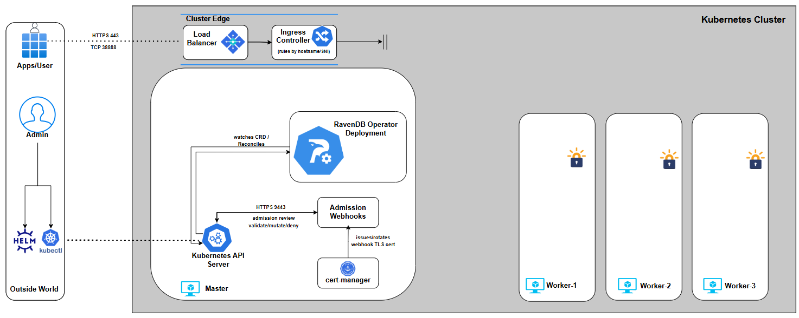

<h3>Self-signed certificates</h3> 

Self-signed TLS is supported, but it comes with more responsibility.

In this series, we do not walk through certificate generation itself, as this process depends heavily on your PKI tooling, security policies, and operational constraints.

At a minimum, a self-signed setup requires:

* A **wildcard server certificate** (`server.pfx`) with the correct CN and SANs to cover all advertised node hostnames  
* A **Certificate Authority (CA)** is used to sign both server and client certificates  
* A **client certificate** for administrative access

Unlike Let’s Encrypt, nothing here is automated. You own the full lifecycle: issuance, distribution, renewal, and rotation.

With self-signed certificates, we still need to express our intent in the `RavenDBCluster` spec. Just like with Let’s Encrypt, we declare what certificates the cluster expects, not how they are created:

```bash showLineNumbers
spec:
  nodes:
    - tag: a
      publicServerUrl: https://a.mydomain-selfsigned.development.run:443
      publicServerUrlTcp: tcp://a-tcp.mydomain-selfsigned.development.run:443
    - tag: b
      publicServerUrl: https://b.mydomain-selfsigned.development.run:443
      publicServerUrlTcp: tcp://b-tcp.mydomain-selfsigned.development.run:443
    - tag: c
      publicServerUrl: https://c.mydomain-selfsigned.development.run:443
      publicServerUrlTcp: tcp://c-tcp.mydomain-selfsigned.development.run:443

  mode: None
  domain: mydomain-selfsigned.development.run
  clusterCertSecretRef: ravendb-cert
  clientCertSecretRef: ravendb-client-cert
  caCertSecretRef: ravendb-ca-cert
  licenseSecretRef: ravendb-license
```

A few important points about this snippet:

* `mode: None` tells the Operator that TLS is externally managed and no automated certificate flow (such as Let’s Encrypt) should be used.  
* `clusterCertSecretRef` points to the server certificate (`server.pfx`) that will be mounted into all nodes.  
* `clientCertSecretRef` references the admin client certificate, used for secure administrative access.  
* `caCertSecretRef` provides the CA certificate so RavenDB and clients can establish trust.  
* `publicServerUrl` and `publicServerUrlTcp` declare the externally visible endpoints for each node.

At this stage, these fields are **declarative only**. The Secrets referenced here do not need to exist yet. We are simply stating the contract: which certificates the cluster requires and how they map to nodes. The actual Kubernetes Secrets will be created in later chapters, just before applying the final CR.

You’ll notice that this example uses port 443 for both HTTPS and TCP, which makes it especially suitable for ingress-controller-based setups. That said, self-signed TLS itself is **independent of the external access model**. You can use different ports or a different networking approach as long as the certificate’s SANs correctly cover all published hostnames.

For example, a minimal wildcard certificate might include:

`[ req_distinguished_name ]`  
`CN = *.mydomain-selfsigned.development.run`

As long as the SANs match the advertised node URLs, RavenDB doesn’t care whether traffic arrives via ingress controllers, cloud load balancers, or direct node IPs.   
What matters is that identity, naming, and trust are consistent.

<h3>DNS and Name Resolution</h3> 

Self-signed certificates still rely on **stable hostnames**. If your environment does not provide DNS resolution for those names, you must supply it yourself.

A common approach \- especially in local or restricted environments \- is to update **CoreDNS** to resolve the advertised hostnames to the LoadBalancer IP.

Edit the CoreDNS ConfigMap and Add a `hosts` block mapping your domains to the external IP:

```bash showLineNumbers
$ kubectl -n kube-system edit configmap coredns

hosts {
172.19.255.200 
a.mydomain-selfsigned.development.run a-tcp.example-selfsigned.development.run
172.19.255.200 
b.mydomain-selfsigned.development.run b-tcp.example-selfsigned.development.run
172.19.255.200 
c.mydomain-selfsigned.development.run c-tcp.example-selfsigned.development.run
    fallthrough
}

# then restart CoreDNS
$ kubectl -n kube-system rollout restart deployment coredns
```

This ensures that both RavenDB nodes and in-cluster clients can resolve the node URLs consistently.

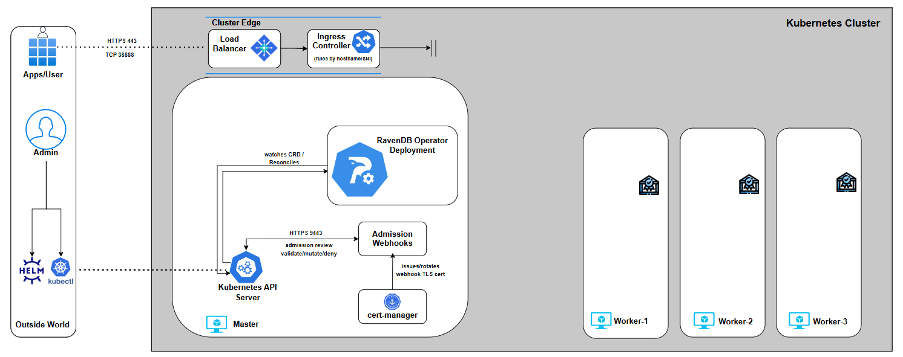

<h3>Certificate Renewal and Rotation</h3> 

TLS does not end once the cluster is up. Certificates expire, security requirements change, and rotations must happen without downtime. RavenDB is designed for this from day one, and the Operator builds on those guarantees rather than reinventing them.

<Tabs>
<TabItem value="lets-encrypt" label="Let’s Encrypt Mode">

In Let’s Encrypt mode, renewal is fully automated.  
When certificates approach expiration, RavenDB renews them and replaces the server certificates in-place. From Kubernetes’ perspective, this shows up as an updated Secret \- no manual intervention required.

```bash showLineNumbers
# BEFORE
$ kubectl get secret ravendb-certs-a -n ravendb -o yaml
apiVersion: v1
data:
  server.pfx: MIACAQMwgAYJK...

# -- TRIGGER RENEW --
# either by Admin API/ Studio/ Natural Expiration

# AFTER
$ kubectl get secret ravendb-certs-a -n ravendb -o yaml
apiVersion: v1
data:
  server.pfx: MIIQ4wIBAz2c...
```

You’ll notice that the `server.pfx` data changes. RavenDB coordinates the update cluster-wide, reloads the certificates, and continues serving traffic without disrupting clients or node communication.

</TabItem>

<TabItem value="self-signed" label="Self-Signed Mode">

With self-signed certificates, you control the rotation process.  
The flow is:

1. Generate a new `server.pfx` signed by the same CA  
2. Call RavenDB’s Admin API to replace the cluster certificate  
3. Let RavenDB propagate and activate the new certificate safely

```bash showLineNumbers
# BEFORE
$ kubectl get secret ravendb-certs-a -n ravendb -o yaml
apiVersion: v1
data:
  server.pfx: MIACAQMwgAYJK...

# -- TRIGGER RENEW --
# Trigger rotation via the Admin API

$ curl -X POST "https://a.mydomain-selfsigned.development.run/admin/certificates/replace-cluster-cert" \
  --cert ./filename.pem \
  --key ./filename.key \ 
  --cacert ./ca.crt \
  -H "Content-Type: application/json" \
  -d '{
    "Certificate": "'"$(cat ./new-server.pfx | base64 -w 0)"'",
    "Name": "rotated-cluster-cert"
  }'


# AFTER
$ kubectl get secret ravendb-certs-a -n ravendb -o yaml
apiVersion: v1
data:
  server.pfx: MIIQ4wIBAz2c...
```

The updated certificate is visible in the Secret, and RavenDB completes the replacement across all nodes without restarting the cluster.

</TabItem>
</Tabs>

With TLS fully in place, the cluster now has a secure identity declaration in place.  
In Part 5, we will focus on **storage** \- where RavenDB actually persists data. We’ll break down how the Operator models storage, how persistent volumes are attached to nodes, and how data, logs, and backups are handled in a Kubernetes-native way.

## Part 5: Storage

Up to this point, everything we’ve built has been about identity and connectivity. Now we get to the part that actually matters long-term: **storage**. A database without persistent storage can’t run production scenarios.

This chapter explains how the RavenDB Kubernetes Operator models storage, why it does so explicitly, and how your choices here directly affect durability, performance, and recoverability.

Storage in Kubernetes Kubernetes does not store data \- it orchestrates storage, and applications declare *intent*. RavenDB is no different \- but because it is a stateful, clustered database, that storage must be explicit and stable.

RavenDB nodes run as [StatefulSet](https://kubernetes.io/docs/concepts/workloads/controllers/statefulset/) pods, not regular pods or replicas. StatefulSets give each node a stable identity, a predictable name, and \- most importantly \- a persistent volumes that survives restarts, rescheduling, and upgrades. When a RavenDB node comes back, it must come back with the same data, the same identity, and the same place in the cluster. Anything else would be unsafe.

That persistence is provided through [PersistentVolumeClaims (PVCs)](https://kubernetes.io/docs/concepts/storage/persistent-volumes/). Each RavenDB node gets its own PVC, created and managed by the Operator. The PVC defines how much storage is needed and what kind of storage backs it. It doesn’t explicitly define physical storage \- that decision belongs to the infrastructure layer.

This is where **StorageClasses** come in.

<h3>Storage classes</h3> 

A StorageClass describes the characteristics of a volume  \- performance profile, replication behavior, availability zone binding  \- without exposing provider-specific details to the application. On AWS this might be `gp3` or `io2`, on Azure `managed-premium`, and in local or development environments something like `local-path`.   
The Operator never creates or modifies StorageClasses; it only references them. This separation is intentional.   
Storage is an infrastructure contract, not an application concern.

By default, RavenDB stores everything \- data, indexes, and logs \- on the same persistent volume. That’s a safe and valid baseline. When needed, the Operator allows logs to be persisted on separate volumes, or additional volumes to be mounted for imports, backups, or auxiliary data. These are extensions of the same model, not exceptions to it.

The important takeaway is this:  
**Storage in the RavenDB Operator is declarative, per-node, and identity-bound**.  
Each node owns its data. Each volume belongs to exactly one node. Nothing is shared implicitly, nothing is guessed, and nothing is transient unless you explicitly say so.

With the storage model clear, we can now express it incrementally.  
We’ll start with the minimum required to make a RavenDB node durable, then layer on additional capabilities \- separating logs, controlling paths, and finally mounting external data \-  each step building on the previous one.

Nothing here is mandatory beyond the first example. These are **composable options**, not mutually exclusive features.

<h3>Persisting RavenDB Data</h3> 

The RavenDB Kubernetes Operator addresses this by anchoring each node’s state to a PersistentVolumeClaim (PVC**)**. The PVC outlives Pods, survives restarts, and preserves the node’s identity across rescheduling.

Declare what kind of storage you want, and the Operator does the rest.

At minimum, that means defining a data volume and referencing a StorageClass that matches your environment:

```bash showLineNumbers
storage:
  data:
    size: 10Gi
    storageClassName: gp3
```

What each field means:

* **`storage -`** Declares all persistent storage requirements for the cluster. Everything related to data, logs, or additional mounts lives under this section.  
* **`data -`** Defines the primary data volume for each RavenDB node. This volume stores databases, indexes, and all durable states.  
* **`size -`** The requested capacity for the volume *per node*. Each node gets its own independent volume of this size.  
* **`storageClassName -`** References an existing Kubernetes StorageClass

Once this is applied, the Operator creates **one PVC per node**, binds it to the chosen StorageClass, and mounts it into the RavenDB container. From that point on, the node’s data is no longer tied to the lifecycle of the Pod \- only to the volume itself.

<h3>Persisting Logs</h3> 

By default, RavenDB logs are not persistent. If you do not explicitly configure log volumes under `storage.logs`, all RavenDB logs are written to the container filesystem.  That filesystem is ephemeral and will be lost whenever a Pod is restarted, rescheduled, or replaced. For production systems, this is usually unacceptable. Logs are critical for:

* Diagnosing failures after restarts  
* Auditing security-related activity  
* Investigating performance or data issues over time

To persist logs, you must declare dedicated PVCs for them:

```bash showLineNumbers
storage:
    data:
      size: 10Gi
      storageClassName: gp3
    logs:
      ravendb:
        size: 1Gi
        storageClassName: gp2
      audit:
        size: 1Gi
        storageClassName: gp2
```

Each log volume is independent of the data volume. Losing a log PVC does not affect your databases, but losing logs removes valuable operational history.  
If you omit this section entirely, the Operator makes no attempt to persist logs. This behavior is intentional: storage should be explicit, never implied.

If you choose to persist logs, you may also control **where** RavenDB writes them.   
When overriding log paths, intent must be explicit on both sides: the volume mount and the RavenDB configuration:

```bash showLineNumbers
env:
  RAVEN_LogPath: /home/thegoldenplatypus/logs

storage:
  logs:
    ravendb:
      size: 1Gi
      storageClassName: gp2
      path: /home/thegoldenplatypus/logs
    audit:
      size: 1Gi
      storageClassName: gp2
      path: /home/thegoldenplatypus/logs
```

Here, the Operator mounts the log volumes at `/home/thegoldenplatypus/logs`, and RavenDB is explicitly instructed to write logs to that location.

<h3>Additional Volumes (Imports, Scripts, Backups)</h3> 

So far, we’ve talked about *owned* storage: data volumes that define the node’s identity and log volumes that preserve operational history Additional volumes solve a different problem. They allow you to *inject external artifacts* into a RavenDB node without making them part of the node’s durable state.

This distinction is critical. Additional volumes are:

* Mounted into the container

* Not owned by the RavenDB node

* Not part of the node’s lifecycle

* Not recreated or mutated by the Operator 

They are *inputs*, not *state*. This makes them ideal for: Importing data (`.ravendump`, `.csv`) , mounting one-off scripts, providing restore sources, supplying configuration files, temporary operational workflows and more. 

The Operator supports three sources for additional volumes:

* ConfigMaps

* Secrets

* Existing PVCs

All are declared under `storage.additionalVolumes`. 

<h3>Mounting a Single File from a ConfigMap</h3> 

The most controlled form of this is mounting a single file from a [ConfigMap](https://kubernetes.io/docs/concepts/configuration/configmap/).  Imagine you want to import a CSV file into RavenDB. You don’t want to mount an entire directory, and you don’t want RavenDB to see anything except that one file. In that case, you can mount a single key from a ConfigMap directly to a specific path inside the container:

```bash showLineNumbers
storage:
  additionalVolumes:
    - name: csv-import
      mountPath: /tmp/orders.csv
      subPath: orders.csv
      volumeSource:
        configMap:
          name: orders-doc
```

Only the `orders.csv` key is mounted; it appears exactly at `/tmp/orders.csv`, nothing else from the ConfigMap is exposed.   
The ConfigMap itself might look like this:

```bash showLineNumbers
apiVersion: v1
kind: ConfigMap
metadata:
  name: orders-doc
data:
  orders.csv: |
    @id,Customer,Amount,Status
    1001,ThePlatypusCircus,49.99,Completed
```

From RavenDB’s perspective, this is just a file on disk. It doesn’t know (or care) that it came from Kubernetes. This pattern is ideal when you want *maximum control* and *minimal surface area*. 

<h3>Mounting Multiple Files from a ConfigMap</h3> 

Sometimes, though, you don’t want a single file. You want a directory \-  for example, a set of scripts or helper files that belong together. In that case, you can mount the entire ConfigMap as a directory:

```bash showLineNumbers
storage:
  data:
    size: 10Gi
  additionalVolumes:
    - name: scripts
      mountPath: /tmp/scripts
      volumeSource:
        configMap:
          name: myscripts
```

Here, every key in the ConfigMap becomes a file under `/tmp/scripts`.  
This is useful for operational workflows \- maintenance scripts, import helpers, or debugging tools.  
One important thing to keep in mind: ConfigMap-backed volumes are read-only.   
They’re not meant for anything RavenDB modifies or writes back to.

<h3>Mounting Secrets (Sensitive Inputs)</h3> 

When the content is sensitive, the pattern stays the same \- only the source changes.   
Secrets can be mounted exactly like ConfigMaps, but with Kubernetes handling encryption and access control:

```bash showLineNumbers
storage:
  additionalVolumes:
    - name: import-volume
      mountPath: /tmp/import
      volumeSource:
        secret:
          secretName: salaries-ravendump
```

You would typically create that Secret from a file:

```bash showLineNumbers
$ kubectl -n ravendb create secret generic salaries-ravendump --from-file=salaries.ravendump
```

This is the preferred way to provide sensitive artifacts like credentials. The Operator never inspects the contents; it only ensures the file is mounted correctly. 

<h3>Mounting an Existing PVC</h3> 

The most powerful option is mounting an existing PersistentVolumeClaim. Here, you’re not injecting a file \-  you’re attaching storage that already exists:

```bash showLineNumbers
storage:
  additionalVolumes:
    - name: restore-volume
      mountPath: /restore
      volumeSource:
        persistentVolumeClaim:
          claimName: restore-backup-pvc
```

This is typically used for restore or migration workflows. The PVC might contain a large backup dataset or historical snapshots prepared elsewhere. This comes with responsibility. That PVC is not owned by the RavenDB node.  The Operator will not manage it, protect it, or recreate it. If it disappears, RavenDB simply loses access to whatever was mounted there. 

With storage fully defined, the cluster now has a place to persist its identity and state. Data, logs, and auxiliary files are no longer tied to ephemeral Pods, but to durable volumes managed explicitly by Kubernetes and enforced by the Operator.

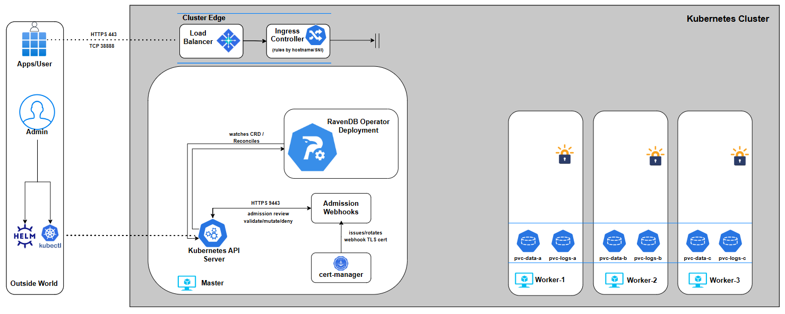

In **Part 6**, we finally bring everything together. We’ll create the remaining Secrets, apply the completed `RavenDBCluster` resource, and watch the Operator reconcile intent into reality \-  provisioning nodes, attaching storage, wiring networking, and forming a live RavenDB cluster. 

## Part 6: Bringing the Cluster to Life

Up to this point, we’ve been intentionally slow and deliberate.  
Each previous part zoomed in on a *single slice* of the `RavenDBCluster` YAML: security mode, certificates, external access, storage, nodes, volumes. On purpose.   
We never applied a full cluster because we wanted to make sure we fully understood it.

In this chapter, we will assemble the pieces into a complete, valid `RavenDBCluster` definition. This is the moment where configuration turns into a running system.

<Admonition type="note" title="A quick recap: what we’ve built so far"> 

So far, the journey looked roughly like this:

We introduced the RavenDB Kubernetes Operator and the idea of a `RavenDBCluster` CR as *the source of truth*.  
We gradually assembled the spec:

* security mode and certificates  
  * node identities and public URLs  
  * storage definitions  
  * external access assumptions

</Admonition>

Each part stood on its own, but none of them were *applied* yet. That wasn’t accidental. Understanding the YAML before applying it is the difference between *operating* Kubernetes and just *throwing manifests at it*. In this part, we finally join all those pieces into a single manifest and bring the cluster to life.

From here on: we’ll demonstrate **Let’s Encrypt setup only.** Up until now we discussed both Let’s Encrypt and self-signed flows. From this point forward, we’ll run the demo using **Let’s Encrypt** for the cluster setup. The flow you’re about to see is the same idea for self-signed as well \- same prerequisites concept, same “create secrets first, reference them in the CR” pattern \- only the certificate source changes. 

From here on, we’ll run everything on a **local kind cluster**. We do this for simplicity and focus: a local kind cluster keeps the environment small, predictable, and easy to reason about. This lets us concentrate on the operator’s behavior and the cluster lifecycle, without introducing cloud-specific variables. 

<h3>Prerequisites</h3> 

Before we apply the `RavenDBCluster`, there are two categories of “stuff” that must already exist in Kubernetes:

1. **A namespace** to hold everything  
2. **Secrets** that the operator will *reference*, not generate (license, certs, client cert)

We are going to do this manually because this series iis a demo and a learning path.

If you install via the [official RavenDB Operator Helm chart](https://artifacthub.io/packages/helm/ravendb-operator/ravendb-operator), there are installation paths where namespaces are created for you and some prerequisites are templated / automated.  
That’s convenient for real installs.  
Here, we’re doing it manually on purpose  \- so you can see every moving part clearly and understand exactly what the operator expects *before* it takes action.

So let’s create everything we need:

<h3>Create the namespace</h3> 

```bash showLineNumbers
$ kubectl create namespace ravendb
```

<h3>License secret</h3> 

```bash showLineNumbers
$ kubectl create secret generic ravendb-license \
  --from-file=license.json=/path/to/license.json \
  -n ravendb
```

<h3>Server certificate secrets (per-node)</h3> 

```bash showLineNumbers
$ kubectl create secret generic ravendb-certs-a --from-file=server.pfx=/path/to/node-a/server-cert.pfx -n ravendb

$ kubectl create secret generic ravendb-certs-b --from-file=server.pfx=/path/to/node-b/server-cert.pfx -n ravendb

$ kubectl create secret generic ravendb-certs-c --from-file=server.pfx=/path/to/node-b/server-cert.pfx -n ravendb
```

<h3>Client certificate secret (admin access)</h3> 

```bash showLineNumbers
$ kubectl create secret generic ravendb-client-cert --from-file=client.pfx=/path/to/admin-client-cert.pfx -n ravendb
```

You can check the secrets were properly created by:

```bash showLineNumbers
$ kubectl get secrets -n ravendb
NAME                  TYPE     DATA   AGE
ravendb-certs-a       Opaque   1      21s
ravendb-certs-b       Opaque   1      18s
ravendb-certs-c       Opaque   1      15s
ravendb-client-cert   Opaque   1      12s
ravendb-license       Opaque   1      26s
```

At this point we’re ready to apply the *real*  `RavenDBCluster` manifest, because we’ve already put the identity material in place.

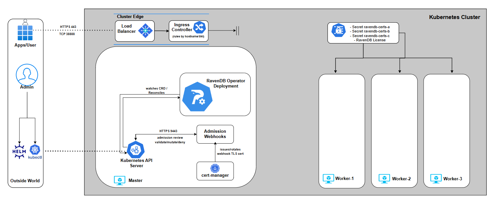

<h3>The full RavenDBCluster YAML</h3> 

This is the moment where all the snippets collapse into a single manifest. You’ve seen every part of this YAML before \- just not all at once:

```bash showLineNumbers
apiVersion: ravendb.ravendb.io/v1
kind: RavenDBCluster
metadata:
  labels:
    app.kubernetes.io/name: ravendb-operator
  name: ravendbcluster-sample
  namespace: ravendb
spec:  
  nodes:
    - tag: a
      publicServerUrl: https://a.ravendb-operator-e2e.ravendb.run:443
      publicServerUrlTcp: tcp://a-tcp.ravendb-operator-e2e.ravendb.run:443
      certSecretRef: ravendb-certs-a
    - tag: b
      publicServerUrl: https://b.ravendb-operator-e2e.ravendb.run:443
      publicServerUrlTcp: tcp://b-tcp.ravendb-operator-e2e.ravendb.run:443
      certSecretRef: ravendb-certs-b
    - tag: c
      publicServerUrl: https://c.ravendb-operator-e2e.ravendb.run:443
      publicServerUrlTcp: tcp://c-tcp.ravendb-operator-e2e.ravendb.run:443
      certSecretRef: ravendb-certs-c

  image: ravendb/ravendb:6.2.9-ubuntu.22.04-x64
  imagePullPolicy: IfNotPresent
  mode: LetsEncrypt
  email: omer.ratsaby@ravendb.net
  licenseSecretRef: "ravendb-license"
  clientCertSecretRef: "ravendb-client-cert"
  domain: ravendb-operator-e2e.ravendb.run
  
  externalAccessConfiguration:
    type: ingress-controller
    ingressControllerContext:
      ingressClassName: nginx
   storage:
     data:
       size: 10Gi
       storageClassName: local-path
```

At this point, the YAML itself should feel familiar rather than intimidating. The cluster manifest we’re about to apply is built directly on what we prepared earlier in the series. 

It references the **setup package generated in Part 4**, relies on the **Ingress controller deployed in Part 3** for external access, and applies the storage concepts we explored in **Part 5** by binding RavenDB data volumes to an already deployed StorageClass.   
Nothing here is new \- it’s a composition of decisions you’ve already made and understood.

Although the operator supports many more options than what you’ll see in the manifest above , we’re keeping the configuration minimal for now. The goal here isn’t to showcase every feature we explored up to this point, but to demonstrate how a clean, well-understood manifest brings a fully secured RavenDB cluster to life. 

<h3>Webhooks</h3> 

Before we apply this manifest, it’s worth taking a short pause to talk about **admission webhooks**  \- because they are about to do a lot of work on your behalf.

When you run `kubectl apply`, this manifest doesn’t go straight to the operator or to the Kubernetes API server’s persistence layer.   
Instead, it is first intercepted by the RavenDB Operator’s validating webhooks. Their job is to protect you from deploying an invalid or inconsistent cluster definition.

The webhooks validate the manifest *as a whole*, not field by field in isolation. They check that node definitions make sense together, that certificate references are consistent, that security mode, external access configuration, and storage settings don’t contradict each other, and that required prerequisites are actually present.   
If something is wrong, the cluster is rejected immediately before any StatefulSets, Services, or Jobs are created:

```bash showLineNumbers
$ kubectl apply -f bad_manifest.yaml

[image-validator] 
image must be from the 'ravendb/' registry namespace,
[general-validator] 
spec.email is required when mode is LetsEncrypt
spec.licenseSecretRef: secret 'invalid-license-multi-keys' not found
spec.clusterCertSecretRef must not be set when mode is LetsEncrypt
spec.domain '127.0.0.1' must be a valid FQDN
spec.env: environment variable 'DEBUG' must start with 'RAVEN_',
[node-validator] 
spec.nodes: duplicate tag 'a'
spec.nodes: publicServerUrl and publicServerUrlTcp ports must match
spec.nodes[a].publicServerUrl: scheme must be 'https'
[externalAccess-validator] 
spec.externalAccessConfiguration.ingressControllerContext.additionalAnnotations must not contain 'nginx.ingress.kubernetes.io/ssl-passthrough: "false"',
[storage-validator] 
spec.storage.additionalVolumes[0].mountPath must be an absolute path
spec.storage.additionalVolumes[0].subPath must be a file name only (no path separators)
spec.storage.additionalVolumes[1].name must be unique - 'scripts' is used more than once
```

This means you don’t end up with a half-created cluster or a messy rollback scenario.   
Instead, you get a clear, aggregated rejection message explaining **everything that is invalid at once**. 

<h3>Applying the manifest</h3> 

With the prerequisites in place and the manifest validated by design, it’s time to actually bring the cluster to life.  
Applying the cluster is intentionally boring \- and that’s a good sign. All the complexity has already been dealt with upfront:

```bash showLineNumbers
$ kubectl apply -f ravendb-cluster.yaml
```

If this command succeeds, it means the admission webhooks accepted your intent and the operator has taken ownership of the cluster lifecycle.   
From this point on, the reconciliation loop kicks in: StatefulSets, Services, Ingresses, and other resources are created in a controlled, deterministic order.

There’s no setup wizard to click through and no manual cluster formation step. The moment the manifest is accepted, Kubernetes and the operator take over and the cluster starts assembling itself.

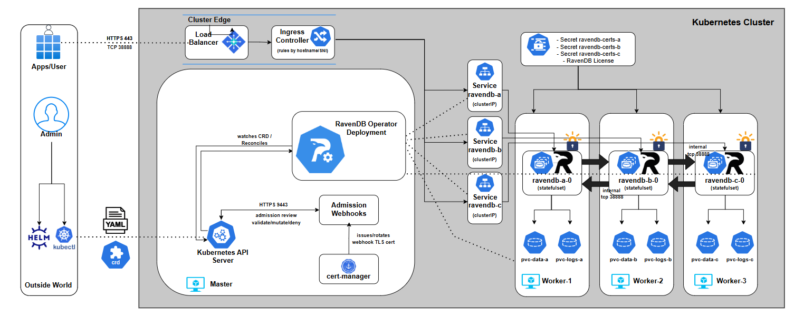

You can watch the full layout by listing all resources under the ravendb namespace:

```bash showLineNumbers
$ kubectl get pods,deploy,sts,svc,ingress,job,cm,secret,pvc,certificate,certificaterequest -n ravendb

NAME                             READY   STATUS      RESTARTS   AGE
pod/ravendb-a-0                  1/1     Running     0          4m40s
pod/ravendb-b-0                  1/1     Running     0          4m40s
pod/ravendb-c-0                  1/1     Running     0          4m40s
pod/ravendb-cluster-init-6h2mf   0/1     Completed   0          4m40s

NAME                         READY   AGE
statefulset.apps/ravendb-a   1/1     4m40s
statefulset.apps/ravendb-b   1/1     4m40s
statefulset.apps/ravendb-c   1/1     4m40s

NAME                TYPE        CLUSTER-IP      EXTERNAL-IP   PORT(S)             AGE
service/ravendb-a   ClusterIP   10.96.214.107   <none>        443/TCP,38888/TCP   4m40s
service/ravendb-b   ClusterIP   10.96.75.30     <none>        443/TCP,38888/TCP   4m40s
service/ravendb-c   ClusterIP   10.96.10.22     <none>        443/TCP,38888/TCP   4m40s

NAME                                CLASS   HOSTS                                                                                                                      ADDRESS          PORTS   AGE
ingress.networking.k8s.io/ravendb   nginx   a.ravendb-operator-e2e.ravendb.run,a-tcp.ravendb-operator-e2e.ravendb.run,b.ravendb-operator-e2e.ravendb.run + 3 more...   172.19.255.200   80      4m40s

NAME                             COMPLETIONS   DURATION   AGE
job.batch/ravendb-cluster-init   1/1           2m5s       4m40s

NAME                                  DATA   AGE
configmap/kube-root-ca.crt            1      6m35s
configmap/ravendb-bootstrapper-hook   2      4m40s
configmap/ravendb-cert-hook           2      4m40s

NAME                         TYPE     DATA   AGE
secret/ravendb-certs-a       Opaque   1      5m18s
secret/ravendb-certs-b       Opaque   1      5m15s
secret/ravendb-certs-c       Opaque   1      5m12s
secret/ravendb-client-cert   Opaque   1      4m58s
secret/ravendb-license       Opaque   1      5m22s

NAME                                             STATUS   VOLUME                                     CAPACITY   ACCESS MODES   STORAGECLASS   VOLUMEATTRIBUTESCLASS   AGE
persistentvolumeclaim/ravendb-data-ravendb-a-0   Bound    pvc-34c3d1c8-1a2f-4b6a-b153-4be9deab6a3f   10Gi       RWO            local-path     <unset>                 4m40s
persistentvolumeclaim/ravendb-data-ravendb-b-0   Bound    pvc-bb80b1f0-448d-4acc-b1c9-2cd4df0af593   10Gi       RWO            local-path     <unset>                 4m40s
persistentvolumeclaim/ravendb-data-ravendb-c-0   Bound    pvc-46a6ff68-ea92-43e5-a33b-5068d8cf099e   10Gi       RWO            local-path     <unset>                 4m40s

```

<h3>Watching the cluster form: the init job</h3> 

The real creation of the **RavenDB cluster** happens inside the **bootstrap job** created by the operator. This job is responsible for forming the initial RavenDB cluster, and it does so by actively validating that every node is reachable using the public URLs you defined in the RavenDBCluster spec. Concretely, it:

* Waits until all RavenDB pods are running  
* Resolves each `publicServerUrl` and `publicServerUrlTcp`  
* Verifies HTTPS connectivity using the issued certificates  
* Register the admin client certificate you provided for you  
* Adds each node to the cluster in a controlled sequence

You can watch this process in real time:

```bash showLineNumbers
$ kubectl logs job/ravendb-cluster-init -n ravendb
>> Starting RavenDB cluster bootstrapper...[11:55:08] === Starting Discoverability Checks ===[11:55:08] Checking if kubectl is already installed...[11:55:08] Downloading and installing kubectl...[11:55:42] kubectl installed successfully.[11:55:42] Waiting for all RavenDB pods to be in 'Running' state...[11:55:42] Pod readiness check: attempt 1/30[11:55:42] All RavenDB pods are running.[11:55:42] Checking HTTPS (Studio) reachability of RavenDB nodes...[11:55:42] [a] curl -k https://a.ravendb-operator-e2e.ravendb.run:443[11:55:42] [a] Studio redirect detected - looks good[11:55:42] [b] curl -k https://b.ravendb-operator-e2e.ravendb.run:443[11:55:42] [b] Studio redirect detected - looks good[11:55:42] [c] curl -k https://c.ravendb-operator-e2e.ravendb.run:443[11:55:42] [c] Studio redirect detected - looks good[11:55:42] === Discoverability Checks Completed ===[11:55:42] === Starting Cluster Initialization ===[11:55:53] Registering Admin client certificate...[11:55:53] Registering client cert via rvn on first node...[11:55:53] Client cert registered on the first node.[11:55:54] [B] added as Member[11:55:58] [C] added as Member[11:56:01] Cluster topology:{  "Leader": "A",  "CurrentState": "Leader",  "CurrentTerm": 1,  "TopologyId": "76d152b9-f968-499d-af74-2307ca8c37ac",  "Members": "A B C"}[11:56:01] === Cluster Initialization Complete ===
```

The logs are intentionally explicit. You’ll see DNS resolution, connectivity checks, and node additions logged step by step. When this job completes successfully, the cluster is fully formed \- no manual setup, no UI-driven registration, no follow-up actions required.

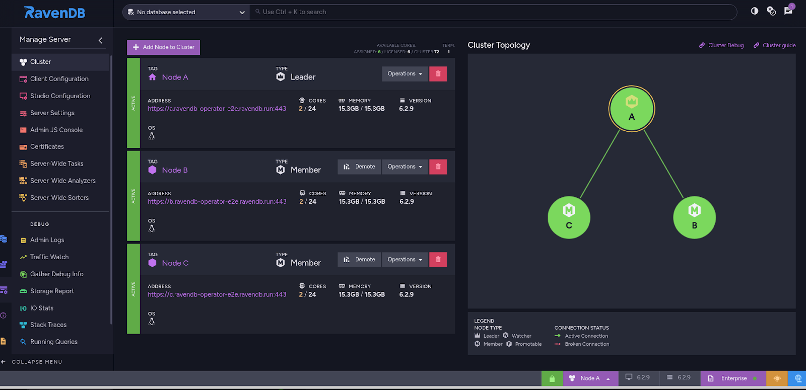

<h3>Accessing RavenDB Studio from your browser</h3> 

At this point, the cluster is up, the bootstrap job has completed, and RavenDB is fully operational. Let’s access the RavenDB Studio.

On a local kind cluster, this requires two small, explicit steps: hostname resolution and client certificate authentication. 

**Step 1: Make the hostnames resolvable on your machine**

Inside the cluster, DNS already works  \- that’s how the bootstrap job succeeded.  
Your local machine, however, may not know how to resolve the RavenDB hostnames to the ingress IP.

If your OS DNS does not already resolve them correctly, add temporary entries to `/etc/hosts`:

```bash showLineNumbers
172.19.255.200 a.ravendb-operator-e2e.ravendb.run
172.19.255.200 b.ravendb-operator-e2e.ravendb.run
172.19.255.200 c.ravendb-operator-e2e.ravendb.run
```

This is the same EXTERNAL-IP of our Ingress controller we acquired in **part 3\.**   
This step is only needed for local development, has no effect on the cluster itself, and is not required in real environments with proper DNS.  
It simply allows your browser to reach the ingress endpoint by hostname.

**Step 2: Import the client certificate into your browser**

Because the cluster is secured, RavenDB Studio requires **client certificate authentication**. The browser must present a valid client certificate when connecting.  
To use it in the browser, you need the corresponding `client.pfx` file you generated in **part 4**..

**Importing into Chrome / Chromium / Edge**

1. Open browser settings  
2. Go to **Privacy and Security → Security → Manage certificates**  
3. Switch to the **Personal** tab  
4. Click **Import**  
5. Select the `client.pfx` file

**Step 3: Open RavenDB Studio**

Now open your browser and navigate to your URL.  
The browser will prompt you to select a client certificate. Choose the imported RavenDB client certificate.  
If everything is wired correctly, RavenDB Studio loads immediately \- secured, clustered, and fully initialized.

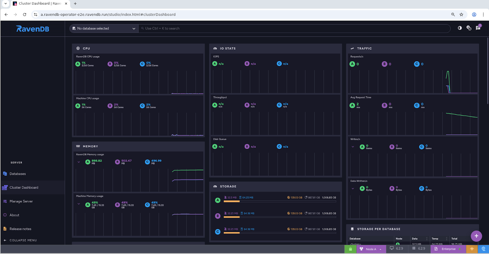

With the cluster now running, certificates in place, and the bootstrap process completed, RavenDB has fully transitioned from a declarative specification into a living system.

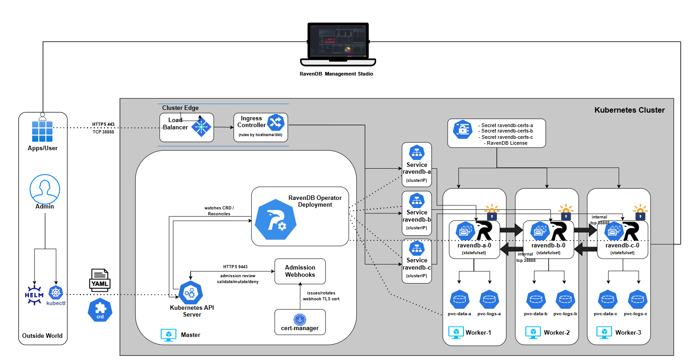

At this point, the most important question is no longer *how* the cluster was created, but *how it tells you what’s happening*. In **Part 7**, we’ll shift focus to **events and logging** \-  how the operator communicates progress, surfaces problems, and explains its decisions through Kubernetes Events, structured logs, and status conditions. This is where observability replaces guesswork, and operating the cluster becomes predictable instead of reactive.

## Part 7: Events and Logging
<h2>How the Operator Tells You the Truth</h2> 

Once the cluster is alive, the hardest part isn’t “how to deploy” anymore  \- it’s how to understand what’s going on when something changes, slows down, or breaks. Kubernetes already has a strong debugging toolbox, but it’s fragmented: pods have logs, controllers have logs, objects have events, health signals live across multiple resources, and so on.

A good operator should collapse all that into a single place you can trust, while still letting you drill down when needed.

That’s what this chapter is about: **reading the cluster state top-down**, then using **Events \+ logs as your time machine** to understand what happened, why, and what to do next.

If you’ve ever debugged a broken rollout, you know the classic trap: pods might be “Running” but not “Ready”, Ingress might exist but has no address, PVCs might exist but never bind.  
A bootstrap Job might be retrying while your nodes look “healthy”.

The operator’s status model is designed to prevent that confusion by giving you:

* a deterministic lifecycle (`phase`)  
* a clear explanation (`message`)  
* a truth table (`conditions[]`) that drives readiness  
* Events emitted *only when something actually changes*

<h3>How to read the CR status top-down</h3> 

Once the cluster exists, your instinct is usually to jump straight into pods:

`kubectl get pods` → `kubectl describe pod` → scroll… → (optional) panic .

It works… but it’s the slow path. 

The operator already did the hard work of turning dozens of raw Kubernetes signals into one coherent story.  If you learn to read that story first, you’ll debug faster, and you’ll make fewer wrong assumptions.

So in Part 7, we’re going to build a habit: **Start from the RavenDBCluster resource.**  
Only dive into pods and logs when the CR tells you exactly where to look.

The one command that should become muscle memory:

```bash showLineNumbers
$ kubectl -n ravendb describe ravendbclusters <name>

Name:         ravendbcluster-sample
Namespace:    ravendb
Labels:       app.kubernetes.io/name=ravendb-operator
API Version:  ravendb.ravendb.io/v1
Kind:         RavenDBCluster
Metadata:
  Creation Timestamp:  2025-12-21T11:53:58Z
  Generation:          1
  Resource Version:    2158
  UID:                 63f56ba6-475a-4c10-8326-cf6c84792ed8
Spec:
...
Status:
  Conditions:
    Last Transition Time:  2025-12-21T11:55:19Z
    Message:               all PVCs bound
    Reason:                Completed
    Status:                True
    Type:                  StorageReady
    Last Transition Time:  2025-12-21T11:53:59Z
    Message:               all certificate secrets present
    Reason:                Completed
    Status:                True
    Type:                  CertificatesReady
    Last Transition Time:  2025-12-21T11:53:59Z
    Message:               license secret present
    Reason:                Completed
    Status:                True
    Type:                  LicensesValid
    Last Transition Time:  2025-12-21T11:55:26Z
    Message:               all node pods ready
    Reason:                Completed
    Status:                True
    Type:                  NodesHealthy
    Last Transition Time:  2025-12-21T11:54:09Z
    Message:               ingress load balancer address allocated
    Reason:                Completed
    Status:                True
    Type:                  ExternalAccessReady
    Last Transition Time:  2025-12-21T11:56:04Z
    Message:               bootstrap job succeeded
    Reason:                Completed
    Status:                True
    Type:                  BootstrapCompleted
    Last Transition Time:  2025-12-21T11:56:04Z
    Message:               no active rollouts
    Reason:                Completed
    Status:                False
    Type:                  Progressing
    Last Transition Time:  2025-12-21T11:53:59Z
    Message:               no degradation detected
    Reason:                Completed
    Status:                False
    Type:                  Degraded
    Last Transition Time:  2025-12-21T11:56:04Z
    Message:               Cluster is ready
    Reason:                Completed
    Status:                True
    Type:                  Ready
  Message:                 Cluster is ready
  Observed Generation:  1
  Phase:                Running
```

It’s your cluster’s status page \- written by the operator. And it’s structured so you can read it top-down.

<h3>1\) Phase: the headline</h3> 

At the bottom, you’ll see .status.phase.

Think of it as the title of the story the operator is currently telling:

* **Deploying**  \- the operator is still building the cluster or waiting for prerequisites.  
* **Running**  \-  everything required is satisfied; the cluster is ready to serve.  
* **Error** \- something is degraded (failed bootstrap, unhealthy pods, repeated crashes, etc.).

This matters because it prevents the classic failure mode of Kubernetes debugging:  
“I see resources… therefore it’s working.”

A cluster can have StatefulSets, Pods, Services, Ingresses \- and still be nowhere near ready.  
Phase forces you to answer the right question first: *is the operator satisfied yet?*

<h3>2\) Message: the human explanation</h3> 

Right next to phase (or just below it) is .status.message.

This is where the operator stops being a controller and starts being a teammate.  
If the cluster isn’t ready, the message points to the first thing that blocks readiness  \- often with concrete resource names, not vague hints. And when the cluster *is* ready, you’ll see a clean confirmation like: `Cluster is ready`

In other words, `.status.message` is meant to be the line you paste into Slack. 

<h3>3\) Conditions:</h3> 

The truth table behind the story Phase and message are the summary. Conditions are the evidence. The operator tracks a set of conditions under `.status.conditions[]`. Some are “meta” signals:

* Ready \- the final answer: can this cluster serve traffic?  
* Progressing \- rollout is in flight  
* Degraded \- something is unhealthy enough to consider the state “error”

And some are the actual requirements the operator expects to become true:

* CertificatesReady  
* LicensesValid  
* StorageReady  
* NodesHealthy  
* BootstrapCompleted  
* ExternalAccessReady *(only when external access is configured)*

Each condition comes with three pieces of information:

* `status`: **True / False**  
* `reason`: a short code that can be grepped or automated (e.g. `PVCNotBound`, `WaitingForPods`)  
* `message`: the human explanation

This is the part most people ignore at first \-  and it’s exactly the part that makes the operator usable. Because conditions don’t just tell you *that something is wrong*.

<h3>Events: turning status changes into a timeline</h3> 

Status tells you *where you are*.  Events tell you *how you got there*.

The operator emits Kubernetes Events **only when a condition transitions**  \-  not on every reconcile loop.

That design choice is deliberate. It means Events form a chronological narrative:

* something became blocked  
* something was fixed  
* the cluster advanced  
* something degraded  
* readiness flipped

When you run: 

```bash showLineNumbers
$ kubectl get events.events.k8s.io -A -o json | jq -r '
  .items
  | map(select(.reportingController=="ravendb-operator"))
  | sort_by(.eventTime // .deprecatedLastTimestamp // .metadata.creationTimestamp)
  | .[]
  | [
      (.eventTime // .deprecatedLastTimestamp // .metadata.creationTimestamp),
      .type, .reason, .note,
      (.regarding.kind + "/" + .regarding.name),
      .reportingInstance
    ] | @tsv'
```

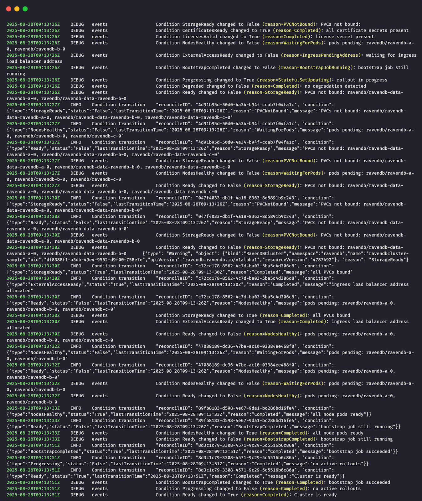

You’re not looking at noise. You’re looking at a timeline of state changes.  
This is especially powerful during rollouts, because you can literally watch readiness move from one requirement to the next:

… → storage blocked → PVCs not bound → storage resolved → nodes still pending → nodes healthy → bootstrap still running → bootstrap completed → cluster ready.

<h3>Operator logs: understanding why the state changed</h3> 

If Events are the operator’s timeline, then logs are its inner monologue. An Event tells you that something changed: storage became ready, nodes turned healthy, and bootstrap completed. 

That’s useful, but it still leaves an important question unanswered: why did the operator decide this change happened now?

That’s where the operator logs come in. Whenever the operator recomputes cluster health and a condition changes, it emits a structured log entry describing that transition.

The log captures which condition changed, the previous and current states, and the reasoning the evaluator applied when evaluating the current cluster reality.

In practice, you don’t read operator logs first, and you don’t read them continuously.   
You let the CR status and Events guide you. Once they tell you where the problem is, the logs tell you how the operator interpreted what it saw. 

They answer questions like: Did the operator actually observe the resource I just fixed? Did it consider the state stable enough to flip the condition? Is it waiting on something subtle that isn’t obvious from the outside?

That’s why these logs matter. They’re not there to replace Events or status \- they complete them. Together, the three form a full loop: what changed, why it changed, and what that means for readiness. 

You can check the operator logs directly with the following command:

```bash showLineNumbers
$ kubectl -n ravendb-operator-system logs deploy/ravendb-operator-controller-manager -f
```

This shows the controller’s runtime output, including condition transitions and reconciliation activity, and is useful when you want to correlate changes in the cluster status with what the operator observed at that moment.

At this point, the cluster is no longer a black box. You know how the operator reasons about health, how readiness is derived, how state changes are surfaced through conditions and events, and where to look when something doesn’t move forward. 

In the final part of the series, **part 8**, we’ll build directly on that foundation and look at **rolling upgrades**. We’ll look at how the operator upgrades a running cluster from one RavenDB version to another, how it sequences node restarts to preserve availability, and how the same health signals you’ve just learned about are used to gate each step of the upgrade until the cluster is safe to move forward.

## Part 8: Rolling Upgrades

Upgrading a database cluster is one of those tasks that *looks* like a single-line change (“just bump the image tag”), but can turn ugly fast if you do it casually.  
A RavenDB node restart is not the scary part \- the scary part is what *might be true at the moment you restart it*:

Maybe one node is already unhealthy? Maybe the cluster can’t talk to itself cleanly?  
Maybe one database has a placement/topology problem that you haven’t noticed yet?

If you upgrade into that state, you’re not “upgrading” \- you’re applying pressure to a system that may already be cracked. That’s how you end up with downtime, surprise rebalances, or, in the worst case, you discover too late that your redundancy assumptions weren’t true.

So before we even talk about “how the operator upgrades”, here’s the boring-but-non-negotiable rule: always back up your data before you perform an upgrade.

In a real environment, that could mean:

* triggering a RavenDB backup you already have configured (preferred)  
* taking a storage-level snapshot of the PVCs (if that’s your operational model)  
* exporting critical data outside the cluster

This chapter focuses on the operator mechanics and safety rails \- not on replacing your backup strategy. The operator’s job here is to upgrade safely, one node at a time, and refuse to proceed when the cluster isn’t safe to touch.

<h3>What webhooks allow you to change</h3> 

A rolling upgrade starts the same way every operator-driven change starts: you update the CR (your declared intent), and reconciliation tries to converge the cluster to match it. In our case, the intent is simple:

“Run the cluster on a newer RavenDB image.”

So yes \- you *do* update `.spec.image`. But there’s a line the operator intentionally draws.

Allowed You can move forward to a newer image version (for example, `6.2.x -> 7.1.x`) by patching the CR. The operator will detect image drift between the desired `.spec.image` and what each node is currently running, and it will begin a controlled upgrade process. 

<h3>Not allowed</h3> 

The image validator webhook was extended specifically to prevent **explicit version downgrade**. That matters because downgrades are a different class of risk: even if containers start, the data format/behavior expectations might not match. The operator chooses to *reject that intent early*. So if you try to set `.spec.image` to a lower version than what you already run, the webhook should block the request at admission time, before any rollout even starts.

<h3>The upgrade model: serial, gated, resumable</h3> 

The operator upgrades **serially**: one node at a time, in the order you defined in the CR (`a`, then `b`, then `c`). If something goes wrong, it goes wrong while only **one** node is in motion.

But the more interesting piece is *how* the operator decides it is safe to move a node.  
Upgrades are guarded by gates: don’t upgrade a node unless the cluster can afford to lose it for a moment, and don’t move on until the cluster proves it has recovered.

The operator runs the same family of checks twice:

* **Node alive** **check** \- quick liveness probe of the target .  
* **Cluster connectivity** **check** \- are cluster links healthy  
* **Database groups available excluding target** **check**:: for each replicated database, confirm the cluster can still serve it *without relying on this specific node*.

<h3>What we’re going to do in this chapter</h3> 

We’ll run two upgrades back-to-back on our local cluster:

**A) Successful rolling upgrade**

We’ll take a healthy cluster and bump it from:`<FROM_IMAGE>` → `<TO_IMAGE>`

Then we’ll watch: node A upgrade first → then node B → then node C  
 with gates passing cleanly, and the cluster returning to `Ready=True` at the end.

**B) “Bad” upgrade (and how the gates refuse to move)**

We’ll intentionally set up a situation where upgrading would be unsafe:

1) create a replicated database placed on **A, B, C** (RF=3),  
2) sabotage the database state on **two nodes** (so redundancy is lying to us),  
3) trigger an upgrade anyway.

What should happen (and what we want to prove):

The operator begins normally → but one of the gates blocks (in this case, the “database availability” gate) → the upgrade stops **before it can cascade the damage** to more nodes.

Then we’ll fix the underlying issue and demonstrate the core operator promise: reconciliation always pulls reality back toward intent. It means that once the cluster becomes healthy again, the operator will resume upgrading until the actual cluster matches the declared `.spec.image`.

## Demo A: successful rolling upgrade

Before touching anything, we confirm that the cluster is in a clean, stable state. Rolling upgrades are deliberately conservative and only work as intended when the operator has a healthy baseline to start from.

At this point, the cluster should exist, be listed once, and show no errors or pending work. We begin by checking the cluster resource itself:

```bash showLineNumbers
$ kubectl -n ravendb get ravendbclusters
```

This confirms that the operator currently considers the cluster fully reconciled and ready.

Next, we establish a clear “before” snapshot of the running RavenDB version.   
Open RavenDB Studio in your browser and navigate to the **About** tab.   
This shows the exact server version currently running on the cluster.

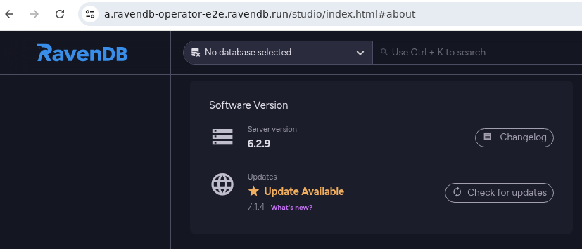

With the baseline confirmed, we trigger the upgrade itself. In this demo, we change only one thing: the container image version. Nothing else in the manifest is touched:

```bash showLineNumbers
$   kubectl -n ravendb patch ravendbcluster ravendbcluster-sample --type=merge -p '{
  "spec": { "image": "ravendb/ravendb:7.1.3-ubuntu.22.04-x64" }
}'
```

If you prefer working declaratively, you can achieve the same result by reapplying the full RavenDBCluster manifest with the image field updated.   
From the operator’s perspective, both approaches are equivalent \- what matters is that the desired image version has changed.

At this moment, nothing dramatic happens all at once. There is no mass restart, no cluster-wide disruption. Instead, the operator detects the image change and begins a controlled rolling process. This is where watching the Pods view becomes interesting.

As you monitor the pods in the `ravendb` namespace, you’ll see the story unfold one node at a time.  
 A single pod is terminated and recreated with the new image, while the remaining nodes continue running and serving traffic. Only after the upgraded node is fully started, healthy, and accepted back into the cluster does the operator move on to the next one:

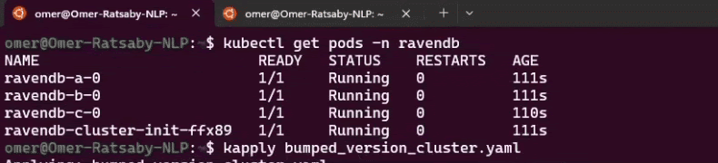

Once all pods have been updated and stabilized, the operator converges back to a steady state. No further changes are made, and the cluster returns to `Ready`.

To close the loop, return to RavenDB Studio and revisit the **About** tab. You should now see the new RavenDB version reported. This final check confirms that the upgrade completed successfully across all nodes and that the running system matches the desired state you declared:

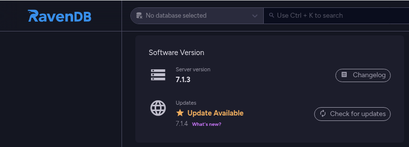

As the upgrade progresses, Pods alone only tell part of the story. They show *what* is restarting, but not *why* the operator decided it was safe to do so. For that, Kubernetes Events are the real source of truth.

While the rolling upgrade is in progress \-  or immediately after it completes \-  open a second terminal and watch the events emitted by the operator:

```bash showLineNumbers
$ kubectl -n ravendb get events --sort-by=.metadata.creationTimestamp

2025-12-21T15:40:30Z    DEBUG   events  node A - pre-step/node_alive started
2025-12-21T15:40:31Z    DEBUG   events  node A - pre-step/node_alive passed
2025-12-21T15:40:31Z    DEBUG   events  node A - pre-step/cluster_connectivity started
2025-12-21T15:40:31Z    DEBUG   events  node A - pre-step/cluster_connectivity passed
2025-12-21T15:40:31Z    DEBUG   events  node A - pre-step/db_groups_available_excluding_target started
2025-12-21T15:40:31Z    DEBUG   events  node A - pre-step/db_groups_available_excluding_target passed

2025-12-21T15:40:32Z    DEBUG   events  node A - post-step/node_alive started
2025-12-21T15:40:32Z    DEBUG   events  node A - post-step/node_alive blocked: retry in 5s (attempt 1): Get "https://a.ravendb-operator-e2e.ravendb.run:443/setup/alive"
2025-12-21T15:41:25Z    DEBUG   events  node A - post-step/node_alive passed
2025-12-21T15:41:35Z    DEBUG   events  node A - post-step/cluster_connectivity started
2025-12-21T15:41:35Z    DEBUG   events  node A - post-step/cluster_connectivity passed
2025-12-21T15:41:35Z    DEBUG   events  node A - post-step/db_groups_available_excluding_target started
2025-12-21T15:41:36Z    DEBUG   events  node A - post-step/db_groups_available_excluding_target passed

2025-12-21T15:41:36Z    DEBUG   events  node B - pre-step/node_alive started
2025-12-21T15:41:36Z    DEBUG   events  node B - pre-step/node_alive passed
2025-12-21T15:41:36Z    DEBUG   events  node B - pre-step/cluster_connectivity started
2025-12-21T15:41:37Z    DEBUG   events  node B - pre-step/cluster_connectivity passed
2025-12-21T15:41:37Z    DEBUG   events  node B - pre-step/db_groups_available_excluding_target started
2025-12-21T15:41:37Z    DEBUG   events  node B - pre-step/db_groups_available_excluding_target passed

2025-12-21T15:41:37Z    DEBUG   events  node B - post-step/node_alive started
2025-12-21T15:41:37Z    DEBUG   events  node B - post-step/node_alive blocked: retry in 5s (attempt 1): Get "https://b.ravendb-operator-e2e.ravendb.run:443/setup/alive"
2025-12-21T15:42:42Z    DEBUG   events  node B - post-step/node_alive passed
2025-12-21T15:42:54Z    DEBUG   events  node B - post-step/cluster_connectivity started
2025-12-21T15:42:54Z    DEBUG   events  node B - post-step/cluster_connectivity passed
2025-12-21T15:42:55Z    DEBUG   events  node B - post-step/db_groups_available_excluding_target started
2025-12-21T15:42:55Z    DEBUG   events  node B - post-step/db_groups_available_excluding_target passed

2025-12-21T15:42:55Z    DEBUG   events  node C - pre-step/node_alive started
2025-12-21T15:42:55Z    DEBUG   events  node C - pre-step/node_alive passed
2025-12-21T15:42:55Z    DEBUG   events  node C - pre-step/cluster_connectivity started
2025-12-21T15:42:56Z    DEBUG   events  node C - pre-step/cluster_connectivity passed
2025-12-21T15:42:56Z    DEBUG   events  node C - pre-step/db_groups_available_excluding_target started
2025-12-21T15:42:56Z    DEBUG   events  node C - pre-step/db_groups_available_excluding_target passed

2025-12-21T15:43:09Z    DEBUG   events  node C - post-step/node_alive started
2025-12-21T15:45:29Z    DEBUG   events  node C - post-step/node_alive blocked: retry in 5s (attempt 1): Get "https://c.ravendb-operator-e2e.ravendb.run:443/setup/alive"
2025-12-21T15:45:34Z    DEBUG   events  node C - post-step/node_alive passed
2025-12-21T15:45:46Z    DEBUG   events  node C - post-step/cluster_connectivity started
2025-12-21T15:45:46Z    DEBUG   events  node C - post-step/cluster_connectivity passed
2025-12-21T15:45:46Z    DEBUG   events  node C - post-step/db_groups_available_excluding_target started
2025-12-21T15:45:46Z    DEBUG   events  node C - post-step/db_groups_available_excluding_target passed
```

These events narrate the upgrade step by step. For each node, you’ll see a clear sequence that mirrors the internal upgrade gates.

Before a node is touched, the operator runs **pre-upgrade gates**: the node must be alive, cluster connectivity must be healthy, and all databases must be able to function without this node.  
Each check emits events as it starts and when it passes.

Only once all pre-gates succeed does the operator update the node’s StatefulSet and allow Kubernetes to restart the Pod with the new image.

After the Pod comes back, **post-upgrade gates** run to confirm the node rejoined correctly and the cluster stabilized again. Only then does the operator move on to the next node.

This happens serially  \- A, then B, then C. If anything blocks progress, the event stream stops advancing and clearly shows which gate failed and why.  
Reading the events top to bottom gives you a concise, chronological view of how the operator enforces safety during upgrades.

## Demo B: a blocked upgrade and safe recovery

This time, we’re going to do the opposite of Demo A. Instead of starting from a perfectly healthy cluster and watching a smooth upgrade, we’ll intentionally put the cluster into a risky state and observe how the operator refuses to proceed.

The goal here isn’t to break things for fun \-  it’s to prove that the upgrade logic is defensive.   
A rolling upgrade should never trade availability or data safety for progress.

As before, we start by confirming the cluster is initially healthy. This matters because we want the failure we introduce to be deliberate and controlled, not accidental:

```bash showLineNumbers
$ kubectl -n ravendb get ravendbclusters
```

Next, we introduce a problem at the data layer. We create a replicated database across all three nodes (A,B,C), then intentionally sabotage it on two of them (A,C).   
From RavenDB’s point of view, this leaves the cluster in a fragile state: there is no longer a safe placement for the database if node B disappears.

Before Sabotage:

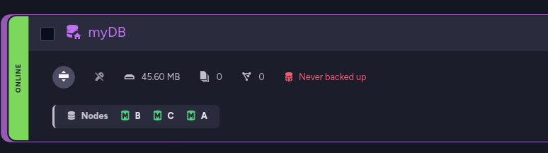

After Sabotage:

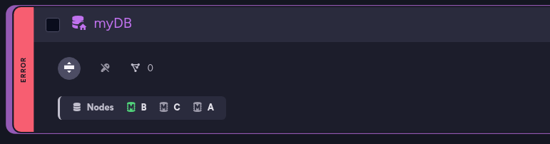

Now let’s trigger an upgrade and see what happens:

```bash showLineNumbers
$   kubectl -n ravendb patch ravendbcluster ravendbcluster-sample --type=merge -p '{
  "spec": { "image": "ravendb/ravendb:7.1.3-ubuntu.22.04-x64" }
}'
```

At this point, we patch the cluster image to trigger the upgrade \- exactly the same action we took in Demo A. But this time, the outcome is very different:

The operator starts with the first node in order and runs its pre-upgrade checks.  
The node is alive, cluster connectivity is healthy, and there is still a valid replica of the database on another node. From a data-safety perspective, upgrading node A is allowed, so the operator proceeds:

```bash showLineNumbers
$ kubectl -n ravendb get events --sort-by=.metadata.creationTimestamp

2025-12-21T15:40:30Z    DEBUG   events  node A - pre-step/node_alive started
2025-12-21T15:40:31Z    DEBUG   events  node A - pre-step/node_alive passed
2025-12-21T15:40:31Z    DEBUG   events  node A - pre-step/cluster_connectivity started
2025-12-21T15:40:31Z    DEBUG   events  node A - pre-step/cluster_connectivity passed
2025-12-21T15:40:31Z    DEBUG   events  node A - pre-step/db_groups_available_excluding_target started
2025-12-21T15:40:31Z    DEBUG   events  node A - pre-step/db_groups_available_excluding_target passed

2025-12-21T15:40:32Z    DEBUG   events  node A - post-step/node_alive started
2025-12-21T15:40:32Z    DEBUG   events  node A - post-step/node_alive blocked: retry in 5s (attempt 1): Get "https://a.ravendb-operator-e2e.ravendb.run:443/setup/alive"
2025-12-21T15:41:25Z    DEBUG   events  node A - post-step/node_alive passed
2025-12-21T15:41:35Z    DEBUG   events  node A - post-step/cluster_connectivity started
2025-12-21T15:41:35Z    DEBUG   events  node A - post-step/cluster_connectivity passed
2025-12-21T15:41:35Z    DEBUG   events  node A - post-step/db_groups_available_excluding_target started
2025-12-21T15:41:36Z    DEBUG   events  node A - post-step/db_groups_available_excluding_target passed

```

Next, the operator turns to node B. Once again, the basics look fine: the node is up and reachable, and cluster connectivity passes. But when the upgrade logic reaches the database safety gate, it stops.

At this point, node B holds the last healthy copy of the database. Upgrading it would temporarily remove that copy from the cluster, leaving no safe place for the data. That’s an unacceptable risk:

```bash showLineNumbers
$ kubectl -n ravendb get events --sort-by=.metadata.creationTimestamp

...
2025-12-21T15:41:36Z    DEBUG   events  node B - pre-step/node_alive started
2025-12-21T15:41:36Z    DEBUG   events  node B - pre-step/node_alive passed
2025-12-21T15:41:36Z    DEBUG   events  node B - pre-step/cluster_connectivity started
2025-12-21T15:41:37Z    DEBUG   events  node B - pre-step/cluster_connectivity passed
2025-12-21T15:41:37Z    DEBUG   events  node B - pre-step/db_groups_available_excluding_target started
2025-12-21T15:41:38Z    DEBUG   events  node B - pre-step/db_groups_available_excluding_target blocked: retry in 10s (attempt 1): db=myDB node=C error=In rehabilitation because the DatabaseStatus for this node is Faulted... System.AggregateException: One or more errors occurred. (Failed to… {"type": "Warning", "object": ...})


```

Instead of pushing forward, the operator blocks the upgrade before any Pod is restarted. No containers are touched, no data is endangered, and the cluster remains exactly as it was \- paused at the point where safety could no longer be guaranteed.

From the outside, the cluster now looks a little uneven. One node has already been upgraded, while the others are still running the old version. That’s expected \-  and more importantly, it’s intentional. The operator never rolls anything back and never forces the cluster into symmetry at the cost of safety. It simply stops where it must.

At this point, nothing is “broken.” The cluster is still running, serving traffic, and preserving data. The upgrade is paused, waiting for conditions to become safe again.

Now let’s fix the underlying issue. We restore the damaged database state and ensure that replicas are once again properly distributed across the cluster. Once the data is safe and the health checks pass, we don’t need to retrigger anything or reapply the manifest.

On the next reconciliation loop, the operator detects that the blocking condition is gone.   
The same upgrade intent remains, so it simply resumes where it left off. Node B is upgraded, followed by the remaining nodes, one at a time, with the same pre- and post-upgrade gates enforced at each step:

```bash showLineNumbers
$ kubectl get pods -n ravendb

NAME                         READY   STATUS              RESTARTS   AGE
ravendb-a-0                  1/1     Running              0          3m39s
ravendb-b-0                  0/1     ContainerCreating    0          54s
ravendb-c-0                  1/1     Running              0          3m37s

$ kubectl get pods -n ravendb
NAME                         READY   STATUS              RESTARTS   AGE
ravendb-a-0                  1/1     Running             0          3m52s
ravendb-b-0                  1/1     Running             0          67s
ravendb-c-0                  0/1     ContainerCreating   0          0s


$ kubectl -n ravendb get events --sort-by=.metadata.creationTimestamp
...
2025-12-21T15:41:37Z    DEBUG   events  node B - pre-step/db_groups_available_excluding_target started
2025-12-21T17:36:58Z    DEBUG   events  node B - pre-step/db_groups_available_excluding_target blocked
...
2025-12-21T15:41:37Z    DEBUG   events  node B - pre-step/db_groups_available_excluding_target passed

2025-12-21T15:41:37Z    DEBUG   events  node B - post-step/node_alive started
2025-12-21T15:41:37Z    DEBUG   events  node B - post-step/node_alive blocked: retry in 5s (attempt 1): Get "https://b.ravendb-operator-e2e.ravendb.run:443/setup/alive"
2025-12-21T15:42:42Z    DEBUG   events  node B - post-step/node_alive passed
2025-12-21T15:42:54Z    DEBUG   events  node B - post-step/cluster_connectivity started
2025-12-21T15:42:54Z    DEBUG   events  node B - post-step/cluster_connectivity passed
2025-12-21T15:42:55Z    DEBUG   events  node B - post-step/db_groups_available_excluding_target started
2025-12-21T15:42:55Z    DEBUG   events  node B - post-step/db_groups_available_excluding_target passed

2025-12-21T15:42:55Z    DEBUG   events  node C - pre-step/node_alive started
2025-12-21T15:42:55Z    DEBUG   events  node C - pre-step/node_alive passed
2025-12-21T15:42:55Z    DEBUG   events  node C - pre-step/cluster_connectivity started
2025-12-21T15:42:56Z    DEBUG   events  node C - pre-step/cluster_connectivity passed
2025-12-21T15:42:56Z    DEBUG   events  node C - pre-step/db_groups_available_excluding_target started
2025-12-21T15:42:56Z    DEBUG   events  node C - pre-step/db_groups_available_excluding_target passed

2025-12-21T15:43:09Z    DEBUG   events  node C - post-step/node_alive started
2025-12-21T15:45:29Z    DEBUG   events  node C - post-step/node_alive blocked: retry in 5s (attempt 1): Get "https://c.ravendb-operator-e2e.ravendb.run:443/setup/alive"
2025-12-21T15:45:34Z    DEBUG   events  node C - post-step/node_alive passed
2025-12-21T15:45:46Z    DEBUG   events  node C - post-step/cluster_connectivity started
2025-12-21T15:45:46Z    DEBUG   events  node C - post-step/cluster_connectivity passed
2025-12-21T15:45:46Z    DEBUG   events  node C - post-step/db_groups_available_excluding_target started
2025-12-21T15:45:46Z    DEBUG   events  node C - post-step/db_groups_available_excluding_target passed

```

This is the key takeaway: rolling upgrades are not a single action, but a continuous reconciliation process. If something goes wrong, the operator pauses. When the system becomes healthy again, it continues \-  always moving the actual cluster state back toward the declared one, without shortcuts and without risking your data.

This is where the journey comes full circle. What started as a blank Kubernetes cluster ends as a living, secured RavenDB system that you can reason about, operate, and evolve with confidence. 

You’ve seen how intent flows from a single CR into real infrastructure, how safety is enforced before anything destructive happens, and how the operator behaves when reality doesn’t match the plan \-  by pausing, not panicking.

More importantly, you’ve built intuition. You now know *why* certain steps exist, *what* the operator is protecting you from, and *how* to read the signals it exposes when something goes wrong.   
That understanding is what turns an operator from “magic” into a tool you can trust.

From here, the mechanics don’t change \-  only the scale and the scenarios do. Whether you’re upgrading versions, expanding clusters, or recovering from failures, the same principles apply: declare your intent, observe the reconciliation, and let safety lead every step.