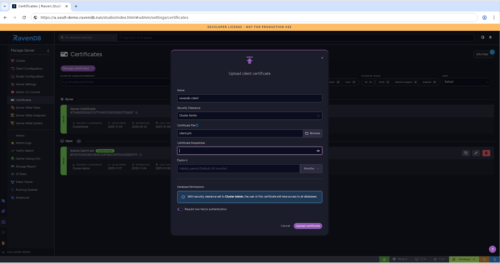

import Admonition from '@theme/Admonition';
import Tabs from '@theme/Tabs';
import TabItem from '@theme/TabItem';
import CodeBlock from '@theme/CodeBlock';
import LanguageSwitcher from "@site/src/components/LanguageSwitcher";
import LanguageContent from "@site/src/components/LanguageContent";


# RavenDB Client Certificates with Vault-Backed Key Reuse

## Overview

Certificate rotation is supposed to be routine. In practice, it often turns into an operational tax:  
**new cert  → re-registration → rollout coordination → “why is prod locked out?”**

This article shows a cleaner model for **RavenDB client authentication**:    
Register a client certificate once, then renew it as often as you want by keeping the same private key across renewals. No re-registering needed.

The certificate metadata can change (validity dates, serial number, thumbprint), but as long as it’s issued by the **same authority** and renewed in a way that reuses the **same key pair**, RavenDB continues to accept it.

### Terminology (Quick Primer)

**Private Key**  
The private key defines the certificate’s identity.  
If two certificates use the *same* private key and are signed by the same issuer, they represent the same identity, even if their thumbprint or validity dates differ.

**Issuer (Certificate Authority)**  
The issuer is the authority that signs the certificate.  
Renewal without re-registration only works when the same issuer (or trusted chain) signs the new certificate; otherwise, it becomes a completely different identity.

**CSR (Certificate Signing Request)**  
A CSR is generated from your private key and contains the public key plus identification details.  
When a CA signs a CSR, it issues a certificate tied to that same key.  Re-using the *same CSR* produces new certificates with the *same identity key*.

We’ll walk through three vault patterns, each showing a different way to renew a certificate while preserving the same identity key:

- **Azure Key Vault** \-  Uses the native *reuseKey: true* capability to generate new certificate versions that keep the private key intact.  
- **HashiCorp Vault**:  Does not provide automatic key reuse, so we generate and store the private key and CSR ourselves. Renewal simply means asking Vault to sign that same CSR again.  
- **AWS Private CA with Secrets Manager**: Follows the same model as HashiCorp Vault: store the private key and CSR once, then instruct PCA to issue fresh certificates by signing that same CSR, producing new certificates with the same identity key.

## What “register once” means in RavenDB

When a certificate is renewed using the **same private key** and signed by the **same issuer**, it represents the same identity in every meaningful sense.  
The metadata may change \- validity dates, serial number, thumbprint \- but the underlying identity and the authority vouching for it remain constant.

A useful way to think about this is the renewal of an official ID:  
You may receive a *new* driving license, but because it is issued by the same government authority and tied to the same person, every system that trusted the old license continues to trust the new one automatically.

Certificates work the same way.  
The identity (the key) stays the same, the issuer stays the same \-  so trust carries forward without re-registration, re-provisioning, or operational churn.

RavenDB uses X.509 client certificates as its authentication and authorization mechanism.  
In the normal workflow, you:

1. Issue a client certificate (PFX).  
2. Register it in RavenDB with the appropriate clearance (for example, ClusterAdmin).  
3. Use that certificate to authenticate against the cluster.

Where things traditionally become painful is during renewal.  
Most public-key infrastructure (PKI) systems generate a new key pair when issuing a renewed certificate.  
From RavenDB’s perspective, that means a new identity entirely \- which forces you to go back, re-register the certificate, and roll out the updated identity across every environment and automation touchpoint.

But as you’ll see next, if you renew in a way that preserves the **same key** and the **same issuer**, RavenDB no longer requires re-registration \- and certificate rotation becomes a seamless, fully operational practice.

## Three Providers, One Principle: RavenDB Authentication Without Re-Registration \- Walkthrough Demo

In the next sections we’ll make this idea concrete with three full, end to end walkthroughs: one for **Azure Key Vault**, one for **HashiCorp Vault** and one for **AWS Private CA \+ Secrets Manager.**  
 Each tab follows the same pattern:

1. create (or configure) an issuer  
2. generate a client certificate with a reusable private key,   
3. register that PFX once in RavenDB,   
4. renew the certificate while RavenDB continues to accept it without re-registration.   
   

To follow along you’ll need a secured RavenDB node reachable over HTTPS (with an existing admin/client certificate that can register new certs), CLI access to the relevant platform (az for Azure, vault  for HCV, aws CLI for AWS), and basic tooling like curl, openssl, and jq installed on your workstation.

We’ll also assume your RavenDB node is already secured with Let’s Encrypt, using a setup package you created through the RavenDB Setup Wizard. These walkthroughs work just as well for self-signed setups. For instructions on securing your RavenDB node and generating the setup package, please check [here](https://docs.ravendb.net/7.1/start/installation/setup-wizard).

<Tabs>
<TabItem value="azurekey" label="Azure Key Vault">
Azure Key Vault is, by far, the most straightforward platform for demonstrating this capability. Unlike most PKI systems, Key Vault lets you issue new certificate versions while keeping the same private key simply by setting `reuseKey: true` in the policy. 

That single switch transforms certificate renewal from an operational headache into a predictable, frictionless update: RavenDB continues trusting the renewed certificate without ever seeing a new registration request.

Below is the full flow: define a policy, create the certificate, register it once in RavenDB, then generate a brand-new version and watch RavenDB accept it immediately \- different thumbprint, same identity.

So let’s switch over to the terminal and get started. We’ll be demonstrating everything in a Linux environment.

<h3> 1\. Create an Azure Key Vault certificate policy with `reuseKey: true` </h3>

Create an Azure Key Vault certificate policy that we’ll supply to Key Vault for generating the certificate:

```json showLineNumbers
# policy.json 
{
  "issuerParameters": { "name": "Self" },
  "keyProperties": { 
    "exportable": true, 
    "kty": "RSA", 
    "keySize": 2048, 
    "reuseKey": true 
   },
  "secretProperties": { "contentType": "application/x-pkcs12" },
  "x509CertificateProperties": {
    "subject": "CN=vault-demo.ravendb.run",
    "ekus": [ "1.3.6.1.5.5.7.3.2" ],
    "keyUsage": [ "digitalSignature", "keyEncipherment" ],
    "validityInMonths": 12
  }
}
```

**What these parameters means:**

- **`reuseKey: true`**  
  The magic ingredient. Azure issues a *new* certificate version but reuses the *same* private key. RavenDB sees a familiar key pair from the same issuer and continues to authenticate it immediately.  
    
- **`exportable: true` \+ `contentType: application/x-pkcs12`**  
  Key Vault must allow you to export a PFX. RavenDB accepts PFXs directly \- so this ensures a seamless integration.

- **`subject: "CN=vault-demo.ravendb.run"`**   
  Same certificate’s common name we used while generating our setup package.  
    
- **`kty: "RSA" and keySize: 2048`**  
  Chooses the RSA algorithm with a 2048-bit key, a standard and broadly compatible choice for TLS client certificate  
  


<h3>  2\. Issue the certificate and export the PFX </h3>

```bash showLineNumbers
$ export VAULT_NAME="my-akv"
$ export CERT_NAME="ravendb-client"

# Create the initial certificate (version 1)
$ az keyvault certificate create \
  --vault-name "$VAULT_NAME" \
  --name "$CERT_NAME" \
  --policy @policy.json

# Export the PFX (Key Vault stores it as a base64 secret)
$ az keyvault secret show \
  --vault-name "$VAULT_NAME" \
  --name "$CERT_NAME" \
  --query value -o tsv > client.pfx.b64

$ base64 -d client.pfx.b64 > client.pfx

```

At this point, you hold the PFX containing the identity you will **register exactly once** in RavenDB.

<h3>  **3\.  Register the PFX in RavenDB a single time** </h3>

To register the certificate through **RavenDB Studio**, navigate to:  
**Manage Server → Certificates → Manage Certificates → Upload Client Certificate**

In the upload dialog, fill in the following fields:

- **Name** \-  A friendly identifier for this client certificate (e.g., ravendb-client).

- **Security Clearance**  \- The permission level you want this identity to have (e.g., ClusterAdmin).

- **Path to certificate file** \-  The PFX file you bundled (e.g., client.pfx).

- **Passphrase (optional)** \- Only required if the PFX was created with one.

- **Expiration (optional)** \- If you want RavenDB to treat the certificate as expired earlier than its actual validity period.



<h3>  **Alternatively, register the certificate via the CLI** </h3>

For automation or scripted deployments, you can perform the same registration using the admin REST API:

```bash showLineNumbers
$ export RAVEN_URL="https://a.vault-demo.ravendb.run"
$ export ADMIN_CERT_PFX="./setup_package/admin.client.certificate.vault-demo.pfx

$ curl --cert "$ADMIN_CERT_PFX" \
--cert-type P12 \
-X PUT "$RAVEN_URL/admin/certificates" \
  -H "Content-Type: application/json" \
  -d '{
    "Name":"ravendb-client",
    "Certificate":"'"$(base64 -w0 ./client.pfx)"'",
    "SecurityClearance":"ClusterAdmin"
  }'
```

We have now introduced this identity to the cluster. **We will not do this again.** 

Every future renewal will be accepted automatically.

Let’s try it by going through the renewal process.

<h3>  4\.  Issue a new certificate version, export it, and prepare it for use </h3>

```bash showLineNumbers
# Create a second version of the certificate - same key, new validity window
$ az keyvault certificate create \
  --vault-name "$VAULT_NAME" \
  --name "$CERT_NAME" \
  --policy @policy.json


# Retrieve the renewed version (Key Vault always exposes the latest version via the same name)
$ az keyvault secret show \
  --vault-name "$VAULT_NAME" \
  --name "$CERT_NAME" \
  --query value -o tsv > client-renewed.pfx.b64

$ base64 -d client-renewed.pfx.b64 > client-renewed.pfx
```

We created a fresh certificate **version** in Azure Key Vault. Because `reuseKey: true` is part of the policy, the new version keeps the **same private key** but has new validity dates and a new thumbprint.

After exporting this renewed PFX, it is immediately ready for use as a client certificate.

At this point, your application or deployment pipeline can simply retrieve the latest certificate version as part of its startup or container initialization process. The rotation logic now lives entirely in the Vault- your service just asks for “the newest version,” and RavenDB will accept it automatically because the key and issuer remain the same.

<h3>  5\.  Use the renewed certificate to authenticate \- without re-registering </h3>

```bash showLineNumbers
$ curl --cert client-renewed.pfx: --cert-type P12 \
  "$RAVEN_URL/cluster/topology"

{"@metadata":{"DateTime":"2025-10-20T08:55:35.5478414Z","WebUrl":"https://192.168.100.14","NodeTag":"A"},"Topology":{"TopologyId":"0f4e39d1-c22f-4...}}}
```

The renewed certificate successfully authenticates without performing a registration step again.

This confirms the key reuse mechanism worked: despite being a new version with a new thumbprint, the public/private key pair is identical, so the system treats it as the same client identity.

<h3> 6\.   List certificates on the server and observe both versions under the same identity </h3>

You can also inspect the registered certificates- and verify that both versions of the renewed certificate appear \- directly through the RavenDB Studio.  
Navigate to:  
**Manage Server → Certificates → Manage Certificates**


**Alternatively, view certificate entries via CLI**

```bash showLineNumbers
$ curl --cert client-renewed.pfx: --cert-type P12 \
  "$RAVEN_URL/admin/certificates" \
| jq '( .Results // [] ) | map({name: .Name, thumbprint: .Thumbprint, notBefore: .NotBefore})'

[
  {
    "name": "Server Certificate",
    "thumbprint": "877468EEE8360712F7F458701D815D9D5770662F",
    "notBefore": "2025-11-24T09:25:49.0000000"
  },
  {
    "name": "ravendb-client",
    "thumbprint": "588FD438BC9D106B32C3BA7CBC17DB0D0B1B5EB5",
    "notBefore": "2025-12-15T07:49:23.0000000"
  },
  {
    "name": "ravendb-client",
    "thumbprint": "594D2284F88C58C95D332EE2A6589C2B99742F72",
    "notBefore": "2025-12-15T07:47:09.0000000"
  },
  {
    "name": "AdminClientCert",
    "thumbprint": "BFCD7C616C08154E8C4A8FB6ACB3FD0A0D82E4F5",
    "notBefore": "2025-11-17T00:00:00.0000000"
  }
]

```

The server lists two certificates with the same name (ravendb-client) each with a different thumbprint.

Both appear because they are separate certificate **files** created by Azure Key Vault when issuing new versions.  However, both certificates represent the same authentication identity. 

This is why the renewed certificate works without re-registering: RavenDB already trusts the identity associated with that key.

</TabItem>
<TabItem value="hashicorp" label="HashiCorp Vault">

HashiCorp Vault does not offer a reuseKey flag like Azure Key Vault.

But we can achieve the exact same behavior by generating the private key ourselves once, storing it, and instructing Vault to sign the same CSR on every renewal.

This gives us a new certificate with a new thumbprint and new dates \- but the **same key pair** \- meaning we can renew indefinitely without re-registering in RavenDB.

This walkthrough follows the same pattern: generate the anchor key \+ CSR, have Vault sign it, register the PFX once, then renew by signing the same CSR again.

So let’s switch over to the terminal and get started. We’ll be demonstrating everything in a Linux environment.

<h3>  1\. Spin up Vault, enable the PKI engine, and set a max TTL </h3>

```bash showLineNumbers
$ export VAULT_ADDR='http://127.0.0.1:8200'
$ export VAULT_TOKEN='root'

$ docker run -d --cap-add=IPC_LOCK \
  -e 'VAULT_DEV_ROOT_TOKEN_ID=root' \
  -p 8200:8200 \
  --name vault-dev \
  hashicorp/vault

$ vault secrets enable pki
$ vault secrets tune -max-lease-ttl=8760h pki
```

A development Vault instance is running locally, and the PKI secrets engine is ready to issue certificates with a long TTL window.

<h3>  2\. Generate the long-lived RSA private key and CSR </h3>

```bash showLineNumbers
$ openssl genrsa -out client.key 2048
$ openssl req -new -key client.key \
  -subj "/CN=vault-demo.ravendb.run" \
  -out client.csr
```

We generate the private key once and never rotate it.

Since certificate renewal usually happens only after a long time window, it’s often wise to store the private key and CSR in the vault for future use. It lets you retrieve them later and hand the same CSR back to the root CA for re-signing, producing a fresh certificate without changing the key. It also means the anchor material (key \+ CSR) is protected and accessed using the same security, authentication, and authorization model that Vault already enforces, while keeping everything under Vault’s existing security and access-control model

So before we go any further, let’s tuck both the private key and the CSR safely into the vault \- ready for the day we’ll need them again:

```bash showLineNumbers
$ vault secrets enable -path=kv kv-v2
$ vault kv put kv/ravendb/client \
  client_key_b64="$(base64 -w0 client.key)" \
  client_csr_b64="$(base64 -w0 client.csr)" \
  cn="vault-demo.ravendb.run" # cn as an optional metadata, just for future context
```

The CSR is tied to this key, and Vault will sign this CSR every time we want a renewal.

This is how we reproduce the “same-key renewal” behavior that Azure Key Vault gets with reuseKey: true.

<h3>  3\. Create a self-signed root CA inside Vault and define a client certificate role </h3>

```bash showLineNumbers
$ vault write pki/root/generate/internal \
  common_name="vault-demo.ravendb.run CA" \
  key_type="rsa" \
  key_bits=2048 \
  ttl=8760h

$ vault write pki/roles/ravendb-client \
  allowed_domains="vault-demo.ravendb.run" \
  allow_any_name=true \
  enforce_hostnames=false \
  client_flag=true \
  server_flag=false \
  key_usage="DigitalSignature,KeyEncipherment" \
  max_ttl="8760h"
```

The role tells Vault to issue a **client** certificate with the correct EKUs and key usages, and we allow any CN since the CSR already defines it.

<h3>  4\. Issue the first certificate by signing the saved CSR, then package it as a PFX </h3>

```bash showLineNumbers
$ vault write -format=json pki/sign/ravendb-client \
    csr=@client.csr ttl="8640h" > client.json

$ jq -r '.data.certificate' client.json > client.pem
$ jq -r '.data.issuing_ca' client.json > ca.pem

$ openssl pkcs12 -export \
  -inkey client.key \
  -in client.pem \
  -certfile ca.pem \
  -out client.pfx \
  -passout pass:''

```

Vault did **not** generate a key \- it only signed the CSR we provided. Therefore the certificate uses the *same key pair* we generated in step 1\. Packaging it as a PFX makes it ready for RavenDB registration.

<h3>  **5\. Register the client certificate in RavenDB a single time** </h3>

To register the certificate through **RavenDB Studio**, navigate to:  
**Manage Server → Certificates → Manage Certificates → Upload Client Certificate**

In the upload dialog, fill in the following fields:

- **Name** \-  A friendly identifier for this client certificate (e.g., ravendb-client).

- **Security Clearance**  \- The permission level you want this identity to have (e.g., ClusterAdmin).

- **Path to certificate file** \-  The PFX file you bundled (e.g., client.pfx).

- **Passphrase (optional)** \- Only required if the PFX was created with one.

- **Expiration (optional)** \- If you want RavenDB to treat the certificate as expired earlier than its actual validity period.


<h3>  Alternatively, register the certificate via the CLI </h3>

```bash showLineNumbers
$ export RAVEN_URL="https://a.vault-demo.ravendb.run"
$ export ADMIN_CERT_PFX="./setup_package/admin.client.certificate.vault-demo.pfx"

$ curl --cert "$ADMIN_CERT_PFX" \
  --cert-type P12 \
  -X PUT "$RAVEN_URL/admin/certificates" \
  -H "Content-Type: application/json" \
  -d '{
    "Name":"ravendb-client",
    "Certificate":"'"$(base64 -w0 ./client.pfx)"'",
    "SecurityClearance":"ClusterAdmin"
  }'

```

We have now introduced this identity to the cluster. **We will not do this again.** 

Every future renewal will be accepted automatically.

Let’s try it by going through the renewal process.

<h3> 6\. Renew the certificate by signing the exact same CSR again </h3>

```bash showLineNumbers
# fetch the client.csr we stored erlier in the vault
$ vault kv get -field=client_csr_b64 kv/ravendb/client | base64 -d > client.csr

# Sign the same CSR again : new cert, same key
$ vault write -format=json pki/sign/ravendb-client \
    csr=@client.csr ttl="8640h" > client-renewed.json

# Extract and rebuild as PFX
$ jq -r '.data.certificate' client-renewed.json > client-renewed.pem
$ jq -r '.data.issuing_ca' client-renewed.json > ca.pem
$ openssl pkcs12 -export \
  -inkey client.key \
  -in client-renewed.pem \
  -certfile ca.pem \
  -out client-renewed.pfx \
  -passout pass:''
```

Vault issued a brand-new certificate with a new validity period and new thumbprint. But because it signed the same CSR, the underlying private key is unchanged.

<h3> 7\.  Use the renewed certificate to authenticate \- without re-registering </h3>

```bash showLineNumbers
$ curl --cert client-renewed.pfx: --cert-type P12 \
  "$RAVEN_URL/cluster/topology"

{"@metadata":{"DateTime":"2025-11-30T09:45:32.7985428Z","WebUrl":"https://192.168.100.14","NodeTag":"A"},"Topology":{"TopologyId":"9f565209.."}}}
```

The renewed certificate successfully authenticates without performing a registration step again. The identity (the key pair) is the same, so authentication succeeds.

<h3> 8\.   List certificates on the server and observe both versions under the same identity </h3>

You can also inspect the registered certificates- and verify that both versions of the renewed certificate appear \- directly through the RavenDB Studio.  
Navigate to:  
**Manage Server → Certificates → Manage Certificates**


**Alternatively, view certificate entries via CLI**

```bash showLineNumbers
$ curl --cert client-renewed.pfx: --cert-type P12 \
  "$RAVEN_URL/admin/certificates" \
| jq '( .Results // [] ) | map({name: .Name, thumbprint: .Thumbprint, notBefore: .NotBefore})'

[
  {
    "name": "Server Certificate",
    "thumbprint": "877468EEE8360712F7F458701D815D9D5770662F",
    "notBefore": "2025-11-24T09:25:49.0000000"
  },
  {
    "name": "ravendb-client",
    "thumbprint": "588FD438BC9D106B32C3BA7CBC17DB0D0B1B5EB5",
    "notBefore": "2025-12-15T07:49:23.0000000"
  },
  {
    "name": "ravendb-client",
    "thumbprint": "594D2284F88C58C95D332EE2A6589C2B99742F72",
    "notBefore": "2025-12-15T07:47:09.0000000"
  },
  {
    "name": "AdminClientCert",
    "thumbprint": "BFCD7C616C08154E8C4A8FB6ACB3FD0A0D82E4F5",
    "notBefore": "2025-11-17T00:00:00.0000000"
  }
]


```

You will find two entries named ravendb-client, each with a different thumbprint. They appear separately because they are separate certificate files.

But both certificates authenticate successfully because they share the same key pair \- meaning they represent one logical identity from an authentication perspective.

</TabItem>
<TabItem value="aws" label="AWS PCA & SM">

AWS does not provide a `reuseKey` mechanism like Azure Key Vault, and ACM (the public certificate service) explicitly **rotates the key pair** during renewal  \- which breaks our goal.

However, AWS **Private CA (ACM PCA)** behaves much closer to HashiCorp Vault: *we bring our own private key*, generate a CSR once, and then repeatedly ask PCA to sign that same CSR whenever we need a new certificate.

We already set up the necessary AWS services earlier \- a Private CA in ACTIVE state and AWS Secrets Manager available for storing the key/CSR anchor.

So let’s switch over to the terminal and get started. We’ll be demonstrating everything in a Linux environment.

<h3> 1\. Generate the long-lived private key and CSR </h3>

```bash showLineNumbers
$ openssl genrsa -out client.key 2048
$ openssl req -new -key client.key \
  -subj "/CN=aws-demo.ravendb.run" \
  -out client.csr
```

We generate the private key once and never rotate it.

 The CSR is bound to this key, and PCA will sign this same CSR each time we renew. This is the AWS equivalent of Azure Key Vault’s reuseKey: true.

Since certificate renewal usually happens only after a long time window, it’s often wise to store the private key and CSR in the Secret Manager for future use. It lets you retrieve them later and hand the same CSR back to the root CA for re-signing, producing a fresh certificate without changing the key. It also means the anchor material (key \+ CSR) is protected and accessed using the same security, authentication and authorization model that Secret Manager already enforces, while keeping everything under the Secret Manager’s existing security and access-control model.

So before we go any further, let’s tuck both the private key and the CSR safely into the vault \- ready for the day we’ll need them again:

<h3> 2\. Store the private key \+ CSR in AWS Secrets Manager for future renewals </h3>

```bash showLineNumbers
$ export AWS_REGION="us-east-1"
$ export SECRET_NAME="ravendb-client-anchor"

$ aws secretsmanager create-secret \
  --region "$AWS_REGION" \
  --name "$SECRET_NAME" \
  --secret-string "$(jq -nc \
      --arg k  "$(base64 -w0 client.key)" \
      --arg c  "$(base64 -w0 client.csr)" \
      '{client_key_b64:$k, client_csr_b64:$c}'
    )"
```

Secrets Manager securely stores the two critical pieces: our private key and our CSR.

Future renewals simply fetch the CSR back, meaning no manual handling months or years later.

<h3> 3\. Issue the first certificate using PCA by signing the saved CSR </h3>

```bash showLineNumbers
$ export CA_ARN="arn:aws:acm-pca:us-east-1:123456789012:certificate-authority/xxxxxxxx-xxxx-xxxx-xxxx-xxxxxxxxxxxx"

$ CERT_ARN="$(
  aws acm-pca issue-certificate \
    --region "$AWS_REGION" \
    --certificate-authority-arn "$CA_ARN" \
    --csr fileb://client.csr \
    --signing-algorithm "SHA256WITHRSA" \
    --template-arn "arn:aws:acm-pca:::template/EndEntityClientAuthCertificate/V1" \
    --validity Value=365,Type="DAYS" \
    --idempotency-token "$(uuidgen)" \
    --query CertificateArn --output text
)"

```

Why these parameters matter:

- \--csr fileb://client.csr We sign our CSR, so PCA uses our key.  
- \--idempotency-token "$(uuidgen)" idempotency-token is a PCA parameter that ensures each request is treated as a unique issuance event. uuidgen is a standard Linux command that generates a random UUID. Using a new UUID each time prevents PCA from returning the same certificate ARN if the command is repeated, guaranteeing that renewal actually produces a **new certificate**.  
- validity simply defines the certificate lifetime.

<h3> 4\. Retrieve the issued certificate \+ chain, then package everything as a PFX </h3>

```bash showLineNumbers
$ aws acm-pca get-certificate \
  --region "$AWS_REGION" \
  --certificate-authority-arn "$CA_ARN" \
  --certificate-arn "$CERT_ARN" \
  --output json > client.json

$ jq -r '.Certificate'      client.json > client.pem
$ jq -r '.CertificateChain' client.json > chain.pem

$ openssl pkcs12 -export \
  -inkey client.key \
  -in client.pem \
  -certfile chain.pem \
  -out client.pfx \
  -passout pass:''

```

PCA signed our CSR, producing a leaf certificate and chain. We bundled them with our private key to form a PFX suitable for RavenDB.

<h3> 5\. Register the client certificate in RavenDB a single time </h3>

To register the certificate through **RavenDB Studio**, navigate to:  
**Manage Server → Certificates → Manage Certificates → Upload Client Certificate**

In the upload dialog, fill in the following fields:

- **Name** \-  A friendly identifier for this client certificate (e.g., ravendb-client).

- **Security Clearance**  \- The permission level you want this identity to have (e.g., ClusterAdmin).

- **Path to certificate file** \-  The PFX file you bundled (e.g., client.pfx).

- **Passphrase (optional)** \- Only required if the PFX was created with one.

- **Expiration (optional)** \- If you want RavenDB to treat the certificate as expired earlier than its actual validity period.


<h3>  Alternatively, register the certificate via the CLI </h3>

For automation or scripted deployments, you can perform the same registration using the admin REST API:

```bash showLineNumbers
$ export RAVEN_URL="https://a.aws-demo.ravendb.run"
$ export ADMIN_CERT_PFX="./setup_package/admin.client.certificate.aws-demo.pfx"

$ curl --cert "$ADMIN_CERT_PFX" \
  --cert-type P12 \
  -X PUT "$RAVEN_URL/admin/certificates" \
  -H "Content-Type: application/json" \
  -d '{
    "Name":"ravendb-client",
    "Certificate":"'"$(base64 -w0 ./client.pfx)"'",
    "SecurityClearance":"ClusterAdmin"
  }'
```

We have now introduced this identity to the cluster. **We will not do this again.** 

Every future renewal will be accepted automatically.

Let’s try it by going through the renewal process.

<h3> 6\. Renew the certificate by signing the exact same CSR again </h3>

```bash showLineNumbers
# fetch the client.csr we stored erlier in the sm
$ aws secretsmanager get-secret-value \
  --region "$AWS_REGION" \
  --secret-id "$SECRET_NAME" \
  --query SecretString \
  --output text \
| jq -r '.client_csr_b64' | base64 -d > client.csr

# Sign the same CSR again : new cert, same key
$ CERT_ARN_RENEWED="$(
  aws acm-pca issue-certificate \
    --region "$AWS_REGION" \
    --certificate-authority-arn "$CA_ARN" \
    --csr fileb://client.csr \
    --signing-algorithm "SHA256WITHRSA" \
    --template-arn "arn:aws:acm-pca:::template/EndEntityClientAuthCertificate/V1" \
    --validity Value=365,Type="DAYS" \
    --idempotency-token "$(uuidgen)" \
    --query CertificateArn --output text
)"

$ aws acm-pca get-certificate \
  --region "$AWS_REGION" \
  --certificate-authority-arn "$CA_ARN" \
  --certificate-arn "$CERT_ARN_RENEWED" \
  --output json > client-renewed.json


# Extract and rebuild as PFX
$ jq -r '.Certificate'      client-renewed.json > client-renewed.pem
$ jq -r '.CertificateChain' client-renewed.json > chain.pem

$ openssl pkcs12 -export \
  -inkey client.key \
  -in client-renewed.pem \
  -certfile chain.pem \
  -out client-renewed.pfx \
  -passout pass:''
```

We achieved a completely new certificate (new thumbprint, new dates) but using the *same key pair* we generated at step 1\.

<h3> 7\.  Use the renewed certificate to authenticate \- without re-registering </h3>

```bash showLineNumbers
$ curl --cert client-renewed.pfx: --cert-type P12 \
  "$RAVEN_URL/cluster/topology"

{"@metadata":{"DateTime":"2025-12-07T08:19:00.4239260Z","WebUrl":"https://192.168.100.14","NodeTag":"A"},"Topology":{"TopologyId":"4e21df30-7f...}}}"
```

The renewed certificate successfully authenticates without performing a registration step again. The identity (the key pair) is the same, so authentication succeeds.

<h3> 8\.   List certificates on the server and observe both versions under the same identity </h3>

You can also inspect the registered certificates- and verify that both versions of the renewed certificate appear \- directly through the RavenDB Studio.  
Navigate to:  
**Manage Server → Certificates → Manage Certificates**


**Alternatively, view certificate entries via CLI**

```bash showLineNumbers 
$ curl --cert client-renewed.pfx: --cert-type P12 \
  "$RAVEN_URL/admin/certificates" \
| jq '( .Results // [] ) | map({name: .Name, thumbprint: .Thumbprint, notBefore: .NotBefore})'

[
  {
    "name": "Server Certificate",
    "thumbprint": "877468EEE8360712F7F458701D815D9D5770662F",
    "notBefore": "2025-11-24T09:25:49.0000000"
  },
  {
    "name": "ravendb-client",
    "thumbprint": "588FD438BC9D106B32C3BA7CBC17DB0D0B1B5EB5",
    "notBefore": "2025-12-15T07:49:23.0000000"
  },
  {
    "name": "ravendb-client",
    "thumbprint": "594D2284F88C58C95D332EE2A6589C2B99742F72",
    "notBefore": "2025-12-15T07:47:09.0000000"
  },
  {
    "name": "AdminClientCert",
    "thumbprint": "BFCD7C616C08154E8C4A8FB6ACB3FD0A0D82E4F5",
    "notBefore": "2025-11-17T00:00:00.0000000"
  }
]

```

You will find two entries named ravendb-client, each with a different thumbprint. They appear separately because they are separate certificate files.

But both certificates authenticate successfully because they share the same key pair \- meaning they represent one logical identity from an authentication perspective.

</TabItem>
</Tabs>

## Conclusion

The real strength of RavenDB’s security model is that it makes a notoriously painful process \- certificate rotation \- practical and predictable. By anchoring identity to the **key pair** and the **issuer** rather than the certificate file, RavenDB turns renewal into a non-event: 

As long as a renewed certificate is signed by the same authority and uses the same private key, the cluster immediately recognizes it as the same identity.

This makes renewals whether done in Azure Key Vault, HashiCorp Vault, or AWS Private CA silently slide into place without re-registration, downtime, or reconfiguration.   
You keep a strong certificate-based identity while eliminating the operational churn that usually comes with PKI.   
The result is tight security without the recurring overhead.   
That’s what “secure-by-default” should feel like: simple, predictable, and something you don’t have to refight every time a certificate expires.

If you want to dive deeper, explore RavenDB’s security documentation:  
[https://docs.ravendb.net/7.1/server/security/overview](https://docs.ravendb.net/7.1/server/security/overview)

And if you’d like to discuss approaches, get help, or share feedback, join the RavenDB community on Discord:  
[https://discord.com/invite/ravendb](https://discord.com/invite/ravendb)
