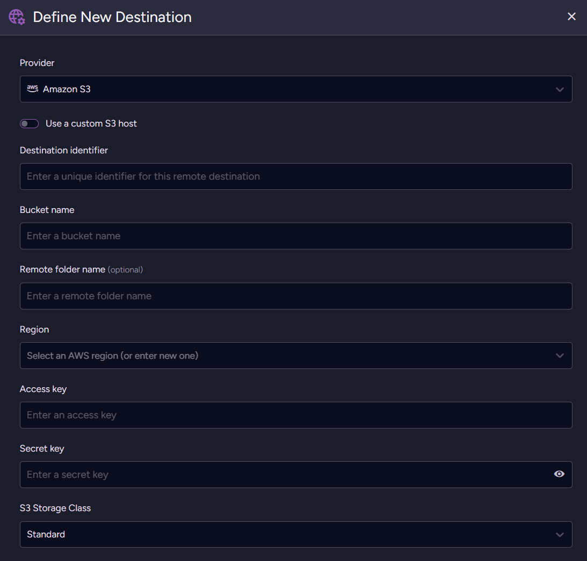
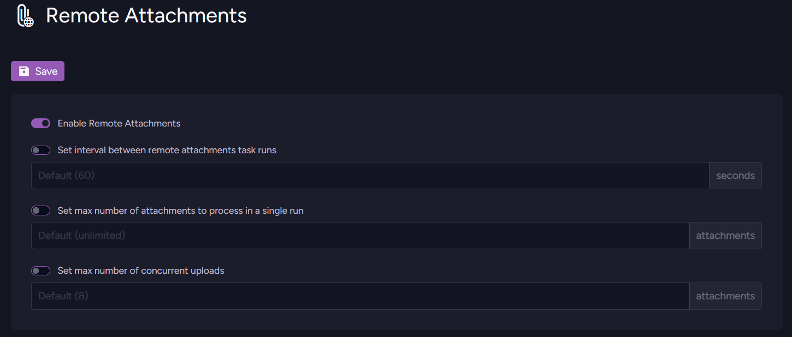
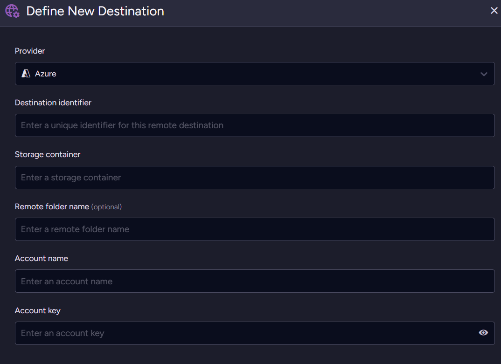
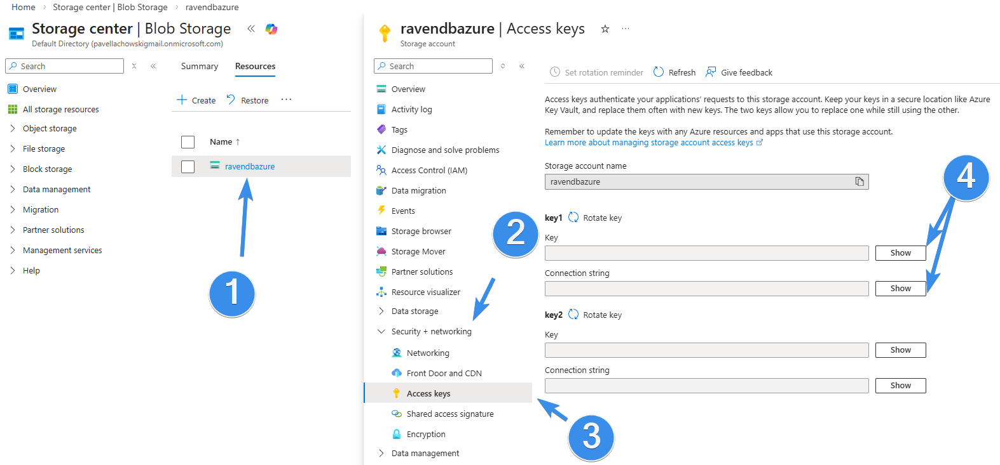
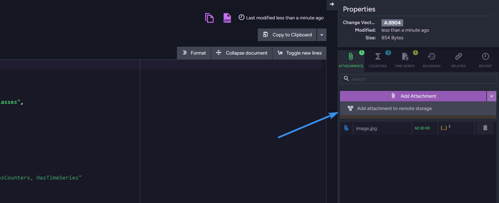
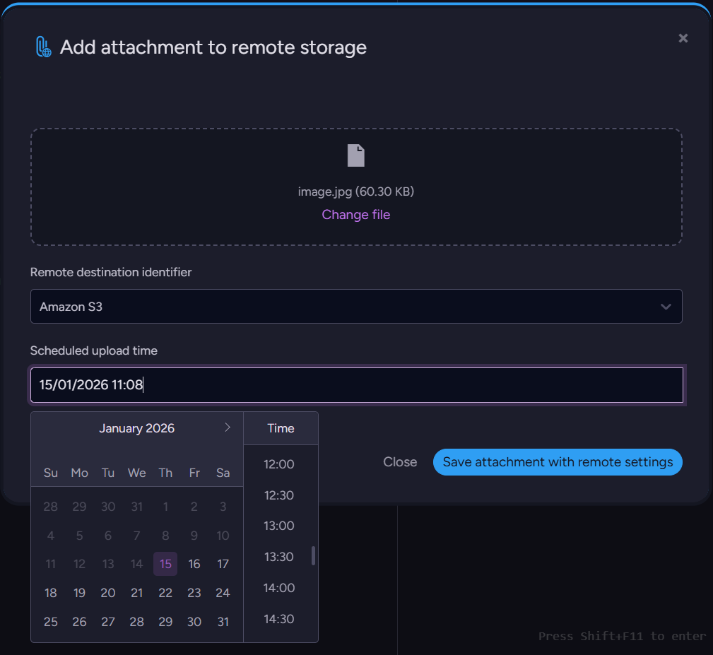
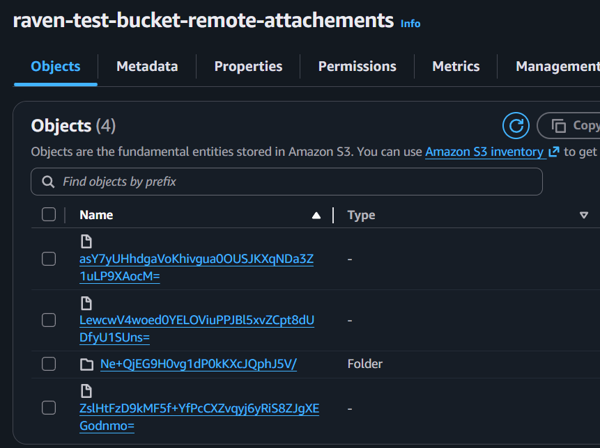

import Admonition from '@theme/Admonition';
import Tabs from '@theme/Tabs';
import TabItem from '@theme/TabItem';
import CodeBlock from '@theme/CodeBlock';
import LanguageSwitcher from "@site/src/components/LanguageSwitcher";
import LanguageContent from "@site/src/components/LanguageContent";

# Remote attachments

RavenDB's document [attachments](https://docs.ravendb.net/7.2/document-extensions/attachments/overview/) let you store any file with the corresponding document. No matter if it's a PDF, a video, an image, or something completely different, you can still keep it with the rest of the document, stored as bytes. The only problem is that some attachments can be large and numerous, while your storage space may be limited. 

There’s a simple solution \- you might want to store binary files at some cloud object storage, but transporting your data with custom scripts creates operational risk and adds another point of failure, not to mention implementation and maintenance costs.  
      
That's why remote attachments exist: an easy way to add and store attachments in the cloud storage service. In this guide, we will discuss how to add and utilize remote attachments. Let’s dive into the topic and learn how to utilize them with maximum efficiency.

## Attachments overall

Let’s start with Voron \- RavenDB’s storage engine. Locally, when you store your attachment, Voron turns it into a single binary stream \- we only know where the file starts and how long it is. This allows the database to store any attachment, regardless of data type. This concept may seem basic, but that's what makes it work. What makes it awesome is the optimization part of the Voron itself, but the concept is easy to grasp, and it follows RavenDB’s attachment design principle: they are meant to be easy to understand and easy to use.

## Why use remote attachments

Remote attachments let you store large attachment data in external cloud storage instead of inside the database. This keeps your database small and fast, even when working with heavy files. Attachments are stored in your **own** cloud account (Azure Blob Storage, Amazon S3, or S3-compatible storage).

From the application’s perspective, nothing changes. Attachments are accessed exactly the same way as before. The only difference is that the binary data lives outside the database. Existing attachments can be moved to remote storage without schema changes or application rewrites.

RavenDB handles the entire process for you: uploads, retries, consistency, and monitoring. There are no custom scripts, no fragile migrations, and no application changes required. Let’s discover various destinations and describe how we can leverage them.

#### Cold storage

When data that is rarely accessed, but must be kept for long periods of time, e.g. invoices, medical documentation, or legal documents, you typically don’t need to access them immediately, as fast as possible. For those documents, we want to use cost-effective storage options, such as Glacier Instant or Glacier Deep Archive for AWS S3. What’s the difference between those classes?

<Admonition type="note" title="Azure Blob">  
S3 storage class can be configured in Studio, but if you want to configure Azure Blob storage behaviour you will need to do it yourself in Azure settings.  
</Admonition>

Main differences between types of storage that we need to take into account are costs and retrieval time. Glacier Deep Archive can take time to retrieve an attachment, while Instant will bring it in a moment. So is Instant better? The difference is in price, as Deep Archive is cheaper per GB of data we retrieve. But are remote attachments only good for cold storage?

#### Latency-sensitive Data

Not at all. If you select another class, like Standard or Intelligent-Tiering, you can easily store and retrieve data in a much more rapid manner. If you have a situation that needs fast retrievals, like product images or PDFs used repeatedly, you may prefer to select S3 Standard class.

<Admonition type="note" title="">  
Currently for this feature (RavenDB 7.2.0) Azure Blob, Amazon S3, and any S3-compatible services are supported. In this guide, we assume you already have your S3 or Blob.  
</Admonition>

### Setup in studio

To pick a destination for your attachments, we first need to prepare a connection string. Open your database, open the Settings tab, and then the Remote Attachments settings.



#### Amazon S3

Configuration is straightforward. Pick the provider and enter a Destination identifier (your new Destination's unique name). Then we can go to AWS S3 and grab the needed information for the connection. First, enter the bucket you selected when creating S3, then select the remote folder (if needed) and the region that you can check on top right. Then go into IAM and create/enter your role with access key and secret key. 

If you want to learn more about role creation in AWS’s IAM please refer to [documentation](https://docs.aws.amazon.com/IAM/latest/UserGuide/id_roles_create.html).

Next we need to choose S3 Storage class. Those classes affect how your S3 will behave and how storage services will be priced, as we spoke before. Depending on your needs, you might choose from different classes, which can be divided into four basic ones and then further subdivided. Those four are:

* For frequent access, e.g. S3 Standard  
* For occasional access, e.g. S3 Standard-IA  
* For rare access, e.g. S3 Glacier Instant Retrieval  
* Unpredictable/auto e.g. S3 Intelligent-Tiering

If you want to learn more about them, you should look [here](https://docs.aws.amazon.com/AmazonS3/latest/userguide/storage-class-intro.html). After choosing a class, you can Test credentials and then Apply Configuration. Then you switch on Remote Attachements and you are ready to add documents. 



#### Azure Blob

Azure Blob Storage doesn’t have a class, so the setup is even simpler. You can just configure object storage itself on Azure’s page; from our perspective, you just connect and go.



To connect your Azure you need to go into your Security settings and into Access key. There you can copy both the Account name (Storage account name) and Account key. Then you just go to your Containers tab and create a new container. Copy the Account name, account key, and fill in the storage container name. Then just select name for the destination and save. After enabling Remote Attachements we are ready to add attachments. 



### Setup from code

If you prefer to configure your destination using code, you can do that easily. You can do that like this.

```csharp
var s3Settings = new RemoteAttachmentsS3Settings
{
    BucketName = "your-bucket-name",
    AwsAccessKey = "your-amazon-access-key",
    AwsSecretKey = "your-amazon-secret-key",
    AwsRegionName = "eu-north-1",
    RemoteFolderName = "attachments" //optional
};

var configuration = new RemoteAttachmentsConfiguration
{
    Destinations = new Dictionary<string, RemoteAttachmentsDestinationConfiguration>
    {
        {
            "amazon-s3",
            new RemoteAttachmentsDestinationConfiguration
            {
                S3Settings = s3Settings,
                Disabled = false
            }
        }
    },

    Disabled = false,
    CheckFrequencyInSec = 600,
    MaxItemsToProcess = 25,
    ConcurrentUploads = 6
};

await store.Maintenance.SendAsync(
    new ConfigureRemoteAttachmentsOperation(configuration)
);

```

Or alternatively, for Azure, you can do this like this.

```csharp
var azureSettings = new RemoteAttachmentsAzureSettings
{
    StorageContainer = "your-container-name",
    AccountName = "your-account-name",
    AccountKey = "your-account-key",
    RemoteFolderName = "attachments" // Optional
};

var configuration = new RemoteAttachmentsConfiguration
{
    Destinations = new Dictionary<string, RemoteAttachmentsDestinationConfiguration>
    {
        {
            "azure-blob",
            new RemoteAttachmentsDestinationConfiguration
            {
                AzureSettings = azureSettings,
                Disabled = false
            }
        }
    },

    Disabled = false,
    CheckFrequencyInSec = 600,
    MaxItemsToProcess = 25,
    ConcurrentUploads = 6
};

await store.Maintenance.SendAsync(
    new ConfigureRemoteAttachmentsOperation(configuration)
);
```

### Add remote attachment \- Studio

Once we are configured up let’s add a new remote attachment to a document. Enter your document you want to add attachment to and then select the attachments tab under the properties window. There, you want to click the arrow on the right to reveal ‘Add attachment to remote storage’



Just add the file, select the destination you want to use, and set the time it is supposed to be moved to the destination. After saving, your attachment is added locally and will be transported to your remote storage when the scheduled time comes.



### Add remote attachment \- Code

Adding remote attachments from code is nearly as easy as adding regular attachments. You can use such code:

```csharp
using (var asyncSession = store.OpenAsyncSession())
{
    var product = new Product
    {
        Name = "Nord-Ost Matjeshering",
        Supplier = "suppliers/13-A",
        Category = "categories/8-A",
        QuantityPerUnit = "10 - 200 g glasses",
        PricePerUnit = 25.89m,
        UnitsInStock = 13,
        UnitsOnOrder = 10
    };

    await asyncSession.StoreAsync(product, "products/1999");

    var attachmentPath = @"C:\temp\image1.png";
    var attachmentName = "image1.png";

    var remoteParameters = new RemoteAttachmentParameters(
        identifier: "amazon-s3",
        at: DateTime.UtcNow.AddDays(1));

    using (var stream = File.Open(attachmentPath, FileMode.Open, FileAccess.Read))
    {
        var storeParameters = new StoreAttachmentParameters(attachmentName, stream)
        {
            RemoteParameters = remoteParameters,
            ContentType = "image/png"
        };

        asyncSession.Advanced.Attachments.Store("products/999", storeParameters);

        await asyncSession.SaveChangesAsync();
    }
}
```

Or alternatively, if you want to add an attachment to an already existing document, you can use an operation like this: 

```csharp
var attachmentPath = @"C:\temp\image1.png";

await using (var stream = new FileStream(
    attachmentPath, FileMode.Open, FileAccess.Read, FileShare.Read, bufferSize: 4096, useAsync: true))
{
    var documentId = "products/999";
    var attachmentName = "image1.png";

    var remoteParameters = new RemoteAttachmentParameters(
        identifier: "my-amazon-storage",
        at: DateTime.UtcNow.AddDays(1));

    var storeParams = new StoreAttachmentParameters(attachmentName, stream)
    {
        RemoteParameters = remoteParameters,
        ContentType = "image/png"
    };

    var operation = new PutAttachmentOperation(documentId, storeParams);

    var result = await store.Operations.SendAsync(operation);
}
```

As you can see the attachments were automatically offloaded to our S3 bucket:



### Moving all Local Attachments to Remote

When moving to remote storage, you would probably also want to move old attachments. To do that we can use [patch operation](https://docs.ravendb.net/7.2/client-api/operations/patching/set-based#updating-all-documents):

```csharp
from @all_docs
update
{
    if (this["@metadata"]["@attachments"] == null)
        return;

    const now = new Date();
    const formattedDate = now
        .toISOString()
        .replace('Z', '0000');

    for (let attachment of this["@metadata"]["@attachments"]) {
        if (attachment.RemoteParameters != null)
            continue;

        attachments(this, attachment.Name)
            .remote('my-amazon-storage', formattedDate);
    }
}
```

After this script is executed, all attachments will be scheduled to be offloaded into the target destination.

Interested in RavenDB? Grab the developer license dedicated for testing under this link [here](https://ravendb.net/dev), or get a free cloud database [here](https://ravendb.net/cloud). If you have questions about this feature, or want to hang out and talk with the RavenDB team, join our Discord Community Server \- invitation link is [here](https://discord.com/invite/ravendb).