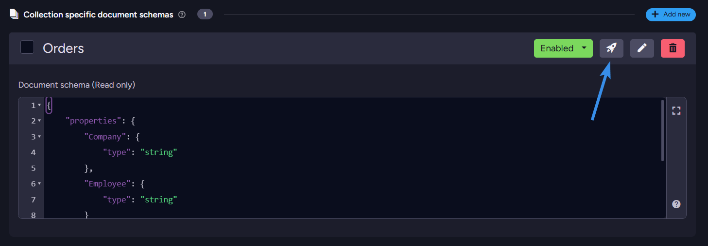
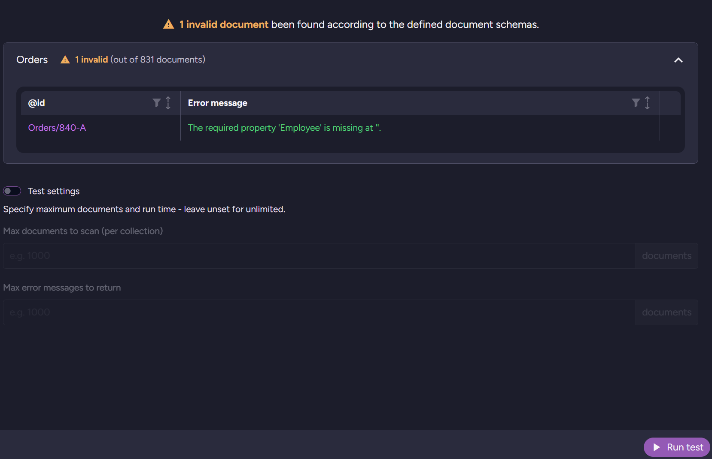
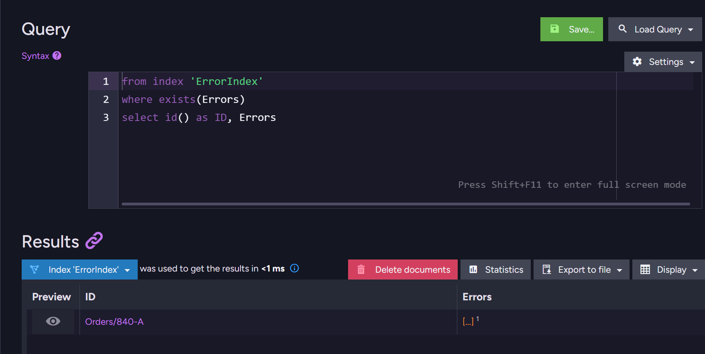
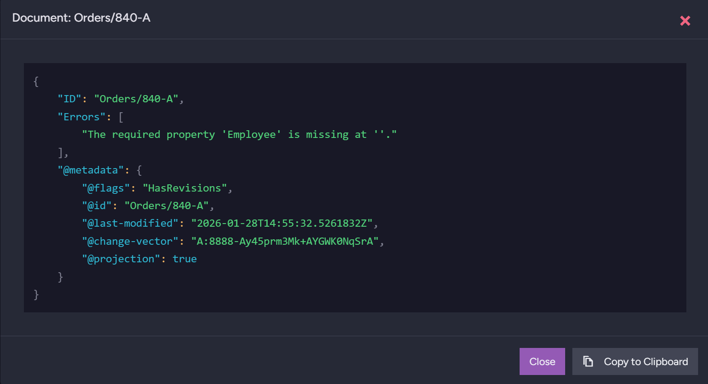
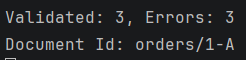
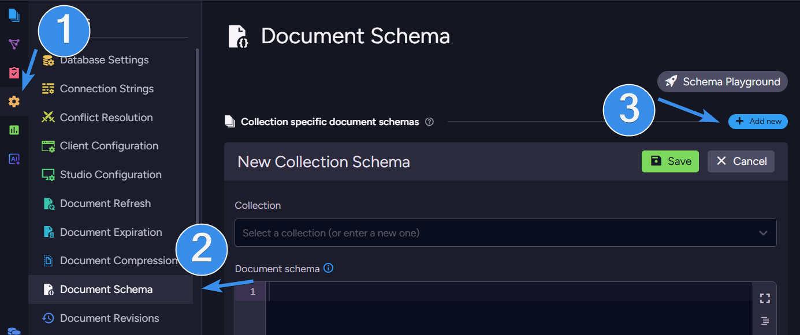
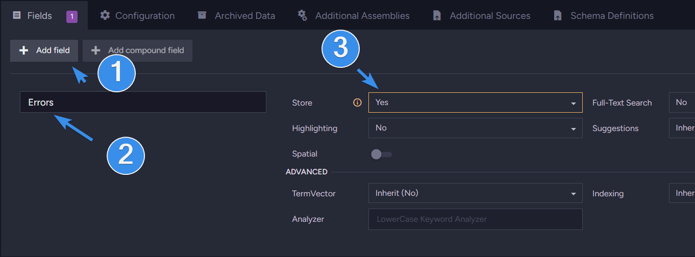
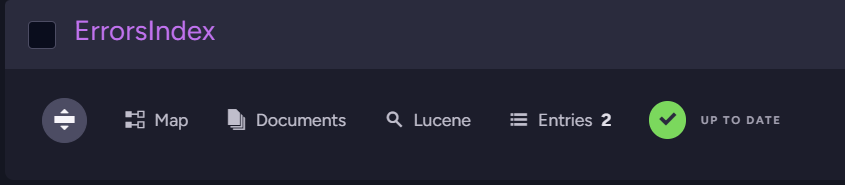
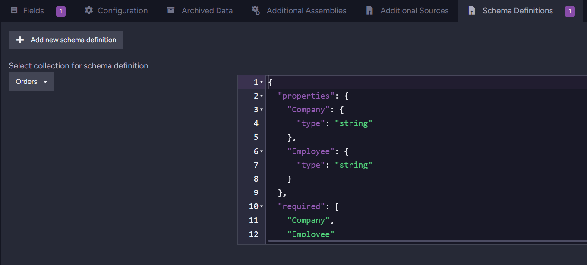

import Admonition from '@theme/Admonition';
import Tabs from '@theme/Tabs';
import TabItem from '@theme/TabItem';
import CodeBlock from '@theme/CodeBlock';
import LanguageSwitcher from "@site/src/components/LanguageSwitcher";
import LanguageContent from "@site/src/components/LanguageContent";

# Guide: Schema validation

When working with any type of data, things usually go smoothly when a single team owns the entire system. When an organisation adds new teams that work on the same data, it can quickly become a mess without proper governance. You may find yourself being frustrated that the other team is saving as a string what breaks your system from time to time.  Data must be tracked, and dataset version changes must be enforced precisely. You need to keep the same data model between all documents. Thankfully, we now have a tool to handle those situation and you don’t need to prepare for the worst by preparing boundaries. This tool is a schema validation.

Schema validation ensures your documents conform to the defined data model. Whether you need a single check after a model change or migration, or to run it continuously, RavenDB’s JSON schema validation keeps your data model predictable and consistent, even in the era of rapid development, increasing trust in your data across multiple teams. 

## Why use it?

Your team just doesn’t have time to prepare for all possible errors caused by a random string that was put in a place where you would typically expect an integer. Schema validation allows you to easily standardise data across the entire database, making collaboration with other teams easier. 

You can also use schema validation after migration or for general big data changes. You can just run schema validation and check all the documents. Just create a schema, validate it in schema validation, and run the process to avoid stress if everything transfers without data corruption.

On the other hand, if you can pick a more restricted way and block non-fitting documents. It reduces the manual work you'll need later and shortens planning time for possibilities you don’t want. 

But how does it work in RavenDB? Let’s look into it.

## How it works in RavenDB

Mode 1: Non-blocking validation  
You define a schema and validate documents occasionally using an audit operation, or rely on an index that collects schema errors. Neither approach blocks writes. Audit operations check documents when you execute them. The index-based approach also allows all documents, matching or not, to be stored, and simply records any issues for later querying.

Mode 2: Strict validation  
You enable schema validation on every write. In this mode, RavenDB blocks any document that does not match the schema, ensuring that only valid data is accepted.

These two modes give you flexibility: you can use schema validation as a diagnostic tool that never interferes with writes, or enforce it strictly to guarantee schema correctness at all times.  
It gives you a guarantee that no invalid document will make it into the database. 

The best thing is that you don’t need to write any line of code to define how the database should react to finding schema errors. If any issues are found with your documents, you will receive a clear response with documents ID and the exact reason they failed to verify against the schema.

## Quick usage from Studio

### Audit Operation

About the modes we mentioned, we can divide the audit operation into two modes. One works automatically, and the other requires you to manually trigger it. When schema validation is enabled, RavenDB will check all modified documents after enabling it. There is few different triggers for schema validation, and those are:

* Inserting documents via session and via bulk insert.  
* Inserting documents via patch by query  
* Reverting revisions  
* Importing database  
* RavenDB ETL task

If the schema is triggered, it will block the document from being stored and return an error. 

If you want to input only a few documents or use schema validation as a one-time scan, you can disable schema validation while leaving global schema validation enabled. You can also trigger a collection-wide scan to test all documents, not just new ones. We will use a basic schema to scan if all our Orders have the Company and Employee fields. Click on the testing button and then on the bottom-right corner, press run test. It will return all errors in the table.



As you can see, one of our orders is missing the Employee field.

### Index

Once your schema is ready, we can also create an index to store all documents that do not fit the schema in one place. With index, prepared you can just query your documents:



And after clicking eye icon in preview you can learn more information about this document.



## How to use it with code?

### Audit Operation

Of course, we can do the same checks with code. We can run a quick scan of all documents from code. To do that, we can use such code.

```csharp
var parameters = new StartSchemaValidationOperation.Parameters
{
    SchemaDefinition = schemaDefinition,
    Collection = "Orders",
    MaxErrorMessages = 10
};
var operation = await store.Maintenance.SendAsync(
        new StartSchemaValidationOperation(parameters));

var result = await operation.WaitForCompletionAsync<ValidateSchemaResult>(TimeSpan.FromMinutes(1));

Console.WriteLine($"Validated: {result.ValidatedCount}, Errors: {result.ErrorCount}");
foreach (var error in result.Errors)
{
    Console.WriteLine($"Document Id: {error.Key}");
    foreach (var line in error.Value.Split(new[] { '\n' }, StringSplitOptions.RemoveEmptyEntries))
    {
        Console.WriteLine($"Error: {line}");
    }
}
```

After that, we get a response like this.  


### Index

Of course, querying from code is an option too; you just need to prepare the required index beforehand. To query such an index, you can usea  script like this one:

```csharp
using (var session = store.OpenAsyncSession())
{
  var results = await session.Query<IndexResult>("Orders_WithValidation")
      .Select(x => new
      {
          Id = RavenQuery.Metadata(x)["Id"] as string,
          Errors = x.Errors
      })
      .ToListAsync();

  foreach (var doc in results)
  {
      if (doc != null && doc.Errors is { Length: > 0 })
      {
          foreach (var error in doc.Errors)
              Console.WriteLine($"{doc.Id}  {error}");
      }
      else
      {
          Console.WriteLine("No errors or no document.");
      }
  }
}
```

How do you create such index? Can we make it from code? Let’s get into configuration. 

## Configure it from studio

### Audit Operation

To configure schema validation in Studio, first enter the database you want to set it for, then navigate to Settings \> Document Schema. Add a new schema. This gives us two fields. One to select the collection and another to write our schema in.



After you selected collection, you can proceed to write your schema. Schemas are built using [JSON Schema](https://json-schema.org/), a popular vocabulary for JSON files. Basic schema on orders collection can look like this:

```json
{
    "properties": {
        "Company": {
            "type": "string"
        },
        "Employee": {
            "type": "string"
        }
    },
    "required": [
        "Company",
        "Employee"
    ]
}
```

This schema is simple. What it does is define the fields Company and Employee must exist, and they both need to be string. Let’s consider something a bit bigger. For example:

```json
{
  "additionalProperties": true,

  "properties": {
    "Company": {
      "type": "string"
    },

    "Freight": {
      "type": "number",
      "minimum": 0
    },

    "Lines": {
      "type": "array",
      "items": {
        "type": "object",
        "additionalProperties": true,
        "properties": {
          "Product": { "type": "string" },
          "Quantity": { "type": "integer", "minimum": 1 },
          "PricePerUnit": { "type": "number" },
          "Discount": { "type": "number", "minimum": 0, "maximum": 1 }
        },
        "required": ["Product", "Quantity", "PricePerUnit"]
      }
    },

    "OrderedAt": {
      "type": "string",
      "pattern": "^\\d{4}-\\d{2}-\\d{2}T\\d{2}:\\d{2}:\\d{2}\\.\\d{7}$"
    },

    "RequireAt": {
      "type": "string",
      "pattern": "^\\d{4}-\\d{2}-\\d{2}T\\d{2}:\\d{2}:\\d{2}\\.\\d{7}$"
    },

    "ShipTo": {
      "type": "object",
      "additionalProperties": true,
      "properties": {
        "City":    { "type": "string" },
        "Country": { "type": "string" },
        "Line1":   { "type": "string" },
        "Line2":   { "type": ["string", "null"] }
      }
    },

    "ShipVia": {
      "type": "string"
    },

    "ShippedAt": {
      "type": ["string", "null"],
      "pattern": "^\\d{4}-\\d{2}-\\d{2}T\\d{2}:\\d{2}:\\d{2}\\.\\d{7}$"
    }
  },

  "required": [
    "Company",
    "Freight",
    "Lines",
    "OrderedAt",
    "RequireAt",
    "ShipTo",
    "ShipVia"
  ]
}
```

There are many different properties that full list of constants is available [here](https://docs.ravendb.net/documents/schema-validation/write-validation/write-validation_api#available-constraints). Now what it checks is not only if the Company and Employee fields are ther,e but also if Freight is a number, Lines with nested fields, and more. To make it even more strict, we can enforce additionalProperties false to tell the schema to catch any writes for documents that have any additional field other than those present in the schema.

### Index

Now, let’s create an index that will use this schema. As mentioned before, the difference is that it doesn't block our writes; it just logs errors to the database. It runs continuously in the background, picking errors for you on any files that get indexed.

We can do that using our existing schemas. If you skipped creating a schema, you can look above or use the code. Let’s create an index that will capture errors. The index itself is easy.

```csharp
from doc in docs
let errors = Schema.GetErrorsFor(doc)
where errors != null && errors.Length > 0
select new 
{
    Id = doc.Id,
    Errors = errors
}
```

We need to add Errors to stored values. We can easily do that in the fields section.



If you want to make this index to only gather errors from one collection, change the first line to:

```
from doc in docs.ChosenCollection //change ChosenCollection to your collection
```

We can save the index, and if we have any documents not matching the schema in database, we can notice they are added to the index.



### Dedicated index schema

Because our schema is enabled, writes will be blocked. But we can create an index that does not require enabling the schema. We switch to a different section on the same bar where we were selecting Fields to add the Errors field, and switch to Schema Definitions. There, we can write a definition dedicated to this index.

In there, we select our desired collection and input our schema.



After saving it if you didn’t do it before, you can delete or disable the schema in the **database** setting. Now let’s do this from code.

## Configure it from code

### Audit Operation

All we need to configure it from code is define our schema, enable global validation, and then enable our new schema. First, we prepare the schema. We will use this long one. We do it by creating a variable containing our schema.

```csharp
var schemaJson = @"{
  ""additionalProperties"": true,

  ""properties"": {
    ""Company"": {
      ""type"": ""string""
    },

    ""Freight"": {
      ""type"": ""number"",
      ""minimum"": 0
    },

    ""Lines"": {
      ""type"": ""array"",
      ""items"": {
        ""type"": ""object"",
        ""additionalProperties"": true,
        ""properties"": {
          ""Product"": { ""type"": ""string"" },
          ""Quantity"": { ""type"": ""integer"", ""minimum"": 1 },
          ""PricePerUnit"": { ""type"": ""number"" },
          ""Discount"": { ""type"": ""number"", ""minimum"": 0, ""maximum"": 1 }
        },
        ""required"": [""Product"", ""Quantity"", ""PricePerUnit""]
      }
    },

    ""OrderedAt"": {
      ""type"": ""string"",
      ""pattern"": ""^\\d{4}-\\d{2}-\\d{2}T\\d{2}:\\d{2}:\\d{2}\\.\\d{7}$""
    },

    ""RequireAt"": {
      ""type"": ""string"",
      ""pattern"": ""^\\d{4}-\\d{2}-\\d{2}T\\d{2}:\\d{2}:\\d{2}\\.\\d{7}$""
    },

    ""ShipTo"": {
      ""type"": ""object"",
      ""additionalProperties"": true,
      ""properties"": {
        ""City"":    { ""type"": ""string"" },
        ""Country"": { ""type"": ""string"" },
        ""Line1"":   { ""type"": ""string"" },
        ""Line2"":   { ""type"": [""string"", ""null""] }
      }
    },

    ""ShipVia"": {
      ""type"": ""string""
    },

    ""ShippedAt"": {
      ""type"": [""string"", ""null""],
      ""pattern"": ""^\\d{4}-\\d{2}-\\d{2}T\\d{2}:\\d{2}:\\d{2}\\.\\d{7}$""
    }
  },

  ""required"": [
    ""Company"",
    ""Freight"",
    ""Lines"",
    ""OrderedAt"",
    ""RequireAt"",
    ""ShipTo"",
    ""ShipVia""
  ]
}";
```

Then we enable our global schema validation option and name our schema while enabling it. After that we just store our configuration.

```csharp
var configuration = new SchemaValidationConfiguration
{
   Disabled = false, // Enables global schema validation
   ValidatorsPerCollection = new Dictionary<string, SchemaDefinition>
   {
     { "Orders", new SchemaDefinition 
       { 
          Disabled = false, // Enables this schema definition
          Schema = schemaJson 
       } 
     }
   }
};

await store.Maintenance.SendAsync(new ConfigureSchemaValidationOperation(configuration));

```

If we wanted to use this only as scans we manually trigger, we would change the schema definition to enabled so it doesn’t block our documents. Full code in the end looks like this:

```csharp
var schemaJson = @"{
  ""additionalProperties"": true,

  ""properties"": {
    ""Company"": {
      ""type"": ""string""
    },

    ""Freight"": {
      ""type"": ""number"",
      ""minimum"": 0
    },

    ""Lines"": {
      ""type"": ""array"",
      ""items"": {
        ""type"": ""object"",
        ""additionalProperties"": true,
        ""properties"": {
          ""Product"": { ""type"": ""string"" },
          ""Quantity"": { ""type"": ""integer"", ""minimum"": 1 },
          ""PricePerUnit"": { ""type"": ""number"" },
          ""Discount"": { ""type"": ""number"", ""minimum"": 0, ""maximum"": 1 }
        },
        ""required"": [""Product"", ""Quantity"", ""PricePerUnit""]
      }
    },

    ""OrderedAt"": {
      ""type"": ""string"",
      ""pattern"": ""^\\d{4}-\\d{2}-\\d{2}T\\d{2}:\\d{2}:\\d{2}\\.\\d{7}$""
    },

    ""RequireAt"": {
      ""type"": ""string"",
      ""pattern"": ""^\\d{4}-\\d{2}-\\d{2}T\\d{2}:\\d{2}:\\d{2}\\.\\d{7}$""
    },

    ""ShipTo"": {
      ""type"": ""object"",
      ""additionalProperties"": true,
      ""properties"": {
        ""City"":    { ""type"": ""string"" },
        ""Country"": { ""type"": ""string"" },
        ""Line1"":   { ""type"": ""string"" },
        ""Line2"":   { ""type"": [""string"", ""null""] }
      }
    },

    ""ShipVia"": {
      ""type"": ""string""
    },

    ""ShippedAt"": {
      ""type"": [""string"", ""null""],
      ""pattern"": ""^\\d{4}-\\d{2}-\\d{2}T\\d{2}:\\d{2}:\\d{2}\\.\\d{7}$""
    }
  },

  ""required"": [
    ""Company"",
    ""Freight"",
    ""Lines"",
    ""OrderedAt"",
    ""RequireAt"",
    ""ShipTo"",
    ""ShipVia""
  ]
}";

var configuration = new SchemaValidationConfiguration
{
   Disabled = false, // Enables global schema validation
   ValidatorsPerCollection = new Dictionary<string, SchemaDefinition>
   {
     { "Orders", new SchemaDefinition 
       { 
          Disabled = false, // Enables this schema definition
          Schema = schemaJson 
       } 
     }
   }
};

await store.Maintenance.SendAsync(new ConfigureSchemaValidationOperation(configuration));
```

### Index

After making a schema, we can also make an index from code. We start by defining our schema and index map. Nex,t we connect the schema to a specific collection. We are still using the same example so orders collection. We will use a simple short schema here.

```csharp
 string schemaDefinition = @"{
""type"": ""object"",
""properties"": {
   ""Company"": { ""type"": ""string"" },
   ""Employee"": { ""type"": ""string"" },
},
""required"": [""Company"", ""Employee""],
""additionalProperties"": true
}";
    var schemaDefinitions = new IndexSchemaDefinitions
    {
        { "Orders", schemaDefinition }
    };

    const string OrdersValidationMap = @"
    from doc in docs
    let errors = Schema.GetErrorsFor(doc)
    where errors != null && errors.Length > 0
    select new 
    {
        Id = doc.Id,
        Errors = errors
    }
    ";
```

If you just want to create an index that gathers errors from the existing running schemas, you can create a standard index using the same map. Then, combine those parts into a single index and add Errors to its storage option.

```csharp
   var indexDefinition = new IndexDefinition
    {
        Name = "Orders_WithValidation",
        Maps = { OrdersValidationMap },
        SchemaDefinitions = schemaDefinitions,
        Fields = new Dictionary<string, IndexFieldOptions>
        {
            { "Errors", new IndexFieldOptions { Storage = FieldStorage.Yes } }
        },
        Type = IndexType.Map
    };

    var store = GetDocumentStore();

    await store.Maintenance.SendAsync(new PutIndexesOperation(indexDefinition));

    await Indexes.WaitForIndexingAsync(store);
}

public class IndexResult
{
    public string[] Errors { get; set; }
}
```

This code creates an index with dedicated index schema validation, allowing you to write even incorrect documents while still allowing you to query it. All of that from code, making it quicker to set up on multiple devices instead of going into the studio on each of them.

Interested in RavenDB? Grab the developer license dedicated for testing under this link [here](https://ravendb.net/dev), or get a free cloud database [here](https://ravendb.net/cloud). If you have questions about this feature, or want to hang out and talk with the RavenDB team, join our Discord Community Server \- invitation link is [here](https://discord.com/invite/ravendb).
