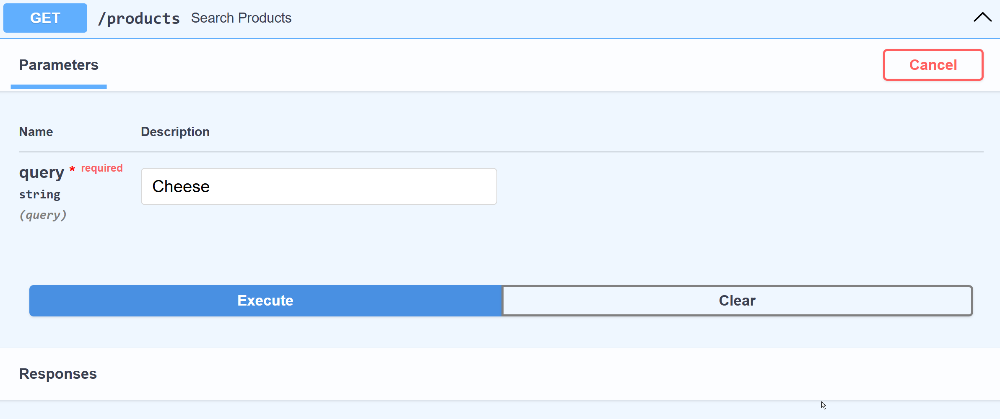
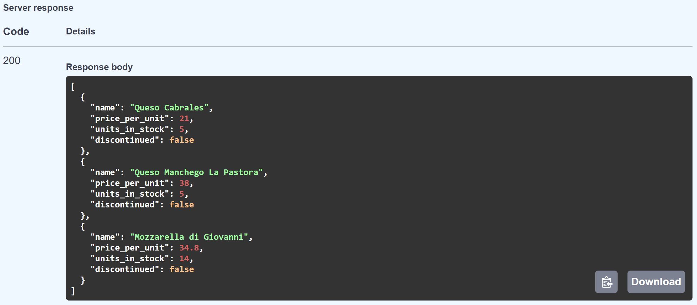
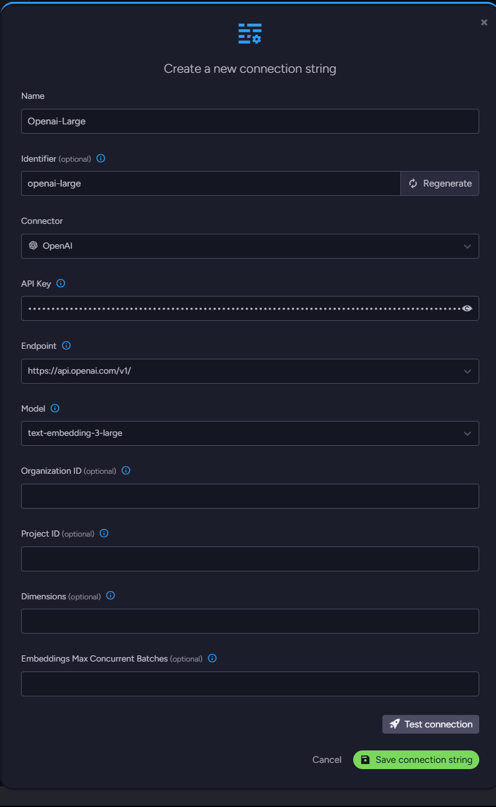
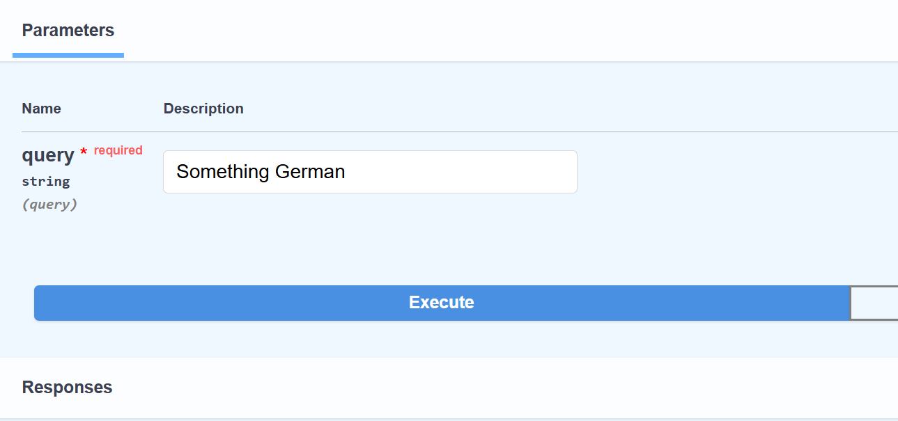
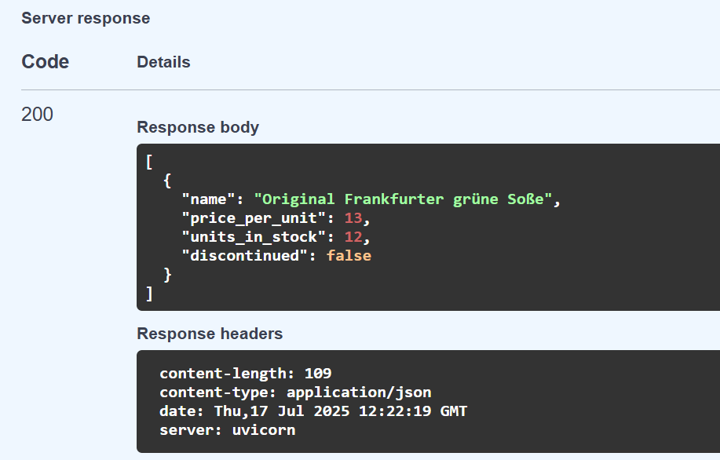
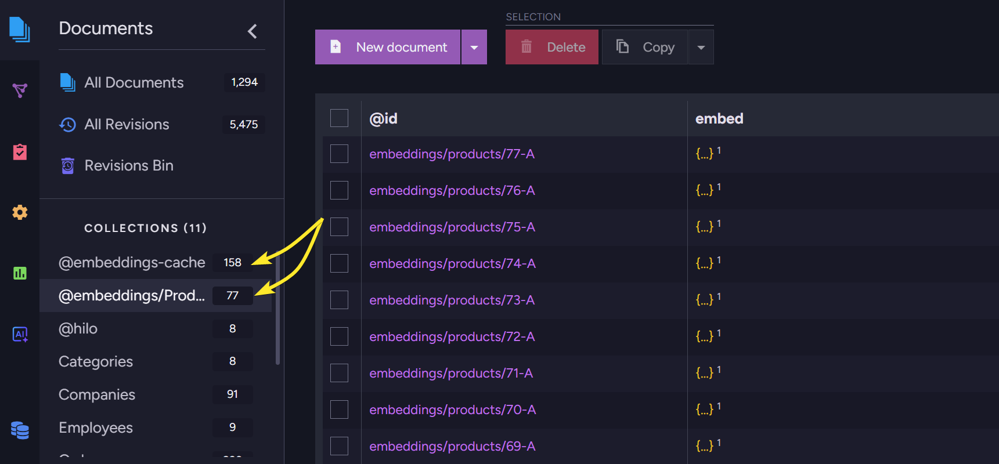

import Admonition from '@theme/Admonition';
import Tabs from '@theme/Tabs';
import TabItem from '@theme/TabItem';
import CodeBlock from '@theme/CodeBlock';
import LanguageSwitcher from "@site/src/components/LanguageSwitcher";
import LanguageContent from "@site/src/components/LanguageContent";

# Semantic Search with RavenDB, Python, and FastAPI

## Introduction

Semantic search is a more intuitive way for your users to find the content they need. They do not need to look for specific keywords but search by meaning. If you want to enhance your users' experience, it will simplify finding the content your users are looking for. 

To achieve this, your data needs to be vectorized into AI model embeddings, as they are a digital representation of the meaning of your data within a specific model.

To reduce data logistics and the amount of code to be written and maintained, RavenDB offers automatic embedding generation. If you don’t need another custom solution for that and want to ship faster, this is the way. Automatic embedding generation with RavenDB handles your data logistics out of the box, simplifying app development.

In this article, we will create a sample FastAPI application to show you how vector search works. We will implement both *manual* and *automatic* embedding generation.

## Setup

### Application

Using FastAPI, we can quickly build a web AI search endpoint to demonstrate how semantic search works. We’ll use a built-in OpenAPI interface to picture that.

See, we query for “Cheese” and we get all kinds of cheese products from our database:




Under the hood, the application translates our query term “Cheese” to an embedding (vector) on the fly and compares other vectors within the database, finding the closest “meanings”. Let’s show how to build that.

Without the query implementation, our application looks like this:

```
from fastapi import FastAPI
from pydantic import BaseModel
from ravendb import DocumentStore

app = FastAPI()

# RavenDB setup
document_store = DocumentStore(
    urls=["http://127.0.0.1:8080"],
    database="Northwind"
)
document_store.initialize()

# Northwind Product schema
class Product(BaseModel):
    name: str
    supplier: str
    category: str
    quantity_per_unit: str
    price_per_unit: float
    units_in_stock: int
    units_on_order: int
    discontinued: bool
    reorder_level: int


@app.get("/products")
async def search_products(query: str):
    ...

if __name__ == "__main__":
    import uvicorn
    uvicorn.run("app:app", host="127.0.0.1", port=8000, reload=True)
```

To make it work, we need a few Python packages:.

```
pip install fastapi
pip install uvicorn
pip install ravendb
```

- fastapi: framework library  
- uvicorn: ASGI web server  
- ravendb: Python SDK for RavenDB

This fragment sets up RavenDB. It connects to a database running on our local machine with the Northwind [sample data set](https://ravendb.net/docs/article-page/7.0/csharp/studio/database/tasks/create-sample-data).

```py
# RavenDB setup
document_store = DocumentStore(
    urls=["http://127.0.0.1:8080"],
    database="Northwind"
)
document_store.initialize()
```

Then, we create the Product class to represent the JSON document schema for documents in the Products collection of the [“Northwind”](https://ravendb.net/docs/studio/database/tasks/create-sample-data) database. This allows us to work with Product documents as objects.

```
# Northwind Product schema
class Product(BaseModel):
    name: str
    supplier: str
    category: str
    quantity_per_unit: str
    price_per_unit: float
    units_in_stock: int
    units_on_order: int
    discontinued: bool
    reorder_level: int
```

Next, we define endpoints to query products. We’ll add the detailed query logic once we have embeddings set up.

```
@app.get("/products")
async def search_products(query: str):
    ...
```

The last step is to use [Uvicorn](https://www.uvicorn.org/) to launch this app. It handles your web requests, allowing them to reach our application. Uvicorn serves as a simple bridge between the network and your application.

```
if __name__ == "__main__":
    import uvicorn
    uvicorn.run("app:app", host="127.0.0.1", port=8000, reload=True)
```

### Vector Search with manual embeddings generation

We can generate embeddings manually, but it requires more effort on our part. We need to take care of data logistics and structure, and we may still be missing some more advanced functionalities, for example, caching or chunking. Let’s show how to generate embeddings using the popular OpenAI embedding model ["text-embedding-3-small"](https://platform.openai.com/docs/guides/embeddings).

```
import openai

def get_embedding(text: str) -> list[float]:
    response = openai.embeddings.create(input=text, model="text-embedding-3-small")
    return response.data[0].embedding

# Example usage
embedding = get_embedding("Example product name")
```

We need to install and use the *openai* Python package. This allows us to interact with AI models from OpenAI. Next, we generate embeddings with `get_embedding` for the entire Products collection. Then we put the vector in the vector\_embedding field. We will query all Products, add the field `vector_embedding`, and then call `save_changes`.

```
with document_store.open_session() as session:
    products = list(session.query(object_type=Product))
    for product in products:
        product_name_embedding = get_embedding(product.name)
        product.vector_embedding = product_name_embedding
    session.save_changes()
```

Note: The Northwind database is relatively small, allowing us to query and update the documents directly. However, for larger datasets, you’d need to explore a more effective strategy. If that’s your case, see how to use automatic embeddings generation later in this article.

Products now have an embedding field, allowing us to run RavenDB Vector Search. But to compare vectors, we also need an embedding vector for the query search term. We use the same function to generate embeddings for incoming search terms on the fly using the same method (`get_embedding`).

```
query_embedding = get_embedding("search term")

with document_store.open_session() as session:
    results = list(
        session.query(object_type=Product)
        .vector_search("vector_embedding", query_embedding, minimum_similarity=0.75)
        .take(10)
    )

    return [
            {
                "name": p.name,
                "price_per_unit": p.price_per_unit,
                "units_in_stock": p.units_in_stock,
                "discontinued": p.discontinued,
            }
            for p in results
        ]

```

This gives us results not based on an exact match but on semantic meaning.

This way we need to:

1. Vectorize our entire Products dataset with OpenAI manually  
2. Put vector embeddings in the separate document fields  
3. Vectorize the query terms manually on the fly   
4. Compare the search term embedding vector with other vectors from the Products collection using RavenDB Vector Search.

… and we still lack features like caching repetitive search terms and text chunking.

### Vector search with automatic embeddings

Now, let’s try automatic embeddings generation in RavenDB. The code will be the same as starting one, but reduced by manual communication with OpenAI. We just need to add the embeddings generation in RavenDB Studio. 

Adding automatic embeddings generation starts in the AI Hub. We will automate the communication with the external AI model. To do so, we need to define which model we want to use.

### AI Connection String

Create a new [AI connection string](https://ravendb.net/docs/ai-integration/connection-strings/connection-strings-overview) in RavenDB Studio:  

Define your custom name and identifier and pick the service you want to use; we chose OpenAI. Then, in the new fields, select the endpoint & model, and paste your API key. Other fields are optional and not currently relevant to us.

You can test the connection to ensure everything works properly.

### AI Task

We can connect to the OpenAI model, but we need to create a task that generates embeddings. Go back to the AI Hub and choose ‘AI Tasks’. Create a new embeddings generation task and fill in its name and identifier. Select our new connection string. We select the ‘Products’ collection and type ‘Name’ for a path just beneath the collection. Just save it, and it’s ready.

  
Look how easy and short it is. Using RavenDB, we don’t need to worry about adding new fields; query logic is already thinner, and all connections to AI are already handled without the need for additional stuff.

### Application code

All the required parts for your own embeddings generation and adding the field can be removed, making the code smaller.

```
from fastapi import FastAPI
from pydantic import BaseModel
from ravendb import DocumentStore

# RavenDB setup
document_store = DocumentStore(
    urls=["http://127.0.0.1:8080"],
    database="Northwind"
)
document_store.initialize()

# Northwind Product schema based on your example
class Product(BaseModel):
    name: str
    supplier: str
    category: str
    quantity_per_unit: str
    price_per_unit: float
    units_in_stock: int
    units_on_order: int
    discontinued: bool
    reorder_level: int

@app.get("/products")
async def search_products(query: str):
    with document_store.open_session() as session:
        results = list(session.query(object_type=Product).vector_search_text_using_task("Name", query, "my-ai-task", minimum_similarity=0.7))

        return [
            {
                "name": p.name,
                "price_per_unit": p.price_per_unit,
                "units_in_stock": p.units_in_stock,
                "discontinued": p.discontinued,
            }
            for p in results
        ]

if __name__ == "__main__":
    import uvicorn
    uvicorn.run("app:app", host="127.0.0.1", port=8000, reload=True)
```

Look how easy and short it is. Using RavenDB, we don’t need to worry about adding new fields; the query endpoint logic is already more straightforward, and connection to the AI model is already handled without the need for additional stuff.

This way we get:

1. Out-of-the-box embeddings for your collection  
2. Out-of-the-box embeddings for query terms  
3. Caching without the need to write it  
4. Ability to change the model without the need to rewire the connection 

Works perfectly:

  


In the studio, RavenDB created a separate collection for embeddings and cached terms:  


Everything’s working on its own, and our semantic search can be delivered much quicker.

## Summary

Now that you know how to handle Vector Search with RavenDB, you may have some cool projects to share\! In this case, we would like to invite you to our Discord \- RavenDB Developers Community. Check it out [here](https://discord.com/invite/ravendb).
