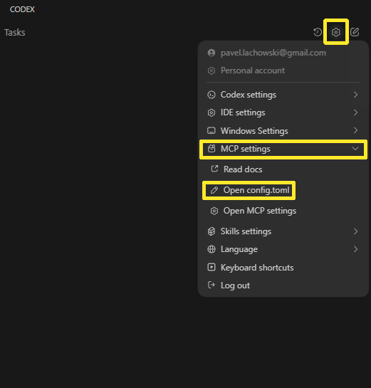
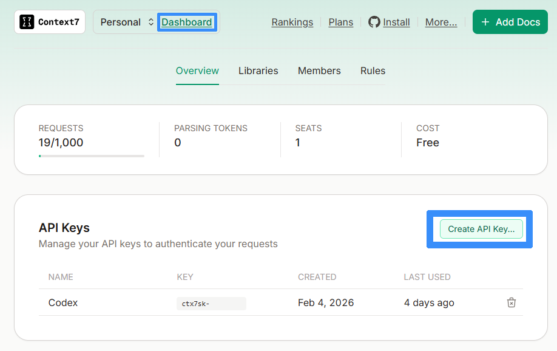
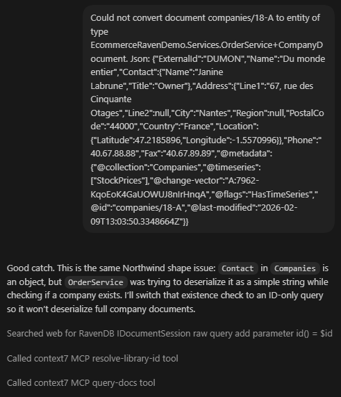
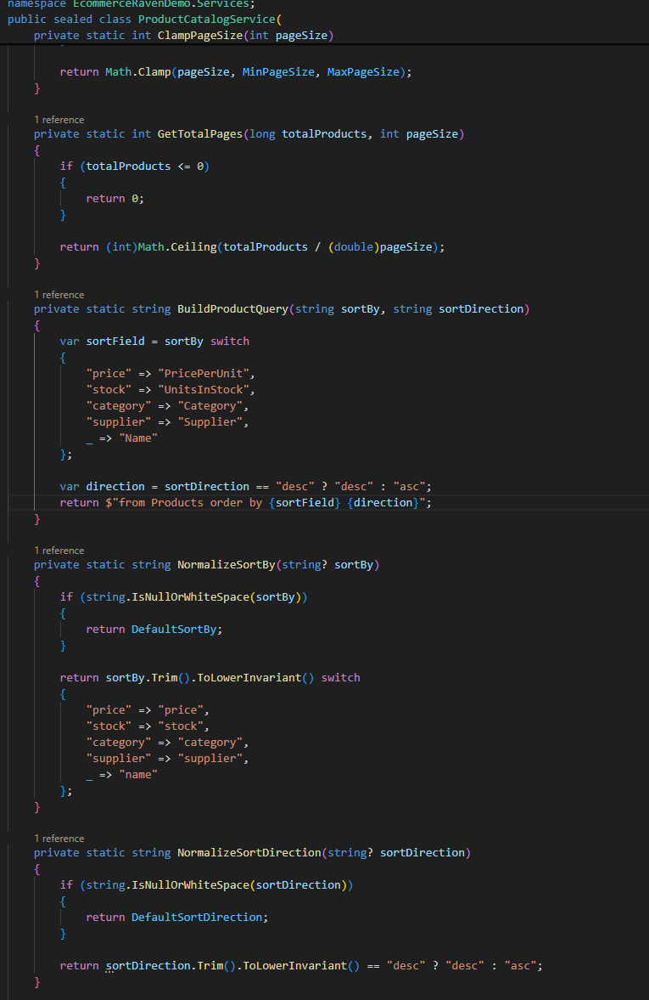
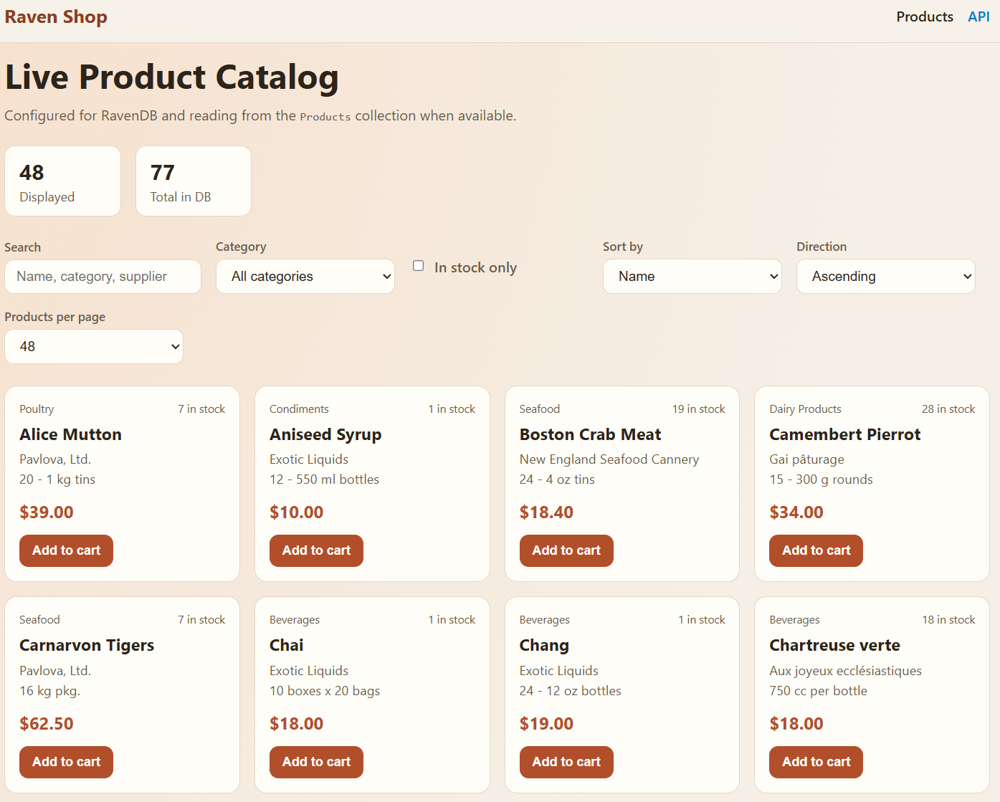
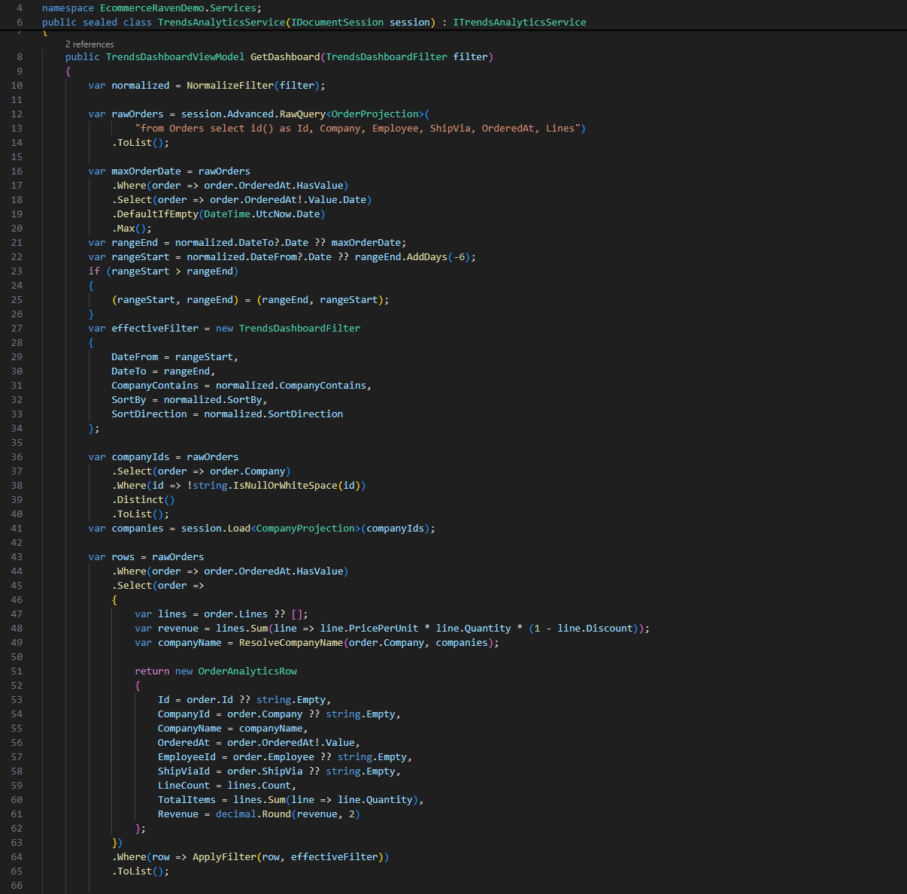
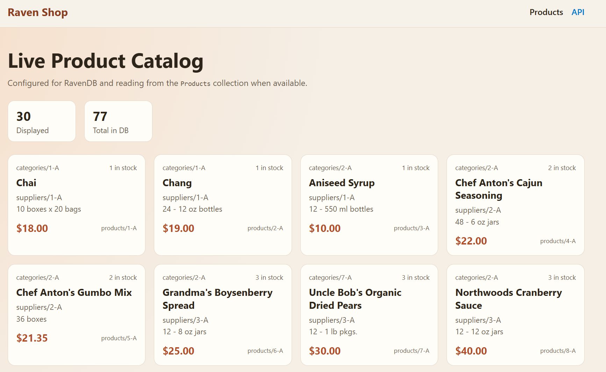
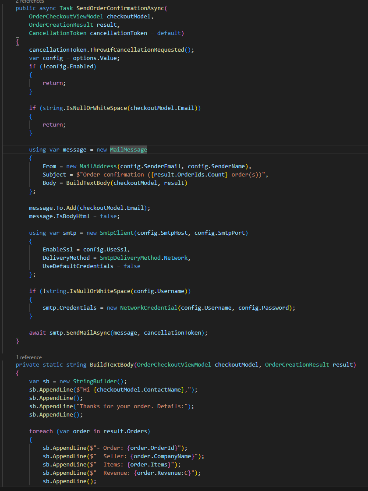
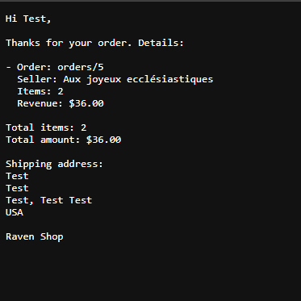

import Admonition from '@theme/Admonition';
import Tabs from '@theme/Tabs';
import TabItem from '@theme/TabItem';
import CodeBlock from '@theme/CodeBlock';
import LanguageSwitcher from "@site/src/components/LanguageSwitcher";
import LanguageContent from "@site/src/components/LanguageContent";

# Vibe coding with RavenDB and Context7

As AI tools become more capable, so-called “vibe coding” becomes a practical option in certain situations. It can be especially useful for fast PoC development and prototyping. When treated as just another tool in our toolbox, it fits naturally into a modern workflow. One of its strongest advantages is lowering the barrier to entry for technologies you are not yet comfortable with. With AI assistance, you can quickly prototype an idea and evaluate whether a chosen technology is appropriate before committing more time to it.

Overall, AI has improved steadily over time. Models are faster and can handle more context; they have become a standard to provide web search access to find missing information. Many of these LLMs can now be integrated into the IDE, helping you stay focused on the code rather than constantly switching applications. In most cases, this makes work faster and smoother, and the user enters a flow state.

That said, it is not always the case. Sometimes, when working with various technologies, the model can’t find specific information on the web about how precisely the particular app building block works. 

This forces you to step outside the IDE to provide additional context, which interrupts your immersion in work just to find information for your AI that was supposed to help you. 

But needing to do it yourself isn’t the worst part. The worst part is that you just used a lot of tokens and populated the context with unnecessary data. At that point, a question appears. Does it have to work this way?

## Can we make that happen?

This leads to a natural question. Could these interruptions be reduced? If AI had access to up-to-date technology-specific context, it could spend fewer tokens and time searching and more time assisting. That would not eliminate all problems, but it could make AI-assisted development smoother and more reliable. To help with that, you can use tools such as Context7, which supports you and your LLM during coding.

Context7 is an MCP (Model Context Protocol) server that provides your AI coding assistant with documentation from official sources, such as RavenDB docs, without requiring you or LLM to search for it. It’s like a shortcut that provides AI with context without using more tokens than necessary. When you ask the assistant to check something in Context7, you stay within your workflow, and AI goes straight to trusted sources. Staying in IDE reduces context switching and keeps your focus where it’s needed, on writing and understanding code. At the same time, an LLM generates high-quality code in comparison with the time needed for that task. But how do we set up such an MCP in our IDE?

## Setup

To show how to connect our Context7, we will use:

* Visual Studio Code  
* OpenAI Codex

First, we install the Codex extension in Visual Studio Code and log in to our Codex. Next, we open the Codex’s settings menu (the cog icon) and select MCP settings \-\> Open config.toml.



Inside this file, we need to establish a connection with our MCP server. Using the Context7 documentation available [here](https://context7.com/docs/resources/all-clients#openai-codex), we copy and paste the configuration code. For Codex, it is:

```json
[mcp_servers.context7]
args = ["-y", "@upstash/context7-mcp", "--api-key", "YOUR_API_KEY"]
command = "npx"
```

Then just replace the “YOUR\_API\_KEY” argument with your Context7 API key, which you can get from your Context7 dashboard.



After saving the config and restarting the IDE, you should be able to tell your AI assistant to use Context7. Now what is left is go and check if it works for us.

## How to use it?

We can now write a standard prompt. To force AI to call Context7, we can just add it to the prompt. Using this, we will quickly prototype an e-commerce website:

- that displays products from the RavenDB database with sample data.   
- displays statistics  
- sends mail to the selected email address after making an order

And we will implement it all by iterating step by step with AI. The prompt we start with is as follows:

```
Using Context7 write backend and frontend of ecommerce website connecting with RavenDB livetest. Make it connect to database and use sample data from products collection.
```

Now we can check whether the assistant will provide the requested code and use Context7 for it. We easily check by just looking at the generated content, and we can also click on the AI tool call to see it used Context7:


As you can see, in the first Context7 was called to retrieve information about libraries. It gathered context from ravendb/docs. Of course, we don’t need to call Context7 explicitly; the AI can use it itself. We run a few more prompts to fix potential errors. While doing it, Codex takes information from Context7 itself.



As you can see, we asked AI to help with the error we received, and Codex itself called Context7. After those fixes we have a ready-to-run prototype code:



 We can run the prepared code and verify it works and looks as expected.



Fast and easy to build a working prototype without much technical knowledge. But we want more functions.

### Expanding the prototype

Let's give AI next prompt to add another function we want.

```
Create a dashboard that analyzes orders and provides basic sales insights. Include filtering options such as date range, company name, revenue, and other relevant criteria.
```

After that, we have to wait a bit and let the AI work. We check and approve changes from time to time and issue additional prompts to fix errors and iterate on functionality (e.g., design or sorting logic) until we have working code.



We can of course restart program to get changes and have a look how it presents.



What AI created gives us information about top products, which day sells best, or which company is doing best, while also counting revenue, items sold, and orders. It is satisfactory at this point. 

### Automated email support

Now last thing we want to test is sending an automated email. We prompt:

```
Add email sending. When a customer completes the order form, an email with the order details should be sent to the provided email address.
```

The assistant then generates the code with the ready logic and informs us we only need to change the required lines in the config file.



We enable email sending in config and test it using a local SMTP server; we can see the file is generated and sent. 



With an AI assistant in our hour, we have a working prototype that we can improve it further, or we can pause to consider whether we want to proceed with development using the chosen technologies.