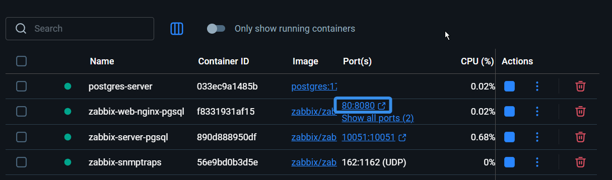
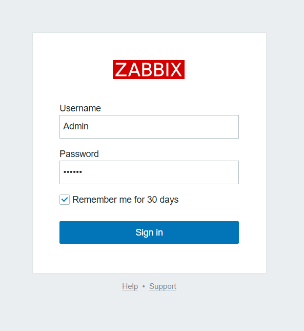
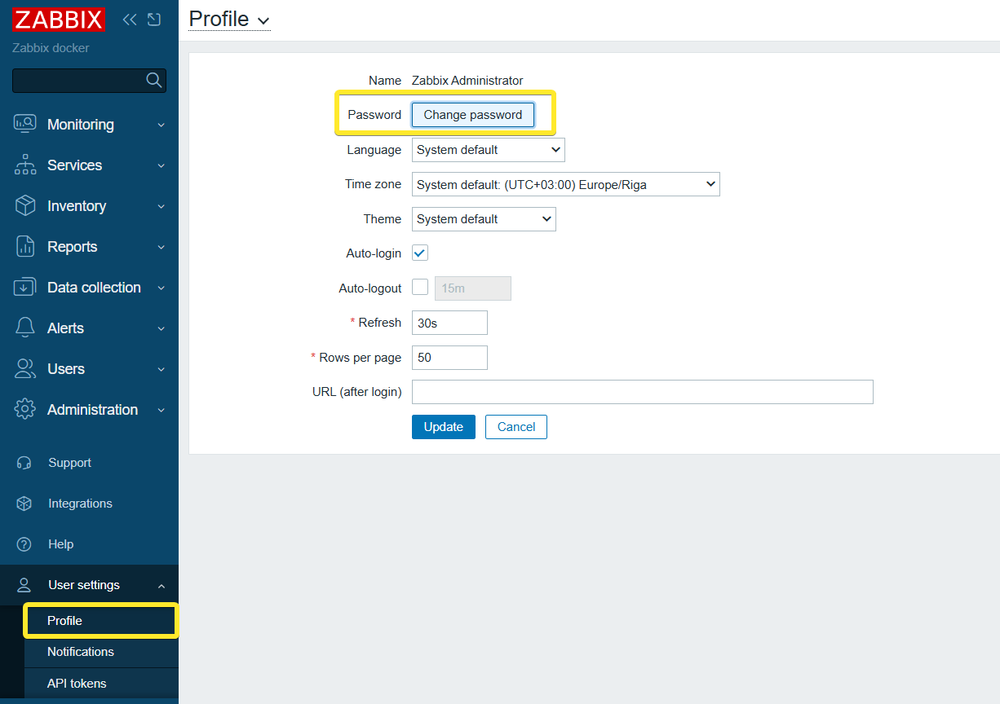
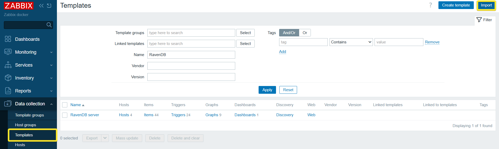
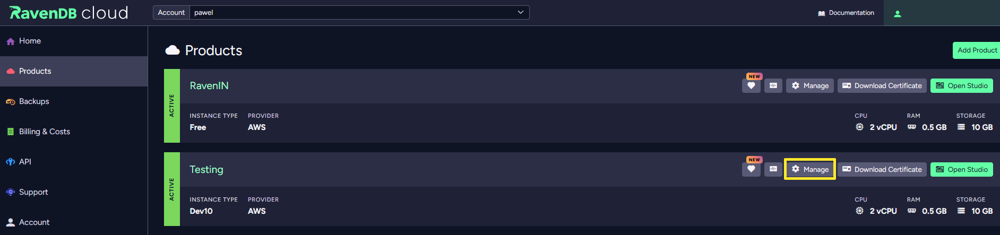
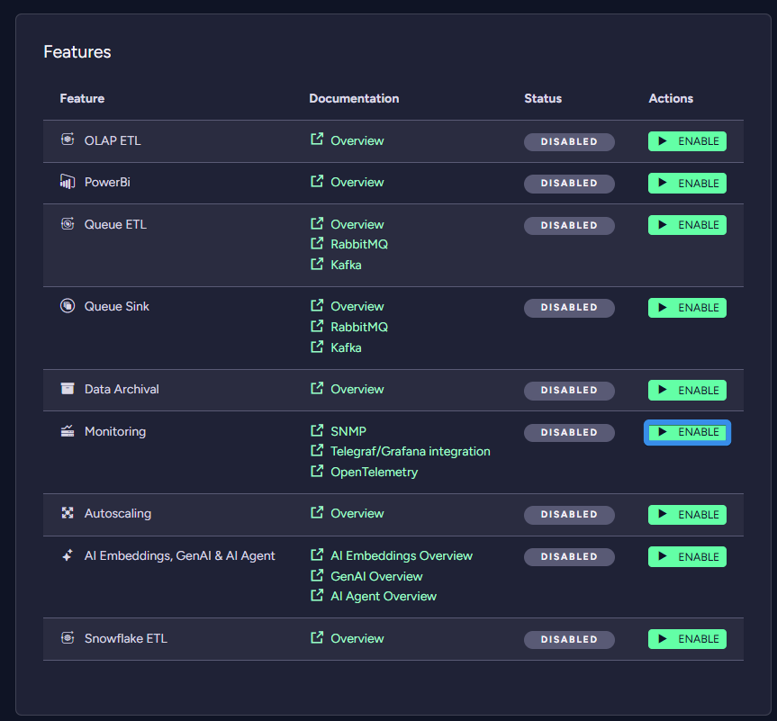
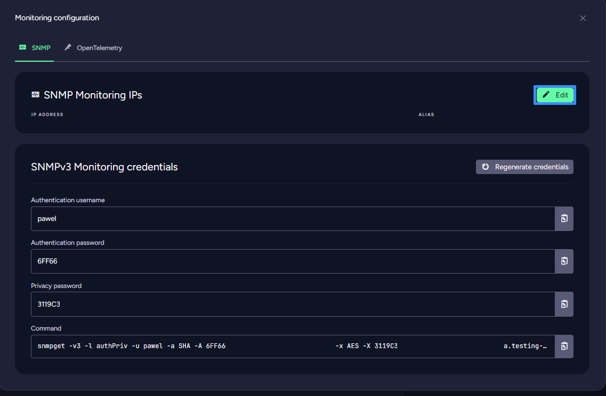
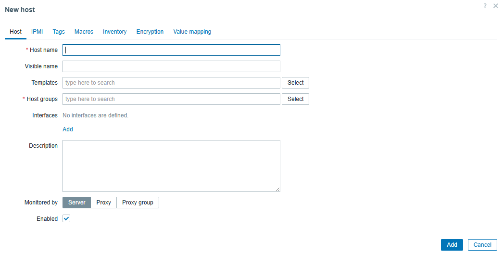
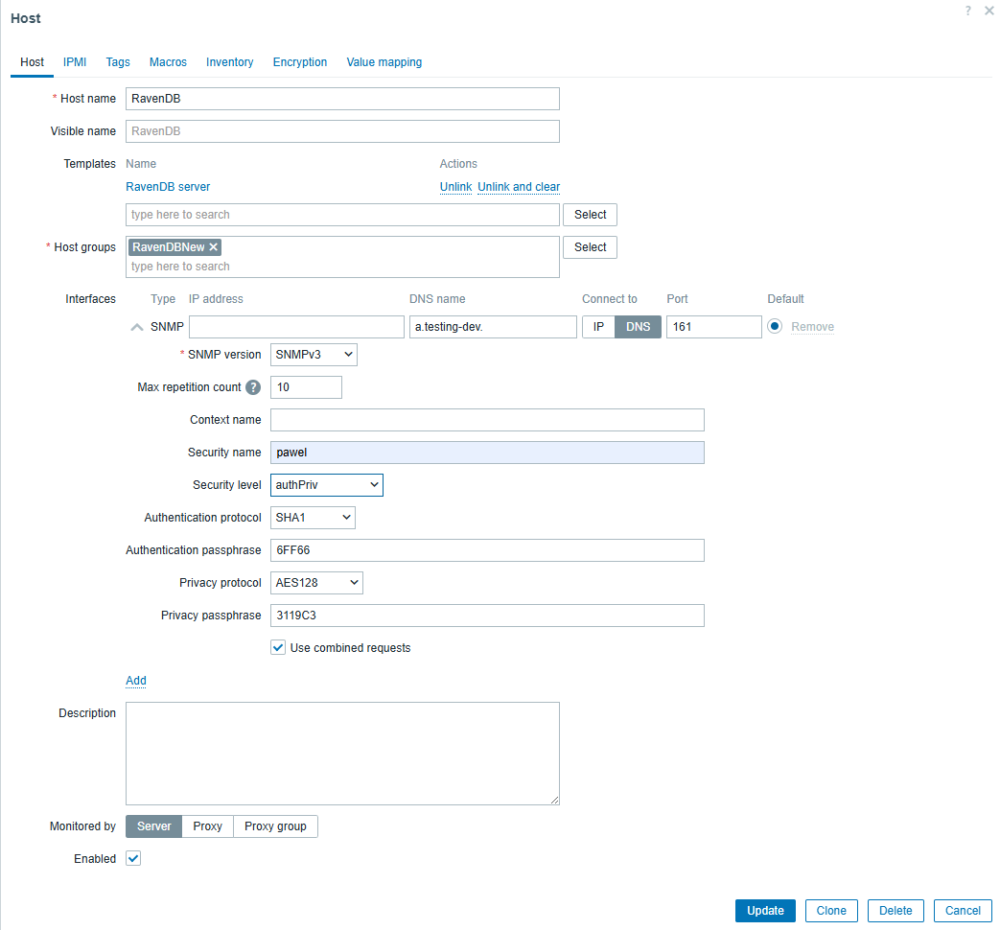
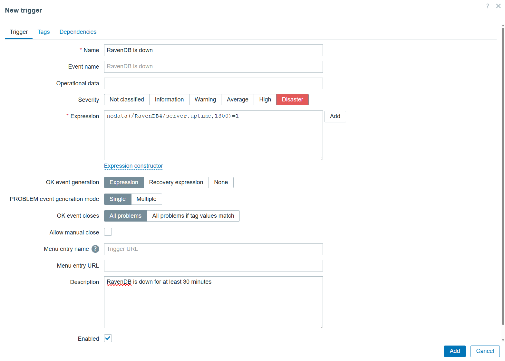

import Admonition from '@theme/Admonition';
import Tabs from '@theme/Tabs';
import TabItem from '@theme/TabItem';
import CodeBlock from '@theme/CodeBlock';
import LanguageSwitcher from "@site/src/components/LanguageSwitcher";
import LanguageContent from "@site/src/components/LanguageContent";


# Set up Zabbix Monitoring for RavenDB Cloud

After setting up RavenDB and watching data flow smoothly between your app and a database, you realize that storing information is only half the story. The other half is keeping it nice and safe. That curiosity leads to monitoring. Tools designed to keep an eye on systems, servers, and networks in real time.

To monitor your database, one option is Zabbix. It’s a handy tool that keeps an eye on your database and lets you know when something’s not quite right. It tracks performance and storage metrics, so you can spot problems early and keep everything running smoothly. Let’s see how to set it up.

<Admonition type="note" title="Prerequisites"> 

Before we start deploying Zabbix in Docker, make sure you have the following prerequisites ready.

* **Docker** installed and running on your machine (this article was tested with Docker version 28.1.1)  
* **RavenDB Cloud** instance

If you encounter any problems installing or starting Docker, refer to the [official Docker documentation](https://docs.docker.com/get-started/). RavenDB Cloud instance is available [here](https://ravendb.net/cloud). In this article, we are using Windows. Remember to change commands if needed according to your operating system.

</Admonition>
## Setup

To set it all up, we will use a few Docker commands. Docker will make it easier for us to set up everything. Let’s start by creating a dedicated network for all Zabbix components. Our Zabbix environment is made of several pieces that collect, process, and present monitoring data. The core components are: server, PostgreSQL database (stores configuration/history), Web frontend (GUI), agent (collects/forwards data)

Open your terminal and run the following command:

``` showLineNumbers
docker network create --subnet 172.20.0.0/16 --ip-range 172.20.240.0/20 zabbix-net
```

This creates an isolated Docker network named *zabbix-net*, ensuring all containers can communicate internally without interfering with other services.

Next, we want to create Zabbix containers inside Docker. We will need four containers, each setup with the command in the command prompt. 

The first container will contain a PostgreSQL server. We create it using the following command, so we can collect our data and Zabbix config files:

``` showLineNumbers
docker run --name postgres-server -t `
      -e POSTGRES_USER="zabbix" `
      -e POSTGRES_PASSWORD="zabbix_pwd" `
      -e POSTGRES_DB="zabbix" `
      --network=zabbix-net `
      --restart unless-stopped `
      -d postgres:17
```

Next, we need an SNMP trap agent to extract the logs. SNMP is a protocol we use for communication and trap notification, which our agent will receive. We also need to expose port 162 for the trap to communicate. We will use the Alpine version of the Zabbix SNMP traps container.

``` showLineNumbers
docker run --name zabbix-snmptraps -t \
  -v /zbx_instance/snmptraps:/var/lib/zabbix/snmptraps:rw \
  -v /var/lib/zabbix/mibs:/usr/share/snmp/mibs:ro \
  --network=zabbix-net \
  -p 162:1162/udp \
  --restart unless-stopped \
  -d zabbix/zabbix-snmptraps:alpine-7.4-latest
```

Then we need a Zabbix server as a main component for Zabbix logic. It will connect the previous two containers, obtain data from Zabbix traps, and store them in the PostgreSQL server.

``` showLineNumbers
docker run --name zabbix-server-pgsql -t `
      -e DB_SERVER_HOST="postgres-server" `
      -e POSTGRES_USER="zabbix" `
      -e POSTGRES_PASSWORD="zabbix_pwd" `
      -e POSTGRES_DB="zabbix" `
      -e ZBX_ENABLE_SNMP_TRAPS="true" `
      --network=zabbix-net `
      -p 10051:10051 `
      --volumes-from zabbix-snmptraps `
      --restart unless-stopped `
      -d zabbix/zabbix-server-pgsql:alpine-7.4-latest
```

   
And the last thing we need is a web interface so we can interact with this. It's added with the last container.

``` showLineNumbers
docker run --name zabbix-web-nginx-pgsql -t `
      -e ZBX_SERVER_HOST="zabbix-server-pgsql" `
      -e DB_SERVER_HOST="postgres-server" `
      -e POSTGRES_USER="zabbix" `
      -e POSTGRES_PASSWORD="zabbix_pwd" `
      -e POSTGRES_DB="zabbix" `
      --network=zabbix-net `
      -p 443:8443 `
      -p 80:8080 `
      -v /etc/ssl/nginx:/etc/ssl/nginx:ro `
      --restart unless-stopped `
      -d zabbix/zabbix-web-nginx-pgsql:alpine-7.4-latest
```

Those four containers are the whole Zabbix environment. Now we need to connect it to our RavenDB Cloud instance.

Let’s first log in to Zabbix with default credentials. You can enter webUI clicking at port next to the web container or by searching [`http://localhost:80`](http://localhost:80).



You should be greeted with sight like that:  



There, you want to input default login credentials: 

Username: Admin  
Password: zabbix

Once we log in, it’s worth changing the default credentials to something more secure. Let’s select User Settings on the left, then the profile tab and change your password.



Let’s add a RavenDB template we will use later. Templates can be downloaded from [Zabbix community github](https://github.com/zabbix/community-templates/blob/main/Databases/RavenDB/template_ravendb_server/6.0/template_ravendb_server.yaml). With the file downloaded, enter Data Collection and Templates. On the top right corner click import and select our file.



## Connecting to RavenDB

Now that we have the base for what we want to do let’s connect your RavenDB Cloud. First we need to turn on the monitoring product feature. You can do it in the Manage page of your chosen RavenDB Cloud instance.



In the product features, find the Monitoring option and enable it. We need SNMP credentials to connect with Zabbix. Just follow the configuration menu that you can open by pressing the button that will appear under where the enable button was.



Inside, you want to copy three things: authentication username, authentication password and privacy password. RavenDB is designed to be safe, so to ensure that we use SNMPv3, we use two passwords. Also, add IP you will be connecting to on top. 



Now we go back to Zabbix and click on monitoring on the left bar and hosts. Then on the top right corner of the screen, hit create host.



What you need to do here is (In brackets, you have RavenDB Cloud configuration names):

1. Add Host Name  
2. Select RavenDB server as template  
3. Select/create Host Group  
4. Add SNMP interface  
5. Add your database address in DNS and switch to DNS connection  
6. Select SNMPv3  
7. Add your security name (Authentication username)  
8. Change security level to authPriv  
9. Select SHA1 and add your Authentication passphrase (Authentication password)  
10. Select AES128 and add your Privacy passphrase (Privacy password)  
11. Save



That’s it. If done correctly, you should be able to go into the latest data, select everything, and at the bottom of the page, click execute now. After a few seconds and a refresh, you should have data in your Zabbix. You can check all monitored metrics at this page.

Let’s go to data collection and hosts. There are click triggers at your new host. You can see that we already have some triggers inside from the template. If they satisfy your needs, you are done; if not, let’s add a new one. On the top right corner of the screen, press Create Trigger.



We can add an expression in two ways. Either use the editor by pressing add or just typing it. We want to create information that will inform us that our database has been down for the last 30 minutes. Our expression will look like this.

``` showLineNumbers
nodata(/RavenDB4/server.uptime,1800)=1
```

This gives you a trigger; now, you can add an option to send a message to your email address. If you want to learn how to do it you can check Zabbix documentation [here](https://www.zabbix.com/documentation/3.4/en/manual/config/notifications/media/email). 

## Summary

Setting up monitoring data with Zabbix can be a useful tool to monitor work of your database. If you are interested in monitoring your on-premise database, you can try to use  Datadog. You can check the connection tutorial [here](https://ravendb.net/articles/leverage-ravendb-observability-with-datadog).

Interested in RavenDB? Grab the developer license dedicated to testing under this link [here](https://ravendb.net/dev) or get a free cloud database [here](https://ravendb.net/cloud). Any questions about this feature or just want to hang out and talk with the RavenDB team? Join our Discord Community Server \- invitation link is [here](https://discord.com/invite/ravendb).
