import Admonition from '@theme/Admonition';
import Panel from "@site/src/components/Panel";
import ContentFrame from "@site/src/components/ContentFrame";

# Channels: Discord bot
<Admonition type="note" title="">

* A Quill **Discord bot** [channel](../overview.mdx#channels) lets your users converse with an [agent](../overview.mdx#ai-agent)
  of your app in a direct message with a bot on Discord.  
  Users can message the bot from any Discord client, and the agent will answer from the app's data.

* The bot is created in the **Discord Developer Portal**, as part of a Discord application, free of charge.  
  The Discord Developer Portal also issues the **bot token**, a credential that Quill needs to operate the bot.  
  Quill opens the connection to Discord and receives the users' messages through this connection, so the deployment needs no
  public address or open inbound port.

* The channel is added from Quill's management dashboard, using one short form that asks you to select one of the agents you
  created and provide the bot token and an optional channel name.
   * If the selected agent has parameters, the form also asks you to settle each parameter's value.  
     You can either provide a fixed value, or take the value from the Discord user the bot is chatting with: the user's Discord
     ID or username.
   * Once the channel is added, the bot has to be invited to a Discord server your users are in.  
     A **server** is a space that Discord users join to chat with each other; a user can message a bot only if the user and
     the bot are both members of the same server.

* In this article:
   * [Prerequisites](#prerequisites)
   * [Creating a bot in the Discord Developer Portal](#creating-a-bot-in-the-discord-developer-portal)
   * [Connecting the bot to your app](#connecting-the-bot-to-your-app)
      * [Opening the Add channel menu](#opening-the-add-channel-menu)
      * [Filling in the channel form](#filling-in-the-channel-form)
      * [Finishing the connection on Discord](#finishing-the-connection-on-discord)
      * [Checking the new channel](#checking-the-new-channel)
   * [Chatting with the bot](#chatting-with-the-bot)
      * [Starting a conversation](#starting-a-conversation)
      * [Messages the bot does not answer](#messages-the-bot-does-not-answer)
   * [Binding agent parameters](#binding-agent-parameters)
      * [Choosing a source for each parameter](#choosing-a-source-for-each-parameter)
      * [Binding a parameter to a constant value](#binding-a-parameter-to-a-constant-value)
   * [Managing the channel](#managing-the-channel)
      * [Pausing and deleting the channel](#pausing-and-deleting-the-channel)
      * [Rotating the bot token](#rotating-the-bot-token)
      * [The tabs of the details view](#the-tabs-of-the-details-view)
   * [Discord bot limitations](#discord-bot-limitations)
   * [Troubleshooting](#troubleshooting)

</Admonition>

<Panel heading="Prerequisites">

Before adding a Discord bot channel, make sure you have:

* **An agent in your app.**  
  The channel is added for one of the app's agents, and this agent will answer the users who message the bot.  
  To add an agent, see [Getting started: Adding an AI agent](../getting-started/adding-an-ai-agent.mdx).
* **A Discord account.**  
  The bot is created in the Discord Developer Portal, signed in with your [Discord account](https://discord.com/register).  
  Once the channel is added, you can try the bot out from the same account.
* **A Discord server your users are in.**  
  Once the channel is added, you invite the bot to this server using a link that Quill provides, since a user can message a bot
  only if the user and the bot are both members of the same server.  
  If you have no server yet, you can [create one](https://support.discord.com/hc/en-us/articles/204849977) in any Discord client,
  free of charge.
* **Access to Discord from the machine running Quill.**  
  The only connections the bot needs are the ones Quill opens to Discord, at `discord.com` and `gateway.discord.gg`.  
  The users' messages travel to Quill over these connections too, so a deployment that cannot be reached from the internet, like
  one running on your machine, can still operate a bot.

</Panel>

<Panel heading="Creating a bot in the Discord Developer Portal">

To create the bot, open the [Discord Developer Portal](https://discord.com/developers/applications), sign in with your Discord
account, and click **New Application**.  
Discord asks for a **name** for the application, e.g., `Northwind Traders Catalog`, and creates the application together with a bot
of the same name.  
This name is the bot's username on Discord, shown in the users' chats with the bot, and Quill names the channel after the username
(unless you name the channel yourself).

Then open the application's **Bot** page, listed in the Discord Developer Portal's sidebar under **Overview**, and click
**Reset Token**: the page shows the **bot token** once.  
Copy the token: you will need to hand it to Quill in the next section,
[Connecting the bot to your app](#connecting-the-bot-to-your-app).

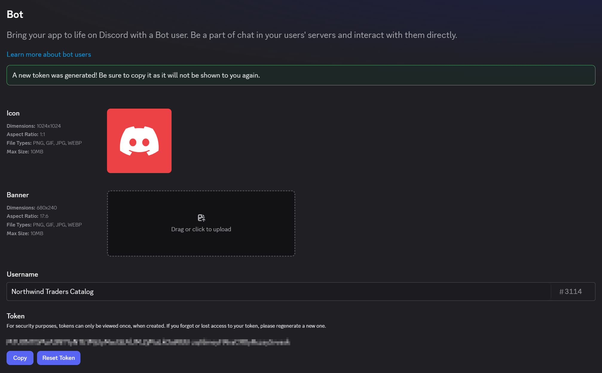

Nothing else on the Bot page needs changing. The bot reads only the direct messages sent to it, so the toggles under
**Privileged Gateway Intents** stay off, and no box under **Bot Permissions** needs ticking.

<Admonition type="warning" title="">

The bot token is a secret: anyone holding it can control the bot, read the messages users send to it, and answer in the bot's name.  
If the token ever leaks, click **Reset Token** on the Bot page and enter the new token in the channel as described in
[Rotating the bot token](#rotating-the-bot-token).

</Admonition>

</Panel>

<Panel heading="Connecting the bot to your app">

To connect the bot to the app, add a **Discord** channel for one of the app's agents.

* The channel is added in a short form that asks you to provide the bot token issued by the Discord Developer Portal, and to
  select the agent that will answer the users.
* Once the channel is added, Quill connects to Discord as the bot.  
  Then invite the bot to your server, so your users can message it.

<ContentFrame>

### Opening the Add channel menu

In Quill's management dashboard, open the app from **My apps**. The app's **Overview** holds a **Channels** section: click the
section's **Add channel** button to open the menu of channel types, and select **Discord**.

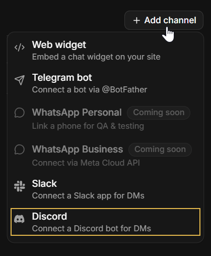

<Admonition type="info" title="">

The [Add agent wizard](../getting-started/adding-an-ai-agent.mdx#saving-the-agent) ends on an **Add a channel** stage that shows
the same Channels section, so a bot can also be connected right after its agent is created.  
The form then has no **Agent** field: the channel is added for the agent the wizard just created.

</Admonition>

</ContentFrame>

<ContentFrame>

### Filling in the channel form

Selecting **Discord** opens the **New Discord channel** form.

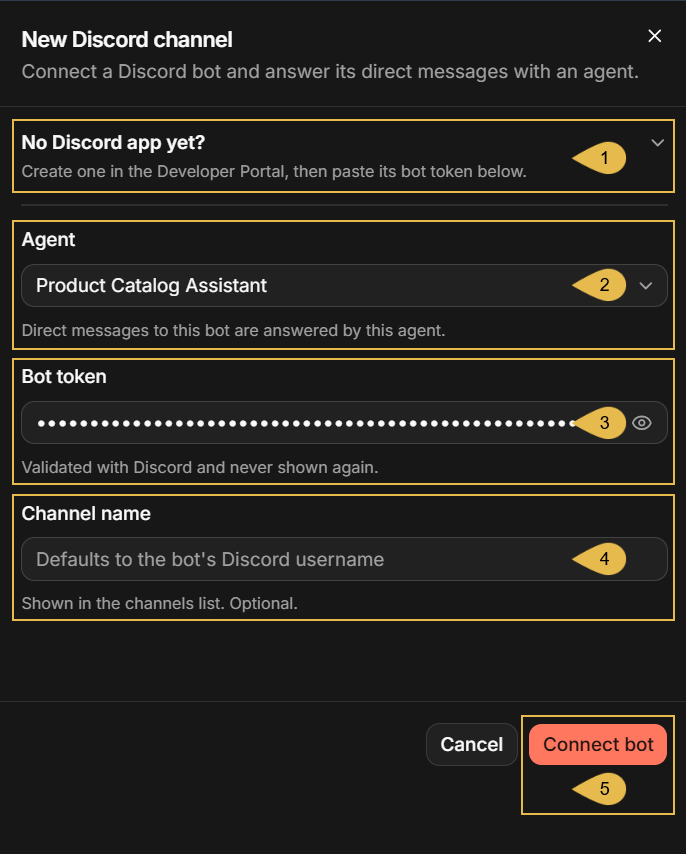

1. **No Discord app yet?**  
   Click to expand a reminder of the two Discord Developer Portal steps described in
   [Creating a bot in the Discord Developer Portal](#creating-a-bot-in-the-discord-developer-portal).
2. **Agent**  
   Select the agent that will answer the bot's users. The list holds the app's agents.

   <Admonition type="info" title="">

   When the form is opened from the **Add agent** wizard, the channel is added for the new agent and this field is absent.

   </Admonition>

3. **Bot token**  
   Paste the token you copied from the Bot page. The field shows the token as dots; click the eye icon to reveal it.  
   Quill validates the token with Discord when the channel is added, and never displays it again afterwards.
4. **Channel name** (optional)  
   If you leave this field empty, Quill will name the channel after the bot's username, e.g., `Northwind Traders Catalog`.
5. **Connect bot**  
   Click to add the channel. If Discord rejects the token, or the bot is already connected to another channel, the form will
   report the error and no channel will be added.

<Admonition type="note" title="">

When the selected agent has parameters, a **Parameters** section appears below the channel name, described in
[Binding agent parameters](#binding-agent-parameters).

</Admonition>

</ContentFrame>

<ContentFrame>

### Finishing the connection on Discord

Once the channel is added, the form is replaced by a sheet that shows the state of the bot's connection and the two steps that
remain on the Discord side:

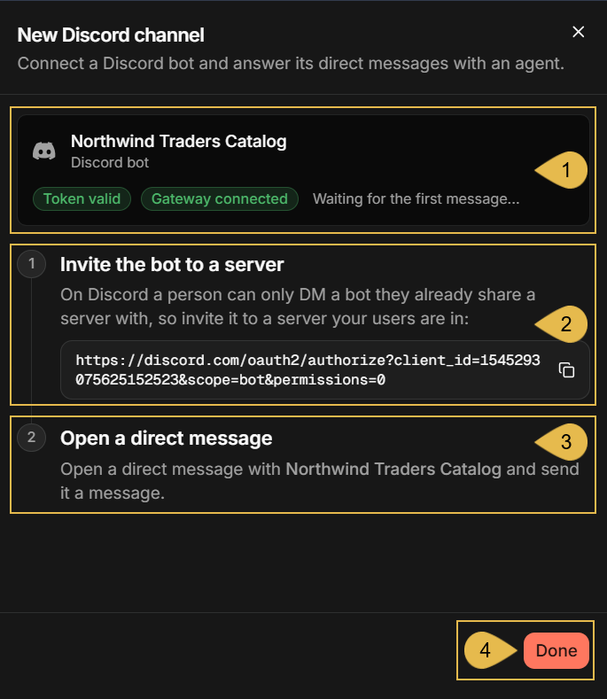

1. **Northwind Traders Catalog**  
   The bot the channel is connected to, and the state of the connection:
   * **Token valid**: Discord accepted the bot token.
   * **Gateway connected**: Quill's connection to Discord, over which the users' messages arrive, is open.
   * **Waiting for the first message...**: no user has messaged the bot yet.
2. **Invite the bot to a server**  
   The invite link for the bot.  
   Copy the link and open it in a browser: Discord asks you to select the server under **Add to server** and to authorize the
   bot, and then adds the bot to the server as a member.  
   Your users have to be members of this server to message the bot.
3. **Open a direct message**  
   The way a user reaches the bot.  
   To converse with the bot, a user opens a direct message with it: on the server, the user clicks the bot's name, in the member
   list or in a message, and then **Message** on the bot's profile card.  
   The direct message is private: the other members of the server do not see it.
4. **Done**  
   Click to close the sheet.  
   The connection state and the invite link remain available in the channel's [Connect](#the-connect-tab) tab.

</ContentFrame>

<ContentFrame>

### Checking the new channel

The new channel appears in the **Channels** section:

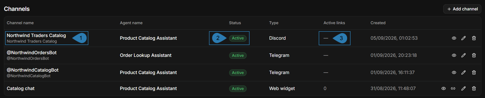

1. **Channel name**  
   The channel's name, with the bot's username beneath it.  
   In this example the name was left empty, so the channel is named after the username.
2. **Status**  
   **Active**: the channel is enabled; **Disabled**: the channel is paused.  
   Pausing and resuming a channel is described in
   [Dashboard: Channels view](../dashboard/channels-view.mdx#pausing-and-resuming-a-channel).
3. **Active links**  
   Embed links belong to web widget channels; a Discord bot channel has none, so the column shows a dash.

</ContentFrame>

</Panel>

<Panel heading="Chatting with the bot">

Once the bot is invited to your Discord server, every member of the server can message it: a user who opens a direct message with
the bot can ask questions, and the agent will answer from the app's data.  
The users need no account with Quill and no instructions. This section describes the chat as an end user experiences it, so that
you know what to expect and what to tell your users.

<ContentFrame>

### Starting a conversation

On Discord, a user opens a direct message with the bot and types a question.  
The chat captures shown in this article were taken in Discord's web client, at `discord.com`; the desktop and mobile apps present
similar screens.

<Admonition type="note" title="">

Unlike a [Telegram bot](../channels/telegram-bot.mdx#starting-a-conversation), a Discord bot needs no `/start` command: the first
message a user sends is already a question to the agent, and the bot answers it.

</Admonition>

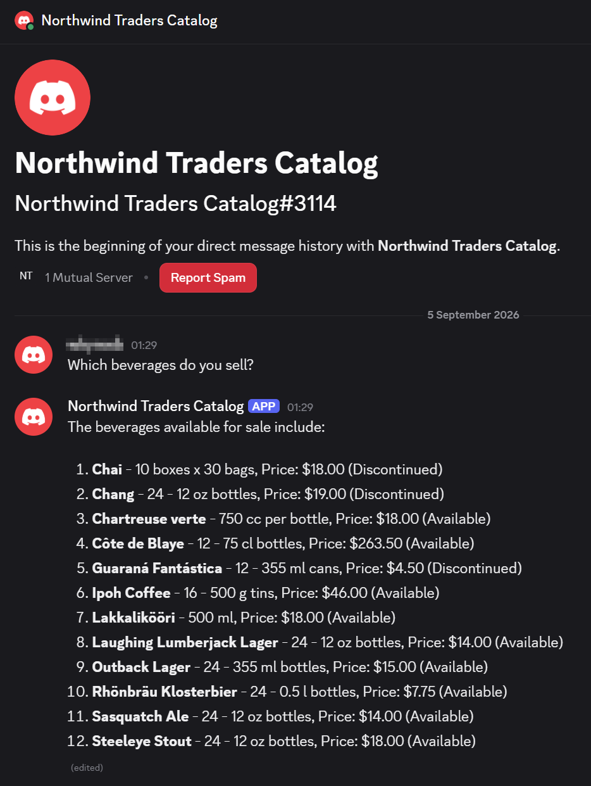

The capture above shows a first question and the bot's answer.  
The following holds for every conversation with the bot:

* **The reply is streamed into the chat as the agent composes it.**  
  The bot posts the reply and keeps updating the message until the reply is complete, which is why Discord marks the message as
  **(edited)**.
* **An answer longer than Discord's message limit is delivered in several messages.**
* **Quill keeps the conversation's context.**  
  A follow-up question like "Which of these is the cheapest?" is understood against the earlier answer.
* **Messages a user sends while the bot is still answering wait their turn.**  
  The bot answers them one by one, as long as its queue has room; see [Discord bot limitations](#discord-bot-limitations).
* **The bot recognizes no commands.**  
  Every message is handled as a question, including messages that start with `/`.
* **A conversation lasts one day at most.**  
  At midnight UTC, the next message opens a fresh conversation, with none of the earlier context.  
  A user cannot start a fresh conversation earlier.

</ContentFrame>

<ContentFrame>

### Messages the bot does not answer

The bot answers text only. A message that carries an attachment, like a photo or a file, or that has no text at all, is answered
with "I can only read text messages right now."  
The bot answers in direct messages only. A message posted in one of the server's chat rooms, such as #general, where every member
can read it, gets no reply, even if the message mentions the bot.

</ContentFrame>

</Panel>

<Panel heading="Binding agent parameters">

Some agents have **parameters**: values the agent's queries require, and that must come from the channel rather than be chosen
by the LLM. e.g., the ID of the customer whose orders the agent looks up.  
When you add a Discord bot channel for such an agent, the form asks you to bind each parameter to a source, which can be:

* A constant value that you type, which is then the same for all bot users.
* A detail of the Discord user who is messaging the bot: the user's Discord ID or username.  
  The parameter then carries a different value for each user, so that each user is answered about this user's own data.

This section describes the sources a parameter can be bound to, and shows a parameter bound to a constant value.

<ContentFrame>

### Choosing a source for each parameter

When the selected agent has parameters, the channel form presents a **Parameters** section with one row per parameter, labeled
with the parameter's name, e.g., `customerPhone`.  
In each parameter row, select where the parameter's value comes from:

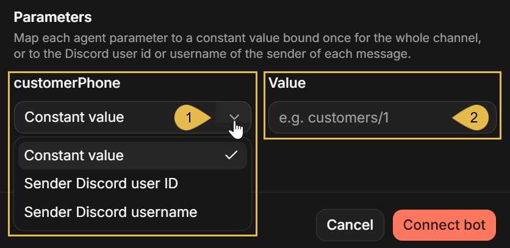

1. The parameter's source  
   Select the source from the list:
   * **Constant value**  
     A value that you type in the form. Quill will then pass this value to the agent with every message, from every user.  
     e.g., the ID of the customer whose Discord server the bot was invited to.
   * **Sender Discord user ID**  
     The numeric ID of the Discord user who sent the message.
   * **Sender Discord username**  
     The Discord username of the user who sent the message.

   The user ID and username sources tie the answers to the Discord user, and suit an app whose data holds the users' Discord IDs
   or usernames.
2. **Value**  
   The value to bind when the source is **Constant value**.

The bindings can be changed later in the channel's **Parameters** tab, described in the
[Parameters](#the-parameters-tab) tab section of Managing the channel.

</ContentFrame>

<ContentFrame>

### Binding a parameter to a constant value

In this example, the app's **Order Lookup Assistant** agent has a `customerPhone` parameter: the agent's queries find a customer's
orders by the customer's phone number.  
The bot is meant for the Discord server of a single customer, where every member belongs to this customer, so the channel binds the
parameter to a constant value: the customer's phone number. The agent then answers every user of this bot about this customer's
orders:

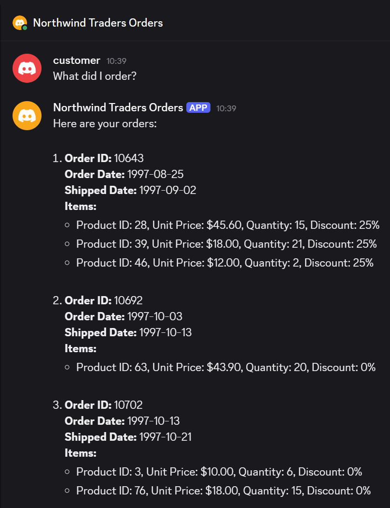

A constant value suits a channel whose users all share the value, like the bot above.

</ContentFrame>

</Panel>

<Panel heading="Managing the channel">

Once added, the channel is managed from its details view, described in
[Dashboard: Channels view](../dashboard/channels-view.mdx): the view's header carries the **Pause**/**Resume** button and the **⋮**
menu with **Edit** and **Delete**, common to every channel type, and the tabs below the header are specific to the channel type.

To open the details view, open the app from **My apps** in Quill's management dashboard, select **Channels** in the sidebar, and
click the channel's box:

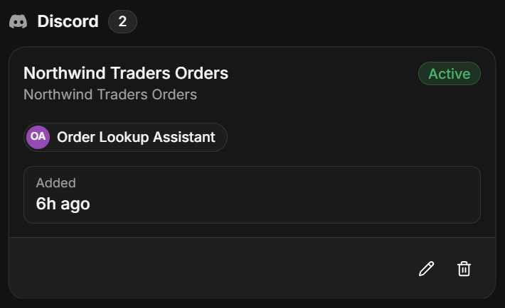

---

<ContentFrame>

### Pausing and deleting the channel

To pause or resume the channel, click **Pause**/**Resume** in the header; to delete it, select **Delete** in the header's **⋮** menu.

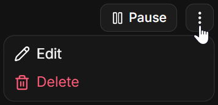

Both actions are explained in the Channels view article, in
[Pausing and resuming a channel](../dashboard/channels-view.mdx#pausing-and-resuming-a-channel) and
[Deleting a channel](../dashboard/channels-view.mdx#deleting-a-channel). Each of them also has a Discord side, explained here:

* A paused bot stops answering, and Quill closes its connection to Discord, so the bot appears offline on Discord.  
  Messages users send while the channel is paused do not reach Quill, and are not answered when the channel is resumed.
* A deleted channel stops the bot, but the bot itself remains yours in the Discord Developer Portal, and a member of your server;
  its token can be used to connect it again.

</ContentFrame>

<ContentFrame>

### Rotating the bot token

To replace the bot token, select **Edit** in the header's **⋮** menu, and rotate the token in the **Edit channel** form.  
If you reset the bot token in the Discord Developer Portal for any reason (e.g., because the existing token leaked), you have to
enter the new token here: Discord stops accepting the old token the moment a new one is issued, so the bot stops answering until the
channel holds the new token.

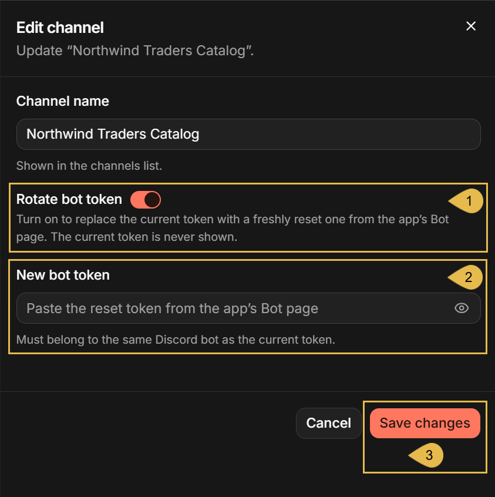

1. **Rotate bot token**  
   Turn the toggle on to replace the current token.
2. **New bot token**  
   Paste the new token. Quill will validate the token with Discord before saving it.  
   The token has to belong to the same bot as the current one; the token of a different bot is refused.
3. **Save changes**  
   Click to save.  
   The bot resumes answering under the new token.

</ContentFrame>

<ContentFrame>

### The tabs of the details view

The details view presents an informative **Connect** tab, and a **Parameters** tab that allows you to change the bindings of the
agent's parameters:

---

#### The Connect tab

The **Connect** tab shows the state of the bot's connection to Discord, the bot's invite link, and the way a user opens a direct
message with the bot.

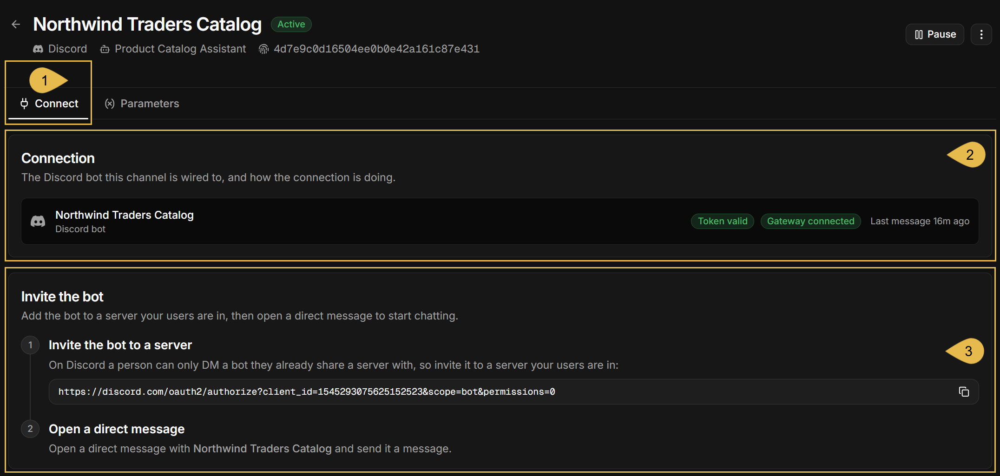

1. **Connect**  
   Open the Connect tab.
2. **Connection**  
   The Discord bot the channel is connected to, and the state of the connection:
   * **Token valid** or **Token rejected**  
     Whether Discord still accepts the bot token. While the tab is open, Quill re-checks the token with Discord every few minutes.  
     A rejected token comes with alerts below the **Connection** card, asking you to reset the token on the app's Bot page in the
     Discord Developer Portal, and rotate it in the channel.
   * **Gateway connected**, **Connecting...**, **Gateway disconnected**, or **Paused**  
     The state of Quill's connection to Discord, over which the users' messages arrive.  
     When the connection is down, the reason is shown in an alert below the **Connection** card.
   * **Last message**  
     The time of the last message a user sent to the bot, or **Waiting for the first message...** if no user has messaged the bot
     yet.
   * **Last reply could not be delivered**  
     A red alert shown below the **Connection** card when Discord refused to deliver the bot's last reply, quoting Discord's error.
3. **Invite the bot**  
   The two steps on the Discord side, as shown when the channel was added: the bot's invite link, which you can open to invite the
   bot to another server your users are in, and the way a user opens a direct message with the bot.

When the channel is paused, the tab opens with an alert saying so, and the connection card shows **Paused**.

---

#### The Parameters tab

The **Parameters** tab lists the agent's parameters and the source each of them is currently bound to, as set when the channel was
added, and lets you change the bindings.  
A parameter that is added to the [agent configuration](../getting-started/adding-an-ai-agent.mdx#modifying-the-agent-configuration)
after the channel was added appears in this tab unbound, and the bot will not answer until the parameter is bound: users get the
reply "Sorry - something went wrong handling that message. Please try again."

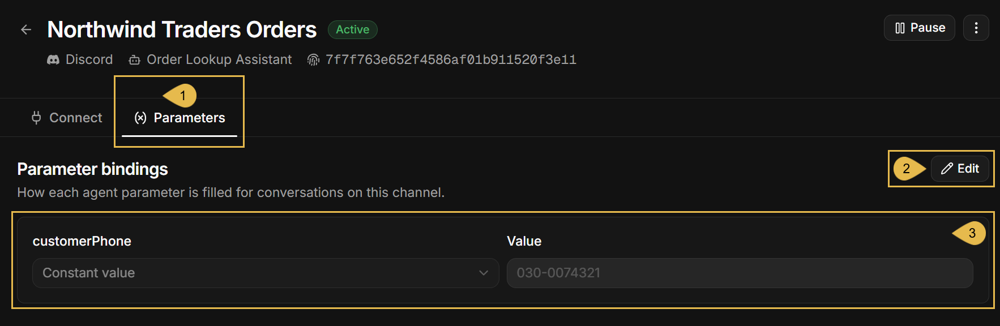

1. **Parameters**  
   Open the Parameters tab.
2. **Edit**  
   Click to make the bindings editable, and click **Save** when done.
3. **customerPhone**  
   The example agent has one parameter, `customerPhone`, bound to a constant value: the phone number of the customer the bot
   serves (see [Binding agent parameters](#binding-agent-parameters)).  
   Each row shows a parameter's name, as in the agent's configuration, the source the parameter is bound to, and, for a constant,
   the bound value.

For an agent without parameters, the tab reads "The agent declares no parameters, so this channel binds nothing."

</ContentFrame>

</Panel>

<Panel heading="Discord bot limitations">

A Discord bot channel is designed to answer, in a direct message, any member of a server the bot is in.  
The limits below follow this design and Discord's own rules. None of them can be changed in the channel's settings.

* **Any member of a server the bot is in can chat with it.**  
  The channel cannot select the users that will have access to the bot:
  * Any member of a server the bot was invited to can open a direct message with the bot and ask it questions.
  * Agent parameters bound to the Discord user can tie the answers to this user's own data, but cannot turn anyone away.

  What you do control is which servers the bot is added to. The **Public Bot** toggle on the app's Bot page in the Discord Developer
  Portal decides who can add the bot to a server: when the toggle is on, as it is by default, anyone who has the invite link can add
  the bot to a server that this person manages; when the toggle is off, only you can.
* **The bot answers in direct messages only.**  
  A message posted in one of the server's chat rooms, such as #general, where every member can read it, gets no reply, even if the
  message mentions the bot.
* **The bot answers text only.**  
  In a direct message, a message with an attachment, e.g., an image or a file, or a message with no text, gets the reply "I can only
  read text messages right now."
* **A conversation lasts one day at most.**  
  At midnight UTC the conversation ends: the next message opens a new conversation, and the agent no longer sees the earlier
  messages. A user cannot end a conversation earlier.
* **Messages sent faster than the bot answers may go unanswered.**  
  Messages a user sends while the bot is still answering are queued. When the queue is full, further messages are not taken. The bot
  then sends one notice, asking the user to send the message again after the bot has replied.
* **The bot's own messages cannot be customized.**  
  The replies the bot sends on its own, "I can only read text messages right now.", "I'm still working through your earlier
  messages, so that one didn't make it. Please resend it once I've replied.", and "Sorry - something went wrong handling that
  message. Please try again.", are set by Quill and cannot be changed.

</Panel>

<Panel heading="Troubleshooting">

The symptoms below are shown by a Discord bot channel when something goes wrong, each with its likely cause and what to do about it.  
The first symptoms are seen in Quill's management dashboard: in the channel form, in the **Edit channel** form, and in the channel's
[Connect](#the-connect-tab) tab. The rest are encountered by the bot's users on Discord, in the server's chat rooms or in their direct
messages with the bot.

**In the dashboard**

* **Clicking `Connect bot` fails with "discord rejected the bot token".**  
  Likely cause: the token pasted in the form may be incomplete or mistyped, or a newer token may have been issued for the bot in the
  Discord Developer Portal, so this one is no longer accepted.  
  What to do: whichever the cause, reset the token, since the Discord Developer Portal shows a token only once: open the app's Bot
  page there, click **Reset Token**, and paste the new token in the form's [Bot token](#filling-in-the-channel-form) field.
* **Clicking `Connect bot` fails with "that token belongs to a user account, not a bot".**  
  Likely cause: the pasted token may be the token of a Discord user account rather than the bot's.  
  What to do: copy the token from the app's Bot page in the Discord Developer Portal, as described in
  [Creating a bot in the Discord Developer Portal](#creating-a-bot-in-the-discord-developer-portal).
* **Clicking `Connect bot` fails with "Discord bot ... is already connected".**  
  Likely cause: the bot is already connected to another channel, in this app or in another app of the deployment; a bot can serve
  only one channel. When the channel is in another app, the message names that app.  
  What to do: delete the channel that holds the bot, in this app or in the app the message names, as described in
  [Pausing and deleting the channel](#pausing-and-deleting-the-channel); or create another application, with its own bot, in the
  Discord Developer Portal, as described in
  [Creating a bot in the Discord Developer Portal](#creating-a-bot-in-the-discord-developer-portal), and paste the new bot's token in
  this form instead.
* **Clicking `Save changes` in the `Edit channel` form fails with "the token belongs to a different bot".**  
  Likely cause: the new token may have been copied from the Bot page of a different application in the Discord Developer Portal.  
  What to do: copy the token from the Bot page, in the Discord Developer Portal, of the application whose bot the channel was created
  for.  
  To switch to a different bot, add a new channel for that bot instead, as described in
  [Connecting the bot to your app](#connecting-the-bot-to-your-app).
* **The `Connect` tab shows "Token rejected", and the bot does not answer.**  
  Likely cause: the token may have been reset in the Discord Developer Portal, so Discord no longer accepts it.  
  The bot is offline on Discord, and messages users send meanwhile do not reach Quill and are not answered later.

  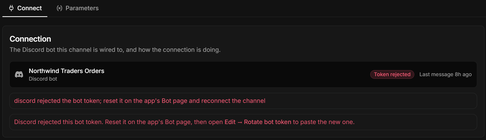

  What to do: if you hold the token issued at the reset, enter it in the channel, as described in
  [Rotating the bot token](#rotating-the-bot-token). If you do not, click **Reset Token** on the app's Bot page in the Discord
  Developer Portal, and enter the token it shows in the channel the same way.
* **The `Connect` tab shows "Gateway disconnected" or "Connecting...", and the bot does not answer.**  
  Likely cause: Quill may be unable to reach Discord. The red alert under the connection card in the Connect tab quotes the error
  Quill received.  
  The bot needs the machine running Quill to have access to `discord.com` and `gateway.discord.gg`, as described in
  [Prerequisites](#prerequisites); a firewall or a proxy blocking these addresses is the usual cause.  
  What to do: allow outgoing HTTPS connections from the machine running Quill to these two addresses in the firewall or proxy that
  blocks them, or ask your network administrator to. Quill reconnects on its own, within a few minutes of the access returning.
* **The `Connect` tab shows "Paused", and the bot does not answer.**  
  Likely cause: the channel was paused, using **Pause** in the header of its details view.  
  Messages users send while the channel is paused do not reach Quill and are not answered later.  
  What to do: resume the channel, as described in [Pausing and deleting the channel](#pausing-and-deleting-the-channel).
* **The `Connect` tab shows a red alert, "Last reply could not be delivered", under the connection card.**  
  Likely cause: Discord may have refused to deliver the bot's last reply. The alert quotes Discord's error; the usual reason is that
  the user can no longer receive messages from the bot, because the user left the server the bot is in, blocked the bot, or turned
  off direct messages from server members in Discord's **Privacy & Safety** settings.  
  The alert does not name the user; most likely, it is the user whose message arrived last, at the time shown under
  **Last message**.  
  What to do: the fix is on the user's side. Advise the user to undo whichever of these applies: rejoin the server, unblock the bot,
  or allow direct messages from server members again.

**On Discord**

* **A user cannot find the bot, or cannot open a direct message with it.**  
  Likely cause: the user may not be a member of the server the bot was invited to. On Discord, a user can message a bot only if the
  user and the bot are both members of the same server.  
  What to do: invite the bot to a server the user is a member of, using the invite link in the [Connect](#the-connect-tab) tab, or
  advise the user to join the server the bot is in. Then advise the user to open a direct message with the bot, as described in
  [Finishing the connection on Discord](#finishing-the-connection-on-discord).
* **The bot does not reply to a message a user posted in one of the server's chat rooms.**  
  Likely cause: the bot reads only the direct messages sent to it. A message posted in one of the server's chat rooms, such as
  #general, where every member can read it, does not reach the bot, even if the message mentions the bot.  
  What to do: advise the user to send the question in a direct message with the bot, opened as described in
  [Finishing the connection on Discord](#finishing-the-connection-on-discord).
* **The bot replies "I can only read text messages right now."**  
  Likely cause: the user's message may carry an attachment, like an image or a file, or contain no text.  
  What to do: in either case, advise the user to send the question as text, without an attachment.
* **The bot replies "Sorry - something went wrong handling that message. Please try again."**  
  Likely cause: either the agent has a parameter the channel does not bind, e.g., a parameter added to the agent after the channel
  was added, or the agent failed to answer, e.g., because the database it queries or the LLM service it uses could not be reached.  
  What to do: if a parameter is shown unbound in the channel's [Parameters](#the-parameters-tab) tab, bind it. If every parameter is
  bound, the agent itself failed to produce the answer: verify that the app's database, and the LLM service behind the agent's AI
  connection string, can be reached. The connection string can be tested as described in
  [Dashboard: AI connection strings](../dashboard/ai-connection-strings.mdx#test-and-save-the-connection). Then send the bot a
  question again.
* **The bot replies "I'm still working through your earlier messages, so that one didn't make it. Please resend it once I've
  replied."**  
  Likely cause: the user may have sent more messages than the bot's queue can hold while an answer was still being composed.  
  What to do: advise the user to wait for the bot's reply, and then send the message again. See
  [Discord bot limitations](#discord-bot-limitations).
* **The bot answers from outdated information.**  
  Likely cause: the conversation may still hold earlier answers, which the agent reads along with the new question.  
  What to do: advise the user to ask the bot explicitly to look the information up again. A new conversation, without the earlier
  answers, starts at midnight UTC in any case. See [Discord bot limitations](#discord-bot-limitations).

</Panel>
