import Admonition from '@theme/Admonition';
import Panel from "@site/src/components/Panel";
import ContentFrame from "@site/src/components/ContentFrame";

# Channels: Slack bot
<Admonition type="note" title="">

* A Quill **Slack bot** channel lets your users converse with an [agent](../overview.mdx#ai-agent)
  of your app in a direct message with a bot on Slack.  
  Users can message the bot from any Slack client, and the agent will answer from the app's internal database.

* The bot is a **Slack app** installed in the Slack workspace the users belong to.  
  The bot is created at `api.slack.com/apps`, free of charge, from a manifest that Quill provides.  
  Slack issues two credentials that Quill needs in order to operate the bot: a **bot token** and a **signing secret**.  
  Slack delivers the users' messages to your Quill deployment, so the deployment must be reachable from the internet.

* The channel is added from Quill's management dashboard, in a short form that asks you to select one of the agents you created
  and provide the bot token and the signing secret.  
  One step then remains on Slack: subscribing the bot to the users' messages, so that Slack delivers these messages to Quill.

* In this article:
   * [Prerequisites](#prerequisites)
   * [Creating a Slack bot from Quill's manifest](#creating-a-slack-bot-from-quill-s-manifest)
   * [Connecting the bot to your app](#connecting-the-bot-to-your-app)
      * [Opening the Add channel menu](#opening-the-add-channel-menu)
      * [Filling in the channel form](#filling-in-the-channel-form)
      * [Finishing the event subscription on Slack](#finishing-the-event-subscription-on-slack)
      * [Checking the new channel](#checking-the-new-channel)
   * [Chatting with the bot](#chatting-with-the-bot)
      * [Starting a conversation](#starting-a-conversation)
      * [Messages the bot does not answer](#messages-the-bot-does-not-answer)
   * [Binding agent parameters](#binding-agent-parameters)
      * [Choosing a source for each parameter](#choosing-a-source-for-each-parameter)
      * [Binding a parameter to a constant value](#binding-a-parameter-to-a-constant-value)
   * [Managing the channel](#managing-the-channel)
      * [Pausing and deleting the channel](#pausing-and-deleting-the-channel)
      * [Rotating the credentials](#rotating-the-credentials)
      * [The tabs of the details view](#the-tabs-of-the-details-view)
   * [Slack bot limitations](#slack-bot-limitations)
   * [Troubleshooting](#troubleshooting)

</Admonition>

<Panel heading="Prerequisites">

Before adding a Slack bot channel, make sure you have:

* **An agent in your app.**  
  The channel is added for one of the app's agents, and this agent will answer the users who message the bot.  
  To add an agent, see [Getting started: Adding an AI agent](../getting-started/adding-an-ai-agent.mdx).
* **A Slack workspace your users are members of, and a Slack account in this workspace.**  
  The bot is created and installed while you are signed in to the workspace, and only workspace members can message the bot.  
  Once the channel is added, you can try the bot out from this account.  
  If you have no Slack workspace yet, you can [create one](https://slack.com/help/articles/206845317-Create-a-Slack-workspace).
* **Permission to install the bot in the workspace.**  
  A workspace's admins can
  [require approval](https://slack.com/help/articles/222386767-Manage-app-approval-for-your-workspace) for the Slack apps that
  members add to the workspace. In a workspace that requires approval, installing the bot only files a request with the admins, and the
  bot can be connected to your app only after an admin approves the request.
* **A Quill deployment that can be reached from the internet.**  
  Slack delivers the users' messages to your Quill domain over HTTPS, so the machine that runs Quill must accept HTTPS connections
  from the internet on port `443`, at the public IP address you gave at
  [sign-up](../getting-started/signing-up.mdx#naming-your-quill-domain).  
  If the deployment cannot be reached from the internet, e.g., because it runs on your machine without a public IP address,
  Slack cannot deliver the messages, and the bot will not answer.
* **Access to Slack from the machine that runs Quill.**  
  Quill validates the bot token and sends the bot's replies through Slack's API at `slack.com`, over HTTPS.

</Panel>

<Panel heading="Creating a Slack bot from Quill's manifest">

The bot is created on Slack as a **Slack app**, from a **manifest**: a short text, provided by Quill, that describes the bot to
Slack, including the bot's name and the permissions the bot needs.  
Creating the bot takes three steps:

* Copying the manifest from Quill.
* Creating the bot from the manifest at `api.slack.com/apps`.
* Copying the two credentials that Slack issues for the bot: the **bot token** and the **signing secret**.

<ContentFrame>

### Copying the manifest from Quill

Quill shows the manifest in the **New Slack channel** form that is used to add the channel.  
To open the form: in Quill's management dashboard, open your app from **My apps**, click **Add channel** in the **Channels**
section of the app's **Overview**, and select **Slack**.  
When the form opens, expand **No Slack app yet?** at the top.

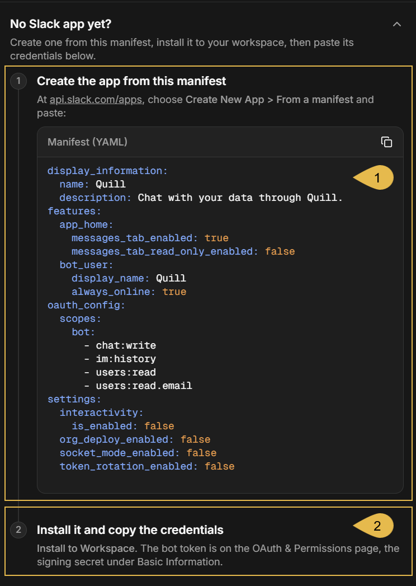

1. **Create the app from this manifest**  
   The manifest, written in YAML, a text format that Slack accepts.  
   Click the copy icon at the top right of the manifest to copy it.
2. **Install it and copy the credentials**  
   A reminder of the pages on Slack that show the bot token and the signing secret, described in
   [Collecting the bot token and the signing secret](#collecting-the-bot-token-and-the-signing-secret).

You can leave the form open while you create the bot on Slack, and return to complete the form when Slack provides you with the
bot token and the signing secret.

<Admonition type="note" title="">

The manifest lists the permissions the bot needs, and nothing else: reading the direct messages sent to the bot (`im:history`),
posting the replies (`chat:write`), and reading the users' profiles and email addresses (`users:read` and `users:read.email`).  
The bot reads a user's profile only when an agent parameter is bound to the email address of the user who sent the message, as
described in [Binding agent parameters](#binding-agent-parameters).

</Admonition>

</ContentFrame>

<ContentFrame>

### Creating the bot on Slack

Open [api.slack.com/apps](https://api.slack.com/apps), sign in with your Slack account, and click **Create New App**:

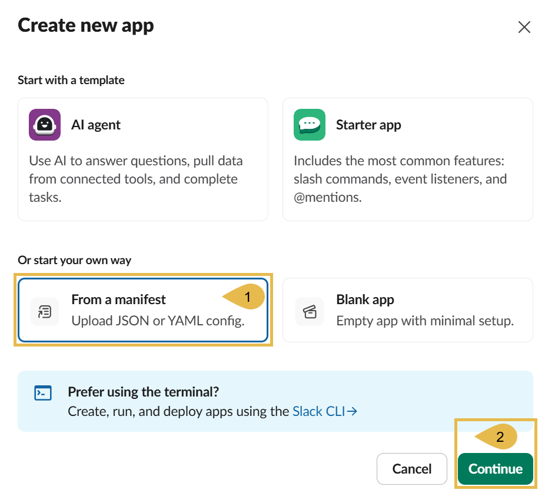

1. **From a manifest**  
   Select this option: the bot is created from the manifest you copied.
2. **Continue**  
   Click to open the **Create from a manifest** form.

---

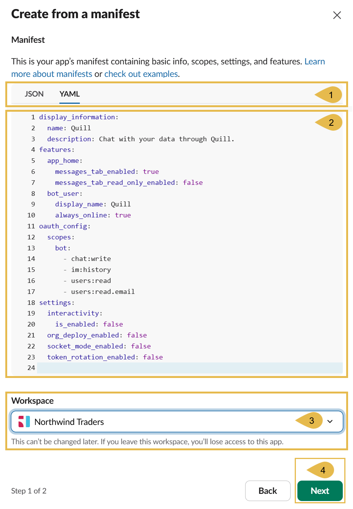

1. **YAML**  
   Select the YAML tab, the format of Quill's manifest.
2. **Manifest**  
   Paste the manifest you copied from Quill, replacing the editor's content.  
   The manifest names the bot `Quill`, in its `name` and `display_name` lines. To give the bot a different name
   (e.g., if you create a second bot and the first is already named "Quill"), edit both lines before clicking **Next**.  
3. **Workspace**  
   Select the workspace your users belong to.  
   The workspace cannot be changed after the bot is created.
4. **Next**  
   Click to proceed.  
   On the next page, Slack will show a summary of the bot as described by the manifest.
   Click **Create and Install** under the summary, and then **Allow** when Slack asks you to permit the bot's installation in
   the workspace.  

<Admonition type="note" title="">

In a workspace that requires an admin's approval for the Slack apps that members add (see [Prerequisites](#prerequisites)),
installing the bot only sends a request to the admins; the bot is installed once an admin approves the request.

</Admonition>

</ContentFrame>

<ContentFrame>

### Collecting the bot token and the signing secret

#### Collecting the bot token:

Once the bot is installed, Slack shows a page that announces the bot is ready, headed **Quill is ready!** for a bot named Quill,
with a collapsed **Your app credentials** card. Expand the card:

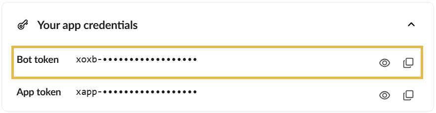

Copy the **Bot token**: this token is the first of the two credentials you need to collect.  
Note that this card also shows an **App token**, which Quill does not use and you do not need to copy.  

<Admonition type="note" title="">

The bot token can also be copied later, from the bot's settings on Slack: select **OAuth & Permissions** in the bot settings
sidebar, and copy the **Bot User OAuth Token**:

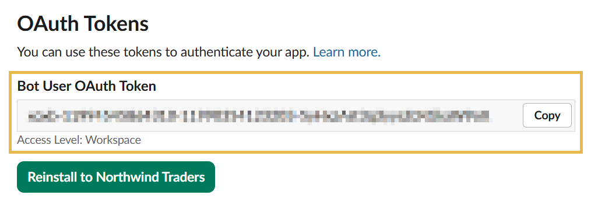

</Admonition>

---

#### Collecting the signing secret:

To find the **signing secret**, click **Go to App Settings** at the bottom of the **Quill is ready!** page.  
Open the **Basic Information** page from the bot settings sidebar, and find **Signing Secret** in the **App Credentials** section:

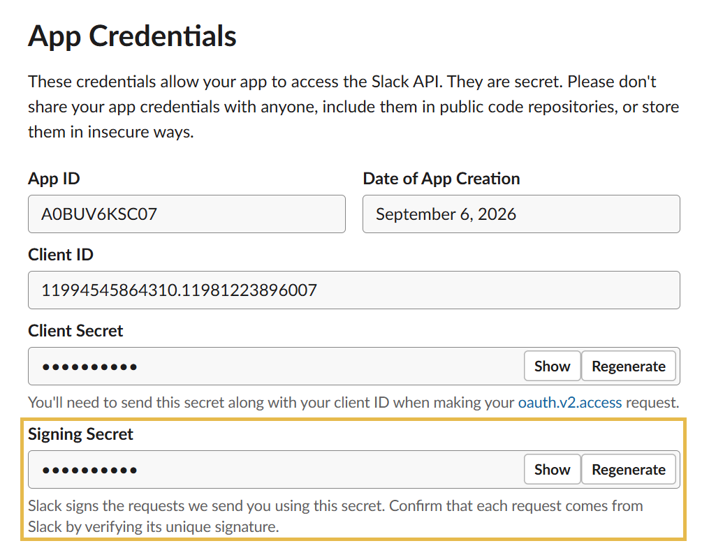

Click **Show** to reveal the secret, and copy it.

<Admonition type="warning" title="">

Handle the bot token and the signing secret as secrets: anyone holding the bot token can read the messages users send to the bot
and answer in the bot's name, and anyone holding the signing secret can send messages to Quill in Slack's name.

* If the signing secret leaks, click **Regenerate** next to the secret to recreate it.
* If the bot token leaks, have Slack issue a new token by clicking **Revoke All OAuth Tokens** on the OAuth & Permissions page
  and reinstalling the bot from the same page.
* In either case, enter the new credential in the channel as described in [Rotating the credentials](#rotating-the-credentials).

</Admonition>

</ContentFrame>

</Panel>

<Panel heading="Connecting the bot to your app">

To connect the bot to the app, add a **Slack** channel for one of the app's agents.  
The channel is added in Quill's management dashboard, and one last step is then taken on Slack, so that Slack delivers the users'
messages to the channel.

<ContentFrame>

### Opening the Add channel menu

In Quill's management dashboard, open your app from **My apps**. The app's **Overview** holds a **Channels** section: click the
section's **Add channel** button to open the menu of channel types, and select **Slack**.

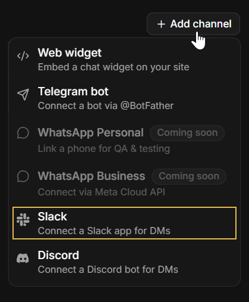

<Admonition type="info" title="">

The [Add agent wizard](../getting-started/adding-an-ai-agent.mdx#saving-the-agent) ends on an **Add a channel** stage that shows
the same Channels section, so a bot can also be connected right after its agent is created.  
The form then has no **Agent** field: the channel is added for the agent the wizard just created.

</Admonition>

</ContentFrame>

<ContentFrame>

### Filling in the channel form

Selecting **Slack** opens the **New Slack channel** form.

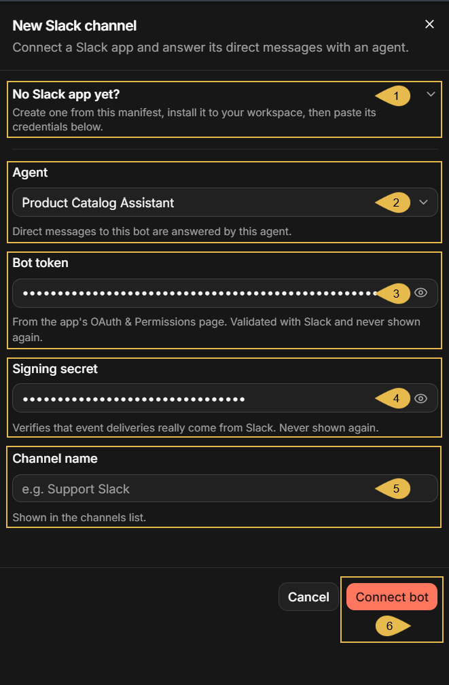

1. **No Slack app yet?**  
   Click to expand a block that holds the manifest and a reminder of the steps on Slack, described in
   [Creating a Slack bot from Quill's manifest](#creating-a-slack-bot-from-quill-s-manifest).
2. **Agent**  
   Select the agent that will answer the bot's users. The list holds the app's agents.

   <Admonition type="info" title="">

   When the form is opened from the [Add agent wizard](../getting-started/adding-an-ai-agent.mdx#saving-the-agent), the channel is
   added for the newly created agent and this field is absent.

   </Admonition>

3. **Bot token**  
   Paste the bot token you collected on Slack. The field shows the token as dots; click the eye icon to reveal it.  
   Quill validates the token with Slack when the channel is added, and never displays it again afterwards.
4. **Signing secret**  
   Paste the signing secret you collected on Slack. The field shows the secret as dots; click the eye icon to reveal it.  
   Quill uses the secret to verify that every message delivered to the channel really comes from Slack, and never displays the
   secret again afterwards.
5. **Channel name** (optional)  
   If you leave this field empty, Quill will name the channel after the bot's username on Slack, e.g., `quill`.
6. **Connect bot**  
   Click to add the channel. If Slack rejects the token, or the bot is already connected to another channel, the form will
   report the error and no channel will be added.

<Admonition type="note" title="">

When the selected agent has parameters, a **Parameters** section appears below the channel name, described in
[Binding agent parameters](#binding-agent-parameters).

</Admonition>

</ContentFrame>

<ContentFrame>

### Finishing the event subscription on Slack

Once the channel is added, the form is replaced by a **Bot connected** sheet. The sheet shows the state of the connection, and
lists the steps that remain on Slack, where the bot has to be subscribed to the users' messages:

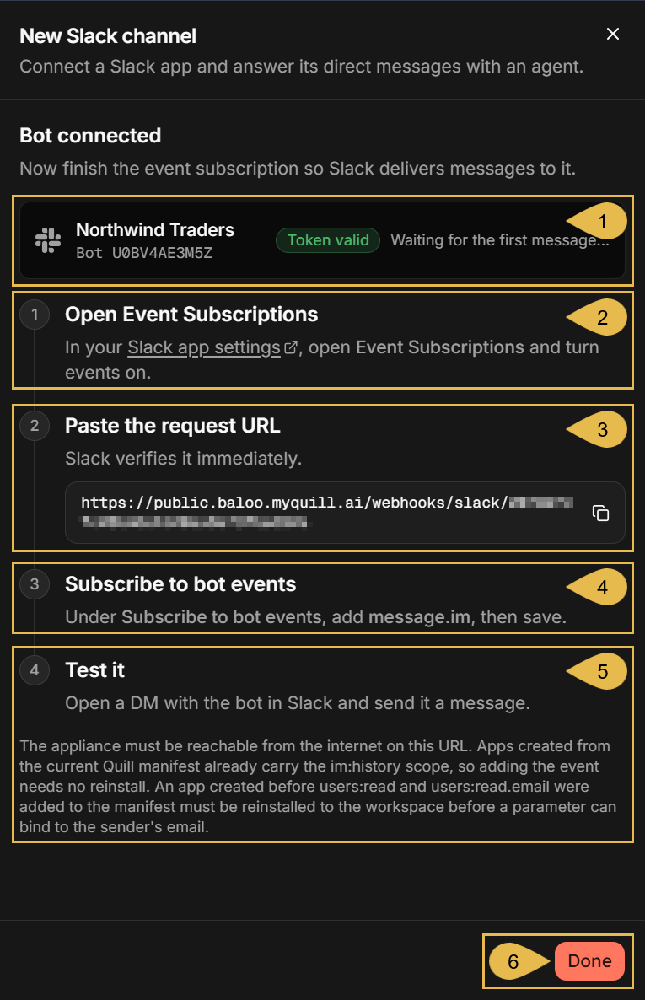

1. **Northwind Traders**  
   The workspace the bot is installed in, the bot's user ID on Slack, and the state of the connection:
   * **Token valid**: Slack accepted the bot token.
   * **Waiting for the first message...**: no user has messaged the bot yet.
2. **Open Event Subscriptions**  
   The first step on Slack: opening the bot's Event Subscriptions page, described below.
3. **Paste the request URL**  
   The address Slack has to deliver the users' messages to, unique to this channel.  
   Click the copy icon next to the URL to copy it, for the second step on Slack.
4. **Subscribe to bot events**  
   The third step on Slack: adding the `message.im` event, described below.
5. **Test it**  
   The last step: sending the bot a message in the Slack client, described in [Starting a conversation](#starting-a-conversation).
6. **Done**  
   Click to close the sheet once the steps on Slack are done.  
   The connection state and the steps remain available in the channel's [Connect](#the-connect-tab) tab.

The above steps are performed in the bot's settings on Slack. Open [api.slack.com/apps](https://api.slack.com/apps) in your
browser, select the bot in the list of apps, and select **Event Subscriptions** in the sidebar on the left. The
**Event Subscriptions** page opens:

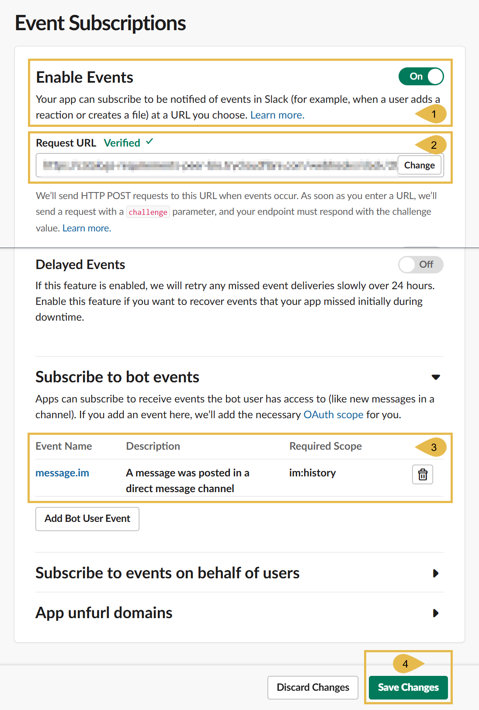

1. **Enable Events**  
   Turn the toggle on, so that Slack can notify Quill of events like a direct message sent to the bot.
2. **Request URL**  
   Paste the request URL shown in the **Paste the request URL** step of Quill's **Bot connected** sheet, depicted above.  
   Slack verifies the URL at once and marks the field **Verified**. If the field is not marked Verified, see
   [Troubleshooting](#troubleshooting).
3. **message.im**  
   Scroll down to the **Subscribe to bot events** section, click **Add Bot User Event**, and select `message.im`, the event Slack
   raises when a user sends the bot a direct message.
4. **Save Changes**  
   Click to save the subscription. Slack will then deliver the direct messages that users send the bot to Quill.

</ContentFrame>

<ContentFrame>

### Checking the new channel

Back in Quill, you can now see the new channel in the Overview's **Channels** section:

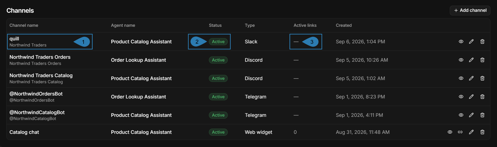

1. **Channel name**  
   The channel's name, with the name of the bot's Slack workspace beneath it.
2. **Status**  
   **Active**: the channel is enabled; **Disabled**: the channel is paused.  
   Pausing and resuming a channel is described in
   [Dashboard: Channels view](../dashboard/channels-view.mdx#pausing-and-resuming-a-channel).
3. **Active links**  
   Embed links belong to web widget channels; a Slack bot channel has none, so the column shows a dash.

</ContentFrame>

</Panel>

<Panel heading="Chatting with the bot">

Once the channel is connected, every member of the workspace can message the bot. A user who opens a direct message with the bot
can ask questions, and the agent will answer from the app's internal database.  
The users need no account with Quill and no instructions. This section describes the chat as an end user experiences it, so that
you know what to expect and what to tell your users.

<ContentFrame>

### Starting a conversation

In the Slack client, a user opens the bot from the **Agents and apps** section of the sidebar, or by searching for the bot's name,
and types a question in the bot's **Messages** tab.

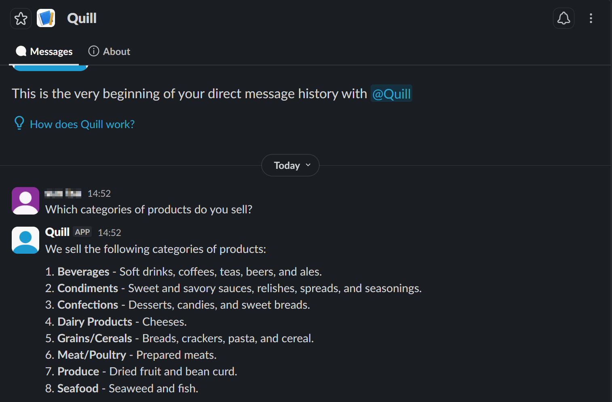

The following holds for every conversation with the bot:

* **Messages a user sends while the bot is still answering wait their turn.**  
  The bot answers the waiting messages one by one, as long as the queue Quill keeps for this user has room.
* **The bot has no commands.**  
  Every message the bot receives is handled as a question.

The behavior common to all channels, like the streaming of the reply and the conversation's context, is described in the channels
overview, in [Behavior and limitations common to all channels](../channels/overview.mdx#behavior-and-limitations-common-to-all-channels).

</ContentFrame>

<ContentFrame>

### Messages the bot does not answer

The bot answers text-only messages. A message that carries a file, like an image or a document, gets the reply "I can only read text
messages right now." A message with no text at all gets no reply.  
The bot answers in direct messages only. A message posted in a Slack channel, such as #general, or in a group direct message with
several people, gets no reply, even if the message mentions the bot.

</ContentFrame>

</Panel>

<Panel heading="Binding agent parameters">

Some agents have **parameters**: values the agent's queries require, and that must come from the channel rather than be chosen
by the LLM, e.g., the ID of the customer whose orders the agent looks up.  
When you add a Slack channel for such an agent, the form asks you to bind each parameter to a source, which can be:

* A constant value that you type, which is then the same for all bot users.
* A detail of the Slack user who is messaging the bot: the user's Slack user ID or email address.  
  The parameter then carries a different value for each user, so that each user is answered about this user's own data.

<ContentFrame>

### Choosing a source for each parameter

The **New Slack channel** form presents a **Parameters** section with one row per parameter, labeled with the parameter's name,
e.g., `customerPhone`.  
In each parameter row, select where the parameter's value comes from:

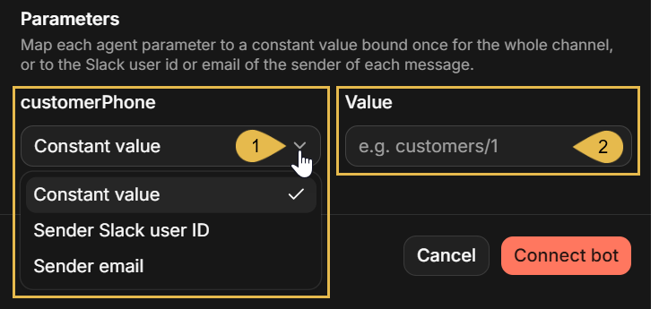

1. The parameter's source  
   Select the source from the list:
   * **Constant value**  
     A value that you type in the form. Quill will then pass this value to the agent with every message, from every user.  
     e.g., the phone number of the customer whose workspace the bot is installed in.
   * **Sender Slack user ID**  
     The Slack user ID of the user who sent the message, e.g., `U0BV4AE3M5Z`.
   * **Sender email**  
     The email address on the Slack profile of the user who sent the message.  
     A user whose profile has no email address gets the reply "Sorry - something went wrong handling that message. Please try
     again."

   The user ID and email sources tie the answers to the Slack user, and suit an app whose data holds the users' Slack IDs or
   email addresses.
2. **Value**  
   The value to bind when the source is **Constant value**.

The bindings can be changed later in the channel's **Parameters** tab, described in
[The Parameters tab](#the-parameters-tab).

</ContentFrame>

<ContentFrame>

### Binding a parameter to a constant value

In this example, the app's **Order Lookup Assistant** agent has a `customerPhone` parameter: the agent's queries find a customer's
orders by the customer's phone number.  
The bot, named `Northwind Orders`, serves the Slack workspace of a single customer, where every member belongs to this customer, so
the channel binds the parameter to a constant value: the customer's phone number. The agent then answers every user of this bot
about this customer's orders:

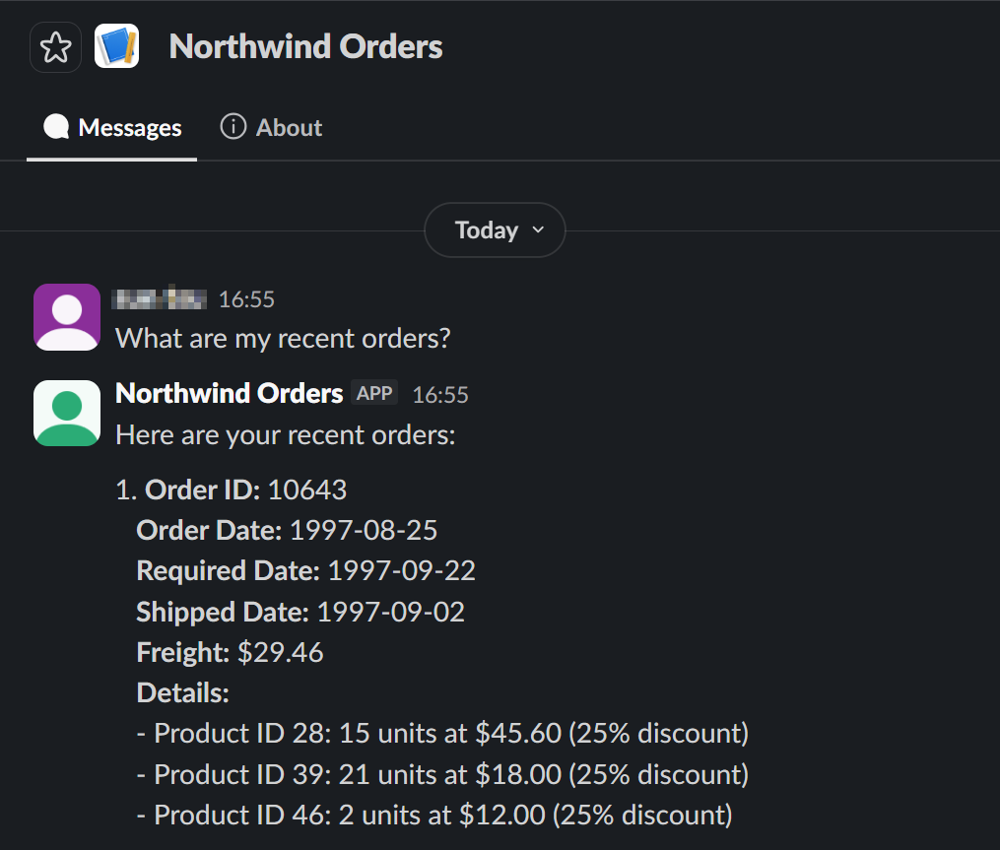

A constant value suits a channel whose users all share the value, like the bot above.

</ContentFrame>

</Panel>

<Panel heading="Managing the channel">

Once added, the channel is managed from its details view, described in
[Dashboard: Channels view](../dashboard/channels-view.mdx#the-channel-s-details-view): the view's header carries the
**Pause**/**Resume** button and the **⋮** menu with **Edit** and **Delete**, common to every channel type, and the tabs below the
header are specific to the channel type.

To open the details view, open the app from **My apps** in Quill's management dashboard, select **Channels** in the sidebar, and
click the channel's box:

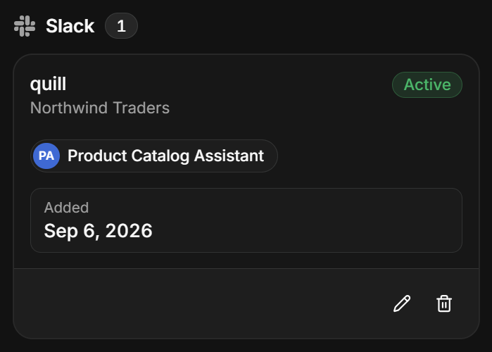

---

<ContentFrame>

### Pausing and deleting the channel

To pause or resume the channel, click **Pause**/**Resume** in the header; to delete it, select **Delete** in the header's **⋮** menu.

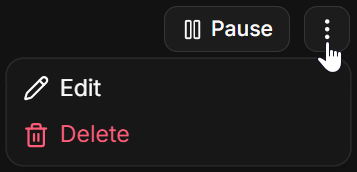

Both actions are explained in the Channels view article, in
[Pausing and resuming a channel](../dashboard/channels-view.mdx#pausing-and-resuming-a-channel) and
[Deleting a channel](../dashboard/channels-view.mdx#deleting-a-channel). Each of them also has a Slack side, explained here:

* A paused bot stops answering. Nothing changes on Slack: the bot remains installed, and Slack keeps delivering the users'
  messages, which Quill discards.  
  Messages users send while the channel is paused will not be answered when the channel is resumed.
* A deleted channel stops the bot, but the bot itself remains installed in the workspace, and its credentials can be used to
  connect it again, in a new channel.  
  The new channel has a new request URL, which you have to paste into the bot's **Event Subscriptions** page on Slack in place of
  the old one, as described in [Finishing the event subscription on Slack](#finishing-the-event-subscription-on-slack).

</ContentFrame>

<ContentFrame>

### Rotating the credentials

To replace the bot token, the signing secret, or both, select **Edit** in the header's **⋮** menu, and rotate the credentials in the
**Edit channel** form.  
The channel has to hold the credentials that Slack currently issues for the bot:

* If you revoke and reissue the bot token on Slack, the bot will stop answering until the channel holds the new token.
* If you regenerate the signing secret on Slack, Quill will reject every delivery until the channel holds the new secret.

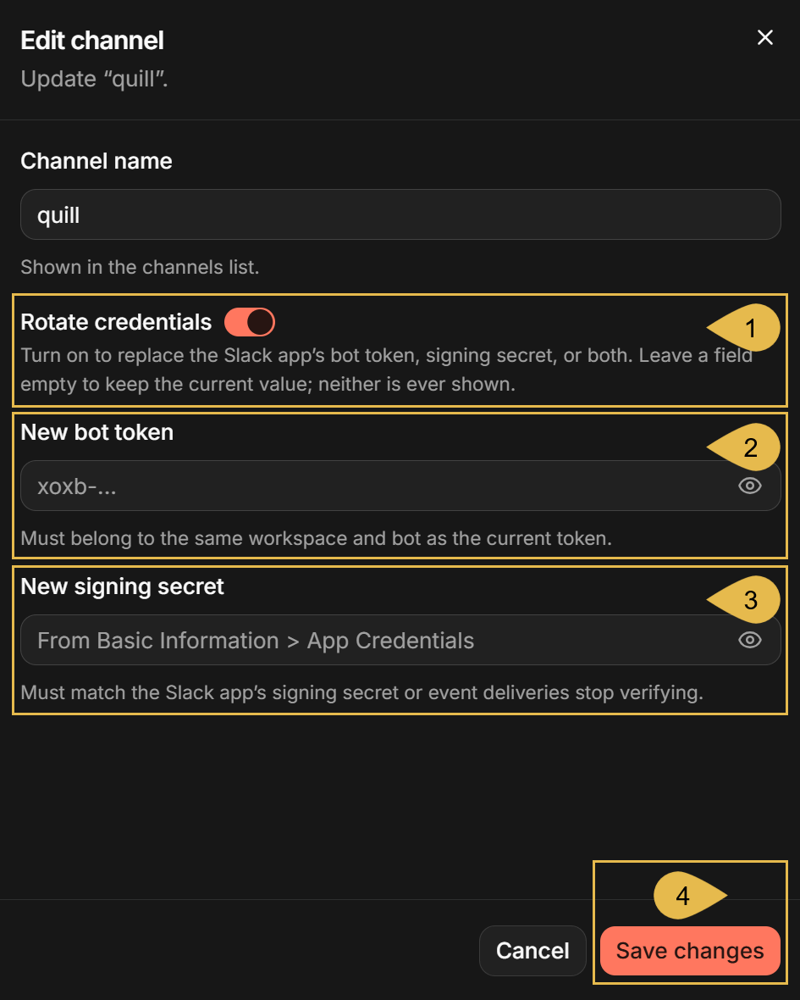

1. **Rotate credentials**  
   Turn the toggle on to replace one credential or both.
2. **New bot token**  
   Paste the new bot token, or leave the field empty to keep the current token.  
   Quill validates the token with Slack before saving it; the token has to belong to the same workspace and bot as the current one.
3. **New signing secret**  
   Paste the new signing secret, or leave the field empty to keep the current secret.
4. **Save changes**  
   Click to save. Quill will use the new credentials from now on.

</ContentFrame>

<ContentFrame>

### The tabs of the details view

The details view presents an informative **Connect** tab, and a **Parameters** tab that allows you to change the bindings of the
agent's parameters:

---

#### The Connect tab

The **Connect** tab shows the state of the bot's connection to Slack, and keeps the channel's request URL and the steps taken on
Slack when the channel was added, in case they have to be repeated.

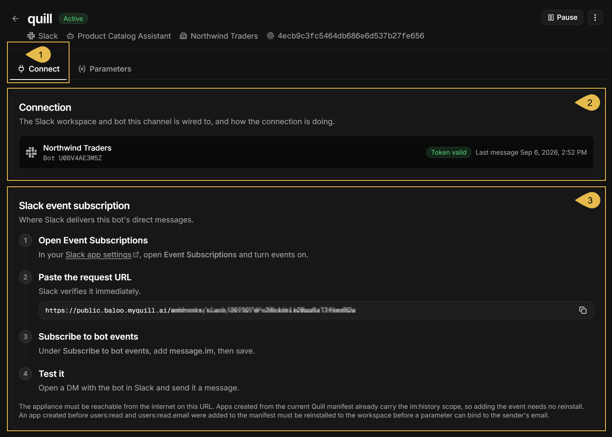

1. **Connect**  
   Open the Connect tab.
2. **Connection**  
   The workspace the bot is installed in, the bot's user ID on Slack, and the state of the connection:
   * **Token valid**, **Token rejected**, or **Token status unknown**  
     Whether Slack still accepts the bot token. While the tab is open, Quill re-checks the token with Slack every few minutes;
     **Token status unknown** is shown when Slack could not be reached for the check.
   * **Last message**  
     The time of the last message a user sent to the bot, or **Waiting for the first message...** if no user has messaged the bot
     yet.
   * **A delivery failed signature verification**  
     A red alert shown below the **Connection** card when Slack delivered a message that Quill could not verify, most likely
     because the channel holds an outdated signing secret.  
     The alert disappears once a delivery is verified again.
   * **The bot couldn't deliver a reply**  
     A red alert shown below the **Connection** card when Slack refused the bot's last reply, quoting Slack's error and the time
     of the failure. The alert remains after the problem is solved, until Quill is restarted.
3. **Slack event subscription**  
   The steps taken on Slack when the channel was added, with the channel's request URL, as shown in the **Bot connected** sheet
   at the time (see [Finishing the event subscription on Slack](#finishing-the-event-subscription-on-slack)).

When the channel is paused, the tab opens with an alert saying so.

---

#### The Parameters tab

The **Parameters** tab lists the agent's parameters and the source each of them is currently bound to, as set when the channel was
added, and lets you change the bindings.  
A parameter that is added to the [agent configuration](../getting-started/adding-an-ai-agent.mdx#modifying-the-agent-configuration)
after the channel was added appears in this tab unbound, and the bot will not answer until the parameter is bound: users get the
reply "Sorry - something went wrong handling that message. Please try again."

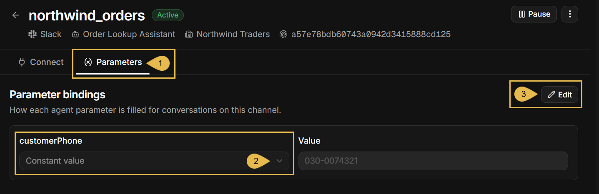

1. **Parameters**  
   Open the Parameters tab.
2. **customerPhone**  
   The example agent has one parameter, `customerPhone`, bound to a constant value: the phone number of the customer the bot
   serves (see [Binding agent parameters](#binding-agent-parameters)).  
   Each row shows a parameter's name, the source the parameter is bound to, and, for a constant, the bound value.
3. **Edit**  
   Click to make the bindings editable, and click **Save** when done.

</ContentFrame>

</Panel>

<Panel heading="Slack bot limitations">

A Slack bot channel is designed to answer, in a direct message, any member of the workspace the bot is installed in.  
The limits below follow this design and Slack's own rules. None of them can be changed in the channel's settings.

* **Any member of the workspace can chat with the bot.**  
  You select the workspace the bot will serve when you create the bot on Slack, but within this workspace the channel cannot
  select the users that will have access to the bot. Agent parameters bound to the Slack user can tie the answers to this user's
  own data, but cannot turn anyone away.
* **The bot answers in direct messages only.**  
  A message posted in a Slack channel, such as #general, or in a group direct message with several people, gets no reply, even if
  the message mentions the bot.
* **The bot answers text-only messages.**  
  In a direct message, a message that carries a file, e.g., an image or a document, gets the reply "I can only read text messages
  right now."
* **The bot answers only while the deployment can be reached from the internet.**  
  Slack delivers each message to the channel's request URL as the user sends it. If the deployment cannot be reached at that
  moment, the message does not reach Quill. Slack may retry the delivery a few times shortly afterwards; a message that no retry
  delivers is never answered.
* **The agent remembers a conversation for one day at most.**  
  A user cannot make the agent forget sooner.  
  See [Behavior and limitations common to all channels](../channels/overview.mdx#behavior-and-limitations-common-to-all-channels)
  in the channels overview.
* **Messages sent faster than the bot answers may go unanswered.**  
  See [Behavior and limitations common to all channels](../channels/overview.mdx#behavior-and-limitations-common-to-all-channels)
  in the channels overview.
* **The bot's own messages cannot be customized.**  
  See [Behavior and limitations common to all channels](../channels/overview.mdx#behavior-and-limitations-common-to-all-channels)
  in the channels overview.

</Panel>

<Panel heading="Troubleshooting">

<Admonition type="note" title="">

Symptoms met by the users of every bot type, not just of a Slack bot, are listed in the channels overview, in
[Troubleshooting](../channels/overview.mdx#troubleshooting).

</Admonition>

The symptoms below are shown by a Slack bot channel when something goes wrong, each with its likely cause and what to do about it.  
The first symptoms are seen in Quill's management dashboard: in the channel form and in the channel's [Connect](#the-connect-tab)
tab. One symptom is seen in the bot's settings on Slack, on the **Event Subscriptions** page. The rest are encountered by the bot's
users in the Slack client.

<ContentFrame>

### In the dashboard

* **The `Bot token` field reports "The bot token starts with xoxb- (not a user or app-level token)".**  
  Likely cause: the pasted token may be the **App token** (`xapp-...`) shown next to the bot token on the **Quill is ready!** page
  on Slack.  
  What to do: copy the **Bot User OAuth Token** from the bot's **OAuth & Permissions** page on Slack, as described in
  [Collecting the bot token and the signing secret](#collecting-the-bot-token-and-the-signing-secret), and paste it in the field.
* **Clicking `Connect bot` fails with "slack rejected the bot token".**  
  Likely cause: the token pasted in the form may be incomplete or mistyped, or it may have been revoked on Slack since it was
  copied.  
  What to do: copy the **Bot User OAuth Token** from the bot's OAuth & Permissions page on Slack again, and paste it in the form's
  [Bot token](#filling-in-the-channel-form) field. If the bot was uninstalled, reinstall it from the same page first.
* **Clicking `Connect bot` fails with "slack is rate-limiting the token check" or "could not reach the Slack API".**  
  Likely cause: Slack may be limiting Quill's requests for a moment, or the machine that runs Quill may be unable to reach
  `slack.com`.  
  What to do: wait a minute or two and try again. If the failure persists, verify that the machine that runs Quill can open HTTPS
  connections to `slack.com`, as described in [Prerequisites](#prerequisites).
* **Clicking `Connect bot` fails with "Slack bot ... is already connected".**  
  Likely cause: the bot is already connected to another channel, in this app or in another app of the deployment; a bot can serve
  only one channel. When the channel is in another app, the message names that app.  
  What to do: delete the channel that holds the bot, in this app or in the app the message names, as described in
  [Pausing and deleting the channel](#pausing-and-deleting-the-channel); or create another bot from the manifest, with a name of its
  own, as described in [Creating a Slack bot from Quill's manifest](#creating-a-slack-bot-from-quill-s-manifest), and paste the new
  bot's credentials in this form instead.
* **The `Connect` tab shows "Token rejected", and the bot does not answer.**  
  Likely cause: the bot's token may have been revoked on Slack, by **Revoke All OAuth Tokens** on its OAuth & Permissions page or by
  uninstalling the bot from the workspace.  
  The users' messages still reach Quill, but the bot cannot post its replies, so the messages are not answered, and are not answered
  later. Quill re-checks the token every few minutes, so the badge may turn red a few minutes after the revocation. The tab then
  also shows the red alert "The bot couldn't deliver a reply" under the connection card, which remains until Quill is restarted.

  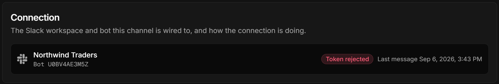

  What to do: reinstall the bot from its OAuth & Permissions page on Slack, copy the new **Bot User OAuth Token** the page then
  shows, and enter it in the channel, as described in [Rotating the credentials](#rotating-the-credentials).
* **The `Connect` tab shows a red alert, "A delivery failed signature verification", under the connection card.**  
  Likely cause: the signing secret held by the channel may differ from the bot's: the secret may have been regenerated on Slack,
  or mistyped when the channel was added.  
  Quill rejects the deliveries it cannot verify, so the users' messages are not answered until the secrets match.

  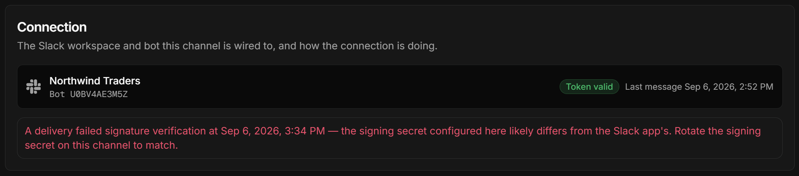

  What to do: copy the **Signing Secret** from the **App Credentials** section of the bot's **Basic Information** page on Slack, and
  enter it in the channel, as described in [Rotating the credentials](#rotating-the-credentials). The alert disappears once a
  delivery is verified.
* **The `Connect` tab shows "Token valid", but "Last message" does not change when users message the bot, and the bot does not
  answer.**  
  Likely cause: Slack may not be delivering the messages to Quill: the event subscription may be incomplete, the request URL may
  have failed Slack's verification, or the deployment may no longer be reachable from the internet.  
  What to do: open the bot's **Event Subscriptions** page on Slack and check that **Enable Events** is on, that the **Request URL**
  is marked **Verified**, that `message.im` is listed under **Subscribe to bot events**, and that the changes were saved, as
  described in [Finishing the event subscription on Slack](#finishing-the-event-subscription-on-slack). If the URL is not verified,
  see the "Your URL didn't respond." entry below.
* **The `Connect` tab opens with "This channel is paused, so the bot isn't answering right now."**  
  Likely cause: the channel was paused, using **Pause** in the header of its details view.  
  Messages users send while the channel is paused do not reach the agent and are not answered later.  
  What to do: resume the channel, as described in [Pausing and deleting the channel](#pausing-and-deleting-the-channel).

</ContentFrame>

<ContentFrame>

### In the bot's settings on Slack

* **The `Request URL` field of the `Event Subscriptions` page shows "Your URL didn't respond."**  
  Likely cause: Slack may be unable to reach the deployment at the URL: Quill may be stopped, the machine that runs Quill may not
  accept connections from the internet, or the URL may have been pasted incompletely. A channel that was deleted no longer answers
  at its URL either.

  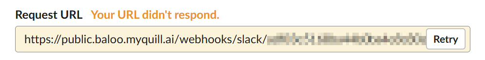

  What to do: make sure that Quill is running, and that the machine that runs it accepts HTTPS connections from the internet, as
  described in [Prerequisites](#prerequisites). Then paste the URL again from the channel's [Connect](#the-connect-tab) tab, and
  click **Retry**. If the channel was deleted, add a channel for the bot again and paste the new channel's request URL instead.

</ContentFrame>

<ContentFrame>

### In the Slack client

* **A user cannot find the bot.**  
  Likely cause: the user may not be a member of the workspace the bot is installed in, or the bot may not be listed in the user's
  sidebar.  
  What to do: if the user is not a member of the workspace, have a workspace admin invite the user. Then advise the user to search
  for the bot's name in the Slack client's search box, and to write in the bot's **Messages** tab, as described in
  [Starting a conversation](#starting-a-conversation).
* **The bot does not reply to a message posted in a Slack channel or in a group direct message.**  
  Likely cause: the bot reads only the direct messages sent to it. A message posted in a Slack channel, such as #general, or in a
  group direct message with several people, does not reach the bot, even if the message mentions the bot.  
  What to do: advise the user to send the question in a direct message with the bot.
* **The bot replies "Sorry - something went wrong handling that message. Please try again."**  
  Likely cause: one of the following may have happened.
  * The agent has a parameter the channel does not bind, e.g., a parameter added to the agent after the channel was added.
  * A parameter is bound to **Sender email**, and the Slack profile of the user who sent the message carries no email address.
  * The agent failed to answer, e.g., because the database it queries or the LLM service it uses could not be reached.

  What to do: if a parameter is shown unbound in the channel's [Parameters](#the-parameters-tab) tab, bind it. If a parameter is
  bound to **Sender email**, ask the user to check that the Slack profile shows an email address. If every parameter is bound, the
  agent itself most likely failed to produce the answer: verify that the app's database, and the LLM service behind the agent's AI
  connection string, can be reached. The connection string can be tested as described in
  [Dashboard: AI connection strings](../dashboard/ai-connection-strings.mdx#test-and-save-the-connection). Then send the bot a
  question again.

</ContentFrame>

</Panel>
