import Admonition from '@theme/Admonition';
import Panel from "@site/src/components/Panel";
import ContentFrame from "@site/src/components/ContentFrame";

# Channels: Telegram bot
<Admonition type="note" title="">

* A Quill **Telegram bot** [channel](../overview.mdx#channels) lets your users converse with an [agent](../overview.mdx#ai-agent)
  of your app in a private chat with a bot on Telegram.  
  Users can chat with the bot using any Telegram client, and the agent will answer from the app's data.

* The bot is created using **@BotFather**, an official Telegram bot that creates other bots, free of charge.  
  @BotFather also issues the **bot token**, a credential that Quill needs to operate the bot.  
  Quill collects the incoming messages from Telegram, so the deployment needs no public address or open inbound port.

* The channel is added from Quill's management dashboard, using one short form that asks you to select one of the agents you
  created and provide the bot token and an optional channel name.
   * If the selected agent has parameters, the form also asks you to settle each parameter's value.  
     You can either provide a fixed value, or take the value from the Telegram user the bot is chatting with, e.g., the user's
     phone number.
   * When an agent parameter takes the user's phone number, the bot will ask each user it chats with to share the number before
     answering the user's first question.

* In this article:
   * [Prerequisites](#prerequisites)
   * [Creating a bot using @BotFather](#creating-a-bot-using-botfather)
   * [Connecting the bot to your app](#connecting-the-bot-to-your-app)
      * [Opening the Add channel menu](#opening-the-add-channel-menu)
      * [Filling in the channel form](#filling-in-the-channel-form)
      * [Checking the new channel](#checking-the-new-channel)
   * [Chatting with the bot](#chatting-with-the-bot)
      * [Starting a conversation](#starting-a-conversation)
      * [Clearing the conversation](#clearing-the-conversation)
      * [Messages the bot ignores](#messages-the-bot-ignores)
   * [Binding agent parameters](#binding-agent-parameters)
      * [Choosing a source for each parameter](#choosing-a-source-for-each-parameter)
      * [Sharing the phone number](#sharing-the-phone-number)
      * [Returning users](#returning-users)
   * [Managing the channel](#managing-the-channel)
      * [Pausing and deleting the channel](#pausing-and-deleting-the-channel)
      * [Rotating the bot token](#rotating-the-bot-token)
      * [The tabs of the details view](#the-tabs-of-the-details-view)
   * [Telegram bot limitations](#telegram-bot-limitations)
   * [Troubleshooting](#troubleshooting)

</Admonition>

<Panel heading="Prerequisites">

Before adding a Telegram bot channel, make sure you have:

* **An agent in your app.**  
  The channel is added for one of the app's agents, and this agent will answer the users who chat with the bot.  
  To add an agent, see [Getting started: Adding an AI agent](../getting-started/adding-an-ai-agent.mdx).
* **A Telegram account.**  
  The bot is created in a private chat with @BotFather from your [Telegram account](https://telegram.org).  
  Once the channel is added, you can try the bot out from the same account.
* **Access to Telegram from the machine running Quill.**  
  The only connection the bot needs is the one Quill opens to Telegram's servers, `api.telegram.org`, over HTTPS.  
  The users' messages travel to Quill over this connection too, so a deployment that cannot be reached from the internet, like
  one running on your machine, can still operate a bot.

</Panel>

<Panel heading="Creating a bot using @BotFather">

To create the bot, open a chat with [**@BotFather**](https://t.me/BotFather) in your Telegram client and send this command: `/newbot`  
The genuine @BotFather carries Telegram's blue verification mark next to its name.  
@BotFather then asks for two details, one at a time:

* A **name** for the bot.  
  e.g., `Northwind Traders Catalog`  
  This name will appear at the top of users' chats with the bot.
* A **username** for the bot.  
  e.g., `NorthwindCatalogBot`  
  The username has to be unique across Telegram and end in `bot`.  
  The username is the bot's address on Telegram: users find the bot by it, and Quill names the channel after it (unless you
  name the channel yourself).

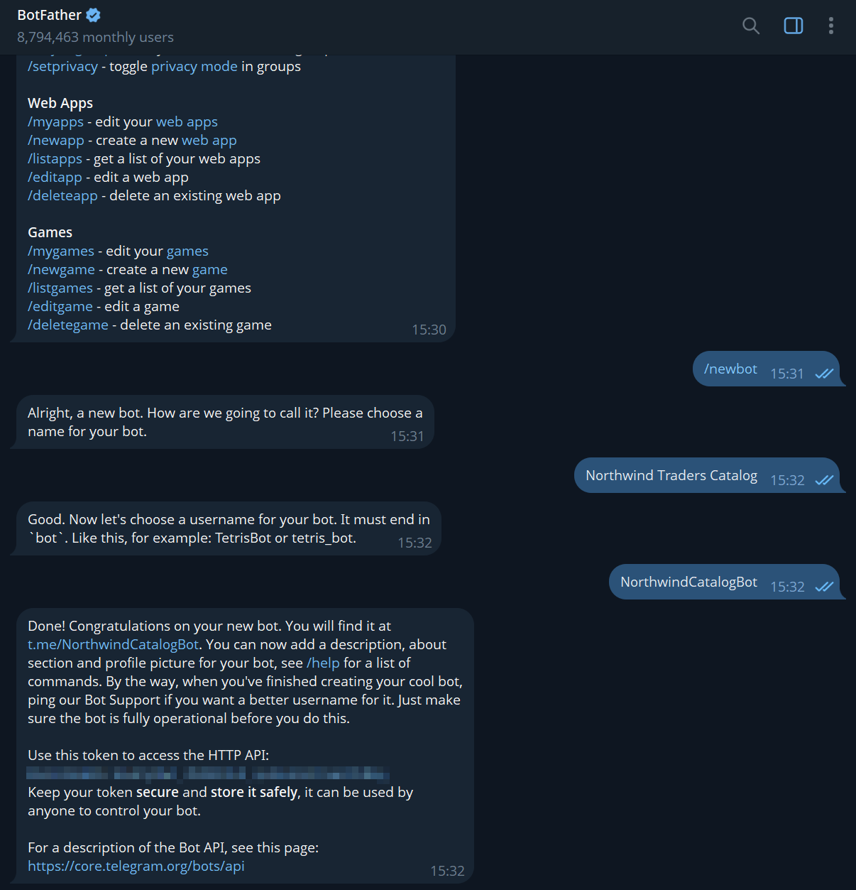

@BotFather's final message carries the **bot token** (the string after "Use this token to access the HTTP API").  
Copy the token: you will need to hand it to Quill in the next section,
[Connecting the bot to your app](#connecting-the-bot-to-your-app).

<Admonition type="warning" title="">

The bot token is a secret: anyone holding it can control the bot, read the messages users send to it, and answer in the bot's name.  
If the token ever leaks, have @BotFather issue a new token and enter it in the channel as described in
[Rotating the bot token](#rotating-the-bot-token).

</Admonition>

</Panel>

<Panel heading="Connecting the bot to your app">

To connect the bot to the app, add a **Telegram bot** channel for one of the app's agents.

* The channel is added in a short form that asks you to provide the bot token issued by @BotFather, and to select the agent that
  will answer the users.
* Once the channel is added, Quill starts operating the bot, and messages sent to the bot will reach the agent.

<ContentFrame>

### Opening the Add channel menu

In Quill's management dashboard, open the app from **My apps**. The app's **Overview** holds a **Channels** section: click the
section's **Add channel** button to open the menu of channel types, and select **Telegram bot**.

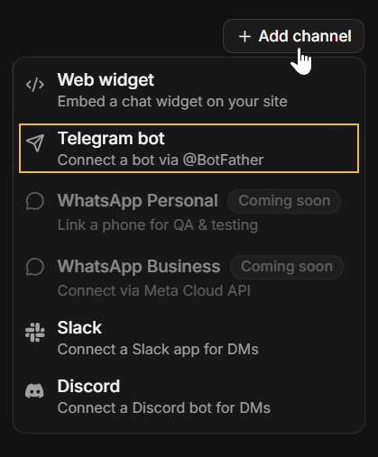

<Admonition type="info" title="">

The [Add agent wizard](../getting-started/adding-an-ai-agent.mdx#saving-the-agent) ends on an **Add a channel** stage that shows
the same Channels section, so a bot can also be connected right after its agent is created.  
The form then has no **Agent** field: the channel is added for the agent the wizard just created.

</Admonition>

</ContentFrame>

<ContentFrame>

### Filling in the channel form

Selecting **Telegram bot** opens the **New Telegram bot channel** form.

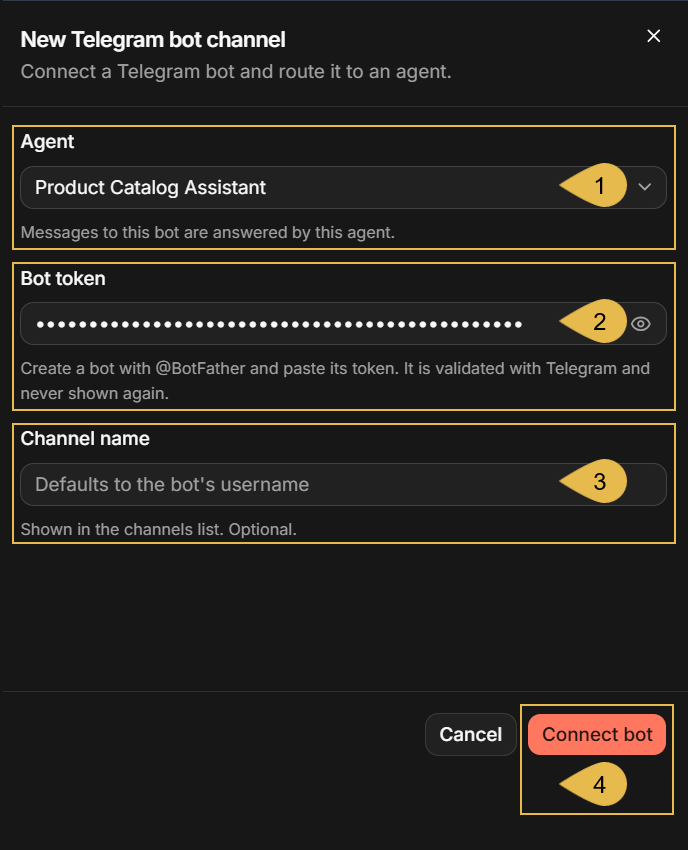

1. **Agent**  
   Select the agent that will answer the bot's users. The list holds the app's agents.

   <Admonition type="info" title="">

   When the form is opened from the **Add agent** wizard, the channel is added for the new agent and this field is absent.

   </Admonition>

2. **Bot token**  
   Paste the token you received from @BotFather. The field shows the token as dots; click the eye icon to reveal it.  
   Quill validates the token with Telegram when the channel is added, and never displays it again afterwards.
3. **Channel name**  
   This field is optional. If you leave it empty, Quill will name the channel after the bot's username, e.g., `@NorthwindCatalogBot`.
4. **Connect bot**  
   Click to add the channel. If Telegram rejects the token, or the bot is already connected to another channel, the form will
   report the error and no channel will be added.

</ContentFrame>

<ContentFrame>

### Checking the new channel

The new channel appears in the **Channels** section:

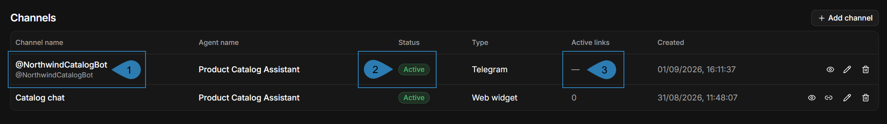

1. **Channel name**  
   The channel's name, with the bot's username beneath it.  
   In this example the name was left empty, so the channel is named after the username.
2. **Status**  
   **Active**: the channel is enabled; **Disabled**: the channel is paused.  
   Pausing and resuming a channel is described in
   [Dashboard: Channels view](../dashboard/channels-view.mdx#pausing-and-resuming-a-channel).
3. **Active links**  
   Embed links belong to web widget channels; a Telegram bot channel has none, so the column shows a dash.

</ContentFrame>

</Panel>

<Panel heading="Chatting with the bot">

Once the channel is added, the bot is reachable by anyone on Telegram: a user who finds the bot, by its username or through a
search, can open a private chat with it and ask questions, and the agent will answer from the app's data.  
The users need no account with Quill and no instructions. This section describes the chat as an end user experiences it, so that
you know what to expect and what to tell your users.

<ContentFrame>

### Starting a conversation

A first chat with a bot opens in Telegram with a **Start** button, and clicking the button sends the `/start` command.  
The bot answers with a greeting, and from then on every message the user sends is a question to the agent.

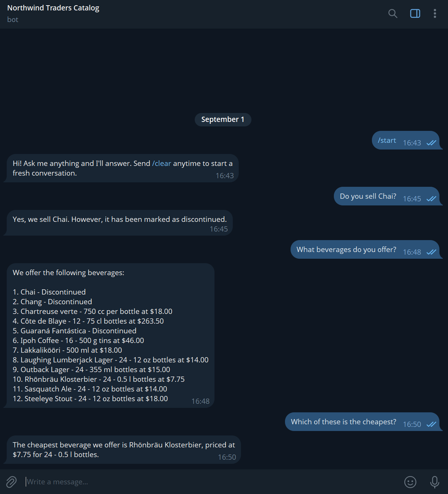

The reply is streamed into the chat as the agent composes it.  
An answer longer than Telegram's message limit is delivered in several messages.  
The conversation keeps its context, so a follow-up question like "Which of these is the cheapest?" is understood against the
earlier answer.  
Messages a user sends while the bot is still answering are gathered and answered together, as a single question, as long as the
chat's queue has room; see [Telegram bot limitations](#telegram-bot-limitations).  
The bot recognizes only two Telegram commands: `/start` and `/clear`. Any other string is handled as text, even if preceded by `/`.

</ContentFrame>

<ContentFrame>

### Clearing the conversation

A conversation lasts one day at most: at midnight UTC, the next message opens a fresh conversation, and the agent no longer sees
the earlier messages.  
A user can also start afresh at any moment by sending `/clear`. The bot confirms, and the next message opens a new conversation.

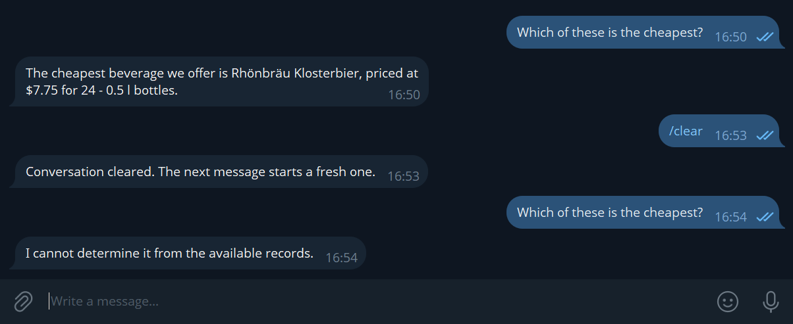

In the chat above, the question answered before `/clear` can no longer be answered after it, since the list the question referred to
is no longer part of the conversation.  
Clearing also deletes the conversation from the app's **Conversations** view in the management dashboard.

</ContentFrame>

<ContentFrame>

### Messages the bot ignores

The bot answers text only. A photo, a document, a sticker, or a voice message gets no reply.  
A contact card is accepted only when an agent parameter takes the user's phone number, as described in
[Binding agent parameters](#binding-agent-parameters); otherwise the card is ignored as well.  
The bot answers in private chats only. Added to a group, the bot posts one refusal and then stays silent in the group.

</ContentFrame>

</Panel>

<Panel heading="Binding agent parameters">

Some agents have **parameters**: values the agent's queries require, and that must come from the channel rather than be chosen by
the LLM. e.g., the phone number of the customer whose orders the agent looks up.  
When you add a Telegram bot channel for such an agent, the form asks you to bind each parameter to a source, which can be:

* A constant value that you type, which is then the same for all bot users.
* A detail of the Telegram user who is messaging the bot: the user's Telegram id, username, or phone number.  
  The parameter then carries a different value for each user, so that each user is answered about this user's own data.

This section describes the sources a parameter can be bound to, and what a user meets when the bot needs the user's phone number.

<ContentFrame>

### Choosing a source for each parameter

When the selected agent has parameters, the channel form presents a **Parameters** section with one row per parameter, labeled
with the parameter's name, e.g., `customerPhone`.  
In each parameter row, select where the parameter's value comes from:

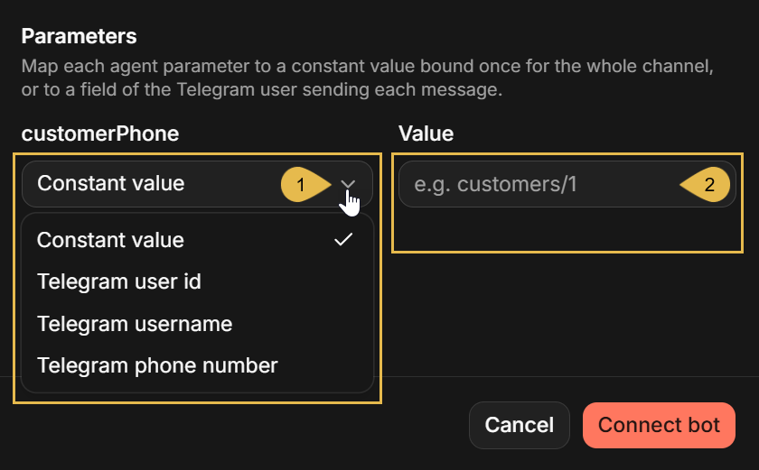

1. **The parameter's source**  
   Select the source from the list:
   * **Constant value**  
     A value that you type in the form. Quill will then pass this value to the agent with every message, from every user. e.g., to
     mark every user of this bot as a member of a specific customer group.
   * **Telegram user id**  
     The numeric id of the Telegram user who sent the message.
   * **Telegram username**  
     The Telegram username of the user who sent the message, without the `@`. A user who has no username set will be asked to add
     one before the agent answers.
   * **Telegram phone number**  
     The phone number of the user's Telegram account. The user will be asked to share the number once, as described in
     [Sharing the phone number](#sharing-the-phone-number).

   The user id, username, and phone number sources tie the answers to the Telegram user, and suit an app whose data holds these
   details.
2. **Value**  
   The value to bind when the source is **Constant value**.

In this article's example, `customerPhone` is bound to **Telegram phone number**, as the following sections show.  
The bindings can be changed later in the channel's **Parameters** tab, described in the
[Parameters](#the-parameters-tab) tab section of Managing the channel.

</ContentFrame>

<ContentFrame>

### Sharing the phone number

When a parameter is bound to the account's phone number, the bot asks for the number right after `/start`, or before answering the
first question:

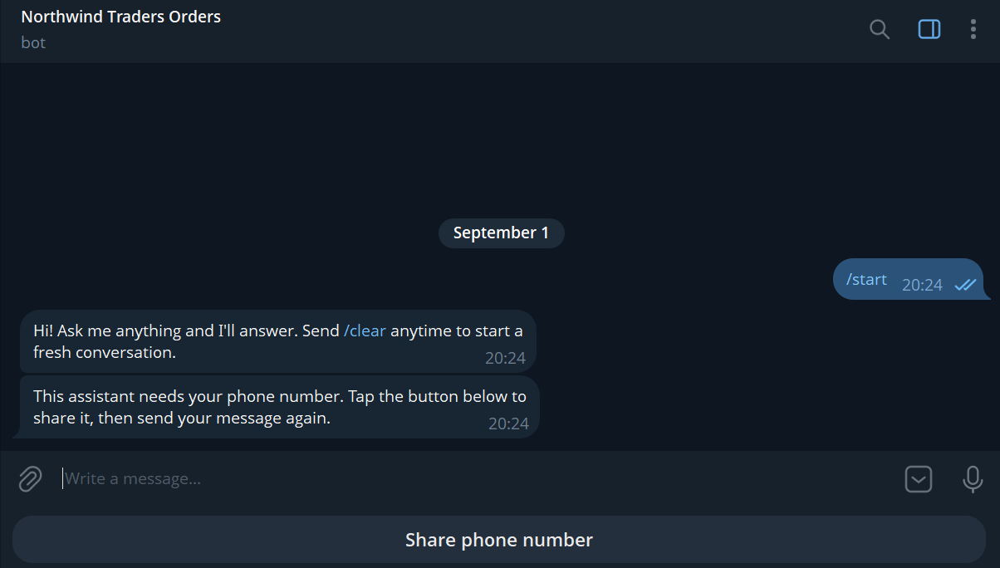

The request comes with a **Share phone number** button, which Telegram shows in place of the keyboard.  
Pressing the button asks the user to confirm sharing the number, and then posts the user's contact card to the chat.

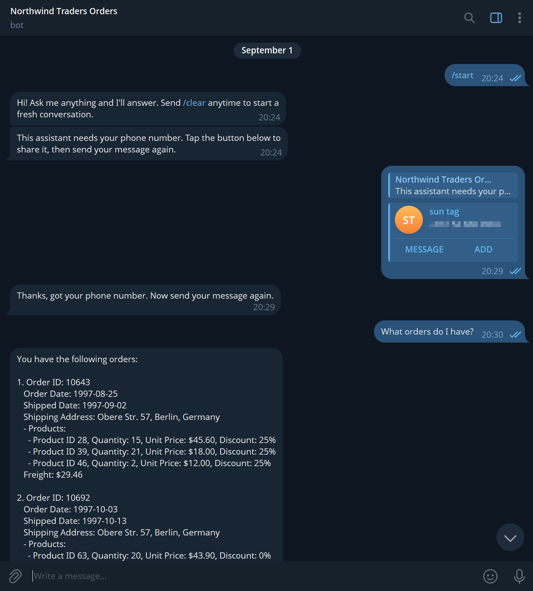

* The bot confirms that the number was received.  
  Questions sent before the number is shared are not answered, and have to be resent once it is shared.
* From then on the number is passed to the agent with every message from this user.  
  Its use is up to the agent's queries: in this example, they find the customer's own orders.
* Telegram sends the number as the user's contact card.  
  The bot will only accept the sender's own card: a card taken from the user's address book, holding another person's number,
  will be refused, and the request will be repeated.

</ContentFrame>

<ContentFrame>

### Returning users

The shared number is kept for the channel and the Telegram user. In later chats the user is answered right away, and neither
`/clear` nor the daily roll of the conversation makes the bot ask for the number again:

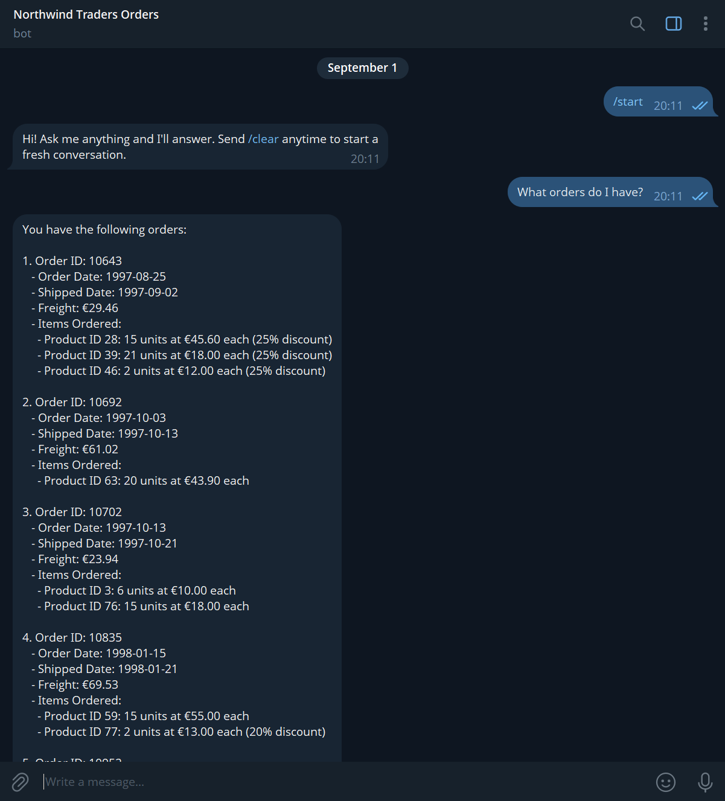

A new channel, even one added for the same bot, knows nothing of earlier shares and asks the user to share the phone number again.

</ContentFrame>

</Panel>

<Panel heading="Managing the channel">

Once added, the channel is managed from its details view, described in
[Dashboard: Channels view](../dashboard/channels-view.mdx): the view's header carries the **Pause**/**Resume** button and the **⋮**
menu with **Edit** and **Delete**, common to every channel type, and the tabs below the header are specific to the channel type.

To open the details view, open the app from **My apps** in Quill's management dashboard, select **Channels** in the sidebar, and
click the channel's box:

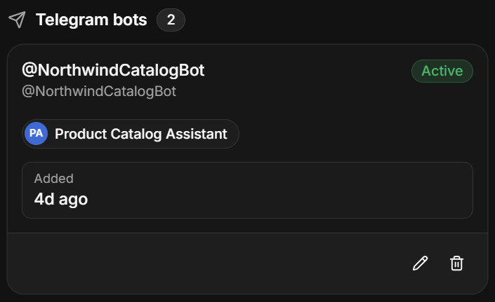

---

<ContentFrame>

### Pausing and deleting the channel

To pause or resume the channel, click **Pause**/**Resume** in the header; to delete it, select **Delete** in the header's **⋮** menu.

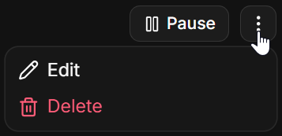

Both actions are explained in the Channels view article, in
[Pausing and resuming a channel](../dashboard/channels-view.mdx#pausing-and-resuming-a-channel) and
[Deleting a channel](../dashboard/channels-view.mdx#deleting-a-channel). Each of them also has a Telegram side, explained here:

* A paused bot stops answering, and messages users send meanwhile are held by Telegram for up to 24 hours, to be answered if
  the channel is resumed within this time.
* A deleted channel stops the bot, but the bot itself remains yours on Telegram, and its token can be used to connect it again.

</ContentFrame>

<ContentFrame>

### Rotating the bot token

To replace the bot token, select **Edit** in the header's **⋮** menu, and rotate the token in the **Edit channel** form.  
If you have @BotFather issue a new token for any reason (e.g., because the existing token leaked), you can switch the channel to
the new token here.

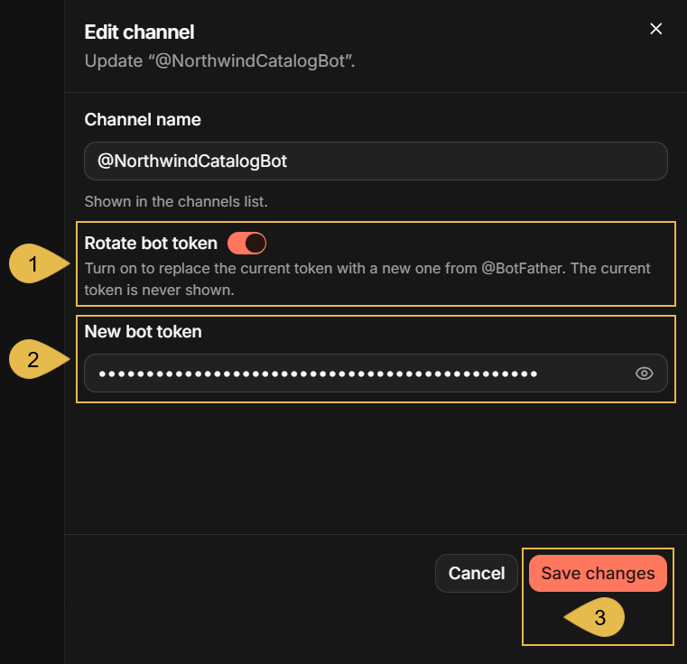

1. **Rotate bot token**  
   Turn the toggle on to replace the current token.
2. **New bot token**  
   Paste the new token. Quill will validate the token with Telegram before saving it.  
   The token has to belong to the same bot as the current one; the token of a different bot is refused.
3. **Save changes**  
   Click to save.  
   The bot continues to answer under the new token; the old token is no longer used.

</ContentFrame>

<ContentFrame>

### The tabs of the details view

The details view presents an informative **Connect** tab, a **Parameters** tab that allows you to change the bindings of the
agent's parameters, and a **Bot messages** tab that allows you to replace the bot's own messages with texts of yours:

---

#### The Connect tab

The **Connect** tab shows the bot's address on Telegram, which you can hand to your users so they can open a chat with the bot,
and the two commands a user needs in the chat, `/start` and `/clear`.

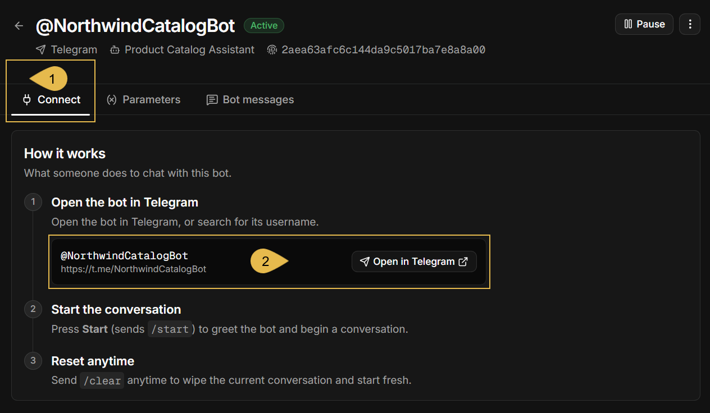

1. **Connect**  
   Open the Connect tab.
2. **@NorthwindCatalogBot**  
   The bot's address on Telegram: the link `https://t.me/<username>`, formed from the bot's username, which your users can open
   in any Telegram client.  
   Click **Open in Telegram** to open a chat with the bot in your own Telegram client.

---

#### The Parameters tab

The **Parameters** tab lists the agent's parameters and the source each of them is currently bound to, as set when the
channel was added, and lets you change the bindings.  
A parameter that is added to the [agent configuration](../getting-started/adding-an-ai-agent.mdx#modifying-the-agent-configuration)
after the channel was added appears in this tab unbound, and the bot will not answer until the parameter is bound: users are told
that the assistant is not fully configured yet.

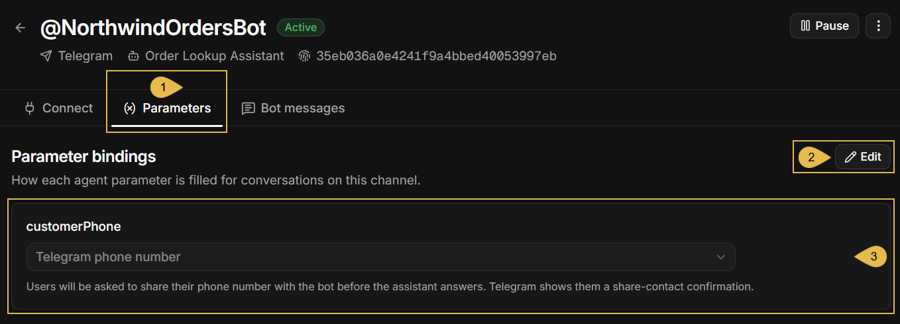

1. **Parameters**  
   Open the Parameters tab.
2. **Edit**  
   Click to make the bindings editable, and click **Save** when done.
3. **customerPhone**  
   The example agent has one parameter, `customerPhone`: the phone number its queries use to find a customer's orders
   (see [Binding agent parameters](#binding-agent-parameters)).  
   Each row shows a parameter's name, as in the agent's configuration, and the source the parameter is bound to; here, the
   Telegram phone number.

---

#### The Bot messages tab

Besides replying to user messages, the bot sends messages of its own: the greeting, the confirmation after `/clear`, the requests
for the user's details, and the notices sent when the bot cannot answer.  
The default text of each of these messages is shown in the **Bot messages** tab, and can be replaced with a text of your own.

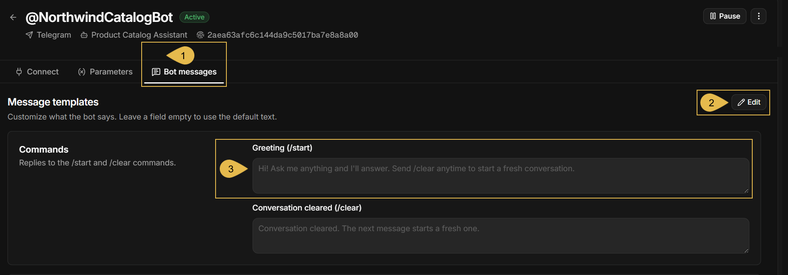

1. **Bot messages**  
   Open the Bot messages tab.
2. **Edit**  
   Click to make the message fields editable, and click **Save** when done.
3. **Greeting (/start)**  
   The bot's reply to `/start`. Type a text of your own, or leave the field empty to keep the default text.

<Admonition type="note" title="">

The available messages are arranged in the **Bot messages** tab by groups, as listed below. In the example above, only the
**Commands** group is visible.

* **Commands**: the replies to `/start` and `/clear`.
* **Collecting details**: the requests for a username or a phone number, the label of the **Share phone number** button, and the
  confirmations.
* **Errors & limits**: the notices sent when the agent is not fully configured, when a chat is overloaded, when a message failed,
  and when the bot is added to a group.

</Admonition>

</ContentFrame>

</Panel>

<Panel heading="Telegram bot limitations">

A Telegram bot channel is designed to allow any Telegram user to reach the bot and be answered by the agent.  
The limits below follow this design and Telegram's own rules. None of them can be changed in the channel's settings.

* **Anyone on Telegram can chat with the bot.**  
  The channel cannot select the users that will have access to the bot: any Telegram user who finds the bot can ask it questions.  
  Agent parameters bound to the Telegram user can tie the answers to this user's own data, but cannot turn anyone away.
* **One bot per channel, one agent per channel.**
   * An agent can serve several channels at once, e.g., a chat widget on your site and a Telegram bot.
   * A channel serves the agent it was added for: it cannot serve multiple agents, or be switched to a different agent.
   * A bot can serve only the channel it was connected to. To connect a bot to a different channel, delete the channel and add a
     new channel for the bot.
* **The bot answers in private chats only.**  
  Added to a group, the bot posts one refusal and then stays silent in the group.
* **The bot answers text only.**  
  A photo, a document, a sticker, or a voice message gets no reply. A contact card is accepted only when an agent parameter
  takes the user's phone number.
* **A conversation lasts one day at most.**  
  At midnight UTC the conversation ends: the next message opens a new conversation, and the agent no longer sees the earlier
  messages. A user can also end a conversation earlier by sending `/clear`.
* **Messages sent faster than the bot answers may go unanswered.**  
  Messages a user sends while the bot is still answering are queued. When the queue is full, further messages are not taken. The bot
  then sends one notice, asking the user to send the message again after the bot has replied.

</Panel>

<Panel heading="Troubleshooting">

The symptoms below are shown by a Telegram bot channel when something goes wrong, each with its likely cause and what to do about it.  
The first symptoms are seen in Quill's management dashboard: in the channel form, in the **Edit channel** form, and in the Channels
view. The rest are encountered by the bot's users in their chats with the bot on Telegram.  
The bot's messages are quoted in their default form, shown in [The Bot messages tab](#the-bot-messages-tab); a channel with
customized messages shows your texts instead.

**In the dashboard**

* **Clicking `Connect bot` fails with "invalid bot token format".**  
  Likely cause: the token pasted in the form may be incomplete or mistyped. A bot token is the bot's numeric id, a colon, and a
  secret string, e.g., `123456789:AA...`.  
  What to do: copy the whole token from @BotFather's message, as described in
  [Creating a bot using @BotFather](#creating-a-bot-using-botfather), and paste it in the form's
  [Bot token](#filling-in-the-channel-form) field.
* **Clicking `Connect bot` fails with "telegram rejected the bot token".**  
  Likely cause: the token may have been replaced using @BotFather, so Telegram no longer accepts the old one.  
  What to do: paste the token @BotFather issued last in the form's [Bot token](#filling-in-the-channel-form) field; if you are not
  sure which token is current, have @BotFather issue a new one and paste it.
* **Clicking `Connect bot` fails with "could not reach telegram" or "telegram did not respond".**  
  Likely cause: the machine running Quill may have no access to `api.telegram.org`, as required in [Prerequisites](#prerequisites);
  a firewall or a proxy blocking the address is the usual cause.  
  What to do: allow outgoing HTTPS connections from the machine running Quill to `api.telegram.org` in the firewall or proxy that
  blocks them, or ask your network administrator to.
* **Clicking `Connect bot` fails with "bot @... is already connected".**  
  Likely cause: the bot is already connected to another channel, in this app or in another app of the deployment; a bot can serve
  only one channel. When the channel is in another app, the message names that app.  
  What to do: delete the channel that holds the bot, in this app or in the app the message names, as described in
  [Pausing and deleting the channel](#pausing-and-deleting-the-channel); or create another bot using @BotFather, as described in
  [Creating a bot using @BotFather](#creating-a-bot-using-botfather), and paste the new bot's token in this form instead.
* **Clicking `Save changes` in the `Edit channel` form fails with "the token belongs to a different bot".**  
  Likely cause: the new token may have been copied from @BotFather's message about a different bot.  
  What to do: paste the token of the bot the channel was added for in the **New bot token** field of the **Edit channel** form.  
  To switch to a different bot, add a new channel for that bot instead, as described in
  [Connecting the bot to your app](#connecting-the-bot-to-your-app).
* **The channel shows as `Active` in the Channels view, but the bot does not answer.**  
  Likely cause: the bot token may have been replaced using @BotFather, so Telegram no longer answers the requests Quill makes
  with the old one.  
  The dashboard shows no warning for a replaced token, and messages users send meanwhile are lost.  
  What to do: enter the token @BotFather issued last in the channel, as described in [Rotating the bot token](#rotating-the-bot-token).
* **The channel shows as `Disabled` in the Channels view, and the bot does not answer.**  
  Likely cause: the channel was paused, using **Pause** in the header of its details view.  
  Messages users send while the channel is paused are held by Telegram for up to 24 hours, and are answered if the channel is
  resumed within this time.  
  What to do: resume the channel, as described in [Pausing and deleting the channel](#pausing-and-deleting-the-channel).

**On Telegram**

* **The bot replies "This assistant is not fully configured yet. Please contact whoever set up this bot."**  
  Likely cause: the agent may have a parameter the channel does not bind, e.g., a parameter added to the agent after the channel
  was added.  
  What to do: bind the parameter in the channel's [Parameters](#the-parameters-tab) tab.
* **The bot replies "Sorry - something went wrong handling that message. Please try again."**  
  Likely cause: the agent failed to produce the answer, e.g., because the database it queries or the LLM service it uses could not
  be reached.  
  What to do: verify that the app's database, and the LLM service behind the agent's AI connection string, can be reached. The
  connection string can be tested as described in
  [Dashboard: AI connection strings](../dashboard/ai-connection-strings.mdx#test-and-save-the-connection). Then try the bot from
  your own Telegram account.
* **The bot replies "This assistant needs your Telegram username. Set one in Telegram Settings and send your message again."**  
  Likely cause: a parameter is bound to **Telegram username**, and the user has no username set in Telegram.  
  What to do: advise the user to set a username in Telegram's settings and send the question again; or bind the parameter to
  another source, in the channel's [Parameters](#the-parameters-tab) tab.
* **The bot does not reply to a photo, a document, a sticker, a voice message, or a contact card.**  
  Likely cause: the bot answers text only; a contact card is accepted only when a parameter is bound to **Telegram phone number**.  
  What to do: advise the user to send the question as text. See [Messages the bot ignores](#messages-the-bot-ignores).
* **The bot replies "I only work in one-on-one chats. Message me directly to start a conversation." in a group, and then stays
  silent there.**  
  Likely cause: the bot was added to a Telegram group; the bot answers in private chats only.  
  What to do: hand the users the bot's address, shown in the channel's [Connect](#the-connect-tab) tab, and advise them to open a
  private chat with the bot at that address.
* **The bot replies "I'm still working through your earlier messages, so that one didn't make it. Please resend it once I've
  replied."**  
  Likely cause: the user may have sent more messages than the chat's queue can hold while an answer was still being composed.  
  What to do: advise the user to wait for the bot's reply, and then send the message again. See
  [Telegram bot limitations](#telegram-bot-limitations).
* **The bot answers from outdated information.**  
  Likely cause: the conversation may still hold earlier answers, which the agent reads along with the new question.  
  What to do: advise the user to send `/clear` and ask again, as described in [Clearing the conversation](#clearing-the-conversation).
* **The bot asks a returning user for the phone number again.**  
  Likely cause: the channel may have been deleted and added again. The number is kept per channel, so a new channel has no record
  of the number the user shared.  
  What to do: advise the user to share the number again. See [Returning users](#returning-users).

</Panel>
