import Admonition from '@theme/Admonition';
import Panel from "@site/src/components/Panel";
import ContentFrame from "@site/src/components/ContentFrame";

# Channels: Web widget
<Admonition type="note" title="">

*  A **web widget** is a Quill app [channel](../overview.mdx#channels) that opens to a chat box on your website page.  
   When a visitor to your page uses the chat box to ask a question, the channel carries the question to 
   an [agent](../overview.mdx#ai-agent) of your Quill app.  
   The agent then queries the app's internal database, and answers the visitor through the channel, in the chat box. 

* A visitor to the website needs no Quill account or any knowledge of Quill to use the chat box.  

* The chat box is embedded in your website page using an **embed link** generated by Quill.  
  Add the web widget channel and generate the embed link for the chat box using Quill's management dashboard, as explained below.  

* The chat box can also be embedded in a phone app, in a component that displays web pages as a browser does.  
  This article follows the website case.  

* A chat box embed link is valid for a period and a number of chats of your choice.  

* Each chat box opens a single conversation thread over the web widget channel. All page visitors that use the same 
  chat box take part in the same conversation; users of a different chat box participate in a different conversation.

* In this article:
   * [Prerequisites](#prerequisites)
   * [Adding the channel](#adding-the-channel)
      * [Opening the Add channel menu](#opening-the-add-channel-menu)
      * [Filling in the channel form](#filling-in-the-channel-form)
      * [Checking the new channel](#checking-the-new-channel)
   * [Generating an embed link](#generating-an-embed-link)
      * [Two ways to generate the link](#two-ways-to-generate-the-link)
      * [Setting the link limits](#setting-the-link-limits)
      * [Copying the link](#copying-the-link)
      * [Placing the embed snippet on your page](#placing-the-embed-snippet-on-your-page)
   * [Chatting through the channel](#chatting-through-the-channel)
      * [Starting a conversation](#starting-a-conversation)
      * [Invalid links](#invalid-links)
   * [Binding agent parameters](#binding-agent-parameters)
      * [Query tools](#query-tools)
      * [Query parameters](#query-parameters)
   * [Managing the channel](#managing-the-channel)
      * [Opening the channel's details view](#opening-the-channels-details-view)
      * [Pausing and deleting the channel](#pausing-and-deleting-the-channel)
      * [Editing the channel name and allowed origins](#editing-the-channel-name-and-allowed-origins)
      * [The management tabs](#the-management-tabs)
   * [Web widget limitations](#web-widget-limitations)
   * [Troubleshooting](#troubleshooting)

</Admonition>

<Panel heading="Prerequisites">

Before adding a web widget channel, make sure you have:

* **An agent to answer the chat box's users.**  
  The web widget channel is added for a specific agent, and the conversation is then carried over the channel 
  between the chat box users and the agent.  
  Learn to add an agent in [Getting started: Adding an AI agent](../getting-started/adding-an-ai-agent.mdx).
* **Editing rights on the website page you want to add the chat box to.**  
  You need these rights so you can edit the page's HTML and add to it the embed link that opens the chat box.
* **A Quill deployment with a public address that your visitors' browsers can reach.**  
  The chat box is served by your Quill deployment, not by your website.  
  A deployment running in an environment isolated from the internet, like your own machine or a private 
  company network, will be able to serve only browsers with access to this environment, e.g., your own browser.

</Panel>

<Panel heading="Adding the channel">

A web widget channel is added using Quill's management dashboard, in a short form that asks you to:  
* Select the agent that will answer the chat box's users.
* Give the channel a name.
* Specify the websites that are allowed to embed the chat box.

<ContentFrame>

### Opening the Add channel menu

Enter your app's [Channels view](../dashboard/manage-an-app/channels-view.mdx#opening-the-channels-view) by opening 
**My apps** in the management dashboard, selecting your app, and clicking the sidebar **Channels** option.  
To add a new web widget channel, click the **New channel** button and select **Web widget** in the channel types menu.

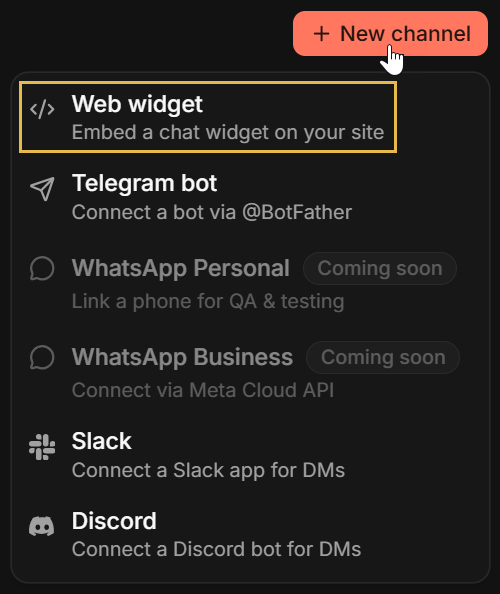

<Admonition type="info" title="">
Additional entry points to the **Add channel** menu:
* You can open the same menu using the **Add channel** button in the [app overview](../dashboard/manage-an-app/overview.mdx#channels) **Channels** section.
* The [Add agent wizard](../getting-started/adding-an-ai-agent.mdx#saving-the-agent) ends on an **Add a channel** stage carrying
  the same **Add channel** button, so a channel can be added for the new agent right after creating it.

</Admonition>

</ContentFrame>

<ContentFrame>

### Filling in the channel form

Selecting **Web widget** opens the **New web widget channel** form:

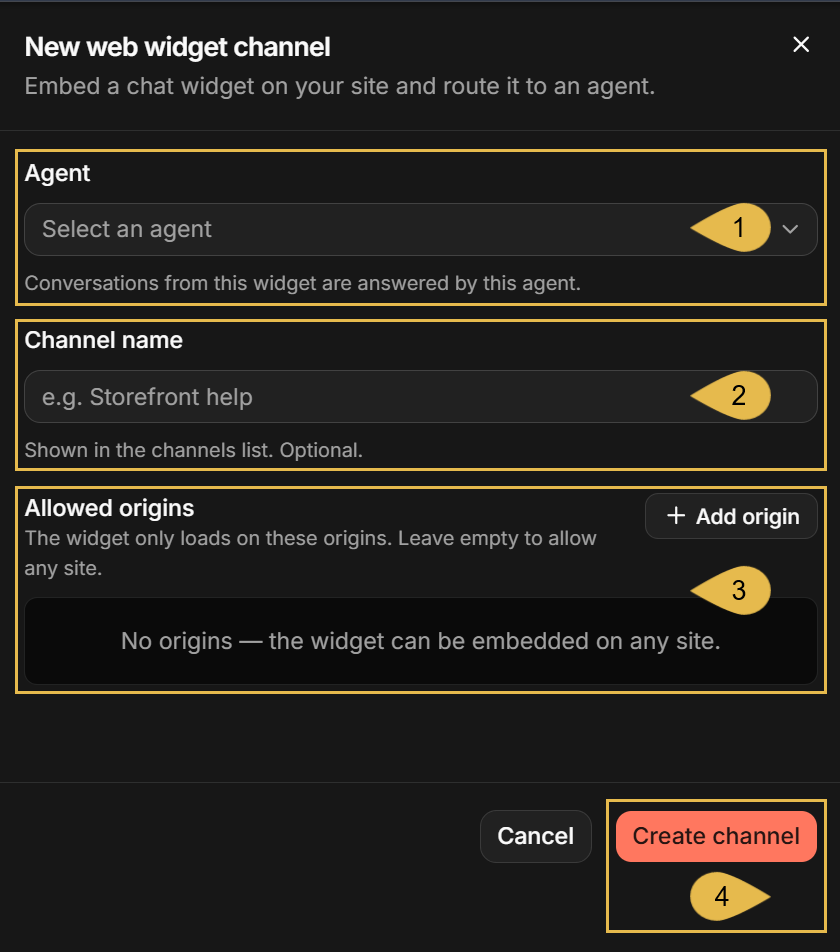

1. **Agent**  
   Select the agent that will answer the chat box's users. 
   <Admonition type="info" title="">
   When the form opens while running the **Add agent** wizard, the newly created agent 
   is selected automatically and the **Agent** field is omitted. 
   </Admonition>
2. **Channel name**  
   Enter a name for the channel (e.g., `Catalog chat`).  
    - The name will be displayed on the channel's box in the [Channels view](../dashboard/manage-an-app/channels-view.mdx).  
3. **Allowed origins**  
   Choose the websites permitted to embed the chat box.  
   Click **Add origin** and enter the website's address with no page path, one entry per website (e.g., `https://shop.example.com`).
    - While the list is empty, **any website** is permitted to embed the chat box.  
      <Admonition type="warning" title="">
      Listing your own websites here is recommended, so no other websites can embed the chat box.
      </Admonition>
    - The list can be edited later, see [Editing the channel name and allowed origins](#editing-the-channel-name-and-allowed-origins).
4. **Create channel**  
   Click to add the channel to the app.

</ContentFrame>

<ContentFrame>

### Checking the new channel

Once created, the new channel is listed in the Channels view, under the **Web widgets** group.  

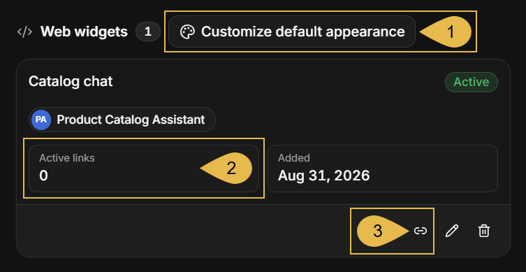

1. **Customize default appearance**  
   Set the default appearance of the app's chat boxes.  
   See [The Customize appearance tab](#the-customize-appearance-tab).
2. **Active links**  
   The number of embed links that were generated for the channel and can still be used.
3. **Generate link**  
   Generate an embed link for the channel.  
   See [Generating an embed link](#generating-an-embed-link).

The channel box also shows the channel's status (**Active** in the depicted box), the agent the channel was added for, 
and the date the channel was added.  
The pencil and trash icons are used to edit or delete the channel, see [Managing the channel](#managing-the-channel).

</ContentFrame>

</Panel>

<Panel heading="Generating an embed link">

* A **web widget channel** can carry multiple conversations between your users and the agent that you added the channel for.  
* An **embed link** is the address of a single conversation carried over the web widget channel.  
  When placed on your website page, an embed link opens a **chat box** to the conversation.  
* Joining a conversation through a chat box requires no sign-in or any other procedure.  
* The conversation ends when the embed link expires, reaches its chat limit, or is revoked.  
  When the chat box's users send their next message, they will be notified that the conversation has ended  
  and further messaging will be disabled.  
  A new conversation requires a new embed link.  

<ContentFrame>

### Two ways to generate the link

You can generate the embed link manually, or have your website generate the link.  

#### Generating the link manually:

When you generate an embed link manually and place it on your website page, the link doesn't change from one visit to another.  
This means that visiting the page multiple times always opens the same conversation, and that different visitors to the page 
use the same link and therefore share the same conversation.

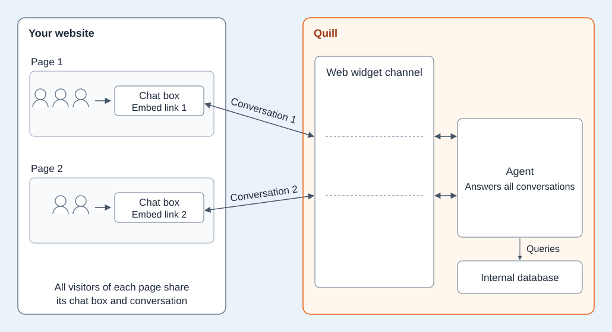
<Admonition type="note" title="">
Learn below how to generate a link manually.
</Admonition>

---

#### Having your website generate the link:

When you have your website generate the link, the link is **regenerated each time the page is loaded**.  
This means that a new conversation opens with each visit to the page, and that each visitor holds a separate conversation.

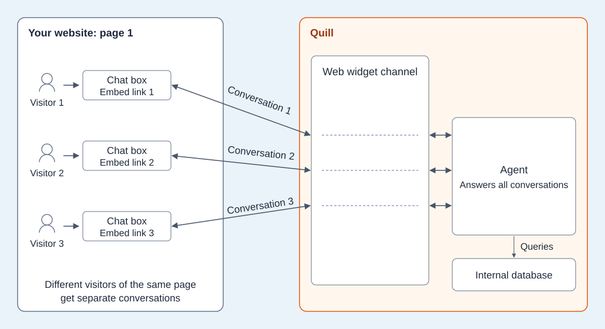
<Admonition type="note" title="">
Get the embed snippet for a link generated by your website in the [Embed tab](#the-embed-tab).  
Learn more about this option in [Embed the Chat Widget](../developer-access/embed-the-chat-widget.mdx#mint-links-from-your-own-backend).
</Admonition>
</ContentFrame>

---

Generate an embed link manually using the **Generate embed link** dialog.  
To open the dialog:  
- either click the chain icon on the channel's box in the Channels view (see [Checking the new channel](#checking-the-new-channel)),
- or click **Generate link** in the **Active links** tab of the channel's details view (see [The Active links tab](#the-active-links-tab)).

<ContentFrame>

### Setting the link limits

The **Generate embed link** dialog has two panels.  
The first panel is used to set the embed link limits, provide values for agent parameters (if the agent has any
parameters), and generate the embed link.

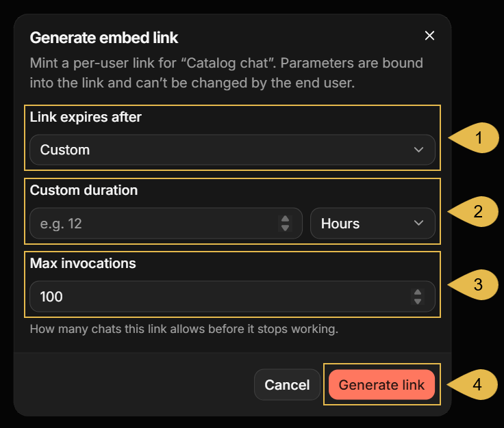

1. **Link expires after**  
   Select the period after which the link stops working: **1 hour**, **4 hours**, **24 hours**, **7 days**, or **Custom**.
2. **Custom duration**  
   Shown when **Link expires after** is set to **Custom**.  
   Enter a number and select the time unit (seconds, minutes, hours, or days), for a period of **1 minute** to **30 days**.
3. **Max invocations**  
   Enter the maximum number of chats allowed through this link before it stops working (**100** by default, up to **1,000,000**).
   A **chat** is a single question and its answer.
4. **Generate link**  
   Generate the embed link.

<Admonition type="info" title="">
If the channel's agent has parameters, an additional field is shown for each parameter,
requiring you to provide values for all parameters before the embed link can be generated.  
See [Binding agent parameters](#binding-agent-parameters).
</Admonition>

</ContentFrame>

<ContentFrame>

### Copying the link

Use the second dialog panel to copy and test the generated link. 

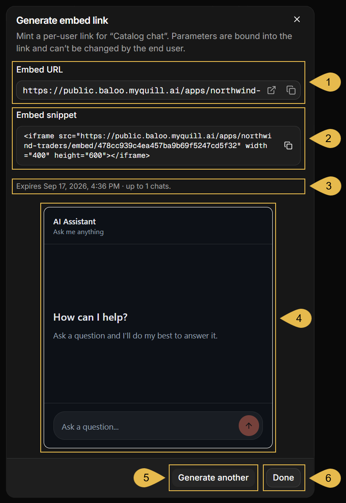

1. **Embed URL**  
   The embed link: the address of the chat box's conversation.  
   You can copy the URL and open it in a new browser tab to see and test the chat box.
2. **Embed snippet**  
   The same address, wrapped in an `<iframe>` element that you can paste into your website page.  
   See [Placing the embed snippet on your page](#placing-the-embed-snippet-on-your-page).
3. **The link's limits**  
   An informative summary of the date and time the link expires, and the number of chats it is allowed to serve, 
   as set in the first dialog panel.
4. **Preview**  
   A working chat box, opened through the new link.  
   Questions asked here are answered by the agent.  
   <Admonition type="warning" title="">
   Be aware that chats you make using the preview **are** counted, reducing the number of chats left for the link.
   </Admonition>
5. **Generate another**  
   Generate another link for the channel. The link you just generated will remain valid.  
   Clicking this button will open the first dialog panel with the values you already set.  
6. **Done**  
   Click to close the dialog.

</ContentFrame>

<ContentFrame>

### Placing the embed snippet on your page

Paste the embed snippet into your website page's HTML, where you want the chat box to appear.  

```html
<iframe src="https://public.<domain>/apps/<slug>/embed/<token>" width="400" height="600"></iframe>
```
<br />

* When embedded, the snippet is a part of your website page and you can set its width and height 
  to fit the chat box to your page layout.  
* The chat box itself is **not** created by your page, but served by your Quill deployment 
  into the `<iframe>` element when the page is loaded.  
* The embed snippet can be placed in the page in [two ways](#two-ways-to-generate-the-link):
   * **A fixed link**  
     The snippet is pasted into the page's HTML as Quill generated it.  
   * **A link per visitor**  
     Each time the page is served, your website generates a new embed link and places it in the snippet's `<iframe>` element.  
     Learn how your website can generate embed links in 
     [Mint links from your own backend](../developer-access/embed-the-chat-widget.mdx#mint-links-from-your-own-backend).

</ContentFrame>

</Panel>

<Panel heading="Chatting through the channel">

Once the embed snippet is added to your website page, any page visitor can chat with the agent through the chat box.  

<ContentFrame>

### Starting a conversation

- The chat box opens on a **welcome screen** showing a header with a title and a subtitle, a greeting, and a question field.  
  These texts, and the look of the chat box, can be modified using the channel's [Customize appearance tab](#the-customize-appearance-tab).
- Visitors can **enter questions** and send them using the arrow button or the Enter key from their keyboard.
- **The agent's reply is streamed** into the chat box as the agent composes it.
- While the reply is being composed, the arrow button turns into a **stop button**; clicking it stops the reply,
  but the chat is still counted against the link's limit.
- **Reloading the page** (e.g., by pressing F5) reloads the chat box as well.  
  As long as the embed link is valid, the reloaded chat box will contain the full conversation history.  
  See [Invalid links](#invalid-links) for the outcome when the link is no longer valid.
- Streaming, the conversation's context, and the **behavior common to all channels**, are covered in the
  [channels overview](../channels/overview.mdx#behavior-and-limitations-common-to-all-channels).

The image below shows a chat box on a catalog page, after the visitor's first question.


</ContentFrame>

<ContentFrame>

### Invalid links

An embed link becomes invalid when:  
- The link expired (i.e., the period set for it has passed).
- The link was revoked.
- The link has served the number of chats set for it.
- The channel is paused or deleted.

What a visitor sees then depends on the reason the link is no longer valid.

---

#### The link has expired or was revoked, or the channel is paused:

The chat box is replaced by a notice that the conversation has ended.  
An expired link shows this notice for about a minute, until Quill removes its record.

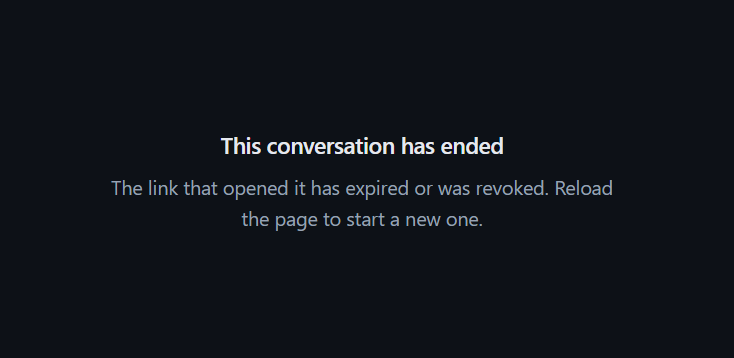

<Admonition type="info" title="">
Reloading the page opens a new conversation only when your website generates a new embed link each time it serves the page.
See [Placing the embed snippet on your page](#placing-the-embed-snippet-on-your-page).
</Admonition>

---

#### The link is unknown:

The channel was deleted, or the link expired and its record was already removed.  
Quill removes an expired link's record about a minute after it expires.  

The chat box is replaced by a notice that the conversation is not available.

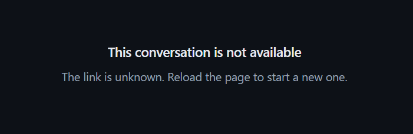

---

#### The link has served all the chats set for it:

The chat box still opens, containing the conversation history, but a new question is answered with a notice that the
conversation has reached its usage limit, and the question field is disabled.

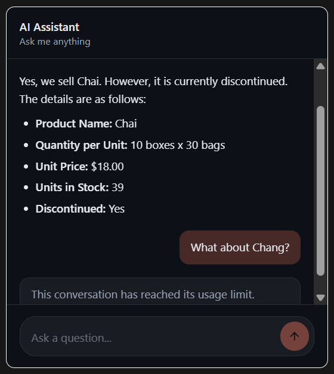

---

#### The link expired or was revoked, or the channel was paused, while the chat box was open:

The next user question is answered with a notice that the link is no longer active, and the question field is disabled.  
Reloading the page then shows the notice that the conversation has ended.

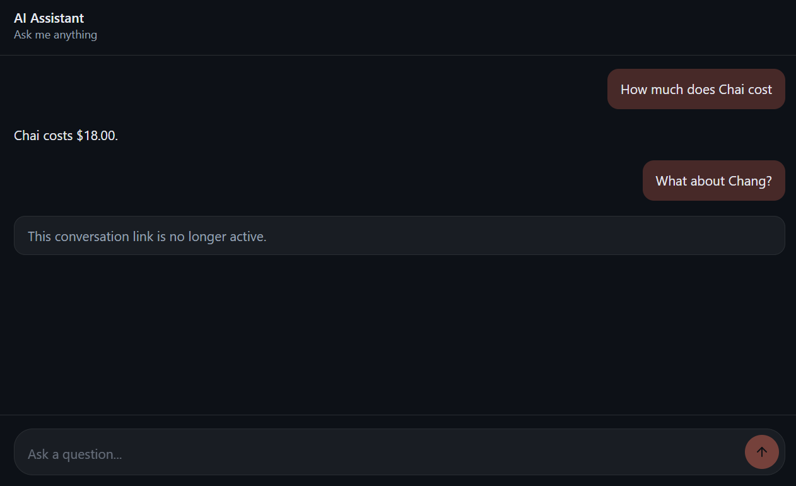

</ContentFrame>

</Panel>

<Panel heading="Binding agent parameters">

<ContentFrame>

### Query tools

- When the agent receives a chat box user's question over the channel, the agent forwards the question to the LLM.
- While composing an answer, the LLM may send the agent a query request, naming the query tool to use.  
  The agent will find the requested tool in its configuration, fetch the [RQL](https://ravendb.net/docs/article-page/latest/csharp/client-api/session/querying/what-is-rql) query
  associated with this tool, query Quill's internal database, and return the results to the LLM. 
- The LLM may send the agent several query requests before returning its final answer.  

</ContentFrame>

<ContentFrame>

### Query parameters

The RQL query associated with a query tool may include **parameters**, written as `$name` placeholders.  
e.g., `from Customers where Phone = $customerPhone`

Before running the query, the agent replaces each placeholder with a value, provided either by **the channel** or by **the LLM**.

---

#### Agent parameters: values provided by the channel

When the agent finds a parameter in the query, it checks whether the agent configuration defines an 
[agent parameter](../dashboard/manage-an-app/agents-view.mdx#agent-parameters) that carries the same name.  
If an agent parameter of the same name exists, the agent uses the value the channel provided for this parameter when
the conversation started.  

In a **web widget channel**, agent parameter values are bound to the chat box embed link:  
you provide values for all agent parameters while generating the embed link, and from then on 
the values are passed to the agent with each question asked in the chat box.  
e.g., the customer's phone number is passed to the agent with each of the customer's questions.  

* An embed link can be generated **manually**, using the [Generate embed link](#generating-an-embed-link) dialog.  
  If the channel's agent has parameters, the dialog opens with a field for each parameter, 
  labeled with the parameter's name.
  The following dialog, for example, is for a channel whose agent has a single parameter, `customerPhone`.

  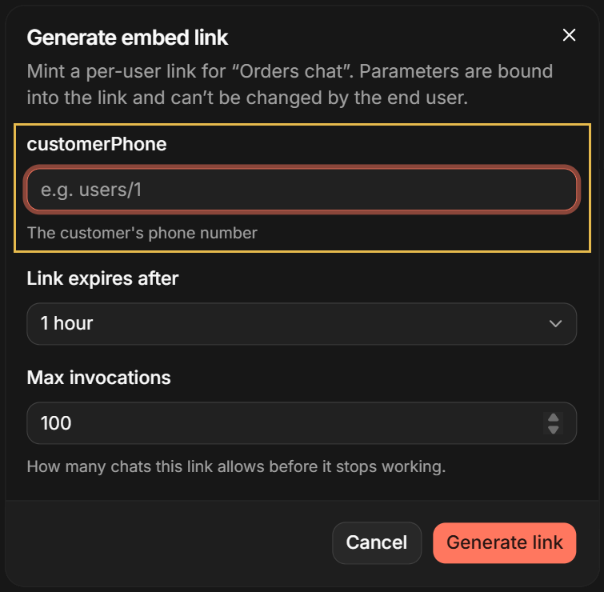

   * Every parameter needs a value before the link can be generated.  
     Strings and numbers are entered in a text field.  
     Booleans are set using a toggle.  
     Arrays are entered one value at a time using the **Add value** button.  
   * The bound values apply to every chat held over the link, and chat box users can neither see nor change them.  
   * The values bound into each active link are listed in the **Parameters** column of the
     [Active links tab](#the-active-links-tab).

* An embed link can also be generated [**automatically**](#two-ways-to-generate-the-link) by the website each time the page is loaded.  
   * A fixed embed link carries a single set of parameter values, so a website that serves many customers 
     should generate an embed link for each visitor, with the visitor's own values.  
   * Learn to generate embed links with parameter values in
     [How agent parameters are bound](../developer-access/embed-the-chat-widget.mdx#how-agent-parameters-are-bound).

<Admonition type="warning" title="">
The bound values are checked against the agent's parameters when the embed link is generated.  
If the agent's parameters are changed later, e.g., a parameter is added or its type is changed, questions asked through the links
generated before the change fail (see [Troubleshooting](#troubleshooting)). Generate new embed links after such a change.
</Admonition>

---

#### Values provided by the LLM

A query parameter's value may also be provided **by the LLM**, when the LLM requests the agent to run the query.  
The values the LLM is expected to provide are defined in the query tool's **Sample parameters object** or
**Parameters JSON schema** (see [Agent tools](../dashboard/manage-an-app/agents-view.mdx#agent-tools)).  

e.g., a query tool retrieves a product's price by the product's name.  
While requesting the query, the LLM provides the product name it found in the user's question, the agent replaces the
`$productName` placeholder with this name, runs the query, and returns the price to the LLM.  

<Admonition type="note" title="">
**Agent parameters have precedence over values provided by the LLM.**  
If the LLM provides a value for a query parameter, and an agent parameter of the same name is defined, 
the agent parameter's value will override the value provided by the LLM.  
</Admonition>

</ContentFrame>

</Panel>

<Panel heading="Managing the channel">

<ContentFrame>

### Opening the channel's details view

Once the channel is added, it gets a channel box in the Channels view's **Web widgets** group.  
  
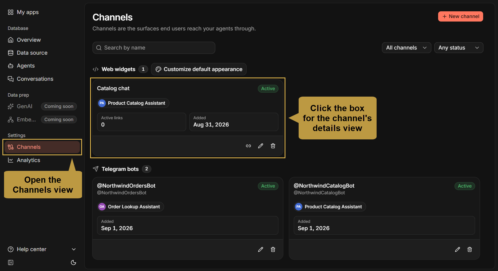

---

Click the channel box to open the channel's [details view](../dashboard/manage-an-app/channels-view.mdx#the-channel-s-details-view) with its management options.  
  
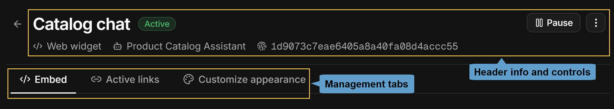
- The view's header is common to all channel types, showing the channel's status, a **Pause**/**Resume** button, 
  and a **⋮** menu with **Edit** and **Delete** controls.  
- The management tabs under the header present options specific to the channel: **Embed**, **Active links**, and **Customize appearance**.  

</ContentFrame>

<ContentFrame>

### Pausing and deleting the channel

To pause or resume the channel, click the **Pause**/**Resume** button.  
To delete the channel, select **Delete** in the header's **⋮** menu.

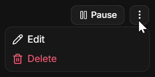

Pausing and deleting are described in the Channels view article, in
[Pausing and resuming a channel](../dashboard/manage-an-app/channels-view.mdx#pausing-and-resuming-a-channel) and
[Deleting a channel](../dashboard/manage-an-app/channels-view.mdx#deleting-a-channel).  
For a web widget channel:

* While the channel is **paused**, questions asked in its chat boxes are not answered: a user who sends 
  a question is notified that the link is no longer active, and reloading the page shows a notice saying that 
  [this conversation has ended](#the-link-has-expired-or-was-revoked-or-the-channel-is-paused).  
  **As long as the channel is paused**, no embed link can be generated for it: the **Generate link** buttons on the channel box and in the
  [Active links tab](#the-active-links-tab) are disabled.  
  **Once the channel is resumed**, any embed link that has neither expired nor been revoked will work again 
  and reloading the page shows the chat box with its conversation history.
* When the channel is **deleted**, its embed links stop working, and any page that embeds a deleted channel's link shows a notice that 
  the [conversation is not available](#the-link-is-unknown).  

<Admonition type="info" title="">
Conversations that were held for paused or deleted channels are kept, and remain available in the app's
[Conversations view](../dashboard/manage-an-app/conversations-view.mdx).
</Admonition>

</ContentFrame>

<ContentFrame>

### Editing the channel name and allowed origins

To change the channel's name or the websites allowed to embed its chat boxes, select **Edit** in the header's **⋮** menu.  

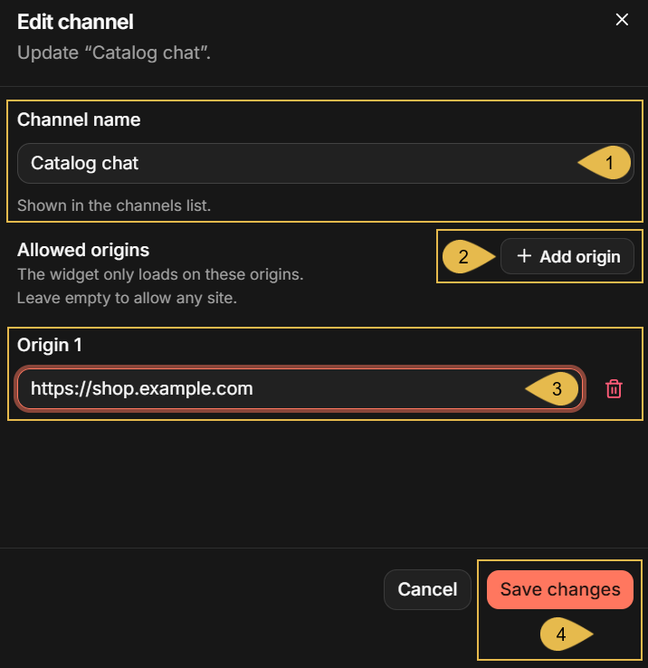

1. **Channel name**  
   [Enter the channel's name](../dashboard/manage-an-app/channels-view.mdx#editing-a-channel).  
2. **Add origin**  
   Add an entry to the list of websites allowed to embed the chat box.
3. **Origin 1**  
   An allowed origin that was already entered, composed of the website's address with no page path.  
4. **Save changes**  
   Save the form.

<Admonition type="info" title="">
* The origins list is checked each time a page loads the chat box and each time a question is sent, 
  so any change to the list is quickly applied to every existing embed link of the channel.
* When a website is removed from the list, the browser of a visitor to the site will refuse to display the chat box in the `<iframe>` element.
* A website that is added to the list can embed any of the channel's embed links, including links generated 
  before it was added to the origins list.
</Admonition>

</ContentFrame>

<ContentFrame>

### The management tabs

#### The Embed tab:

As [explained above](#two-ways-to-generate-the-link), an embed link can be generated either **manually**, 
so that all page visitors share a single conversation, or **automatically** by your website server each time 
the page is loaded, so that each visitor holds a separate conversation.  

The **Embed** tab provides the means for the second option, automatic generation of embed links by the website, 
including **the request** your website needs to send to Quill's API and the `<iframe>` element you need to place on your page 
for the returned link.  
Learn about this option in detail in [Embed the Chat Widget](../developer-access/embed-the-chat-widget.mdx#mint-links-from-your-own-backend).

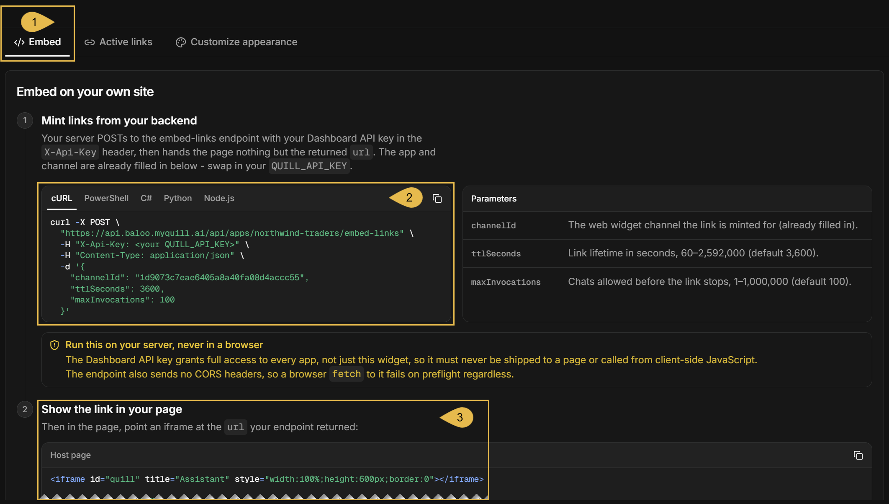

1. **Embed**  
   Open the tab.
2. **The request**  
   The request that your website server needs to send to Quill's API to generate an embed link,  
   for cURL, PowerShell, C#, Python, or Node.js.  
   The app and the channel are already filled in; you still need to enter the Dashboard API key.
   <Admonition type="warning" title="">
   The Dashboard API key grants access to every app of your deployment,  
   and **must never reach the visitor's browser**.
   </Admonition>
3. **The `<iframe>`**  
   The `<iframe>` element you need to place on your page, in which your website places the returned link.  

---

#### The Active links tab:

The **Active links** tab lists the channel's embed links that have neither expired nor been revoked, newest first.  
An embed link that has served all the chats it was allowed to serve is still listed, since it has not expired.

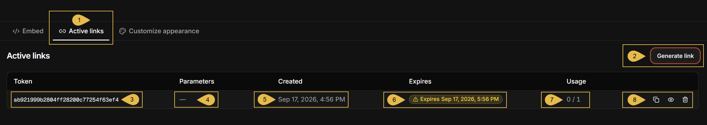

1. **Active links**  
   Open the tab.
2. **Generate link**  
   Open the [Generate embed link](#generating-an-embed-link) dialog.
3. **Token**  
   The token used to identify this link.
4. **Parameters**  
   Agent parameter values bound to the link, or a dash when the agent has no parameters.  
   See [Binding agent parameters](#binding-agent-parameters).
5. **Created**  
   The date and time the link was generated.
6. **Expires**  
   The date and time the link expires.  
   During the link's last 24 hours, the time is shown as a warning badge, as in the depicted row.
7. **Usage**  
   The number of chats held using the link so far, out of the number of chats allowed for it.  
   The count is highlighted when the link nears its limit, and marked in red when the limit is reached:

   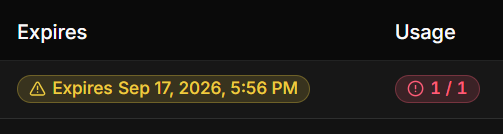

8. **Copy link**, **Preview link**, and **Revoke link**  
   **Copy** the embed link,  
   **Preview** the link in a dialog like the one that presented it when it was generated,  
   or **Revoke** the link to end its conversation at once.  

   <Admonition type="warning" title="">
   Revoking a link cannot be undone.  
   The channel's other links are not affected, and a confirmation is requested first:

   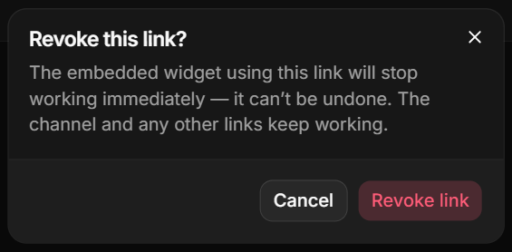
   </Admonition>

---

#### The Customize appearance tab:

The **Customize appearance** tab holds the chat box's theme: its colors, style, branding, and texts.  
 - The chat boxes of a new channel follow the app-wide default theme, defined using **Customize default appearance** in the Channels view
   (see [Checking the new channel](#checking-the-new-channel)).  
 - Changing anything in this tab and saving the settings gives the channel a theme of its own.

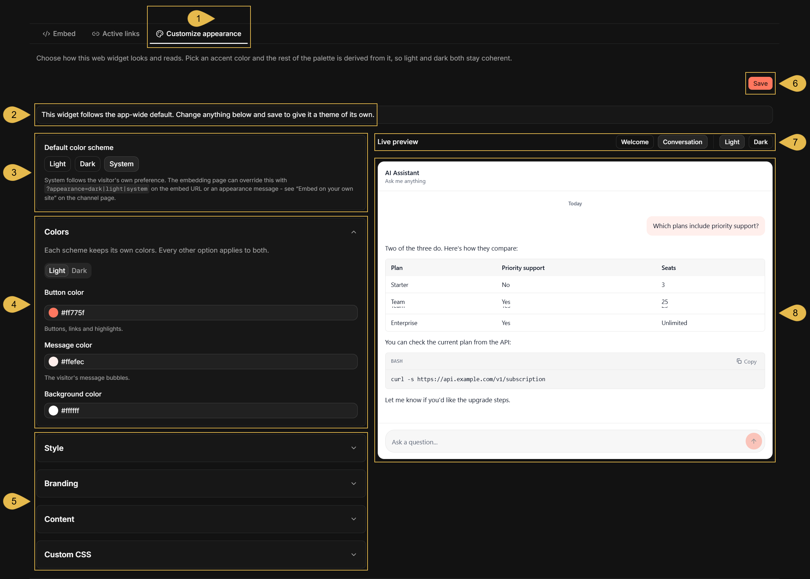

1. **Customize appearance**  
   Open the tab.
2. **The theme's status**  
   Whether the channel follows the app-wide default theme or has a theme of its own.
3. **Default color scheme**  
   Select **Light**, **Dark**, or **System** (following the visitor's own preference).
4. **Colors**  
   Set the button, message, and background colors, separately for the light and the dark scheme.
5. **Style**, **Branding**, **Content**, and **Custom CSS**  
   Expand a section to set:  
    - The chat box's style (corner radius, font, and font size).
    - The chat box's branding (header, logo, title, and subtitle).
    - The chat box's content (greeting, the suggested prompts, the question field's placeholder text, and a disclaimer).
    - Your own CSS.
6. **Save**  
   Save the theme.  
   Once the channel has a theme of its own, a **Follow app default** button next to **Save** is used to return the
   channel to the app-wide default theme.
7. **Welcome**/**Conversation** and **Light**/**Dark**  
   Select the screen and the color scheme shown in the live preview.
8. **The live preview**  
   A chat box with the theme applied, updated as you change the theme.

</ContentFrame>

</Panel>

<Panel heading="Web widget limitations">

* **A channel can list up to 32 allowed origins.**  
  Wildcards, like `*.example.com`, are not accepted.  
  See [Filling in the channel form](#filling-in-the-channel-form).
* **Anyone who has an embed link can open it, without visiting a website.**  
  The **Allowed origins** list can prevent websites from embedding the chat box, 
  but cannot prevent a user from opening the link in a browser and participating in the conversation.
* **The limits of an embed link cannot be changed after the link is generated.**  
  To allow more chats or a longer validity period, generate a new embed link.  
  See [Setting the link limits](#setting-the-link-limits).
* **The chat box accepts text only.**  
  Users can type questions in the question field, but cannot send files or images.  
  See [Starting a conversation](#starting-a-conversation).
* **Quill answers at most 60 questions per minute from a single IP address.**  
  Further questions sent from the same address within the minute are answered with a notice asking to try again in a moment.

</Panel>

<Panel heading="Troubleshooting">

<Admonition type="note" title="">

Symptoms met by the users of every channel type are listed in the channels overview, in
[Troubleshooting](../channels/overview.mdx#troubleshooting).

</Admonition>

The symptoms below are shown by a web widget channel when something goes wrong, each with its likely cause and what to do about it.  

<ContentFrame>

### In the dashboard

* **Creating or saving the channel fails with "is not an origin (scheme+host[:port] only)".**  
  Likely cause: an **Allowed origins** entry carries more than the website's address, 
  e.g., a page path (`https://shop.example.com/help`).  
  What to do: enter the website's address only (`https://shop.example.com`), as described in
  [Filling in the channel form](#filling-in-the-channel-form).
* **Creating or saving the channel fails with "wildcard '*' is not an allowed origin".**  
  Likely cause: `*` was entered in **Allowed origins** to permit every website.  
  What to do: leave the list empty to permit every website, or list each website by its address.
* **The `New web widget channel` form shows "Create an agent first" instead of its fields.**  
  Likely cause: the app has no agent yet.  
  What to do: add an agent, as described in [Prerequisites](#prerequisites), and then add the channel.
* **The `Generate link` button is disabled.**  
  Likely cause: the channel is paused.  
  What to do: resume the channel, as described in [Pausing and deleting the channel](#pausing-and-deleting-the-channel).

</ContentFrame>

<ContentFrame>

### On your website page

* **The chat box does not appear: the `<iframe>` element remains empty, or shows a browser message that the page cannot be displayed.**  
  Likely cause: the website is not in the channel's **Allowed origins** list, or is listed with a different scheme or port
  (e.g., `http://` where the site is served over `https://`, or `http://localhost` without the port the site runs on).  
  What to do: add the website's exact address to the list, as described in
  [Editing the channel name and allowed origins](#editing-the-channel-name-and-allowed-origins).
* **A question is answered with "Something went wrong. Please try again. (HTTP 403)".**  
  Likely cause: the website was removed from the channel's **Allowed origins** list after the page loaded the chat box.  
  What to do: add the website's address back to the list, as described in
  [Editing the channel name and allowed origins](#editing-the-channel-name-and-allowed-origins).
* **The chat box is replaced by a notice, or a question is answered with a notice, that the conversation has ended,
  is not available, is no longer active, or has reached its usage limit.**  
  Likely cause: the embed link is no longer valid. The cause behind each notice is given in [Invalid links](#invalid-links).  
  What to do: generate a new embed link and place it in the page instead of the invalid link, as described in
  [Placing the embed snippet on your page](#placing-the-embed-snippet-on-your-page); if the channel is paused, resume it.
* **A question is answered with "Too many requests right now. Please try again in a moment."**  
  Likely cause: more than 60 questions were sent within a minute from the user's IP address, typically because users behind 
  a shared address, like a company network, are counted together. See [Web widget limitations](#web-widget-limitations).  
  What to do: advise the user to wait a moment and send the question again.
* **A question is answered with "the value bound for parameter '...' is not a valid ...".**  
  Likely cause: a value bound into the embed link does not match an agent parameter's type, e.g., because the type was changed in
  the agent after the link was generated.  
  What to do: generate a new embed link with a valid value, as described in [Binding agent parameters](#binding-agent-parameters).
* **A question is answered with "Chat failed. See server logs for details."**  
  Likely cause: the agent failed to produce the answer, e.g., because the LLM service or the app's database could not be reached,
  or because the agent has a parameter that the link does not bind (a parameter added to the agent after the link was generated).  
  What to do: verify that the LLM service behind the agent's AI connection string can be reached, as described in
  [Dashboard: AI connection strings](../dashboard/ai-connection-strings.mdx#test-and-save-the-connection); if the agent's
  parameters were changed, generate a new embed link. The server logs name the exact error.

</ContentFrame>

</Panel>
