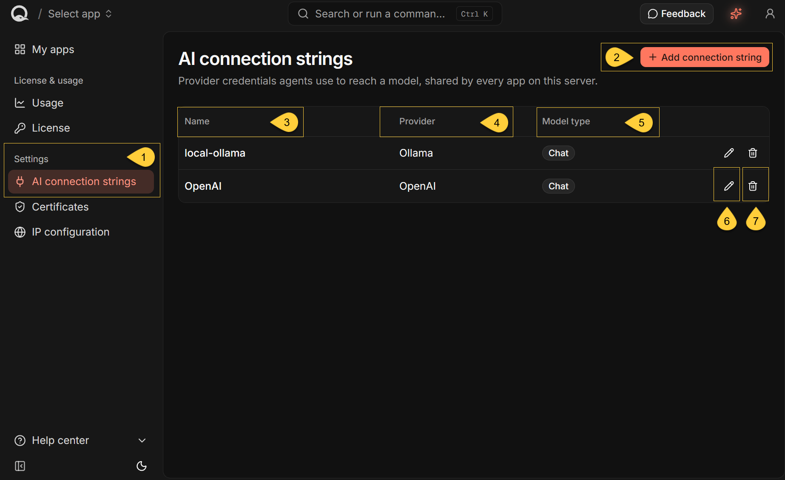
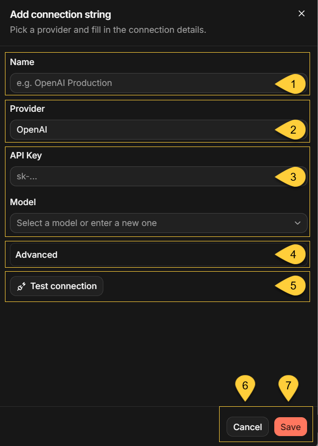
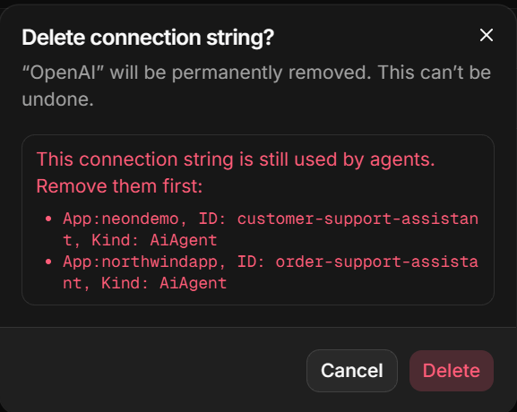

import Admonition from '@theme/Admonition';
import Panel from '@site/src/components/Panel';
import ContentFrame from '@site/src/components/ContentFrame';

<Admonition type="note" title="">

* An **AI connection string** contains the provider connection details and model settings that an agent uses to reach a language model.

* AI connection strings are **server-wide** and shared by every app in Quill.  
  Create each connection string once; you do not configure a separate copy for each app.

* Agents refer to connection strings by name.  
  Select a connection string when you create or edit an agent. 
  {/* TODO: Add a link to "Add an AI agent article */}

* In this article:
  * [The AI connection strings view](#the-ai-connection-strings-view)
  * [Add an AI connection string](#add-an-ai-connection-string)
    * [OpenAI settings](#openai-settings)
    * [Azure OpenAI settings](#azure-openai-settings)
    * [Ollama settings](#ollama-settings)
  * [Test and save the connection](#test-and-save-the-connection)
  * [Edit an AI connection string](#edit-an-ai-connection-string)
  * [Delete an AI connection string](#delete-an-ai-connection-string)

</Admonition>

<Panel heading="The AI connection strings view">
    
The Dashboard lists all **server-wide AI connection strings**, including strings created directly through RavenDB rather than from this dashboard.
It does not list database-specific AI connection strings.    
    
    

1. In the Dashboard, select **AI connection strings** under **Settings**.

2. **Add connection string**  
   Opens a side panel for creating an AI connection string.

3. **Name**  
   The name used to identify the connection string in the Dashboard and when selecting it for an agent.

4. **Provider**  
   Shows the configured language model provider.

5. **Model type**  
   Shows whether the connection string is for `Chat` or `Text embeddings`.  
   Quill agents require `Chat`.

6. **Edit**  
   Opens a side panel for editing the connection string's settings.

7. **Delete**  
   Opens a confirmation dialog for permanently deleting the connection string.
    
If no server-wide AI connection strings have been configured, the table displays **No connection strings yet.**  
To finish creating an agent, its app must have an available `Chat` connection string that uses a supported provider.    

</Panel>

<Panel heading="Add an AI connection string">

 

1. **Name**  
   Enter a name that identifies the connection string to your agents.
    
    <Admonition type="caution" title="">
    Use a unique name. 
    Creating a connection string with an existing name replaces the settings stored under that name without displaying a warning. 
    Every agent that refers to the name will then use the replacement settings.
    </Admonition>

2. **Provider**  
   Select **OpenAI**, **Azure OpenAI**, or **Ollama**.

3. **Connection details**  
   Enter the provider connection details and model settings described below.
    
   The **Model** field suggests available models when Quill has the connection details needed to contact the provider:  
   the API key for OpenAI, the API key and endpoint for Azure OpenAI, or the URI for Ollama.  
   You can also enter a model that does not appear in the suggestions.

4. **Advanced**  
   Expand **Advanced** to configure optional settings for the selected provider.

5. **Test connection**  
   Tests the current settings without saving the connection string.

6. **Cancel**  
   Closes the side panel without saving.  
   If you have unsaved changes, Quill asks you to confirm before discarding them.

7. **Save**  
   Tests the current settings if needed and saves the connection string only after verification succeeds.

---
    
You can create multiple connection strings for the same provider.  
This allows different agents to use different credentials, endpoints, or models from that provider.

---    

<ContentFrame>

### OpenAI settings

| Field       | Required | Description                                                                       |
| ----------- | -------- | --------------------------------------------------------------------------------- |
| **API Key** | Yes      | The API key used to authenticate with OpenAI.                                     |
| **Model**   | Yes      | The model the agent will use. Suggestions are loaded after you enter the API key. |

The **Advanced** section contains:

| Field                          | Description                                                                                             |
| ------------------------------ | ------------------------------------------------------------------------------------------------------- |
| **Endpoint (optional)**        | Overrides the default OpenAI endpoint. Use this for an OpenAI-compatible provider.                      |
| **Organization ID (optional)** | Sets the `OpenAI-Organization` request header.                                                          |
| **Project ID (optional)**      | Sets the `OpenAI-Project` request header.                                                               |
| **Enable prompt cache**        | Reuses cached prompt prefixes across conversation turns to reduce latency and cost. Enabled by default. |
| **Set temperature**            | Overrides the model's default randomness with a value from `0` to `2`.                                  |

When you enter a custom endpoint that is not hosted by OpenAI, the side panel displays an **Experimental provider** warning.    

</ContentFrame>

<ContentFrame>

### Azure OpenAI settings

| Field               | Required | Description                                                                                               |
| ------------------- | -------- | --------------------------------------------------------------------------------------------------------- |
| **API Key**         | Yes      | The API key used to authenticate with the Azure OpenAI resource.                                          |
| **Endpoint**        | Yes      | The endpoint of the Azure OpenAI resource, such as `https://my-resource.openai.azure.com/`.               |
| **Model**           | Yes      | The model used by the connection string. Suggestions are loaded after you enter the API key and endpoint. |
| **Deployment Name** | Yes      | The name of the Azure OpenAI deployment that serves the model.                                            |

The **Advanced** section contains **Enable prompt cache** and **Set temperature**,  
with the same behavior described for [OpenAI](#openai-settings).

</ContentFrame>

<ContentFrame>

### Ollama settings

Ollama is marked **Experimental**.  
The results produced by a local model can be significantly worse than those produced by a hosted model.

| Field     | Required | Description                                                                                                                    |
| --------- | -------- | ------------------------------------------------------------------------------------------------------------------------------ |
| **URI**   | Yes      | The address of the Ollama server. It is prefilled with `http://localhost:11434/`; Quill loads model suggestions from this URI. |
| **Model** | Yes      | The model the agent will use. You can select a suggested model or enter its name.                                              |

The **Advanced** section contains:

| Field               | Description                                                                                                                |
| ------------------- | -------------------------------------------------------------------------------------------------------------------------- |
| **Thinking mode**   | Controls whether the model exposes its reasoning steps before answering. Select **Default**, **Enabled**, or **Disabled**. |
| **Set temperature** | Overrides the model's default randomness with a value from `0` to `2`.                                                     |

The URI must be reachable from inside the Quill container.  
If Ollama runs outside that container, do not use `localhost`;  
from inside the container, `localhost` refers to the container itself.

</ContentFrame>

</Panel>

<Panel heading="Test and save the connection">

**Test the connection**

Click **Test connection** to verify that:

* Quill can reach the provider using the entered connection details and the selected model can complete a request.
* The selected model supports function tools, which every Quill agent requires.

When both checks pass, the button changes to **Connection verified**.  
If verification fails, the side panel displays the reason so you can correct the settings or select a different model.

A verified result applies only to the provider and settings that were tested.
Changing the selected provider or any of its settings clears the verified result and changes the button back to **Test connection**.

---
    
**Save the connection string**

You do not need to test the connection separately before saving.
If the current settings have not already been verified, clicking **Save** or **Save changes** runs the same verification.
Quill saves the connection string only if verification succeeds.

---    
    
**Close without saving**

If you close the **Add connection string** or **Edit connection string** side panel with unsaved changes,
Quill asks you to confirm before discarding them.

</Panel>

<Panel heading="Edit an AI connection string">

Click the edit icon in the connection string's row to open the **Edit connection string** side panel:  

  * The side panel displays the stored connection-string settings.
  * The **Name** field is disabled and cannot be changed because agents and tasks refer to the connection string by name.
  * For a `Chat` connection string that uses a supported provider, you can change the provider and its settings.
  * Clicking **Save changes** runs the connection test unless the current settings are already verified.

--- 
    
Saving changes updates the server-wide connection string under its existing name.  
Any agent or task that refers to that name will use the updated settings.

To use a different name, create a new connection string, update every agent or task that refers to the old connection string,
and then delete the old connection string.

<Admonition type="warning" title="">
    
#### Provider API keys can be viewed in the Dashboard    

When you edit an OpenAI or Azure OpenAI connection string, the side panel loads the complete stored provider API key.
The key is masked by default, but an authenticated Dashboard operator can reveal it by clicking the eye icon.

Treat access to the Dashboard as access to these provider credentials.  
The provider API key is separate from the [Dashboard API key](../security-and-architecture/operator-authentication.mdx) used to authenticate to the Dashboard.

</Admonition>    

</Panel>

<Panel heading="Delete an AI connection string">

Click the delete icon in the connection string's row.  
The **Delete connection string?** dialog warns that deletion is permanent. Click **Delete** to confirm.  
Quill prevents deletion while an agent or RavenDB task still refers to the connection string:  

  * If the connection string has no references, Quill permanently deletes it. This cannot be undone.
  * If at least one reference exists, Quill refuses the deletion and leaves the connection string unchanged.

---
    
If at least one reference exists, the dialog remains open and lists the references that must be removed:

    

For an agent reference, the dialog uses the format `App:<database>, ID: <agent-identifier>, Kind: AiAgent`.  
The ID is the agent identifier rather than the agent's display name.

Although the dialog describes every reference as an agent, `Kind` can also identify an `EmbeddingsGeneration` or `GenAi` task.
    
---

Remove every listed reference before trying again:

* For `AiAgent`, open the identified app.  
  In the agent's **Basic settings**, select another connection string, or delete the agent if it is no longer needed.
* For `EmbeddingsGeneration` or `GenAi`,  
  open the identified database in RavenDB Studio and reconfigure or delete the corresponding task.

After removing all references, return to **AI connection strings** and delete the connection string again.
    
---
    
<Admonition type="caution" title="">

#### Do not use Delete to check for references    

The connection strings table does not show which agents or tasks refer to a connection string.  
Quill shows these references only after refusing a deletion.  
If no references exist, **Delete** permanently removes the connection string.

</Admonition>  

</Panel>
