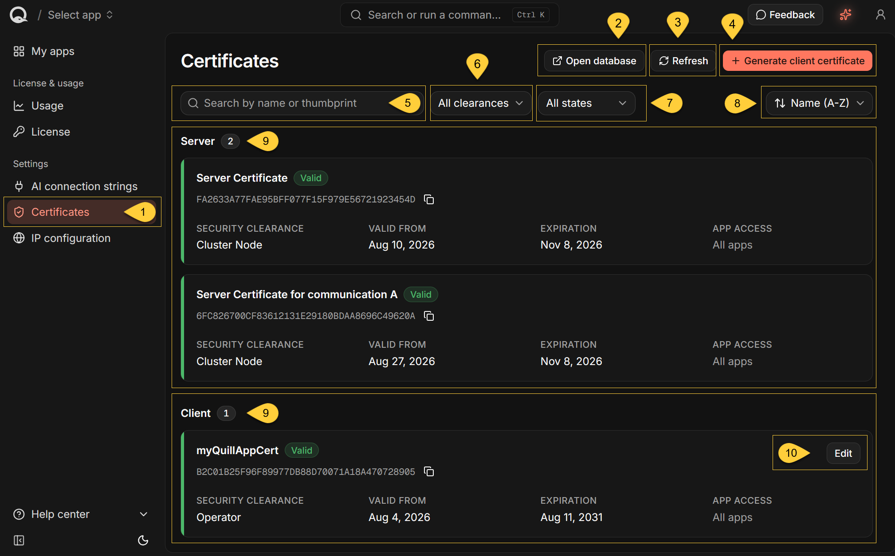
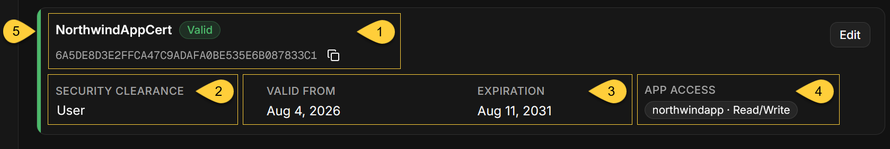
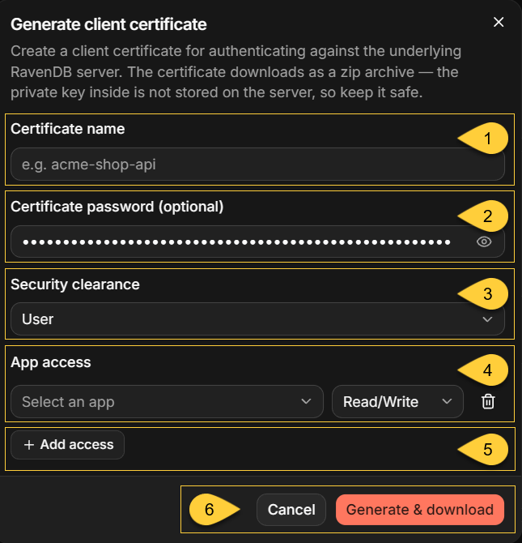
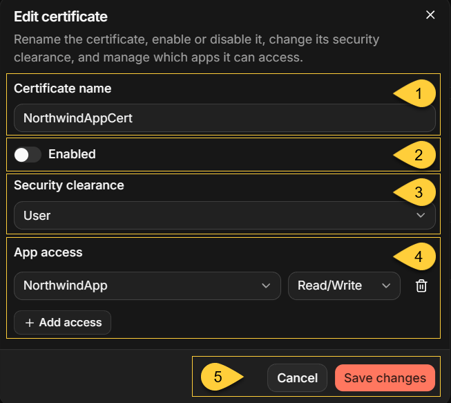

import Admonition from '@theme/Admonition';
import Panel from '@site/src/components/Panel';
import ContentFrame from '@site/src/components/ContentFrame';

<Admonition type="note" title="">

* Use the **Certificates** view to inspect the certificates recognized by the RavenDB server in your Quill instance  
  and to generate and manage client certificates for applications that connect directly to RavenDB or for browser access to RavenDB Studio.    

* Each Quill app has a separate [mirrored RavenDB database](../overview.mdx#internal-database).
  A client certificate's security clearance and app access determine which databases can be accessed with it and which operations are permitted.    

* Applications and RavenDB Studio present the client certificate directly to RavenDB, which authenticates the connection.
  The Quill web application does not handle these connections.    
  For details about routing, TLS, and certificate authentication, see [Client certificates for your applications](../security-and-architecture/network-architecture.mdx#client-certificates-for-your-applications).

* In this article:
  * [The Certificates view](#the-certificates-view)
  * [Server and client certificates](#server-and-client-certificates)
  * [Certificate information](#certificate-information)
  * [Generate a client certificate](#generate-a-client-certificate)
    * [Security clearance](#security-clearance)
    * [App access](#app-access)
    * [The downloaded archive](#the-downloaded-archive)
  * [Edit a certificate](#edit-a-certificate)
  * [Disable or remove a certificate](#disable-or-remove-a-certificate)
  * [Refresh and errors](#refresh-and-errors)

</Admonition>

<Panel heading="The Certificates view">

The Dashboard lists certificates recognized by the RavenDB server in your Quill instance,  
including certificates created directly in RavenDB Studio.

 

1. In the Dashboard, select **Certificates** under **Settings**.

2. **Open database**  
   Opens RavenDB Studio for your Quill instance in a new browser tab.  
   To access a database in Studio, your browser must present an installed client certificate that grants access to that database.

3. **Refresh**  
   Reloads the certificate list.

4. **Generate client certificate**  
   Opens a dialog for creating a client certificate.

5. **Search**  
   Filters certificates by name or thumbprint.  
   Matching is case-insensitive and supports partial values.

6. **All clearances**  
   Filters by security clearance: **Cluster Admin**, **Cluster Node**, **Operator**, or **User**.

7. **All states**  
   Filters by state: **Valid**, **Expired**, or **Disabled**.

8. **Sort**  
   Orders the list by **Name (A-Z)**, **Name (Z-A)**,
   **Expiration (soonest first)**, or **Expiration (latest first)**.

9. **Server and client certificates**  
   The **Server** section contains read-only certificates;  
   the **Client** section contains certificates that can be edited.  
    
   The count beside each section name reflects the current filters, and a section is hidden when no certificates match.  
   Learn more about these sections in [Server and client certificates](#server-and-client-certificates) below.

10. **Edit**  
    Opens a dialog for editing the certificate.  
    This button is available only for **Operator** and **User** certificates.

</Panel>

<Panel heading="Server and client certificates">

<ContentFrame>

### Server certificates

The **Server** section includes certificates that RavenDB uses for TLS and internal cluster communication.    
The section also includes certificates that an administrator creates directly in RavenDB -  
for example, through RavenDB Studio - with **Cluster Admin** or **Cluster Node** clearance.

RavenDB adds the following runtime certificates directly to the list:

  * **Server Certificate**  
    The wildcard TLS certificate provided in Quill's activation setup package.
    During activation, Quill configures nginx and RavenDB to present it on different Quill hostnames.
    Connecting clients use this certificate to verify the server's identity.
    RavenDB automatically starts the renewal process before this certificate expires.

  * **Server Certificate for communication `<node-tag>`**  
    The certificate RavenDB uses to authenticate the node when it connects as a client, such as during internal cluster communication.
    It is displayed only when it differs from the active server certificate.

Both certificate types have **Cluster Node** clearance and display `All apps` under [APP ACCESS](#app-access).   
The certificates in the **Server** section cannot be edited in the Dashboard.    

For the renewal schedule, required outbound access, and what happens if renewal fails,  
see [The TLS front and the wildcard certificate](../security-and-architecture/network-architecture.mdx#the-tls-front-and-the-wildcard-certificate).    

</ContentFrame>

<ContentFrame>

### Client certificates

The **Client** section includes registered certificates with **Operator** or **User** clearance.  
You can generate these certificates in the Quill Dashboard or create them directly in RavenDB Studio.
    
They authenticate direct connections to RavenDB, including connections from external applications and access to RavenDB Studio in a browser.
You can edit these certificates in the Dashboard.

<Admonition type="note" title="">

**Quill's internal admin certificate** does not appear in the **Client** section.

Quill loads this certificate from the activation setup package and uses it for its own connections to RavenDB.  
RavenDB trusts it as a well-known admin certificate rather than storing it as a registered client certificate,  
so it is not listed or managed in the Dashboard.

Learn more in [Quill's internal admin certificate](../security-and-architecture/network-architecture.mdx#quills-internal-admin-certificate).

</Admonition>

</ContentFrame>

</Panel>

<Panel heading="Certificate information">

1. **Certificate name and thumbprint**   
   The value beneath the certificate name is its thumbprint.  
   Select the copy icon to copy the thumbprint to the clipboard.

2. **Security clearance**  
   Shows the clearance assigned to the certificate.  
   Learn more in [Security clearance](#security-clearance) below.

3. **Validity period**  
   **VALID FROM** shows the beginning of the certificate's validity period.  
   **EXPIRATION** shows when that period ends.  
   Hover over either date to see its full timestamp.  
   Learn more in [Validity period](#validity-period) below.    

4. **App access**  
   For a **User** certificate, **APP ACCESS** lists each granted app.  
   Each badge shows `<RavenDB-database-name> · <access-level>`.  
   In the Generate and Edit dialogs, select the corresponding app by its Quill app name.  
   If no apps are granted, **APP ACCESS** displays `None`.

   For an **Operator** certificate or a certificate in the **Server** group,
   **APP ACCESS** displays `All apps` because access is determined by security clearance rather than by individual app grants.  
   Learn more in [App access](#app-access) below.    

5. **Certificate state**  
   The badge beside the certificate name shows its state.  
   The colored strip on the left also indicates the certificate's state.

   | State               | Meaning                                                                                     |
   | ------------------- | ------------------------------------------------------------------------------------------- |
   | **Valid**           | The certificate is enabled and has not expired.                                             |
   | **About to expire** | An additional badge shown on a valid certificate that expires within the next 14 days.      |
   | **Expired**         | The certificate's expiration date has passed. RavenDB rejects requests that present it.     |
   | **Disabled**        | The certificate was disabled in the Dashboard or RavenDB. RavenDB does not authenticate it. |

   The Dashboard does not display a separate notification or banner when a certificate is about to expire.  
   Use the **About to expire** badge and **Expiration (soonest first)** sorting to identify certificates that require attention.

</Panel>

<Panel heading="Generate a client certificate">

Click **Generate client certificate** to open the dialog.

 

1. **Certificate name**  
   Identifies the certificate in the Dashboard and RavenDB. Required.

2. **Certificate password (optional)**  
   Protects the `.pfx` file in the downloaded archive.  
   Neither Quill nor RavenDB stores the password, so the Dashboard cannot recover it or change the downloaded `.pfx`.

3. **Security clearance**  
   Select **Operator** or **User**.  
   See [Security clearance](#security-clearance) below.

4. **App access**  
   Appears only when you select **User** clearance.  
   Select an app and the access level to grant it.  
   See [App access](#app-access) below.

5. **Add access**  
   Adds another app-access row.  
   Use the trash icon to remove a row.

6. **Generate & download**  
   Creates the certificate, registers it with RavenDB, and downloads its ZIP archive.  
   Quill displays **Certificate “&lt;name&gt;” downloaded.** and adds the certificate to the list.

   **Cancel** closes the dialog without creating a certificate.  
   If the form has unsaved changes, Quill asks you to confirm before discarding them.

---

#### Validity period

Quill does not let you choose the validity dates. RavenDB assigns:

  * A **Valid from** date seven days before the certificate is generated.
  * An **Expiration** date five years after the certificate is generated.

The client certificate is signed by RavenDB's active server certificate.  
However, RavenDB authenticates it by matching its thumbprint against the registered certificate,  
rather than by validating its certificate chain.  
    
Renewing or replacing the server certificate therefore does not invalidate existing client certificates.

---

<Admonition type="warning" title="">

#### Certificate names are not unique

* Quill identifies certificates by thumbprint, not by name.  
  Generating a certificate with an existing name creates a separate certificate with its own thumbprint.  
  It does not replace, disable, or otherwise change the existing certificate.

* Use the displayed thumbprints to distinguish certificates that have the same name.

</Admonition>

---
    
<ContentFrame> 

### Security clearance

Security clearance determines which RavenDB databases the certificate can access and whether it can perform server-wide administrative operations.

Quill can generate certificates with two clearance levels:

* **User**  
  Accesses only the RavenDB databases for the apps selected under [App access](#app-access).  
  Its permissions in each database are determined by the assigned **Read/Write** or **Admin** access level.  
  It cannot perform server-wide administrative operations.

* **Operator**  
  Has full access to every RavenDB database in your Quill instance, including internal databases and databases created later.
  It can also perform Operator-level server operations, such as creating or deleting databases and issuing client certificates.
  It cannot perform operations reserved for **Cluster Admin**.  
    
  **App access** does not apply because Operator clearance grants access to every RavenDB database.  
  The Dashboard therefore displays **All apps** under **APP ACCESS**.

---

<Admonition type="warning" title="">

#### Prefer User clearance for your applications

* The **All apps** label understates the scope of an Operator certificate:  
  it can access every RavenDB database in the instance, not only the app databases shown in the Dashboard.

* Give applications a **User** certificate scoped to only the apps they require.

</Admonition>

---
    
The Dashboard lets you assign only **User** or **Operator** clearance.  
It can still list certificates with **Cluster Admin** or **Cluster Node** clearance,  
so these clearances are also available in the filter.    

</ContentFrame>

<ContentFrame>

### App access

For a **User** certificate, each **App access** row grants access to the RavenDB database associated with the selected Quill app.

| Access level   | What it permits  |
| -------------- | ---------------- |
| **Read/Write** | Reading and writing data and using RavenDB's non-administrative database operations. This is the default for a new row. |
| **Admin**      | Everything permitted by **Read/Write**, plus database-administration operations such as configuring ongoing tasks and connection strings, controlling indexing, and changing the revisions configuration. |

---
    
When generating a **User** certificate, you must grant access to at least one app:

* Submitting with no access rows displays **Grant access to at least one app**.
* Leaving the app selection empty displays **Required**.
* Selecting the same app more than once displays **Already listed**.

The app selector lists the apps in your Quill instance by app name.
    
---    

<Admonition type="note" title="">

#### Read-only access is not available

* RavenDB supports a **Read** access level,  
  but the Quill Dashboard does not offer it when generating or editing certificates.

* A User certificate created in RavenDB Studio with **Read** access still appears in the Dashboard, with **Read** displayed under **APP ACCESS**.  
  When you open the certificate in the **Edit** dialog, the access-level selector for that row has no selection.

* Attempting to save it displays **Read-only access is no longer supported. Pick another level.**  
  Change the grant to **Read/Write** or **Admin**, or remove the unsupported grant, before saving.

</Admonition>

</ContentFrame>

<ContentFrame>

### The downloaded archive

The archive is named `<name>_certificates.zip` and contains:

| File         | Contents                                                                                         |
| ------------ | ------------------------------------------------------------------------------------------------ |
| `<name>.pfx` | The client certificate and its private key in PKCS#12 format. Password-protected if you set one. |
| `<name>.crt` | The public certificate in PEM format. It contains no private key.                                |
| `<name>.key` | The private key in unencrypted PEM format.                                                       |

Use the `.pfx` with clients that accept PKCS#12 files.  
Use the `.crt` and `.key` pair with clients or tools that expect PEM files.

---
                
<Admonition type="warning" title="">    

#### Store the archive as a secret

* RavenDB stores the public certificate but not its private key.  
  The Dashboard therefore cannot download or recover the private key again.  
  If no usable copy remains, generate a replacement certificate and then disable or remove the old one.

* The optional certificate password protects only the `.pfx` file.  
  It does not encrypt the ZIP archive or the `.key` file.
  Anyone who obtains the archive can use the unencrypted private key to authenticate with the certificate's permissions while it remains enabled and valid.

* Do not commit the ZIP, `.pfx`, or `.key` files to source control or publish them as web assets.  
  Store them with your other application or deployment secrets.

</Admonition>

</ContentFrame>

</Panel>

<Panel heading="Edit a certificate">

In the **Client** section, select **Edit** for the certificate you want to change.

 

1. **Certificate name**  
   Changes the name stored with the certificate in RavenDB. Required.  
   Renaming does not change the certificate itself or the names of previously downloaded files.

2. **Enabled**  
   Enables or disables the certificate.  
   See [Disable or remove a certificate](#disable-or-remove-a-certificate).

3. **Security clearance**  
   Changes the clearance between **Operator** and **User**.

   * Saving with **Operator** clearance grants access to every RavenDB database and clears the stored **App access** grants.
   * Saving with **User** clearance restricts access to the apps listed under **App access**.

4. **App access**  
   Adds, removes, or changes the database permissions assigned to a User certificate.

5. **Save changes**  
   Applies the changes and displays **Certificate “&lt;name&gt;” updated.**

   **Cancel** closes the dialog without saving.  
   If the form has unsaved changes, Quill asks you to confirm before discarding them.

---

**What editing does not change**

Editing updates the certificate’s registered name, state, clearance, and permissions.  
It does not issue a new certificate or private key:

    * The thumbprint and validity dates remain unchanged.
    * Applications continue using the certificate files they already have;  
      no certificate redeployment is required after a name or permission change. 
      Existing connections may retain their previous access until they reconnect, as described in [Disable or remove a certificate](#disable-or-remove-a-certificate).
    * The Dashboard cannot change or recover the password of a downloaded `.pfx`, and it cannot download the archive again.
      If you still have the private key, you can re-export it locally with a different PFX password.  
      If the private key is unavailable, generate a replacement certificate, deploy it, and then disable or remove the old certificate.

Unlike the Generate dialog, the Edit dialog accepts a **User** certificate with no app grants.  
Removing the final row displays **No access granted — this certificate cannot reach any app.**,  
but **Save changes** remains available.

The certificate remains enabled and the Dashboard displays **None** under **APP ACCESS**,  
but it cannot access any RavenDB database after existing connections close.

</Panel>

<Panel heading="Disable or remove a certificate">

<ContentFrame>

### Disable a certificate

Disabling a certificate prevents it from authenticating new connections.

To disable a certificate, turn **Enabled** off in the **Edit certificate** dialog and select **Save changes**.  
The certificate remains in the list with the **Disabled** state,
and RavenDB rejects new connections that present it as though the certificate were unknown.

Turn **Enabled** back on to restore access. 
Clients can continue using the same certificate files.  
Retry any failed request; RavenDB re-authenticates a still-open connection that it rejected while the certificate was disabled after detecting the certificate update.
You do not need to reconnect explicitly.

</ContentFrame>

<ContentFrame>

### Delete a certificate

Deleting a certificate permanently removes a registered client certificate.  
The Dashboard does not provide a delete action; certificates must be deleted in RavenDB Studio. 
    
Before continuing:

  * To delete a **User** or **Operator** certificate, authenticate to RavenDB Studio with a different **Operator** or **Cluster Admin** certificate.
    If no suitable certificate is available, generate and install another **Operator** certificate.
    
  * To delete a **Cluster Admin** or **Cluster Node** certificate, authenticate with a different **Cluster Admin** certificate.

To delete the certificate:

    1. Select **Open database**.
    2. In RavenDB Studio, go to **Manage Server > User Access Management**.
    3. Delete the certificate.
    4. Return to the Dashboard and select **Refresh**.

Prefer disabling when you want a reversible action or want the certificate to remain visible as a record of previous access.

</ContentFrame>
    
---    

<Admonition type="warning" title="">

#### Existing connections are not terminated

* RavenDB authenticates a client certificate when a connection is established.  
  Disabling or deleting a certificate, lowering its clearance, or removing an app grant does not change the authorization already associated with an open connection.

* A client that keeps an existing connection open can therefore continue operating with its previous access until that connection closes.

* To make a known application use the new permissions, close its connections or restart the application.  
  If a certificate is compromised and every existing connection must be terminated, restart the Quill container.  
  This interrupts the entire Quill instance.

</Admonition>

</Panel>

<Panel heading="Refresh and errors">

When you open the view, the Dashboard loads the certificate list unless it can reuse a recently cached result.  
Returning to the view shortly after leaving can therefore show the existing list.

The list is reloaded after you successfully generate or edit a certificate.  
Quill does not poll for changes or reload the list when the browser window regains focus.

Select **Refresh** to reload the list at any time, especially after changing a certificate in RavenDB Studio.  
The button is disabled while a reload is in progress.

If the list cannot be loaded, the view displays:

* **Could not load certificates**
* **Refresh the page or try again in a moment.**
* A **Retry** button

If a generate or edit request fails, its dialog remains open and displays the error above the action buttons.  
The Dashboard shows the reason returned by the server when available;  
otherwise, it displays a generic message such as **Request failed with 500**.

</Panel>
