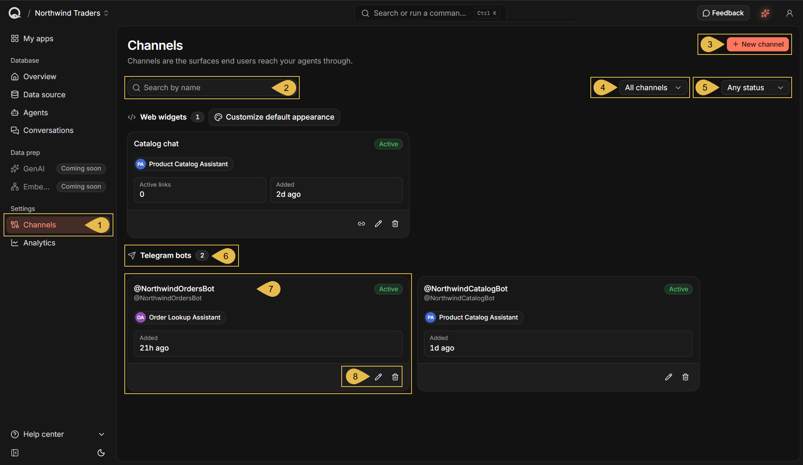
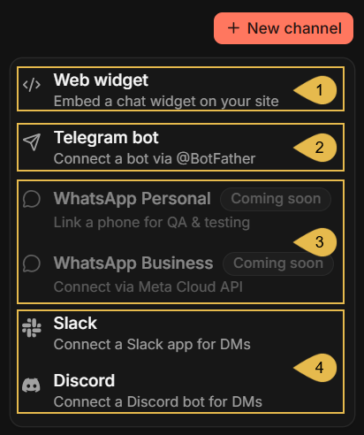
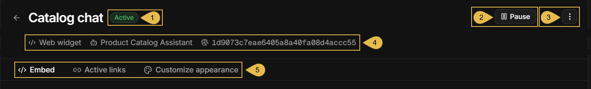
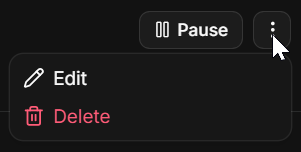
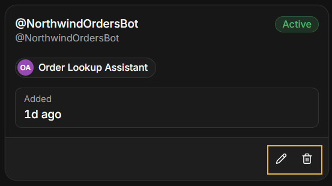
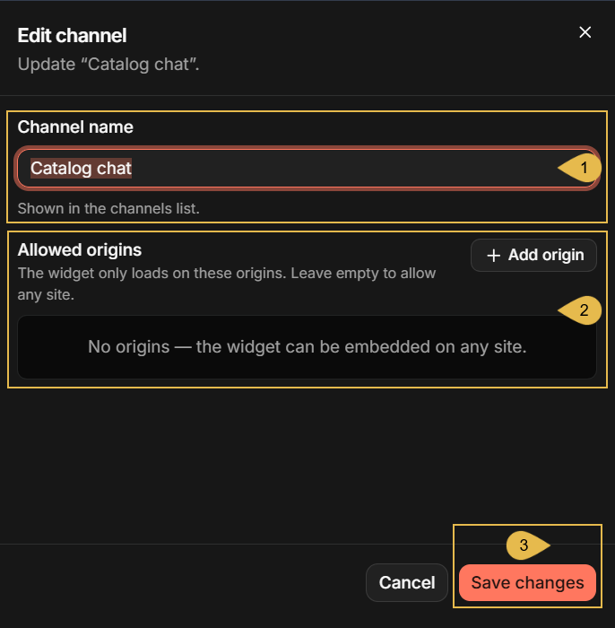
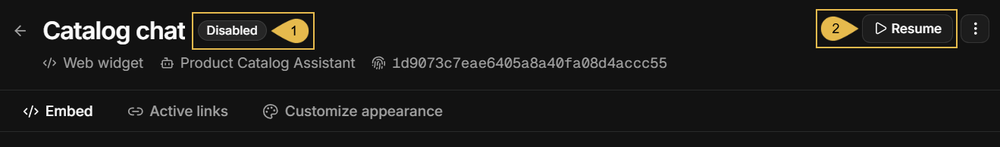
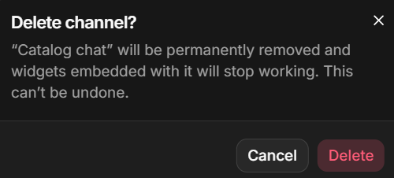
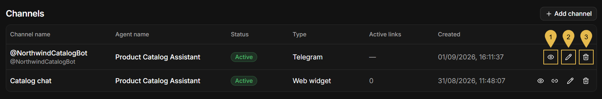

import Admonition from '@theme/Admonition';
import Panel from "@site/src/components/Panel";
import ContentFrame from "@site/src/components/ContentFrame";

# Dashboard: Channels view
<Admonition type="note" title="">

* A [channel](../overview.mdx#channels) carries the conversations between your users and one of your app's agents: a chat widget
  on your site, a Telegram bot, a Slack app, or a Discord bot.  
  The **Channels** view lists the channels you already created, and allows you to view and modify channel settings, add new
  channels, check each channel's status, and perform other channel-related tasks like pausing or deleting a channel.

* The view is opened from the app's sidebar, where it is listed under the **Settings** group.  
  The app's **Overview** also lists existing channels, in a table that offers some of the actions available through the
  Channels view.

* This page covers Channels view features that are common to all channel types.  
  Features and behaviors specific to each channel type are covered in the pages dedicated to the various types, like
  [Channels: Telegram bot](../channels/telegram-bot.mdx).

* In this article:
   * [Opening the Channels view](#opening-the-channels-view)
   * [Adding a channel](#adding-a-channel)
   * [The channel's details view](#the-channel-s-details-view)
   * [Editing a channel](#editing-a-channel)
   * [Pausing and resuming a channel](#pausing-and-resuming-a-channel)
   * [Deleting a channel](#deleting-a-channel)
   * [An additional entry point: the channels list in the Overview](#an-additional-entry-point-the-channels-list-in-the-overview)

</Admonition>

<Panel heading="Opening the Channels view">

The Channels view is the place where an app's channels are managed.  
To open it, open the app in Quill's management dashboard and click **Channels** in the sidebar, under **Settings**.

1. **Channels**  
   Open the Channels view.
2. **Search by name**  
   Type a part of a channel's name to show only the channels whose names contain it.
3. **New channel**  
   Click to select a channel type and add a channel of this type. See [Adding a channel](#adding-a-channel).
4. **All channels**  
   List channels of all types or of one type only: Web widgets, Telegram bots, WhatsApp, Slack, or Discord.
5. **Any status**  
   Show only active channels, only paused channels, or both.
6. **Telegram bots**  
   The channels are grouped by type. Each group is headed by its type name and the number of channels in the group.
7. **A channel box**  
   Each box shows the channel's name (and, for a bot, the bot's username), the channel's status, the agent the channel was added
   for, and the time the channel was added. A web widget's box also shows its number of active embed links.  
   Click the box to open the channel's details view. See [The channel's details view](#the-channel-s-details-view).
8. **Edit channel** and **Delete channel**  
   Edit the channel, or delete it. See [Editing a channel](#editing-a-channel) and [Deleting a channel](#deleting-a-channel).  
   A web widget's box also carries a **Generate link** icon, which opens the dialog for generating an
   [embed link](../developer-access/embed-the-chat-widget.mdx#the-embed-link-is-the-credential) for the widget.

</Panel>

<Panel heading="Adding a channel">

A channel is added for one of the app's agents, and carries conversations to this agent alone.  
Adding a new channel starts with selecting the channel's type: click **New channel** in the Channels view (or **Add channel**
in the [Overview's channels list](#an-additional-entry-point-the-channels-list-in-the-overview)) to open the menu of types, and
select a type to open its form.  
The form for each type and what it asks for are described on the type's own page.

1. **Web widget**  
   A chat widget embedded in a page of your site.
2. **Telegram bot**  
   A bot your users chat with on Telegram. See [Channels: Telegram bot](../channels/telegram-bot.mdx).
3. **WhatsApp Personal** and **WhatsApp Business**  
   Not available yet; **Coming soon**.
4. **Slack** and **Discord**  
   A Slack app, or a Discord bot, that your users message directly.

</Panel>

<Panel heading="The channel's details view">

Clicking a channel's box in the Channels view, or **Open details** in the
[Overview's channels list](#an-additional-entry-point-the-channels-list-in-the-overview), opens the channel's details view.  
The view's header is the same for every channel type. The tabs below the header change per channel type: those depicted in the
image below, for example, are a web widget's tabs. The tabs provided for each channel type are described in the type's dedicated
page, e.g., [Channels: Telegram bot](../channels/telegram-bot.mdx#managing-the-channel).

1. **Active**  
   The channel's status: **Active**, or **Disabled** when the channel is paused.
2. **Pause**  
   Pause the channel, or resume its activity when paused. See [Pausing and resuming a channel](#pausing-and-resuming-a-channel).
3. **Edit or Delete the channel**  
   The **⋮** button opens the channel's menu. The same two actions are also offered on the channel's box in the Channels view, as
   the pencil and trash icons:

   | Edit/delete on the channel's menu | Edit/delete on a channel's box |
   |---|---|
   |  |  |

   **Edit** opens the form described in [Editing a channel](#editing-a-channel).  
   **Delete** allows you to [delete the channel](#deleting-a-channel).
4. **Web widget**, **Product Catalog Assistant**, and the channel id  
   The channel's type, the agent the channel was added for, and the channel's id, the identifier Quill's API uses for the channel.
5. **Embed**, **Active links**, and **Customize appearance**  
   The tabs of the channel's type, in this case a web widget.

</Panel>

<Panel heading="Editing a channel">

A channel is edited in the **Edit channel** form, opened using the pencil icon or the **Edit** menu entry described in
[The channel's details view](#the-channel-s-details-view), or from the
[channels list in the Overview](#an-additional-entry-point-the-channels-list-in-the-overview).  
The form presents the channel's name at the top (in this case, "Catalog chat") and a section relevant to the selected channel
type below.  
The agent the channel was added for cannot be changed; to serve another agent, add a new channel for the agent.

1. **Channel name**  
   Change the name shown for the channel in the Channels view and in the Overview's channels list.
2. **Allowed origins**  
   The section that belongs to the channel's type. For the web widget shown here: the sites the widget may be embedded in
   (see [Restrict where the widget loads](../developer-access/embed-the-chat-widget.mdx#restrict-where-the-widget-loads));
   for a Telegram bot: the option to replace the bot token (see
   [Channels: Telegram bot](../channels/telegram-bot.mdx#managing-the-channel)).
3. **Save changes**  
   Click to save the changes. **Cancel** closes the form without saving.

</Panel>

<Panel heading="Pausing and resuming a channel">

Pausing a channel takes it out of service without deleting anything: the channel's settings and conversations are kept, and the
channel can be resumed at any time.  
A channel is paused and resumed using the **Pause**/**Resume** button in the header of its details view, described in
[The channel's details view](#the-channel-s-details-view).

1. **Disabled**  
   The status of a paused channel.
2. **Resume**  
   Put the channel back in service.

What a pause means for the channel's users depends on the channel type:

* A paused web widget stops answering:  
  A page that embeds it reports that the conversation has ended, as it does for an expired embed link.  
  No new embed link can be generated for the channel while it is paused.  
  Once the channel is resumed, its embed links that have not expired work again.
* A paused Telegram bot stops answering:  
  Messages users send meanwhile are held by Telegram for up to 24 hours, and answered if the channel is resumed within this time.  
  See [Channels: Telegram bot](../channels/telegram-bot.mdx#managing-the-channel).

</Panel>

<Panel heading="Deleting a channel">

Deleting a channel removes it from the app for good, with its settings; the deletion cannot be undone.  
A channel is deleted using the trash icon or the **Delete** menu entry described in
[The channel's details view](#the-channel-s-details-view), or from the
[channels list in the Overview](#an-additional-entry-point-the-channels-list-in-the-overview). A confirmation is asked first:

The conversations the channel carried are kept, and remain available in the app's **Conversations** view.  
What else the deletion means depends on the channel type:

* A deleted web widget's embed links stop working:  
  A page that embeds an embed link reports that the conversation is not available.
* A deleted Telegram bot channel stops the bot:  
  The bot itself remains yours on Telegram, and its token can be used to connect it again, to this app or to another.  
  See [Channels: Telegram bot](../channels/telegram-bot.mdx#managing-the-channel).

</Panel>

<Panel heading="An additional entry point: the channels list in the Overview">

Besides the Channels view, the app's **Overview** ends with a list of the app's channels, showing for each channel the channel's
name (and, for a bot, the bot's username), the agent the channel was added for, its status, its type, its number of active embed
links (web widgets only), and the time it was added.  
The list's **Add channel** button opens the same menu of channel types as the Channels view's
[**New channel**](#adding-a-channel) button, and each row ends with the channel's actions:

1. **Open details**  
   Open the channel's details view. See [The channel's details view](#the-channel-s-details-view).
2. **Edit channel**  
   Edit the channel. See [Editing a channel](#editing-a-channel).
3. **Delete channel**  
   Delete the channel. See [Deleting a channel](#deleting-a-channel).

A web widget's row also carries a **Generate link** icon, which opens the dialog for generating an
[embed link](../developer-access/embed-the-chat-widget.mdx#the-embed-link-is-the-credential) for the widget.

</Panel>
