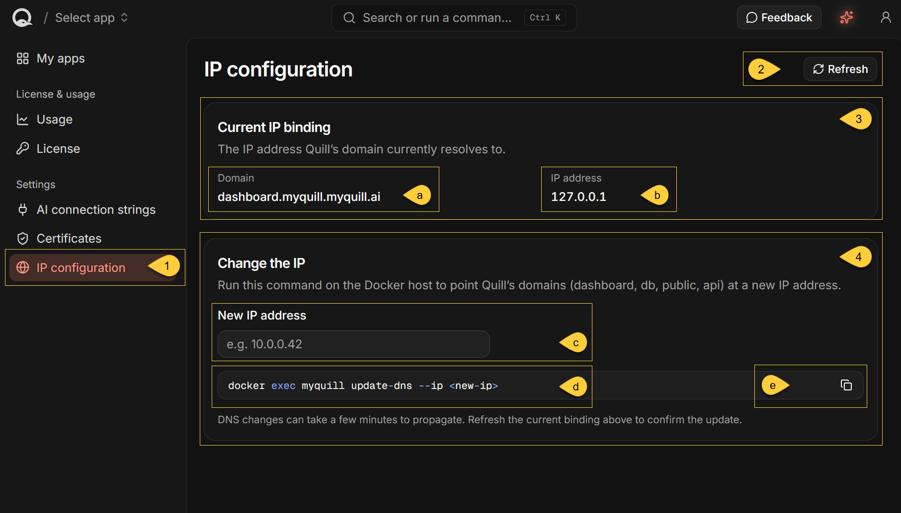

import Admonition from '@theme/Admonition';
import Panel from '@site/src/components/Panel';
import ContentFrame from '@site/src/components/ContentFrame';

<Admonition type="note" title="">

* In the dashboard sidebar, under **Settings**, select **IP configuration**.  
  You can also go directly to `https://dashboard.<your-domain>/ip-configuration`.

* Use this page to:  
   * View the IP address your Quill's dashboard hostname resolves to.
   * Generate a command to update the DNS records for your Quill instance.

* Entering an IP address on this page does not apply the change.  
  Follow the steps in [Change the IP](#change-the-ip) to generate and run the command on the Docker host.

* For details about Quill's DNS records, DNS propagation, and moving to another host,
  see [Networking & DNS](../networking-and-dns.mdx).

---
    
* In this article:
   * [The IP configuration view](#the-ip-configuration-view)
   * [Current IP binding](#current-ip-binding)
   * [Change the IP](#change-the-ip)
   * [Refresh and errors](#refresh-and-errors)

</Admonition>

<Panel heading="The IP configuration view">



1. **IP configuration**  
   Select **IP configuration** under **Settings** to open the page.

2. **Refresh**  
   Repeat the DNS lookup and update the addresses shown under **Current IP binding**.

3. **Current IP binding**  
   Shows the dashboard hostname and the results of Quill's DNS lookup.  
   Learn more in [Current IP binding](#current-ip-binding) below.

   * **a. Domain**  
     The hostname in your browser's address bar.

   * **b. IP address**  
     The IPv4 address or addresses returned by Quill's DNS lookup.

4. **Change the IP**  
   Generates the command used to update your Quill's DNS records.  
   Learn more in [Change the IP](#change-the-ip) below.

   * **c. New IP address**  
     Enter a single IPv4 address to insert it into the generated command.

   * **d. Generated command**  
     The `update-dns` command to run on the Docker host.

   * **e. Copy**  
     Copy the generated command to the clipboard.  
     A **Copied to clipboard** notification confirms the copy.
    
</Panel>

<Panel heading="Current IP binding">

The **Current IP binding** section shows the dashboard hostname from your browser's address bar  
and the IPv4 address or addresses returned by Quill's DNS lookup.

| Field          | What it shows |
| -------------- | ------------- |
| **Domain**     | The hostname in your browser's address bar, e.g. `dashboard.<your-domain>`. |
| **IP address** | The IPv4 address or addresses returned by the DNS lookup. |

---
    
Quill performs the lookup from inside the Quill container.
The result therefore reflects the container's view of DNS and can temporarily differ from a lookup performed on another computer while a DNS change is propagating.

This information is read-only.  
It does not verify that Quill can be reached or is responding at the displayed address.

<ContentFrame>

### When no address is shown

* If the lookup returns no IPv4 address, **IP address** displays **No DNS record found**.

* If the dashboard is opened using an IP address or a hostname without a dot, such as `localhost`,  
  Quill displays the following message instead of the **Domain** and **IP address** fields:  
  "**This dashboard is opened directly by IP address, so there is no domain binding to show.**"  
  No DNS lookup is performed, and **Refresh** is disabled.

* If the lookup fails, Quill displays "**Could not resolve the current IP binding**" instead of the **Domain** and **IP address** fields.
  Select **Retry** to repeat the lookup, or see [Refresh and errors](#refresh-and-errors).

</ContentFrame>

</Panel>

<Panel heading="Change the IP">

Use **Change the IP** to generate an `update-dns` command.  
Entering an address does not update the DNS records until you run the command on the Docker host.

<ContentFrame>

### Generate the command

1. Enter the new address in **New IP address**.

   The field accepts a single IPv4 address.   
   If the entered address is invalid, Quill displays **Enter a valid IPv4 address.**  below the field.

2. Select the copy icon to copy the generated command.

   A **Copied to clipboard** notification confirms the copy.

---
    
<Admonition type="warning" title="">

#### Check the container name

* The Dashboard does not read the actual container name from Docker.  
  The name in the generated command may therefore differ from the running container name,  
  for example, if you changed the container name when running the setup command provided by Quill.

* Before running the command, run `docker ps` on the Docker host and verify the container name.  
  Replace the generated name if it does not match.

</Admonition>

</ContentFrame>

<ContentFrame>

### Run the command

Run the corrected command from a terminal on the Docker host. For example:

```bash
docker exec quill-acme update-dns --ip 10.0.0.42
```
<br/>
    
Keep `--ip` and the address as separate arguments, as shown.  
The `--ip=<address>` form is not supported.    

The Quill container must be running and activated, and it must have outbound HTTPS access to `api.ravendb.net`.

Although the description under **Change the IP** names only `dashboard`, `db`, `public`, and `api`,  
the generated command also updates `a.<domain>`. It updates these five DNS records:

* `dashboard.<domain>`
* `api.<domain>`
* `public.<domain>`
* `db.<domain>`
* `a.<domain>`

When the update succeeds, the command prints a confirmation that the records were registered.

For details about these hostnames, DNS propagation, assigning IPv6 or multiple addresses,
and handling a timeout, see [Networking & DNS](../networking-and-dns.mdx).

<Admonition type="note" title="">

* Repointing the DNS records does not move your Quill's data.
* If you are moving your Quill instance to another host, see [Moving to another host](../networking-and-dns.mdx#moving-to-another-host).

</Admonition>

</ContentFrame>

</Panel>

<Panel heading="Refresh and errors">

The page does not continuously refresh the current IP binding.

* Select **Refresh** to perform a new DNS lookup.  
  **Refresh** is disabled while a lookup is in progress and when the dashboard is opened using an IP address or a hostname without a dot.

* If the lookup fails, Quill displays "**Could not resolve the current IP binding**" under **Current IP binding**,  
  followed by "**Refresh the page or try again in a moment.**"  
  Select **Retry** to repeat the lookup.

After running the `update-dns` command, select **Refresh** and verify that **IP address** shows the new address.

Seeing the new address confirms that it has reached the DNS resolver used by the Quill container.  
Other callers may continue receiving the previous address until their cached DNS records expire.

For details about DNS propagation and how to verify the update from outside the Quill container,  
see [DNS propagation and TTL](../networking-and-dns.mdx#dns-propagation-and-ttl)
and [Verify the change](../networking-and-dns.mdx#verify-the-change).

</Panel>
