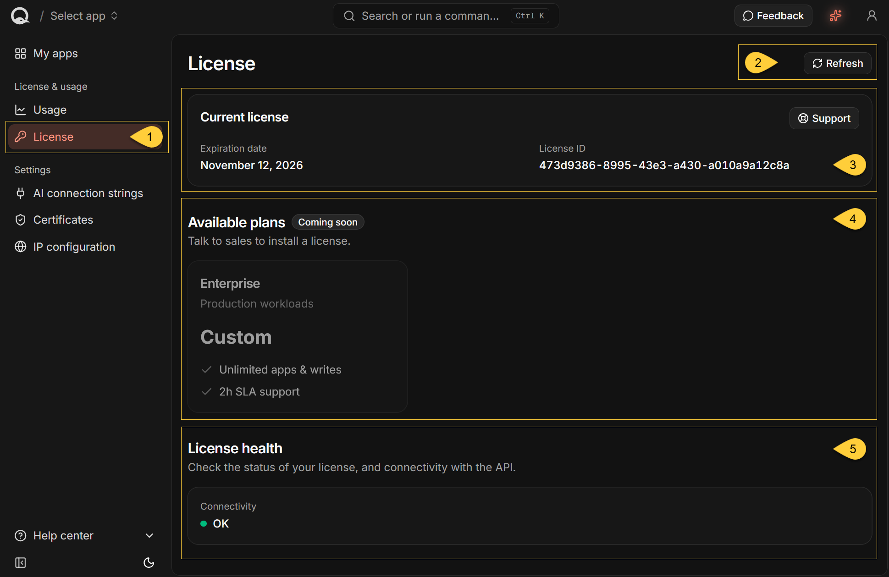
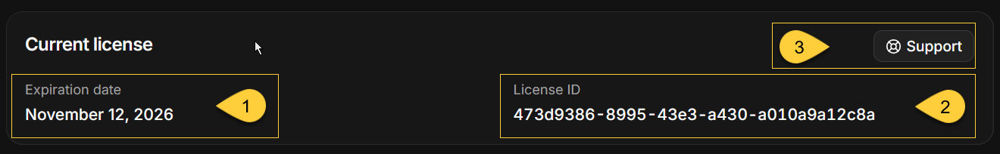

import Admonition from '@theme/Admonition';
import Panel from "@site/src/components/Panel";
import ContentFrame from "@site/src/components/ContentFrame";

<Admonition type="note" title="">

* In the dashboard sidebar, under **License & usage**, select **License** to open the page.  
  You can also go directly to `https://dashboard.<your-domain>/license`.

* Use this page to view the license expiration date and ID, open **Support**, review available plans,  
  and check connectivity to RavenDB's licensing API.

* You cannot install or change a license from this page.  
  To view write usage associated with the license, select **Usage** under **License & usage**.  
  {/* TODO: link to usage.mdx */}

* In this article:
   * [License overview](#license-overview)
   * [Current license](#current-license)
   * [Available plans](#available-plans)
   * [License health](#license-health)
   * [Refresh and errors](#refresh-and-errors)

</Admonition>

<Panel heading="License overview">

1. **License**  
   Select **License** under **License & usage** to open the page.

2. **Refresh**  
   Reload the license information and connectivity status.

3. **Current license**  
   Shows the expiration date and ID of the installed license.  
   Select **Support** to open RavenDB's support page.  
   See [Current license](#current-license).

4. **Available plans**  
   Shows the available plan information.  
   The plan cards are currently disabled.  
   See [Available plans](#available-plans).

5. **License health**  
   Shows whether Quill can reach RavenDB's licensing API.  
   See [License health](#license-health).

</Panel>

<Panel heading="Current license">

1. **Expiration date**  
   Shows the expiration date of the installed license.  
   If the license has expired, **This license has expired.** appears under the **Current license** heading.

2. **License ID**  
   The unique identifier of the installed license.

3. **Support**  
   Select **Support** to open RavenDB's support page in a new tab.  
   The license ID is included automatically in the support-page URL.

</Panel>

<Panel heading="Available plans">

The **Available plans** section displays the available plan information.  
It is marked **Coming soon**, and the plan cards are disabled.

You cannot select or purchase a plan from this page.  
To install or change a license, contact RavenDB sales.

</Panel>

<Panel heading="License health">

<ContentFrame>

### Connectivity

Each time the **License** page loads, RavenDB sends one request to its licensing API with a
five-second timeout.

* A green dot with **OK** means that the licensing API responded successfully.
* A red dot means that the check failed. The response status appears beside the dot.  
  If an exception occurred, its message appears below the status.

The status is not monitored continuously.  
Select **Refresh** to run the check again.

</ContentFrame>

<ContentFrame>

### Why connectivity matters

Your Quill deployment uses RavenDB's licensing API to:

* **Check for license updates.**  
  RavenDB checks shortly after startup and every 24 hours afterward.  
  If the API returns an updated license, RavenDB installs it automatically.  
  An update can extend the expiration date shown under [Current license](#current-license).

* **Report and retrieve write usage.**  
  RavenDB reports write usage approximately every 15 minutes.  
  The **Usage** page retrieves the aggregated write usage from the same API.  
  {/* TODO: link to usage.mdx */}

**Connectivity and license validity are separate**:  
a failed connectivity check does not remove the installed license.
If the check continues to fail after selecting **Refresh**, verify that the Quill deployment can make outbound HTTPS requests to `api.ravendb.net`.

</ContentFrame>

</Panel>

<Panel heading="Refresh and errors">

The **License** page does not continuously poll for updates.

* Select **Refresh** to reload the license information and run the connectivity check again.  
  **Refresh** is disabled while the request is in progress.

* If the license information cannot be loaded, "**Could not load license**" appears in place of the page content.   
  Select **Retry** to request the information again.

</Panel>