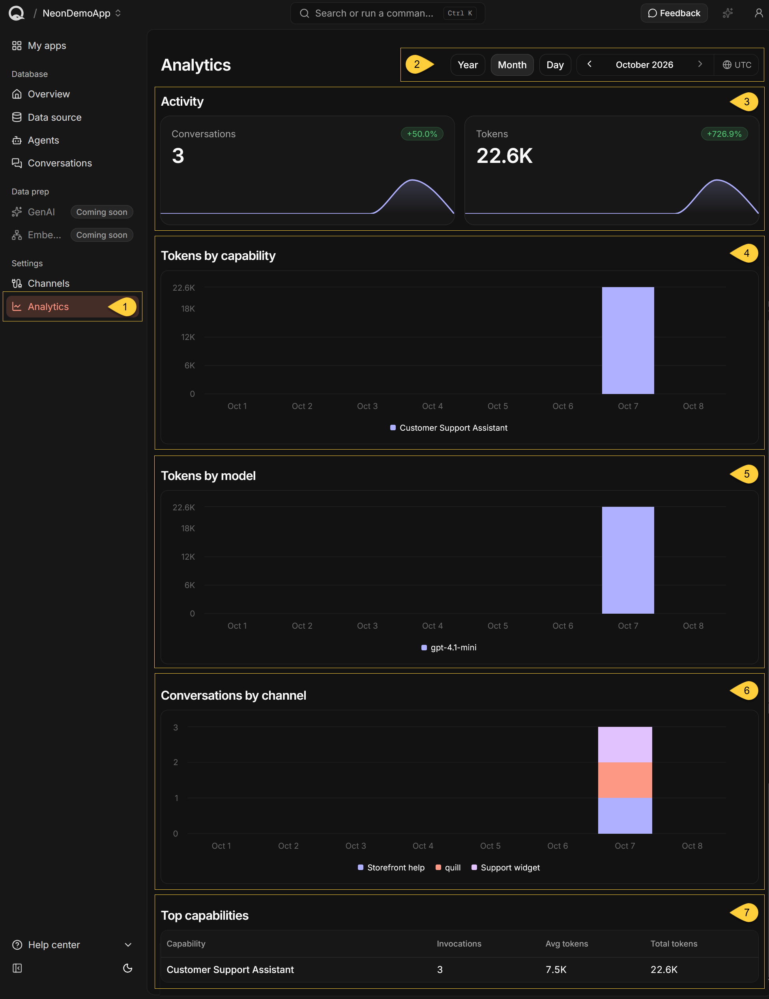
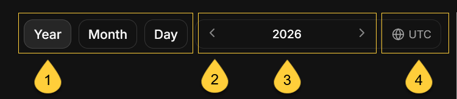
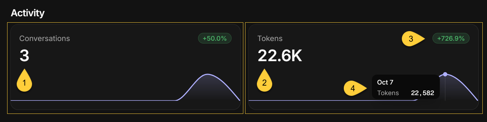
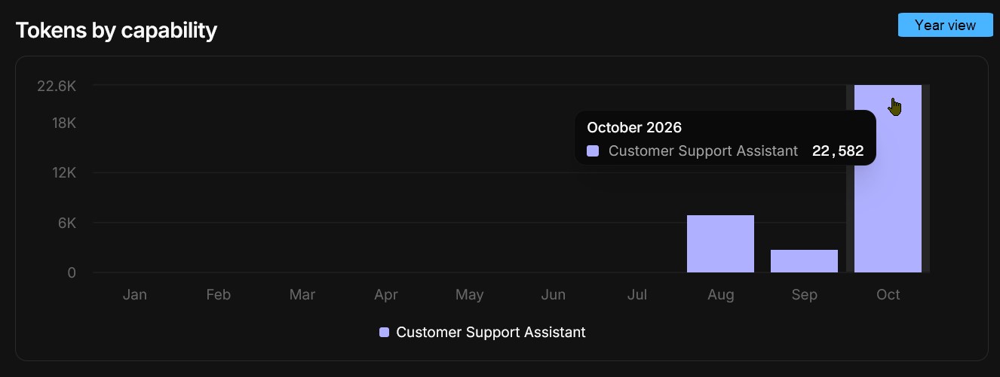
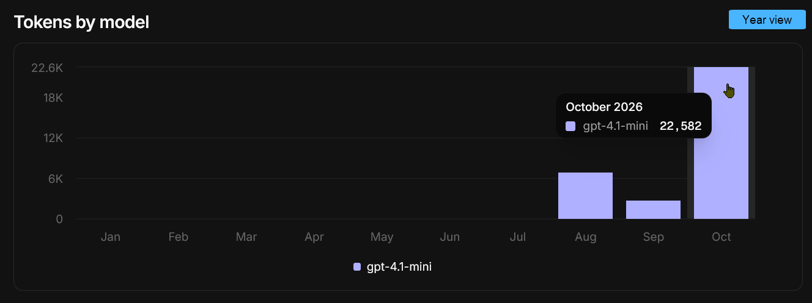
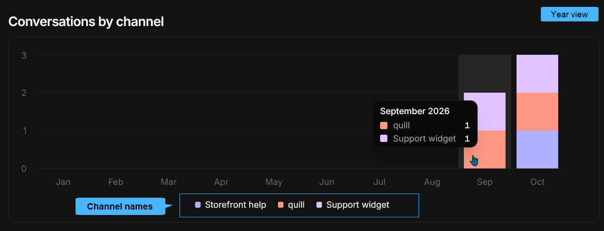
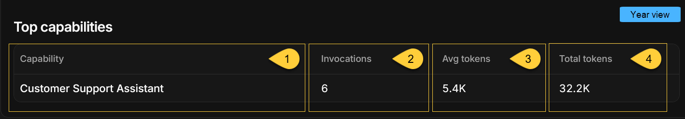

import Admonition from "@theme/Admonition";
import Panel from "@site/src/components/Panel";
import ContentFrame from "@site/src/components/ContentFrame";

<Admonition type="note" title="">

* The **Analytics view** reports an app's conversation activity and token usage over a selected period,  
  broken down by capability, model, and channel.

* A **capability** is an AI feature added to the app.  
  Quill defines three capability types: **AI Agent**, **Embeddings generation**, and **GenAI**.  
  Currently, only AI agents are available, so each capability shown in this view is one of the app's [AI agents](./agents-view.mdx).

* In this article:
   * [Opening the Analytics view](#opening-the-analytics-view)
   * [Select the period](#select-the-period)
   * [Activity](#activity)
   * [Tokens by capability](#tokens-by-capability)
   * [Tokens by model](#tokens-by-model)
   * [Conversations by channel](#conversations-by-channel)
   * [Top capabilities](#top-capabilities)
   * [Empty and error states](#empty-and-error-states)

</Admonition>

<Panel heading="Opening the Analytics view">

The view is available at `https://dashboard.<your-domain>/apps/<slug>/analytics`,   
where `<slug>` is the app identifier used in the URL.
        
To open the Analytics view, select the app in Quill's management dashboard and click **Analytics** in the sidebar,  
under **Settings**.    

1. **Analytics**  
   Open the _Analytics_ view under _Settings_.

2. **Period selector**  
   Select the period reported by the entire view:  
   the Activity tiles, the three breakdown charts, and the **Top capabilities** table.  
   Learn more in [Select the period](#select-the-period).

3. **Activity**  
   The app's conversation and token totals for the selected period,  
   each with its change from the previous period and a chart of its distribution over the period.  
   Learn more in [Activity](#activity).

4. **Tokens by capability**  
   The tokens used in each time bucket, broken down by capability.  
   Learn more in [Tokens by capability](#tokens-by-capability).

5. **Tokens by model**  
   The tokens used in each time bucket, broken down by LLM model.  
   Learn more in [Tokens by model](#tokens-by-model).

6. **Conversations by channel**  
   The conversations started in each time bucket, broken down by channel.  
   Learn more in [Conversations by channel](#conversations-by-channel).

7. **Top capabilities**  
   The capabilities ranked by total token usage, with their invocations and average tokens per conversation.  
   Learn more in [Top capabilities](#top-capabilities).

</Panel>

<Panel heading="Select the period">

  

<ContentFrame>

### The period selector

1. **Year / Month / Day**  
   Select the span of the period.  
   The span also sets the time buckets the charts are divided into:    
     * **Year** - the year's months.
     * **Month** - the month's days.
     * **Day** - the day's hours.

   Switching to a shorter span selects the last month or day of the current selection,  
   or the current month or day if the selection has not ended yet.

2. **Arrows**  
   Select the previous or the next period of the same span.  
   An arrow is disabled at the end of the available range.

3. **Period label**  
   Click the label to pick a specific year, month, or day.

4. **UTC**  
   Periods and chart dates are in UTC. Hover over the indicator to see this reminder.

---
    
* The initial selection is the current month.
* The available range starts with the period in which the app was created and ends with the current period.  
  If the app reports no usable creation date, the range starts with the Quill deployment's setup date.
* The current period ends at the present moment, so buckets that have not started yet are not shown.  
  For example, when the current year is selected in October, the charts show January through October.
* Each dashboard view that has a period selector keeps its own selection.  
  The period selected here does not affect other views and is not retained when you leave the view.

</ContentFrame>

<ContentFrame>

### Drill into a bucket

Click a column in any of the three breakdown charts to narrow the period of the entire view to that bucket:

* In the **Year** view, click a month's column to select that month.
* In the **Month** view, click a day's column to select that day.
* The **Day** view's hourly buckets are the finest available, so its columns are not clickable.

A bucket with no recorded value has no column to click.  
The previous charts remain on screen until the data of the new period is loaded.

</ContentFrame>

</Panel>

<Panel heading="Activity">

   

Each tile shows the app's total for the selected period.

1. **Conversations**  
   The number of conversations users started with the app's agents during the selected period.  
   Learn more about conversations in [App: Conversations view](./conversations-view.mdx).

2. **Tokens**  
   The total number of input and output tokens reported by the LLM provider for those conversations.

3. **Trend badge**  
    
   * This badge shows the change from the previous period of the same span (the previous year, month, or day),  
     as a percentage rounded to one decimal place.  
     An increase is shown in green (for example, `+12.5%`) and a decrease in red (for example, `-8.0%`).
    
    * The badge is not shown when:
       * The change is 0.
       * The previous period recorded no activity. The first period with activity therefore has no badge.
       * The selected period recorded no activity. A drop to zero is therefore not shown as `-100%`.
    
    * The current day, month, or year ends at the present moment, while the period it is compared with is complete.  
      A lower total for the current period may simply reflect that the period has not ended yet.  
      Select a period that has ended to compare two complete periods.    

4. **Chart**  
   How the total is distributed over the period's buckets.  
   Hover over the chart to see a bucket's value and the UTC date at which the bucket starts  
   (in the **Day** view, the date and time).  
   A chart is not shown when the selected period contains only one bucket.
    
---    
    
<Admonition type="info" title="">

#### How activity is reported

* A conversation and all its tokens are assigned to the UTC bucket in which the conversation **started**.  
  For example, a conversation started at 23:50 UTC and continued past midnight is reported entirely  
  on the first day.

* If the app has no activity during the selected period, both tiles show **0**.  
  This is not an error.

* The **Conversations** and **Tokens** totals match those in the **Activity** section of the app's [Overview](./overview.mdx#activity)  
  when the same period is selected in both views.

</Admonition>

</Panel>

<Panel heading="Tokens by capability">

      

This stacked bar chart shows the tokens used in each bucket, broken down by capability.  
Each capability shown here is one of the app's [AI agents](./agents-view.mdx).  
**AI Agent** is currently the only available capability type.

* Each capability that used tokens during the selected period has its own color in the chart and an entry in the legend.
* The legend shows the agent's current name, or its identifier if the agent no longer exists.
* Hover over a column to see the tokens each capability used in that bucket.  
  Capabilities that used no tokens in that bucket are omitted from the tooltip.
* If no conversations were recorded during the selected period, the section displays "_No data for this period._"

</Panel>

<Panel heading="Tokens by model">

     

A stacked bar chart of the same token usage as [Tokens by capability](#tokens-by-capability),  
grouped by the LLM model each capability is currently configured to use.

* Quill reads each capability's model from its current [AI connection string](../ai-connection-strings.mdx).
* Token usage from capabilities that currently use the same model is added together for each time bucket.  
  The model has its own color in the chart and an entry in the legend.
* Because the grouping follows the current configuration, changing a capability's connection string or model  
  also regroups the capability's earlier token usage.
* The tokens of a capability whose model Quill cannot resolve are grouped under `unknown`.  
  This happens when the agent no longer exists, has no connection string, its connection string has been removed,  
  or its connection string specifies no model.
* As in [Tokens by capability](#tokens-by-capability), the tooltip omits zero values, and the section displays  
  "_No data for this period._" if no conversations were recorded during the selected period.

</Panel>

<Panel heading="Conversations by channel">

    

A stacked bar chart of the conversations started in each bucket, broken down by [channel](./channels-view.mdx).

* Each channel that carried conversations during the selected period has its own color in the chart and an entry in the legend.
  Channels that carried no conversations during the period are not shown.
* The legend shows the channel's current name, or its identifier if the channel has no name.
* Hover over a column to see the number of conversations each channel carried in that bucket.
* If the app has no channels, the section displays "_No data for this period._", even when other sections report activity.  
  If the app has channels but none of them carried a conversation during the selected period, the chart is empty.

---
    
<Admonition type="warning" title="">

#### Why the chart can total less than the Conversations tile

The chart counts only conversations carried by channels that still exist. It does not count:
  * Conversations carried by a channel that has since been deleted.
  * Conversations not carried by any channel, such as conversations held in an agent's test chat.

These conversations are still counted by the **Conversations** tile and by the **Top capabilities** table.  
    
For example, the **Year view** screenshot above shows **5** conversations in **Conversations by channel**  
(2 in September and 3 in October), while the [**Top capabilities**](#top-capabilities) screenshot below shows **6 invocations**  
(6 conversations) for the same year.    

</Admonition>

</Panel>

<Panel heading="Top capabilities">

     

This table shows the capabilities that handled conversations during the selected period, ordered by **Total tokens** from highest to lowest.
Capabilities with equal totals are ordered alphabetically.

1. **Capability**  
   The agent's current name, or its identifier if the agent no longer exists.
2. **Invocations**  
   The number of conversations started with the capability. Individual messages are not counted.
3. **Avg tokens**  
   **Total tokens** divided by **Invocations**, rounded down to a whole number.
4. **Total tokens**  
   The tokens reported by the LLM provider for those conversations.

---
    
* Large values are abbreviated, for example `1.4K`.
  Because the displayed values are rounded, an average calculated from the displayed columns can differ from the **Avg tokens** value.
    
* If no conversations were recorded during the selected period, the table displays "_No capability usage yet._"

</Panel>

<Panel heading="Empty and error states">

| Situation                                         | What the view shows |
|---------------------------------------------------|---------------------|
| The analytics data cannot be loaded               | **Could not load analytics**, with **Retry**. The tiles, charts, and table are not shown. |
| The app does not exist                            | **App not found**, with **Go to dashboard**. |
| The app cannot be loaded                          | **Could not load app**, with **Retry** and **Go to dashboard**. |
| No conversations were recorded during the period  | Both tiles show **0**, with no trend badge. The token charts display "_No data for this period._" and **Top capabilities** displays "_No capability usage yet._" **Conversations by channel** shows an empty chart, or "_No data for this period._" if the app has no channels. |
| The app has no channels                           | **Conversations by channel** displays "_No data for this period._", even when other sections report activity. |

---
    
* A **0** on an Activity tile means the data loaded successfully and nothing was recorded for that tile during the selected period.
    
* The view is not refreshed automatically and has no refresh button.  
  Reload the page to retrieve the latest data.

</Panel>
