import Admonition from '@theme/Admonition';
import Tabs from '@theme/Tabs';
import TabItem from '@theme/TabItem';
import Panel from "@site/src/components/Panel";
import ContentFrame from "@site/src/components/ContentFrame";

# App: Agents view
<Admonition type="note" title="">

* An [AI agent](../../overview.mdx#ai-agent) answers your users from the app's internal database.  
  The **Agents** view lists the agents you already created, with their status and activity, and allows you to add new
  agents, open an agent to modify and test its configuration, and delete an agent.

* The Agents view is opened from the app's sidebar, where it is listed under the **Database** group.  
  The app's [Overview](../../dashboard/manage-an-app/app-overview.mdx) page also lists the existing agents,
  to provide an overall view of the app's activity, agents, and channels.

* An agent is added using the **Add agent** wizard, described in
  [Getting started: Adding an AI agent](../../getting-started/adding-an-ai-agent.mdx).

* In this article:
   * [Opening the Agents view](#opening-the-agents-view)
   * [The agent's configuration](#the-agent-s-configuration)
      * [Basic settings](#basic-settings)
      * [Agent parameters](#agent-parameters)
      * [Agent tools](#agent-tools)
      * [Agent actions](#agent-actions)
   * [Deleting an agent](#deleting-an-agent)
   * [An additional entry point: the agents list in the Overview](#an-additional-entry-point-the-agents-list-in-the-overview)

</Admonition>

<Panel heading="Opening the Agents view">

To open the Agents view, select the app in Quill's management dashboard and click **Agents** in the sidebar, under **Database**.

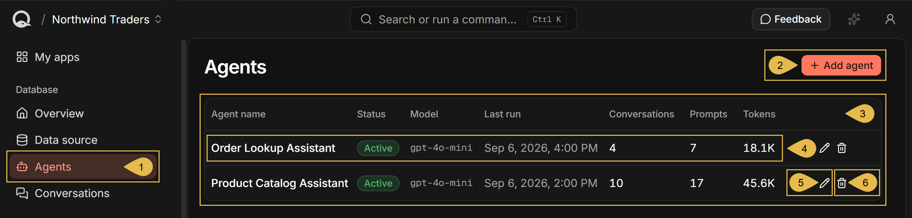

1. **Agents**  
   Open the Agents view.
2. **Add agent**  
   Add an agent to the app. See
   [Getting started: Adding an AI agent](../../getting-started/adding-an-ai-agent.mdx).
3. **The agents list**  
   Lists the details and actions available for each agent, one row per agent.
4. **Agent information**  
   Each row shows the following details for a single agent:
   * **Agent name**  
     The agent's name.
   * **Status**  
     The agent's status, **Active** or **Disabled**.
   * **Model**  
     The chat model the agent uses, taken from the AI connection string set for the agent.  
     A dash is shown when the model cannot be resolved.
   * **Last run**  
     The hour at which the agent's most recent conversation started.  
     This time does not change while an earlier conversation continues.
   * **Conversations**  
     The number of conversations the agent has held.
   * **Prompts**  
     The number of messages the users have sent the agent.
   * **Tokens**  
     The number of tokens the agent's conversations have consumed.
5. **Edit agent**  
   Review and modify the agent's configuration. See [The agent's configuration](#the-agent-s-configuration).
6. **Delete agent**  
   Delete the agent from the app. See [Deleting an agent](#deleting-an-agent).

</Panel>

<Panel heading="The agent's configuration">

An agent's behaviour is set by its configuration.  
To review and modify an agent's configuration, click the agent's pencil icon in the agents list.

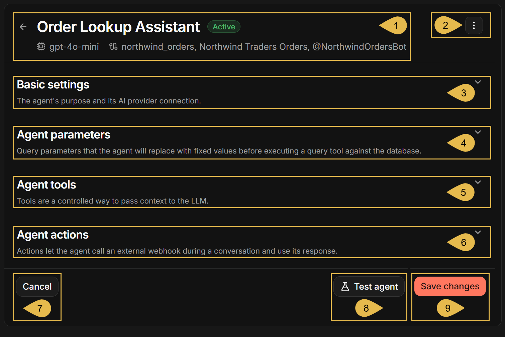

You can expand or collapse each configuration section: [Basic settings](#basic-settings),
[Agent parameters](#agent-parameters), [Agent tools](#agent-tools), and [Agent actions](#agent-actions).

1. **The agent's details**  
   The agent's name and status, the model it uses, and the channels the agent serves.
2. **The agent's menu**  
   Holds a single entry, **Delete**. See [Deleting an agent](#deleting-an-agent).
3. **Basic settings**  
   The agent's name, AI connection string, and system prompt.

   <ContentFrame>

   ### Basic settings

   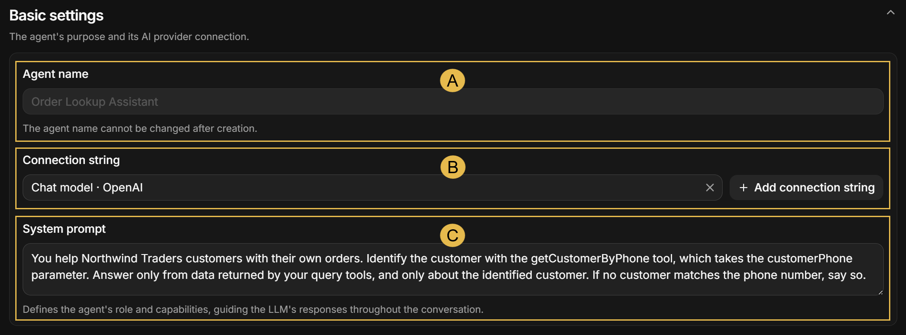

   * **A. Agent name**  
     The **Agent name** field is disabled; it cannot be modified since the agent's identifier is derived from its name
     and is set once when the agent is created.
   * **B. Connection string**  
     The [AI connection string](../../dashboard/ai-connection-strings.mdx) that provides the chat model the agent uses.  
     You can select the connection string the agent uses, remove the current string using the clear icon, or click
     **Add connection string** to define a new string.
   * **C. System prompt**  
     Define the instructions the agent follows throughout a conversation.

   </ContentFrame>

4. **Agent parameters**  
   Values that the agent's queries can use. Each value is provided when a conversation starts, and the LLM cannot
   override it.

   <ContentFrame>

   ### Agent parameters

   Expanding the **Agent parameters** section shows the parameters defined for the agent.  
   The image below lists a single parameter, `customerPhone`.

   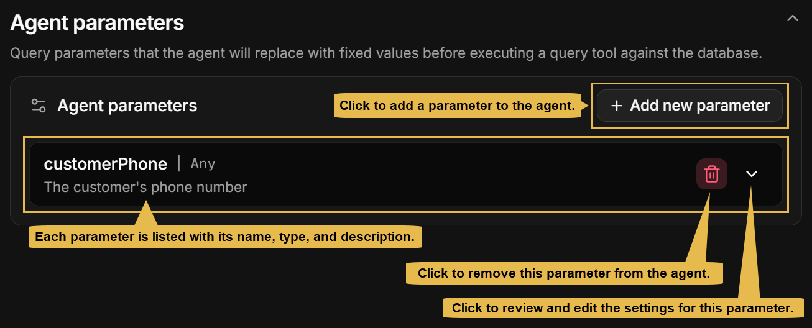

   Adding or editing a parameter reveals the following fields:

   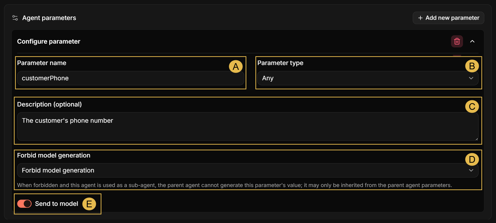

   * **A. Parameter name**  
     The name by which agent queries refer to the parameter.
   * **B. Parameter type**  
     Select a type for the parameter's value: **String**, **Number**, **Boolean**, **String[]**, **Number[]**, **Boolean[]**,
     **Any**, or **Null**.  
     Quill checks the parameter's value against the selected type each time a conversation starts, and the conversation
     will not start if the value is of another type.  
     **Any** applies no type validation.
   * **C. Description (optional)**  
     A description of the parameter's content.  
     The description is passed to the LLM along with the parameter's value, unless **Send to model** (see below) is set
     to **Off**.
   * **D. Forbid model generation**  
     Select whether the LLM may generate a value for this parameter when another agent uses this agent as a sub-agent.  
     **Default**: the LLM may generate a value for the parameter.  
     **Forbid model generation**: the LLM may not generate a value. The value can only be inherited from a parameter of
     the same name in the calling agent, and the call will fail if the calling agent has no such parameter.
   * **E. Send to model**  
     Set whether the parameter's value is included in the text sent to the LLM,  
     **On** (default): the parameter's value is sent to the LLM, and the agent's queries receive the value as well.  
     **Off**: the parameter's value is **not** sent to the LLM. The agent's queries still receive the value.

   </ContentFrame>

5. **Agent tools**  
   Query tools you provide in this section can be used by the agent to query Quill's internal database.  
   The LLM that the agent uses knows of these tools and is free to use them as needed.  
   The LLM **cannot** access Quill's database directly: to retrieve data from the database, it must request the agent
   to use a query tool.

   <ContentFrame>

   ### Agent tools

   Expanding the **Agent tools** section shows the query tools defined for the agent.  
   The image below lists two such tools, `getCustomerByPhone` and `findCategoryProducts`.

   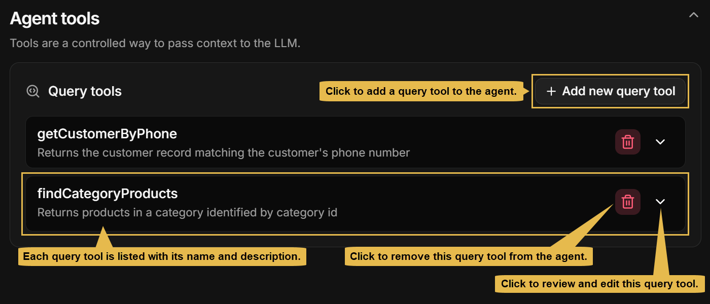

   Adding or editing a query tool reveals the following fields:

   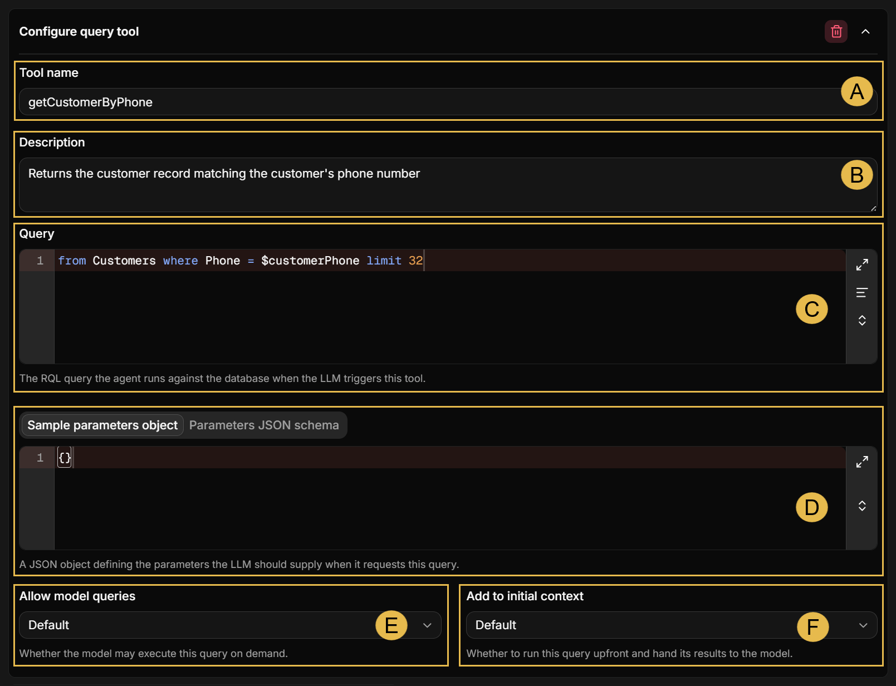

   * **A. Tool name**  
     The name the LLM uses to trigger the query.  
     A name can be used only once; you cannot give the same name to two query tools, or to a query tool and an
     [action](#agent-actions).
   * **B. Description**  
     A description of the data the query returns.
   * **C. Query**  
     Query tools can only **read** from Quill's internal database, never write into it.  
     When a `$name` placeholder is included in the query, Quill replaces the placeholder at runtime, each time the query
     tool is called, with the value set by an agent parameter of the same name.  
     When no agent parameter carries the placeholder's name, the value is taken from the parameters the LLM provides
     when it requests the query, defined in **D** below.  
     The query will fail if neither an agent parameter nor the LLM provides a value for the placeholder.
   * **D. Sample parameters object / Parameters JSON schema**  
     Define, either as a **sample object** or as a **JSON schema**, the parameters the LLM provides when it
     requests this query.  
     Defining a sample object is usually easier, since you can describe the parameters in natural language.  
     e.g., the sample object and the JSON schema in the example below define two parameters, `customerPhone` and
     `maxOrders`.

     <Tabs groupId='parametersFormat'>
     <TabItem value="sample-object" label="Sample object">
     ```json
     {
         "customerPhone": "The phone number the customer gave",
         "maxOrders": "The number of recent orders to return"
     }
     ```
     </TabItem>
     <TabItem value="json-schema" label="JSON schema">
     ```json
     {
         "type": "object",
         "properties": {
             "customerPhone": {
                 "type": "string",
                 "description": "The phone number the customer gave"
             },
             "maxOrders": {
                 "type": "number",
                 "description": "The number of recent orders to return"
             }
         },
         "required": ["customerPhone", "maxOrders"]
     }
     ```
     </TabItem>
     </Tabs>

     Either a sample object or a JSON schema must be defined. If you define both, the schema will be applied.
   * **E. Allow model queries**  
     Select whether the LLM is allowed to run this query tool.  
     **True**: the LLM can run the tool whenever needed.  
     **False**: this tool is not offered to the LLM at all.
   * **F. Add to initial context**  
     Select when Quill runs this query tool.  
     **Default**: run this tool only when the LLM requests its query.  
     **True**: also run this tool before the conversation starts, and hand the results to the LLM.  
     e.g., a query that returns the list of product categories can be added to the initial context, so the LLM will
     have this data before the first question arrives.

     <Admonition type="note" title="">

     A query that runs before the conversation starts cannot take values from the LLM, since the LLM has not been
     called yet.

     </Admonition>

   </ContentFrame>

6. **Agent actions**  
   The agent can use **actions** you define here, that ask Quill to call systems outside Quill.

   * The LLM that the agent uses knows of these actions and is free to apply them as needed.
   * The LLM **cannot** call an outside system directly: it can only request an action from the agent, providing values
     for any defined parameters, so Quill will make the call.
   * An outside system's response is passed back to the LLM as a text, indicating whether the call succeeded, the
     status code, notable headers, the response body (up to the set limit), and, when the body is cut, a truncation
     marker pointing it out.

   e.g., during a conversation with one of your users, it may turn out that a support ticket should be opened on an
   outside system. The LLM will request the `create_ticket` action, Quill will call the address configured for it,
   and once the response arrives the LLM will continue the conversation with your user.

   <ContentFrame>

   ### Agent actions

   Expanding the **Agent actions** section shows the actions defined for the agent.  
   The image below lists a single action, `create_ticket`.

   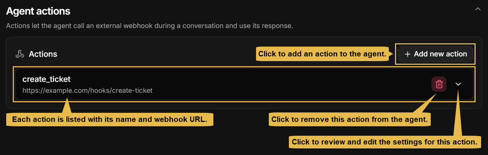

   Adding or editing an action reveals the following fields:

   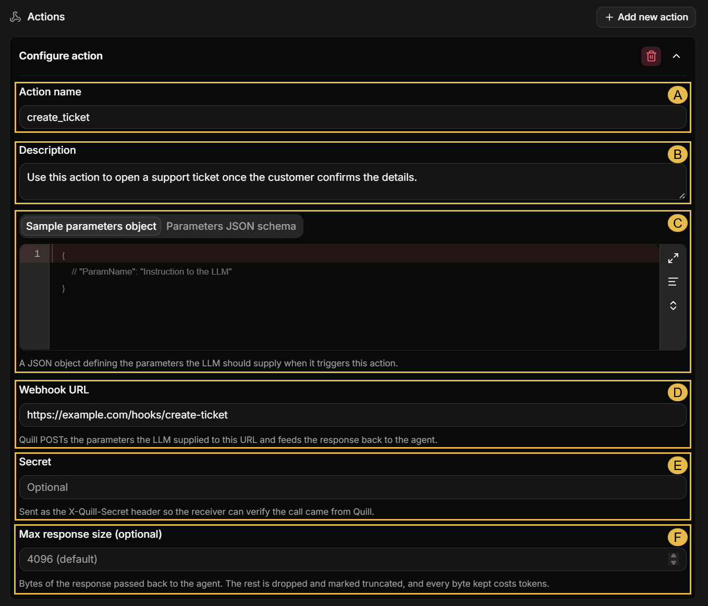

   * **A. Action name**  
     The name the LLM uses to trigger this action.  
     A name can be used only once; you cannot give the same name to two actions, or to an action and a query tool.
   * **B. Description**  
     A description of the situation in which the agent should trigger this action.
   * **C. Sample parameters object / Parameters JSON schema**  
     Define, either as a **sample object** or as a **JSON schema**, the parameters the LLM provides when it triggers
     this action.  
     e.g.,

     <Tabs groupId='parametersFormat'>
     <TabItem value="sample-object" label="Sample object">
     ```json
     {
         "customerPhone": "The phone number the customer gave",
         "issueSummary": "A short summary of the issue the customer described"
     }
     ```
     </TabItem>
     <TabItem value="json-schema" label="JSON schema">
     ```json
     {
         "type": "object",
         "properties": {
             "customerPhone": {
                 "type": "string",
                 "description": "The phone number the customer gave"
             },
             "issueSummary": {
                 "type": "string",
                 "description": "A short summary of the issue the customer described"
             }
         },
         "required": ["customerPhone", "issueSummary"]
     }
     ```
     </TabItem>
     </Tabs>
   * **D. Webhook URL**  
     The address Quill calls when the agent triggers the action.  
     The address must be absolute, and start with `http://` or `https://`.
   * **E. Secret**  
     An optional value Quill sends with every call, for the receiver to check.
   * **F. Max response size (optional)**  
     The number of response bytes passed back to the agent, 4096 by default and 256 KB at most.

   </ContentFrame>

7. **Cancel**  
   Leave the configuration without saving your changes.
8. **Test agent**  
   Chat with the agent to try the configuration currently in the form, unsaved changes included.  
   The button stays disabled until the agent name, the system prompt, and the connection string are all set.
9. **Save changes**  
   Save the modified configuration.  
   A save attempted while any configuration section still requires your attention opens all four sections, and marks
   each section that needs it with an error icon.

</Panel>

<Panel heading="Deleting an agent">

Deleting an agent removes it from the app irrevocably along with its configuration and the addresses and secrets set
for its actions.  
An agent is deleted using the trash icon in the [agents list](#opening-the-agents-view), or the **Delete** entry in the
agent's menu described in [The agent's configuration](#the-agent-s-configuration). A confirmation is asked first.

An agent cannot be deleted as long as any channel is bound to it; delete the agent's channels from the
[Channels view](../../dashboard/manage-an-app/channels-view.mdx) first, and only then the agent.

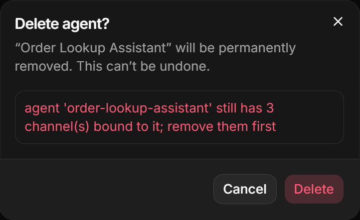

The conversations the agent has held are kept, and remain available in the app's **Conversations** view.

</Panel>

<Panel heading="An additional entry point: the agents list in the Overview">

Similarly to the Agents view discussed here, the app's [Overview](../../dashboard/manage-an-app/app-overview.mdx) page
lists your existing agents and allows you to add an agent or edit an existing agent's configuration.

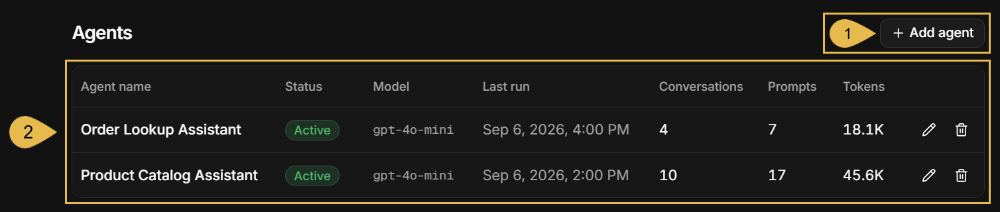

1. **Add agent**  
   Start the [Add agent wizard](../../getting-started/adding-an-ai-agent.mdx) to add an agent to the app.
2. **The agents list**  
   Each row lists a single agent, allowing you to [see the agent's details](#opening-the-agents-view),
   [modify its configuration](#the-agent-s-configuration), or [delete the agent](#deleting-an-agent).

</Panel>
