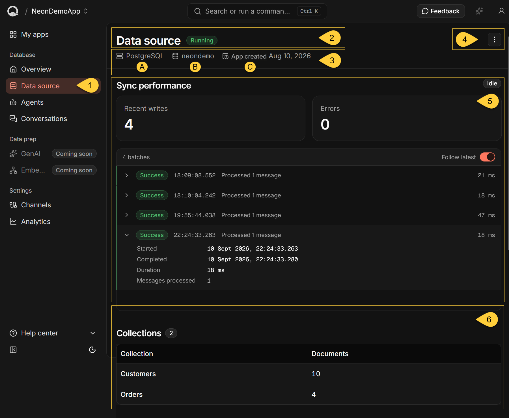
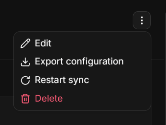
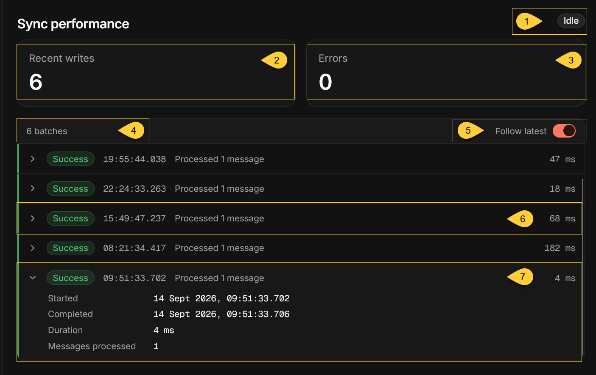
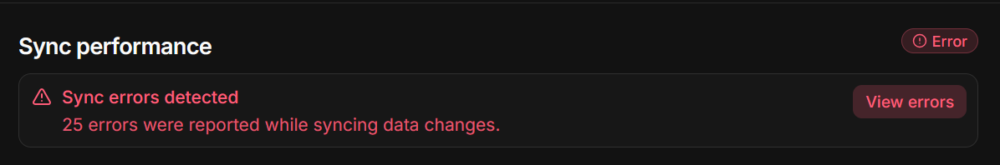
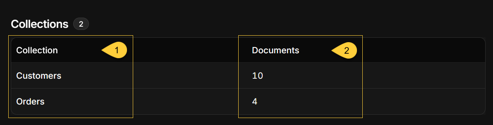

import Admonition from "@theme/Admonition";
import Panel from "@site/src/components/Panel";
import ContentFrame from "@site/src/components/ContentFrame";

<Admonition type="note" title="">

* The **Data source** view shows the app's sync activity, sync errors, and the collections in its RavenDB database.  
  It is available at `https://dashboard.<your-domain>/apps/<slug>/data-source`, where `<slug>` is the app identifier used in the URL.

* Select an app from the [My apps](../my-apps.mdx) view.  
  You can also use the app selector in the header to switch between apps.

* Quill [mirrors](../../overview.mdx#mirroring) data from your source relational database into the app's RavenDB database.  
  The source connection and table mapping are configured when you create the app using the
  [Add new app](../../getting-started/connecting-your-database.mdx) wizard.

* In this article:
   * [The data source view](#the-data-source-view)
   * [Sync performance](#sync-performance)
   * [Collections](#collections)
   * [Data source actions](#data-source-actions)

</Admonition>

<Panel heading="The data source view">

    

1. **Data source**  
   To open the selected app's **Data source** page, click **Data source** under **Database** in the sidebar.    

2. **App status**  
   The badge beside the page title shows **Running**, **Setup**, or **Needs attention**.  
   While Quill loads the app's status, the badge displays **Loading**.  
   It reflects the app's data sync, agents, and channels, using the same status as [My apps](../my-apps.mdx).  
   If the app's overall status is **Error**, Quill omits the header badge and reports the sync errors in [Sync performance](#sync-performance).

3. **Source details**
   * **A. Source engine**  
     The source database engine: **PostgreSQL**, **SQL Server**, **MySQL**, or **Oracle**.  
     MariaDB sources are shown as **MySQL**.  
     If Quill cannot determine the engine from the stored connection string, this item is not shown.
   * **B. Source database**  
     The name of the source relational database that Quill mirrors data from.  
     If Quill cannot determine the database name from the stored connection string, this item is not shown.
   * **C. App created**  
     The date the app was created.  
     Hover over the date to see the full date and time.

4. **Data source actions**  
   The three-dot menu lists **Edit**, **Export configuration**, **Restart sync**, and **Delete**.  
   **Export configuration** appears only when Quill recognizes a supported source engine.  
   An additional **Restart sync** button appears beside the menu when the page reports sync errors.  
   See [Data source actions](#data-source-actions) for instructions and the effects of each action.
    
      

5. **Sync performance**  
   Shows the sync's current activity, the **Recent writes** and **Errors** counters, and a live batch log.  
   See [Sync performance](#sync-performance) to understand the counts, inspect batches, and view errors.

6. **Collections**  
   Lists the collections in the app's RavenDB database and the number of documents in each.  
   See [Collections](#collections) for what the table includes.

</Panel>

<Panel heading="Sync performance">

This section updates automatically as sync reports arrive.  
While establishing the live connection, it displays "_Connecting to the live data sync..._".  
If the connection fails or closes, Quill displays "_Could not connect to the live data sync_" with a **Retry** button.

<ContentFrame>

### Sync state

1. **Sync state**    
   The badge beside the **Sync performance** heading summarizes the reported sync activity.  
   It appears once the live connection starts delivering updates and can show the following states:

   | State      | What it means                                                                                                                 |
   |------------|-------------------------------------------------------------------------------------------------------------------------------|
   | **Active** | A batch is in progress, or a batch completed within the last minute.                                                          |
   | **Idle**   | No batch is in progress, and no batch completed within the last minute. This is normal when the source database has no new changes. It also applies when no batches have been reported. |
   | **Error**  | Sync errors are reported. This state takes precedence over Active or Idle.                                                    |

</ContentFrame>

<ContentFrame>

### Sync counters

2. **Recent writes**  
   The number of documents processed by the batches in the live batch log.  
   Multiple changes to the same document within a batch count as one.
   It includes recent batches available when you open the page, plus batches received while the page remains open.  
    
   Reloading the page can change the total because older batches may no longer be available.  
   For the app's database write usage over a selected period, see the **WRU** tile on the [Overview](./app-overview.mdx#activity) page.

3. **Errors**  
   Quill shows the higher of two counts:  
   the errors reported in the live batches and the number of entries returned in the sync error list.  
    
   The returned error list contains at most 25 entries,  
   but the tile can exceed 25 when the live batches report more errors.  
    
   Some failures occur before a batch is created,  
   so this tile can report errors even when every listed batch shows **Success**.  
    
   See [Sync errors](#sync-errors) to inspect the reported errors.

</ContentFrame>

<ContentFrame>

### Batch log

4. **Batches**  
   The number of batches listed.  
   The log lists sync batches in chronological order, with the oldest first.  
   Batches with no processed documents and no errors are omitted.

5. **Follow latest**  
   When enabled, the log automatically scrolls to the newest batch as batches arrive.  
   Scrolling up turns it off; scrolling back to the bottom turns it on again.  
   You can also use the toggle directly.

6. **Batch row**  
   Each row shows the batch's state, start time, processing summary, and duration:

   | State       | What it means                                                  |
   |-------------|----------------------------------------------------------------|
   | **Success** | The batch completed and reported no errors.                    |
   | **Pending** | The batch has not completed and has reported no errors so far. |
   | **Error**   | The batch reported errors, whether or not it has completed.    |

   The summary reports processed messages;  
   in this count, each document processed by the batch counts as one message.
    
   Multiple changes to the same document within a batch count as one.  
   For an **Error** batch, the summary also shows the error count.  
    
   Times use 24-hour format in your local time zone and include milliseconds.  
   Durations below one second are shown in milliseconds; longer durations are shown in seconds.

7. **Batch details**  
   Click a row to expand it:

   | Field                  | What it shows                                                                                        |
   |------------------------|------------------------------------------------------------------------------------------------------|
   | **Started**            | The date and time the batch started.                                                                 |
   | **Completed**          | The date and time the batch completed, or "_Still in progress_".                                     |
   | **Duration**           | The batch's elapsed processing time.                                                                 |
   | **Messages processed** | The number of documents processed in this batch. Multiple changes to the same document count as one. |
   | **Script errors**      | Errors encountered while transforming source data or applying changes to documents.                  |

   **Script errors** appears only when its count is greater than zero.  
   A failed batch can report processed documents even when its database writes are rolled back.

</ContentFrame>

<ContentFrame>

### Sync errors

* A **Sync errors detected** banner appears at the top of **Sync performance** when the sync error list
  contains entries. The banner shows the number of errors returned in that list, up to 25.

* Click **View errors** to open the **Sync errors** side panel.
  It displays up to 25 errors, with the newest first.

<Admonition type="info" title="">

#### Interpreting sync errors

* Errors are not marked as resolved. 
* A later **Success** batch shows that a batch completed without reported errors,  
  but does not confirm that every earlier problem has been resolved.

</Admonition>
    
</ContentFrame>

</Panel>

<Panel heading="Collections">

The **Collections** table lists the collections in the app's RavenDB database, in alphabetical order.  
The badge beside the heading shows how many collections there are.  
RavenDB's internal collections, whose names start with `@`, are **not** listed.

1. **Collection**  
   The collection's name.  
   Collections created from mirrored data use the target collection names defined for root tables in the app's table mapping.  
    
   Collections written directly to the app's RavenDB database can also appear here.  
   Learn more in [Mapping your tables](../../getting-started/mapping-your-tables.mdx).

2. **Documents**  
   The number of documents in the collection.  
   Large numbers are shortened, for example `18.4K`.

If the app's database holds no listed collection, the table displays "_No collections yet_".

</Panel>

<Panel heading="Data source actions">

Use the three-dot menu in the page header to access these actions.

<ContentFrame>

### Edit

Click **Edit** to open the **Edit app** wizard with the app's existing connection and table mapping.

Changing an earlier step can affect later steps, so review the remaining steps before clicking
**Save changes**. Changes to the app's configuration are saved when you finish the wizard.

If the existing table mapping cannot be edited in the wizard, Quill displays
**This app’s mapping cannot be edited here** and explains why.

</ContentFrame>

<ContentFrame>

### Export configuration

Click **Export configuration**, then **Export** in the confirmation dialog.

Quill downloads `Quill-app-config.json`, containing the source engine, connection string, and table mapping.  
You can import this file when creating another app.

This action is available when Quill recognizes a supported source engine.

The file contains the connection string in **plain text**, including any username and password it contains.  
Store it securely and avoid sharing it.

</ContentFrame>

<ContentFrame>

### Restart sync

Click **Restart sync**, then click **Restart** in the confirmation dialog.  
When sync errors are reported, a **Restart sync** button also appears beside the menu.

Quill stops the sync and starts it again from its last saved position.
Restarting preserves existing mirrored data and saved sync progress.
New source changes may take a moment to arrive while the connection is restored.

* Review any reported [sync errors](#sync-errors) before restarting.  
  Incorrect connection settings or table mappings must be corrected for the sync to recover.

* Restarting cannot enable a sync that is already turned off.  
  In that case, Quill displays "_Sync is turned off for this data source, so there is nothing to restart_".

* If Quill stops the sync but cannot start it again, it reports the failure and leaves the sync turned off.

</ContentFrame>

<ContentFrame>

### Delete

Click **Delete**, enter the app's name to confirm, and then click **Delete**.

The app and its RavenDB database are permanently deleted, including mirrored data, agents,
channel configurations, and conversations. **This action cannot be undone.**

The source relational database and its data are **not** deleted.

</ContentFrame>

</Panel>
