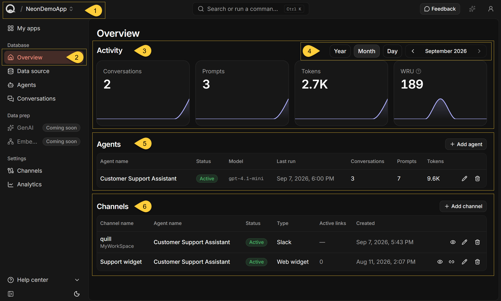
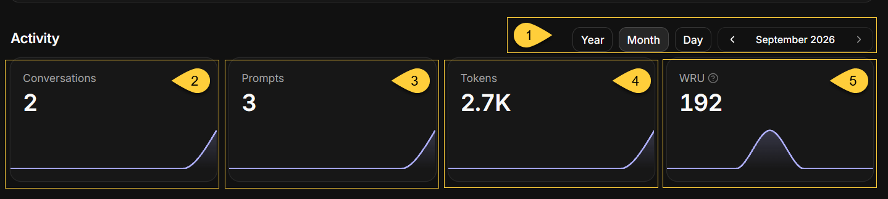
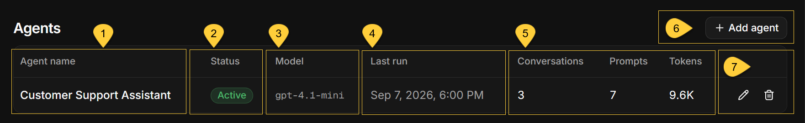
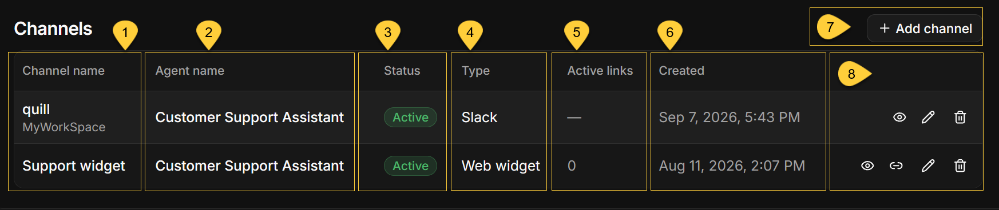
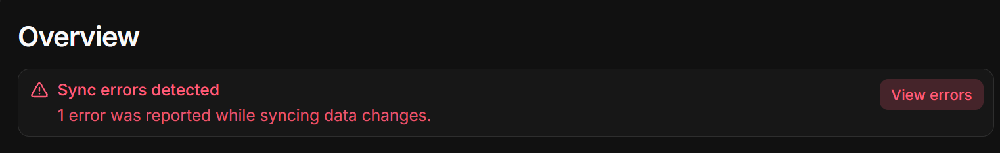

import Admonition from "@theme/Admonition";
import Panel from "@site/src/components/Panel";
import ContentFrame from "@site/src/components/ContentFrame";

<Admonition type="note" title="">

* The **Overview** page summarizes an app's activity, agents, and channels.  
  It is available at `https://dashboard.<your-domain>/apps/<slug>`, where `<slug>` is the app identifier used in the URL.

* All apps in your Quill instance are listed in the [My apps](../my-apps.mdx) view.  
  From **My apps**, click an app's name to open its **Overview** page.  
  You can also use the app selector in the header to switch between apps.

* In this article:
   * [The app overview](#the-app-overview)
   * [Activity](#activity)
   * [Agents](#agents)
   * [Channels](#channels)
   * [Sync errors](#sync-errors)
   * [Empty and error states](#empty-and-error-states)

</Admonition>

<Panel heading="The app overview">

1. **App selector**  
   The header shows the current app. Click the app's name to switch to another app.  
   When switching from **Overview**, the selected app opens on its **Overview** page.

2. **Overview**  
   To open the current app's **Overview** page, click **Overview** under **Database** in the sidebar.  
   When an app is open, the sidebar shows its **Database**, **Data prep**, and **Settings** sections.  

3. **Activity**  
   Four tiles show the app's conversations, prompts, tokens, and write usage for the selected period.  
   Each chart shows how the activity is distributed over that period.  
   Learn more in [Activity](#activity) below.

4. **Period selector**  
   Select the period reported by the Activity tiles.  
   The selection does not affect the tables below them.   
   Learn more in [Select the period](#select-the-period) below.

5. **Agents**  
   The **Agents** table shows each agent's status, model, last run, and lifetime activity.  
   Learn more in [Agents](#agents) below.

6. **Channels**  
   The **Channels** table shows each channel's assigned agent, status, type, active links, and creation time.  
   Learn more in [Channels](#channels) below.

</Panel>

<Panel heading="Activity">

The **Activity** section reports conversations, prompts, tokens, and write usage for this app during the selected period.

    

<ContentFrame>

### Select the period

1. **Period selector**  
   The selected period applies only to the Activity tiles.  
   It does not affect the **Agents** or **Channels** tables.

   * Select **Year**, **Month**, or **Day** to set the chart's granularity:
      * **Year** - monthly buckets.
      * **Month** - daily buckets.
      * **Day** - hourly buckets.
   * Use the arrows to move between periods, or click the period label to select a specific year, month, or day.
   * The initial selection is the current month.
   * The app's creation date determines the earliest selectable day, month, and year.  
     If the app has no usable creation date, Quill uses the deployment's setup date instead.
   * Future periods are unavailable, and future buckets are not shown in the chart.
   * This selection is independent of the periods selected on **My apps**, **Usage**, and the app's **Analytics** page.

</ContentFrame>

<ContentFrame>

### Activity tiles

Each tile shows the app's total for the selected period and a chart that breaks the total down by time bucket.  
Hover over a chart to see the value and the bucket it covers.  
A chart is not shown when the selected period contains only one bucket.

2. **Conversations**  
   The number of conversations users started with any of this app's agents.  
   A conversation is a single chat thread between a user and an agent, carried over a [channel](../../overview.mdx#channels).  
   {/* TODO: add a link to the app-conversations article when merged ... Learn more in [App: conversations](../todo..) */} 
   {/* TODO: add a link to the channel overview article when merged instead of to the general overview */} 

3. **Prompts**  
   The number of messages users sent within those conversations.  
   Agents' replies and the internal parameter messages Quill adds when starting a conversation are not counted.

4. **Tokens**  
   The total number of input and output tokens reported by the LLM provider for those conversations.

5. **WRU**  
   A **Write Request Unit** is a measure of write activity in the app's RavenDB database.  
   This includes writes made when Quill mirrors source data and records conversations,  
   as well as direct writes made through the RavenDB Client API.  
   Write usage is reported every 15 minutes, so recent writes may not be included yet.  
   For **license-wide** write usage, see the [Usage](../usage.mdx) view.

</ContentFrame>
    
<Admonition type="info" title="">

#### How activity is reported
    
* A conversation and all its prompts and tokens are assigned to the bucket in which the conversation started.  
  For example, a conversation started at 23:50 and continued past midnight is reported entirely on the first day.

* If the app has no activity during the selected period, every tile shows **0**. This is not an error.

</Admonition>

</Panel>

<Panel heading="Agents">

The table lists every agent configured in the app.  
If the app has no agents, the table displays **No agents yet.**

1. **Agent name**  
   The name assigned to the agent when it was created.  
   The agent's name cannot be changed.

2. **Status**  
   **Active** when the underlying RavenDB agent is enabled.  
   The table can also display **Disabled** if the agent was disabled outside Quill, for example in RavenDB Studio.  
   Quill does not provide a control for disabling agents.

3. **Model**  
   The LLM model defined by the agent's [AI connection string](../ai-connection-strings.mdx).  
   A dash is shown if the model cannot be resolved.

4. **Last run**  
   The start of the one-hour UTC bucket in which the agent's most recent conversation began, 
   displayed in your local time zone, or a dash if the agent has not handled a conversation.  
   Quill records the bucket at the start of the hour, so the displayed minutes reflect only your local time-zone offset,  
   not the conversation's exact start minute.  

5. **Lifetime activity**
   * **Conversations**  
     The number of conversations users started with this agent.
   * **Prompts**  
     The number of user messages in those conversations, counted in the same way as the Activity tile.
   * **Tokens**  
     The total number of tokens reported by the LLM provider for those conversations.

6. **Add agent**  
   Click **Add agent** to open the agent creation wizard.  
   Learn more in [Adding an AI agent](../../getting-started/adding-an-ai-agent.mdx).

7. **Agent actions**
   * **Edit**  
     Click the pencil to edit the agent's connection string, system prompt, parameters, tools, and actions.
   * **Delete**  
     Click the trash can and then click **Delete** in the confirmation dialog. 
     This action cannot be undone.  
     An agent cannot be deleted while channels are assigned to it. 
     Delete those channels or assign them to another agent, and then try again.

---
    
<Admonition type="caution" title="">
    
#### Agent activity history    

* **Last run**, **Conversations**, **Prompts**, and **Tokens** cover the agent's entire recorded history.  
  They are not affected by the period selected in the Activity section.  
  For period-specific totals and breakdowns, use the app's **Analytics** page.

* Activity is associated with the agent's identifier, which is derived from its name.  
  If an agent is deleted and then recreated with the same name, its earlier activity is included in the new row.

</Admonition>    
    
</Panel>

<Panel heading="Channels">

The table lists every channel configured in the app, with the newest channel first.  
If the app has no channels, the table displays **No channels yet.**

1. **Channel name**  
   The name assigned to the channel when it was created.  
   Click the name to open the channel's page. {/* TODO add link to page when merged */}  
   A second line identifies the connected account:  
     * Telegram shows the bot's username with a leading `@`.
     * Discord shows the bot's username.
     * Slack shows the workspace name.

2. **Agent name**  
   The agent assigned to the channel.  
   Each channel routes its conversations to one agent.

3. **Status**  
   **Active**, or **Disabled** when the channel has been switched off.  
   A disabled channel does not carry conversations.   
   For a Web widget channel, new embed links cannot be generated while the channel is disabled.

4. **Type**  
   The channel type: **Web widget**, **Telegram**, **Slack**, **Discord**, or **WhatsApp**.

5. **Active links**  
   For a **Web widget** channel, the number of [embed links](../../developer-access/embed-the-chat-widget.mdx) that have not expired or been revoked.  
   A link that has reached its invocation limit remains included until it expires or is revoked.  
   Other channel types display a dash.

6. **Created**  
   The date and time when the channel was created.

7. **Add channel**  
   Click **Add channel** and select the type of channel to create.
   A channel must be assigned to an existing agent.  
   **WhatsApp Personal** and **WhatsApp Business** are marked **Coming soon** and cannot be selected yet.
   {/* TODO: add a link to the channel overview article when merged */} 

8. **Channel actions**
   * **Open details**  
     Click the eye to open the channel's page.  
     You can also open it by clicking the channel name.
   * **Generate an embed link**  
     Click the link icon to generate an embed link for a **Web widget** channel. 
     This action is available only for Web widget channels and is disabled when the channel is disabled.  
     Learn more in [Generating an embed link](../../getting-started/adding-a-chat-widget.mdx#generating-an-embed-link).
   * **Edit**  
     Click the pencil to open the channel's page in edit mode.
   * **Delete**  
     Click the trash can and then click **Delete** in the confirmation dialog.   
     This action cannot be undone.  
     Any widgets embedded with this channel stop working.

</Panel>

<Panel heading="Sync errors">
    
    

* A **Sync errors detected** banner appears at the top of the page when Quill reports errors while [mirroring](../../overview.mdx#mirroring) changes from the source database.

* The banner shows the number of error entries available to view, capped at 25.   
  This number is not necessarily the total number of sync failures.

* Click **View errors** to open the **Sync errors** side panel, which lists up to the 25 most recent errors,  
  with the newest first.

* Each error card shows the data-sync task name, timestamp, and processing step.  
  Click **Show details** to view the complete error message.  
  If the message contains multiple lines, its first line is also shown on the card.

* The banner is not shown when Quill returns no sync errors.

</Panel>

<Panel heading="Empty and error states">

A failure can affect the whole page or an individual section.

| Situation                           | What the page shows |
| ----------------------------------- | ------------------- |
| The app does not exist              | **App not found** and **Go to dashboard**                                                  |
| The app cannot be loaded            | **Could not load app**, with **Retry** and **Go to dashboard**                             |
| Activity cannot be loaded           | A dash instead of the total on each Activity tile                                          |
| Agents cannot be loaded             | **Could not load agents** and **Could not load channels**, each with **Retry**             |
| Channels cannot be loaded           | **Could not load channels**, with **Retry**; the Agents table remains available            |
| Active-link counts cannot be loaded | No error message; the channels remain listed, with **0** shown for each Web widget channel |

The Channels table also loads the agents to populate its **Agent name** column.  
Therefore, an agent-loading failure affects both tables, while a channel-only failure does not affect the Agents table.

A value of **0** on an Activity tile means the data loaded successfully but no activity was recorded during the selected period. 
A dash means that the total could not be loaded.

When no agents or channels have been added, the tables retain their headers and display **No agents yet.**   
or **No channels yet.**

</Panel>
