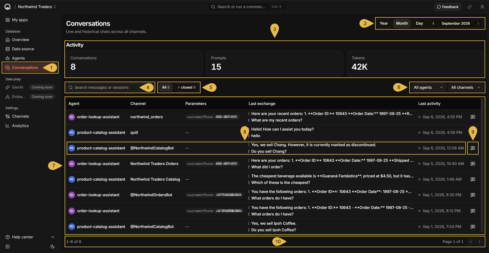
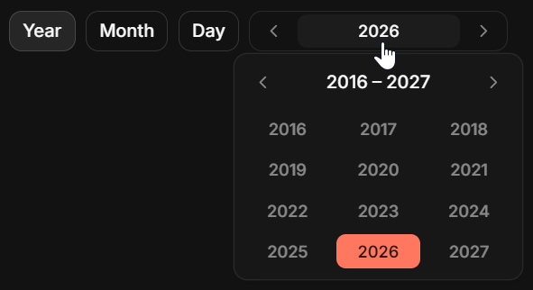
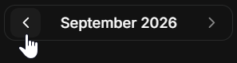
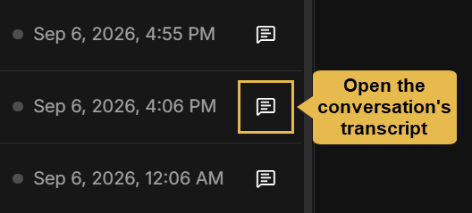
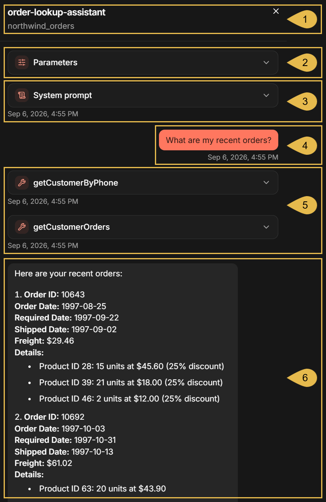
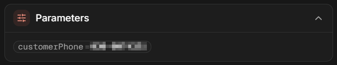
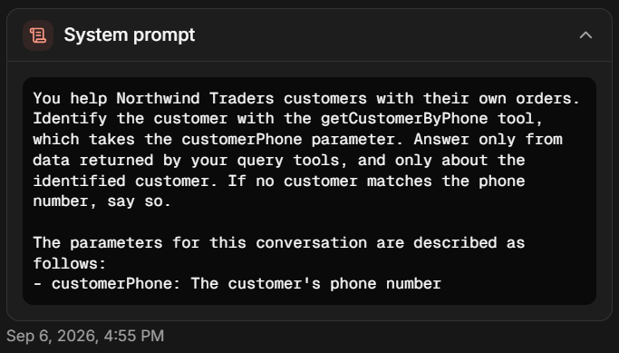
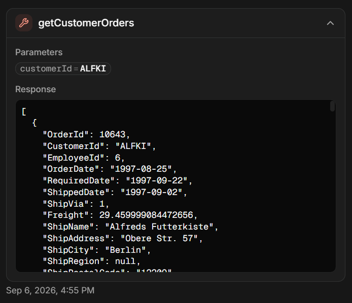

import Admonition from '@theme/Admonition';
import Panel from "@site/src/components/Panel";
import ContentFrame from "@site/src/components/ContentFrame";

<Admonition type="note" title="">

* A **conversation** is the exchange between one of your users and an
  [AI agent](../../overview.mdx#ai-agent), carried over a [channel](../../overview.mdx#channels).

* Quill records the conversations held by the app's agents and lists them in the **Conversations view**, where you
  can follow their history and statistics, find conversations by their properties, and read conversation transcripts.  
  Conversations can be read in this view, but not edited or deleted.

* A conversation's **transcript** shows the full correspondence between your user and the agent as well as the
  instructions the agent followed and the tools the agent ran while answering.

* Conversations are kept available in the Conversations view even after the agents that held them or the channels
  that carried them are deleted.

* In this article:
   * [Opening the Conversations view](#opening-the-conversations-view)
   * [The conversation's transcript](#the-conversation-s-transcript)

</Admonition>

<Panel heading="Opening the Conversations view">

To open the Conversations view, select the app in Quill's management dashboard and click **Conversations** in the
sidebar, under **Database**.

1. **Conversations**  
   Open the Conversations view.
2. **Period selector**  
   Use these controls to select the time period for which conversations are reported and listed.  
   - Click **Year**, **Month**, or **Day** to pick a period span.  
   - Click the period label to pick a specific year, month, or day.  
     
   - Use the arrows to select an earlier or a later period.  
     An arrow is disabled at the end of the available range, which starts with the period in which the app was
     created and ends with the current period.  
     
3. **Activity counters**  
   These counters report the activities of conversations that **started** during the selected period, 
   for the **entire duration** of the conversations, including their activities **after** the selected period.  
   e.g., if the selected period is **August** and a conversation started on August 31 and ended on September 1, 
   the counters will include the conversation's activities for both August 31 and September 1.
   * **Conversations**  
     The number of conversations your users **started** with the app's agents within the selected period.  
     Conversations that started **before** the selected period are not counted, even if they span through 
     this period and are therefore shown in the conversations list.
   * **Prompts**  
     The number of messages your users sent during the conversation runtime.  
     Agent replies are not counted.
   * **Tokens**  
     The number of tokens consumed during the conversation runtime, as reported by the LLM provider.
4. **Search messages or sessions**  
   Enter text to filter the conversations.  
   Quill will match the text against conversations' agent name, channel name, parameter names and values, 
   and last exchange.
5. **The state filter**  
   Filter the listed conversations by their state.  
   - **All** lists all conversations.  
   - A toggle is added for each state found among the listed conversations.  
     Each state has a colour, carried by the dot on its toggle:  
     **active** (green) - list conversations whose last message arrived less than an hour ago.  
     **idle** (amber) - list conversations whose last message arrived between one and 24 hours ago.  
     **closed** (grey) - list conversations whose last message arrived more than 24 hours ago.
6. **The agent and channel filters**  
   Restrict the listed conversations to a single agent or to a single channel.  
   - The agent filter offers only the agents that appear in the conversations currently listed.
   - The channel filter offers only the channels that appear in the conversations currently listed.
7. **The conversations list**  
   Lists the conversations, one row per conversation, the most recently active first.
8. **Conversation information**  
   Each row shows the following details for a single conversation:
   * **Agent**  
     The identifier of the agent that held the conversation, derived from the agent's name.  
     Open the agent's configuration from the
     [Agents view](../../dashboard/manage-an-app/agents-view.mdx#the-agent-s-configuration).
   * **Channel**  
     The channel that carried the conversation.  
     The cell is empty when the conversation was held in the agent's test chat, or when the channel that carried the
     conversation has since been deleted.  
     Open the channel's details from the
     [Channels view](../../dashboard/manage-an-app/channels-view.mdx#the-channel-s-details-view).
   * **Parameters**  
     The agent parameters bound for the conversation, each with the value it was given.  
     A dash is shown when the conversation has no parameters.
   * **Last exchange**  
     The agent's last reply, and the prompt the agent answered.
   * **Last activity**  
     The time of the last message in the conversation, preceded by a dot in the colour of the conversation's state.
9. **View transcript**  
   Open the full transcript of the conversation. See [The conversation's transcript](#the-conversation-s-transcript).
10. **Paging**  
    Each page lists up to 50 conversations. Use the arrows to move to the previous or the next page.  
    The search box, the three filters, and the number each state toggle shows apply only to the current page.

</Panel>

<Panel heading="The conversation's transcript">

To read a full conversation and review its properties, click the transcript icon at the end of the conversation's row
in the conversations list.  
The transcript sheet holds the conversation as it ran, including the user prompts, agent replies, and tools run by the agent.

1. **Agent and channel names**  
   The agent that held the conversation, and the channel that carried it.
2. **Parameters**  
   Expanding the **Parameters** section shows any
   [agent parameters](../../dashboard/manage-an-app/agents-view.mdx#agent-parameters) bound for the conversation,
   each with the value it was given.
   
3. **System prompt**  
   The instructions the agent followed throughout the conversation.  
   Quill adds to the instructions a description of each parameter that is sent to the LLM, so the entry can hold more
   than the system prompt set in the agent's configuration.
   
4. **A prompt**  
   A message your user sent.  
   Every entry in the transcript carries a timestamp indicating the time it was recorded.
5. **The tools the agent ran**  
   Lists each query tool or action the agent ran while answering, labelled with the tool's name.  
   Expanding an entry shows any parameters the LLM provided while requesting the tool, and the tool's response.
   
6. **The agent's reply**  
   The answer the agent returned to your user.

</Panel>
