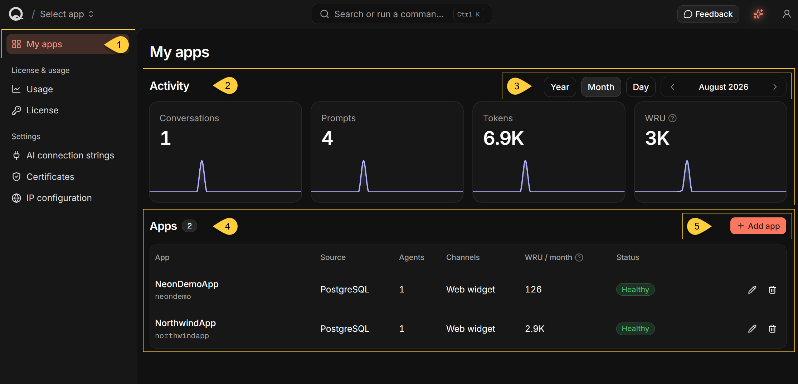
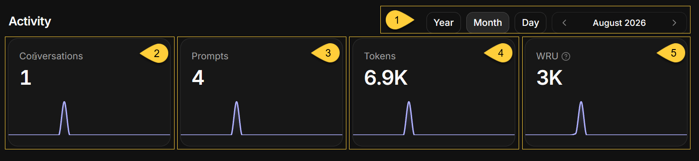
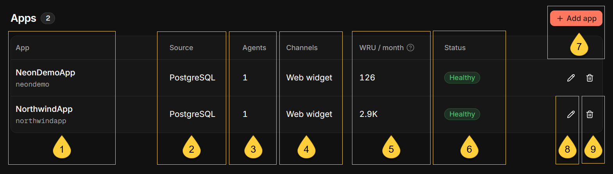

import Admonition from '@theme/Admonition';
import Panel from "@site/src/components/Panel";
import ContentFrame from "@site/src/components/ContentFrame";

<Admonition type="note" title="">

* **My apps** is the default view of the Quill management dashboard, available at `https://dashboard.<your-domain>`.

* The view provides a deployment-wide overview of your apps:  
   * **Activity** summarizes conversations, prompts, tokens, and write usage across all apps for the  selected period.
   * **Apps** lists each app separately, including its source database type, agents, channel types, write usage, and status.

* Click an app's name to open its app-specific dashboard views.

* In this article:
   * [My apps overview](#my-apps-overview)
   * [Activity](#activity)
   * [Apps](#apps)

</Admonition>

<Panel heading="My apps overview">

1. **My apps**  
   Click **My apps** in the sidebar to view deployment-wide activity and the list of apps.

2. **Activity**  
   Four tiles summarize conversations, prompts, tokens, and write usage across all apps for the selected period.  
   Each tile includes a chart showing how that activity is distributed over time.  
   See [Activity](my-apps.mdx#activity) below.

3. **The period**  
   The period the tiles and the table's WRU column report on.  
   See [Select the period](my-apps.mdx#select-the-period) below.

4. **Apps**  
   The **Apps** table lists every app in the deployment.   
   The badge beside the heading shows the total number of apps.   
   See [Apps](my-apps.mdx#apps) below.

5. **Add app**  
   Click **Add app** to open the wizard for connecting a source database and creating a new app.  
   /* TODO: add a relevant link */}

</Panel>

<Panel heading="Activity">

    
    
<ContentFrame>

### Select the period

1. The period selector at the top of the Activity section applies to all four tiles and to the Apps table's WRU column.

  * Select **Year**, **Month**, or **Day** to set the period and its chart buckets:
     * **Year** - monthly buckets.
     * **Month** - daily buckets.
     * **Day** - hourly buckets.
  * Use the arrows to move to the previous or next period. Click the period label to open its picker.
  * The dashboard opens on the current month.
  * You cannot select a day before the deployment's setup date, a month before its setup month,  
    or a year before its setup year.
  * Future buckets are not shown, so the current month's chart ends at today.

</ContentFrame>

<ContentFrame>
    
### The tiles
    
The Activity tiles appear after at least one app has been added.  
Each tile shows the total for the selected period and a chart that breaks the total down by time bucket.  
Hovering over a point shows the bucket's date; in the Day view, it also shows the time.    

2. **Conversations**  
   The number of conversations users started with the deployment's agents.  
   A conversation is a single chat thread: one visitor's exchange with one agent, held over a [channel](../overview.mdx#channels).

3. **Prompts**  
   The number of messages that users sent within those conversations.  
   Only the users' own messages are counted: the agents' replies are not,  
   and neither are the internal messages Quill sends an agent to open a conversation.

4. **Tokens**  
   The total number of tokens reported by the LLM provider for the conversations,  
   including input and output tokens.

5. **WRU**  
   **Write Request Unit** - a measure of write activity in each app's RavenDB database.
     * WRU includes writes made when Quill [mirrors](../overview.mdx#mirroring) changes from source databases, records conversations,  
       and when applications write [directly with RavenDB.Client](../overview.mdx#working-with-quill-using-code).
     * Write usage is reported every 15 minutes, so recent writes may not be included yet.

<Admonition type="note" title="">

A conversation's prompts and tokens are counted in the bucket the conversation **started** in.  
A conversation opened at 23:50 and answered past midnight is reported entirely on the first day.

</Admonition>

</ContentFrame>

</Panel>

<Panel heading="Apps">
    
       

The table lists every app in the deployment.  
The badge beside the **Apps** heading shows the total number of apps.  
Clicking an app's name opens that app's own views.

Until the first app is added, the table is replaced by **No apps added yet** and a button that starts the wizard.

1. **App**  
   The app's name, with the name of its RavenDB database shown underneath.  
   The database name is also used as the app's public URL slug and cannot be changed after the app is created.

2. **Source**  
   The source relational database type: **PostgreSQL**, **SQL Server**, **MySQL**, or **Oracle**.  
   MariaDB sources are shown as **MySQL**.

3. **Agents**  
   The number of agents configured in the app.

4. **Channels**  
   The channel types configured for the app, such as **Web widget**.  
   Each type is listed once, regardless of how many channels of that type are configured.

5. **WRU / month**  
   The app's own write usage over the selected period.  
   The heading follows the period: **WRU / year**, **WRU / month**, or **WRU / day**.  
   The **WRU** tile above totals this figure across all apps.

6. **Status**  
   The app's state, with a line naming the reason where there is one.  
   Quill derives an app's status from its RavenDB database, agents, CDC task, and channels:

    | Status              | Reason shown          | What it means                                                                                                                    |
    |---------------------|-----------------------|----------------------------------------------------------------------------------------------------------------------------------|
    | **Healthy**         |                       | The app has at least one agent, its CDC task is not disabled, and it either has no channels or has at least one enabled channel. |
    | **Setup**           | No AI agent yet       | No agent is configured, so the app cannot respond to users yet.                                                                  |
    | **Needs attention** | Data sync paused      | The app's CDC task is disabled, so its mirrored data no longer follows the source database.                                      |
    | **Needs attention** | All channels disabled | The app has channels, but all of them are disabled, so users cannot reach its agents through a channel.                          |
    | **Unavailable**     | Database unavailable  | Quill could not retrieve status information from the app's RavenDB database.                                                     |

    When multiple conditions apply, **Setup** takes precedence over **Data sync paused**,  
    which takes precedence over **All channels disabled**. Having no channels does not by itself produce a warning.

7. **Add app**  
   Click **Add app** to open the wizard for connecting a source database, mapping the tables Quill will mirror,  
   and creating a new app. {/* TODO: add a relevant link */}

8. **Edit**  
   Click the pencil and confirm to reopen the wizard with the app's existing configuration.  
   Nothing is saved until you finish the wizard. Changing an early step can invalidate the steps after it,  
   so the wizard has you review the remaining steps before saving.

9. **Delete**  
   Click the trash can to permanently delete the app and its RavenDB database, including its mirrored data, agents, channels, and conversations.
   The source relational database and its data are **not** deleted.  
   To confirm, enter the app's name. This action cannot be undone.

</Panel>