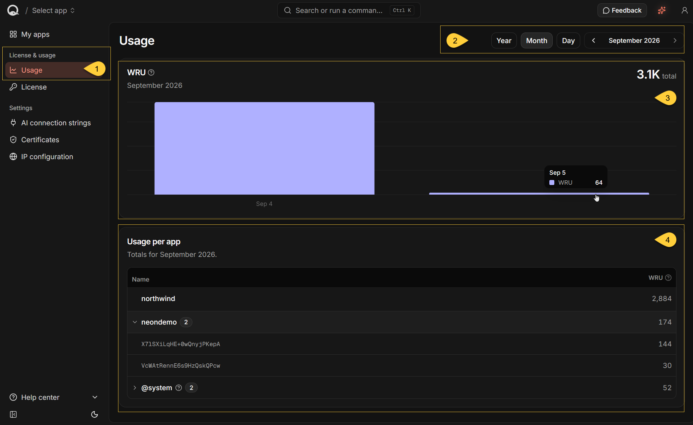
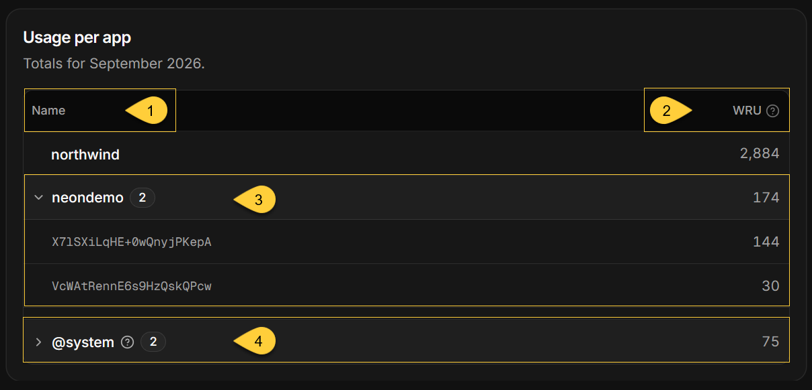

import Admonition from '@theme/Admonition';
import Panel from "@site/src/components/Panel";
import ContentFrame from "@site/src/components/ContentFrame";

<Admonition type="note" title="">

* **Usage** shows write activity reported under the installed Quill license, measured in **Write Request Units (WRU)**.  
  Open it under **License & usage** in the dashboard sidebar, at `https://dashboard.<your-domain>/usage`.

* This is a **license-wide** view. If the same license is used by more than one Quill deployment,  
  the figures can include write usage from all those deployments.

* The view contains:
   * A [WRU chart](#the-chart) that shows total write usage over the selected period.
   * A [Usage per app](#usage-per-app) table that groups the selected period's usage by RavenDB database name.

* Conversation, prompt, and token metrics are not shown in this view.  
  Find their combined totals under [Activity](my-apps.mdx#activity) in **My apps** for your Quill.  
  For a single app, open the app's **Overview** page and use its **Activity** section.

* In this article:
   * [Usage overview](#usage-overview)
   * [Write usage (WRU)](#write-usage-wru)
   * [Usage per app](#usage-per-app)
   * [Data freshness and errors](#data-freshness-and-errors)

</Admonition>

<Panel heading="Usage overview">

1. **Usage**  
   Select **Usage** under **License & usage** in the sidebar to open the view.

2. **Period selector**  
   Choose **Year**, **Month**, or **Day**, and select the period to display.  
   The selection applies to both the chart and the table.  
   Available periods run from this Quill's first start date through today.

3. **WRU**  
   The chart shows the license-wide write usage for the selected period, divided into time buckets.  
   The total for the period appears on the right.  
   Learn more in [Write usage (WRU)](#write-usage-wru) below.

4. **Usage per app**  
   The table groups the selected period's usage by RavenDB database name.  
   For an app database, this is the app's slug, not its display name in **My apps**.  
   When more than one reported database has the same name, expand the row to see their topology IDs.  
   The Dashboard does not show which app or Quill deployment each topology ID belongs to.  
   The **@system** row contains Quill configuration-storage usage.  
   Learn more in [Usage per app](#usage-per-app) below.

</Panel>

<Panel heading="Write usage (WRU)">

<ContentFrame>

### What WRU counts

**Write Request Unit (WRU)** is the unit used to measure write activity in the RavenDB databases reported under your Quill license.

Sources of write activity include:

* Quill [mirroring](../overview.mdx#mirroring) changes from a source relational database to an app's RavenDB database.
* Quill storing conversations in an app's RavenDB database.
* Applications writing directly to an app database with [RavenDB.Client](../overview.mdx#working-with-quill-using-code).
* Quill writing to its own configuration storage, shown in the table as [@system](#usage-per-app).

Usage is reported every 15 minutes, so recent write activity may not appear immediately.

For details about the installed license and its connectivity to RavenDB's licensing API,  
open [**License**](../dashboard/license.mdx) under **License & usage**.

</ContentFrame>

<ContentFrame>

### The chart

The selected period appears beneath **WRU**, with its total on the right.  
The total uses compact number formatting, such as `1.1K` or `18.4M`.

Each bar represents one time bucket:

* **Year** - one bar per month.
* **Month** - one bar per day.
* **Day** - one bar per hour.

Future buckets are not shown.  
During the current period, the values can change when the view loads newer usage data.

Hover over a bar to see its period and WRU.  
Click a bar in the **Year** view to open that month, or in the **Month** view to open that day.  
Bars in the **Day** view are not clickable because it already shows hourly buckets.

</ContentFrame>

</Panel>

<Panel heading="Usage per app">

The **Usage per app** table groups the WRU reported for the selected period by RavenDB database name.  
It is not scoped to a selected app and can include database usage from every Quill deployment using the installed license.

1. **Name**  
   The RavenDB database name reported for usage.  
   For an app database, this is the app's slug.

2. **WRU**  
   The total write usage reported for the row during the selected period.  
   The non-system rows are ordered from highest to lowest WRU.  
   Rows with the same total are ordered by database name.

3. **Databases with the same name**  
   When more than one database reports usage under the same name, the table combines them into one expandable row.
   The badge shows the number of databases, and the WRU column shows their combined usage.

   Expand the row to see each database's topology ID and individual WRU.  
   The expanded entries are ordered from highest to lowest WRU.

   <Admonition type="note" title="">
       
   * The same database name can be reported more than once when:
       
       * Multiple Quill deployments use the same license and contain app databases with the same name.
       * Historical usage was reported for another database with the same name, such as after a database was deleted and recreated.
       
   * Each Quill app has one RavenDB database.  
     An expandable row does not mean that one app has multiple databases.
       
   </Admonition> 

4. **@system**  
   Represents write usage from Quill configuration databases rather than app databases.  
   When present, it appears after the app database rows, and its usage is included in the license-wide WRU total.

   The badge shows the number of configuration databases in the group.  
   Expand the row to see each database's topology ID and individual WRU.  
   The row remains expandable when the badge is `1`.

   Its tooltip explains that Quill uses this storage for apps, channels, and API keys,  
   and that configuration changes count toward the total.

When no usage was reported for the selected period, the table displays **No usage tracked yet.**

<Admonition type="note" title="">
    
#### App and deployment identification

* The table does not currently provide the app display name or deployment identifier needed to map an entry to a specific app in [**My apps**](my-apps.mdx).

* The topology IDs shown for grouped entries identify RavenDB database topologies.
  They are not app names or deployment identifiers, and the Dashboard does not show which app or Quill deployment each ID belongs to.

</Admonition>

<Admonition type="note" title="">
    
#### Why Usage can differ from My apps

* The **WRU** tile under [**Activity**](my-apps.mdx#activity) in **My apps** totals write usage for the current apps in your Quill.
    
* The Usage view is **license-wide**.
  Its totals can also include **@system**, databases from other Quill deployments using the same license, and historical databases that no longer belong to a current app.
    
* The two views can therefore show different WRU totals for the same selected period.

</Admonition>

</Panel>

<Panel heading="Data freshness and errors">

The Usage view shows write usage already reported under the installed license.  
It does not display a quota, remaining allowance, or usage cap.

* The view does not poll for updates.  
  Reload the page, or leave the view and return later, to request newer figures.  
  Usage is reported every 15 minutes, so recent write activity may still take time to appear.

* If the usage request fails, the chart displays **Could not load usage** and the table displays "**Could not load per-app usage**".
  Select **Retry** in either card to request the usage data again.

</Panel>
