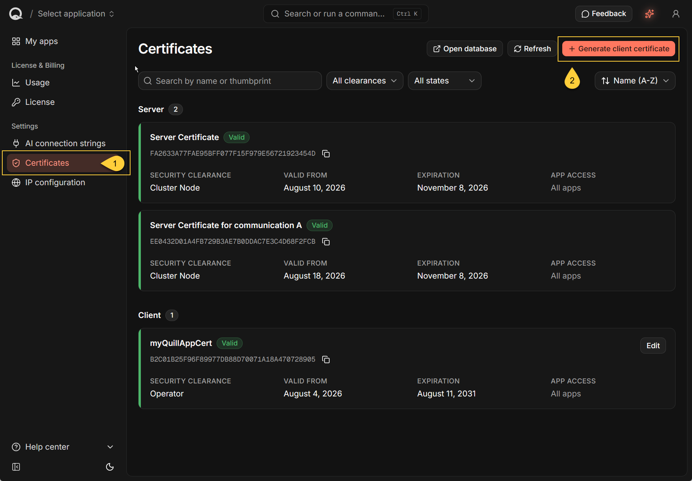
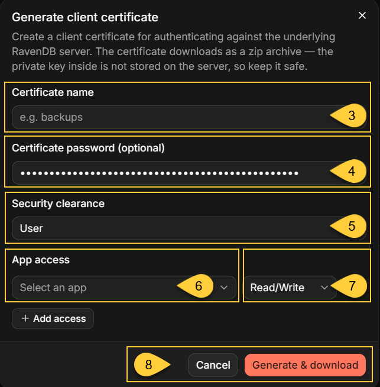
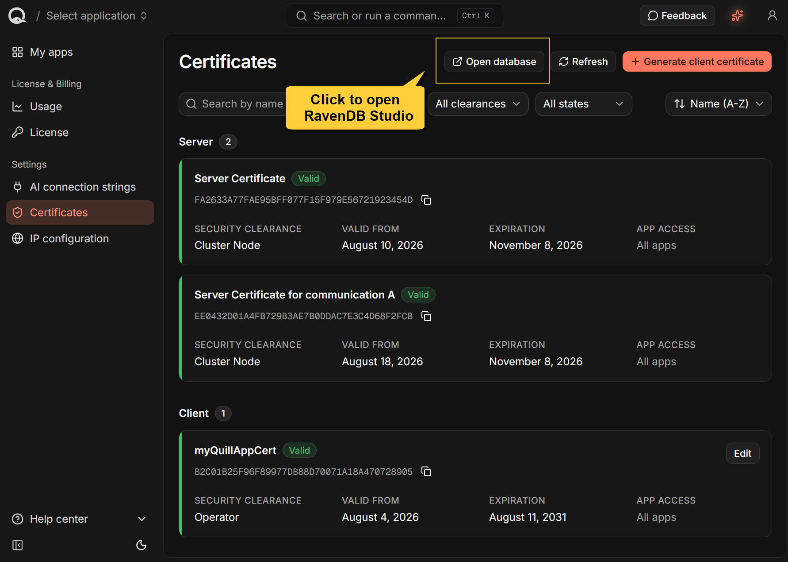

import Admonition from '@theme/Admonition';
import Panel from '@site/src/components/Panel';

<Admonition type="note" title="">

* Quill mirrors selected data from your source relational database into a separate RavenDB database for each Quill app.  
  Quill agents use the mirrored data to compose answers to users' questions.    
    
* Your application can also query the mirrored data directly in RavenDB with `RavenDB.Client`.      
  These queries do not pass through a Quill agent, an LLM, any Quill channel, or the Quill API.
    
* Direct access uses a client certificate generated on the dashboard's **Certificates** page.  
  Give the certificate access only to the app and operations that the application needs.
    
* In this article:
  * [Connecting to the mirrored database](#connecting-to-the-mirrored-database)
    * [When to use direct access](#when-to-use-direct-access)
    * [Generate a client certificate](#generate-a-client-certificate)
    * [Identify the server URL and database](#identify-the-server-url-and-database)
    * [Connect and run a query](#connect-and-run-a-query)
  * [Working with the mirrored data](#working-with-the-mirrored-data)
    * [Understand the mirrored document structure](#understand-the-mirrored-document-structure)
    * [Identify the mapped collections](#identify-the-mapped-collections)
    * [Inspect the CDC task](#inspect-the-cdc-task)
    * [Keep direct access read-only when possible](#keep-direct-access-read-only-when-possible)
  * [Network behavior and limitations](#network-behavior-and-limitations)
    * [Topology discovery](#topology-discovery)
    * [Native TCP features are unavailable](#native-tcp-features-are-unavailable)
    * [Plan for single-node availability](#plan-for-single-node-availability)
  * [Summary](#summary)

</Admonition>

## Connecting to the mirrored database

<Panel heading="When to use direct access">

Use `RavenDB.Client` when your application needs to query or process the mirrored documents directly,  
rather than receive an answer composed by a Quill agent.

Typical examples include application search, reporting, scheduled processing, and queries whose exact shape is controlled by your code.

With `RavenDB.Client`, your application accesses the **mirrored data in RavenDB**, not the source relational database:

  * The source database remains the system of record.
  * Quill's CDC task applies source changes to the mirrored documents asynchronously,  
    so the mirrored data can lag behind the source.
  * Querying the mirrored data does not add query load to the source database.
  * Changes made directly in RavenDB are not written back to the source database.
    
`RavenDB.Client` connects to RavenDB through `https://db.<domain>` without passing through the Quill web application.  
For details about this connection path and its TLS handling, see [Direct database access](../../quill/security-and-architecture/network-architecture.mdx#direct-database-access).
    
</Panel>

<Panel heading="Generate a client certificate">

To connect directly to RavenDB, your application must authenticate with a client certificate.  
The _Dashboard API key_ authenticates only requests to the _Quill API_ and cannot be used for this connection.

Generate the client certificate in the Quill dashboard:
    


1. In the Quill dashboard, open **Certificates**.
2. Select **Generate client certificate**.
    
    
    
3. Enter a descriptive **Certificate name**.
4. Optionally, enter a **Certificate password** for the `.pfx` file in the downloaded archive.
5. Set **Security clearance** to **User**.
6. Under **App access**, select the intended Quill app.
7. Select the least-privileged access level available for the application:

   | Access         | The application can                         | Guidance                                                          |
   | -------------- | ------------------------------------------- | ----------------------------------------------------------------- |
   | **Read/Write** | Query, store, modify, and delete documents. | This is the minimum level available and is used by these examples. |
   | **Admin**      | Administer the app's RavenDB database.      | Do not grant to an ordinary application.                          |

8. Select **Generate & download**.
    
---    

Keep **Security clearance** set to **User** for an ordinary application.  
An **Operator** certificate has server-wide authority and is not limited to the selected app.  
It can access every app database and Quill's configuration database.  

**Admin** access to an app database can read its database configuration, including the source connection string used by the CDC task.
Because that connection string can contain source database credentials, reserve both **Admin** access and **Operator** clearance for trusted operators.

<Admonition type="warning" title="">
    
#### Protect the downloaded archive    

* The downloaded archive contains a `.pfx`, a `.crt`, and a `.key` file.  
  `RavenDB.Client` uses the `.pfx`.  
    
* The optional certificate password encrypts only the `.pfx`.  
  The `.key` contains the same private key in unencrypted PEM form, so protect the complete archive as a secret.
    
* Quill stores the public certificate but does not retain a downloadable copy of the private key.  
  If the private key is lost, generate a replacement certificate.
    
* If the certificate or private key is exposed, open **Certificates**, select **Edit**, turn **Enabled** off, and generate a replacement.
  Disabling the certificate prevents new authentication, but existing connections may remain active until they are closed.

</Admonition>

Generated client certificates are valid for five years and cannot be renewed in place.  
Before a certificate expires, generate a replacement, update the application to use it, and then disable the old certificate.

For a standard Quill domain, RavenDB presents a publicly trusted wildcard server certificate,   
so the application needs no additional server-certificate trust configuration.  
Client certificates are registered separately by thumbprint,  
so renewing the Quill server certificate does not invalidate them.

</Panel>

<Panel heading="Identify the server URL and database">

Configure the `DocumentStore` with both a server URL and an app database name.  
They identify different things:

| Property   | Set it to                       | Identifies                                          |
| ---------- | ------------------------------- | --------------------------------------------------- |
| `Urls`     | `https://db.<domain>`           | The RavenDB server for your Quill instance.         |
| `Database` | The app's RavenDB database name | The database containing that app's mirrored data.   |

`<domain>` is the base domain assigned to your Quill instance.  
For example, if your Quill name is `acme`, the server URL is `https://db.acme.myquill.ai`.

Quill creates a separate RavenDB database for each app.  
For an app created through the current setup flow, the database name is the app slug shown beneath the app name in the dashboard.
For example, the slug `northwind-app` identifies the RavenDB database named `northwind-app`.

To retrieve the authoritative database name programmatically, list the Quill apps:

```http
GET https://api.<domain>/api/apps/
X-Api-Key: <dashboard-api-key>
```
<br/>

Each app in the response includes both `slug` and `database`.  
Set `DocumentStore.Database` to the value of `database`; do not derive it from the app's display name.

For more information about authenticating this Quill API request, see [Operator Authentication](../../quill/security-and-architecture/operator-authentication.mdx).

</Panel>

<Panel heading="Connect and run a query">

Install the RavenDB client package in your application:

```bash
dotnet add package RavenDB.Client
```
<br/>

The following .NET 9 or later example loads the `.pfx`, connects to the app's RavenDB database,  
and queries the mapped `Products` collection:

```csharp
using System;
using System.Linq;
using System.Security.Cryptography.X509Certificates;
using Raven.Client.Documents;

var certificatePassword =
    Environment.GetEnvironmentVariable("QUILL_CLIENT_CERTIFICATE_PASSWORD");

using var certificate = X509CertificateLoader.LoadPkcs12FromFile(
    @"C:\secrets\quill-client.pfx",
    certificatePassword);

using var store = new DocumentStore
{
    Urls = new[] { "https://db.<domain>" },
    Database = "northwind-app",
    Certificate = certificate
};

store.Initialize();

using var session = store.OpenSession();

var products = session
    .Query<Product>(collectionName: "Products")
    .Take(10)
    .ToList();

foreach (var product in products)
{
    Console.WriteLine(product.Name);
}

public sealed class Product
{
    public string? Name { get; set; }
}
```
<br/>

Replace the example values with those for your Quill app:  
        
  * `https://db.<domain>` - the value of `Urls` returned for the app.
  * `northwind-app` - the value of `Database` returned for the app.
  * `C:\secrets\quill-client.pfx` - the path to the downloaded `.pfx`.
  * `Products` - the exact collection name defined by the app's mapping.
  * `Product` and its properties - a class matching the properties your application reads from the mapped documents.

The example reads the certificate password from an environment variable instead of storing it in source code.  
If the `.pfx` was created without a password, the environment variable can be absent.

Applications targeting .NET 8 or earlier can load the certificate with `new X509Certificate2(path, password)` instead.  
`X509CertificateLoader` is the recommended API in .NET 9 and later.

The explicit `collectionName` makes the query target the mapped collection exactly.
Without it, RavenDB.Client derives the collection name from the .NET type—for example, `Query<Customer>()` targets `Customers` by default.

The `collectionName` argument applies only to this query.
To override the collection convention throughout the application, configure `FindCollectionName` before calling `Initialize()`, which freezes the store conventions.

Topology updates remain enabled in this example, as expected when both `db.<domain>` and `a.<domain>` are reachable.  
See [Topology discovery](#topology-discovery) if the application uses custom DNS or routing.

</Panel>

## Working with the mirrored data

<Panel heading="Understand the mirrored document structure">    

The source relational schema is not mirrored one-to-one as a separate RavenDB collection for every table.  
The CDC mapping defined for the app determines:

  * the collection, document, and property names;
  * which source tables produce root documents;
  * which related rows are embedded as nested objects or arrays;
  * which relationships are represented by properties containing other RavenDB document IDs;
  * which source columns are stored as RavenDB attachments rather than document properties; and
  * how source values are represented in JSON.

---
    
Before defining application classes and queries, inspect representative mirrored documents and any attachments they contain.


    
The **Open database** button on the dashboard's Certificates page opens RavenDB Studio through `db.<domain>`.  
If prompted, select a client certificate that has access to the app database.  
You can then inspect the database's collections, documents, and attachments.

---      
    
For each row from a mapped root table, CDC builds the RavenDB document ID from the mapped collection name and the source primary-key value.
For example, a row with primary key `1` mapped to the `Products` collection becomes:

```text
Products/1
```
<br/>
    
For a composite primary key, each key value contributes another segment to the document ID.
Use the collection names, document IDs, and property names found in the app database rather than deriving them from the original table names.

</Panel>

<Panel heading="Identify the mapped collections">

The app database contains both mirrored source data and documents that Quill uses internally for agent-related configuration, channels, conversations, and CDC processing.
    
These internal documents are not mirrored from the source relational database and should not be used as application data.

Most collections containing these internal documents begin with `@`, but not all of them do.  
For example, the `WidgetThemeDefaults` collection contains Quill's `widget-theme-defaults/config` document and has no `@` prefix.

The following Quill API endpoint lists currently present collections whose names do not begin with `@`:

```http
GET https://api.<domain>/api/apps/{slug}/collections
X-Api-Key: <dashboard-api-key>
```
<br/>

The endpoint filters collections only by their name prefix.
Its response can therefore include a non-`@` Quill collection such as `WidgetThemeDefaults`, 
and it may not include a mapped collection that currently has no documents.

Use the response as a starting point, then confirm the mapped collections against the app's CDC mapping or by inspecting their documents in RavenDB Studio.
Use only confirmed mapped collections as application data.  
        
Other collections and documents are used internally by Quill, so your application should not depend on their structure or contents.        

</Panel>

<Panel heading="Inspect the CDC task">

Quill creates a CDC Sink task in each app database to keep its mapped documents synchronized with the source relational database.

You can inspect the task and its status:

* In RavenDB Studio, open the app database and go to **Ongoing Tasks**.
* In client code, use `GetOngoingTaskInfoOperation`.  
  The task name is the `cdcTaskName` returned for the app by `GET https://api.<domain>/api/apps/`.

```csharp
using Raven.Client.Documents.Operations.OngoingTasks;

var task = await store.Maintenance.SendAsync(
    new GetOngoingTaskInfoOperation(
        "<cdc-task-name>",
        OngoingTaskType.CdcSink));
```
<br/>

A **User** certificate with **Read** or **Read/Write** access can inspect the task.  
**Admin** access is required to edit, enable, disable, or delete it.

<Admonition type="warning" title="">

#### Do not modify the CDC task directly    
    
Quill reads the task configuration from the app database.  
Changes made in RavenDB Studio or through `RavenDB.Client` therefore affect the task used by the Quill app.

| Direct change                            | Effect |
| ---------------------------------------- | ------ |
| Disable the task                         | Mirroring stops. Existing documents remain available to agents and direct queries, but become stale. |
| Change the source connection or mappings | Changes what CDC reads or writes. This can affect the data used by agents, connected channels, and direct queries. Existing mirrored documents are not automatically removed when mappings change. |
| Rename the task                          | Quill continues to look for the original task name, so its CDC configuration and monitoring endpoints can no longer find the task. Re-running setup can create another task under the original name. |
| Delete the task                          | Mirroring stops, but the mirrored documents and the task's `@cdc-states` progress document remain. Quill does not recreate the task during normal app operation. |

</Admonition>

</Panel>

<Panel heading="Keep direct access read-only when possible">

For an application that only queries the mirrored data, use a **User** certificate with **Read** access.  
This prevents the application from changing either the mirrored documents or Quill's internal data.

<Admonition type="warning" title="">

#### Writes do not update the source database

Changes made through `RavenDB.Client` affect only the app's RavenDB database.  
They are never written back to the source relational database.

Do not modify mirrored documents or documents used internally by Quill, including the CDC progress documents in the `@cdc-states` collection.    

| Direct change                                                   | What can happen |
| --------------------------------------------------------------- | --------------- |
| Modify mapped properties, nested data, attachments, or metadata | A later applicable source change can overwrite the modification. |
| Delete a mirrored document                                      | A later change to the source row can recreate the document. |
| Create a document at a mirrored ID in the same collection       | CDC merges the mapped source properties into the existing document and replaces its metadata. Unmapped top-level properties can remain, producing a mixed document. |
| Create a document at a mirrored ID in another collection        | The next CDC write for that row fails, the batch is rolled back, and the checkpoint does not advance until the ID collision is removed. |
| Modify or delete a document in `@cdc-states`                    | A running task can overwrite the change. If the change remains, it can alter where CDC processing starts the next time the task runs. |

A CDC task can remain configured as **Enabled** even when an error prevents its mirror from advancing.  
Monitor the task's CDC health and errors rather than relying only on its enabled state.

</Admonition>
    
---
    
#### Store application documents separately

* If an application must store its own documents in the app database,  
  use collection names and document ID prefixes that cannot overlap with mirrored data or Quill's internal data.

* Document expiration is enabled on every app database and checks for expired documents every 60 seconds.
  Any application document containing `@expires` metadata becomes eligible for automatic deletion after that timestamp.

</Panel>

## Network behavior and limitations

<Panel heading="Topology discovery">

Use `https://db.<domain>` as the initial server URL.

After connecting, RavenDB.Client reads the server topology.
RavenDB advertises its node as `https://a.<domain>`, so the client may send subsequent requests through that hostname.

In a standard Quill deployment:

* `db.<domain>` and `a.<domain>` are public DNS records that resolve to the same Quill host;
* the Quill wildcard server certificate covers both hostnames; and
* both hostnames route HTTPS traffic on port `443` to RavenDB while preserving client-certificate authentication.

Leave topology updates enabled when the application can resolve and reach both hostnames.

If the application reaches `db.<domain>` through split-horizon DNS, a hosts-file entry, or a hostname-specific network rule, provide equivalent access to `a.<domain>`.

If `a.<domain>` cannot be made reachable, a Quill deployment's single RavenDB node can remain on the configured `db.<domain>` URL by disabling topology updates:

```csharp
using var store = new DocumentStore
{
    Urls = new[] { "https://db.<domain>" },
    Database = "northwind-app",
    Certificate = certificate,
    Conventions = { DisableTopologyUpdates = true }
};

store.Initialize();
```
<br/>

Configure `DisableTopologyUpdates` before calling `Initialize()`.  
For more information, see [The `a` hostname](../../quill/networking-and-dns.mdx#the-a-hostname).

</Panel>

<Panel heading="Native TCP features are unavailable">

Direct RavenDB access through `db.<domain>` or `a.<domain>` uses HTTPS on external port `443`.

Document loads, queries, and the Changes API require no additional inbound RavenDB port.  
The Changes API uses WebSockets through the same HTTPS endpoint.

The Quill container does not expose RavenDB's native TCP listener or publish a corresponding TCP hostname.
RavenDB.Client features that open a native TCP connection - most notably data subscription workers - therefore cannot connect from outside the Quill container.

</Panel>

<Panel heading="Plan for single-node availability">

A Quill deployment runs a single RavenDB node.
The topology-discovered `a.<domain>` hostname provides another route to that same node, not a second node for failover.

If the Quill deployment is unavailable, RavenDB.Client cannot switch to another RavenDB node.

If the Quill host moves to another IP address, update all Quill DNS records so that `db.<domain>`, `a.<domain>`,  
and the other Quill hostnames resolve to the new address.
See [Moving your Quill to a new IP](../../quill/networking-and-dns.mdx#moving-your-quill-to-a-new-ip).

</Panel>

<Panel heading="Summary">

* `RavenDB.Client` provides a direct path to the mirrored documents and can be used in addition to Quill agents and channels.
    
* Generate a **User** client certificate on the dashboard's Certificates page and grant it access only to the intended app.
  Prefer **Read** access when the application only queries data.
    
* Configure the `DocumentStore` with `https://db.<domain>`, the app database name, and the downloaded `.pfx` certificate.
    
* Inspect the mapped collections, document structure, and attachments before defining application classes and queries.
  Use the exact mapped collection name when it differs from RavenDB.Client's naming convention.
    
* Treat both mirrored documents and documents used internally by Quill as read-only.
  Direct writes are not sent to the source database and can be overwritten by CDC or prevent the mirror from advancing.
    
* Ensure that the application can reach both `db.<domain>` and the topology-discovered `a.<domain>`.  
  Disable topology updates only when `a.<domain>` cannot be made reachable.
            
* Direct access uses HTTPS on port `443`.
  Quill exposes a single RavenDB node and no native TCP listener,  
  so external clients have no node failover and cannot run data subscription workers.

</Panel>