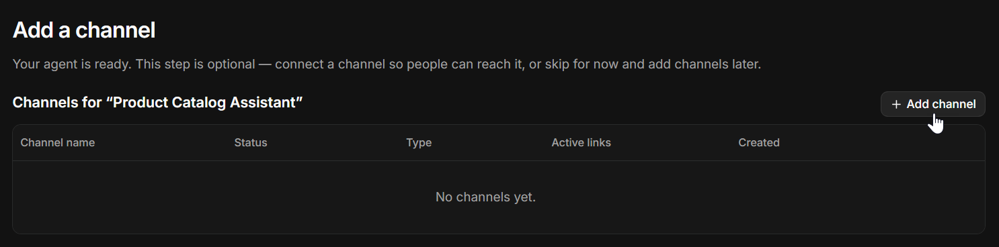
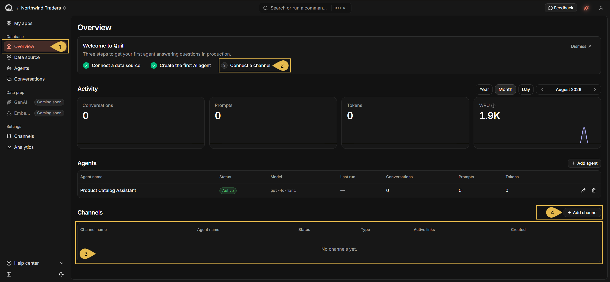
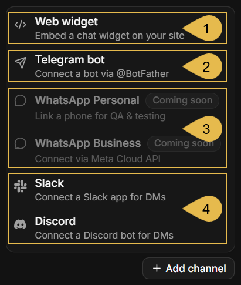
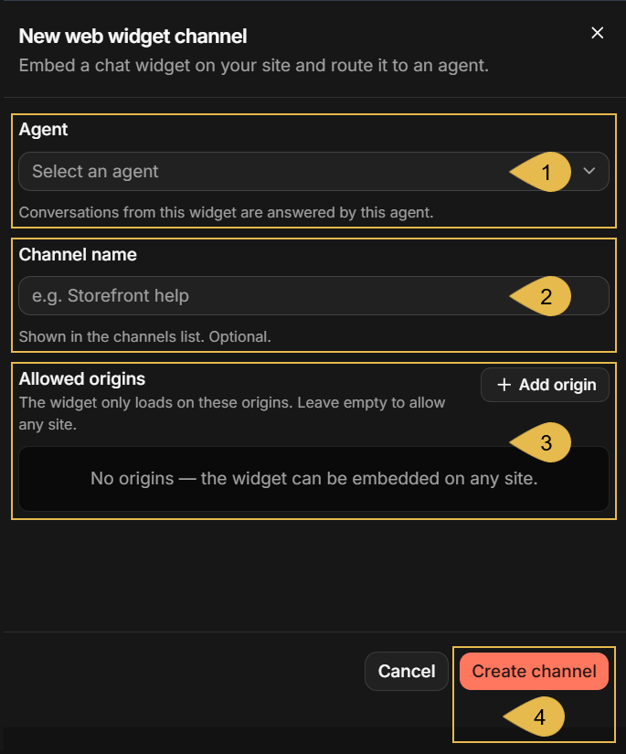
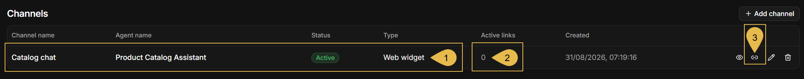
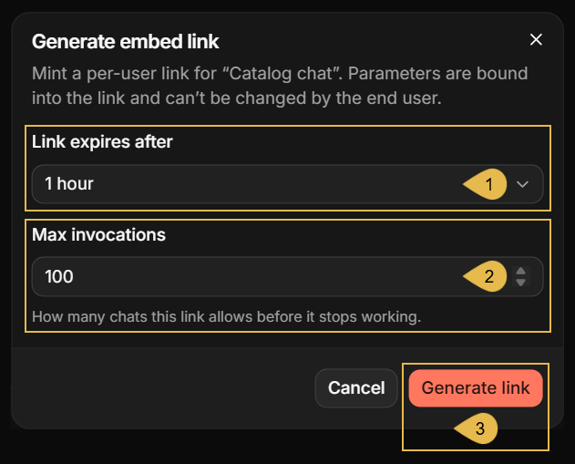
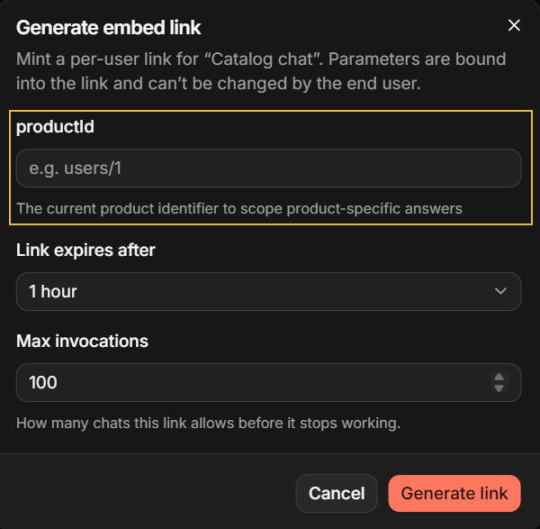
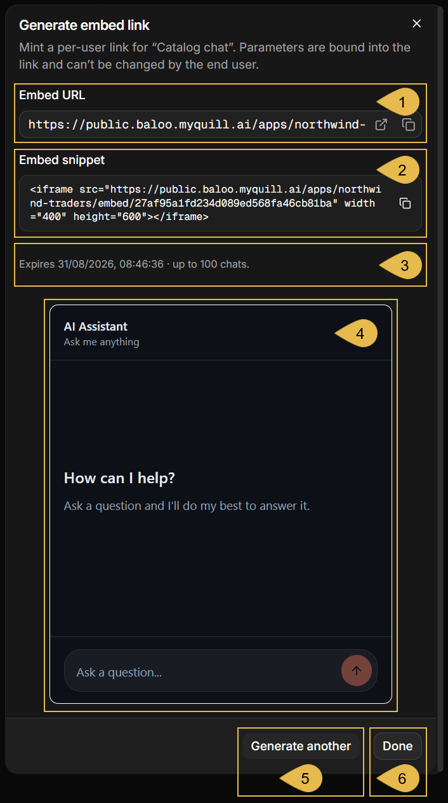
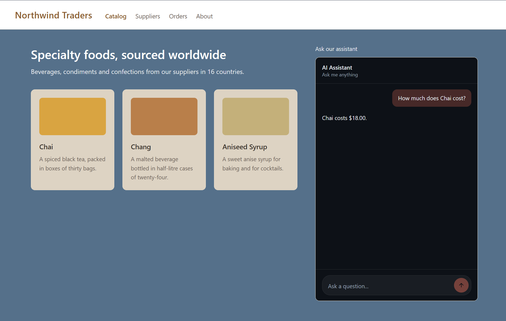

import Admonition from '@theme/Admonition';
import Panel from "@site/src/components/Panel";
import ContentFrame from "@site/src/components/ContentFrame";

# Getting started: Adding a web widget channel
<Admonition type="tip" title="">

**Achieved so far** in Getting Started:  
[Signing up](../getting-started/signing-up.mdx) - your deployment has a name, a license key, and a dashboard API key.  
[Starting Quill](../getting-started/starting-quill.mdx) - Quill is running on your machine, and its management dashboard is open.  
[Connecting your database](../getting-started/connecting-your-database.mdx) - Quill can reach your source database, and the tables
your app will work with are selected.  
[Mapping your tables](../getting-started/mapping-your-tables.mdx) - your app is created, and Quill keeps its internal database
current with your source data.  
[Adding an AI agent](../getting-started/adding-an-ai-agent.mdx) - your app has an agent that answers from its internal database.

</Admonition>

<Admonition type="note" title="">

* You have now [created an agent](../getting-started/adding-an-ai-agent.mdx#saving-the-agent) that is ready to answer, but your
  users have no way to reach it yet.  
  In **Adding a web widget channel**, the sixth Getting Started step, you create the app's first channel and place a
  working chat box on a page of your own website.

   <Admonition type="info" title="">

   * A [channel](../overview.mdx#channels) carries the conversations between your users and an agent.
   * A [web widget](../overview.mdx#web-widget) is a channel that opens to a chat box on your website page.

   </Admonition>

* The web widget is one of the [channel types Quill offers](../channels/overview.mdx#channel-types). You can also add channels
  that carry conversations through a Telegram bot, a Slack app, or a Discord bot, reaching your users where they already are.

* A channel has no address of its own.  
  A chat box is opened through an **embed link**, an address you generate for a specific conversation carried by the channel 
  and place on your page.  
  You can choose how long an embed link and the conversation it opens will last, and how many chats are allowed through this link.

* Once the chat box is on your page, your users can use it to ask their questions and are answered from your app's
  data. They are not required to have an account or know anything about Quill.

* In this article:
   * [Creating the web widget channel](#creating-the-web-widget-channel)
      * [Opening the Add channel menu](#opening-the-add-channel-menu)
      * [Naming the channel and setting its allowed origins](#naming-the-channel-and-setting-its-allowed-origins)
   * [Generating an embed link](#generating-an-embed-link)
      * [Opening the Generate embed link dialog](#opening-the-generate-embed-link-dialog)
      * [Setting the link limits](#setting-the-link-limits)
      * [Copying the link and trying it out](#copying-the-link-and-trying-it-out)
   * [Placing the chat box on your page](#placing-the-chat-box-on-your-page)

</Admonition>

<Panel heading="Creating the web widget channel">

<ContentFrame>

### Opening the Add channel menu

A channel is added from the **Add channel** menu, which can be reached in two ways:

* If you arrived here from the previous Getting Started step, you are already in the right place: clicking
  **Save agent** at the last stage of the **Add agent** wizard created the agent and opened the
  **Add a channel** stage.

   

   Click **Add channel** to open the menu of channel types.

* If you didn't arrive through the Getting Started path,
  [open Quill's management dashboard](../getting-started/starting-quill.mdx#signing-in-to-the-management-dashboard) and click the
  app you want to add a channel to, on the **My apps** list.

   

   1. **Overview**  
      The app opens on this view, where your agents and channels are listed.

   2. **Connect a channel**  
      The last of the three setup steps the welcome banner tracks, and a link to the app's **Channels** view.  
      The banner is shown until all three steps are done, and can be dismissed at any time.

   3. **The channels table**  
      Lists the channels the app already has. Yours has none yet.

   4. **Add channel**  
      Click to open the menu of channel types.

---

Both routes reach the same menu:



1. **Web widget**  
   Click to add a web widget channel.

2. **Telegram bot**  
   Carries the conversations through a Telegram bot that you create with Telegram's own `@BotFather`.

3. **WhatsApp Personal** and **WhatsApp Business**  
   Not available yet; **Coming soon**.

4. **Slack** and **Discord**  
   Carry the conversations through a Slack app or a Discord bot, in private chats between your users and the
   bot.

</ContentFrame>

<ContentFrame>

### Naming the channel and setting its allowed origins



1. **Agent**  
   Select the agent that will answer the conversations this channel carries.  
   When you reach this form from the **Add agent** wizard, the agent you just created is already set and this
   field is not shown.

2. **Channel name**  
   Enter a name for the channel.  
   The name is shown in the app's channels list.  
   e.g., **Catalog chat**  
   This field is optional. If you leave it empty, Quill names the channel for you.

3. **Allowed origins**  
   Enter the addresses of the websites allowed to embed the chat box, one entry per website.  
   While the list is empty, any website can embed the chat box.

4. **Create channel**  
   Click to create the channel and add it to the app.

</ContentFrame>

</Panel>

<Panel heading="Generating an embed link">

The channel now exists, but there is no way to reach its chat box yet.  
An **embed link** is such a way: you generate a link to a conversation carried by the channel, 
embed the link in your site, and your users can use the chat box it opens.

<ContentFrame>

### Opening the Generate embed link dialog



1. **The new channel**  
   The new channel's entry under **Channels** shows the agent that answers its conversations, and its type,
   **Web widget**.

2. **Active links**  
   The number of links generated for this channel. Yours has none yet.  
   Only links that haven't expired yet are counted.

3. **Generate link**  
   Click to generate an embed link for this channel.

</ContentFrame>

<ContentFrame>

### Setting the link limits



1. **Link expires after**  
   Select how long the link will last: 1 hour, 4 hours, 24 hours, 7 days, or **Custom** for a duration of your
   own, entered as a number and a time unit, from one minute to thirty days.

2. **Max invocations**  
   Enter the number of chats that the link allows, 100 by default and up to 1,000,000.

3. **Generate link**  
   Click to generate the link.

The limits' exact behavior, including the message your users will see once a link expires or its chats are
used up, is covered in
[Invalid links](../channels/web-widget.mdx#invalid-links).

---

When the agent takes parameters, the dialog opens a field for each parameter.



The field's name and the text under it are the parameter's name and description, taken from the agent's
configuration.  
Every parameter the agent has must be given a value before the link can be generated.

The values you enter for these parameters are bound into the link and cannot be changed by users.  
You can, for example, generate an embed link for a specific product, with the product's ID already bound into
the link, so the agent's queries and answers will relate only to this product.

</ContentFrame>

<ContentFrame>

### Copying the link and trying it out



1. **Embed URL**  
   The address that opens the chat box.  
   Copy the address, or open it in a browser to see the chat box on a page of its own.

2. **Embed snippet**  
   The same address, wrapped in an `<iframe>` element that you can place on your page
   (see [Placing the chat box on your page](#placing-the-chat-box-on-your-page)).

3. **The link's limits**  
   The link's expiration time and number of allowed chats.

4. **The chat box**  
   A working chat box, served by the link shown above it.  
   Ask a question in the chat box that can be answered from your app's data. The agent will reply here as it will on your site.  
   Chats initiated here **are** counted against the link's limit.

5. **Generate another**  
   Click to return to the settings and generate an additional link for this channel.  
   The settings you used are kept in the form, and the link you just generated remains valid.

6. **Done**  
   Click to close the dialog.

</ContentFrame>

</Panel>

<Panel heading="Placing the chat box on your page">

The **Embed snippet** you copied is the whole integration. Paste it into the HTML of the page that will offer the chat box:

```html
<iframe src="https://public.<your-domain>/apps/<app-slug>/embed/<link-token>" width="400" height="600"></iframe>
```
<br />

The chat box is served by your Quill deployment, so the page needs nothing else: no library to install, no
script to add, and no styling to write.  
Set the `width` and `height` to suit your layout, and shape the element as you please: a `title` attribute,
a style, or any other addition that blends the chat box into your website.



A visitor types a question into the chat box and is answered from your app's data, without an account or 
any other dealings with Quill.

---

Two things are left to settle before a page like this faces real visitors:

* **The allowed origins of the channel.**  
  While the [allowed origins list](#naming-the-channel-and-setting-its-allowed-origins)
  is empty, any website can embed the chat box.  
  Edit the channel and enter the addresses of your own websites if you want to keep the chat box to them.

* **A link for each visitor.**  
  A link carries one conversation and one set of limits, so everybody visiting a page that holds an embed link
  will share the same conversation and limits.  
  A live site commonly [generates a link per visitor](../developer-access/embed-the-chat-widget.mdx#mint-links-from-your-own-backend),
  and places the link in the page as the page is served.

Both are covered in [Embed the Chat Widget](../developer-access/embed-the-chat-widget.mdx).

</Panel>

<Admonition type="tip" title="">

This concludes the Getting Started path:  
Quill is deployed and you can access and manage it,  
your source data is mirrored into your app's internal database,  
an agent answers from this internal database,  
and your users can reach the agent through a chat box on your website.

The channel's full documentation, including its management options and limitations, is in
[Channels: Web widget](../channels/web-widget.mdx).

There is much more to Quill than these pages cover, including other channels besides the web
widget, and actions your agents may run.  
The [Overview](../overview.mdx) page is a good starting point for more, and you can then navigate the
documentation and, above all, experiment in your own deployment.

</Admonition>
