import Admonition from '@theme/Admonition';
import Panel from "@site/src/components/Panel";
import ContentFrame from "@site/src/components/ContentFrame";

# Getting started: Adding an AI agent
<Admonition type="tip" title="">

**Achieved so far** in Getting Started:  
[Signing up](../getting-started/signing-up.mdx) - your deployment has a name, a license key, and a dashboard API key.  
[Starting Quill](../getting-started/starting-quill.mdx) - Quill is running on your machine, and its management dashboard is open.  
[Connecting your database](../getting-started/connecting-your-database.mdx) - Quill can reach your source database, and the tables
your app will work with are selected.  
[Mapping your tables](../getting-started/mapping-your-tables.mdx) - your app is created, and Quill keeps its internal database
current with your source data.

</Admonition>

<Admonition type="note" title="">

* The app's internal database now [holds a copy of your source data](../getting-started/mapping-your-tables.mdx#creating-the-app).  
  **Adding an AI agent**, the fifth Getting Started step, walks you through the creation of the app's first
  agent using the **Add agent** wizard.

* An **agent**'s job is to answer your users' questions, and to carry out **actions** on their behalf, e.g.,
  opening a support ticket in another system.  
  The agent's configuration holds a **system prompt**, which sets the agent's role, the **query tools** that
  fetch from the internal database the data an answer needs, the **actions** you define, and the connection
  Quill uses to reach your LLM provider.

* Quill can draft the agent's configuration from the app's [mapping](../getting-started/mapping-your-tables.mdx). You can also
  provide a description of the intended agent, that Quill will apply while creating the draft.  
  Or, you can build the agent yourself, starting from an empty form.  
  Whichever route you choose, you can change any part of the configuration before the agent is created.

* You can test your draft agent by chatting with it. Each reply shows any query the agent ran and the
  documents the query returned, so you can see the data behind the answer.

* When the agent is saved and added to the app, your users will be able to reach the agent through a
  **channel** (covered in the next Getting Started step).

* In this article:
   * [Prerequisites](#prerequisites)
   * [Opening the Add agent wizard](#opening-the-add-agent-wizard)
   * [Connecting to your LLM provider](#connecting-to-your-llm-provider)
   * [Drafting your agent](#drafting-your-agent)
      * [Accepting the AI Terms of Use](#accepting-the-ai-terms-of-use)
      * [Choosing a starting point](#choosing-a-starting-point)
   * [Reviewing your agent](#reviewing-your-agent)
      * [Reviewing the drafted agent](#reviewing-the-drafted-agent)
      * [Modifying the agent configuration](#modifying-the-agent-configuration)
   * [Testing and saving your agent](#testing-and-saving-your-agent)
      * [Chatting with the draft agent](#chatting-with-the-draft-agent)
      * [Saving the agent](#saving-the-agent)

</Admonition>

<Panel heading="Prerequisites">

Before adding an agent, make sure you have the access details for an
[LLM provider](../overview.mdx#llm), which your agent will use to phrase its replies:

* The chat-model providers Quill can work with are **OpenAI** and **Azure OpenAI**, hosted services you hold
  an API key for, and **Ollama**, running locally on your own machine.  
  A local model keeps your conversations private: they stay on your own machine, and never reach a third
  party's servers.
* The model you name has to be a chat model. Quill tests the connection before saving it, and refuses a model
  that cannot hold a conversation.

</Panel>

<Panel heading="Opening the Add agent wizard">

The **Add agent** wizard can be started in two ways:

* If you arrived here from the previous Getting Started step, you are already in the right place: you followed
  the **[Add new app](../getting-started/mapping-your-tables.mdx#creating-the-app)** wizard, clicked
  **Continue** at its last stage, and are now at the **Add agent** wizard.
* If you didn't arrive through the Getting Started path,
  [open Quill's management dashboard](../getting-started/starting-quill.mdx#signing-in-to-the-management-dashboard) and click
  the app to which you want to add an agent, on the **My apps** list.

   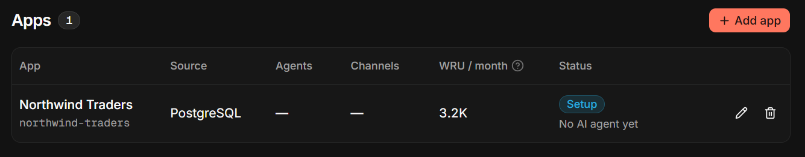

   The app's **Agents** table lists the agents that were already created and offers an **Add agent** button.
   Click the button to start the wizard.

   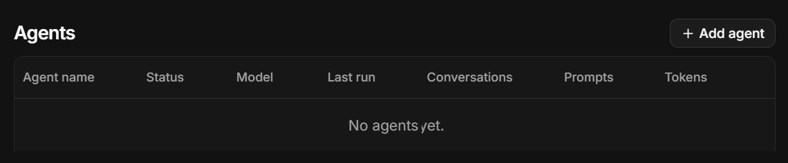

</Panel>

<Panel heading="Connecting to your LLM provider">

The wizard opens by asking for a connection string, with which the new agent will reach the LLM that phrases
the agent's replies.

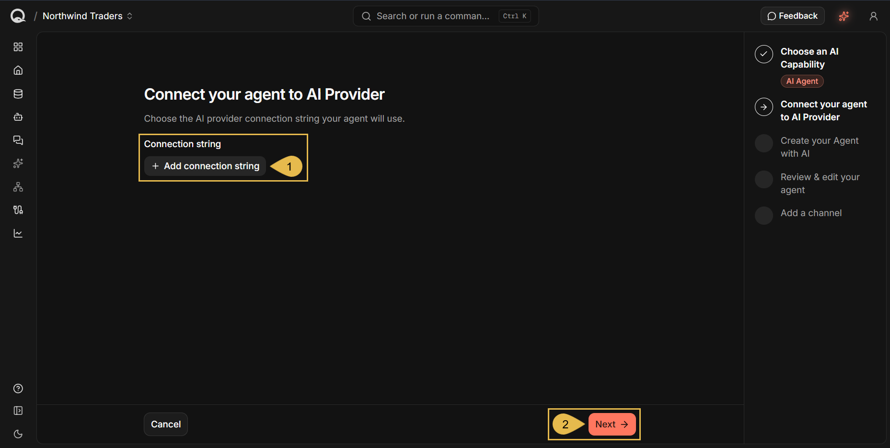

1. **Add connection string**  
   Click to enter the access details of your LLM provider.  
   When you save these details, Quill will store them as an **AI connection string** that every app on this
   deployment can use.

   <ContentFrame>

   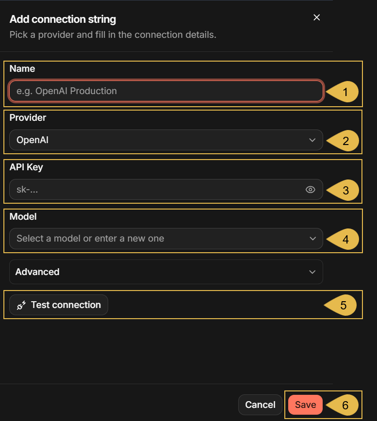

   * **A. Name**  
     Enter a name for the connection string.  
     e.g., **Chat model**
   * **B. Provider**  
     Select your LLM provider.  
     The fields below change to match the provider you select; the fields depicted in the example above are
     for OpenAI.
   * **C. API Key**  
     Enter the key your provider issued.
   * **D. Model**  
     Enter the model the agent will use, or select it from the list that shows up once the key is in place.  
     e.g., `gpt-4o-mini`
   * **E. Test connection**  
     Click to verify that the model can be reached and can serve an agent.  
     The button is replaced by a confirmation when the check passes:

     

   * **F. Save**  
     Click to store the connection string and select it for your agent.  
     Saving runs the same check as **Test connection**; a connection that fails the test is not stored.

   </ContentFrame>

2. **Next**  
   Continue to the **[Create your Agent with AI](#drafting-your-agent)** stage.

</Panel>

<Panel heading="Drafting your agent">

The **Create your Agent with AI** stage offers three ways to reach a configuration; the agent configuration
that appears in the next stage will be shaped by the option you select here.

<ContentFrame>

### Accepting the AI Terms of Use

The two AI options (**AI-suggested agents based on your data** and **Describe what you'd like your agent to
do**) send the app's mapping and your description to the RavenDB AI service. They only become available when
you accept the Terms of Use. As long as you do not accept the terms, you can only set agent configurations
manually.

If you reached here through [Mapping your tables](../getting-started/mapping-your-tables.mdx) and used **AI Suggest** there, you
have already accepted the terms and no further acceptance is required for the AI options to work.

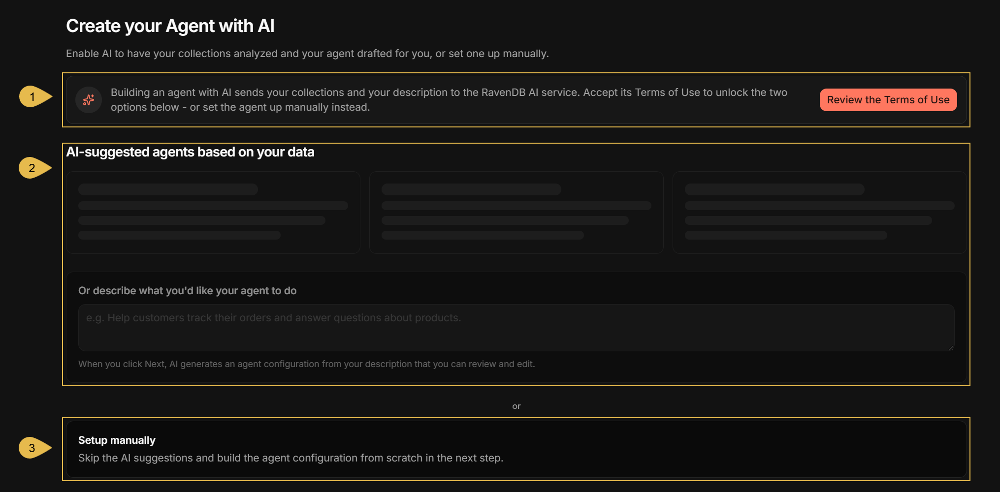

1. **Review the Terms of Use**  
   Click to read the terms and accept them.  
   Your acceptance is recorded for the whole Quill deployment, so you are only asked once.

   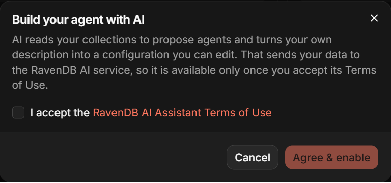

2. As long as the terms are not accepted, the two AI options cannot be used.

3. **Setup manually** remains available whether you accept the terms or not.

</ContentFrame>

<ContentFrame>

### Choosing a starting point

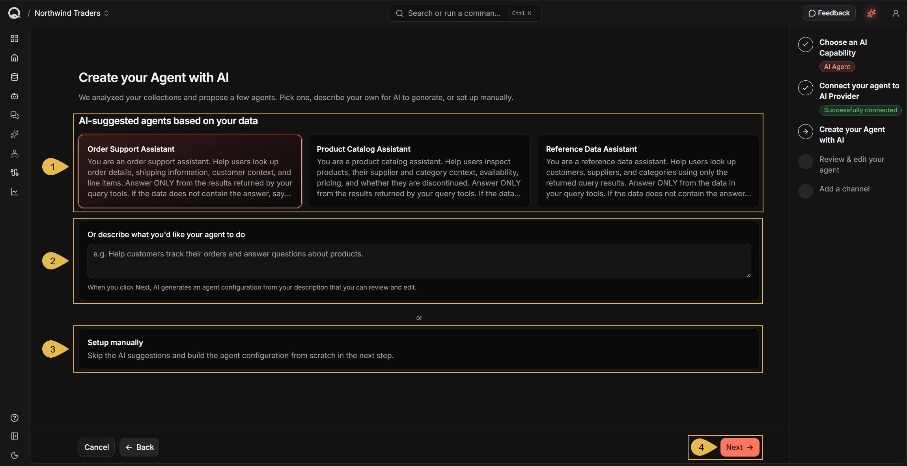

1. **AI-suggested agents based on your data**  
   Quill reads the app's [mapping](../getting-started/mapping-your-tables.mdx) and proposes agent configurations that suit your
   data, each with its own fitting system prompt and query tools.  
   Click a suggestion card to select the agent configuration it describes.  
   Quill drafts these suggestions live when you open this stage, so their number and content may differ from
   one visit to the next, and from one app to another.

2. **Describe what you'd like your agent to do**  
   Enter a description that Quill will use to draft the agent you want.  
   e.g., **Help customers track their orders and answer questions about products.**

3. **Setup manually**  
   Click to start from an empty form and write the configuration yourself.

4. **Next**  
   Continue to the **[Review & edit your agent](#reviewing-your-agent)** stage.

</ContentFrame>

</Panel>

<Panel heading="Reviewing your agent">

The **Review & edit your agent** stage presents two tabs: select the **AI suggestion** tab to review the
configuration, or the **Agent configuration** tab to edit it.  
Manual setup skips the AI suggestion overview since there is no suggestion to show.

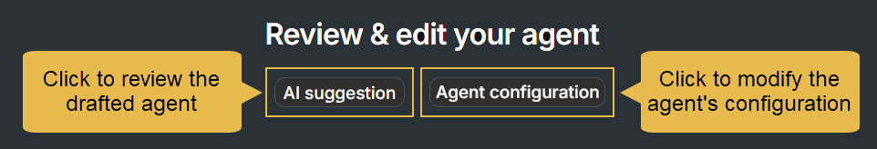

<ContentFrame>

### Reviewing the drafted agent

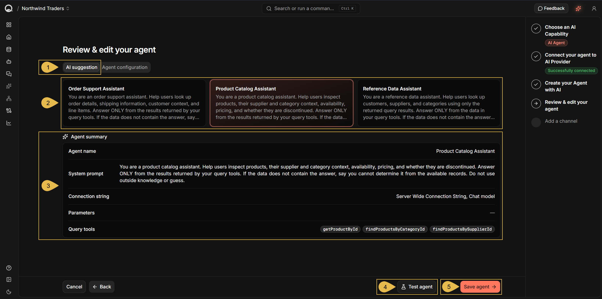

1. **AI suggestion**  
   Select this tab to review the drafted agent.

2. The suggestions Quill drafted, with the selected suggestion highlighted.  
   Click another card to review its suggestion instead.

3. **Agent summary**  
   A brief of the selected draft: the agent's name, its system prompt, the connection string the agent will
   use to reach the LLM, the parameters set for the agent, and the query tools written for the app's data.

4. **Test agent**  
   Click to [chat with the draft agent before saving it](#chatting-with-the-draft-agent)

5. **Save agent**  
   Click to [create the agent and add it to the app](#saving-the-agent).

</ContentFrame>

<ContentFrame>

### Modifying the agent configuration

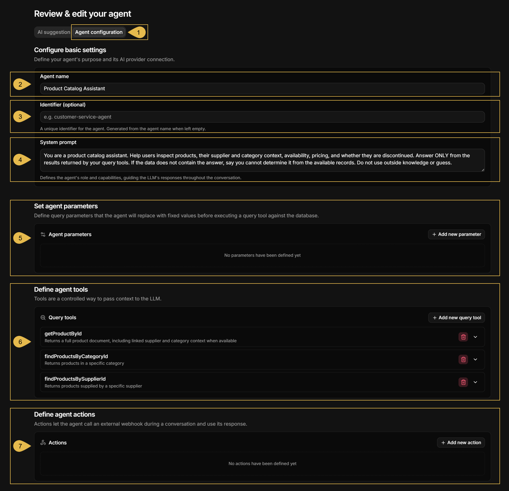

1. **Agent configuration**  
   Select this tab to edit the agent's configuration.

2. **Agent name**  
   A display name for the agent.

3. **Identifier (optional)**  
   A unique identifier that Quill uses to call the agent.  
   If the field is left empty, Quill will generate an identifier from the agent's name.

4. **System prompt**  
   The instructions that set the agent's role and the boundaries of its answers.  
   The prompt in the depicted draft instructs the agent to answer only from content returned by its query
   tools, so replies will stay tied to the app's data.

5. **Agent parameters**  
   Values the agent's queries need. You provide the values when you set up the agent's channel (covered in
   the next Getting Started step), instead of leaving the choice to the LLM.  
   e.g., a support agent can take the customer's ID from the channel, so the agent's answers never
   stray to another customer.

6. **Query tools**  
   A query tool is a query the agent runs when the LLM asks for data. Query tools reach no data source other
   than the app's internal database, and they only read from it.  
   Click a tool to open its definition.

   <ContentFrame>

   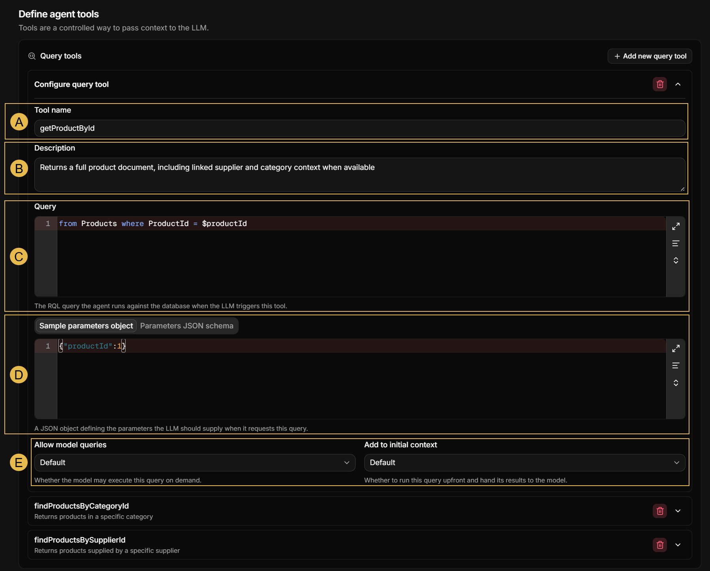

   * **A. Tool name**  
     The name the LLM uses when it calls the tool.
   * **B. Description**  
     A description of the content that the tool is requested to return.  
     The LLM reads the description to decide when to call this tool.
   * **C. Query**  
     The RQL query Quill runs against the app's internal database when the LLM calls this tool.
   * **D. Sample parameters object** and **Parameters JSON schema**  
     A query can leave values open, written in the RQL with a `$` prefix, for the LLM to fill when the LLM
     asks the agent to run the query. The two tabs tell the LLM which values the query expects, and in what
     form.
     * **Sample parameters object** gives the values as an example object.  
       e.g., `getProductById` runs `from Products where ProductId = $productId`, and the sample
       `{"productId": 1}` tells the LLM to send a product ID as a number.
     * **Parameters JSON schema** states the same in a formal schema.

     Either a sample parameters object or a JSON schema must be defined. If both are defined, the JSON schema
     takes precedence.
   * **E. Allow model queries** and **Add to initial context**
     * **Allow model queries** determines whether the LLM is allowed to run this query.
     * **Add to initial context** determines whether Quill will run this query only when the LLM requests it
       (default), or also before the conversation starts to hand the results to the LLM.  
       e.g., **Add to initial context** can be set to `True` for a query that returns a list of product
       categories, to pass this list to the LLM before the first question arrives.  
       A query set this way runs before the conversation starts, so it cannot take values from the LLM.

   </ContentFrame>

7. **Actions**  
   An action lets the agent call a system outside Quill, e.g., to open a support ticket or look up a
   shipment.  
   You define the action and the **webhook** it calls: a URL you provide, which receives the values the LLM
   supplied and answers.  
   The agent never makes the call itself: it can only ask Quill to run one of the actions you defined, and
   an action reaches only the URL you entered for that action. The webhook's answer goes back to the LLM.  
   e.g., when a customer asks for help, an agent with a `create_ticket` action opens a ticket in your support
   system and tells the customer the new ticket's number.

</ContentFrame>

</Panel>

<Panel heading="Testing and saving your agent">

Before saving the new agent, you can chat with the agent's draft to see the answers your users would get and
what data is retrieved from the database.

<ContentFrame>

### Chatting with the draft agent

Click **Test agent** from the wizard's [Review & edit your agent](#reviewing-your-agent)
stage to open the chat.

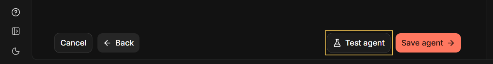

Every message is sent on its own, so the agent has no memory of earlier messages in the chat, and the chat is
never saved.

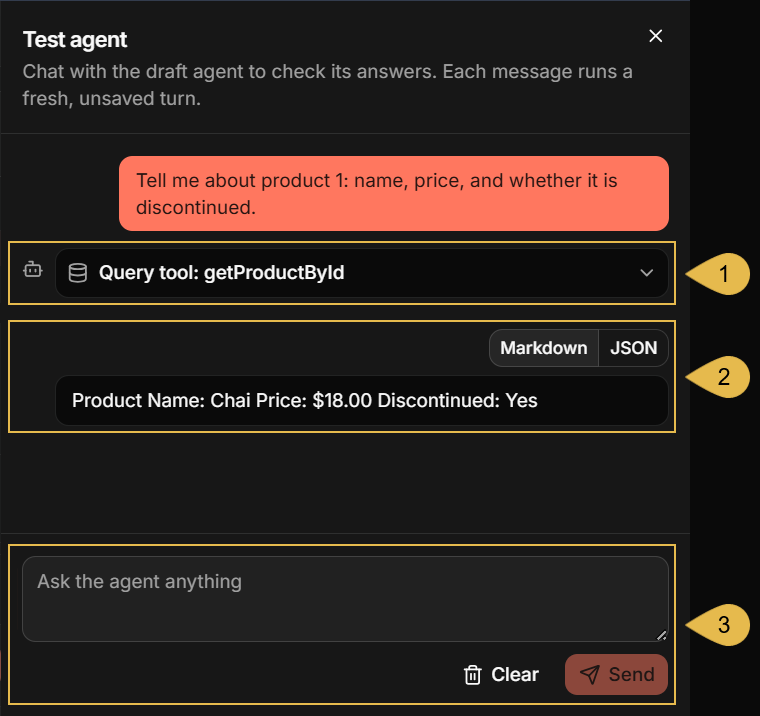

1. **Query tool: getProductById**  
   The tool the agent called to answer the question.  
   Click to see the query, the values the LLM provided, and the data the query returned.

   <ContentFrame>

   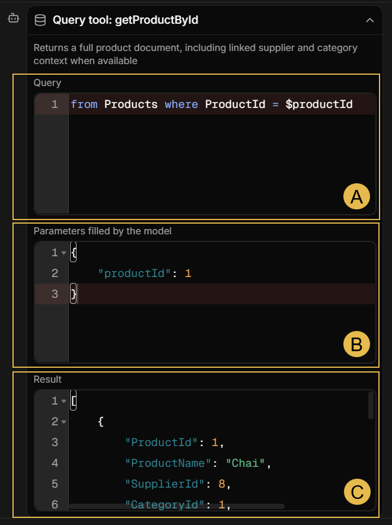

   * **A. Query**  
     The RQL query the tool ran.
   * **B. Parameters filled by the model**  
     The values the LLM provided for the parameters in the query above.
   * **C. Result**  
     The documents the query retrieved from the database.

   </ContentFrame>

2. The agent's answer.  
   **Markdown** shows the LLM's reply as your users would read it; **JSON** shows the LLM's raw response.

3. The message box.  
   Enter a prompt and click **Send** to run another turn, or click **Clear** to empty the chat and start
   over.

</ContentFrame>

<ContentFrame>

### Saving the agent

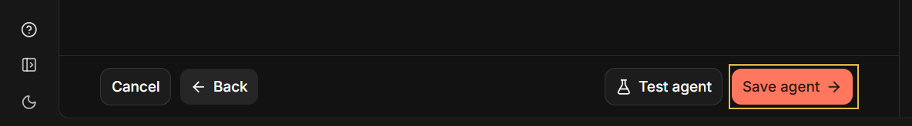

Click **Save agent** to create the agent and add it to the app.  
The stage list on the right marks **Review & edit your agent** as **Agent created**, and the wizard moves on
to **Add a channel**, the last stage.

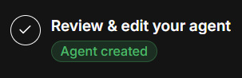

The created agent is listed in the app's **Agents** table.

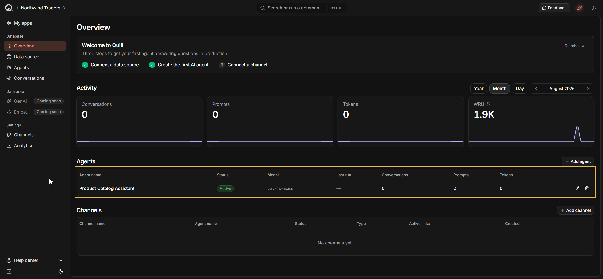

The next Getting Started step explains how to [add a channel](../getting-started/adding-a-chat-widget.mdx) for the new agent.

</ContentFrame>

</Panel>
