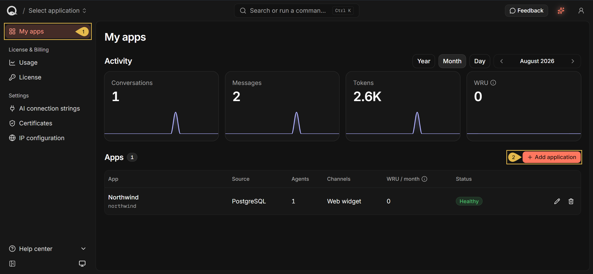
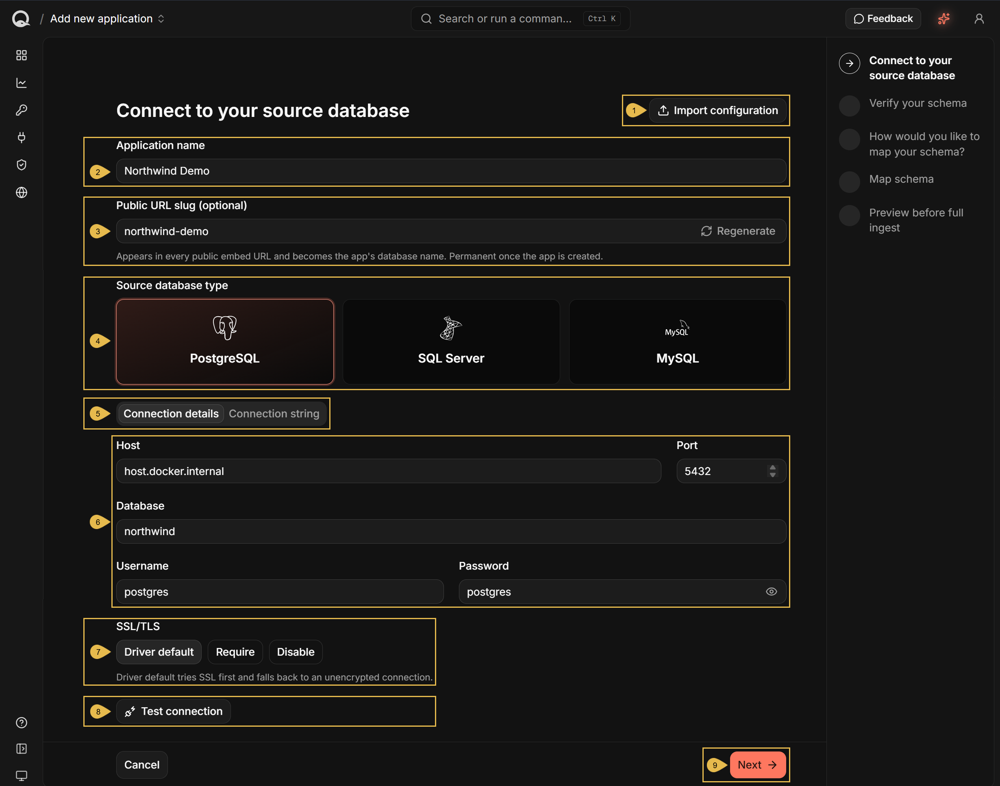
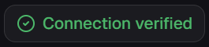
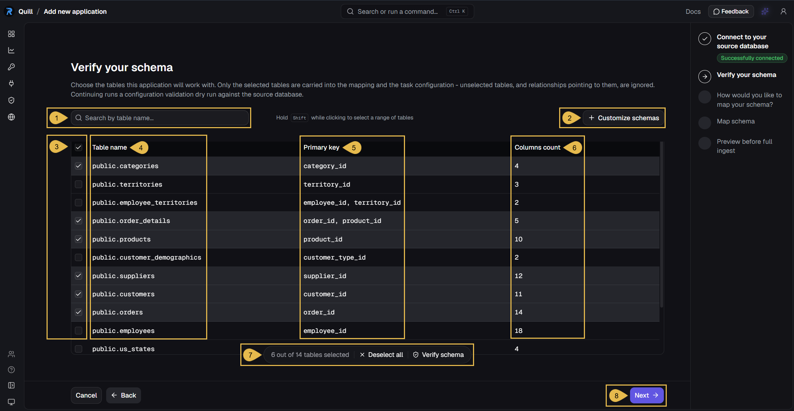
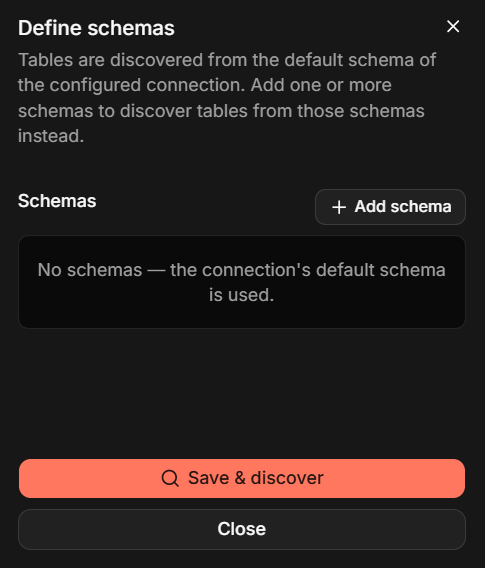
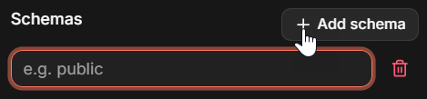
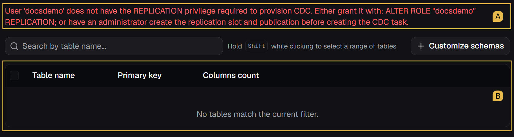

import Admonition from '@theme/Admonition';
import Panel from "@site/src/components/Panel";
import ContentFrame from "@site/src/components/ContentFrame";

# Getting started: Connecting your database
<Admonition type="tip" title="">

**Achieved so far** in [Getting Started](../getting-started/overview.mdx#the-six-steps):  
[Signing up](../getting-started/signing-up.mdx) - your deployment has a name, a license key, and a dashboard API key.  
[Starting Quill](../getting-started/starting-quill.mdx) - Quill is running on your machine, and its management dashboard is open.

</Admonition>

<Admonition type="note" title="">

* This page covers the third Getting Started step, **Connecting your database**, walking you through the
  **Add new app** wizard's first stages: pointing Quill at your source PostgreSQL, SQL Server, or MySQL
  database, and settling the tables it may read.

   <Admonition type="info" title="">

   * An [app](../overview.mdx#one-quill-several-apps) answers its users from Quill's internal database.
   * [Quill's internal database](../overview.mdx#internal-database) is a live copy of your source data.

   </Admonition>

* Quill's internal database stays current by [following the changes](../overview.mdx#mirroring) your source
  SQL database records.  
  Your source database has to be set up to record these changes. Quill sets it up where it can, and reports what
  is left for manual configuration.  
  See [Prerequisites](#prerequisites) below for details.

* In this article:
   * [Prerequisites](#prerequisites)
      * [PostgreSQL](#postgresql)
      * [SQL Server](#sql-server)
      * [MySQL and MariaDB](#mysql-and-mariadb)
   * [Connecting to your source database](#connecting-to-your-source-database)
      * [Starting the Add new app wizard](#starting-the-add-new-app-wizard)
      * [Naming your app and entering the connection details](#naming-your-app-and-entering-the-connection-details)
   * [Verifying your schema](#verifying-your-schema)
      * [Choosing the tables](#choosing-the-tables)
      * [When schema discovery fails](#when-schema-discovery-fails)

</Admonition>

<Panel heading="Prerequisites">

Quill connects to your source database and reads the tables you select, first in full, and then by following the
changes the source database records, so that Quill's internal database stays current.  
This change-tracking technique is known as **[CDC (Change Data Capture)](../overview.mdx#mirroring)**.

Two conditions have to hold before CDC can start:

* **Quill must be able to reach the source database from inside its Docker container.**
   * Your source database runs outside Quill's container, so the address you give Quill has to lead out of the
     container to the machine that hosts the database.
   * To find the address to use, see the
     [Connect to your source database](#connecting-to-your-source-database) section below.

* **The source database must be recording its changes.**
   * On PostgreSQL and SQL Server, Quill turns change recording on for you, as long as the database user whose
     credentials you provide has the required permissions.
   * On MySQL and MariaDB, the change-recording settings are set by a database administrator, and Quill
     verifies them rather than setting them up.
   * The settings and permissions each database requires are given below.

<ContentFrame>

### PostgreSQL

PostgreSQL streams changes through
[logical replication](https://www.postgresql.org/docs/current/logical-replication.html), which records every change
in the PostgreSQL server's write-ahead log in a form a service like Quill can read.  
Quill reads this stream as a PostgreSQL user whose credentials you provide.

#### `wal_level`:

Must be set to `logical`.

* `wal_level` is a **configuration parameter**, one of the named settings a PostgreSQL server reads from its
  configuration file, `postgresql.conf`. A value written there takes effect when the server restarts.
* `wal_level` decides the level of detail a PostgreSQL server writes to its write-ahead log.
* When set to `logical`, the write-ahead log carries enough to reconstruct each change. At the other values it
  does not.
* Quill reads `wal_level` when it lists your tables, in the
  [Verify your schema](#verifying-your-schema) stage, and reports an error unless the value
  is `logical`.

#### The `REPLICATION` attribute:

Must be held by the source database user.

* In PostgreSQL, a **role attribute** is a permission attached to a database user.
* The `REPLICATION` role attribute allows two things: reading the stream of changes, and creating the two objects
  the stream needs.
   * A **publication** lists the tables PostgreSQL streams.
   * A **replication slot** records how far Quill has read, so it resumes from the same point after a restart.
* With the `REPLICATION` attribute, Quill creates the publication and the replication slot by itself.
* Without the `REPLICATION` attribute, Quill cannot read the stream at all, and reports an error.  
  The error carries the `ALTER ROLE` statement that gives the attribute to the PostgreSQL user Quill connects as,
  which a PostgreSQL superuser can run.

</ContentFrame>

<ContentFrame>

### SQL Server

SQL Server records changes using its own
[Change Data Capture](https://learn.microsoft.com/en-us/sql/relational-databases/track-changes/about-change-data-capture-sql-server)
feature, which copies every change into **capture tables**.  
Quill reads these capture tables as an SQL Server user whose credentials you provide.

#### Change Data Capture:

Must be enabled on the source database and on each selected table.

* In SQL Server, a **database role** is a named set of permissions that a database user can be made a member of.
* Enabling CDC changes the source database's configuration, so SQL Server reserves the action for members of the
  `db_owner` database role.
* With `db_owner` membership, Quill enables CDC on the source database and on the tables you select.
* Without `db_owner` membership, Quill reports an error.  
  The error carries the `EXEC sys.sp_cdc_enable_db;` statement, which a member of `db_owner` can run on the
  source database.

#### The SQL Server Agent service:

Must be running.

* SQL Server does not fill its capture tables as changes happen.
* A **scheduled job** reads the changes and writes them to the capture tables, and the **SQL Server Agent** service
  is what runs the job.
* The Agent service ships with SQL Server, but is not always running. In an SQL Server Docker container the
  service is off unless the container was started with `MSSQL_AGENT_ENABLED=true`.
* While the Agent service is stopped, the capture tables stay empty. Quill connects and lists your tables as
  normal, and never receives a change.  
  Nothing about the connection or the tables is wrong, so Quill reports a stopped Agent service as a warning
  rather than an error.  
  The warning appears in the [Verify your schema](#verifying-your-schema) stage,
  alongside the list of tables.
* Azure SQL Database has no Agent service, and needs none: the Azure platform schedules the job itself.

</ContentFrame>

<ContentFrame>

### MySQL and MariaDB

Every change made on a MySQL or MariaDB server is recorded in the server's
[binary log](https://dev.mysql.com/doc/refman/8.0/en/replication.html), the same record these servers send to their
replicas.  
Quill reads the binary log as a MySQL or MariaDB user whose credentials you provide, and changes no setting on the
server.

The content of the binary log is controlled by
[system variables](https://dev.mysql.com/doc/refman/8.0/en/server-system-variables.html), the named settings a
MySQL or MariaDB server is configured with.  
A MySQL or MariaDB server reads its system variables from its configuration file, `my.cnf` on Linux or `my.ini` on
Windows, so a value written there takes effect when the server restarts.  
Quill reads the three variables below when it lists your tables, in the
[Verify your schema](#verifying-your-schema) stage, and reports an error for any of the three
that does not hold the required value.

#### `binlog_format`:

Must be set to `ROW`.

* A MySQL or MariaDB server writes to its binary log either the statements it ran, or the rows those statements
  changed. `ROW` selects the changed rows.
* Quill needs `binlog_format` to be set to `ROW` because changed rows are what it copies into its internal
  database.
* MariaDB differs here. See [On MariaDB](#on-mariadb) at the end of this section.

#### `binlog_row_image`:

Must be set to `FULL`.

* The copy of a changed row that a server writes to its binary log is called a **row image**, and
  `binlog_row_image` decides how much of the row that copy holds.
* When set to `FULL`, the row image holds every column of the row. When set to other values, the row image holds
  only some of the columns.
* Quill needs `binlog_row_image` to be set to `FULL` because its internal database holds a complete copy of each
  row.

#### `gtid_mode`:

Must be set to `ON`.

* A **GTID (Global Transaction Identifier)** is an identifier a MySQL or MariaDB server gives each transaction it
  commits.
* When `gtid_mode` is set to `ON`, every transaction gets a GTID, and the GTID travels with the transaction into
  the binary log.
* Quill needs GTIDs because it keeps the identifier of the last change it read, and resumes from that point after
  a restart.
* `enforce_gtid_consistency` has to be set to `ON` as well, because a MySQL server refuses to turn `gtid_mode` on
  without it.
* MariaDB differs here. See [On MariaDB](#on-mariadb) at the end of this section.

---

#### Privileges:

Must be held by the source database user: `SELECT`, `REPLICATION SLAVE`, and `REPLICATION CLIENT`.

In MySQL and MariaDB, a **privilege** is a permission held by a database user, granted by a database administrator
using a `GRANT` statement.

* `SELECT` allows reading the tables themselves, which serves Quill's first full read of the tables you select.
* `REPLICATION SLAVE` allows reading the binary log, which is how Quill follows the changes.
* `REPLICATION CLIENT` allows reading the status of the binary log, which tells Quill which log files a server
  keeps and where the server is writing now.

Quill does not check these privileges.  
A missing `SELECT` privilege surfaces in the [Verify your schema](#verifying-your-schema)
stage, where Quill reads from the tables you select.  
A missing `REPLICATION SLAVE` or `REPLICATION CLIENT` privilege surfaces only after the app is created, when Quill
starts following the changes.

---

#### On MariaDB

* [binlog_format](#binlog_format) - A MariaDB server's default value is `MIXED`, so this
  variable always needs to be set to `ROW`.
* [gtid_mode](#gtid_mode) - A MariaDB server has no such variable. Transaction identifiers
  are always on, and Quill reads no value here.

</ContentFrame>

</Panel>

<Panel heading="Connecting to your source database">

After [making your source database reachable and ready to record its changes](#prerequisites),
Quill needs a name for your app, and the credentials it will use to reach the source database.

<ContentFrame>

### Starting the Add new app wizard

Open **Quill's management dashboard** (as explained in the previous step, [Starting Quill](../getting-started/starting-quill.mdx)).  
Then open: **My apps > Add app**

1. **My apps**  
   Open the **My apps** view.

2. **Add app**  
   Start the **Add new app** wizard.

</ContentFrame>

<ContentFrame>

### Naming your app and entering the connection details

The **Add new app** wizard opens on its first stage:

1. **Import configuration**  
   An app's configuration can be [exported](../getting-started/mapping-your-tables.mdx#testing-your-mapping) and reused.  
   Import an exported configuration to fill in its connection and table mapping details.

2. **App name**  
   Enter a name for your new app.  
   e.g., **Northwind Traders**

3. **Public URL slug**  
   Enter a unique identifier for the app, or click **Regenerate** to create it automatically.  
   e.g., **Northwind Traders** becomes `northwind-traders`  
   The identifier appears in the [public URLs](../security-and-architecture/network-architecture.mdx#what-is-public) the app is
   served on, and becomes the name of the app's internal
   database.

   Once the app is created, the identifier can no longer be changed.

4. **Source database type**  
   Select PostgreSQL, SQL Server, or MySQL.  
   MySQL is used for both MySQL and MariaDB servers.

5. **Connection details** and **Connection string**  
   Choose how to provide the connection: **Connection details** presents it as separate fields, and
   **Connection string** presents the same connection as a single string.  
   Values entered in either tab are automatically added in the other tab as well.

6. **The connection fields**  
   Enter the details of your source database:
   * **Host**  
     Quill runs **inside a Docker container**. Use the Host field to enter an address that points at the source
     database's location **out of the container**.

     <Admonition type="note" title="">

     Do not enter `localhost` as the Host.  
     Inside Quill's container, `localhost` points at the container itself, so it never reaches a database running
     outside the container.

     </Admonition>

      * For a source database on the machine that runs Quill, **under Docker Desktop**, enter:  
        `host.docker.internal`
      * For a source database on the machine that runs Quill, **under Docker Engine on Linux**, enter the
        machine's address on your network.  
        e.g., `192.168.1.24`
      * For a source database **on another machine**, enter the other machine's address.  
        e.g., `db.example.com`
   * **Port**  
     Enter the port your source database listens on.  
     The field shows the default port for the database type you selected, `5432` for PostgreSQL, `1433` for SQL
     Server, or `3306` for MySQL.
   * **Database**  
     The **source database name**.  
     e.g., `northwind`
   * **Username**  
     The **database user** that Quill will use to connect to the source database.  
     e.g., `postgres`
   * **Password**  
     The **database user's password**.

7. **SSL/TLS**  
   Choose whether the connection to the source database is encrypted:
   * **Driver default**  
     Leaves the choice to the database driver.
   * **Require**  
     Allows only an encrypted connection.
   * **Disable**  
     Turns encryption off.

8. **Test connection**  
   Click to test the connection using the provided details.  
   A working connection is confirmed:  
   

9. **Next**  
   Click for the next stage, **Verify your schema**.

</ContentFrame>

</Panel>

<Panel heading="Verifying your schema">

The wizard's second stage lists all the tables Quill discovered in your source database, and allows you to select
the tables that the app will work with.

* Only the tables you select in this stage are carried into the mapping and into the app's configuration.
* Unselected tables are ignored.

---

<ContentFrame>

### Choosing the tables

Discovered tables are listed for you to select from.

1. **Search by table name**  
   Filter the tables by the text you enter.

2. **Customize schemas**  
   A database groups its tables into schemas. Quill discovers tables from the default schema of the connection you
   provided, `public` on PostgreSQL.  
   Click to discover tables from other schemas instead.

   

   Click **Add schema** once per schema, and enter the schema's name.

   

   Click **Save & discover** to list the tables of the schemas you named.  
   The connection's default schema is discovered only while no other schema is named here.

3. **The selection column**  
   Select the tables that your app will work with. Hold `Shift` while clicking a checkbox to select a range of tables.  
   You can select up to 64 tables for a single app.

4. **Table name**  
   The name of the discovered table, qualified by its schema.  
   e.g., `public.categories`

   <Admonition type="note" title="">

   A table is listed with a warning beside its name, when Quill is unable to carry out deletions made in the
   table.

   Quill cannot carry out these deletions, when the source database informs that a row was deleted, but doesn't
   specify which row it was. As a result, the deleted row remains in Quill's internal database.

   Each warning includes a statement that your database administrator can run on the source database for the table
   that the warning relates to. After its execution, the source database will start recording whole deleted rows
   of the table, and Quill will be able to remove the matching rows from its internal database.  
   e.g., `ALTER TABLE <schema>.<table> REPLICA IDENTITY FULL;`

   </Admonition>

5. **Primary key**  
   The columns that make up the table's primary key.

6. **Columns count**  
   The number of columns in the table.

7. **The selection bar**  
   Appears once a table is selected, to show how many of the discovered tables are selected.
   * Click **Deselect all** to clear the selection.
   * Click **Verify schema** to check that CDC can run on the selected tables.  
     The button is replaced by a confirmation when the check passes:  
     

     <Admonition type="info" title="">

     The verification performs the capture setup once, and then undoes it.  
     Nothing is written into Quill's internal database, and the app is not created yet.

     * Quill creates the objects needed to capture changes from the selected tables.
     * Quill reads one row from each selected table, confirming the tables can be read.
     * Quill removes the objects it created, leaving the source database as it found it.

     </Admonition>

8. **Next**  
   Click to advance to the mapping stages, covered in [Mapping your tables](../getting-started/mapping-your-tables.mdx).  
   Clicking **Next** runs the same verification as **Verify schema**, described above, ensuring that
   [CDC](#prerequisites) can run on the selected tables before advancing to the next stage.

</ContentFrame>

<ContentFrame>

### When schema discovery fails

When Quill cannot read your source database's schema, the failure is reported.  
The cause for such failures is usually a condition from
[Prerequisites](#prerequisites) that the source database does not meet. In the example
below, the database user lacks the permission Quill needs to set up change recording.

* A. **The error message** explains what blocked tables discovery, and carries a statement that can be executed by a
  database administrator to fix it.
* B. **The table list** remains empty until the problem is resolved.

</ContentFrame>

</Panel>
