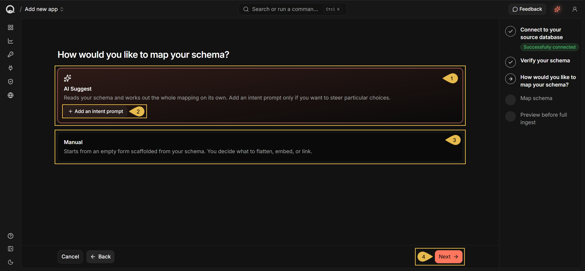
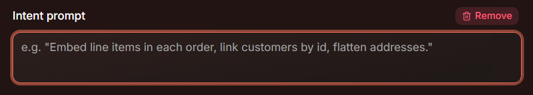
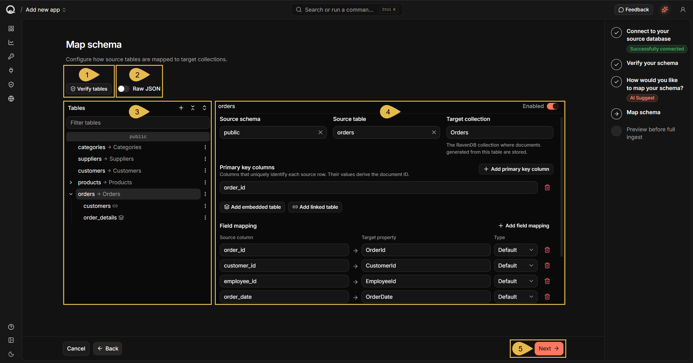
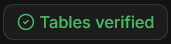
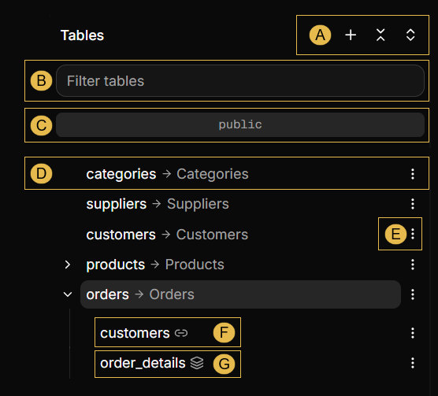
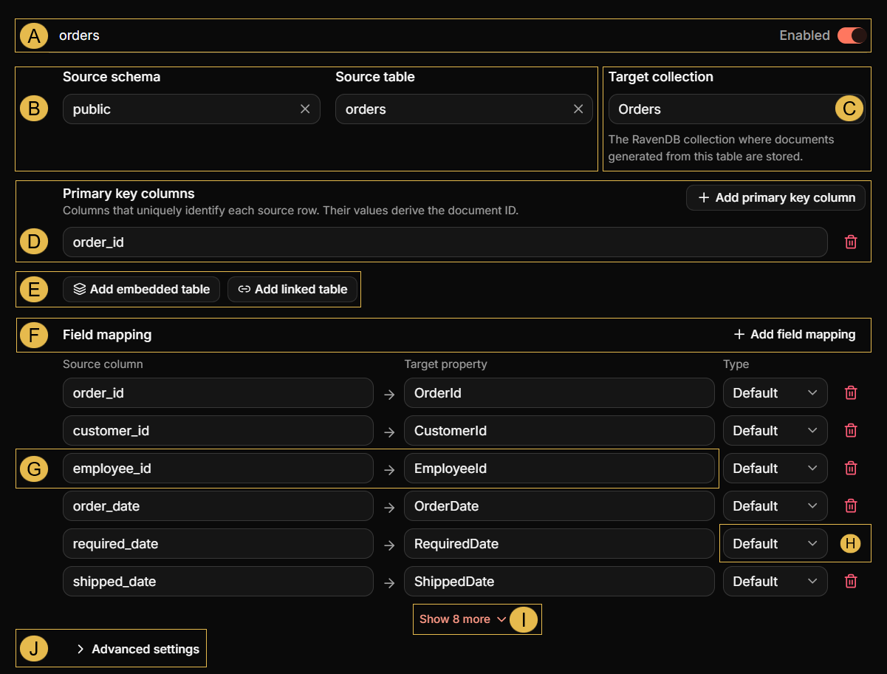
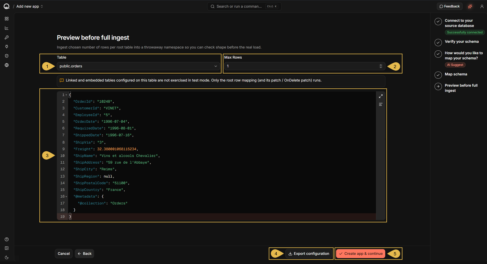
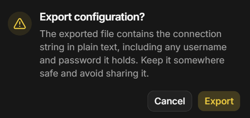
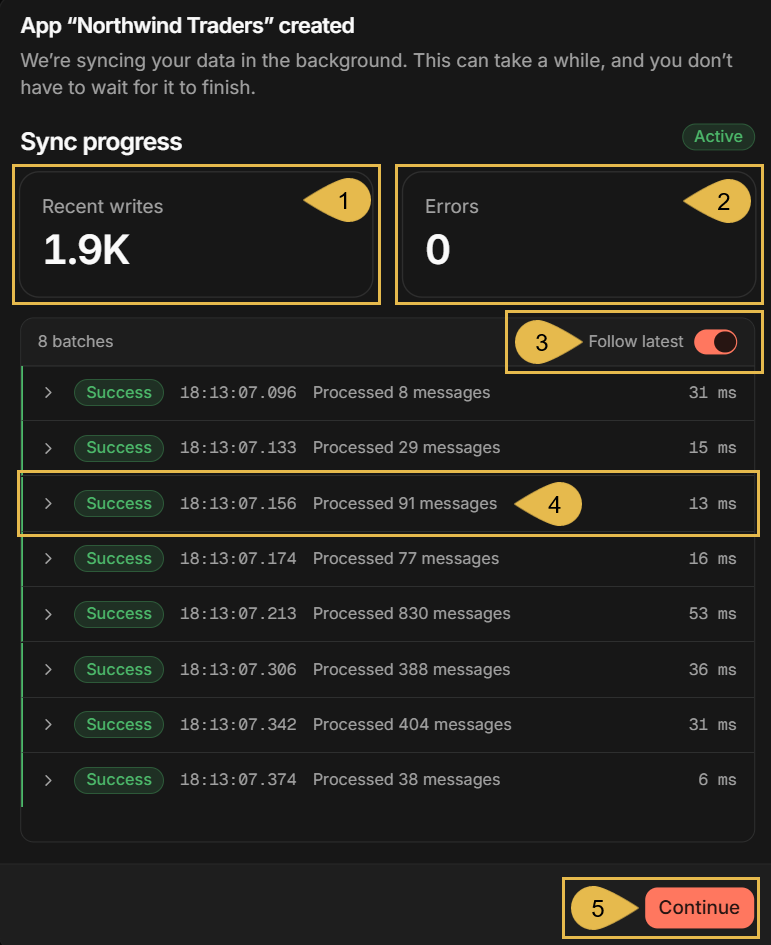

import Admonition from '@theme/Admonition';
import Panel from "@site/src/components/Panel";
import ContentFrame from "@site/src/components/ContentFrame";

# Getting started: Mapping your tables
<Admonition type="tip" title="">

**Achieved so far** in [Getting Started](../getting-started/overview.mdx#the-six-steps):  
[Signing up](../getting-started/signing-up.mdx) - your deployment has a name, a license key, and a dashboard API key.  
[Starting Quill](../getting-started/starting-quill.mdx) - Quill is running on your machine, and its management dashboard is open.  
[Connecting your database](../getting-started/connecting-your-database.mdx) - Quill can reach your source database, and the tables
your app will work with are selected.

</Admonition>

<Admonition type="note" title="">

* Your source database holds your data in table rows; Quill's internal document database holds a live copy of this
  data.  
  The app's **mapping** is the set of rules by which Quill loads the data from your tables and builds its internal
  database documents.  
  In **Mapping your tables**, the fourth Getting Started step, you continue through the **Add new app** wizard and settle
  the mapping.

* As one document can hold data from several joined tables, a mapped table does not always become a set of documents.  
  Quill can work the whole mapping out from your source schema, or draft a plain mapping, one set of documents
  per table, and leave every further choice to you.

* To check your mapping against real data, the wizard's last stage is a dry test: Quill builds documents from
  source rows and lets you examine them. The trial documents are discarded.

* Creating the app at the end of the wizard starts the first load, where Quill reads the tables you selected and
  builds the documents your mapping defines.  
  From then on Quill keeps these documents current as your source data changes.

* In this article:
   * [Choosing the mapping method: AI Suggest or Manual](#choosing-the-mapping-method-ai-suggest-or-manual)
   * [Settling the mapping](#settling-the-mapping)
   * [Testing your mapping](#testing-your-mapping)
   * [Creating the app](#creating-the-app)

</Admonition>

<Panel heading="Choosing the mapping method: AI Suggest or Manual">

<ContentFrame>

This page starts where [Connecting your database](../getting-started/connecting-your-database.mdx) left off: you are at the
**How would you like to map your schema?** stage of the **Add new app** wizard.

</ContentFrame>

After [Verifying your schema](../getting-started/connecting-your-database.mdx#verifying-your-schema), the **Add new app** wizard lets you choose the
mapping's starting point: a draft in which AI has already gathered your joined tables into documents, or a plain
draft for you to shape.  
Either way, the next stage will still allow you to change the mapping before the app is created.



1. **AI Suggest** (default)  
   Click to have Quill work the whole mapping out for you from your source schema.

2. **Add an intent prompt**  
   Click to hand **AI Suggest** a prompt with your directions, to steer its choices.

   

3. **Manual**  
   Click to draft the mapping yourself, starting from a plain mapping Quill builds from your schema.

4. **Next**  
   Continue to the **[Map schema](#settling-the-mapping)** stage.

</Panel>

<Panel heading="Settling the mapping">

The **Map schema** stage presents the mapping so you can read and modify it.  
If **AI Suggest** is selected, give it the time it needs to finish the mapping.



1. **Verify tables**  
   Click to check that CDC can run on the tables this mapping captures.  
   This is the check the **[Verify your schema](../getting-started/connecting-your-database.mdx#verifying-your-schema)** stage ran,
   repeated here because attaching or removing tables changes the set it covers.  
   The button is replaced by a confirmation when the check passes:

   

2. **Raw JSON**  
   Toggle on to view and edit the mapping in a JSON editor, one entry per mapped table.

   The entry of the `orders` table in the mapping above, with the column lists and the delete-handling keys
   left out:

   ```json
   {
     "collectionName": "Orders",
     "columns": [ ... ],
     "embeddedTables": [
       {
         "columns": [ ... ],
         "joinColumns": [ "order_id" ],
         "primaryKeyColumns": [ "order_id", "product_id" ],
         "propertyName": "OrderDetails",
         "sourceTableName": "order_details",
         "sourceTableSchema": "public",
         "type": "Array"
       }
     ],
     "linkedTables": [
       {
         "joinColumns": [ "customer_id" ],
         "linkedCollectionName": "Customers",
         "propertyName": "Customer",
         "sourceTableName": "customers",
         "sourceTableSchema": "public"
       }
     ],
     "primaryKeyColumns": [ "order_id" ],
     "sourceTableName": "orders",
     "sourceTableSchema": "public"
   }
   ```

   <br />

   | Key | Description |
   |-----|-------------|
   | `collectionName` | The collection the documents built from this table belong to. |
   | `sourceTableSchema`, `sourceTableName` | The source table the mapping reads. |
   | `primaryKeyColumns` | The columns whose values follow the collection name to form the document ID. |
   | `columns` | One entry per field mapping, holding the source column, the document property, and the type. |
   | `embeddedTables` | The tables embedded in these documents. `propertyName` is the property they are stored in, `type` is the shape they take there, and `joinColumns` match their rows to the row the document was built from. |
   | `linkedTables` | The tables referenced from these documents. `propertyName` is the property holding the reference, `linkedCollectionName` is the collection referenced, and `joinColumns` form the referenced document's ID. |

3. **Tables**  
   Use this pane to see the mapping, table by table.  
   Each row reads `source table` -> `target collection`, and a row can hold child tables, which is how one
   document comes to carry data from more than one source table.

   <ContentFrame>

   

   * **A. Table controls**  
     In order, **Add new root table**, **Collapse all tables**, and **Expand all tables**.
   * **B. Filter tables**  
     Filters the tables shown in the pane by the text you enter.
   * **C. Schema name**  
     Names the source schema that the rows below the name were discovered in.
   * **D. A mapped table**  
     Names the source table on the left and the collection Quill builds from it on the right.  
     In the mapping above, `categories` is mapped to `Categories`.
   * **E. Table actions**  
     Opens the row's menu.

     * **Add embedded table**  
       Attaches a related table: a single property will be added to each document built from the root table;
       all the rows of the related table that match the document will be added to this property as JSON
       objects.
     * **Add linked table**  
       Attaches a related table: a single property will be added to each document built from the root table;
       the property will hold a reference to a document built from the related table, rather than a copy of
       its data.
     * **Disable**  
       Keeps the table in the mapping and stops its rows from being loaded.
     * **Remove**  
       Takes the table out of the mapping.

   * **F. A root table**  
     Click a row to show its mapping in the configuration pane, and click the arrow at its left to fold the
     tables attached to it away.  
     In the mapping above, `orders` is mapped to `Orders`, and two tables are attached to it.
   * **G. A linked table (marked by a link icon)**  
     See **Add linked table** under **E. Table actions**.  
     In the mapping above, every `Orders` document will reference a `Customers` document.
   * **H. An embedded table (marked by a layers icon)**  
     See **Add embedded table** under **E. Table actions**.  
     In the mapping above, every `Orders` document will carry its own `order_details` rows.

   </ContentFrame>

4. **The configuration pane**  
   Use this pane to read and edit the mapping of the currently selected table.

   <ContentFrame>

   

   * **A. Table header**  
     Toggle **Enabled** on or off to enable or disable the loading of data from this table to Quill's internal
     database.
   * **B. Source schema and Source table**  
     The source schema and the source table this mapping reads from.
   * **C. Target collection**  
     The collection the documents built from this table will belong to.
   * **D. Primary key columns**  
     The columns that identify a source row.  
     The values of these columns follow the collection name to form the ID of the document built from the row.  
     e.g., the row whose `order_id` is `10248` becomes the document `Orders/10248`
   * **E. Add embedded table and Add linked table**  
     Attach a related table to the selected table, as described under **Table actions** above.
   * **F. Field mapping**  
     Lists the source columns Quill reads, and the document property built from each of them.  
     Click **Add field mapping** to add a column the list does not carry yet.
   * **G. A single field mapping**  
     Names the source column on the left and the document property built from it on the right.  
     In the mapping above, `employee_id` is mapped to `EmployeeId`.
   * **H. Type**  
     Sets how Quill stores the column's value.  
     **Default** stores it as a document property, **JSON** stores a column holding JSON text as a nested object
     rather than as a string, and **Attachment** stores a binary column as an attachment of the document.  
     Quill sets the type from the source column's own data type, so a PostgreSQL `jsonb` column arrives as
     **JSON**, and a `bytea` column as **Attachment**.
   * **I. Show more**  
     Click to show hidden field mappings.
   * **J. Advanced settings**  
     Opens fields for an optional script Quill will apply to each document before storing it, an **Ignore
     deletes** toggle, and an optional script Quill will apply when a source row is deleted.

   </ContentFrame>

5. **Next**  
   Continue to the **[Preview before full ingest](#testing-your-mapping)** stage.

</Panel>

<Panel heading="Testing your mapping">

The **Preview before full ingest** stage builds a document from each source row it reads (by default: one row),
so you can judge the mapping against real data before the app is created. Documents built during the test are not kept.

Only the selected table's own mapping runs here, any tables attached to it are left out; so no embedded
objects or linked references appear in the documents you see.



1. **Table**  
   Select the root table to build the documents from.

2. **Max Rows**  
   Set the number of rows to read from the selected table.

3. **The document pane**  
   Review the documents Quill built from the rows it read.

4. **Export configuration**  
   Click to download the app's configuration as a file, after confirming this warning:

   

   The credentials are the ones you entered for your source database in the wizard's first stage.

   A saved configuration can be loaded through
   **[Import configuration](../getting-started/connecting-your-database.mdx#naming-your-app-and-entering-the-connection-details)**
   in the wizard's first stage, to fill the new app's connection and mapping details.  
   e.g., to create a second app against the same database without filling the wizard in again.

5. **Create app & continue**  
   Click to create the app and start the first load, as described in
   [Creating the app](#creating-the-app).

</Panel>

<Panel heading="Creating the app">

**Create app & continue** creates the app and starts the first load.  
The load runs in the background, so you do not have to wait up, and Quill reports its progress while it runs.  
Quill writes the documents in batches, and reports each batch as it completes.  
The **Active** chip stays on while a batch is in progress, and for a minute after the completion of the last batch.



1. **Recent writes**  
   The number of messages processed in the batches listed below.  
   Each message is one document Quill wrote to its internal database.

2. **Errors**  
   The number of errors in the batches listed below, whether raised while reading from your source database or
   while building the documents.

3. **Follow latest**  
   Toggle on to keep the newest batch in view as new batches are processed.

4. **A message batch**  
   Reports whether the batch succeeded, when it started, the number of messages it processed, and how long it
   took.

5. **Continue**  
   Click to advance to the next Getting Started step, [Adding an AI agent](../getting-started/adding-an-ai-agent.mdx).  
   Loading will continue in the background.

</Panel>
