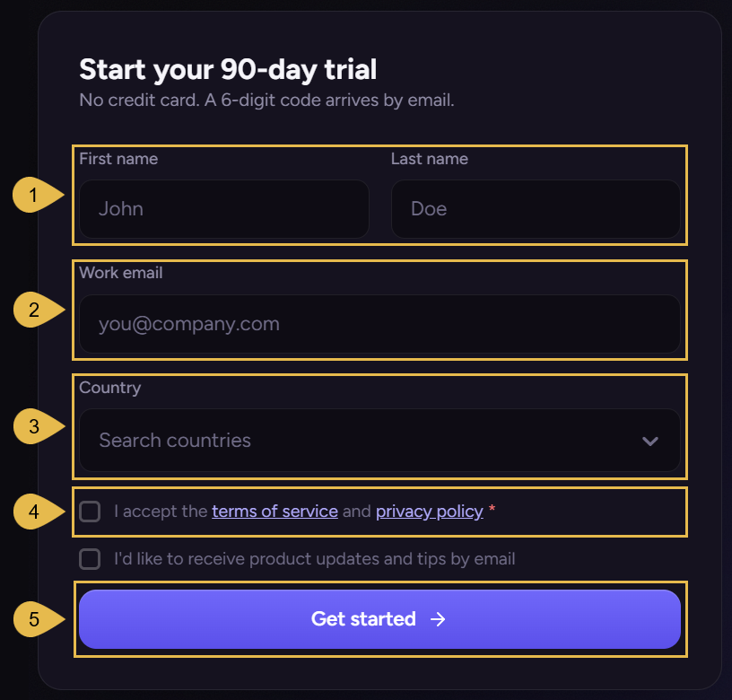
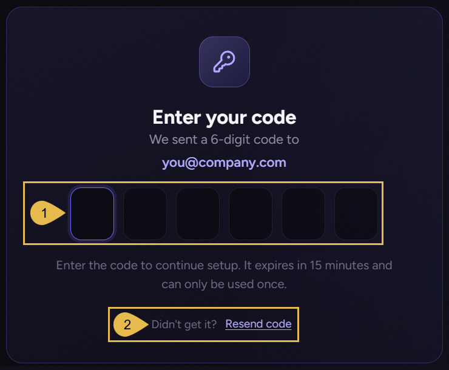
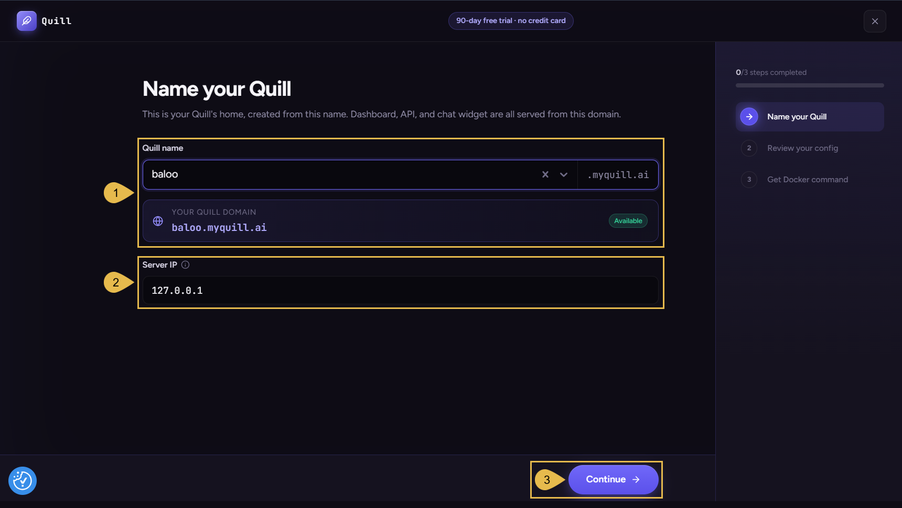
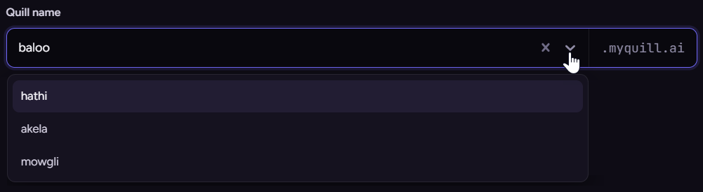
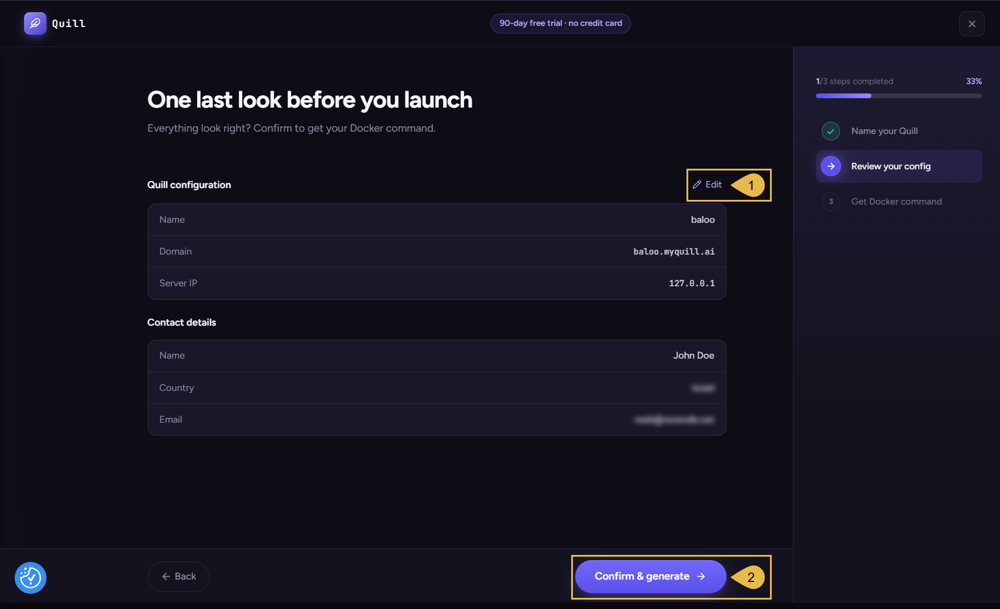
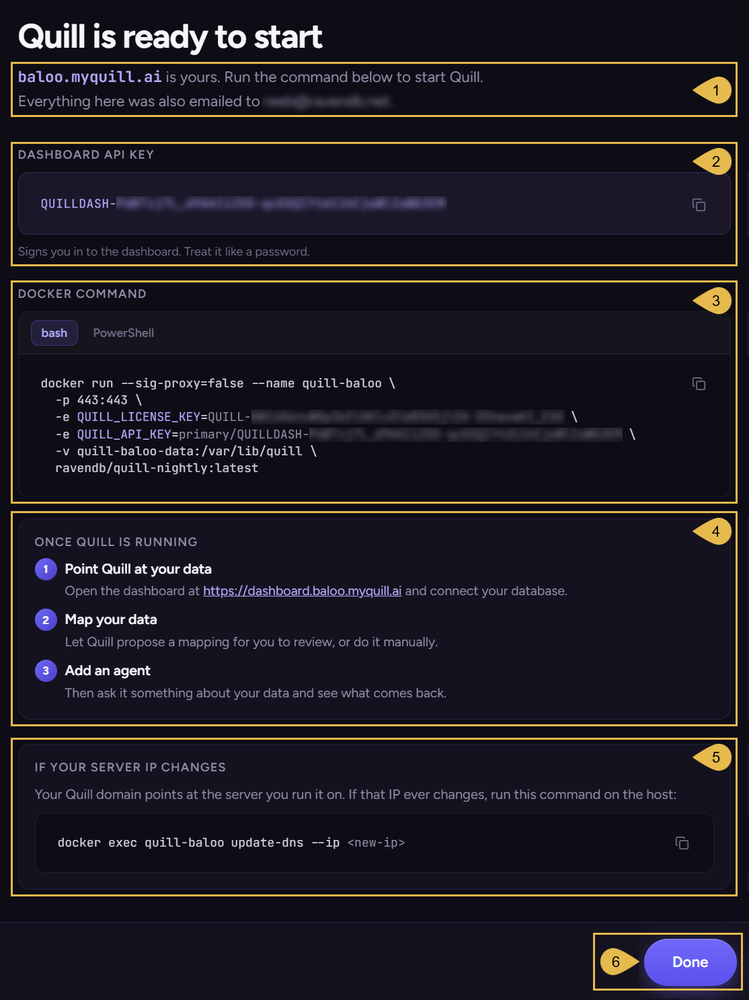

import Admonition from '@theme/Admonition';
import Panel from "@site/src/components/Panel";
import ContentFrame from "@site/src/components/ContentFrame";

# Getting started: Signing up
<Admonition type="tip" title="">

The **[Getting Started](../getting-started/overview.mdx#the-getting-started-steps)** section takes you from the initial signing up
for Quill to an AI agent answering your users through your first channel: a chat widget on your site. **Signing up** is the first step.

</Admonition>

<Admonition type="note" title="">

* This page covers the first Getting Started step, **Signing up**, walking you through the creation of a Quill
  domain and handing you two access keys.

   <Admonition type="info" title="">

   * A [Quill domain](../networking-and-dns.mdx#quill-dns-records) is a web address that your Quill deployment can be reached at.
   * A [license key](#saving-your-setup-details) activates Quill.
   * An [API key](../security-and-architecture/operator-authentication.mdx#the-dashboard-api-key) signs you into the deployment's
     management dashboard.

   </Admonition>

* The signing-up routine takes your details and those of the machine you want to run Quill on, and hands you
  the Docker command that starts Quill.

* In this article:
   * [Prerequisites](#prerequisites)
   * [Signing up](#signing-up)
      * [Filling in the sign-up form](#filling-in-the-sign-up-form)
      * [Entering the verification code](#entering-the-verification-code)
   * [Registering your Quill deployment](#registering-your-quill-deployment)
      * [Naming your Quill domain](#naming-your-quill-domain)
      * [Reviewing and confirming](#reviewing-and-confirming)
   * [Saving your setup details](#saving-your-setup-details)

</Admonition>

<Panel heading="Prerequisites">

Before signing up, make sure you have:

* **An email address** for Quill's access details.
* **The public IP address** of the machine that will run Quill.
   * Your Quill domain will point at this address.
   * To try Quill locally, use `127.0.0.1`.

</Panel>

<Panel heading="Signing up">

Signing up starts a 90-day free trial.

Open [ravendb.net/quill/start](https://ravendb.net/quill/start), fill in the form, and confirm your email address
with the code Quill sends you.

<ContentFrame>

### Filling in the sign-up form

1. **First name** and **Last name**  
   Enter your name.

2. **Work email**  
   Enter an address only you have access to.  
   Quill's access details will be sent to this address at the end of the registration.

3. **Country**  
   Select your country from the list.

4. **Accept**  
   Check to accept our service terms and privacy policy.

5. **Get started**  
   Click to send a verification code to the address you entered.

</ContentFrame>

<ContentFrame>

### Entering the verification code

Clicking **Get started** will send a verification code to your email address and open this dialog:

1. **The code field**  
   Enter the six-digit code sent to your address.  
   The code expires in 15 minutes, and can be used only once.  
   A valid code will start the three-stage wizard to
   [register your Quill deployment](#registering-your-quill-deployment).

2. **Resend code**  
   Click to resend if the code didn't arrive at your address.

</ContentFrame>

</Panel>

<Panel heading="Registering your Quill deployment">

<ContentFrame>

### Naming your Quill domain

1. **Quill name**  
   * Enter a name for your Quill deployment.  
     The domain forms below the field, as `<name>.myquill.ai`, and is marked **Available** if the name hasn't
     been taken yet.  
     e.g.,  
     Quill name: **baloo**  
     Quill domain: `baloo.myquill.ai`
   * If your account already holds Quill domains, the field offers them in a dropdown.  
     Select an existing domain to edit its details.

     

2. **Server IP**  
   Enter the public IP address of the machine that will run Quill.  
   To try Quill locally, use `127.0.0.1`.

3. **Continue**  
   Click for the next wizard stage: [Reviewing and confirming](#reviewing-and-confirming)

</ContentFrame>

<ContentFrame>

### Reviewing and confirming

This wizard stage gathers the details collected so far, for a final check before the domain is registered.

1. **Edit**  
   Click to reopen the [Name your Quill](#naming-your-quill-domain) stage and modify its details.

2. **Confirm & generate**  
   Click to register the domain, generate the access keys, and
   [save your setup details](#saving-your-setup-details).

</ContentFrame>

</Panel>

<Panel heading="Saving your setup details">

The wizard's last stage presents the registered domain, the dashboard API key, and the Docker command that
starts Quill, allowing you to review and copy them.  
All the details that are displayed here are also sent to the email address you provided.

1. **Your Quill domain**  
   The dashboard, the API, and the chat channels of your deployment are all
   [served at this address](../security-and-architecture/network-architecture.mdx#the-quill-hostnames).

2. **Dashboard API key**  
   The key that signs you into the management dashboard.  
   Copy the key before leaving this stage.  
   A lost key can be [recovered](../security-and-architecture/operator-authentication.mdx#recovering-a-lost-key).

   <Admonition type="warning" title="">

   Do not share this key, it is the password to Quill's management.

   </Admonition>

3. **Docker command**  
   The command that starts Quill on the machine whose address you provided; you can run it using either its
   **bash** or **PowerShell** form.  
   The Docker command already includes both the license key and the dashboard API key, so you do not have to add
   these keys separately.  
   See more about the Docker command in [Starting Quill](../getting-started/starting-quill.mdx).

4. **Once Quill is running**  
   The address of your management dashboard, and the steps that follow: connecting your data, mapping it, and
   adding an agent.

5. **If your server IP changes**  
   The command that [re-registers the domain](../networking-and-dns.mdx#moving-your-quill-to-a-new-ip) with a new address.  
   Run it on the machine that hosts Quill.

6. **Done**  
   Click once the API key and the Docker command are copied.  
   **Done** returns you to the beta landing page.

</Panel>
