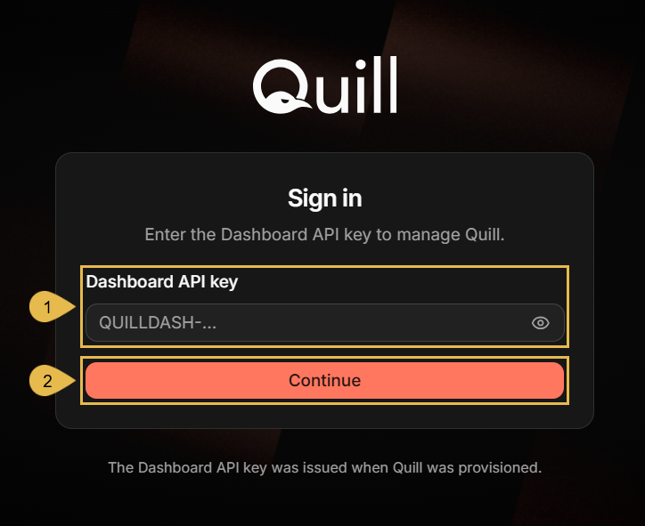

import Admonition from '@theme/Admonition';
import Tabs from '@theme/Tabs';
import TabItem from '@theme/TabItem';
import Panel from "@site/src/components/Panel";
import ContentFrame from "@site/src/components/ContentFrame";

# Getting started: Starting Quill
<Admonition type="tip" title="">

Covered so far in [Getting Started](signing-up.mdx):  
[Signing up](signing-up.mdx) - After this step, your deployment has a name, a license key, and a dashboard API key.

</Admonition>

<Admonition type="note" title="">

* This page covers the second Getting Started step, **Starting Quill**, walking you through running Quill on the
  machine whose address you gave at sign-up, and signing into the management dashboard.

* Quill runs as a single **Docker container**, started by the
  [Docker command](signing-up.mdx#saving-your-setup-details) you copied at the end of signing up.

* On its first run, Quill uses your license key to fetch the certificate and configuration for your domain.  
  Once the certificate and configuration are in place, your dashboard becomes reachable.

* In this article:
   * [Prerequisites](starting-quill.mdx#prerequisites)
   * [Starting Quill](starting-quill.mdx#starting-quill)
      * [Running the Docker command](starting-quill.mdx#running-the-docker-command)
      * [Watching Quill come up](starting-quill.mdx#watching-quill-come-up)
      * [When Quill does not come up](starting-quill.mdx#when-quill-does-not-come-up)
   * [Signing in to the management dashboard](starting-quill.mdx#signing-in-to-the-management-dashboard)

</Admonition>

<Panel heading="Prerequisites">

Before starting Quill, make sure you have:

* **Docker**, on the machine that will run Quill, at the address you gave at sign-up.
   * Docker Desktop on Windows and macOS, or Docker Engine on Linux.
* **Port 443 available** on Quill's machine.
   * The dashboard, the API, and the chat channels of your deployment are all served on this one port.
* **Internet access** from Quill's machine to Docker Hub and to `api.ravendb.net`.
   * Docker pulls [Quill's image](https://hub.docker.com/r/ravendb/quill-nightly) from Docker Hub.
   * Quill fetches the certificate and configuration for your domain from `api.ravendb.net`.
* **The Docker command and the dashboard API key** you copied at the end of signing up.
   * The command carries your license key.
   * The API key signs you into the management dashboard.

</Panel>

<Panel heading="Starting Quill">

<ContentFrame>

### Running the Docker command

Open a terminal on Quill's machine and run the Docker command.  
Its two forms differ only in the character that continues a command across lines.

<Tabs groupId='start-quill-command'>
<TabItem value="bash" label="bash">

```bash
docker run --sig-proxy=false --name quill-baloo \
  -p 443:443 \
  -e QUILL_LICENSE_KEY=QUILL-... \
  -e QUILL_API_KEY=primary/QUILLDASH-... \
  -v quill-baloo-data:/var/lib/quill \
  ravendb/quill-nightly:latest
```

</TabItem>
<TabItem value="powershell" label="PowerShell">

```powershell
docker run --sig-proxy=false --name quill-baloo `
  -p 443:443 `
  -e QUILL_LICENSE_KEY=QUILL-... `
  -e QUILL_API_KEY=primary/QUILLDASH-... `
  -v quill-baloo-data:/var/lib/quill `
  ravendb/quill-nightly:latest
```

</TabItem>
</Tabs>

The command's parts:

| Part | Description |
|---|---|
| `--sig-proxy=false` | Quill runs in the terminal you start it in, where an interruption, e.g., Ctrl+C, would ordinarily reach the container and stop it. This setting keeps interruptions from reaching Quill, so it will keep on running. |
| `--name quill-baloo` | Names the container `quill-` followed by your deployment's name, so later commands can address Quill by name. |
| `-p 443:443` | Publishes port 443, Quill's only external port. |
| `-e QUILL_LICENSE_KEY=...` | Your license key, which Quill uses to fetch the certificate and configuration for your domain. |
| `-e QUILL_API_KEY=...` | Your dashboard API key, `primary/` prefix included. |
| `-v quill-baloo-data:/var/lib/quill` | A Docker volume holding everything Quill keeps: its settings, its certificate, and your mirrored data. |
| `ravendb/quill-nightly:latest` | Quill's image. |

The command does not return to the prompt, and Quill reports its progress in the terminal you started it in.  
Quill goes on running even when you close the terminal you ran it from, since its container is run by the Docker
service, not by your terminal.

</ContentFrame>

<ContentFrame>

### Watching Quill come up

Quill reports its progress in the terminal, one line at a time, with the seconds elapsed since the container
started.  
The first run is longer, since Quill also fetches the certificate and configuration for your domain; it will
normally end within a minute.

```
  Logs:      /var/lib/quill/logs/{ravendb,web,proxy,certwatch}.log
2026-08-26 10:23:42  Sharpening the quill... (5s)
2026-08-26 10:23:48  Warming up the inkwell... (10s)
2026-08-26 10:23:53  Dipping the quill... (15s)
2026-08-26 10:23:58  Unrolling the parchment... (20s)
2026-08-26 10:24:03  Status:    READY
                     Dashboard: https://dashboard.baloo.myquill.ai
                     Database:  https://db.baloo.myquill.ai
```
<br />

* **Status: READY**: indicates that your deployment can be accessed.
* **Dashboard**: this is where you sign in to manage Quill.
* **Database**: reaches the RavenDB server inside the container, allowing you to read the
  [mirrored data](../overview.mdx#the-components) directly.

</ContentFrame>

<ContentFrame>

### When Quill does not come up

When Quill cannot finish starting, the terminal shows a failure in place of `Status: READY`.

```
2026-08-27 03:56:20  Sharpening the quill... (5s)
2026-08-27 03:56:25  Status:    FAILED
                     Reason:    activation failed: could not retrieve the setup package
                     Details:   /var/lib/quill/logs/web.log
```
<br />

**Reason** is Quill's account of the failure. The message above may mean that the licensing service rejected your
license key, or that Quill's machine cannot reach `api.ravendb.net`.

Two other lines in the terminal report a start that never completed:

* `ERROR: QUILL_LICENSE_KEY is not set, so the appliance cannot activate.`  
  appears when the command was executed without its license key.
* `ERROR: still not ready after 180s.`  
  appears when three minutes pass with no result.

<Admonition type="info" title="">

Each such failure prints a `Details` line, naming a log file inside the container, in which the error is
recorded.  
To print the exception, replace `<name>` with your deployment name:

```bash
docker exec quill-<name> sh -c "grep -i exception /var/lib/quill/logs/web.log | head -20"
```

</Admonition>

</ContentFrame>

</Panel>

<Panel heading="Signing in to the management dashboard">

Open the **Dashboard** address the terminal printed (e.g., `https://dashboard.baloo.myquill.ai`) in a browser.  
Quill asks for the dashboard API key that was displayed and sent to you by email at the end of the signing-up
routine.



1. **Dashboard API key**  
   Enter the dashboard API key you copied at the end of signing up.

2. **Continue**  
   Click to sign in.  
   The management dashboard opens on **My apps**, where
   [Connecting your database](connecting-your-database.mdx) begins.

</Panel>
