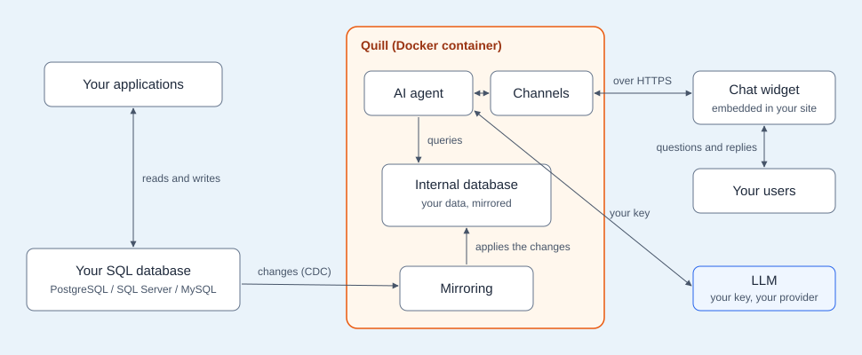
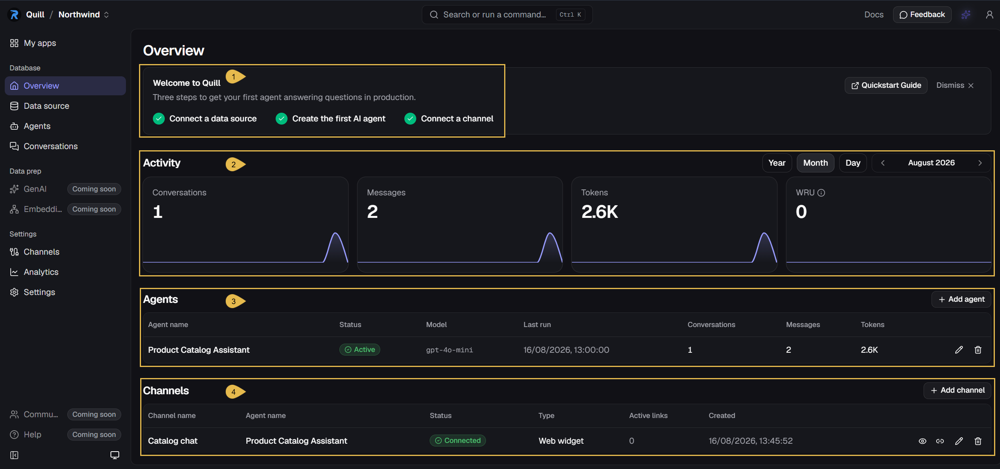

import Admonition from '@theme/Admonition';
import Panel from "@site/src/components/Panel";
import ContentFrame from "@site/src/components/ContentFrame";

# Quill: Overview
<Admonition type="note" title="">

* Databases like PostgreSQL, SQL Server, and MySQL lack AI capabilities that could greatly improve user experience.  
  For example, a company that runs one of these databases may want to offer its website visitors a chat widget that answers
  their questions using the company's live data.  
  To accomplish this, the company would have to either build the chat widget interface from scratch, an effort that requires
  expertise in AI, databases, and security, or migrate to a database that already offers such capabilities, a major
  undertaking as well.

  **Quill** is a ready-made alternative that spares you both efforts: it runs as a service in a Docker container beside your
  database, reads your live data using access details you provide, and publishes AI interfaces (like the chat widget mentioned
  above) that offer your users the AI experience you want to incorporate.  
  Your existing infrastructure, including your data, workflows, and applications, remains unchanged.
  
* Quill reads from your database only to mirror part of your data: you select the tables it may draw answers from, and
  Quill keeps a live copy of these tables in an internal database.  
  Replies are drawn from this internal database, while your own database goes on serving your applications exactly as before.

* Getting Quill running is a guided process, from the sign-up page, through a setup wizard, to a working AI interface for your users.  
  Once this process is complete, day-to-day management is done using Quill's dashboard, including changes to the mirrored
  data and to the user-facing side, like the chat widget, as well as usage and license tracking.

* In this article:
   * [What Quill is](overview.mdx#what-quill-is)
   * [How the parts work together](overview.mdx#how-the-parts-work-together)
      * [The components](overview.mdx#the-components)
      * [Answering questions](overview.mdx#answering-questions)
      * [One Quill, several apps](overview.mdx#one-quill-several-apps)
   * [What is public and what is protected](overview.mdx#what-is-public-and-what-is-protected)
   * [From sign-up to a working chat](overview.mdx#from-sign-up-to-a-working-chat)
   * [The management dashboard](overview.mdx#the-management-dashboard)
   * [Working with Quill using code](overview.mdx#working-with-quill-using-code)

</Admonition>

<Panel heading="What Quill is">

Quill is a complete AI service for your PostgreSQL, SQL Server, or MySQL database, packaged as a single Docker container.

Quill's Docker container includes everything Quill runs:

* The machinery that mirrors your source database's tables
* An internal database that holds the mirrored data
* AI agents that talk with your users, query the mirrored data, and compose the replies
* The channels that carry the conversations, like the chat widget on your site
* Quill's management dashboard

</Panel>

<Panel heading="How the parts work together">

Parts of the Quill service and the data flow between them:



<ContentFrame>

### The components

#### Your applications

* Your applications, like your online store or your in-house tools, keep reading from and writing to your SQL database as usual.
* Quill takes no part in this traffic.

#### Your SQL database

* Your existing SQL database: PostgreSQL, SQL Server, or MySQL.
* Quill reaches your database using a connection string you provide, and reads only the tables you select.
* Your data is only read, never modified.

#### Mirroring

* Quill begins mirroring your data by reading the selected tables from your SQL database in full, and copies their current
  contents into its internal database.  
  This initial operation may take some time when large tables are copied; if the operation is interrupted, Quill will
  resume it where it stopped rather than start over.
* To keep its internal database current, Quill uses your database's **change-recording** facility.
  * PostgreSQL, SQL Server, and MySQL each provide a built-in facility that records every change made to the data.
  * Quill continuously reads this record of changes, and applies each insert, update, and deletion made in the selected
    tables to the internal database.  
    Preparing the change-recording facility for the selected tables is part of Quill's setup; if permissions are
    missing, Quill will provide the exact script for your database admin to run.
* The change-tracking technique described here is called **CDC (Change Data Capture)**.  
  A reader of the recorded changes, like Quill, is called a **CDC sink**.  
  The term "CDC" appears in Quill's dashboard as well, naming the views and settings related to mirroring.

#### Internal database

* The result is a **mirrored database**: a live copy of the selected tables, kept current as your data changes.
* Quill's internal database is a RavenDB document database, and Quill therefore stores the mirrored data not in tables but
  as JSON documents.  
  During setup, Quill suggests how the rows of each selected table become documents, and you can accept or adjust the
  suggestion.  
  For example, a customer's orders, read from your SQL database, can be stored in the **customer** document, or kept as
  separate **order** documents that link to the **customer** document.

#### AI agent

* Agents are AI components that Quill uses to handle user conversations.
* You can provide your agents with **query tools** and **actions**, and the agents will apply both freely during
  conversations.
  * An agent will use a **query tool** to retrieve from Quill's internal database data required by a user, and then
    answer the user based on the retrieved data.
  * An agent will use an **action** to send a request to a web address on behalf of the user, e.g., to open a support
    ticket in an external system.
* Agents use the LLM (Large Language Model) to phrase their replies.

#### Channels

* A channel carries the conversations between your users and an agent: user messages reach the agent through the
  channel, and replies return the same way.
* Each channel is bound to a single agent.
* An agent can serve several channels at once.

#### Chat widget

* A chat widget is a **Web widget** channel, embedded in a page of your site.
* Several chat widgets can serve your site, each carrying conversations to its own agent (e.g., a product assistant on
  the catalog page, and a support assistant on the orders page).

#### Your users

* Users need no account with Quill and no knowledge of it: they simply type questions into the chat widget and get the
  agent's replies in return.

#### LLM

* Quill connects to an LLM provider (OpenAI, Azure OpenAI, or Ollama) using access details that you provide. To connect
  to OpenAI, for example, you will need to provide your OpenAI API key.
* Agents draw their answers from Quill's internal database (mirroring your SQL database), so their replies to users
  are based on your actual, current data records rather than on the LLM's general knowledge.

</ContentFrame>

<ContentFrame>

### Answering questions

Each exchange between a user and an agent starts at the chat widget and is answered from the mirrored database, a full
RavenDB database running inside the Docker container.

* When a user types a question in the chat widget, the agent queries the mirrored database for the data the answer needs.
* The agent passes the query results to the LLM, and the LLM phrases the reply.
* The reply returns to the user's chat widget.  
  Your SQL database takes no part in answering.
* Quill keeps each chat as a conversation: the full exchange between the user and the agent is available in the dashboard.

</ContentFrame>

<ContentFrame>

### One Quill, several apps

* An **app** groups the working parts described above: a connection to one source database, the mirrored database
  built from it, and the agents and channels that answer from this database.
* A single Quill container can run several apps, each with its own source, mirrored database, agents, and channels
  (e.g., one app for your store and another for your support system).
* Quill's dashboard lists your apps side by side and is where you create and manage them.

</ContentFrame>

</Panel>

<Panel heading="What is public and what is protected">

Keeping Quill secure is part of the package: at sign-up, Quill receives its own web address and TLS certificates,
so its management dashboard and the [chat widget](overview.mdx#chat-widget) it runs are served over HTTPS from the
moment Quill first starts, with no certificate handling on your side.

* Quill reaches [your SQL database](overview.mdx#your-sql-database) using the access details you provide; your data
  is only read, never modified.
* Chat widget pages are the only public part of the service.
* A chat widget page is reached through an **embed link** you place in your page.  
  Each link expires, serves a limited number of exchanges, and can be revoked at any time.
* Quill's management dashboard requires the API key you receive at sign-up.
* Direct access to [Quill's mirrored database](overview.mdx#internal-database) requires a client certificate.
* Quill reaches the [LLM provider](overview.mdx#llm) under your own account, using the access details your provider
  requires.
* All traffic runs over HTTPS, using the TLS certificates issued at sign-up.

</Panel>

<Panel heading="From sign-up to a working chat">

The stages below establish a **Quill deployment**: a running Quill container with a web address, a license, and a
management dashboard of its own.

The road from sign-up to a working AI interface:

1. **Sign-up**  
   *The deployment gets its identity.*  
   On the sign-up page, you choose a name for the new deployment and provide the address of the machine that will
   run Quill; the name becomes the deployment's web address.  
   The page returns a license key, an API key, and a ready-to-run install command.

2. **First start**  
   *Quill starts running on your machine.*  
   The install command downloads Quill and starts its Docker container.  
   During this first start, Quill activates itself using the license key, and then exposes the management dashboard
   over HTTPS.

3. **Database connection**  
   *Quill connects to your SQL database and starts mirroring it.*  
   A setup wizard in the management dashboard takes the connection details of your SQL database and lists the
   database's tables.  
   You select the tables that Quill will mirror, and approve or adjust the document mapping Quill suggests.  
   When the wizard completes, Quill starts mirroring the selected tables, and keeps the mirrored database current from then on.

4. **LLM connection**  
   *Quill gets access to an LLM.*  
   You store the access details of your LLM provider (e.g., an OpenAI API key) in the dashboard, as an
   **AI connection string**.  
   Agents will use this connection string to connect to the LLM and phrase their replies.

5. **Agent creation**  
   *The deployment gains its first agent.*  
   Quill examines the mirrored data and drafts a few agent configurations you can start from (e.g., a catalog
   assistant for product tables).  
   You pick a draft or configure an agent of your own, adjust the agent's tools, and test the agent in the dashboard.

6. **Channel creation**  
   *The agent goes live in your site.*  
   You create a **Web widget** channel for the agent, and generate an **embed link** through the channel.  
   An embed link placed in a page of your site will display the chat widget, live and answering from your data.

</Panel>

<Panel heading="The management dashboard">

Once a deployment runs, day-to-day management is done using Quill's **management dashboard**, reachable through the
deployment's web address.  
The dashboard opens with the deployment's apps; each app then has an overview of its own, like the one shown here:



1. The welcome banner tracks the app's three setup steps: a connected data source, a first agent, and a channel.
2. The Activity tiles follow the app's conversations, messages, and usage over the selected period.
3. The Agents table lists the app's agents, each with its status, model, and activity.
4. The Channels table lists the app's channels, each with its type, status, and active embed links.

The sidebar leads to the app's sections: the data source, the agents, the conversations, and settings like channels
and analytics.

</Panel>

<Panel heading="Working with Quill using code">

Developers can work with Quill using code as well as through the management dashboard.

* **Managing Quill through its API**  
  Your Quill deployment exposes an API; requests to this API are authenticated using the API key that sign-up
  provides.  
  The API covers Quill's management operations, like connecting a data source, creating agents and channels, and
  generating embed links.  
  e.g., your site can use the API to generate a personal embed link for each signed-in user.

  A minimal API call, listing the deployment's apps:

  ```bash
  curl -H "X-Api-Key: <your-api-key>" https://api.<your-domain>/api/apps/
  ```
* **Reading the mirrored database directly**  
  Quill's internal database is a full RavenDB database.  
  Your applications can connect to this database using RavenDB client libraries and a client certificate that the
  deployment provides.  
  e.g., an application can run full-text searches over the mirrored data without adding any load to your SQL
  database.

  Connecting with the C# client:

  ```csharp
  using var store = new DocumentStore
  {
      Urls = new[] { "https://db.<your-domain>" },
      Database = "<app-database>",
      Certificate = new X509Certificate2("quill.client.pfx")
  };
  store.Initialize();
  ```
* **Embedding the chat widget**  
  Quill delivers each embed link as a ready-made HTML segment.  
  A developer can add this segment to the code of any of your site's pages; the page will then display the chat
  widget.

  ```html
  <iframe src="https://public.<your-domain>/apps/<app-slug>/embed/<link-token>"
          width="400" height="600"></iframe>
  ```

</Panel>

