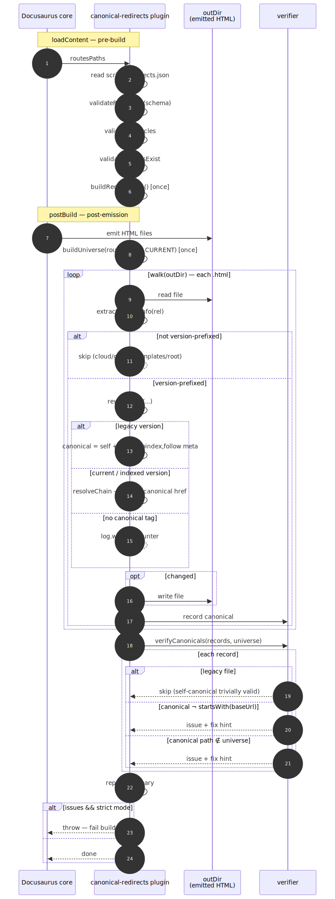

# canonical-redirects-plugin

Build-time Docusaurus plugin that rewrites `<link rel="canonical">` across every emitted HTML file so a page which moved or renamed in the current version advertises its new home, and legacy-version pages self-canonicalise. After rewriting, every canonical is verified against the real Docusaurus route universe — a strict build fails on a dead target.

Source of truth: `scripts/redirects.json`, read by both this plugin (build time) and `scripts/handle_redirects.js` (CloudFront Function at request time).

## Why a plugin, not a script

A plugin gets `routesPaths` from Docusaurus directly. A post-build script would have to walk the filesystem, parse emitted HTML to guess what's valid, and duplicate version bookkeeping. The plugin also runs `loadContent` **before any HTML is written**, so a malformed `redirects.json` fails the build fast rather than partway through emission. `postBuild` integrates cleanly with `DOCUSAURUS_STRICT` and the separate `DOCUSAURUS_STRICT_CANONICALS` gate.

## Validation gates

Three independent checks run on `redirects.json`. Each returns the same `ValidationError[]` shape so the CLI (`npm run validate-redirects`) and the plugin's `loadContent` render them uniformly.

| Gate                   | Enforces                                                                    | Where it runs                           |
| ---------------------- | --------------------------------------------------------------------------- | --------------------------------------- |
| `validateRedirects`    | Schema: `key` + `targetUrl` are absolute paths, `minimumVersion` is present and `MAJOR.MINOR`, no duplicate keys | CLI + plugin `loadContent`              |
| `validateNoCycles`     | No redirect cycle (two-rule, N-rule, or self-loop)                          | CLI + plugin `loadContent`              |
| `validateTargetsExist` | Every `targetUrl` resolves to a real `.mdx`/`.md` file in the content tree  | CLI + plugin `loadContent`              |

`minimumVersion` is **required** on every rule. Both the edge handler and the build-time resolver gate unconditionally — no `undefined` guard. For non-versioned areas (`/guides`, `/cloud`), the value is a schema formality; the edge branches for those paths redirect regardless of it.

`validateTargetsExist` maps `targetUrl` to a content root:

- `/guides/…` → `<projectRoot>/guides/`
- `/cloud/…` → `<projectRoot>/cloud/`
- `/templates/…` → `<projectRoot>/templates/`
- anything else → `<projectRoot>/docs/` (the current-version tree)

It accepts `<rel>.mdx`, `<rel>.md`, `<rel>/index.mdx`, or `<rel>/index.md`. Bare directories with only `_category_.json` are rejected — redirects should land on a concrete page.

## Data flow



Source: [`diagrams/data-flow.mmd`](./diagrams/data-flow.mmd). See [`diagrams/README.md`](./diagrams/README.md) for regeneration.

## Redirect-chain resolution

`resolveChain(map, startPath, version)` follows hops transitively, gating each hop by its `minimumVersion`. No hop cap and no runtime `visited` set: `validateNoCycles` runs upstream (CLI + plugin `loadContent`) and makes cycles impossible by the time the rewriter calls here. Adding a runtime cycle guard would re-check an invariant that can't break and mask real bugs behind a silent early return.



Source: [`diagrams/resolve-chain.mmd`](./diagrams/resolve-chain.mmd).

## Authoring workflow

When you move or rename a page in the current version, add the matching redirect entry in the same PR. The verifier surfaces misses on the next strict build.

### FAQ — multi-move chains

> *I moved the same page twice — it lived at three different locations across three versions. Do I edit the first redirect to point at the new final location?*

**No.** Add a second redirect whose `key` is the middle location and whose `targetUrl` is the final location. Keep the first rule untouched. Set `minimumVersion` on each hop so older versions still resolve to the middle location, not past it.

Example — page moved in 7.1 from `/old` to `/mid`, then again in 7.2 from `/mid` to `/new`:

```json
{ "key": "/old", "value": { "targetUrl": "/mid", "minimumVersion": "7.1" } },
{ "key": "/mid", "value": { "targetUrl": "/new", "minimumVersion": "7.2" } }
```

- A reader on 7.1 hitting `/old` resolves to `/mid`. The second rule's `minimumVersion: "7.2"` gates further hopping — correct, `/new` doesn't exist on 7.1.
- A reader on 7.2 hitting `/old` resolves all the way to `/new` — a single 301 at the edge, a terminal canonical at build.

Same file, two readers, one HTTP hop per request regardless of chain depth.

## Failure modes

- **`no <link rel="canonical"> tag found in emitted HTML`** in the verifier output. Docusaurus stamps a canonical on every page today, so a miss means its HTML emission changed. Inspect a versioned file and update `CANONICAL_TAG_REGEX` in `lib/rewrite.ts` to match the new shape. Strict builds fail on this.
- **`invalid canonical` / `canonical path is not in the current-version route universe`**. A page moved or renamed without a matching redirect. Paste the `fix:` block from the error output into `scripts/redirects.json`, set `targetUrl` to the new path, re-run `npm run validate-redirects`, then the strict build.
- **`redirect cycle detected: /a → /b → /a`** from `validateNoCycles`. Two or more rules point at each other. Fix the offending chain in `redirects.json`.
- **`targetUrl does not resolve to an existing document`** from `validateTargetsExist`. The target path has no `.mdx` / `.md` file under the expected content root. Either correct the target or create the landing page.
- **`'value.minimumVersion' is required and must be a "MAJOR.MINOR" string`** from `validateRedirects`. Add `"minimumVersion": "7.2"` (or whichever version applies) to the offending entry.

## Performance

Single-pass. `redirectMap` is built once in `loadContent`. `universe` is built once in `postBuild`. `walk(outDir)` traverses once. `resolveChain` is invoked per file but is O(1) with today's zero-chain data and O(hops) otherwise. Nothing to cache.

## Relationship to `handle_redirects.js`

`scripts/handle_redirects.js` is a CloudFront Function running at the edge. Both it and this plugin read the same `scripts/redirects.json`, but they run in different environments:

|                          | Canonical plugin (build time)                                           | Edge function (request time)                                                                |
| ------------------------ | ----------------------------------------------------------------------- | ------------------------------------------------------------------------------------------- |
| Scope                    | Rewrites `<link rel="canonical">` in emitted HTML                       | Returns 301 on live HTTP requests                                                           |
| Chain handling           | Resolves the whole chain in-process; emits the **terminal** URL         | Unbounded `while(true)` loop collapsing N-hop chains into **one 301**                       |
| Runtime guards           | None — trusts `validateNoCycles` upstream; `rule.minimumVersion &&` belt-and-braces for the versionless-key shape | Same — no `visited` set, no hop cap; `rule.minimumVersion &&` gate exists but `/guides` and `/cloud` short-circuit above the chain loop so it's only exercised by docs-area keys where the schema requires the field |
| `compareVersions` source | Plugin-local: `lib/compare-versions.ts`                                 | Inlined in `handle_redirects.js` (CloudFront Functions can't resolve project-local imports at edge time) |
| `CURRENT_VERSION` source | Imported from `scripts/lib/version-policy.js`                           | Inlined literal in `handle_redirects.js` (same constraint) |
| Drift guard              | Parity tests (`__tests__/compare-versions-parity.test.ts`) read `handle_redirects.js` as text and assert behavioural parity for `compareVersions` and literal equality for `CURRENT_VERSION` against the authoritative sources | Same tests |

Both sides are intentionally minimal: two invariants (no cycles, `targetUrl` is a non-empty string) are enforced upstream by `npm run validate-redirects` in CI and by the plugin's `loadContent`, so neither the edge nor `resolveChain` needs a `visited` set or a hop cap. The `rule.minimumVersion &&` check in the chain loop is a cheap belt-and-braces for the versionless-key shape — in practice `/guides` and `/cloud` requests short-circuit to their dedicated branches above the loop, and docs-area keys always carry a `minimumVersion` (the schema enforces it), so the guard only ever fires on the theoretical edge case of a versionless rule reaching the loop.

## Local testing

```bash
npm test                     # unit tests for redirects, rewrite, verifier, parity, edge handler
npm run validate-redirects   # schema + cycles + target-existence on scripts/redirects.json

# strict build — fails if any canonical doesn't resolve
DOCUSAURUS_VERSIONS='6.2, 7.1, current' \
  DOCUSAURUS_STRICT=true \
  DOCUSAURUS_STRICT_CANONICALS=true \
  npm run build
```

The two strict gates are deliberately separate: `DOCUSAURUS_STRICT` is Docusaurus's own (broken links, missing translations); `DOCUSAURUS_STRICT_CANONICALS` gates this plugin. The split lets you turn the plugin on without blocking the build while `redirects.json` is being backfilled, then flip the canonical gate once the verifier reports zero issues.
