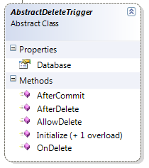

import Admonition from '@theme/Admonition';
import Tabs from '@theme/Tabs';
import TabItem from '@theme/TabItem';
import CodeBlock from '@theme/CodeBlock';
import LanguageSwitcher from "@site/src/components/LanguageSwitcher";
import LanguageContent from "@site/src/components/LanguageContent";

#Delete Triggers
Delete triggers implement the AbstractDeleteTrigger interface and follow much the same pattern as PUT triggers.



**Example: Cascading deletes**

    
```
public class CascadeDeleteTrigger : AbstractDeleteTrigger
    {
    
        public override void OnDelete(string key, TransactionInformation txInfo)
        {
            var document = Database.Get(key, txInfo);
            if (document == null)
                return;
            Database.Delete(document.Metadata.Value&lt;string&gt;("Cascade-Delete"), null, txInfo);
        }
```

    }

In this case, we perform another delete operation as part of the current delete operation. This operation is done under the same transaction as the original operation.